# 库

库是写好的现有的，成熟的，可以复用的代码。现实中每个程序都要依赖很多基础的底层库，不可能每个人的代码都从零开始，因此库的存在意义非同寻常。

本质上来说库是一种可执行代码的二进制形式，可以被操作系统载入内存执行。库有两种：**静态库（.a、.lib）**和**动态库（.so、.dll）**。

所谓静态、动态是指链接。回顾一下，将一个程序编译成可执行程序的步骤：

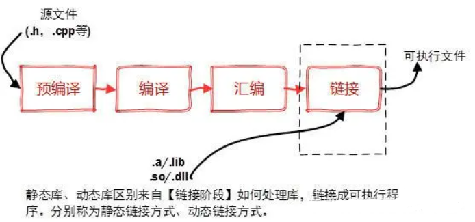

## 静态库

### 静态库编译

+ 首先，创建一个空项目(我取名叫做SMath)

+ 然后，编写头文件和源文件(不需要main函数)

  + 头文件如下`SMath.h`

    ```c
    #ifndef _SMATH_H_
    #define _SMATH_H_
    
    double s_sqrt(double v);
    double s_pow(double v, double n);
    const char* s_version();
    
    #endif //!_SMATH_H_
    ```

  + 源文件如下`SMath.c`

    ```c
    #include "SMath.h"
    #include <math.h>
    double s_sqrt(double v)
    {
        return sqrt(v);
    }
    
    double s_pow(double v, double n)
    {
        return pow(v,n);
    }
    
    const char* s_version()
    {
        return "SMath 1.0.0";
    }
    ```

  编译成功后，可以在下面看到lib文件所在位置。

  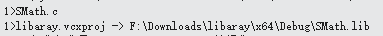

> PS：我在工程中设置的是Debug模式，也可以设置Release，在不同模式下生成的库，在调用时也需要使用相应的模式。

### 静态库使用

使用静态库，只需要`SMath.h`和`SMath.lib`，在Vs中静态库使用方式有两种。

#### 1. pragma指令加载

通过#pragma comment(lib, "xxx.lib")来加载所需要的静态库；这种方式相对简单，只需要在代码中指定要加载的静态库名称，在引用外部库比较少时相对方便一些；缺点是需要改代码并重新编译。

创建`test_SMath_lib`项目并添加如下测试代码：

```c
#include "SMath.h"
#pragma comment(lib,"SMath.lib")

#include <stdio.h>


int main()
{
	printf("version:%s\n", s_version());
	printf("2^5 = %d\n", (int)s_pow(2, 5));
	return 0;
}
```

此时还不能运行，得把SMath的头文件和库文件拷贝到新项目的工程目录下。

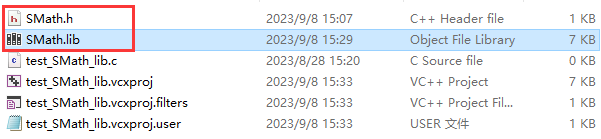

编译通过后，执行结果如下：(如有错误请看[注意事项](#注意事项))

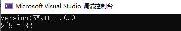

#### 2. 配置属性加载

该方式不使用`#pragma comment(lib, "xxx.lib")`，而是直接在属性页“VC++目录/链接器/输入”中写上`xxx.lib`。

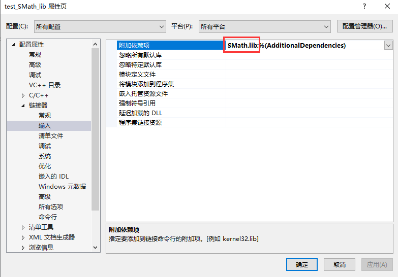

然后把测试代码中的`#pragma`指令删掉：

```c
#include "SMath.h"
#include <stdio.h>

int main()
{
	printf("version:%s\n", s_version());
	printf("2^5 = %d\n", (int)s_pow(2, 5));
	return 0;
}
```

编译通过后，执行结果如下：(如有错误请看[注意事项](#注意事项))


那么疑问来了，每当我修改头文件和重新生成库文件时，我都需要重新拷贝到测试项目中，这样岂不是很麻烦？而且太多的第三方的头文件和库文件也会让我的工程目录变得杂乱？有没有不拷贝的更好的方法呢？

有的，我们直接在属性页“VC++目录”中，设置“包含目录”和“库目录”。

+ 由于我们已经把头文件和库文件拷贝到当前工程目录下，所以这里直接设置成当前工程目录即可。

  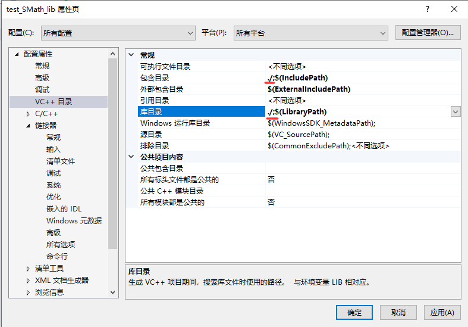

+ 当然，为了方便测试，我们应该直接配置SMath项目相关的目录，这样，当修改或重新生成之后，就无需修改测试项目了。先把测试项目中的头文件和库文件删掉，然后配置目录如下：

  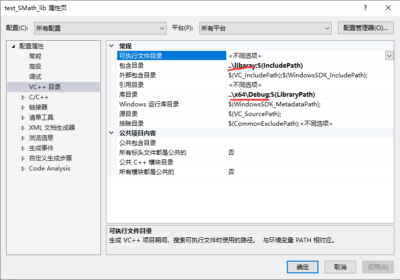

  PS：相对路径和绝对路径都可以，优先相对路径，这样就算项目拷贝到别的位置也是可以使用的。

### 注意事项

1. 如果你的库要提供给C语言使用，生成库的时候，源文件拓展名一定要是`.c`，否则库可以链接，但是缺提示函数未定义。

2. 如果你的库要**提供给C++使用**，需要在头文件内用`extern “C”{...}`把所有函数申明包裹起来；以引导C++编译器以C语言的符号格式去库里面查找需要的函数。

   + 把测试文件拓展名改为.cpp

   + 编译运行，发现两个error，提示找不到外部符号s_pow、s_version，其实就是找不到函数的定义。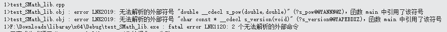

   + 这里虽然库，链接成功了，但是在库中却找不到函数，什么情况呢？这是因为C语言和C++生成的符号规则不一样，按照C++的方式去C语言库里面找肯定找不到；必须让编译器以C语言的方式去库里面找才行。

   + 修改头文件如下：

     ```c
     #pragma once
     
     #ifdef __cplusplus //如果是C++包含的头文件
     extern "C"{		   //告诉编译器以C语言的方式来读取符号
     #endif // DEBUG
     
     	double s_sqrt(double v);
     	double s_pow(double v, double n);
     	const char* s_version();
     
     #ifdef __cplusplus 
     }				//最后的结束标记
     #endif // DEBUG
     ```

3. 项目版本和位数必须和库的版本和位数一致，否则无法编译成功。

   1. Release 对 Release      Debug 对 Debug

   2. x64 对 x64                     x86 对x86

   3. 所以一般的库都会给你提供四个版本的.lib文件

      ```c
      --x64				
       -xxx.lib			//release版本
       -xxx_D.lib			//debug版本
      --x86
       -xxx.lib			//release版本
       -xxx_D.lib   		//debug版本
      ```

      有的更离谱，他又分为UNICODE字符集版本和宽字节字符集版本，这样组合起来就更多了。

## 动态库

动态库相较于静态库的优势是，可以在程序运行时，调用到相应的库函数的时候，才会加载动态库，而不是像静态库那样在编译阶段就将库加载到程序中。由于不需要预先加载，使用动态库可以使得编译出来的可执行文件不至于过大。

### 动态库编译

还是以SMath项目为例，先把所有生成的目录都删掉，并把项目类型更改为dll动态库项目。

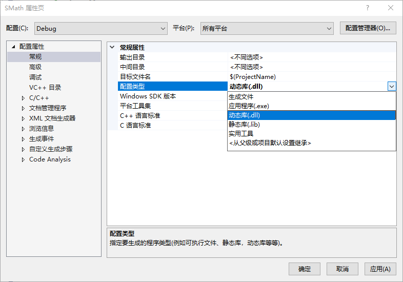

并修改头文件如下：

```c
#pragma once

#ifdef __cplusplus 
extern "C"{
#endif // DEBUG

#ifdef SMATH_EXPORT							//是否导出
#define SMATH_API __declspec(dllexport)
#else										//否则导入
#define SMATH_API __declspec(dllimport)		
#endif	// !SMATH_API 

	SMATH_API double s_sqrt(double v);
	SMATH_API double s_pow(double v, double n);
	SMATH_API const char* s_version();

#ifdef __cplusplus 
}
#endif // DEBUG
```

这里使用了条件编译，来判断是库的导出还是导入；当需要导出库时，在属性页预定义`SMATH_EXPORT`宏即可；对于使用库方来说，不需要任何的处理，即可使用。

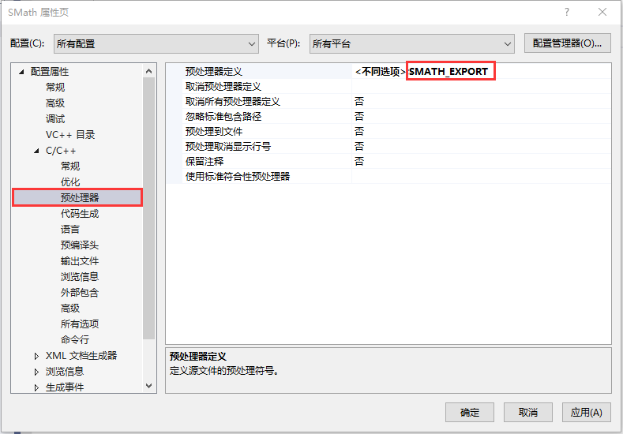

编译并生生成，发现生成了SMath.lib和SMath.dll文件；

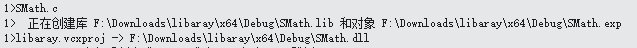

> 注意：这里的.lib文件和静态库的.lib文件虽然都是.lib文件，但是包含的内容并不一样。
>
> + 静态库中的lib：包含函数代码本身(包括函数的索引和实现)，在编译时直接将代码加入程序当中。
>
> + 动态库中的lib：包含函数所在的dll文件和文件中函数位置的索引，函数实现的代码由运行时加载到进程空间中的dll提供。
>
> 所以：lib是编译时用到的，dll是运行时用到的。如果要完成代码的编译，只需要lib，如果要使动态链接的程序运行起来，只需要dll。

### 动态库使用

动态库的使用分为隐式链接和显示链接，其实这两种链接方式只是dll的两种不同的加载方式而已。

#### 隐式链接

基本步骤和链接静态库一致，就是将.dll、.lib、.h文件拷贝到调用库文件的工程目录下，通过在调用代码中包含库的头文件、并通过#pragma comment(lib,"xxx.lib")加载动态链接库中的信息或者配置依赖项，实现对动态库DLL的调用，示例代码如下：

```c
#include "SMath.h"
#include <stdio.h>

int main()
{
	printf("version:%s\n", s_version());
	printf("2^5 = %d\n", (int)s_pow(2, 5));

	return 0;

}
```

测试代码并没有任何变化，值得注意的是dll是自动加载的，因为已经拷贝到了项目目录（其实dll最好和exe放在一起），如果将它移除，再运行程序，会发现提示找不到SMath.dll。

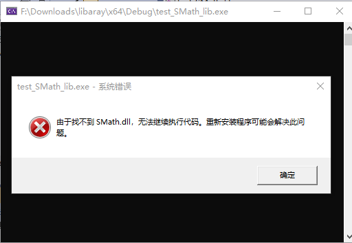

> 有好几种种方式可以让exe运行的时候找到dll并加载：
>
> + dll放在项目目录(和源文件放在一块)
> + dll和exe放在同一个目录
> + 配置dll所在的路径到环境变量path

#### 显示链接

显式链接是借助Windows库的LoadLibrary来显式地加载DLL库，这种方式不需要注册.lib文件，且只在需要的地方加载DLL库即可。代价是代码略显复杂。

```c
#include <stdio.h>
#include <windows.h>
int main()
{
	HMODULE module = LoadLibrary("./plugs/SMath1.dll");
	if (!module)
	{
		printf("模块加载失败:%d\n",GetLastError());
	}
	else
	{
		typedef const char* (*s_version_fun)();
		s_version_fun s_version = (s_version_fun)GetProcAddress(module, "s_version");
		printf("version:%s\n", s_version());

		typedef double (*s_pow_fun)(double,double);
		s_pow_fun s_pow = (s_pow_fun)GetProcAddress(module, "s_pow");
		printf("2^5 = %d\n", (int)s_pow(2, 5));
		
	}
	if (module)
		FreeModule(module);
	
	return 0;
}
```


### 注意事项

使用预编译让同一个库，可以很方便的以静态库或动态库的方式。

```c
#pragma once

#ifdef __cplusplus 
extern "C"{
#endif // DEBUG

#ifdef SMATH_STATIC_LIB
	#define SMATH_API 
#elif defined(SMATH_SHARED_LIB)
	#ifdef SMATH_EXPORT
		#define SMATH_API __declspec(dllexport)
	#else
		#define SMATH_API __declspec(dllimport)
	#endif	// !SMATH_API 
#else
	#define SMATH_API 
#endif // !SMATH_STATIC_LIB

	SMATH_API double s_sqrt(double v);
	SMATH_API double s_pow(double v, double n);
	SMATH_API const char* s_version();

#ifdef __cplusplus 
}
#endif // DEBUG
```

+ 如果要生成静态库，需要把项目类型改为.lib并预定义`SMATH_STATIC_LIB`宏。
  + 使用静态库，不要加任何的宏

+ 如要要生成动态库，需要把项目类型改为.dll并预定义`SMATH_SHARED_LIB`和`SMATH_EXPORT`宏
  + 使用动态库，需要加上`SMATH_SHARED_LIB`宏

