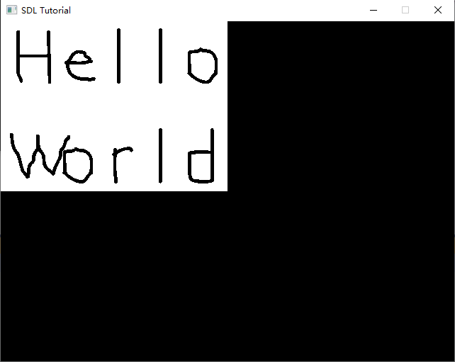

# 在屏幕上显示一张图片


既然你已经配置好了SDL， 是时候来建立一个能加载并显示一张图片的基本图形程序了。

```c
//启动SDL并创建窗口
bool initSDL();

//加载媒体
bool loadMedia();

//释放媒体并关闭SDL
void closeSDL();
```

在第一个教程中，我们将所有内容都放在 main 函数中。由于它是一个小程序，我们可以这样，但在实际程序中，代码尽可能模块化。这意味着你的代码是整齐的块，每个块都易于调试和重用。

这意味着我们有处理初始化、加载媒体和关闭 SDL 应用程序的函数。我们在源文件的顶部附近声明这些函数。

```c
//要渲染的窗口指针
SDL_Window* gWindow = NULL;
    
//窗口包含的表面
SDL_Surface* gScreenSurface = NULL;

//我们将载入并显示在屏幕上的图像
SDL_Surface* gHelloWorld = NULL;
```

这里我们声明了一些全局变量。通常，你应该避免在大型程序中使用全局变量。我们在这里这样做的原因是因为我们希望源代码尽可能简单，但是在大型项目中全局变量会使事情变得更加复杂。由于这是一个单一的源文件程序，我们不必太担心。

这是一种称为 SDL 表面的新数据类型。SDL 表面只是一种图像数据类型，它包含图像的像素以及渲染它所需的所有数据。SDL 表面使用软件渲染，这意味着它使用 CPU 进行渲染。可以渲染硬件图像，但它有点困难，所以我们将首先通过简单的方法学习它。在以后的教程中，我们将介绍如何渲染 GPU 加速图像。

我们将在这里处理的图像是屏幕图像（您在窗口内看到的）和我们将从文件加载的图像。

请注意，这些是指向 SDL 表面的指针。原因是 :

1. 我们将动态分配内存来加载图像
2. 最好按内存位置引用图像。想象一下，你有一个砖墙游戏，由多次渲染的相同砖块图像组成（如超级马里奥兄弟）。当您可以拥有图像的一个副本并一遍又一遍地渲染它时，在内存中拥有数十个图像副本是很浪费的。

另外，请始终记住初始化您的指针。我们在声明它们时立即将它们设置为 NULL。

```c
bool initSDL()
{
    //初始化SDL
    if (SDL_Init(SDL_INIT_VIDEO) < 0)
    {
        SDL_Log("SDL could not initialize! SDL_Error: %s\n", SDL_GetError());
        return false;
    }
    else
    {
        //创建窗口
        gWindow = SDL_CreateWindow("SDL Tutorial", SDL_WINDOWPOS_UNDEFINED, SDL_WINDOWPOS_UNDEFINED, SCREEN_WIDTH, SCREEN_HEIGHT, SDL_WINDOW_SHOWN);
        if (gWindow == NULL)
        {
            SDL_Log("Window could not be created! SDL_Error: %s\n", SDL_GetError());
            return false;
        }
        else
        {
            //获取窗口表面
            gScreenSurface = SDL_GetWindowSurface(gWindow);
        }
    }

    return true;
}
```

在上面的代码中，我们已经获取了SDL初始化和窗口创建代码，并将其放在自己的函数中。 

我们想在窗口内显示图像，为了做到这一点，我们需要获得窗口内的图像。 因此，我们调用SDL_GetWindowSurface来获取窗口所包含的表面。  

```c
bool loadMedia()
{
    //加载图片
    gHelloWorld = SDL_LoadBMP("assets/02/hello_world.bmp");
    if (gHelloWorld == NULL)
    {
        SDL_Log("Unable to load image %s! SDL Error: %s\n", "assets/02/hello_world.bmp", SDL_GetError());
        return false;
    }

    return true;
}
```

在加载媒体功能中，我们使用 SDL_LoadBMP 加载我们的图像。SDL_LoadBMP 接受 bmp 文件的路径并返回加载的表面。如果该函数返回 NULL，则意味着它失败，因此我们使用 SDL_GetError 将错误打印到控制台。

需要注意的重要一点是，这段代码假设您的工作目录中有一个名为“assets/02”的目录，其中包含一个名为“hello_world.bmp”的图像。工作目录是您的应用程序认为它正在运行的地方。通常，您的工作目录是可执行文件所在的目录，但某些程序（如 Visual Studio）会将工作目录更改为 vcxproj 文件所在的位置。因此，如果您的应用程序找不到该图像，请确保它位于正确的位置。

同样，如果程序正在运行但无法加载图像，则您可能有工作目录问题。工作目录的功能因操作系统和 IDE 不同而异。

```c
void closeSDL()
{
    //释放表面内存
    SDL_FreeSurface(gHelloWorld);
    gHelloWorld = NULL;

    //销毁窗口
    SDL_DestroyWindow(gWindow);
    gWindow = NULL;

    //退出SDL子系统
    SDL_Quit();
}
```

在我们的清理代码中，我们像以前一样销毁窗口并退出SDL，但我们还必须注意我们装载的表面。 我们通过使用sdl_freessurface来释放它。 不要担心屏幕表面，SDL_DestroyWindow会处理它。  

当指针没有指向任何东西时，请确保养成让指针指向NULL的习惯。  

```c
int main( int argc, char* args[] )
{
    //启动SDL并创建窗口
    if( !initSDL() )
    {
        SDL_Log( "Failed to initialize!\n" );
    }
    else
    {
        //加载媒体
        if( !loadMedia() )
        {
            SDL_Log( "Failed to load media!\n" );
        }
        else
        {
            //在窗口上显示图片
            SDL_BlitSurface( gHelloWorld, NULL, gScreenSurface, NULL );
```

在我们的主函数中，我们初始化 SDL 并加载图像。如果成功，我们使用 SDL_BlitSurface 将加载的表面 blit 到屏幕表面上。

块传输的作用是获取源表面并将其副本标记到目标表面上。SDL_BlitSurface 的第一个参数是源图像。第三个参数是目的地。我们将在以后的教程中学习第二个和第四个参数。

现在，如果这是我们唯一的绘图代码，我们仍然不会在屏幕上看到我们加载的图像。还差一步。

```c
            //更新窗口表面
            SDL_UpdateWindowSurface( gWindow );
```

在屏幕上绘制了我们想要为该帧显示的所有内容后，我们必须使用 SDL_UpdateWindowSurface 更新屏幕。当你在屏幕上绘图时，你通常不会在屏幕上看到你看到的图像。默认情况下，大多数渲染系统都是双缓冲的。这两个缓冲区是前缓冲区和后缓冲区。

当你进行像 SDL_BlitSurface 这样的绘制调用时，你渲染到后台缓冲区。您在屏幕上看到的是前端缓冲区。我们这样做的原因是因为大多数框架需要在屏幕上绘制多个对象。如果我们只有一个前端缓冲区，我们将能够看到正在绘制的帧，这意味着我们会看到未完成的帧。所以我们要做的是首先将所有内容绘制到后台缓冲区，完成后我们交换后台缓冲区和前台缓冲区，这样现在用户就可以看到完成的帧了。

这也意味着您不会在每个 blit 之后调用 SDL_UpdateWindowSurface，只有在当前帧的所有 blit 都完成之后才会调用。

```c
            //等待2秒
            SDL_Delay( 2000 );
        }
    }

    //释放资源和关闭SDL
    closeSDL();

    return 0;
}
```

现在我们已经把所有东西都渲染到了窗口上，我们延迟了两秒钟，这样窗口就不会消失了。等待完成后，我们关闭我们的程序。



