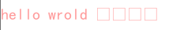
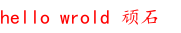
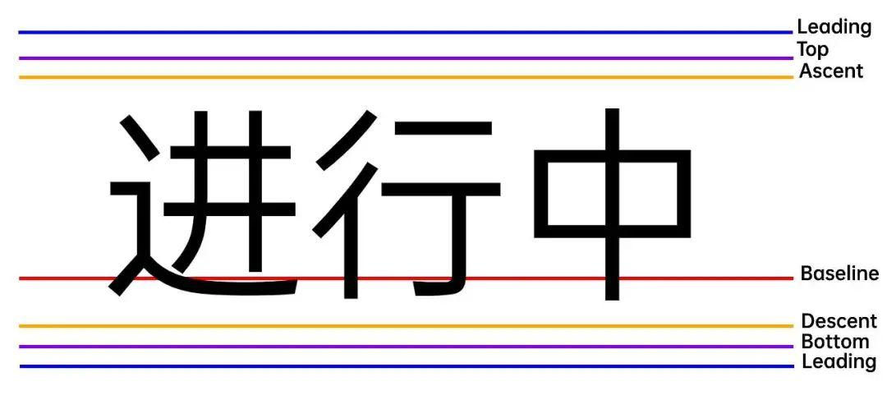

## SDL 简介

### 什么是 SDL？

Simple DirectMedia Layer 是一个跨平台开发库，旨在通过 OpenGL 和 Direct3D 提供对音频、键盘、鼠标、游戏杆和图形硬件的低级访问。它被视频播放软件、模拟器和流行游戏使用，包括[Valve](http://valvesoftware.com/)的获奖目录和许多[Humble Bundle](https://www.humblebundle.com/)游戏。

SDL 正式支持 Windows、Mac OS X、Linux、iOS 和[Android](https://wiki.libsdl.org/Android)。可以在源代码中找到对其他平台的支持。

SDL 是用 C 编写的，在本机上与 C++ 一起使用，并且有适用于其他几种语言的绑定，包括 C# 和 Python。

SDL 2.0 在[zlib 许可](http://www.gzip.org/zlib/zlib_license.html)下分发。此许可证允许您在任何软件中自由使用 SDL。简单直接媒体层库 (SDL) 是一个通用 API，它提供对音频、键盘、鼠标、游戏杆、通过 OpenGL 的 3D 硬件以及跨多个平台的 2D 帧缓冲区的低级别访问。

### SDL 可以做什么？

**视频**

- 3D图形：SDL 可与 OpenGL API 或 Direct3D API 结合使用，用于 3D 图形
- 加速 2D 渲染 API：支持简单的旋转、缩放和 alpha 混合，所有这些都使用现代 3D API 加速，使用 OpenGL 和 Direct3D 支持加速
- 创建和管理多个窗口

**输入事件**

- 提供的事件和 API 函数用于：
  - 应用程序和窗口状态更改
  - 鼠标输入
  - 键盘输入
  - 操纵杆和游戏控制器输入
  - 多点触控手势
- 可以使用[SDL_EventState](https://wiki.libsdl.org/SDL_EventState) ()启用或禁用每个事件
- 事件在发布到内部事件队列之前通过用户指定的过滤器函数
- 线程安全事件队列

**力反馈**

- Windows、Mac OS X 和 Linux 支持力反馈

**音频**

- 设置8位和16位音频、单声道立体声或5.1环绕声的音频播放，如果硬件不支持格式，可选择转换
- 音频在单独的线程中独立运行，通过用户回调机制填充
- 专为定制软件混音器设计，但[SDL_mixer](http://www.libsdl.org/projects/SDL_mixer/)提供完整的音频/音乐输出库

**文件 I/O 抽象**

- 用于打开、读取和写入数据的通用抽象
- 对文件和内存的内置支持

**共享对象支持**

- 加载共享对象（Windows 上的 DLL，Mac OS X 上的 .dylib，Linux 上的 .so）
- 共享对象中的查找函数

**线程**

- 简单的线程创建API
- 简单线程本地存储API
- 互斥体、信号量和条件变量
- 无锁编程的原子操作

**计时器**

- 获取经过的毫秒数
- 等待指定的毫秒数
- 在单独的线程中创建与代码一起运行的计时器
- 使用高分辨率计数器进行分析

**CPU 特性检测**

- 查询CPU数量
- 检测 CPU 特性和支持的指令集

**大端小端支持**

- 检测当前系统的字节序
- 用于快速交换数据值的例程
- 读取和写入指定字节序的数据

**电池管理**

- 查询电源管理状态

### SDL 在哪些平台上运行？

**Windows**

- 使用 Win32 API 进行显示，利用 Direct3D 进行硬件加速
- 使用 DirectSound 和 XAudio2 作为声音

**Mac OS X**

- 使用 Cocoa 进行视频显示，利用 OpenGL 进行硬件加速
- 使用 Core Audio 播放声音

**Linux**

- 使用 X11 进行视频显示，利用 OpenGL 进行硬件加速
- 使用 ALSA、OSS 和 PulseAudio API 来处理声音

**IOS**

- 使用 UIKit 进行视频显示，利用 OpenGL ES 2.0 进行硬件加速
- 使用 Core Audio 播放声音

**Android**

- 使用 JNI 接口进行视频显示，利用 OpenGL ES 1.1 和 2.0 进行硬件加速
- 对声音使用 JNI 音频回调


## 如何获取和安装 SDL

### SDL2库下载

+ SDL2 核心库 [SDL2](https://libsdl.org/download-2.0.php)

+ SDL2 拓展库 [SDL2_image、SDL2_ttf、SDL2_mixer、SDL2_net](https://libsdl.org/projects/)

+ SDL2 第三方绘图库[SDL2_gfx 官网](https://www.ferzkopp.net/wordpress/2016/01/02/sdl_gfx-sdl2_gfx/)     [SDL2_gfx Github](https://github.com/topics/sdl2-gfx)

### 安装SDL2

1. 点击[SDL2 核心库下载](https://libsdl.org/download-2.0.php)下载SDL2库，进入GitHub下载。


2. 下载出来会有一个压缩包，放到一个合适的目录(记住这个目录哦，经常要用的)，解压。


3. 进入解压后的目录，如下图：
   1. cmake：cmake配置文件
   2. docs：文档目录，只不过都是英文的
   3. include：头文件目录，编程需要的
   4. lib：库目录(静态库和动态库都有)


4. 给环境变量添加库目录，让程序运行的时候能够找到动态库。<font style="color:red">PS：配置好了记得重启Vs</font>


### VS中使用SDL2

1. 创建一个空项目，如下图：


2. 进入菜单栏的项目->属性->VC++ 目录，配置包含目录和库目录(详见下图)，注意库目录的版本和你的项目版本要一直哦(图中两个三角形标记的位置，我这是x64的)。


3. 不要离开，还有静态库需要配置，进入链接器->输入->点击附加依赖项->填入SDL2.lib和SDLmain2.lib，然后确定就好


4. 最后加入如下代码，Ctrl+F5运行

```c
#include<SDL.h>

int main(int argc,char*argv[])
{
	//初始化SDL
	if (SDL_Init(SDL_INIT_VIDEO) <0)
	{
		SDL_Log("can not init SDL:%s", SDL_GetError());
		return -1;
	}

	return 0;
}
```


如果能出现黑窗口并且，没有任何错误提示，那么就恭喜你啦，SDL配置完成~(不过麻烦的是每次创建新项目和在x86、x64之间切换时，都要进行配置~后面将讲解更方便的方法)！

SDL 作为动态链接库。动态链接库包含 3 个部分：

- 头文件 (Library.h)
- 库文件（Windows 的Library.lib 或 *nix 的libLibrary.a）
- 二进制文件（Windows 的Library.dll 或*nix 的Library.so）

你的编译器需要能够在编译时找到头文件，以便它知道SDL 函数和结构是什么。可以将编译器配置为在 SDL 头文件所在的附加目录中进行搜索，或者将头文件与编译器附带的其余头文件一起放入。如果编译器提示找不到 SDL.h，则意味着头文件不在编译器查找头文件的位置。

在编译器编译所有源文件后，它必须将它们链接在一起。为了使程序正确链接，它需要知道所有函数的地址，包括 SDL 函数的地址。对于动态链接库，这些地址在库文件中。库文件具有导入地址表，因此您的程序可以在运行时导入函数。与头文件一样，您可以将编译器配置为在 SDL 库文件所在的附加目录中进行搜索，或者将库文件与编译器附带的其余库文件一起放入。您还必须告诉链接器链接到链接器中的库文件。如果链接器报错找不到-lSDL或SDL2.lib，它意味着库文件不在链接器寻找库文件的地方。 如果链接器报错了一个未定义的引用，这可能意味着它没有链接这个库。  

在您的程序被编译和链接之后，您需要能够在运行时链接到该库。为了运行动态链接的应用程序，您需要能够在运行时导入库二进制文件。当您运行程序时，您的操作系统需要能够找到库二进制文件。您可以将库二进制文件放在与可执行文件相同的目录中，也可以放在操作系统保存库二进制文件的目录中。

### CMake使用SDL2

1. 把SDL2的根目录，配置到环境变量`F:\Tools\SDL2\SDL2-2.26.1`

2. 创建CMake项目，并在CMakeLists.txt文件中写入如下命令

   ```cmake
   #CMake最小请求版本
   cmake_minimum_required (VERSION 3.8)
   
   #项目名称
   project ("SDL2_CMake")
   
   #查找SDL2包，REQUIRED强制请求，没找到报错
   find_package(SDL2 REQUIRED)
   
   #使用指定的源文件生成目标(SDL2_CMake)
   add_executable (SDL2_CMake "main.c")
   
   #指定目标在链接时需要的依赖(库)
   target_link_libraries(SDL2_CMake SDL2::SDL2 SDL2::SDL2main)
   ```

3. 创建`main.c`源文件，写入如下代码

   ```cpp
   #include<SDL.h>
   int main(int argc, char* argv[])
   {
   	SDL_version ver;
   	SDL_GetVersion(&ver);
   	SDL_Log("%d %d %d\n", ver.major, ver.minor, ver.patch);
   	return 0;
   }
   ```

4. 成功运行！


## SDL2教程

+ [SDL2 维基文档](https://wiki.libsdl.org/wiki/index)

+ [SDL2各种教程集合](https://wiki.libsdl.org/Tutorials)


### 1.简单窗口

```c
#include<SDL.h>

//屏幕尺寸常量
const int SCREEN_WIDTH = 640;
const int SCREEN_HEIGHT = 480;
```

首先包含SDL.h头文件。  然后定义我们需要的窗口宽度和高度常量。

```c
int main(int argc,char*argv[])
{
	//初始化SDL子系统
	if (SDL_Init(SDL_INIT_VIDEO) != 0)
	{
		SDL_Log("can not init SDL:%s", SDL_GetError());
		return -1;
	}
```

注意主函数的形参，必须是一个整型，后跟上一个char*数组(参数分别代表命令行参数个数和命令行参数数组)，不能是其他形式的main函！

在主函数中我们先调用SDL_init初始化函数，如果不先初始化 SDL，就不能调用任何 SDL 函数。暂时我们只需要SDL的视频子系统，所以我们先只将 SDL_INIT_VIDEO 标志传递给它。

当发生错误时，SDL_Init 返回 负数。当出现错误时，我们可以将具体的错误原因打印到控制台。

在SDL中有一个和printf函数功能相同的函数，即SDL_Log。然后用SDL_GetError获取错误字符串并打印出来。

```c
	//创建窗口
	SDL_Window*window = SDL_CreateWindow(u8"C语言Plus",
		SDL_WINDOWPOS_UNDEFINED, 
		SDL_WINDOWPOS_UNDEFINED, 
		SCREEN_WIDTH, SCREEN_HEIGHT,
		SDL_WINDOW_SHOWN);
	//判断是否创建成功
	if (window == NULL)
	{
		SDL_Log("can not  create window:%s", SDL_GetError());
		return -1;
	}
```

如果SDL成功初始化，我们将使用SDL_CreateWindow创建一个窗口。 

+ 第一个参数设置窗口的标题；
+ 接下来两个参数分别是窗口的x和y，即窗口在屏幕上的位置，我们不关心位置在那里，所以直接传SDL_WINDOWPOS_UNDEFINED即可；

+ 接下来的两个参数分别表示窗口的宽度和高度；
+ 最后一个参数表示窗口创建成功之后显示出来。

如果有错误，SDL_CreateWindow 返回 NULL。我们将错误打印到控制台。

如果窗口被成功创建，则会显示到桌面。 

为了防止它消失，我们将调用SDL_Delay。 SDL_Delay将等待给定的毫秒数。 一毫秒是千分之一秒。 这意味着上面的代码将使窗口等待2000 /1000秒或2秒。  

需要注意的重要一点是，当SDL延迟时，它不能接受来自键盘或鼠标的输入。 当您运行这个程序时，如果它没有响应，请不要惊慌。 我们没有给它处理鼠标和键盘的代码。  

```c
	//延迟5秒
	SDL_Delay(5000);
	//销毁窗口
	SDL_DestroyWindow(window);
	//清理所有初始化的子系统
	SDL_Quit();
	return 0;
}
```

最后我们让程序延迟5秒再退出，否则窗口会一闪而过；退出之前需要调用SDL_DestroyWindow手动销毁窗口和调用SDL_Quit清理所有初始化的子系统。

### 2.图形渲染

#### 渲染器

渲染器是负责从模型生成图像的工具，主要是将场景中的模型，按照设定好的环境、灯光、材质及渲染参数，投影成数字图像。

模型是用严格定义的语言或者数据结构对于物体的描述，它包括几何、视点、纹理以及照明信息。

```c
	SDL_Renderer* renderer = SDL_CreateRenderer(window, -1, 0);
	if (!renderer)
	{
		SDL_Log("Renderer could not be created!%s", SDL_GetError());
	}
	else{
        SDL_SetRenderDrawColor(renderer,255,255,255,255);
```

创建窗口后，我们必须为窗口创建一个渲染器，以便我们可以在其上渲染纹理。幸运的是，这可以通过调用[SDL_CreateRenderer](http://wiki.libsdl.org/SDL_CreateRenderer)轻松完成。

创建渲染器后，可以使用 [SDL_SetRenderDrawColor](http://wiki.libsdl.org/SDL_SetRenderDrawColor) 初始化渲染颜色。这用于控制各种渲染操作的颜色。

```c
	SDL_RenderClear(renderer);

	SDL_RenderPresent(renderer);
}
```

然后调用SDL_RenderClear清除渲染目标，它会使用前面设置的颜色进行清除，此时还不能让窗口变为白色背景，必须调用SDL_RenderPresent让渲染结果呈现出来。

最后，记得调用SDL_DestroyRenderer销毁掉渲染器。

#### 渲染图形

接下来我们来使用渲染器绘制基本的几何图形，SDL2支持的基本图形有：

+ 点

  ```cpp
  int SDL_RenderDrawPoint()
  int SDL_RenderDrawPoints()
  ```

+ 线

  ```cpp
  int SDL_RenderDrawLine()
  int SDL_RenderDrawLines()
  ```

+ 矩形

  ```cpp
  int SDL_RenderDrawRect()
  int SDL_RenderFillRect()
  int SDL_RenderDrawRects()
  int SDL_RenderFillRects()
  ```

+ 颜色混合模式

  ```cpp
  int SDL_SetRenderDrawBlendMode()
  //常用混合模式如下    
  SDL_BLENDMODE_NONE = 0x00000000,     /**< 没有混合，即正常模式*/
  SDL_BLENDMODE_BLEND = 0x00000001,    /**< 透明混合，透明度生效*/                  
  SDL_BLENDMODE_ADD = 0x00000002,      /**< 叠加混合，即颜色叠加*/  
  ...
  ```


+ 自定义的绘制圆形的函数

```cpp
void DK_RenderDrawCircle(SDL_Renderer*renderer,int x, int y, int radius)
{
	int xbase = 0, ybase = radius, pos = 0;
	int d = (1 - radius) << 1;
	while (ybase >= 0)
	{
		if (d > 0)
		{
			if (((d - xbase) << 1) - 1 <= 0)
			{
				d = d + ((xbase - ybase + 3) << 1);
				xbase++;
				ybase--;
			}

			else
			{
				d = d - (ybase << 1) + 3;
				ybase--;
			}
		}
		else if (d < 0)
		{
			if (((d + ybase) << 1) - 1 <= 0) d = d + (xbase << 1) + 3, xbase++;
			else d = d + ((xbase - ybase + 3) << 1), xbase++, ybase--;
		}
		else
		{
			d = d + ((xbase - ybase + 3) << 1);
			xbase++;
			ybase--;
		}
		SDL_RenderDrawPoint(renderer,x + xbase - 1, y + ybase);        //右下
		SDL_RenderDrawPoint(renderer,x - xbase, y + ybase);                 //左下
		SDL_RenderDrawPoint(renderer,x + xbase - 1, y - ybase);             //右上
		SDL_RenderDrawPoint(renderer,x - xbase, y - ybase);                 //左上
	}
}

void DK_RenderFillCircle(SDL_Renderer* renderer,int x, int y, int radius)
{
	float y0, y1;
	float xx = 0;
	float msin = 0;
	for (float angle = 0; angle < 3.14; angle += 0.001)
	{
		xx = x + radius * SDL_cos(angle);

		msin = SDL_sin(angle);

		y0 = y + radius * msin;
		y1 = y + radius * (-msin);

		SDL_RenderDrawLineF(renderer, xx, y0, xx, y1);
	}
}

void DK_RenderDrawArc(SDL_Renderer* pRender, SDL_Rect* rect, float startAngle, float endAngle)
{
	if (startAngle == endAngle)
		return;

	//计算开始弧度和结束弧度
	float minA = SDL_min(startAngle, endAngle);
	float maxA = SDL_max(startAngle, endAngle);

	//半轴长
	float aHalf = rect->w / 2;
	float bHalf = rect->h / 2;

	float x, y;													//本次计算的点
	float prevx = (rect->x + aHalf) + aHalf * SDL_cos(minA);	//上一次计算出来的点
	float prevy = (rect->y + bHalf) + bHalf * SDL_sin(minA);
	//求出圆上每个坐标点
	for (float angle = minA; angle <= maxA; angle += 0.05f)
	{
		x = (rect->x + aHalf) + aHalf * SDL_cos(angle);
		y = (rect->y + bHalf) + bHalf * SDL_sin(angle);
		SDL_RenderDrawPointF(pRender, x, y);
		SDL_RenderDrawLineF(pRender, prevx, prevy, x, y);
		prevx = x;
		prevy = y;
	}
}

void DK_RenderDrawEllipse(SDL_Renderer* pRender, SDL_Rect* rect)
{
	//半轴长
	int aHalf = rect->w / 2;
	int bHalf = rect->h / 2;

	float x, y;
	float prevx = (rect->x + aHalf *2);
	float prevy = (rect->y + bHalf);
	float firstx = prevx;
	float firsty = prevy;
	//求出圆上每个坐标点
	for (float angle = 0; angle < 2 * 3.14; angle += 0.05f)
	{
		x = (rect->x + aHalf) + aHalf * SDL_cos(angle);
		y = (rect->y + bHalf) + bHalf * SDL_sin(angle);
		SDL_RenderDrawPointF(pRender, x, y);
		SDL_RenderDrawLineF(pRender, prevx, prevy, x, y);
		prevx = x;
		prevy = y;
	}
	SDL_RenderDrawLineF(pRender, firstx, firsty, x, y);	//最后连上
}
```


#### 渲染纹理

我们都知道游戏中最常用到的就是图形渲染，简单地说就是将图像显示到屏幕上。图像在 SDL 中被封装为一个叫做纹理的结构体 SDL_Texture，它代表了所有像素相关的内容数据。

SDL 中提供了 SDL_CreateTexture 和 SDL_DestoryTexture 来创建和销毁纹理，但是在现实中，很少从头创建一个新纹理，一般情况都是从硬盘上直接加载相关的图片转换为纹理结构体。SDL 也提供了相关的函数：

```c
SDL_Surface *SDL_LoadBMP(const char* file);
```

这个函数可以从本地磁盘上加载一个位图图片，不过这里有两个重点需要提及：

- 文件只能是位图图片，也就是常见以 bmp 后缀的图片文件。

- 函数返回的并不是 SDL_Texture 结构体指针，而是另一种叫做 SDL_Surface 结构体的指针对象。

> 之所以该接口只支持位图是因为位图图像的格式比较简单，并不涉及图片压缩编码之类的操作，图片数据只是按照一定格式对像素的简单排列，这也是为什么位图图片相比于其它图片要大上很多的原因。

```c
SDL_Texture* loadTexture(SDL_Renderer* renderer, const char* filename)
{
	SDL_Surface* sfc = SDL_LoadBMP(filename);
	if (!sfc)
	{
		SDL_Log("<%s> load failed:%s", filename, SDL_GetError());
		return NULL;
	}

	SDL_Texture* tex = SDL_CreateTextureFromSurface(renderer, sfc);
	if (!tex)
	{
		SDL_FreeSurface(sfc);
		return NULL;
	}
	SDL_FreeSurface(sfc);
	return tex;
}
```

首先使用SDL_LoadBMP函数把bmp图像加载到内存，然后使用SDL_CreateTextureFromSurface函数从surface创建一个texture，最后吧surface释放掉。

```c
	SDL_SetRenderDrawColor(renderer, 255, 255, 255, 0);
	SDL_RenderClear(renderer);

	SDL_Rect drect = { 0,0};
	SDL_QueryTexture(tex, NULL, NULL, &drect.w, &drect.h);
	SDL_RenderCopy(renderer, tex, NULL, &drect);

	SDL_RenderPresent(renderer);
```

接着使用 SDL_RenderCopy 将纹理拷贝到后台缓冲中，最后在使用完毕后释放相关资源。

函数原型如下：

```c
int SDL_RenderCopy(SDL_Renderer*   renderer,
                   SDL_Texture*    texture,
                   const SDL_Rect* srcrect,
                   const SDL_Rect* dstrect)
```

+ renderer 渲染器
+ texture 纹理
+ srcrect 表示纹理的那部分绘制出来，如果为NULL，则全部绘制
+ dsrrect 表示要绘制到屏幕上的目标矩形，如果和srcrect不同，则会自动进行缩放

#### SDL_image

如果想要加载其他格式的图片，需要使用SDL_image拓展库。

```c
SDL_Texture* loadTexture(SDL_Renderer* renderer, const char* filename)
{
	SDL_Surface* sfc = IMG_Load(filename);
    ...
```

把loadTexture中的SDL_LoadBMP改为IMG_Load即可支持海量格式的图片。

```c
//SDL_Texture* tex = loadTexture(renderer, "Resource/pig.bmp");
SDL_Texture* tex = IMG_LoadTexture(renderer, "Resource/pig.bmp");
```

或者直接把loadTexture改为IMG_LoadTexture即可直接加载纹理，不需要先加载成Sruface再转成Texture，非常方便。

#### 加载动画(GIF)

SDL_image还提供了IMG_LoadAnimation用来加载GIF动画。

```c
	//加载GIF
	IMG_Animation* anima = IMG_LoadAnimation("Resource/wantLearn.gif");
	if (!anima)
	{
		SDL_Log("animation load failed:%s", SDL_GetError());
	}
```

IMG_Animation里保存了有关GIF动画的所有信息：

```c
typedef struct
{
	int w, h;				//每帧的大小
	int count;				//总帧数
	SDL_Surface **frames;	//每帧图像数组
	int *delays;			//每帧之间的间隔数组(可能每帧切换时，间隔不一样)
} IMG_Animation;
```

加载之后图像时Surface格式的，我们必须转成Texture才能进行渲染。

```c
	//把GIF的Surface转成Texture
	int w = anima->w;
	int h = anima->h;
	int delay = *anima->delays;
	int size = anima->count;
	SDL_Texture** texs = SDL_calloc(anima->count, sizeof(SDL_Texture*));
	for (int i = 0; i < anima->count; i++)
	{
		texs[i] = SDL_CreateTextureFromSurface(renderer, anima->frames[i]);
		SDL_Log("%d %d",i, anima->delays[i]);
	}
	IMG_FreeAnimation(anima);
```

定义变量，把IMG_Animation的信息保存下来，然后把anima释放掉。

```c
int index = 0;		
while(true)
{
    SDL_SetRenderDrawColor(renderer, 255, 255, 255, 0);
	SDL_RenderClear(renderer);
    
	SDL_Rect rect = { 0,100,w,h };
	SDL_RenderCopy(renderer, texs[index], NULL, &rect);
	//index = (index + 1) % size;
	index = SDL_GetTicks() / delay % size;
    
    //...
    SDL_RenderPresent(renderer);
}
```

定义index表示当前正在渲染的帧，然后使用`index = (index + 1) % size;`让index进行变化，这样就动起来了，当然，这种方式会让动画的播放变得非常快。可以把delay进入进来，使用`index = SDL_GetTicks() / delay % size;`既可以做到以指定的间隔进行播放。

```c
for (int i = 0; i < size; i++)
{
	SDL_DestroyTexture(texs[i]);
}
SDL_free(texs);
```

最后记得释放掉相关资源。

### 3.事件处理

#### 事件处理流程

除了将图像放在屏幕上之外，游戏还要求您处理来自用户的输入。您可以使用 SDL事件处理系统来做到这一点。(把一下代码放到main函数中)

```c
            //主循环标志
            bool isRunning = true;
```

在输出表面和更新窗口表面之后，我们声明了一个退出标志，用于跟踪用户是否已退出。由于此时我们刚刚启动了应用程序，显然它被初始化为false。

我们还声明了一个[SDL_Event](http://wiki.libsdl.org/SDL_Event?highlight=(\bCategoryStruct\b)|(CategoryEvents))联合。SDL事件是有意义的，比如 [按键](http://wiki.libsdl.org/SDL_KeyboardEvent?highlight=(\bCategoryStruct\b)|(CategoryEvents))、 [鼠标移动](http://wiki.libsdl.org/SDL_MouseMotionEvent?highlight=(\bCategoryStruct\b)|(CategoryEvents))、 [操纵杆 按钮按下](http://wiki.libsdl.org/SDL_JoyButtonEvent?highlight=(\bCategoryStruct\b)|(CategoryEvents))等。在这个应用程序中，我们将找到退出事件来结束应用程序。

```c
            //应用程序主循环
            while( !isRunning )
            {
```

在之前的教程中，我们让程序在关闭前等待几秒钟。 在这个应用程序中，我们让应用程序等到用户退出后才关闭。  

当用户没有退出时，我们会有应用程序循环。 这种在应用程序处于活动状态时持续运行的循环称为主循环，有时也称为游戏循环。 它是任何游戏应用程序的核心。  

```c
         		//事件处理
            	static SDL_Event ev ={0};

				//处理队列上的事件
                while( SDL_PollEvent( &ev ) != 0 )
                {
                    //用户请求退出
                    if( ev.type == SDL_QUIT )
                    {
                       isRunning = false;
                    }
                }
```

在主循环里面写了事件循环。 这样做的作用是继续处理事件队列，直到它为空。  

当您按下一个键、移动鼠标或触摸触摸屏时，事件就会被放到事件队列中。  


然后事件队列将按照事件发生的顺序存储它们，等待您处理它们。 当您想知道发生了什么事件以便处理它们时，您可以轮询事件队列，通过调用SDL_PollEvent获取最近的事件。 SDL_PollEvent所做的就是从事件队列中取出最近的事件，并将该事件中的数据放入我们传递给函数的SDL_Event中。  


SDL_PollEvent 将不断从队列中取出事件，直到队列为空。当队列为空时，SDL_PollEvent 将返回 0。所以这段代码所做的就是不断轮询事件队列中的事件，直到它为空。如果来自事件队列的事件是 SDL_QUIT 事件（用户点击窗口右上角关闭按钮产生的事件），我们将退出标志设置为 true，以便我们可以退出应用程序。

```c
                //输出图片
                SDL_RenderCopy(renderer,tex, NULL,&rect );
            
                SDL_RenderPresent(renderer);
            }
```

在我们处理完一帧的事件后，我们绘制到屏幕并更新它。如果退出标志设置为真，应用程序将在循环结束时退出。如果它仍然是假的，它将一直持续到用户 X 掉窗口。

#### 键盘事件

退出事件只是 SDL 能够处理的事件之一。在游戏中大量使用的另一种输入是键盘。在本教程中，我们将根据您按下的键对图像进行移动  。  

```c
    //加载图片
    SDL_Texture* tex = loadTexture("./assets/lesson02/hello_world.bmp");
	//定义坐标点
	int x = 0;
	int y = 0;


	//主循环标志
    bool isRunning = true;
    while (isRunning)
    {
```

在main函数中，在进入主循环之前，我们先将图片进行加载，并且定义坐标点x和y。  

```c
   		static SDL_Event ev;
        //处理队列中的事件
        while (SDL_PollEvent(&ev))
        {
            if (ev.type == SDL_QUIT)
            {
                isRunning = false;
            }
            //按键按下
            else if (ev.type == SDL_KEYDOWN)
            {
                switch (ev.key.keysym.sym)
                {
                case SDLK_UP:
                    y--;
                    break;
                case SDLK_DOWN:
                    y++;
                    break;
                case SDLK_LEFT:
                    x--;
                    break;
                case SDLK_RIGHT:
                    x++;
                    break;
                default:
                    x = 0;
                    y = 0;
                    break;
                }
            }
        }
	
		SDL_SetRenderDrawColor(renderer,255,255,255,255);
		//清屏
        SDL_RenderClear(renderer);

        SDL_Rect posRect = { x,y,0,0 };
		SDL_QueryTexture(tex,NULL,NULL,&posRect.w,&posRect.h);
        //在窗口上显示图片
        SDL_RenderCopy(renderer,tex, NULL, &posRect);
        SDL_RenderPresent(renderer);
    }
```

这是我们的事件循环。如您所见，我们像在上一个教程中一样处理[关闭窗口](https://lazyfoo.net/tutorials/SDL/03_event_driven_programming/index.php)，然后处理 SDL_KEYDOWN 事件。当您按下键盘上的某个键时，就会发生此事件。[SDL 事件](http://wiki.libsdl.org/SDL_Event?highlight=(\bCategoryStruct\b)|(CategoryEvents))内部 是一个 [SDL 键盘事件](http://wiki.libsdl.org/SDL_KeyboardEvent)，它包含按键事件的信息。里面是一个 [SDL Keysym](http://wiki.libsdl.org/SDL_Keysym)，它包含有关按下的键的信息。该 Keysym 包含标识按下的键的 [SDL 键码](http://wiki.libsdl.org/SDL_Keycode)。 如您所见，此代码的作用是根据按下的键设置表面。如果您想了解其他键的其他键码是什么，请查看 SDL 文档。

#### 鼠标事件

```c
		static SDL_Event ev;
		//处理队列中的事件
		while (SDL_PollEvent(&ev))
		{
			if (ev.type == SDL_QUIT)
			{
				isRunning = false;
			}
			//鼠标移动
			else if (ev.type == SDL_MOUSEMOTION)
			{
				x = ev.motion.x;
				y = ev.motion.y;
			}
			//鼠标按键按下
			else if (ev.type == SDL_MOUSEBUTTONDOWN)
			{
				if (ev.button.button == SDL_BUTTON_LEFT)		//左键
				{
					//判断左键是否双击了
					if (ev.button.clicks == 2)
					{
						SDL_Log(u8"双击666");
					}
					else
						SDL_Log(u8"左键按下");
				}
				else if (ev.button.button == SDL_BUTTON_RIGHT)	//右键
				{
					SDL_Log(u8"右键按下");
				}
				else if (ev.button.button == SDL_BUTTON_MIDDLE)	//中键
				{
					SDL_Log(u8"中键按下");
				}


			}
			//鼠标按键弹起
			else if (ev.type == SDL_MOUSEBUTTONUP)
			{
				if (ev.button.button == SDL_BUTTON_LEFT)		//左键
				{
					SDL_Log(u8"左键弹起");
				}
				else if (ev.button.button == SDL_BUTTON_RIGHT)	//右键
				{
					SDL_Log(u8"右键弹起");
				}
				else if (ev.button.button == SDL_BUTTON_MIDDLE)	//中键
				{
					SDL_Log(u8"中键弹起");
				}
			}
			//滚轮
			else if (ev.type == SDL_MOUSEWHEEL)
			{
				SDL_Log("xy(%d %d)  perXY(%f %f)  mxy(%d %d)",
					ev.wheel.x, ev.wheel.y,					//滚轮滚动方向 -1 为远离自己方向滚动 1 为向自己滚动
					ev.wheel.preciseX, ev.wheel.preciseY,	//同上（浮点数版本的）
					ev.wheel.mouseX, ev.wheel.mouseY);		//滚轮滚动时鼠标的坐标
			}
		}
```

### 4.文本渲染

文本渲染和图像渲染本质上是一样的，渲染文字之前先将文字转化为纹理，然后在通过绘制图片的方式绘制文字。SDL 默认是不支持文字渲染的，但是官方的扩展库 [SDL_ttf](https://meishizaolunzi.com/sdl_ttf-jing-tai-bian-yi-jiao-cheng/) 支持文字的渲染。该库支持 TrueType 字体渲染，TrueType 字体就是我们常用的 ttf 为后缀的字体，直接在 Windows 的字体文件夹下就可以找到。

找到合适的字体之后，接下来先用 TTF_OpenFont 打开字体，接着用 TTF_RenderText_Blended 函数将文字转换为 SDL_Surface 结构体，后面的步骤就和显示图片步骤完全一致了。

```c
if (TTF_Init() != 0)
{
	SDL_Log("can not init SDL ttf:%s", SDL_GetError());
	return -1;
}
...
TTF_Quit();    
```

首先，调用TTF_Init初始化SDL_ttf库，最后，调用TTF_Quit退出。

```c
//打开字体
TTF_Font* font = TTF_OpenFont("C:\\Windows\\Fonts\\simkai.ttf",20);
if (!font)
{
	SDL_Log("load font fialed:%s", SDL_GetError());
}
//渲染文本
SDL_Color c = { 255,0,0,255 };
SDL_Surface* sfc =  TTF_RenderText_Blended(font, "hello wrold", c);
if (!sfc)
{
	SDL_Log("renderText failed,%s", SDL_GetError());
}
SDL_Texture* textTex =  SDL_CreateTextureFromSurface(renderer, sfc);
if (!textTex)
{
	return -1;
}
SDL_FreeSurface(sfc);
```

在正式渲染文本之前，需要使用TTF_OpenFont打开一个字体。

接着使用TTF_RenderText_Blended把文本按照指定的字体和颜色渲染成图片，再转为纹理，转为纹理之后就可以使用SDL_FreeSurface把图片释放掉了。

> 使用const char * SDLCALL TTF_FontFaceFamilyName(const TTF_Font *font);获取字体名

#### 中文乱码

```c
TTF_RenderText_Blended(font, "hello wrold 顽石", c);
```

如果你渲染中文，会乱码。



把TTF_RenderText_Blended改成TTF_RenderUTF8_Blended即可！

```c
TTF_RenderUTF8_Blended(font, u8"hello wrold 顽石", c);
```



值得注意的是，在字符串前面加了u8， 加上u8可以把字符串转为utf8编码。这是因为windows编码默认为ansi，即gbk，而SDL内部使用utf8编码，如果不把字符串转成utf8就会产生乱码。

#### 文本大小

```c
int  TTF_SizeText(TTF_Font *font, const char *text, int *w, int *h);
int  TTF_SizeUTF8(TTF_Font *font, const char *text, int *w, int *h);
```

SDL_ttf提供了获取文本大小的函数，TTF_SizeText用来获取Latin1文本尺寸，如果有中文必须使用TTF_SizeUTF8才能计算出正确大小。

```c
int  TTF_SetFontSize(TTF_Font *font, int ptsize);
```

使用`TTF_SetFontSize`可以设置font的大小。

```c
int  TTF_FontHeight(const TTF_Font *font);
```

使用TTF_FontHeight可以获取文本高度，这通常是字体pointSize。

```c
int  TTF_FontAscent(const TTF_Font *font);
int  TTF_FontDescent(const TTF_Font *font);
int  TTF_FontLineSkip(const TTF_Font *font);
```

`baseline`是文字绘制基准线，一般情况下 `Ascent` 及 `Descent` 分别表示字形绘制区域的上下限。

`LineSkip`用于控制行间距的大小。



#### 字体样式

```c
#define TTF_STYLE_NORMAL        0x00	//正常字体
#define TTF_STYLE_BOLD          0x01	//加粗
#define TTF_STYLE_ITALIC        0x02	//斜体
#define TTF_STYLE_UNDERLINE     0x04	//下划线
#define TTF_STYLE_STRIKETHROUGH 0x08	//删除线
```

以上的几个宏是字体的样式，可以下面两个函数可以对字体设置样式/获取样式。

```c
int  TTF_GetFontStyle(const TTF_Font *font);
void TTF_SetFontStyle(TTF_Font *font, int style);
```

```c
const char *  TTF_FontFaceStyleName(const TTF_Font *font);
```

使用TTF_FontFaceStyleName可以获取字体样式名。

如果你想让你的字体有一个轮廓，这也是可以的的。轮廓线是围绕字体的附加边框。这里有一个例子:


就像大多数这些函数一样，字体轮廓也有一个set/get函数对:(字体设置大一点，小了可能看不出来)

```c
int SDLCALL TTF_GetFontOutline(const TTF_Font *font);
void SDLCALL TTF_SetFontOutline(TTF_Font *font, int outline);
```

[SDL TTF](http://www.sdltutorials.com/sdl-ttf)

### 5.播放音乐

先配置好SDL_mixer拓展库，然后初始化库，结束时反初始化！

```c
int  Mix_Init(int flags);
void  Mix_Quit(void);
```

接着，打开音频设备。

```c
int Mix_OpenAudio(int frequency, Uint16 format, int channels, int chunksize);
void Mix_CloseAudio();

if (0 == Mix_OpenAudio(MIX_DEFAULT_FREQUENCY, MIX_DEFAULT_FORMAT,
                       MIX_DEFAULT_CHANNELS, 2048))
{
	SDL_Log("audioDevice open succeed~");
}
```

其中：

+ frequency ：播放音频的频率(单位为Hz)。
  + 填写默认值 `MIX_DEFAULT_FREQUENCY` 即可。

+ format：音频格式，SDL的AUDIO_*值之一。
  + 填写默认格式 MIX_DEFAULT_FORMAT 即可

+ channels：通道数(1是单声道，2是立体声，等等)。
  + 填写默认值 MIX_DEFAULT_CHANNELS 即可。

+ chunksize：以采样帧为单位的音频缓冲区大小(总采样数除以通道数)。

#### 播放音乐

##### 基本使用

```c
//1.1 先加载
Mix_Music* mus = Mix_LoadMUS("Resource/music/That Girl - Olly Murs.mp3");
if (!mus)
{
	SDL_Log("mus load faild,%s", SDL_GetError());
}
//1.2 播放
Mix_PlayMusic(mus, 0);
```

使用`Mix_LoadMUS`把音乐加载到内存，然后使用`Mix_PlayMusic`播放音乐。

```c
case SDLK_SPACE:
	//判断是否有音乐正在播放（无论音乐是在播放中还是暂停中，都返回非零值）
	if (Mix_PlayingMusic())
	{
		//如果音乐没有暂停，则暂停
		if (!Mix_PausedMusic())
		{
			//暂停当前播放的音乐（因为同一时间只能播放一个，所以不需要参数）
			Mix_PauseMusic();
			SDL_Log("pause");
		}
		//如果已经暂停了，则恢复播放
		else
		{
			//如果有音乐已经暂停了，则恢复播放
			Mix_ResumeMusic();
			SDL_Log("resume");
		}
	}
	break;
```

在主循环里面，进行事件处理，当按下空格键时，实现暂停和播放功能！

如果需要彻底停止音乐的播放，可以使用`Mix_HaltMusic`，比如当按下s键时停止，应该这样写代码

```c
case SDLK_s:
	//停止播放音乐
	Mix_HaltMusic();
	break;
```

如果你想从头重新播放当前音乐，代码如下：

```c
case SDLK_r:
	//从头开始播放当前音乐(记得切换到英文输入法哟)
	Mix_RewindMusic();
	break;
```

当音量太大或太小时，还需要对音量进行设置，使用`Mix_VolumeMusic`函数即可实现。

```c
case SDLK_UP:
{
	//音量+
	int volume = Mix_VolumeMusic(-1);
	if (volume < MIX_MAX_VOLUME)
	{
		Mix_VolumeMusic(volume + 1);
	}
	SDL_Log("volume : %d", volume);
	break;
}
case SDLK_DOWN:
{
	//音量-
	int volume = Mix_VolumeMusic(-1);
	if (volume > 0)
	{
		Mix_VolumeMusic(volume - 1);
	}
	SDL_Log("volume : %d", volume);
	break;
}
```

`Mix_VolumeMusic`函数传入需要设置的音量，返回上一次的音量，音量范围在[0~MIX_MAX_VOLUME(128)]之间，超过128将被限定在128。值得注意的是，如果传递的是负数，则不会对音量进行修改，但是会返回当前音量。因此可以通过传递一个负数来获取当前音量。

当音乐播放完成时，我们经常回去干一些事情，那么如何知晓音乐是否播放完成呢？答案是使用回调函数，在当前音乐播放完成时，会自动帮我们调用指定的函数。

```c
void playFnishend(void)
{
	SDL_Log("%s", __FUNCTION__);
}

Mix_HookMusicFinished(playFnishend);
```

使用完毕后，记得使用`Mix_FreeMusic`把音乐释放掉哦~

##### 获取音乐信息

在某些时候，我们还需要知道音乐的时长、当前播放位置、标题等信息，SDL_mixer也提供了一些函数来获取。

```c
//获取音乐时长 返回double类型的秒数
SDL_Log("%lf", Mix_MusicDuration(mus));
//设置音乐播放位置
	//int  Mix_SetMusicPosition(double position);
	//double  Mix_GetMusicPosition(Mix_Music *music);
//获取音乐信息
//获取音乐类型
SDL_Log("%d", Mix_GetMusicType(mus));
//获取音乐标题
SDL_Log("%s", Mix_GetMusicTitle(mus));
//获取音乐对象标题
SDL_Log("%s", Mix_GetMusicTitleTag(mus));
//获取专辑名
SDL_Log("%s", Mix_GetMusicAlbumTag(mus));
//获取艺术家名
SDL_Log("%s", Mix_GetMusicArtistTag(mus));
//获取音乐版权
SDL_Log("%s", Mix_GetMusicCopyrightTag(mus));
```

这些函数都可以传递一个音乐，当然也可以传NULL，这样就是获取正在播放的音乐的信息了。

如果你需要对音乐快进快递，则可以这样用：

```c
case SDLK_LEFT:		//快退
{
	//获取当前播放位置
 	double pos =  Mix_GetMusicPosition(NULL);
	//设置当前播放位置
	Mix_SetMusicPosition(pos - 2);
	SDL_Log("pos %lf" , pos);
	break;
}
case SDLK_RIGHT:	//快进
{
	//获取当前播放位置
	double pos = Mix_GetMusicPosition(NULL);
	//设置当前播放位置
	Mix_SetMusicPosition(pos + 3);
	SDL_Log("pos %lf", pos);
	break;
}
```


#### 播放音效

当你需要以较低的延迟方式播放**未压缩**的音频文件(通常是WAV文件)，并且适用于响应用户操作的“反馈”类型的声音(例如虚拟键盘声音，弹出对话框的积极或消极反馈，或游戏声音)。如果低延迟不是很重要，可以考虑使用Mix_Music，因为它支持更广泛的媒体格式，而且资源较少。

```c
Mix_Chunk* chunk = Mix_LoadWAV("Resource/sound/video_call.wav");
if (!chunk)
{
	SDL_Log("chunk load faild,%s", SDL_GetError());
}
Mix_PlayChannel(-1, chunk, 0);
```

使用`Mix_LoadWAV`加载音效，然后使用`Mix_PlayChannel`播放音效。

Mix_PlayChannel函数原型如下：

```c
int  Mix_PlayChannel(int channel, Mix_Chunk *chunk, int loops);
int  Mix_PlayChannelTimed(int channel, Mix_Chunk *chunk, int loops, int ticks);
```

+ channel：音效播放的通道
  + 如果指定的通道为-1，则播放第一个空闲通道；如果没有播放成功，返回-1。
  + 如果一个特定的通道被请求，并且已经有一个块正在播放在那里，那个块将停止，新的块将取代它的位置。
+ chunk：要播放的音效
+ loops：播放次数
  + 如果' loops '大于零，则循环该声音多次。如果“循环”为-1，循环“无限”(~65000次)。

> Mix_PlayChannelTimed 最后一个参数ticks指定播放该块的最大毫秒数，超过这个时间则会暂停。如果您想让数据块一直播放，直到所有数据都被删除混合，指定-1。

不在使用音效时，使用`Mix_FreeChunk`将音效释放掉。

### 6. IMGUI