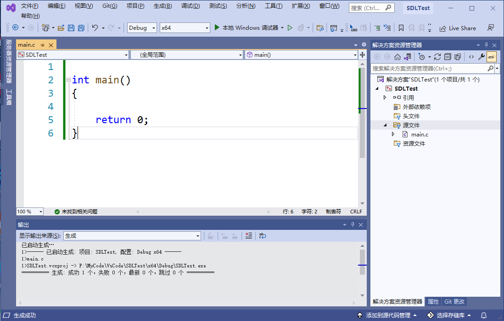

## SDL 简介

### 什么是 SDL？

Simple DirectMedia Layer 是一个跨平台开发库，旨在通过 OpenGL 和 Direct3D 提供对音频、键盘、鼠标、游戏杆和图形硬件的低级访问。它被视频播放软件、模拟器和流行游戏使用，包括[Valve](http://valvesoftware.com/)的获奖目录和许多[Humble Bundle](https://www.humblebundle.com/)游戏。

SDL 正式支持 Windows、Mac OS X、Linux、iOS 和[Android](https://wiki.libsdl.org/Android)。可以在源代码中找到对其他平台的支持。

SDL 是用 C 编写的，在本机上与 C++ 一起使用，并且有适用于其他几种语言的绑定，包括 C# 和 Python。

SDL 2.0 在[zlib 许可](http://www.gzip.org/zlib/zlib_license.html)下分发。此许可证允许您在任何软件中自由使用 SDL。简单直接媒体层库 (SDL) 是一个通用 API，它提供对音频、键盘、鼠标、游戏杆、通过 OpenGL 的 3D 硬件以及跨多个平台的 2D 帧缓冲区的低级别访问。

### SDL 可以做什么？

**视频**

- 3D图形：SDL 可与 OpenGL API 或 Direct3D API 结合使用，用于 3D 图形
- 加速 2D 渲染 API：支持简单的旋转、缩放和 alpha 混合，所有这些都使用现代 3D API 加速，使用 OpenGL 和 Direct3D 支持加速
- 创建和管理多个窗口

**输入事件**

- 提供的事件和 API 函数用于：
  - 应用程序和窗口状态更改
  - 鼠标输入
  - 键盘输入
  - 操纵杆和游戏控制器输入
  - 多点触控手势
- 可以使用[SDL_EventState](https://wiki.libsdl.org/SDL_EventState) ()启用或禁用每个事件
- 事件在发布到内部事件队列之前通过用户指定的过滤器函数
- 线程安全事件队列

**力反馈**

- Windows、Mac OS X 和 Linux 支持力反馈

**音频**

- 设置8位和16位音频、单声道立体声或5.1环绕声的音频播放，如果硬件不支持格式，可选择转换
- 音频在单独的线程中独立运行，通过用户回调机制填充
- 专为定制软件混音器设计，但[SDL_mixer](http://www.libsdl.org/projects/SDL_mixer/)提供完整的音频/音乐输出库

**文件 I/O 抽象**

- 用于打开、读取和写入数据的通用抽象
- 对文件和内存的内置支持

**共享对象支持**

- 加载共享对象（Windows 上的 DLL，Mac OS X 上的 .dylib，Linux 上的 .so）
- 共享对象中的查找函数

**线程**

- 简单的线程创建API
- 简单线程本地存储API
- 互斥体、信号量和条件变量
- 无锁编程的原子操作

**计时器**

- 获取经过的毫秒数
- 等待指定的毫秒数
- 在单独的线程中创建与代码一起运行的计时器
- 使用高分辨率计数器进行分析

**CPU 特性检测**

- 查询CPU数量
- 检测 CPU 特性和支持的指令集

**大端小端支持**

- 检测当前系统的字节序
- 用于快速交换数据值的例程
- 读取和写入指定字节序的数据

**电池管理**

- 查询电源管理状态

### SDL 在哪些平台上运行？

**Windows**

- 使用 Win32 API 进行显示，利用 Direct3D 进行硬件加速
- 使用 DirectSound 和 XAudio2 作为声音

**Mac OS X**

- 使用 Cocoa 进行视频显示，利用 OpenGL 进行硬件加速
- 使用 Core Audio 播放声音

**Linux**

- 使用 X11 进行视频显示，利用 OpenGL 进行硬件加速
- 使用 ALSA、OSS 和 PulseAudio API 来处理声音

**IOS**

- 使用 UIKit 进行视频显示，利用 OpenGL ES 2.0 进行硬件加速
- 使用 Core Audio 播放声音

**Android**

- 使用 JNI 接口进行视频显示，利用 OpenGL ES 1.1 和 2.0 进行硬件加速
- 对声音使用 JNI 音频回调


## 如何获取和安装 SDL

### SDL2库下载

+ SDL2 核心库 [SDL2](https://libsdl.org/download-2.0.php)

+ SDL2 拓展库 [SDL2_image、SDL2_ttf、SDL2_mixer、SDL2_net](https://libsdl.org/projects/)

+ SDL2 第三方绘图库[SDL2_gfx 官网](https://www.ferzkopp.net/wordpress/2016/01/02/sdl_gfx-sdl2_gfx/)     [SDL2_gfx Github](https://github.com/topics/sdl2-gfx)

### 安装SDL2

1. 点击[SDL2 核心库下载](https://libsdl.org/download-2.0.php)下载SDL2库，进入GitHub下载。


2. 下载出来会有一个压缩包，放到一个合适的目录(记住这个目录哦，经常要用的)，解压。


3. 进入解压后的目录，如下图：
   1. cmake：cmake配置文件
   2. docs：文档目录，只不过都是英文的
   3. include：头文件目录，编程需要的
   4. lib：库目录(静态库和动态库都有)


4. 给环境变量添加库目录，让程序运行的时候能够找到动态库。<font style="color:red">PS：配置好了记得重启Vs</font>


### VS中使用SDL2

1. 创建一个空项目，如下图：



2. 进入菜单栏的项目->属性->VC++ 目录，配置包含目录和库目录(详见下图)，注意库目录的版本和你的项目版本要一直哦(图中两个三角形标记的位置，我这是x64的)。


3. 不要离开，还有静态库需要配置，进入链接器->输入->点击附加依赖项->填入SDL2.lib和SDLmain2.lib，然后确定就好


4. 最后加入如下代码，Ctrl+F5运行

```c
#include<SDL.h>

int main(int argc,char*argv[])
{
	//初始化SDL
	if (SDL_Init(SDL_INIT_VIDEO) <0)
	{
		SDL_Log("can not init SDL:%s", SDL_GetError());
		return -1;
	}

	return 0;
}
```


如果能出现黑窗口并且，没有任何错误提示，那么就恭喜你啦，SDL配置完成~(不过麻烦的是每次创建新项目和在x86、x64之间切换时，都要进行配置~后面将讲解更方便的方法)！

SDL 作为动态链接库。动态链接库包含 3 个部分：

- 头文件 (Library.h)
- 库文件（Windows 的Library.lib 或 *nix 的libLibrary.a）
- 二进制文件（Windows 的Library.dll 或*nix 的Library.so）

你的编译器需要能够在编译时找到头文件，以便它知道SDL 函数和结构是什么。可以将编译器配置为在 SDL 头文件所在的附加目录中进行搜索，或者将头文件与编译器附带的其余头文件一起放入。如果编译器提示找不到 SDL.h，则意味着头文件不在编译器查找头文件的位置。

在编译器编译所有源文件后，它必须将它们链接在一起。为了使程序正确链接，它需要知道所有函数的地址，包括 SDL 函数的地址。对于动态链接库，这些地址在库文件中。库文件具有导入地址表，因此您的程序可以在运行时导入函数。与头文件一样，您可以将编译器配置为在 SDL 库文件所在的附加目录中进行搜索，或者将库文件与编译器附带的其余库文件一起放入。您还必须告诉链接器链接到链接器中的库文件。如果链接器报错找不到-lSDL或SDL2.lib，它意味着库文件不在链接器寻找库文件的地方。 如果链接器报错了一个未定义的引用，这可能意味着它没有链接这个库。  

在您的程序被编译和链接之后，您需要能够在运行时链接到该库。为了运行动态链接的应用程序，您需要能够在运行时导入库二进制文件。当您运行程序时，您的操作系统需要能够找到库二进制文件。您可以将库二进制文件放在与可执行文件相同的目录中，也可以放在操作系统保存库二进制文件的目录中。

### CMake使用SDL2

1. 把SDL2的根目录，配置到环境变量`F:\Tools\SDL2\SDL2-2.26.1`

2. 创建CMake项目，并在CMakeLists.txt文件中写入如下命令

   ```cmake
   #CMake最小请求版本
   cmake_minimum_required (VERSION 3.8)
   
   #项目名称
   project ("SDL2_CMake")
   
   #查找SDL2包，REQUIRED强制请求，没找到报错
   find_package(SDL2 REQUIRED)
   
   #使用指定的源文件生成目标(SDL2_CMake)
   add_executable (SDL2_CMake "main.c")
   
   #指定目标在链接时需要的依赖(库)
   target_link_libraries(SDL2_CMake SDL2::SDL2 SDL2::SDL2main)
   ```

3. 创建`main.c`源文件，写入如下代码

   ```cpp
   #include<SDL.h>
   int main(int argc, char* argv[])
   {
   	SDL_version ver;
   	SDL_GetVersion(&ver);
   	SDL_Log("%d %d %d\n", ver.major, ver.minor, ver.patch);
   	return 0;
   }
   ```

4. 成功运行！


## SDL2教程

+ [SDL2 维基文档](https://wiki.libsdl.org/wiki/index)

+ [SDL2各种教程集合](https://wiki.libsdl.org/Tutorials)


### 1.简单窗口

```c
#include<SDL.h>

//屏幕尺寸常量
const int SCREEN_WIDTH = 640;
const int SCREEN_HEIGHT = 480;
```

首先包含SDL.h头文件。  然后定义我们需要的窗口宽度和高度常量。

```c
int main(int argc,char*argv[])
{
	//初始化SDL子系统
	if (SDL_Init(SDL_INIT_VIDEO) != 0)
	{
		SDL_Log("can not init SDL:%s", SDL_GetError());
		return -1;
	}
```

注意主函数的形参，必须是一个整型，后跟上一个char*数组(参数分别代表命令行参数个数和命令行参数数组)，不能是其他形式的main函！

在主函数中我们先调用SDL_init初始化函数，如果不先初始化 SDL，就不能调用任何 SDL 函数。暂时我们只需要SDL的视频子系统，所以我们先只将 SDL_INIT_VIDEO 标志传递给它。

当发生错误时，SDL_Init 返回 负数。当出现错误时，我们可以将具体的错误原因打印到控制台。

在SDL中有一个和printf函数功能相同的函数，即SDL_Log。然后用SDL_GetError获取错误字符串并打印出来。

```c
	//创建窗口
	SDL_Window*window = SDL_CreateWindow(u8"C语言Plus",
		SDL_WINDOWPOS_UNDEFINED, 
		SDL_WINDOWPOS_UNDEFINED, 
		SCREEN_WIDTH, SCREEN_HEIGHT,
		SDL_WINDOW_SHOWN);
	//判断是否创建成功
	if (window == NULL)
	{
		SDL_Log("can not  create window:%s", SDL_GetError());
		return -1;
	}
```

如果SDL成功初始化，我们将使用SDL_CreateWindow创建一个窗口。 

+ 第一个参数设置窗口的标题；
+ 接下来两个参数分别是窗口的x和y，即窗口在屏幕上的位置，我们不关心位置在那里，所以直接传SDL_WINDOWPOS_UNDEFINED即可；

+ 接下来的两个参数分别表示窗口的宽度和高度；
+ 最后一个参数表示窗口创建成功之后显示出来。

如果有错误，SDL_CreateWindow 返回 NULL。我们将错误打印到控制台。

如果窗口被成功创建，则会显示到桌面。 

为了防止它消失，我们将调用SDL_Delay。 SDL_Delay将等待给定的毫秒数。 一毫秒是千分之一秒。 这意味着上面的代码将使窗口等待2000 /1000秒或2秒。  

需要注意的重要一点是，当SDL延迟时，它不能接受来自键盘或鼠标的输入。 当您运行这个程序时，如果它没有响应，请不要惊慌。 我们没有给它处理鼠标和键盘的代码。  

```c
	//延迟5秒
	SDL_Delay(5000);
	//销毁窗口
	SDL_DestroyWindow(window);
	//清理所有初始化的子系统
	SDL_Quit();
	return 0;
}
```

最后我们让程序延迟5秒再退出，否则窗口会一闪而过；退出之前需要调用SDL_DestroyWindow手动销毁窗口和调用SDL_Quit清理所有初始化的子系统。

### 2.图形渲染

#### 渲染器


#### 渲染图形


#### 渲染纹理

我们都知道游戏中最常用到的就是图形渲染，简单地说就是将图像显示到屏幕上。图像在 SDL 中被封装为一个叫做纹理的结构体 SDL_Texture，它代表了所有像素相关的内容数据。

SDL 中提供了 SDL_CreateTexture 和 SDL_DestoryTexture 来创建和销毁纹理，但是在现实中，很少从头创建一个新纹理，一般情况都是从硬盘上直接加载相关的图片转换为纹理结构体。SDL 也提供了相关的函数：

```c
SDL_Texture*  IMG_LoadTexture(SDL_Renderer *renderer, const char *file);
```

这个函数可以从本地磁盘上加载一个位图图片，不过这里有两个重点需要提及：

- 文件只能是位图图片，也就是常见以 bmp 后缀的图片文件。

- 函数返回的并不是 SDL_Texture 结构体指针，而是另一种叫做 SDL_Surface 结构体的指针对象。

  

接下来我们来学习基本的图形绘制，SDL2支持的基本图形有：

+ 点

  ```cpp
  int SDL_RenderDrawPoint()
  int SDL_RenderDrawPoints()
  ```

+ 线

  ```cpp
  int SDL_RenderDrawLine()
  int SDL_RenderDrawLines()
  ```

+ 矩形

  ```cpp
  int SDL_RenderDrawRect()
  int SDL_RenderFillRect()
  int SDL_RenderDrawRects()
  int SDL_RenderFillRects()
  ```

+ 颜色混合模式

  ```cpp
  int SDL_SetRenderDrawBlendMode()
  //常用混合模式如下    
  SDL_BLENDMODE_NONE = 0x00000000,     /**< 没有混合，即正常模式*/
  SDL_BLENDMODE_BLEND = 0x00000001,    /**< 透明混合，透明度生效*/                  
  SDL_BLENDMODE_ADD = 0x00000002,      /**< 叠加混合，即颜色叠加*/  
  ...
  ```

+ 绘图操作的颜色

  ```cpp
  int SDL_SetRenderDrawColor()
  ```

+ 用颜色清楚整个屏幕

  ```cpp
  int SDL_RenderClear()
  ```

+ 渲染器出场(输出渲染结果)

```cpp
void SDL_RenderPresent()
```

+ 自定义的绘制圆形的函数

```cpp
void DK_RenderDrawCircle(SDL_Renderer*renderer,int x, int y, int radius)
{
	int xbase = 0, ybase = radius, pos = 0;
	int d = (1 - radius) << 1;
	while (ybase >= 0)
	{
		if (d > 0)
		{
			if (((d - xbase) << 1) - 1 <= 0)
			{
				d = d + ((xbase - ybase + 3) << 1);
				xbase++;
				ybase--;
			}

			else
			{
				d = d - (ybase << 1) + 3;
				ybase--;
			}
		}
		else if (d < 0)
		{
			if (((d + ybase) << 1) - 1 <= 0) d = d + (xbase << 1) + 3, xbase++;
			else d = d + ((xbase - ybase + 3) << 1), xbase++, ybase--;
		}
		else
		{
			d = d + ((xbase - ybase + 3) << 1);
			xbase++;
			ybase--;
		}
		SDL_RenderDrawPoint(renderer,x + xbase - 1, y + ybase);        //右下
		SDL_RenderDrawPoint(renderer,x - xbase, y + ybase);                 //左下
		SDL_RenderDrawPoint(renderer,x + xbase - 1, y - ybase);             //右上
		SDL_RenderDrawPoint(renderer,x - xbase, y - ybase);                 //左上
	}
}

void DK_RenderFillCircle(SDL_Renderer* renderer,int x, int y, int radius)
{
	float y0, y1;
	float xx = 0;
	float msin = 0;
	for (float angle = 0; angle < 3.14; angle += 0.001)
	{
		xx = x + radius * SDL_cos(angle);

		msin = SDL_sin(angle);

		y0 = y + radius * msin;
		y1 = y + radius * (-msin);

		SDL_RenderDrawLineF(renderer, xx, y0, xx, y1);
	}
}

void DK_RenderDrawArc(SDL_Renderer* pRender, SDL_Rect* rect, float startAngle, float endAngle)
{
	if (startAngle == endAngle)
		return;

	//计算开始弧度和结束弧度
	float minA = SDL_min(startAngle, endAngle);
	float maxA = SDL_max(startAngle, endAngle);

	//半轴长
	float aHalf = rect->w / 2;
	float bHalf = rect->h / 2;

	float x, y;													//本次计算的点
	float prevx = (rect->x + aHalf) + aHalf * SDL_cos(minA);	//上一次计算出来的点
	float prevy = (rect->y + bHalf) + bHalf * SDL_sin(minA);
	//求出圆上每个坐标点
	for (float angle = minA; angle <= maxA; angle += 0.05f)
	{
		x = (rect->x + aHalf) + aHalf * SDL_cos(angle);
		y = (rect->y + bHalf) + bHalf * SDL_sin(angle);
		SDL_RenderDrawPointF(pRender, x, y);
		SDL_RenderDrawLineF(pRender, prevx, prevy, x, y);
		prevx = x;
		prevy = y;
	}
}

void DK_RenderDrawEllipse(SDL_Renderer* pRender, SDL_Rect* rect)
{
	//半轴长
	int aHalf = rect->w / 2;
	int bHalf = rect->h / 2;

	float x, y;
	float prevx = (rect->x + aHalf *2);
	float prevy = (rect->y + bHalf);
	float firstx = prevx;
	float firsty = prevy;
	//求出圆上每个坐标点
	for (float angle = 0; angle < 2 * 3.14; angle += 0.05f)
	{
		x = (rect->x + aHalf) + aHalf * SDL_cos(angle);
		y = (rect->y + bHalf) + bHalf * SDL_sin(angle);
		SDL_RenderDrawPointF(pRender, x, y);
		SDL_RenderDrawLineF(pRender, prevx, prevy, x, y);
		prevx = x;
		prevy = y;
	}
	SDL_RenderDrawLineF(pRender, firstx, firsty, x, y);	//最后连上
}
```


### 2.在屏幕上显示一张图片


既然你已经配置好了SDL， 是时候来建立一个能加载并显示一张图片的基本图形程序了。

```c
//启动SDL并创建窗口
bool init(const char*title,int width,int height);

//释放媒体并关闭SDL
void clean();
```

在第一个教程中，我们将所有内容都放在 main 函数中。由于它是一个小程序，我们可以这样，但在实际程序中，代码尽可能模块化。这意味着你的代码是整齐的块，每个块都易于调试和重用。

这意味着我们有处理初始化和关闭 SDL 应用程序的函数。我们在源文件的顶部附近声明这些函数。

```c
//要渲染的窗口指针
SDL_Window* gWindow = NULL;
    
//窗口包含的表面
SDL_Surface* gWinSfc = NULL;
```

这里我们声明了一些全局变量。通常，你应该避免在大型程序中使用全局变量。我们在这里这样做的原因是因为我们希望源代码尽可能简单，但是在大型项目中全局变量会使事情变得更加复杂。由于这是一个单一的源文件程序，我们不必太担心。

这是一种称为 SDL 表面的新数据类型。SDL 表面只是一种图像数据类型，它包含图像的像素以及渲染它所需的所有数据。SDL 表面使用软件渲染，这意味着它使用 CPU 进行渲染。可以渲染硬件图像，但它有点困难，所以我们将首先通过简单的方法学习它。在以后的教程中，我们将介绍如何渲染 GPU 加速图像。

我们将在这里处理的图像是屏幕图像（您在窗口内看到的）和我们将从文件加载的图像。

请注意，这些是指向 SDL 表面的指针。原因是 :

1. 我们将动态分配内存来加载图像
2. 最好按内存位置引用图像。想象一下，你有一个砖墙游戏，由多次渲染的相同砖块图像组成（如超级马里奥兄弟）。当您可以拥有图像的一个副本并一遍又一遍地渲染它时，在内存中拥有数十个图像副本是很浪费的。

另外，请始终记住初始化您的指针。我们在声明它们时立即将它们设置为 NULL。

```c
bool init(const char*title,int width,int height)
{
	//初始化SDL
	if (SDL_Init(SDL_INIT_VIDEO) != 0)
	{
		return false;
	}
	//创建窗口
	gWindow = SDL_CreateWindow(title, SDL_WINDOWPOS_UNDEFINED, SDL_WINDOWPOS_UNDEFINED, width, height, SDL_WINDOW_SHOWN);
	if (!gWindow)
	{
		return false;
	}
	//获取窗口表面
	gWinSfc = SDL_GetWindowSurface(gWindow);
	if (!gWinSfc)
	{
		return false;
	}
	return true;
}
```

在上面的代码中，我们已经获取了SDL初始化和窗口创建代码，并将其放在自己的函数中。 

我们想在窗口内显示图像，为了做到这一点，我们需要获得窗口内的图像。 因此，我们调用SDL_GetWindowSurface来获取窗口所包含的表面。  

```c
void clean()
{
	SDL_DestroyWindow(gWindow);
	SDL_Quit();
}
```

在我们的清理代码中，我们像以前一样销毁窗口并退出SDL。

```c
int main(int argc, char* argv[])
{
	if (!init(u8"SDL2教程", 640, 480))
	{
		SDL_Log("Failed to initialize!\n");
	}

	//加载图片
	SDL_Surface* sfc = SDL_LoadBMP("./assets/lesson02/hello_world.bmp");
	if (!sfc)
	{
		SDL_Log("surface load failed,%s\n", SDL_GetError());
	}
	else
	{
		//把图片显示到窗口上
		SDL_BlitSurface(sfc, NULL, gWinSfc, NULL);
```

在我们的主函数中，我们初始化 SDL 并加载图像。如果成功，我们使用 SDL_BlitSurface 将加载的表面 blit 到屏幕表面上。

块传输的作用是获取源表面并将其副本标记到目标表面上。SDL_BlitSurface 的第一个参数是源图像。第三个参数是目的地。我们将在以后的教程中学习第二个和第四个参数。

现在，如果这是我们唯一的绘图代码，我们仍然不会在屏幕上看到我们加载的图像。还差一步。

```c
        //更新窗口表面
        SDL_UpdateWindowSurface( gWindow );
```

在屏幕上绘制了我们想要为该帧显示的所有内容后，我们必须使用 SDL_UpdateWindowSurface 更新屏幕。当你在屏幕上绘图时，你通常不会在屏幕上看到你看到的图像。默认情况下，大多数渲染系统都是双缓冲的。这两个缓冲区是前缓冲区和后缓冲区。

当你进行像 SDL_BlitSurface 这样的绘制调用时，你渲染到后台缓冲区。您在屏幕上看到的是前端缓冲区。我们这样做的原因是因为大多数框架需要在屏幕上绘制多个对象。如果我们只有一个前端缓冲区，我们将能够看到正在绘制的帧，这意味着我们会看到未完成的帧。所以我们要做的是首先将所有内容绘制到后台缓冲区，完成后我们交换后台缓冲区和前台缓冲区，这样现在用户就可以看到完成的帧了。

这也意味着您不会在每个 blit 之后调用 SDL_UpdateWindowSurface，只有在当前帧的所有 blit 都完成之后才会调用。

```c
            //等待2秒
			SDL_Delay( 2000 );
			//释放表面
			SDL_FreeSurface(sfc);
        }
    }

    //释放资源和关闭SDL
    clean();

    return 0;
}
```

现在我们已经把所有东西都渲染到了窗口上，我们延迟了两秒钟，这样窗口就不会消失了。等待完成后，我们关闭我们的程序。


#### Surface直接修改像素

```c
//输出像素格式
SDL_Log("%d\n", sfc->format->format);
//输出人看得懂的像素格式
SDL_Log("%s\n", SDL_GetPixelFormatName(sfc->format->format));
```

先输出sfc的像素格式，像素格式是由枚举`SDL_PixelFormatEnum`定义的，如果输出的是318769153，即对应的枚举是SDL_PIXELFORMAT_INDEX8，说明一个像素由八位表示(也就是图片是一张黑白图)。

如果要修改图片，让他能够呈现彩色，必须先对图片的格式进行转换。

```c
sfc = SDL_ConvertSurface(sfc, gWinSfc->format, 0);
```

通过SDL_ConvertSurface可以把sfc的像素格式转为指定的像素格式(这里是窗口的)，然后进行修改像素

```c
//修改图片的像素
Uint32* pixels = sfc->pixels;
for (int i = 0; i < 100; i++)
{
	   pixels[i] = 0xff00ff;//SDL_MapRGBA(sfc->format,255,0,0,255);
}
```

上面的代码在图片上画了一条品红色的线条。


#### **指定输出坐标**

```c
SDL_Rect  rect = { 50,50,0,0 };
//把图片显示到窗口上
SDL_BlitSurface(sfc, NULL, gWinSfc, &rect);
```

SDL_BlitSurface可以将sfc输出到gWinSfc，那么如何指定输出坐标呢，这个可以通过最后一个参数指定，这个参数需要一个SDL_Rect结构，而且只有x，y有效，w，h将被忽略，所以置为0即可！

#### **输出部分图片**

```c
SDL_Rect scaleRect = { 10,156,50,50 };
//把图片显示到窗口上
SDL_BlitSurface(sfc, &scaleRect, gWinSfc, NULL);
```

如果不想把整张图片都输出，则可以指定输出的图片中的某个矩形区域。

### 3.事件处理

#### 事件处理流程

除了将图像放在屏幕上之外，游戏还要求您处理来自用户的输入。您可以使用 SDL事件处理系统来做到这一点。(把一下代码放到main函数中)

```c
            //主循环标志
            bool isDone = false;
```

在输出表面和更新窗口表面之后，我们声明了一个退出标志，用于跟踪用户是否已退出。由于此时我们刚刚启动了应用程序，显然它被初始化为false。

我们还声明了一个[SDL_Event](http://wiki.libsdl.org/SDL_Event?highlight=(\bCategoryStruct\b)|(CategoryEvents))联合。SDL事件是有意义的，比如 [按键](http://wiki.libsdl.org/SDL_KeyboardEvent?highlight=(\bCategoryStruct\b)|(CategoryEvents))、 [鼠标移动](http://wiki.libsdl.org/SDL_MouseMotionEvent?highlight=(\bCategoryStruct\b)|(CategoryEvents))、 [操纵杆 按钮按下](http://wiki.libsdl.org/SDL_JoyButtonEvent?highlight=(\bCategoryStruct\b)|(CategoryEvents))等。在这个应用程序中，我们将找到退出事件来结束应用程序。

```c
            //应用程序主循环
            while( !isDone )
            {
```

在之前的教程中，我们让程序在关闭前等待几秒钟。 在这个应用程序中，我们让应用程序等到用户退出后才关闭。  

当用户没有退出时，我们会有应用程序循环。 这种在应用程序处于活动状态时持续运行的循环称为主循环，有时也称为游戏循环。 它是任何游戏应用程序的核心。  

```c
         		//事件处理
            	static SDL_Event ev ={0};

				//处理队列上的事件
                while( SDL_PollEvent( &ev ) != 0 )
                {
                    //用户请求退出
                    if( ev.type == SDL_QUIT )
                    {
                       isDone = true;
                    }
                }
```

在主循环里面写了事件循环。 这样做的作用是继续处理事件队列，直到它为空。  

当您按下一个键、移动鼠标或触摸触摸屏时，事件就会被放到事件队列中。  


然后事件队列将按照事件发生的顺序存储它们，等待您处理它们。 当您想知道发生了什么事件以便处理它们时，您可以轮询事件队列，通过调用SDL_PollEvent获取最近的事件。 SDL_PollEvent所做的就是从事件队列中取出最近的事件，并将该事件中的数据放入我们传递给函数的SDL_Event中。  


SDL_PollEvent 将不断从队列中取出事件，直到队列为空。当队列为空时，SDL_PollEvent 将返回 0。所以这段代码所做的就是不断轮询事件队列中的事件，直到它为空。如果来自事件队列的事件是 SDL_QUIT 事件（用户点击窗口右上角关闭按钮产生的事件），我们将退出标志设置为 true，以便我们可以退出应用程序。

```c
                //输出图片
                SDL_BlitSurface( gXOut, NULL, gScreenSurface, NULL );
            
                //更新窗口表面
                SDL_UpdateWindowSurface( gWindow );
            }
```

在我们处理完一帧的事件后，我们绘制到屏幕并更新它（如上[一教程中所述](https://lazyfoo.net/tutorials/SDL/02_getting_an_image_on_the_screen/index.php)）。如果退出标志设置为真，应用程序将在循环结束时退出。如果它仍然是假的，它将一直持续到用户 X 掉窗口。

#### 键盘事件

退出事件只是 SDL 能够处理的事件之一。在游戏中大量使用的另一种输入是键盘。在本教程中，我们将根据您按下的键对图像进行移动

在源代码的顶部，我们声明了不同表面的枚举。  

```c
//要渲染的窗口指针
SDL_Window* gWindow = NULL;

//窗口包含的表面
SDL_Surface* gWinSfc = NULL;

//启动SDL并创建窗口
bool init(const char* title, int width, int height);

//释放媒体并关闭SDL
void clean();

//加载图片
SDL_Surface* loadSurface(const char* filename)
```

 除了常用的函数原型之外，我们还有一个名为loadSurface的新函数。 专门用来加载图片，以及在出错时能快速定位。  

对于这个程序来说，我们有一个指向SDL表面的指针，叫做gSfc，它指向了我们将要使用的图像。 根据用户按下的按键，我们将把gSfc进行移动。  

```c
SDL_Surface* loadSurface(const char* filename)
{
    SDL_Surface * surface = SDL_LoadBMP(filename);
    if (surface == NULL)
    {
        SDL_Log("Unable to load image %s! SDL Error: %s\n", filename, SDL_GetError());
        return NULL;
    }
    return surface;
}
```

上面是loadSurface函数，它加载图像并在出现错误时报告错误。 它与以前的方法基本相同，但是将图像加载和错误报告包含在一个函数中可以很容易地添加和调试图像加载。  

要记得最后要在clean函数中释放加载的表面哦~  

```c
    //加载图片
   gSfc = loadSurface("./assets/lesson02/hello_world.bmp");
	//定义坐标点
	int x = 0;
	int y = 0;


	//主循环标志
    bool quit = false;
    while (!quit)
    {
```

在main函数中，在进入主循环之前，我们先将图片进行加载，并且定义坐标点x和y。  

```c
   static SDL_Event ev;
        //处理队列中的事件
        while (SDL_PollEvent(&ev))
        {
            if (ev.type == SDL_QUIT)
            {
                quit = true;
            }
            //按键按下
            else if (ev.type == SDL_KEYDOWN)
            {
                switch (ev.key.keysym.sym)
                {
                case SDLK_UP:
                    y--;
                    break;
                case SDLK_DOWN:
                    y++;
                    break;
                case SDLK_LEFT:
                    x--;
                    break;
                case SDLK_RIGHT:
                    x++;
                    break;
                default:
                    x = 0;
                    y = 0;
                    break;
                }
            }
        }

		//清屏
        SDL_FillRect(gWinSfc, NULL, 0xffff);

        SDL_Rect posRect = { x,y,0,0 };
        //在窗口上显示图片
        SDL_BlitSurface(gSfc, NULL, gWinSfc, &posRect);
        SDL_UpdateWindowSurface(gWindow);
    }
```

这是我们的事件循环。如您所见，我们像在上一个教程中一样处理[关闭窗口](https://lazyfoo.net/tutorials/SDL/03_event_driven_programming/index.php)，然后处理 SDL_KEYDOWN 事件。当您按下键盘上的某个键时，就会发生此事件。[SDL 事件](http://wiki.libsdl.org/SDL_Event?highlight=(\bCategoryStruct\b)|(CategoryEvents))内部 是一个 [SDL 键盘事件](http://wiki.libsdl.org/SDL_KeyboardEvent)，它包含按键事件的信息。里面是一个 [SDL Keysym](http://wiki.libsdl.org/SDL_Keysym)，它包含有关按下的键的信息。该 Keysym 包含标识按下的键的 [SDL 键码](http://wiki.libsdl.org/SDL_Keycode)。 如您所见，此代码的作用是根据按下的键设置表面。如果您想了解其他键的其他键码是什么，请查看 SDL 文档。

#### 鼠标事件


### 4.输出文字


### 5.播放音乐