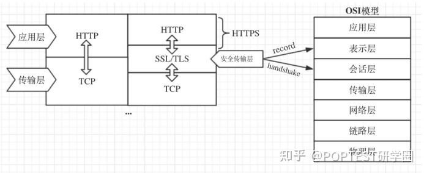

## openssl简介

openssl 是目前最流行的 SSL 密码库工具，其提供了一个通用、健壮、功能完备的工具套件，用以支持[SSL/TLS]() 协议的实现。

## SSL/TLS 协议

SSL/TLS协议实际上最初叫做SSL协议（Secure Sockets Layer，安全套接字层），是由网景(Netscape)公司在1990年推出的一种标准安全协议，用于在网络通信中建立Web浏览器和Web服务器之间的加密链接。

TLS（Transport Layer Security，传输层安全）是 IETF组织 （工程任务组）在1999年将SSL3.0协议规范进行了标准化。由于SSL和TLS之间存在加密算法上的差异，因此不能互相操作，所以是两个不同的协议。

### **一、TLS协议结构**

TLS协议严格的说位于OSI-7层模型的会话层，在传输层协议（如TCP）之上。

TLS 在实现上分为 记录层 和 握手层 两层，其中握手层又含四个子协议: 握手协议 (handshake protocol)、更改加密规范协议 (change cipher spec protocol)、应用数据协议 (application data protocol) 和警告协议 (alert protocol)，4个子协议分别如下：

1.握手协议 ：负责通信双方之间协商决定密码算法和共享密钥。

2.密码规格变更协议 ：负责向通信对象传达变更密码方式的信号。

3.警告协议 ：负责在发生错误时将错误传给对方。

4.应用数据协议：是将TLS承载的应用数据传达给通讯对象。

TLS的功能实现主要依赖于三类基本算法：散列函数 Hash、对称加密和非对称加密，其利用非对称加密实现身份认证和密钥协商，对称加密算法采用协商的密钥对数据加密，基于散列函数验证信息的完整性。

### 二、TLS握手流程

每一个 TLS 连接都会以握手开始。如果客户端此前并未与服务器建立会话，那么双方会执行一次完整的握手流程来协商 TLS 会话。握手过程中，客户端和服务器将进行以下四个主要步骤:

- 交换各自支持的功能，对需要的连接参数达成一致
- 验证出示的证书，或使用其他方式进行身份验证
- 对将用于保护会话的共享主密钥达成一致
- 验证握手消息并未被第三方团体修改

**下面介绍最常见的握手规则，一种不需要验证客户端身份但需要验证服务器身份的握手:**

#### 1. ClientHello

这条消息将客户端的功能和首选项传送给服务器。

Version: 协议版本（protocol version）指示客户端支持的最佳协议版本

Random: 一个32字节数据，28字节是随机生成的，剩余的4字节包含额外的信息，与客户端时钟有关。在握手时，客户端和服务器都会提供随机数，客户端的暂记作 random_C (用于后续的密钥的生成)。这种随机性对每次握手都是独一无二的，在身份验证中起着举足轻重的作用。它可以防止重放攻击，并确认初始数据交换的完整性。

Session ID: 在第一次连接时，会话ID（session ID）字段是空的，这表示客户端并不希望恢复某个已存在的会话。典型的会话ID包含32字节随机生成的数据，一般由服务端生成通过 ServerHello 返回给客户端。

Cipher Suites: 密码套件（cipher suite）块是由客户端支持的所有密码套件组成的列表，该列表是按优先级顺序排列的

Compression: 客户端可以提交一个或多个支持压缩的方法。默认的压缩方法是 null，代表没有压缩

Extensions: 扩展（extension）块由任意数量的扩展组成。这些扩展会携带额外数据

#### 2. ServerHello

是将服务器选择的连接参数传回客户端。

这个消息的结构与 ClientHello 类似，只是每个字段只包含一个选项，其中包含服务端的 random_S 参数 (用于后续的密钥协商)。服务器无需支持客户端支持的最佳版本。如果服务器不支持与客户端相同的版本，可以提供某个其他版本以期待客户端能够接受

#### 3. Certificate

典型的Certificate消息用于携带服务器X.509证书链。

服务器必须保证它发送的证书与选择的算法套件一致。比方说，公钥算法与套件中使用的必须匹配。除此以外，一些密钥交换算法依赖嵌入证书的特定数据，而且要求证书必须以客户端支持的算法签名。所有这些都表明服务器需要配置多个证书（每个证书可能会配备不同的证书链）。

Certificate 消息是可选的，因为并非所有套件都使用身份验证，也并非所有身份验证方法都需要证书。更进一步说，虽然消息默认使用X.509证书，但是也可以携带其他形式的标志；一些套件就依赖PGP密钥

#### 4. ServerKeyExchange

携带密钥交换需要的额外数据。ServerKeyExchange 是可选的，消息内容对于不同的协商算法套件会存在差异。部分场景下，比如使用 RSA 算法时，服务器不需要发送此消息。

ServerKeyExchange 仅在服务器证书消息（也就是上述Certificate消息）不包含足够的数据以允许客户端交换预主密钥（premaster secret）时才由服务器发送。

#### 5. ServerHelloDone

表明服务器已经将所有预计的握手消息发送完毕。在此之后，服务器会等待客户端发送消息。

#### 6. verify certificate

客户端验证证书的合法性，如果验证通过才会进行后续通信，否则根据错误情况不同做出提示和操作，合法性验证内容包括如下:

证书链的可信性trusted certificate path;

证书是否吊销revocation，有两类方式-离线CRL与在线OCSP，不同的客户端行为会不同;

有效期expiry date，证书是否在有效时间范围;

域名domain，核查证书域名是否与当前的访问域名匹配;

由PKI体系的内容可知，对端发来的证书签名是CA私钥加密的，接收到证书后，先读取证书中的相关的明文信息，采用相同的散列函数计算得到信息摘要，然后利用对应CA的公钥解密签名数据，对比证书的信息摘要，如果一致，则可以确认证书的合法性；然后去查询证书的吊销情况等

#### 7. ClientKeyExchange

合法性验证通过之后，客户端计算产生随机数字的预主密钥（Pre-master），并用证书公钥加密，发送给服务器并携带客户端为密钥交换提供的所有信息。这个消息受协商的密码套件的影响，内容随着不同的协商密码套件而不同。

此时客户端已经获取全部的计算协商密钥需要的信息: 两个明文随机数 random_C和random_S与自己计算产生的Pre-master，然后得到协商密钥(用于之后的消息加密)

enc_key = PRF(Pre_master, "master secret", random_C + random_S)

#### 8. ChangeCipherSpec

通知服务器后续的通信都采用协商的通信密钥和加密算法进行加密通信

ChangeCipherSpec不属于握手消息，它是另一种协议，只有一条消息，作为它的子协议进行实现。

#### 9. Finished (Encrypted Handshake Message)

Finished 消息意味着握手已经完成。消息内容将加密，以便双方可以安全地交换验证整个握手完整性所需的数据。

这个消息包含verify_data字段，它的值是握手过程中所有消息的散列值。这些消息在连接两端都按照各自所见的顺序排列，并以协商得到的主密钥 (enc_key) 计算散列。这个过程是通过一个伪随机函数（pseudorandom function，PRF）来完成的，这个函数可以生成任意数量的伪随机数据。

两端的计算方法一致，但会使用不同的标签（finished_label）：客户端使用 client finished，而服务器则使用 server finished。

verify_data=PRF(master_secret,finished_label,Hash(handshake_messages))

因为 Finished 消息是加密的，并且它们的完整性由协商 MAC 算法保证，所以主动网络攻击者不能改变握手消息并对vertify_data的值造假。在 TLS 1.2 版本中，Finished 消息的长度默认是 12 字节（96 位），并且允许密码套件使用更长的长度。在此之前的版本，除了 SSL 3 使用 36 字节的定长消息，其他版本都使用12字节的定长消息。

#### 10. Server

服务器用私钥解密加密的Pre-master数据，基于之前交换的两个明文随机数 random_C和random_S，同样计算得到协商密钥:

enc_key=PRF(Pre_master, "master secret", random_C + random_S);

同样计算之前所有收发信息的hash值，然后用协商密钥解密客户端发送的 verify_data_C，验证消息正确性;

#### 11. change_cipher_spec

服务端验证通过之后，服务器同样发送change_cipher_spec以告知客户端后续的通信都采用协商的密钥与算法进行加密通信;

#### 12. Finished (Encrypted Handshake Message)

服务器也结合所有当前的通信参数信息生成一段数据(verify_data_S)并采用协商密钥session secret(enc_key)与算法加密并发送到客户端;

#### 13. 握手结束

客户端计算所有接收信息的hash值，并采用协商密钥解密verify_data_S，验证服务器发送的数据和密钥，验证通过则握手完成;

#### 14. 加密通信

开始使用协商密钥与算法进行加密通信。