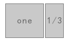
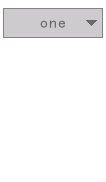
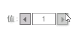
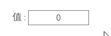
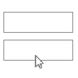
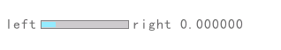
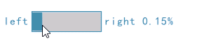
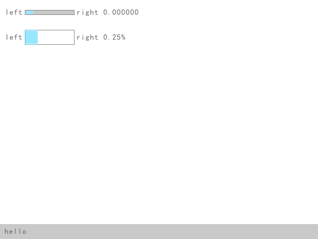
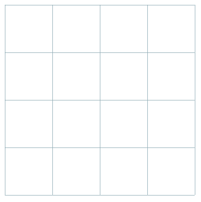

# raygui

Raygui是一个简单且易于使用的即时模式gui库。

`raygui` 被设计为raylib的辅助模块，用于使用raylib图形风格（简单的颜色，普通的矩形形状，宽边框…）创建简单的GUI界面。

> *注意：raygui是一个单文件头文件库（尽管其内部依赖于raylib），因此，函数定义和实现位于同一个文件* `raygui.h` *，当在模块中包含* `raygui.h` *时，* `RAYGUI_IMPLEMENTATION` *必须预先定义以包含* `raygui.h` *的实现部分，但只能在一个编译单元中，其他模块也可以包含* `raygui.h` *但* `RAYGUI_IMPLEMENTATION` *不得再次定义。*

[raygui.h](assets)

raygui.c

```c
#define RAYGUI_IMPLEMENTATION
#include "raygui.h"
```

## 基础控件

### GuiButton

这是一个按钮控件，当点击的时候返回true。

```c
if (GuiButton(CLITERAL(Rectangle) { 20, 20, 150, 30 }, "hello你好")) {
	TraceLog(LOG_INFO, "clicked");
}
```

#### 设置字体

```c
RAYGUIAPI void GuiSetFont(Font font);                           // Set gui custom font (global state)
RAYGUIAPI Font GuiGetFont(void);                                // Get gui custom font (global state)
```

可以使用上面的函数设置Gui全局字体，会影响所有控件！如果需要针对某个控件设置，需要先保存原来的状态然后进行设置，之后再进行还原！

```c
//获取原来的字体
Font oldFont = GuiGetFont();
//设置新字体
GuiSetFont(font);
if (GuiButton(CLITERAL(Rectangle) { 20, 20, 150, 30 }, "button 按钮1")) {
	TraceLog(LOG_INFO, "clicked");
}
//恢复原来的字体
GuiSetFont(oldFont);

//这个按钮的字体不受影响
if (GuiButton(CLITERAL(Rectangle) { 20, 60, 150, 30 }, "button 按钮2")) {
	TraceLog(LOG_INFO, "clicked");
}
```

#### 设置样式

初始按钮样式可能不符合你的需求，那么可以对按钮的样式进行设置！

可以使用如下函数对样式进行设置和获取！

```c
// Style set/get functions
RAYGUIAPI void GuiSetStyle(int control, int property, int value); 	// Set one style property
RAYGUIAPI int GuiGetStyle(int control, int property);           	// Get one style property
```

参数解析：

+ control是控件类型：填写`GuiControl`枚举值即可！

+ ```c
  // Gui controls
  typedef enum {
      // Default -> populates to all controls when set
      DEFAULT = 0,
      
      // Basic controls
      LABEL,          // Used also for: LABELBUTTON
      BUTTON,
      TOGGLE,         // Used also for: TOGGLEGROUP
      SLIDER,         // Used also for: SLIDERBAR, TOGGLESLIDER
      PROGRESSBAR,
      CHECKBOX,
      COMBOBOX,
      DROPDOWNBOX,
      TEXTBOX,        // Used also for: TEXTBOXMULTI
      VALUEBOX,
      SPINNER,        // Uses: BUTTON, VALUEBOX
      LISTVIEW,
      COLORPICKER,
      SCROLLBAR,
      STATUSBAR
  } GuiControl;
  ```

+ property是描述控件的属性：也是需要填写枚举值

  + 每个控件的基本属性(control参数必须是每个控件)

    ```c
    typedef enum {
        BORDER_COLOR_NORMAL = 0,    // Control border color in STATE_NORMAL
        BASE_COLOR_NORMAL,          // Control base color in STATE_NORMAL
        TEXT_COLOR_NORMAL,          // Control text color in STATE_NORMAL
        BORDER_COLOR_FOCUSED,       // Control border color in STATE_FOCUSED
        BASE_COLOR_FOCUSED,         // Control base color in STATE_FOCUSED
        TEXT_COLOR_FOCUSED,         // Control text color in STATE_FOCUSED
        BORDER_COLOR_PRESSED,       // Control border color in STATE_PRESSED
        BASE_COLOR_PRESSED,         // Control base color in STATE_PRESSED
        TEXT_COLOR_PRESSED,         // Control text color in STATE_PRESSED
        BORDER_COLOR_DISABLED,      // Control border color in STATE_DISABLED
        BASE_COLOR_DISABLED,        // Control base color in STATE_DISABLED
        TEXT_COLOR_DISABLED,        // Control text color in STATE_DISABLED
        BORDER_WIDTH,               // Control border size, 0 for no border
        //TEXT_SIZE,                  // Control text size (glyphs max height) -> GLOBAL for all controls
        //TEXT_SPACING,               // Control text spacing between glyphs -> GLOBAL for all controls
        //TEXT_LINE_SPACING           // Control text spacing between lines -> GLOBAL for all controls
        TEXT_PADDING,               // Control text padding, not considering border
        TEXT_ALIGNMENT,             // Control text horizontal alignment inside control text bound (after border and padding)
        //TEXT_WRAP_MODE              // Control text wrap-mode inside text bounds -> GLOBAL for all controls
    } GuiControlProperty;
    ```

  + 所有控件的默认拓展属性(control参数只能是`DEFAULT`)

    ```c
    typedef enum {
        TEXT_SIZE = 16,             // Text size (glyphs max height)
        TEXT_SPACING,               // Text spacing between glyphs
        LINE_COLOR,                 // Line control color
        BACKGROUND_COLOR,           // Background color
        TEXT_LINE_SPACING,          // Text spacing between lines
        TEXT_ALIGNMENT_VERTICAL,    // Text vertical alignment inside text bounds (after border and padding)
        TEXT_WRAP_MODE              // Text wrap-mode inside text bounds
        //TEXT_DECORATION             // Text decoration: 0-None, 1-Underline, 2-Line-through, 3-Overline
        //TEXT_DECORATION_THICK       // Text decoration line thikness
    } GuiDefaultProperty;
    ```

    

##### 设置背景、边框、文本颜色

```c
	GuiSetStyle(BUTTON, BASE_COLOR_NORMAL, ColorToInt(CLITERAL(Color) { 232, 244, 255,255 }));		//设置正常背景颜色
	GuiSetStyle(BUTTON, BASE_COLOR_FOCUSED, 0x1890ffff);	//设置鼠标悬停背景颜色
	GuiSetStyle(BUTTON, BASE_COLOR_PRESSED, 0x1682e6ff);	//设置鼠标按下背景颜色

	GuiSetStyle(BUTTON, BORDER_COLOR_NORMAL, 0xa3d3ffff);				//设置正常边框颜色 RGBA
	GuiSetStyle(BUTTON, BORDER_COLOR_FOCUSED, 0x1890ffff);				//设置鼠标悬停边框颜色
	GuiSetStyle(BUTTON, BORDER_COLOR_PRESSED, ColorToInt(BLANK));		//设置鼠标按下边框颜色（blank 透明）

	GuiSetStyle(BUTTON, TEXT_COLOR_NORMAL, 0x2c98ffff);				//设置正常文本颜色
	GuiSetStyle(BUTTON, TEXT_COLOR_FOCUSED, ColorToInt(WHITE));		//设置鼠标悬停文本颜色
	GuiSetStyle(BUTTON, TEXT_COLOR_PRESSED, ColorToInt(WHITE));		//设置鼠标按下文本颜色

	GuiSetStyle(BUTTON, BORDER_WIDTH, 1);							//设置边框宽度
```

可以自己设置背景、边框、文本颜色，颜色可以直接写十六进制的RGBA颜色，也可以使用`ColorToInt`函数把`Color`结构体类型的颜色，转成整型颜色！

##### 设置文本大小

```c
GuiSetStyle(DEFAULT, TEXT_SIZE, 16);
```

TEXT_SIZE属性属于拓展属性，控件必须是`DEFAULT`。

### GuiLabelButton

这是一个只有文本的按钮控件，没有边框、背景！

```c
if (GuiLabelButton(CLITERAL(Rectangle) { 20, 20, 100, 60 }, "hello 你好")) {
	TraceLog(LOG_INFO, "hello");
}
```

有一个GuiLabel控件，专门用来显示文本的！

```c
GuiLabel(CLITERAL(Rectangle) { 20, 0, 100, 60 }, "欢迎使用");
```

### GuiToggle

这是一个开关按钮，能切换选择开关状态！

```c
	bool isMan = true;
	bool isWoman = false;
	while (!WindowShouldClose())
	{
		BeginDrawing();
		ClearBackground(WHITE);

		GuiToggle(CLITERAL(Rectangle) { 20, 20, 30, 30}, "男", & isMan);
		GuiToggle(CLITERAL(Rectangle) { 60, 20, 30, 30}, "女", & isWoman);
	...
```

> 这个函数返回值无效，任何情况下都返回0！通过判断isMan和isWoman来确定哪个按钮被选中了！

### GuiToggleGroup

这是一个开关按钮组，组里面所有的按钮都是互斥的(选中一个其他的会自动取消选择)！

```c
int index = -1;
...
GuiToggleGroup(CLITERAL(Rectangle) { 20, 20, 90, 30}, "Option 1;Option 2;Option 3", &index);
```

参数解析：

+ text参数传递所有按钮文本，每个按钮文本之间使用分号分隔
+ active参数需要传递一个int类型指针，传出当前选中的按钮id。

### GuiCheckBox

这是一个复选框！

```c
bool checked = true;
...
GuiCheckBox(CLITERAL(Rectangle) { 20, 50, 16, 16}, "启用加速", &checked);
```

### GuiComboBox

这是一个组合框，使用分号分隔的字符串，提供n个值，点击后面切换按钮，即可切换当前值！

```c
GuiComboBox(CLITERAL(Rectangle) { 20, 20, 100, 60 }, "one;two;three", & index);
```



### GuiDropdownBox

这是一个下拉框，当点击按钮时，会弹出下拉列表，并可进行选择

```c
bool dropdownEditMode = false;
...
if (GuiDropdownBox(CLITERAL(Rectangle) { 20, 20, 100, 30 }, "one;two;three", & index, dropdownEditMode)) {
	dropdownEditMode = !dropdownEditMode;
}
```



### GuiSpinner

这是一个微调控件。

```c
bool editMode = false;
int value = 0;
...
if (GuiSpinner(CLITERAL(Rectangle) { 100, 20, 100, 25 }, "值:", & value, 0, 100, editMode)) {
	editMode = !editMode;
}
```



### GuiValueBox

这是一个值盒子控件，能输入值，在输入完成时能验证值范围！

```c
if (GuiValueBox(CLITERAL(Rectangle) { 100, 20, 100, 25 }, "值:", & value, 0, 100, editModel)) {
	editModel = !editModel;
}
```



### GuiTextBox

这是一个文本输入控件。

```c
char username[32] = {0};
char password[32] = {0};
bool usernameEdit = false;
bool pwdEdit = false;

if (GuiTextBox(CLITERAL(Rectangle) { 20, 200, 100, 30 }, username, BUFSIZ, usernameEdit)) {
	TraceLog(LOG_INFO, "box1");
	usernameEdit = !usernameEdit;
	pwdEdit = false;
}
if (GuiTextBox(CLITERAL(Rectangle) { 20, 300, 100, 30 }, password, BUFSIZ, pwdEdit)) {
	TraceLog(LOG_INFO, "box2");
	usernameEdit = false;
	pwdEdit = !pwdEdit;
}
```



### GuiSlider

这是一个滑块控件。

```c
float value = 0;

GuiSlider(CLITERAL(Rectangle) { 50, 20, 100, 10 }, "left", TextFormat("right %f", value), & value, 0, 999);
```



### GuiSliderBar

这是一滑动条控件。

```c
float value1 = 0;

GuiSliderBar(CLITERAL(Rectangle) { 50, 60, 100, 30 }, "left", TextFormat("right %.2f%%", value1 / 999), & value1, 0, 999);
```



### GuiProgressBar

这是一个进度条控件，它和SliderBar的区别在于SliderBar可以交互，ProgressBar不能，只能用来展示数据！

```c
GuiProgressBar(CLITERAL(Rectangle) { 50, 60, 100, 30 }, "left", TextFormat("right %.2f%%", value1 / 999), & value1, 0, 999);
```

### GuiStatusBar

这是一个状态栏控件，用于显示文本信息！

```c
GuiStatusBar(CLITERAL(Rectangle) { 0, GetRenderHeight() - 30, GetRenderWidth(), 30 }, "hello");
```



### GuiDummyRect

这是一个虚拟的占位用(没啥用)的控件！

```c
GuiDummyRec(CLITERAL(Rectangle) { 50, 100, 100, 30 }, "what");
```

### GuiGrid

这是一个网格控件，用于绘制网格！

```c
Vector2 pos;
...
GuiGrid(CLITERAL(Rectangle) { 50, 100, 240, 240 }, "grid", 60, 1, & pos);
```


