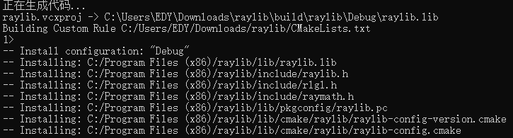
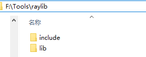
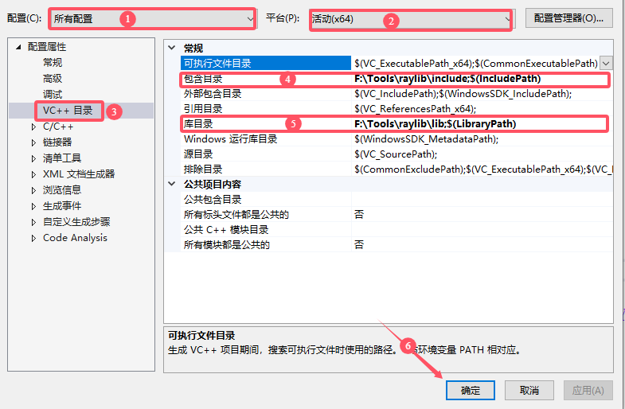
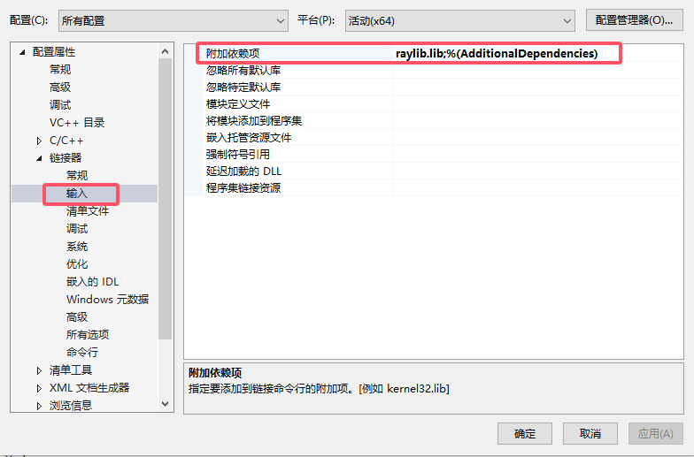
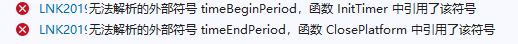

# raylib

## 简介

[raylib](https://www.raylib.com/)是一个以简单易用为目标的跨平台游戏绘图库，它的特点包括：

- 免费开源（基于类似于BSD的zlib授权协议）
- 跨平台支持：Windows, Linux, MacOS, RPI, Android, HTML5等
- 全部用C语言实现
- 简单易用
- 使用OpenGL硬件加速(**1.1, 2.1, 3.3, 4.3 or ES 2.0**)
- 支持多种字体(XNA SpriteFonts, BMfonts, TTF, SDF)
- 支持多种材质格式，包括压缩材质(DXT, ETC, ASTC)
- 全面支持3D，包括Shapes，Models，Billboards, Heightmaps等
- 材质系统支持包括经典贴图和[PBR贴图](https://zhida.zhihu.com/search?content_id=189983032&content_type=Article&match_order=1&q=PBR贴图&zhida_source=entity)
- 支持动画3d模型（Animated 3d models）
- 支持多种着色器，包括模型着色器（Model shaders）和后处理着色器（**Postprocessing shaders）**
- 提供数学模块，支持矢量、矩阵和[四元数](https://zhida.zhihu.com/search?content_id=189983032&content_type=Article&match_order=1&q=四元数&zhida_source=entity)（Quaternion）运算
- 支持多种音乐格式的载入和流媒体播放(WAV, OGG, MP3, FLAC, XM, MOD)
- 提供50多种编程语言的绑定

## 下载编译

以管理员身份运行终端，运行如下命令，克隆raylib源码。

> 或进入[raysan5/raylib](https://github.com/raysan5/raylib?tab=readme-ov-file) github仓库下载代码。

```shell
git clone https://github.com/raysan5/raylib.git
```

进入raylib目录，并构建项目。

```shell
cd raylib
cmake -B build -DBUILD_EXAMPLES=OFF
```

构建完成之后，对代码进行编译和安装。

```shell
cmake --build build --target INSTALL
```

编译完成后会自动安装到`C:/Program Files (x86)`目录中，可以自己把目录中的raylib拷贝到其他位置。



## Vs环境配置

1. 创建Vs空项目，然后将库的include和lib目录配置到如下图所示位置。

+ 库结构



+ 配置位置



2. 将raylib.lib库配置到附加依赖项中



3. 在main.c源文件中加入如下代码，并运行！

```c
#include "raylib.h"

int main(void)
{
    InitWindow(800, 450, "raylib [core] example - basic window");

    while (!WindowShouldClose())
    {
        BeginDrawing();
        ClearBackground(RAYWHITE);
        DrawText("Congrats! You created your first window!", 190, 200, 20, LIGHTGRAY);
        EndDrawing();
    }

    CloseWindow();
    return 0;
}
```

如果报如下图所示错误，则需要额外的添加一个库`winmm.lib`



> 1,可以直接在头文件包含之后添加指令: #pragma comment(lib,"winmm.lib")
>
> 2,可以将winmm.lib也配置到附加依赖项中(和raylib.lib配置一样)

## raylib使用

### 第一个窗口

```c
#include "raylib.h"
```

首先，包含raylib.h头文件。

```c
int main(void)
{
    InitWindow(800, 450, "raylib [core] example - basic window");
```

然后调用`InitWindow`函数创建窗口，参数分别是窗口宽度、高度以及窗口标题。

> 窗口是一个矩形，窗口客户区左上角为坐标原点，x轴向右为正，y轴向下为正。

只创建窗口还不行，还必须加上事件循环，窗口才能响应各种事件，否则窗口会直接卡死。

```c
    while (!WindowShouldClose())
    {
        BeginDrawing();
```

`WindowShouldClose()`函数用来判断是否应该关闭窗口(比如点击了关闭按钮，此函数返回true)，以退出主循环。

`BeginDrawing()`是开始绘图函数，和后面的`EndDrawing()`函数匹配，所有的绘图操作必须放到这对函数之间，否则无法看到绘图结果。

```c
        ClearBackground(RAYWHITE);
        DrawText("Congrats! You created your first window!", 190, 200, 20, LIGHTGRAY);
```

`ClearBackground()`函数用指定的颜色清空窗口背景；

`DrawText()`函数用来向窗口上绘制文本。

```c
        EndDrawing();
    }

    CloseWindow();
    return 0;
}
```

最后记得使用` CloseWindow()`关闭窗口哦！

### 颜色空间

### 其他函数

| 函数                                  | 描述                                                 |
| ------------------------------------- | ---------------------------------------------------- |
| void SetTargetFPS(int fps)            | 设置FPS                                              |
| int GetFPS(void)                      | 获取当前FPS                                          |
| float GetFrameTime(void)              | 以秒为单位获取绘制最后一帧的时间                     |
| double GetTime(void)                  | 获取自调用InitWindow函数以来经过的时间（以秒为单位） |
| void WaitTime(double seconds)         | 等待一段时间（暂停程序执行）                         |
| void SetRandomSeed(unsigned int seed) | 设置随机数种子                                       |
| int GetRandomValue(int min, int max)  | 获取min和max（两者都包含在内）之间的随机值           |
| void OpenURL(const char *url)         | 使用默认系统浏览器打开URL（如果可用）                |
|                                       |                                                      |


### 绘图

#### 绘制基本图形

> 在绘制图形时，会出现锯齿，需要在InitWindow之前通过`SetConfigFlags(FLAG_MSAA_4X_HINT);`设置抗锯齿选项。

##### 绘制点

```c
DrawPixel(50, 50, RED);
```

使用`DrawPixel`传入坐标和颜色绘制点。

```c
Vector2 pos = {50,51};
DrawPixelV(pos, CLITERAL(Color){252, 99, 213,255});
```

还可以使用另外一个传入坐标结构`Vector2`的函数，另外对于颜色也可以自己传入RGBA值，以实现丰富的颜色。

##### 绘制线

```c
DrawLine(0, 0, 640, 480, BLUE);

Vector2 begPos = { 0,0};
Vector2 endPos = { 100,120};
DrawLineV(begPos, endPos, BROWN);
```

使用`DrawLine`传入线段的坐标和颜色绘制线条，另外`DrawLineV`函数可以传入`Vector2`类型的两个坐标。

```c
begPos = (Vector2){0,200};
endPos = (Vector2){200,250};
DrawLineEx(begPos, endPos, 5, BLUE);
```

如果想要控制线条宽度，则需要使用`DrawLineEx`拓展函数，第三个参数即可传入线条宽度。

```c
Vector2 points[] = { {320,0},{0,479},{640,480} };
DrawLineStrip(points, 3, GREEN);
```

`DrawLineStrip`根据多个点绘制折线，也就是说把点数组中的每个点都连起来，注意:最后一个点和第一个点不会相连。

```c
begPos = (Vector2){100,200};
endPos = (Vector2){200,300};
DrawLineBezier(begPos, endPos, 2, YELLOW);
```

还可以使用`DrawLineBezier`绘制贝塞尔曲线。

##### 绘制圆

```c
DrawCircle(GetRenderWidth() / 2, GetRenderHeight() / 2, 50, GOLD);
```

使用`DrawCircle`传入圆心坐标、半径和颜色绘制实心圆形。也有`DrawCircleV`版本。

如果想要绘制**空心圆**，请使用`DrawCircleLines`或`DrawCircleLinesV`。

```c
//-- 实心的
DrawCircleSector((Vector2) { GetRenderWidth() / 2, GetRenderHeight() / 2 }, 50, 0, 90,10, SKYBLUE);
//-- 空心的
DrawCircleSectorLines((Vector2) { GetRenderWidth() / 2, GetRenderHeight() / 2 }, 50, 0, 90,10, SKYBLUE);
```

`DrawCircleSector`用于绘制圆的部分(比如扇形)，如果要绘制空心扇形请使用`DrawCircleSectorLines`函数。参数解析如下：

> 1. Vector2 center 圆心坐标
>
> 2. float radius 半径
>
> 3. float startAngle 开始角度，x轴正方向为0
>
> 4. float endAngle 结束角度，沿x轴顺时针旋转
>
> 5. int segments 扇形被划分成的段数或者说是等分。它指示程序应该将整个圆分成多少个相等的部分（每个部分形成扇区），以便通过一系列直线和弧线连接来描绘出扇形区域。
>
> 6. Color color 颜色


```c
DrawCircleGradient(GetRenderWidth() / 2, GetRenderHeight() / 2, 50, RED, BLUE);
```

`DrawCircleGradient`作用是绘制径向渐变，径向渐变是一种由从原点辐射的两种或多种颜色之间的渐进过渡组成的图像，其形状可以是圆形或椭圆形。

`DrawEllipse`用于绘制椭圆，`DrawEllipseLines`用户绘制空心椭圆。

##### 绘制环

`DrawRing`用于绘制环形，`DrawRingLines`用于绘制空心环形。

##### 绘制矩形

```c
DrawRectangle(10, 10, 100, 35, RED);
DrawRectangleV((Vector2) { 10, 10 }, (Vector2) { 100, 35 }, RED);
DrawRectangleRec((Rectangle) { 10, 50, 100, 35 }, YELLOW);
```

`DrawRectangle`用于绘制实心矩形，需要传入矩形坐标以及宽度和高度。`DrawRectangleV`和`DrawRectangleRec`是重载版本。

```c
DrawRectanglePro((Rectangle) { 10, 100, 100, 35 }, (Vector2) {0,0},10, GREEN);

static float angle = 0;
DrawRectanglePro((Rectangle) { 10 + 50, 100 + 18, 100, 35 }, (Vector2) {50,18},angle+=0.1, GREEN);
```

`DrawRectanglePro`通过提供多个参数来绘制矩形，并能旋转矩形。

> Rectangle rec  矩形
>
> Vector2 origin 矩形原点(默认情况下，矩形是以左上角为原点(0,0)，可以将矩形原点设置到矩形中心点，这样绘制矩形就会将中心点，放到指定的坐标)
>
> float rotation 旋转角度
>
> Color color  颜色

```c
DrawRectangleGradientH(10, 150, 100, 35, RED, BLUE);
DrawRectangleGradientV(10, 200, 100, 35, RED, BLUE);
DrawRectangleGradientEx ((Rectangle) { 10, 200, 100, 35 }, RED,GREEN, BLUE,BROWN);
```

`DrawRectangleGradient`系列函数用于绘制颜色渐变的矩形。

```c
DrawRectangleLines(10, 250, 100, 35, SKYBLUE);
DrawRectangleLinesEx((Rectangle) { 10, 300, 100, 35 },3, SKYBLUE);
```

`DrawRectangleLines`用于绘制空心矩形。

```c
DrawRectangleRounded((Rectangle) { 10, 350, 100, 35 }, 0.5, 0, YELLOW);
DrawRectangleRoundedLines((Rectangle) { 10, 400, 100, 35 }, 0.5, 1, YELLOW);
DrawRectangleRoundedLinesEx((Rectangle) { 10, 450, 100, 35 }, 0.5, 1,3, YELLOW);
```

`DrawRectangleRounded`系列函数用来绘制圆角矩形。

> Rectangle rec		矩形
>
> float roundness 	  圆度，0~1之间
>
> int segments		扇形被划分成的段数或者说是等分。它指示程序应该将整个圆分成多少个相等的部分（每个部分形成扇区），以便通过一系列直线和弧线连接来描绘出扇形区域。
>
> Color color		  颜色

##### 绘制曲线


##### 绘制文本

```c
DrawText("Congrats! You created your first window!", 190, 200, 20, LIGHTGRAY);
```

`DrawText`用于绘制文本，需要注意的是，只能绘制英文，对于中文，操作麻烦一点。

```c
int codePointsCount;
int* codePoints = LoadCodepoints("你好世界，！。？：；", &codePointsCount);
Font ft = LoadFontEx("C:/windows/fonts/simhei.ttf",64,codePoints,128);
if (!IsFontValid(ft)) {
	TraceLog(LOG_WARNING, "font load faild");
}
```

需要先加载码点，其实就是中文对应的unicode编码。把在程序中所有出现的中文字符，都使用`LoadCodepoints`函数先加载，然后根据码点加载字体。

```c
while (!WindowShouldClose()) {
	BeginDrawing();
	ClearBackground(WHITE);
	DrawTextEx(ft,"你好，世界！",(Vector2){50,250},32,5,RED);
	EndDrawing();

}
```

然后在循环中使用`DrawTextEx`函数，传入加载的字体绘制文本即可。

```c
//释放字体
UnloadFont(font);
// 释放码点表
UnloadCodepoints(codepoints);
```

最后还要释放掉字体和码点表。

为了方便加载可能出现的中文字符，可以进行如下宏定义：

```c
#define BASECHAR(str) "123456780abcdefjhijklmnopqrstuvwxyzABCDEFJHIJKLMNOPQRSTUVWXYZ!@#$%^&*()_+{}<>?:\"'~` ！￥%……&*（）？！：“”"##str

//加载
int codePointsCount;
int* codePoints = LoadCodepoints(BASECHAR("你好世界，"), &codePointsCount);
```

`DrawTextPro`函数还可以用于旋转文本。

还可以把所有中文放到文件中，然后加载进来！！

```c
	//打开字体
	int fileSize = 0;
	unsigned char* fontData = LoadFileData("C:/Windows/Fonts/simhei.ttf", &fileSize);
	if (!fontData) {
		return -1;
	}

	//加载中文文件
	int chineseSize = 0;
	unsigned char* chineseData = LoadFileData("chinese.txt", &chineseSize);
	if (!chineseData) {
		return -1;
	}

	//加载马点
	int codepointsCount = chineseSize;
	int* codepoints = LoadCodepoints(chineseData, &codepointsCount);
	if (!codepoints) {
		return -1;
	}

	//从内存加载字体
	Font font = LoadFontFromMemory(".ttf", fontData, fileSize, 26, codepoints, codepointsCount);

```

#### 绘制纹理(图片)

要绘制图片，必须先将图片从文件加载到内存中。

```c
Texture2D tex = LoadTexture("images/zuoyi.png");
if (!IsTextureValid(tex)) {
	TraceLog(LOG_WARNING, "zuoyi.png load failed");
	return -1;
}
```

`LoadTexture`用于将磁盘上的图片加载到内存中，`IsTextureValid`判断纹理是否加载成功。

```c
while (!WindowShouldClose()){
	BeginDrawing();
	ClearBackground(WHITE);
	DrawFPS(0, 0);
	//绘制纹理
	DrawTexture(tex, 0, 0, WHITE);

	EndDrawing();
}
//释放纹理
UnloadTexture(tex);
```

`DrawTexture`将纹理绘制在指定的坐标，最后一个参数传递一个颜色，WHITE表示原样绘制，可以通过改变颜色的alpha值，改变图片的透明度。

除了`DrawTexture`之外，还有下面四个函数也能绘制纹理，只不过提供了不同的功能。

```c
void DrawTextureV(Texture2D texture, Vector2 position, Color tint);                               //rotation旋转角度，scale缩放倍数
void DrawTextureEx(Texture2D texture, Vector2 position, float rotation, float scale, Color tint); //绘制具有扩展参数的Texture2D
void DrawTextureRec(Texture2D texture, Rectangle source, Vector2 position, Color tint);           //绘制由矩形定义的纹理的一部分
void DrawTexturePro(Texture2D texture, Rectangle source, Rectangle dest, Vector2 origin, float rotation, Color tint);
```

##### 翻转

要让图片翻转，需要使用`DrawTextureRec`或`DrawTexturePro`函数。

```c
Rectangle srcRect = { 0,0,tex.width,tex.height };
Rectangle dstRect = { 300,0,tex.width / 2,tex.height / 2 };
//水平翻转
DrawTextureRec(tex, CLITERAL(Rectangle){0, 0, -tex.width, tex.height}, CLITERAL(Vector2) { 0, 0 },WHITE);
//垂直翻转
DrawTextureRec(tex, CLITERAL(Rectangle){0, 0, tex.width, -tex.height}, CLITERAL(Vector2) { 0, 0 },WHITE);
```


### 输入相关功能

#### 键盘

| 函数                        | 作用                                                         |
| --------------------------- | ------------------------------------------------------------ |
| bool IsKeyPressed(int key)  | 如果在本帧中key被按下，返回true；否则返回false（一次按键行为，在多帧中只会有一帧返回1） |
| bool IsKeyDown(int key)     | 如果在本帧中key处于按下状态，返回true；否则返回false         |
| bool IsKeyReleased(int key) | 如果在本帧中key被松开，返回true；否则返回false（一次松开行为，在多帧中只会有一帧返回1） |
| bool IsKeyUp(int key)       | 如果在本帧中key处于未按下状态，返回true；否则返回false       |
| int GetKeyPressed()         | 返回最近的按键，并将其从缓存区中删除；如果缓存区中无按键事件，则返回0 |
| int GetCharPressed()        | 返回最近输入的字符（ascii码），并将其从缓存区中删除；如果缓存区中无按键事件，则返回0。请勿用其输入中文。 |

不同的按键是用枚举`KeyboardKey`表示的，如：`KEY_RIGHT`，`KEY_LEFT `，`KEY_DOWN `，`KEY_UP`

#### 鼠标

| 函数                                   | 作用                                                         |
| -------------------------------------- | ------------------------------------------------------------ |
| bool IsMouseButtonPressed(int button)  | 如果在本帧中button被按下，返回true；否则返回false（一次按键行为，在多帧中只会有一帧返回1） |
| bool IsMouseButtonDown(int button)     | 如果在本帧中button处于按下状态，返回true；否则返回false      |
| bool IsMouseButtonReleased(int button) | 如果在本帧中button被松开，返回true；否则返回false（一次按键行为，在多帧中只会有一帧返回1） |
| bool IsMouseButtonUp(int button)       | 如果在本帧中button处于未按下状态，返回true；否则返回false    |
| int GetMouseX()                        | 返回鼠标光标当前位置的X坐标                                  |
| int GetMouseY(void)                    | 返回鼠标光标当前位置的Y坐标                                  |
| Vector2 GetMousePosition(void)         | 返回鼠标光标当前位置的坐标                                   |
| Vector2 GetMouseDelta(void)            | 返回上一帧到本帧之间鼠标光标的位移                           |
| float GetMouseWheelMove(void)          | 返回上一帧到本帧之间鼠标滚轮的转动量（负数向用户自己滚动，正数向原理用户方向滚动） |

### 基本图形碰撞检测

+ 检查两个矩形碰撞

```c
RLAPI bool CheckCollisionRecs(Rectangle rec1, Rectangle rec2);
```

+ 检查两个圆形碰撞


```c
RLAPI bool CheckCollisionCircles(Vector2 center1, float radius1, Vector2 center2, float radius2);
```

+ 检查圆形和矩形碰撞

```c
RLAPI bool CheckCollisionCircleRec(Vector2 center, float radius, Rectangle rec);
```

+ 检查点是否在矩形内

```c
RLAPI bool CheckCollisionPointRec(Vector2 point, Rectangle rec);
```
+ 检查点是否在圆形内

```c
RLAPI bool CheckCollisionPointCircle(Vector2 point, Vector2 center, float radius);
```
+ 检查点是否在三角形内

```c
RLAPI bool CheckCollisionPointTriangle(Vector2 point, Vector2 p1, Vector2 p2, Vector2 p3);
```
+ 检查点是否在由顶点数组描述的多边形内

```c
RLAPI bool CheckCollisionPointPoly(Vector2 point, const Vector2 *points, int pointCount);
```
+ 检查由两个点定义的两条线之间的碰撞，通过collisionPoint返回碰撞点

```c
RLAPI bool CheckCollisionLines(Vector2 startPos1, Vector2 endPos1, Vector2 startPos2, Vector2 endPos2, Vector2 *collisionPoint);
```
+ 检查点是否属于在两个点[p1]和[p2]之间创建的线，并以像素为单位定义边界[threshold]

```c
RLAPI bool CheckCollisionPointLine(Vector2 point, Vector2 p1, Vector2 p2, int threshold);
//判断point是否在p1和p2组成的线上，threshold指定阈值（阈值表示point点可以不在线上，在线周围也可以，threshold制定了线周围的边界）
```
+ 检查圆是否与两点[p1]和[p2]之间的直线碰撞

```c
RLAPI bool CheckCollisionCircleLine(Vector2 center, float radius, Vector2 p1, Vector2 p2);
```
+ 获取两个矩形的碰撞矩形

```c
RLAPI Rectangle GetCollisionRec(Rectangle rec1, Rectangle rec2); 
```

### 音乐播放

在播放音频之前，必须初始化音频设置，使用完毕后，也要关闭音频设备。

```c
InitAudioDevice();
//播放音乐...
CloseAudioDevice();
```

#### 音效(Sound)

音效是未压缩的音频文件（通常是WAV文件），可以以较低延迟的方式播放，并且适用于响应用户操作的“反馈”类型声音（例如虚拟键盘声音，弹出对话框的积极或消极反馈，或游戏声音）。如果低延迟不重要，可以当作音乐播放。

```c
Sound dongSnd =  LoadSound("Resource/sound/dong.wav");
if (!IsSoundValid(dongSnd)) {
	TraceLog(LOG_DEBUG, "sound load failed");
}
```

使用LoadSound加载音效，可以使用`IsSoundValid`判断音效是否加载成功。

然后使用`PlaySound(dongSnd);`来播放音效，如果需要重复播放，需要写在循环中：

```c
	while (!WindowShouldClose())
	{
		if (!IsSoundPlaying(dongSnd)) {
			PlaySound(dongSnd);
		}
    ...
    }
	//取消加载音效
	UnloadSound(dongSnd);
```

**其他函数**

| 函数                                            | 描述               |
| ----------------------------------------------- | ------------------ |
| void StopSound(Sound sound);                    | 停止播放音效       |
| void PauseSound(Sound sound);                   | 暂停音效           |
| void ResumeSound(Sound sound);                  | 恢复已经暂停的音效 |
| void SetSoundVolume(Sound sound, float volume); | 设置音效播放音量   |

#### 音乐(Music)

```c
Music mus =  LoadMusicStream("Resource/music/That-Girl.mp3");
if (!IsMusicValid(mus)) {
	TraceLog(LOG_DEBUG, "music load failed");
}
```

使用`LoadMusicStream`加载音效，可以使用`IsMusicValid`判断音效是否加载成功。

```c
if (!IsMusicStreamPlaying(mus)) {
	PlayMusicStream(mus);
}

while (!WindowShouldClose())
{
	UpdateMusicStream(mus);
	...
}
//取消加载音乐
UnloadMusicStream(dongSnd);
```

音乐加载完成，可以使用`PlayMusicStream`来播放音乐，还必须在循环中使用`UpdateMusicStream`来更新音乐流，否则无法听到声音。

**其他函数**

| 函数                                               | 描述                     |
| -------------------------------------------------- | ------------------------ |
| float GetMusicTimeLength(Music music);             | 获取音乐总时长(单位秒)   |
| float GetMusicTimePlayed(Music music);             | 获取音乐播放时长(单位秒) |
| void SetMusicVolume(Music music, float volume);    | 设置音乐音量             |
| void StopMusicStream(Music music);                 | 停止播放音乐             |
| void PauseMusicStream(Music music);                | 暂停播放音乐             |
| void ResumeMusicStream(Music music);               | 回复暂停的音乐           |
| void SeekMusicStream(Music music, float position); | 移动音乐播放位置(单位秒) |

### 压缩/编码函数

**数据解压缩**

```c
unsigned char *CompressData(const unsigned char *data, int dataSize, int *compDataSize); 
```

`CompressData`函数用于对传入的data指向的数据进行压缩，dataSize指定数据大小，compDataSize返回压缩后的数据大小；函数返回压缩后的数据缓冲区，使用完毕后必须调用`MemFree`函数进行释放。

```c
unsigned char *DecompressData(const unsigned char *compData, int compDataSize, int *dataSize);
```

`DecompressData`函数用于对传入的compData指向的数据进行解压，compDataSize指定数据大小，compDataSize返回压缩后的数据大小；函数返回解压后的数据缓冲区，使用完毕后必须调用`MemFree`函数进行释放。

```c
char srcBuf[] = "hello world";
//压缩
int destLen;
char* destBuf =  CompressData(srcBuf, TextLength(srcBuf), &destLen);
if (!destBuf) {
	TraceLog(LOG_DEBUG, "CompressData failed");
	return 0;
}
TraceLog(LOG_DEBUG, "compressData:%.*s",destLen, destBuf);
//解压
int srcLen;
char* deDestBuf =  DecompressData(destBuf, destLen, &srcLen);
if (!deDestBuf) {
	TraceLog(LOG_DEBUG, "DecompressData failed");
	return 0;
}
TraceLog(LOG_DEBUG, "DecompressData:%.*s",srcLen,deDestBuf );

MemFree(destBuf);
MemFree(deDestBuf);
```

**编码**

+ base64编码

```c
char *EncodeDataBase64(const unsigned char *data, int dataSize, int *outputSize); 
```

+ base64解码

```c
unsigned char *DecodeDataBase64(const unsigned char *data, int *outputSize);
```

**测试代码**

```c
	char srcBuf[] = "hello world";
	int outputSize;
	//Base编码
	char* outputData = EncodeDataBase64(srcBuf, TextLength(srcBuf), &outputSize);
	if (!outputData) {
		TraceLog(LOG_DEBUG, "EncodeDataBase64 failed");
		return 0;
	}
	TraceLog(LOG_DEBUG, "%.*s", outputSize, outputData);

	//Base解码
	unsigned char* deBuf = DecodeDataBase64(outputData, &outputSize);
	if (!deBuf) {
		TraceLog(LOG_DEBUG, "DecodeDataBase64 failed");
		return 0;
	}
	TraceLog(LOG_DEBUG, "%.*s", outputSize, deBuf);

	MemFree(deBuf);
	MemFree(outputData);
```


+ CRC32冗余校验

```c
unsigned int ComputeCRC32(unsigned char *data, int dataSize);
```

+ MD5哈希

```c
unsigned int *ComputeMD5(unsigned char *data, int dataSize);
```

+ SHA1哈希

```c
unsigned int *ComputeSHA1(unsigned char *data, int dataSize); 
```

**测试代码**

```c
char srcBuf[] = "hello world";
//CRC32循环冗余校验	
unsigned int result =  ComputeCRC32(srcBuf, TextLength(srcBuf));
TraceLog(LOG_DEBUG, "%u", result);

//MD5摘要(哈希)
unsigned int* hash =  ComputeMD5(srcBuf, TextLength(srcBuf));
for (int i = 0; i < 4 ; i++) {
	printf("%x", hash[i]);
}
printf("\n");

//SHA1摘要(哈希)
hash = ComputeSHA1(srcBuf, TextLength(srcBuf));
for (int i = 0; i < 6; i++) {
	printf("%x", hash[i]);
}
printf("\n");
```

