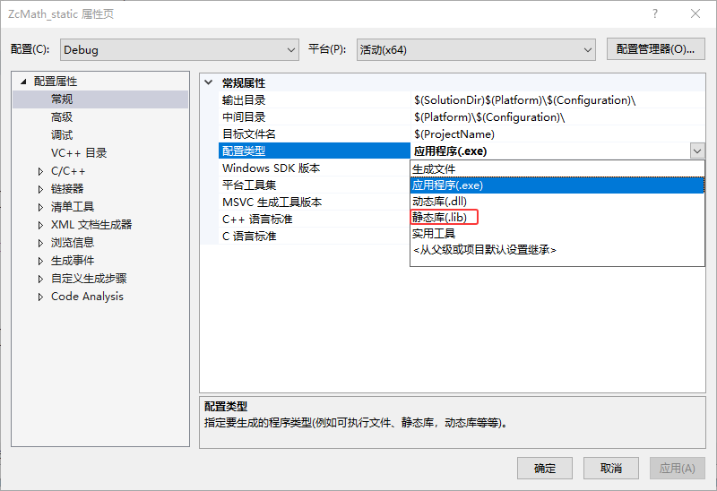
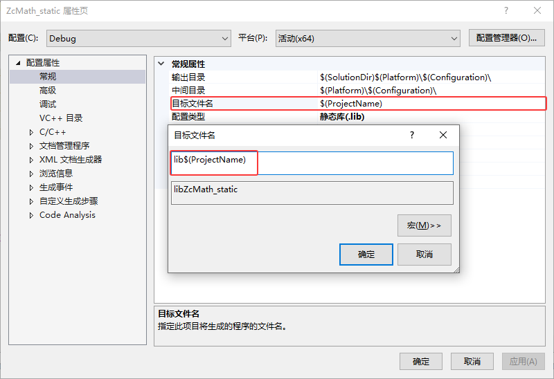
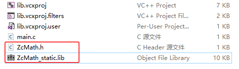
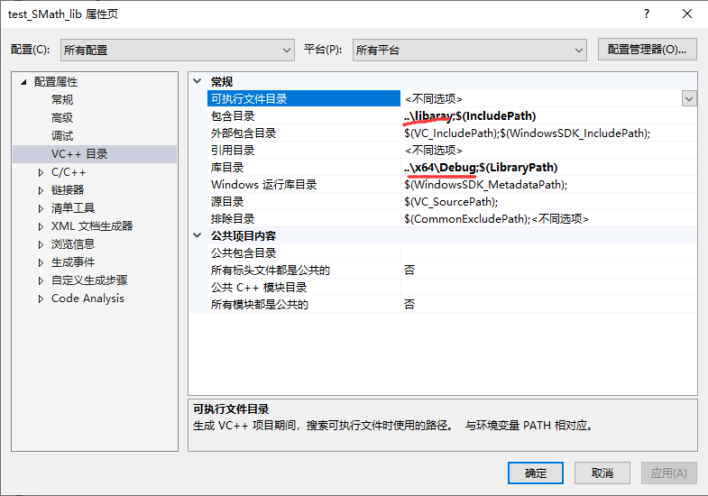
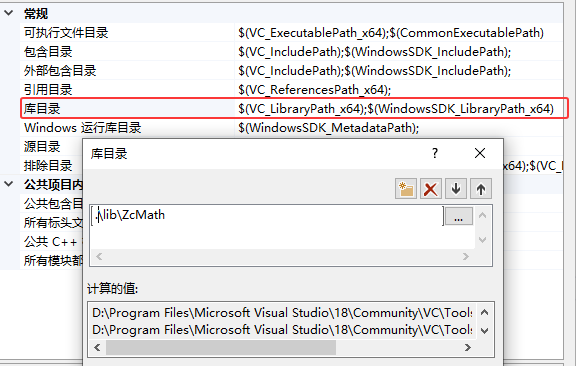
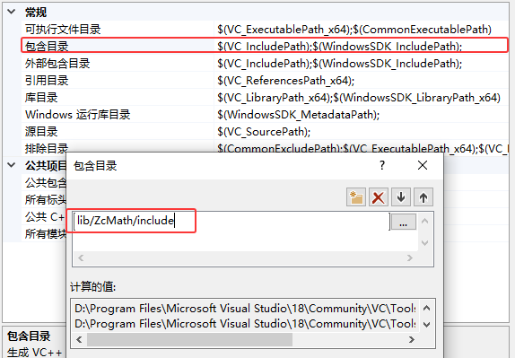
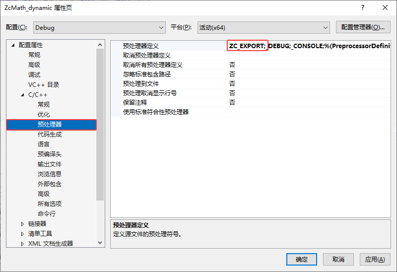
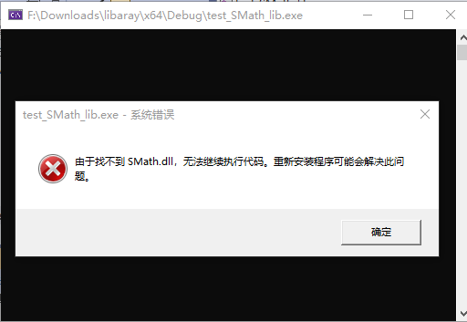

# 什么是链接库

计算机中，有些文件专门用于存储可以重复使用的代码块，例如功能实用的函数或者类，我们通常将它们称为库文件，简称“库”（Library）。

以 C 语言为例，如下为大家展示的就是一个函数库：

**ZcMath.h**

```c
#pragma once

const char* zc_version();

int zc_add(int a, int b);

int zc_sub(int a, int b);

int zc_mul(int a, int b);

int zc_div(int a, int b);
```

**ZcMath.c**

```c
#include "ZcMath.h"
#include <assert.h>

const char* zc_version()
{
    return "1.0.0";
}

int zc_add(int a, int b)
{
	return a + b;
}

int zc_sub(int a, int b)
{
    return a - b;
}

int zc_mul(int a, int b)
{
    return a * b;
}

int zc_div(int a, int b)
{
    assert(b != 0);
	return a / b;
}
```

`ZcMath.c` 文件中包含 4 个函数，它们分别可以完成两个整数的加法、减法、乘法和除法运算。`ZcMath.c`库文件的用法也很简单，直接将它添加到某一个 C 语言项目中，就可以直接调用文件中的 4 个函数，每个函数可以调用多次。

下面代码是使用的示例：

```c
#include "ZcMath.h"
#include <stdio.h>

void test() {
	int a = 2;
	int b = 4;
    
	printf("version : %s\n", zc_version());
	printf("add ret = %d\n", zc_add(a, b));
	printf("sub ret = %d\n", zc_sub(a, b));
	printf("mul ret = %d\n", zc_mul(a, b));
	printf("div ret = %d\n", zc_div(a, b));
}
```

显然，实际开发中引入他人编写好的库文件可以省略某些功能的开发环节，提高项目的开发效率。但直接使用源代码会有一些问题，而且类似 `ZcMath.c` 这种“开源”的库文件很难找到，多数程序员并不会直接分享源代码，他们更愿意分享库文件的二进制版本——链接库。

直接使用源代码面临着如下一些问题：

+ 将源代码暴漏给所有人了，如果你有一些核心代码不想给别人看，那么这将无法实现！使用库可以。
+ 源代码直接使用则耦合度高，实现变化会破坏所有使用者；库提供稳定的API，内部实现可自由升级；
+ 项目中使用源代码，每次修改都要编译所有代码非常耗时；而库只需要在最后做一下链接即可，不用重新编译；
+ 使用库可以很方便的进行版本管理和模块化；

总的来说，库是写好的现有的，成熟的，可以复用的代码。现实中每个程序都要依赖很多基础的底层库，不可能每个人的代码都从零开始，因此库的存在意义非同寻常。

本质上来说库是一种可执行代码的二进制形式，可以被操作系统载入内存执行。库有两种：**静态库（.a、.lib）**和**动态库（.so、.dll）**。

所谓静态、动态是指链接。回顾一下，将一个程序编译成可执行程序的步骤：


# 静态库

静态链接库用来和所有的目标文件一起组织成可执行文件，生成的可执行文件可以独立运行。

采用静态链接库完成链接操作，存在诸多缺点。首先，可执行文件内部拷贝了所有目标文件和静态链接库的指令和数据，文件本身的体积会很大。当系统中存在多个链接同一个静态库的可执行文件时，每个可执行文件中都存有一份静态库的指令和数据，就会造成内存空间的极大浪费。

此外，一旦程序中有模块更新，整个程序就必须重新链接后才能运行。假设一个程序有 20 个模块构成，每个模块的大小为 1 MB，那么每次更新任何一个模块，用户就必须重新获取 20 MB 的程序，对用户很不友好。

## 静态库编译

+ 首先，创建一个空项目(我取名叫做ZcMath_static)

+ 然后，将前面写的`ZcMath`库的头文件和源文件拷贝到当前项目中(不需要main函数)

+ 接着，将`项目/属性/常规/配置类型`设置为*静态库(.lib)*

  

> PS：我在工程中设置的是**Debug**模式，也可以设置**Release**，在不同模式下生成的库，在调用时也需要使用相应的模式。

+ 最后生成项目，得到`.lib`静态库：

  ```css
  生成开始于 19:33...
  1>------ 已启动生成: 项目: ZcMath_static, 配置: Debug x64 ------
  1>  ZcMath.c
  1>  ZcMath_static.vcxproj -> F:\MyCode\test_code\test_lib\静态库和动态库\x64\Debug\ZcMath_static.lib
  ========== 生成: 1 成功，0 失败，0 最新，0 已跳过 ==========
  ========== 生成 于 19:33 完成，耗时 00.361 秒 ==========
  ```

  从`输出`窗口中，可以看出生成的静态库名称为`ZcMath_static.lib`，也就是项目名称。当然可以在属性页中设置输出名称：

  

## 静态库使用

静态库编译好了，那么如何使用库呢？只需要`ZcMath.h`和`ZcMath_static.lib`，即可使用库了。

首先，我们直接将头文件和库文件拷贝到，需要使用库的项目中即可！



然后，就可以开始加载库了！在Vs中静态库使用方式有两种。

### 1. pragma指令加载

通过`#pragma comment(lib, "xxx.lib")`来加载所需要的静态库；这种方式相对简单，只需要在代码中指定要加载的静态库名称，在引用外部库比较少时相对方便一些；缺点是需要改代码并重新编译。

在`lib`项目中测试代码：

```c
#include "ZcMath.h"
#include <stdio.h>

#pragma comment(lib,"ZcMath_static.lib")

void test() {
	int a = 2;
	int b = 4;

	printf("version : %s\n", zc_version());

	printf("add ret = %d\n", zc_add(a, b));
	printf("sub ret = %d\n", zc_sub(a, b));
	printf("mul ret = %d\n", zc_mul(a, b));
	printf("div ret = %d\n", zc_div(a, b));
}
```

编译通过后，执行结果如下：(如有错误请看[注意事项](#注意事项))


### 2. 配置属性加载

该方式不使用`#pragma comment(lib, "xxx.lib")`，而是直接在属性页“VC++目录/链接器/输入”中写上`xxx.lib`。


然后把测试代码中的`#pragma`指令删掉：

```c
#include "SMath.h"
#include <stdio.h>

int main()
{
	printf("version:%s\n", s_version());
	printf("2^5 = %d\n", (int)s_pow(2, 5));
	return 0;
}
```

编译通过后，执行结果如下：(如有错误请看[注意事项](#注意事项))


那么疑问来了，每当我修改头文件和重新生成库文件时，我都需要重新拷贝到测试项目中，这样岂不是很麻烦？而且太多的第三方的头文件和库文件也会让我的工程目录变得杂乱？有没有不拷贝的更好的方法呢？

有的，我们直接在属性页“VC++目录”中，设置“包含目录”和“库目录”。

+ 由于我们已经把头文件和库文件拷贝到当前工程目录下，所以这里直接设置成当前工程目录即可。

  

+ 当然，为了方便测试，我们应该直接配置SMath项目相关的目录，这样，当修改或重新生成之后，就无需修改测试项目了。先把测试项目中的头文件和库文件删掉，然后配置目录如下：

  

  PS：相对路径和绝对路径都可以，优先相对路径，这样就算项目拷贝到别的位置也是可以使用的。

## 注意事项

### 配置库文件目录

如果链接库时，找不到对应的库文件，则会报错`fatal error LNK1104: 无法打开文件“ZcMath_static.lib”`，请检查库名称以及库路径！

如果库不在项目工作目录，则需要按照如下方式配置库目录，让vs能找到：



当然，头文件目录也需要手动配置一下：



### C++使用C库

1. 如果你的库要提供给C语言使用，生成库的时候，源文件拓展名一定要是`.c`，否则库可以链接，但是缺提示函数未定义。

2. 如果你的库要**提供给C++使用**，需要在头文件内用`extern “C”{...}`把所有函数申明包裹起来；以引导C++编译器以C语言的符号格式去库里面查找需要的函数。

   + 把测试文件拓展名改为.cpp

   + 编译运行，发现两个error，提示找不到外部符号s_pow、s_version，其实就是找不到函数的定义。

   + 这里虽然库，链接成功了，但是在库中却找不到函数，什么情况呢？这是因为C语言和C++生成的符号规则不一样，按照C++的方式去C语言库里面找肯定找不到；必须让编译器以C语言的方式去库里面找才行。

   + 修改头文件如下：

     ```c
     #pragma once
     
     #ifdef __cplusplus //如果是C++包含的头文件
     extern "C"{		   //告诉编译器以C语言的方式来读取符号
     #endif // DEBUG
     
     	double s_sqrt(double v);
     	double s_pow(double v, double n);
     	const char* s_version();
     
     #ifdef __cplusplus 
     }				//最后的结束标记
     #endif // DEBUG
     ```

3. 项目版本和位数必须和库的版本和位数一致，否则无法编译成功。

   1. Release 对 Release      Debug 对 Debug

   2. x64 对 x64                     x86 对x86

   3. 所以一般的库都会给你提供四个版本的.lib文件

      ```c
      --x64				
       -xxx.lib			//release版本
       -xxx_D.lib			//debug版本
      --x86
       -xxx.lib			//release版本
       -xxx_D.lib   		//debug版本
      ```

      有的更离谱，他又分为UNICODE字符集版本和宽字节字符集版本，这样组合起来就更多了。

# 动态库

实际上，动态链接库是 Windows 平台上对动态链接过程所用库文件的称谓，Linux 平台上习惯称为共享库或者共享对象文件，它们表达的是一个意思。

所谓动态链接，指的是将链接的时机推迟到程序运行时再进行。具体来讲，对于一个以动态链接方式运行的项目，首先由静态链接器将所有的目标文件组织成一个可执行文件，运行时将所需的动态链接库全部载入内存，由动态链接器完成可执行文件和动态库文件的链接工作。

> 动态链接库可以随可执行文件一同载入内存，也可以在可执行文件运行过程中载入，即可执行文件什么时候需要，动态链接库才会载入内存。

和静态链接库相比，动态链接库可以很好地解决空间浪费和更新困难的问题。动态链接库和可执行文件是分别载入内存的，因此动态链接库的体积通常会小一些。当有多个程序使用同一个动态链接库时，所有程序可以共享一份动态链接库的指令和数据，避免了空间的浪费。采用动态链接的方式也可以方便程序的更新和升级，当程序的某个模块更新后，只需要将旧的模块替换掉，程序运行时会自动将所有模板载入内存并动态地链接在一起。

有同学可能会问，采用动态链接的方式，每次程序运行时都需要重新链接，会不会很慢？的确，动态链接确实会损失一部分程序性能，但实践证明，动态链接库和静态链接相比，性能损失大约在 5% 以下，由此换取程序在空间上的节省以及更新时的便利，是相当值得的。

### 动态库编译

还是以`ZcMath`库为例，不过要重新创建项目`ZcMath_dynamic`，以便对比，把库代码拷贝到新项目，并把项目类型更改为dll动态库项目。


并修改头文件如下：

```c
#pragma once

#ifdef ZC_EXPORT							//是否导出
	#define ZC_API __declspec(dllexport)
#else										//否则导入
	#define ZC_API __declspec(dllimport)		
#endif	// !SMATH_API 

ZC_API const char* zc_version();

ZC_API int zc_add(int a, int b);

ZC_API int zc_sub(int a, int b);

ZC_API int zc_mul(int a, int b);

ZC_API int zc_div(int a, int b);
```

这里使用了条件编译，来判断是库的导出还是导入；当需要导出库时，在属性页预定义`ZC_EXPORT`宏即可；对于使用库方来说，不需要任何的处理，即可使用。



编译并生生成，发现生成了`ZcMath.lib`和`ZcMath.dll`文件；

```css
重新生成开始于 20:02...
1>------ 已启动全部重新生成: 项目: ZcMath_dynamic, 配置: Debug x64 ------
1>  ZcMath.c
1>    正在创建库 F:\MyCode\test_code\test_lib\静态库和动态库\x64\Debug\ZcMath_dynamic.lib 和对象 F:\MyCode\test_code\test_lib\静态库和动态库\x64\Debug\ZcMath_dynamic.exp
1>  ZcMath_dynamic.vcxproj -> F:\MyCode\test_code\test_lib\静态库和动态库\x64\Debug\ZcMath_dynamic.dll
========== 全部重新生成: 1 成功，0 失败，0 已跳过 ==========
========== 重新生成 于 20:02 完成，耗时 00.532 秒 ==========
```

> 注意：这里的.lib文件和静态库的.lib文件虽然都是.lib文件，但是包含的内容并不一样。
>
> + 静态库中的lib：包含函数代码本身(包括函数的索引和实现)，在编译时直接将代码加入程序当中。
>
> + 动态库中的lib：包含函数所在的dll文件和文件中函数位置的索引，函数实现的代码由运行时加载到进程空间中的dll提供。
>
> 所以：lib是编译时用到的，dll是运行时用到的。如果要完成代码的编译，只需要lib，如果要使动态链接的程序运行起来，只需要dll。

### 动态库使用

动态库的使用分为隐式链接和显示链接，其实这两种链接方式只是dll的两种不同的加载方式而已。

#### 隐式链接

基本步骤和链接静态库一致，就是将.dll、.lib、.h文件拷贝到调用库文件的工程目录下，通过在调用代码中包含库的头文件、并通过#pragma comment(lib,"xxx.lib")加载动态链接库中的信息或者配置依赖项，实现对动态库DLL的调用，示例代码如下：

```c
#include "ZcMath.h"
#include <stdio.h>

#pragma comment(lib,"ZcMath_dynamic.lib")

void test() {
	int a = 2;
	int b = 4;

	printf("version : %s\n", zc_version());

	printf("add ret = %d\n", zc_add(a, b));
	printf("sub ret = %d\n", zc_sub(a, b));
	printf("mul ret = %d\n", zc_mul(a, b));
	printf("div ret = %d\n", zc_div(a, b));
}
```

测试代码并没有任何变化，值得注意的是dll是自动加载的，因为已经拷贝到了项目目录（其实dll最好和exe放在一起），如果将它移除，再运行程序，会发现提示找不到SMath.dll。



> 有好几种种方式可以让exe运行的时候找到dll并加载：
>
> + dll放在项目目录(和源文件放在一块)
> + dll和exe放在同一个目录
> + 配置dll所在的路径到环境变量path

#### 显示链接

显式链接是借助Windows库的LoadLibrary来显式地加载DLL库，这种方式不需要注册.lib文件，且只在需要的地方加载DLL库即可。代价是代码略显复杂。

```c
#include <stdio.h>
#include <Windows.h>

void test() {
	//打开动态库
	HMODULE module = LoadLibrary(L"ZcMath_dynamic.dll");
	if (!module) {
		printf("load ZcMath_dynamic.dll failed\n");
		return;
	}
	//查找符号
	const char* (*zc_version)() = GetProcAddress(module, "zc_version");
	int (*zc_add)(int, int) = GetProcAddress(module, "zc_add");
	int (*zc_sub)(int, int) = GetProcAddress(module, "zc_sub");
	int (*zc_mul)(int, int) = GetProcAddress(module, "zc_mul");
	int (*zc_div)(int, int) = GetProcAddress(module, "zc_div");

	if (!zc_version || !zc_add || !zc_sub || !zc_mul || !zc_div) {
		printf("a fun find failed\n");
		return;
	}
	//调用函数
	int a = 2;
	int b = 4;

	printf("version : %s\n", zc_version());

	printf("add ret = %d\n", zc_add(a, b));
	printf("sub ret = %d\n", zc_sub(a, b));
	printf("mul ret = %d\n", zc_mul(a, b));
	printf("div ret = %d\n", zc_div(a, b));

	FreeLibrary(module);
}
```


### 注意事项

使用预编译让同一个库，可以很方便的以静态库或动态库的方式。

```c
#pragma once

#ifdef __cplusplus 
extern "C"{
#endif // DEBUG

#ifdef ZC_STATIC_LIB
	#define ZC_API 
#elif defined(ZC_SHARED_LIB)
	#ifdef ZC_EXPORT
		#define ZC_API __declspec(dllexport)
	#else
		#define ZC_API __declspec(dllimport)
	#endif	// !ZC_API 
#else
	#define ZC_API 
#endif // !SMATH_STATIC_LIB

ZC_API const char* zc_version();

ZC_API int zc_add(int a, int b);

ZC_API int zc_sub(int a, int b);

ZC_API int zc_mul(int a, int b);

ZC_API int zc_div(int a, int b);

#ifdef __cplusplus 
}
#endif // DEBUG
```

+ 如果要生成静态库，需要把项目类型改为.lib并预定义`ZC_STATIC_LIB`宏。
  + 使用静态库，不要加任何的宏

+ 如要要生成动态库，需要把项目类型改为.dll并预定义`ZC_SHARED_LIB`和`ZC_EXPORT`宏
  + 使用动态库，需要加上`ZC_SHARED_LIB`宏

