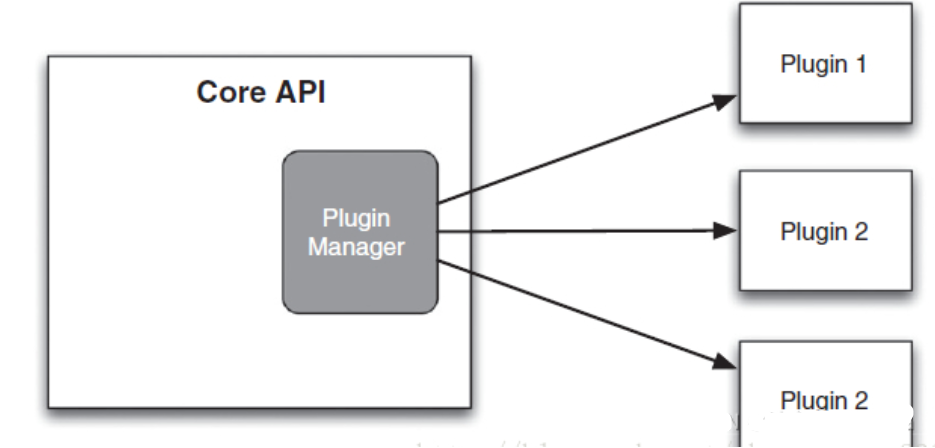

# 什么是插件机制

插件是你想开发一个好的系统所需要的一种好的架构方式。C++插件是 C++ 编写的动态链接共享对象。一种可复用的、灵活管理（维护、替换或增加、删除）的功能模块儿化组件。基于插件的扩展性，进而实现业务模块儿的独立和解耦，增加可维护性和可扩展性。插件使得第三方开发人员可以为系统做增值工作，也可以使其他开发人员协同开发相互配合，增加新的功能而不破坏现有的核心功能。插件能够促进将关注点分开，保证隐藏实现细节，且可以将测试独立开来，并最具有实践意义。

插件机制仍需要考虑的一些问题如错误处理，数据类型，版本控制，与框架代码以及应用代码的分离等等。或许，在应用程序框架容器内，可以借助lua脚本来动态的灵活的实现业务。



# 为什么要用插件机制

 现代软件工程已经从原先的通用程序库逐步过渡到应用程序框架。假设一个场景，以C++开发应用程序为例，我们的架构是基于APP+DLL的传统架构，所有的功能糅杂在一起。随着系统的日益庞大，各种模块之间耦合在一起，当修改其中一个模块时，其他模块也跟着一起受到影响。假如这两个模块式不同的开发人员负责的，那么还需要事先沟通好，这样就造成了修改维护的困难。那怎么解决这个问题？插件架构是一种选择。

“编程就是构建一个一个自己的小积木， 然后用自己的小积木搭建大系统”。但是程序还是会比积木要复杂， 我们的系统必须要保证小积木能搭建出大的系统（必须能被组合），有必须能使各个积木之间的耦合降低到最小。

传统的程序结构中也是有模块的划分，但是主要有如下几个缺点：

+ c++二进制兼容问题（**二进制兼容性** 是指在库文件版本升级时，现有的可执行文件或其他库文件无需重新编译即可正常运行）。

+ 模块对外暴露的东西过多，使调用者要关心的东西过多。

+ 可替换性和可扩展性差。

而插件式的系统架构就是为了解决这样的问题，插件机制也很符合设计模式的六大原则（现在是七大原则），是一种不错的设计。设计模式的六大原则里提到的单一职责原则、开放封闭原则、接口隔离原则、里氏替换原则，依赖倒转原则、迪米特法则。可以说插件机制几乎满足了这六大原则里所有的条款，当然也具备了由此带来的益处，因此学习和使用插件机制很有必要。

## 设计模式七大原则

都是为了更好的代码重用性，可读性，可靠性，可维护性，可扩展性。

**单一职责原则：**即一个类应该只负责一项职责，降低类的复杂度，免得改了一个影响另一个。提高类的可读性，可维护性，降低变更引起的风险。插件机制的各个插件模块就是一种单一职责。

**开闭原则：** 一个软件实体如类，模块和函数应该对扩展开放，对修改关闭。用抽象构建框架，用实现扩展细节。当软件需要变化时，尽量通过扩展软件实体的行为来实现变化，而不是通过修改已有的代码来实现变化。插件机制不正好的这个原则的实现吗。

**迪米特法则：**一个对象应该对其他对象保持最少的了解。类与类关系越密切，耦合度越大。 迪米特法则又叫最少知道原则，即一个类对自己依赖的类知道的越少越好。也就是说，对于被依赖的类不管多么复杂，都尽量将逻辑封装在类的内部。对外除了提供的public 方法，不对外泄露任何信息。插件机制的实现是这一法则很好的诠释。

**接口隔离原则：**客户端不应该依赖它不需要的接口，一个类对另一个类的依赖应该建立在最小的接口上。后面的插件实现过程可以看到，插件所提供的接口是精简和必要的最小单元。

**依赖倒转原则：**高层模块不应该依赖低层模块，二者都应该依赖其抽象；抽象不应该依赖细节，细节应该依赖抽象。依赖倒置原则基于这样一个事实：相对于细节的多变性，抽象的东西要稳定的多。以抽象为基础搭建的架构比以细节为基础的架构要稳定的多。插件机制的实现上，插件提供的接口可以看作是一种高层模块，不依赖于底层实现细节。

**里氏替换原则：**所有引用父类的地方必须能透明地使用其子类的对象，子类对象能够替换父类对象，而程序逻辑不变。根据这个理解，引申含义为：子类可以扩展父类的功能，但不能改变父类原有的功能。

**合成复用原则：**该原则阐述的是我们应该如何复用类。复用类我们可以通过“继承”和“合成”两种方式来实现。它最大的缺点就是增加了类之间的依赖，当父类发生改变时，其子类也会被动发生改变。介于继承存在的这些缺点，我们在复用类时，要优先考虑使用“合成”进行复用。合成复用原则的核心思想是：在编写代码时如果需要使用其它类，那么两个类之间尽量使用合成/聚合的方式，而不是使用继承。我们可以通过类之间的“合成”来达到“复用”代码的诉求。

# 插件机制的实现过程

**插件机制的原理：**大致思路是应用程序提供出接口，由其他同事分工或第三方实现这些接口，并编译出相应的动态链接库（即插件）；将所有插件放到某个特定目录，应用程序运行时会自动搜索该目录，并动态加载目录中的插件。

## 插件实现过程

### 定义插件接口

首先定义一个插件接口`ZcIPlugin.h`，使用纯虚类定义插件接口，确保主程序与插件之间的解耦。

```cpp
#pragma once

/**
 * 插件接口.
 */
class ZcIPlugin{
public:
	virtual ~ZcIPlugin() {}
	
public:
	virtual const char* version() = 0;
	virtual const char* name() = 0;

public:
	virtual void exec() = 0;
};
```

### 编写插件并导出入口函数

编写插件以动态库形式编译，并提供创建/销毁接口：

编写插件，就是继承插件基类`ZcIplugin`，然后实现纯虚函数，再以动态库形式编译生成动态库即可：

**MayePlugin.h**

```cpp
#pragma once

#include "ZcIPlugin.h"

class MayePlugin : public ZcIPlugin {
public:
	MayePlugin()
	{
	}

	const char* version() override;

	const char* name() override;

	void exec() override;
};
```

**MayePlugin.cpp**

```cpp
#include "MayePlugin.h"
#include <stdio.h>

const char* MayePlugin::version() { return "1.0.0"; }

const char* MayePlugin::name() { return "MayePlugin"; }

void MayePlugin::exec() { printf("Hello, %s!\n", name()); }
```

还必须，提供创建插件和销毁插件的接口，必须用C语言方式导出，否则无法查找到符号：

```cpp
extern "C" ZC_API ZcIPlugin* CreatePlugin() { return new MayePlugin(); }

extern "C" ZC_API void DestroyPlugin(ZcIPlugin* p) { delete p; }
```

编译：

```css
生成开始于 22:04...
1>------ 已启动生成: 项目: MayePlugin, 配置: Debug x64 ------
1>  MayePlugin.cpp
1>    正在创建库 F:\MyCode\test_code\test_lib\静态库和动态库\x64\Debug\MayePlugin.lib 和对象 F:\MyCode\test_code\test_lib\静态库和动态库\x64\Debug\MayePlugin.exp
1>  Plugin.vcxproj -> F:\MyCode\test_code\test_lib\静态库和动态库\x64\Debug\MayePlugin.dll
========== 生成: 1 成功，0 失败，0 最新，0 已跳过 ==========
========== 生成 于 22:04 完成，耗时 00.855 秒 ==========
```

## 插件使用过程

编译好插件之后，就可以在主程序中使用插件了。

- 使用 `dlopen` / `dlsym`（Linux）或 `LoadLibrary` / `GetProcAddress`（Windows）加载插件：

```cpp
#include "ZcIPlugin.h"
#include <stdio.h>
#include <Windows.h>
```

