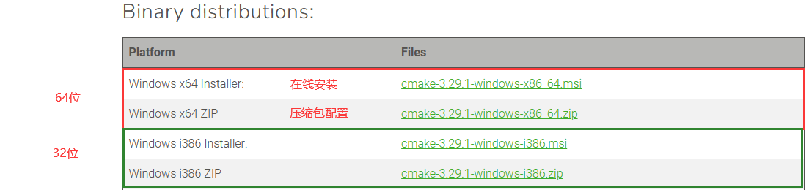

# 1. MinGW

## 1.1 MinGW简介

MinGW 的全称是：Minimalist GNU on Windows 。它实际上是将经典的开源 C语言 编译器 GCC 移植到了 Windows 平台下，并且包含了 Win32API ，因此可以将源代码编译为可在 Windows 中运行的可执行程序。而且还可以使用一些 Windows 不具备的，Linux平台下的开发工具。一句话来概括：MinGW 就是 GCC 的 Windows 版本 。

以上是 MinGW 的介绍，MinGW-w64 与 MinGW 的区别在于 MinGW 只能编译生成32位可执行程序，而 MinGW-w64 则可以编译生成 64位 或 32位 可执行程序。

正因为如此，MinGW 现已被 MinGW-w64 所取代，且 MinGW 也早已停止了更新，内置的 GCC 停滞在了 4.8.1 版本，而 MinGW-w64 内置的 GCC 则更新到了 8.1.0 版本。

## 1.2 下载与安装

### 1.2.1 下载

1） 打开 [MinGW 官网](https://www.mingw-w64.org/downloads)，往下滑动，找到如下图所示位置，点击GitHub。


2）点击之后进入如下页面，下载红色框中的压缩包


3）下载之后进行解压(直接提取到当前文件夹)


得到如下目录：


然后把这个目录拷贝到专门存放工具的目录中，自己一定要能找到！

拷贝好之后，将bin(`C:\MyData\tools\mingw64\bin`)目录配置到系统环境变量中！

4）来，验证一下是否配置成功！

打开`cmd`输入`gcc --version`，出现如图所示内容，表示配置成功

```bash
gcc (x86_64-win32-seh-rev0, Built by MinGW-Builds project) 15.2.0
Copyright (C) 2025 Free Software Foundation, Inc.
This is free software; see the source for copying conditions.  There is NO
warranty; not even for MERCHANTABILITY or FITNESS FOR A PARTICULAR PURPOSE.
```


## 1.3 基本使用

先来一段代码，命名为main.c。

```c
#include<stdio.h>

int main()
{
    printf("hello world\n");
    return 0;
}
```

在cmd输入命令：`gcc main.c -o hello`


使用CMake构建并生成~

+ 构建项目

```bash
cmake -B build -G "MinGW Makefiles"
```

+ 生成项目

```bash
cmake --build build
```


# 2. VS Code安装

## 2.1 VS Code简介

Visual Studio Code（简称“VS Code” ）是Microsoft在2015年4月30日Build开发者大会上正式宣布一个运行于 Mac OS X、Windows和Linux 之上的，针对于编写现代Web和云应用的跨平台源代码编辑器， 可在桌面上运行，并且可用于Windows，macOS和Linux。它具有对JavaScript，TypeScript和Node.js的内置支持，并具有丰富的其他语言（例如C++，C＃，Java，Python，PHP，Go）和运行时（例如.NET和Unity）扩展的生态系统。

## 2.2 下载与安装

1） 打开 [Visual Studio Code 官网](https://code.visualstudio.com/)，点击Download for Windows按钮下载。(如果需要Linux版本，或者Mac版本可以点右上角的下载按钮)


2）下载之后得到VSCodeUserSetup-x64-1.66.1.exe，鼠标左键双击安装


3）同意协议，点击下一步


4）选择VS Code安装位置，点击下一步


5）一直下一步，直到选择附加任务，把其他里面的 创建上下文菜单选上，即在桌面右键时，会在右键菜单中显示用vs code打开。


6）然后下一步等待安装完成


7）几秒之后安装即可完成！！


## 2.3 界面介绍

VS Code安装完毕之后，打开界面如下图


## 2.4 安装插件

### 2.4.1 汉化插件

1）进入插件商店：搜索chinese > 选择简体中文 >在右边窗口中点击`install`


2）安装完成，右下角会弹出一个提示框，点击按钮`修改语言并重启VS Code`即可汉化成功！


3）看成果~~


### 2.4.2 C/C++插件

接下来需要安装C/C++插件，提供语法和补全功能。

直接选择C/C++拓展包即可，包含CMake Tools、C/C++、C/C++ Thems三个插件。


# 3. VS Code开发

Vs Code是基于文件夹管理项目的，所以每个C/C++项目都需要一个单独的目录。

1）在合适的位置创建一个文件夹，如helloworld。


2）进入helloworld目录，右键`通过Code打开`(win11按着`shift`再点击鼠标右键)


3）打开的时候会提示`是否信任此文件夹中的文件的作者`，点击信任即可~~


4）创建源文件`main.c`,并写入输出`hello word`的代码


5）Ctrl+F5运行（F5可以进入调试模式），或者点击菜单栏->运行->以非调试模式运行，然后会弹出窗口，需要选择一下

+ 选择C++（GDB/LLDB）


+ 选择C/C++:gcc.exe


+ 在最下面会显示执行结果：hello world


<font style="color:red">注意：调试的时候，需要先选中源文件，不要点击别的文件，否则会出现错误</font>

# 4. CMake

## 3.1 CMake简介

CMake是一个跨平台的安装（[编译](https://baike.baidu.com/item/编译/1258343)）工具，可以用简单的语句来描述所有平台的安装(编译过程)。

## 3.2 下载与安装

### Windows

1） 打开 [CMake 官网](https://cmake.org/)，点击Download 。


2）往下翻，找到如下图所示位置，这里选择64位压缩包版



3）下载下来得到`cmake-3.23.0-windows-x86_64.zip`压缩包，解压出来


4）拷贝到合适的位置


5）把bin目录`C:\cmake-3.23.0-windows-x86_64\bin`配置到path环境变量


5）打开cmd，输入cmake --version测试是否配置成功！


如上图所示，ok，配置成功！！

### MacOs

#### CMake

+ 下载macos版本的cmake


+ 下载完成后双击打开


+ 安装，将CMake拖到Applications中，即可安装完成


+ 在启动台中能看到安装好的CMake


但这只是一个图形界面，并不是我们想要的命令行程序，事实上，我们打开的这个程序叫做 **cmake-gui**，而命令行程序叫做 **cmake**，他们都在 "`/Applications/CMake.app/Contents/bin`" 目录下。

那么现在就有两种方法可以将它们加入到环境变量中

- 方法1. 在 "/usr/local/bin" 目录建立软链接**（推荐）**

  ```shell
  sudo "/Applications/CMake.app/Contents/bin/cmake-gui" --install
  ```

  如果想在其它目录建立软链接：

  ```shell
  sudo "/Applications/CMake.app/Contents/bin/cmake-gui" --install=/path/to/bin
  ```

- 方法2. 将它们加入 PATH： `PATH="/Applications/CMake.app/Contents/bin":"$PATH"`

测试一下cmake命令：

```bash
vm-maye@vm-mayedeMac ~ % cmake --version
cmake version 4.2.0-rc3

CMake suite maintained and supported by Kitware (kitware.com/cmake).
```


#### 命令行工具

命令行工具（Command Line Tools）是 macOS 上至关重要的插件，苹果官方是这么介绍它的：下载 macOS SDK、标题和构建工具（如 Apple LLVM 编译器和 Make），能助您轻松安装开源软件或在终端内的 UNIX 上进行开发。

简单来说，Command Line Tools 就是一个小型独立包，为 macOS 终端用户提供了很多常用的工具、实用程序和一些编译器，包括但不限于git、make、gcc、clang、perl、size、strip、cpp、python3…

在终端中输入命令：

```bash
xcode-select --install
```

按下回车会弹出提示框：


点击安装，又会弹出协议，点击“同意”：


然后就会自动查找并下载：


刚开始下载展示的时间很长，不要担心，其实只要网络没问题，很快就能下载好(我实际花了1分钟不到)！下载完毕之后直接自动进入安装(安装花了5分钟)：


安装完毕后，点击“完成”即可：


测试一下：

```bash
vm-maye@vm-mayedeMac ~ % gcc --version
Apple clang version 14.0.0 (clang-1400.0.29.202)
Target: x86_64-apple-darwin21.5.0
Thread model: posix
InstalledDir: /Library/Developer/CommandLineTools/usr/bin
```


### Linux

## 3.3 基本使用

还是用前面创建的helloworld项目，先在`main.c`同级目录中创建`CMakeLists.txt`并写入如下cmake指令。

```cmake
cmake_minimum_required(VERSION 3.5)

project(helloworld)

add_executable(helloworld main.c)
```

+ 内部构建

打开控制台，输入`cmake -G "MinGW Makefiles"`会生成如下文件：


+ 外部构建

```cmake
cmake -G "MinGW Makefiles" -B build
```

最后，输入命令

```shell
cmake --build build
```

或者

```shell
cd build
mingw32-make
```

生成可执行文件。


# 5 VSCode CMake开发

C/C++插件、CMake插件安装好之后，就可以使用VsCode结合CMake进行C/C++开发了

1）先创建一个文件夹，然后用Vs Code打开


2）按快捷键`Ctrl+Shift+P`，或者点击菜单栏->帮助->显示所有命令，输入cmake

+ 选择列表中的`CMake:快速入门`


+ 紧接着选择一个编译器套件，这里就只有一个，有多个可以看着来


+ 再给你的项目取个名字，一般和你的项目文件夹名一样即可，选好了之后按回车


+ 接下来选择你需要生成的目标(Libary 库   Executable 可执行程序)
  + 咱们当然要可执行程序啦


+ 选择之后，稍等一下，即可自动配置完成(需要提前安装好cmake构建工具哟)！！
+ 如果没有开始配置，重启一下Vs即可！


3）按Shitf+F5就可以编译，并运行程序啦！

+ 按Ctrl+F5可以进入调试模式哦


在左边工具栏的cmake视图中，可以看到项目的状态，并可以进行一些配置：


