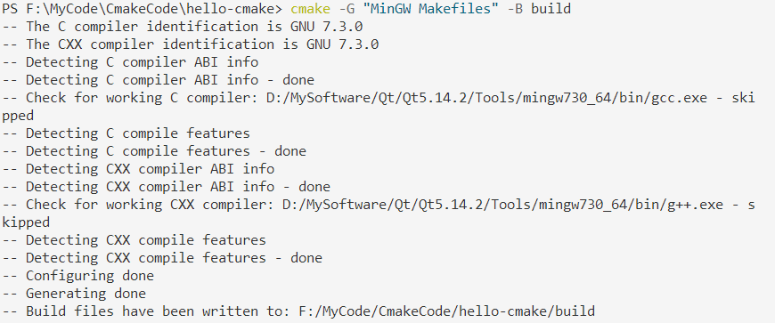

# CMake使用

## 1 hello-cmake

对于简单的项目，只需要一个三行`CMakeLists.txt`文件即可。

### 文件树

```txt
|——CMakeLists.txt
|——main.cpp
```

#### CMakeLists.txt

```cmake
cmake_minimum_required(VERSION  3.23)
```

要求cmake的最小版本，低于指定版本的cmake构建，会报错：

> CMake 4.0 or higher is required.  You are running version 3.23.0

```cmake
porject(hello_cmake)
```

project命令用于指定cmake工程的名称。

```cmake
add_executable(hello_cmake main.cpp)
```

使用指定的源文件来生成目标可执行文件。

#### main.cpp

```cpp
#include <iostream>

int main(int argc, char *argv[])
{
   std::cout << "Hello CMake!" << std::endl;
   return 0;
}
```

### 构建与生成

**构建**出指定构建系统的文件(如.sln、makefile)

```shell
cmake -G "NMake Makefiles" -B build
```

+ -G 指定构建系统生成器()
+ -B 指定生成目录(中间文件、可执行文件等)



**生成**可执行程序

```shell
cmake --build build
cmake --build . --target INSTALL	#安装
```

+ --build  指定要构建的项目二进制目录


## 2 直译和非直译模式

直译模式简单解释就是不生成Makefile的模式。这很方便我们验证一些CMakeLists.txt的语法及验证一些数学运算等。

**直译模式(Process script mode)：**

输入 **-P 参数**指定CMakeLists.txt脚本以直译模式解析(不需要C/C++源文件)。其中，message是CMakeLists.txt中用于输出信息的命令。以直译模式解析就不会生成Makefile文件，并且终端输出的信息就是我们CMakeLists.txt指定输出的内容。


**非直译模式(正常模式):**

以非直译模式解析则会生成Makefile文件，并且终端多输出了一些核查编译器相关的信息。

```shell
cmake  .\CMakeLists.txt -G "MinGW Makefiles" -B build
```


## 3 message命令

message命令用于在生成和构建过程中输出信息。

**语法格式**

```cmake
message([<mode>] "message text" ...)
```

+ [<mode>]：是消息级别，级别从低到高如下：
  + FATAL_ERROR：CMake错误，停止处理和生成，直接结束cmake的生成。
  + SEND_ERROR：CMake错误，继续处理，但跳过生成，cmake继续执行，但是不生成。
  + WARNING：CMake警告，继续处理
  + AUTHOR_WARNING：同WARNING，只不过这个是专门针对开发使用的，可以使用`--Wno-dev`来抑制打印。
  + NOTICE：打印到 stderr 的重要消息，以吸引用户注意。
  + STATUS：项目用户可能感兴趣的主要消息。理想情况下，这些消息应该简洁，不超过一行，但仍具信息量。
  + VERBOSE：供项目用户使用的详细信息消息。这些消息应提供在大多数情况下不感兴趣的额外详细信息，但对于那些希望深入了解正在发生的事情的项目构建者来说可能有用。
  + DEBUG：供开发项目本身的开发人员使用的详细信息消息，而不是只想构建它的用户。这些消息通常不会引起构建项目的其他用户的兴趣，并且通常与内部实现细节密切相关
  + TRACE：包含非常低级实现细节的细粒度消息。使用此日志级别的消息通常只应是临时的，并期望在发布项目、打包文件等之前删除
+ "message text"：消息文本，最好使用双引号包裹。

> 默认情况下只打印STATUS级别和以下级别的消息，可以使用`--log-level`选项设置日志级别，例如：--log-level=DEBUG，这样就可以打印DEBUG和VERBOSE级别的日志。
>
> 消息前缀都以`CMAKE_MESSAGE_INDENT `变量中的内容作为前缀，可以通过set命令来设置它，例如：`set(CMAKE_MESSAGE_INDENT "HDY: ")`

## 4  CMake变量

变量是CMake语言的最基本的存储单元。变量的值始终为**字符串类型**，尽管一些命令将会将其理解为其他类型的值。命令`set()`和`unset()`用于显式地设置或重置一个变量。变量名是区分大小写的、命名规范建议和编程语言一致。

### 自定义变量

通过命令`Set`可一个普通、缓存和环境变量的值。语法格式：

```cmake
set(<variable> <value>)
```

<value>...这一部分可以是零个以上的值，也就是意味着可以为空。多个参数将以分号分隔的列表形式连接，以形成要设置的实际变量值。

如果值为空，那么等价于`unset`取消变量设置

```cmake
unset(<variable>)
```

访问一个值，格式`${<variable>}`。使用起来较复杂（美元符号+大括号包裹要使用的变量名）

### 系统变量

cmake常用系统变量：

| 变量                     | 解释                                                         |
| ------------------------ | ------------------------------------------------------------ |
| CMAKE_SOURCE_DIR         | 根源目录。                                                   |
| CMAKE_CURRENT_SOURCE_DIR | 当前所在的源目录（如果使用子项目）。                         |
| CMAKE_BINARY_DIR         | 根构建目录（运行 cmake 命令的目录）。                        |
| CMAKE_CURRENT_BINARY_DIR | 当前所在的构建目录。                                         |
| CMAKE_CURRENT _LIST_DIR  | 当前正在处理的列表文件的完整目录。当 CMake 处理项目中的列表文件时，此变量将始终设置为当前正在处理的列表文件所在的目录。 |
| CMAKE_CURRENT_LIST_FILE  | 当前正在处理的列表文件的完整路径                             |
| CMAKE_CURRENT_LIST_LINE  | 当前正在处理的文件的行号                                     |


#### 平台相关变量

| 变量                 | 解释                                                     |
| -------------------- | -------------------------------------------------------- |
| CMAKE_SYSTEM_VERSION | 操作系统版本，如：10.0.19044                             |
| CMAKE_SYSTEM_NAME    | 操作系统名，如：Windows                                  |
| CMAKE_SYSTEM         | 上面两个的结合，如：Windows-10.0.19044                   |
| CMAKE_SIZEOF_VOID_P  | void指针的大小。 x64位8个字节，x32位4个字节              |
| CMAKE_BUILD_TYPE     | 构建类型（Release、Debug、MinSizeRel 或 RelWithDebInfo） |

#### 编译器相关变量

查看编译器相关属性，<LANG>是C、CXX、OBJC、OJBCXX

| 变量                            | 解释                                                         |
| ------------------------------- | ------------------------------------------------------------ |
| CMAKE\_<LANG>\_COMPILER_ID      | 编译器标识字符串。如：GUN 、MSVC<br> <font style="font:normal 12px gray">不保证为所有编译器或语言定义此变量</font> |
| CMAKE\_<LANG>\_COMPILER_VERSION | 编译器版本 如：7.3.0                                         |

#### 编译相关变量

| 变量               | 解释                                                         |
| ------------------ | ------------------------------------------------------------ |
| BUILD_SHARED_LIBS  | 控制默认的库编译方式, 如果未进行设置, 使用ADD_LIBRARY时又没有指定库类型默认编译生成的库都是静态库 |
| CMAKE_C_FLAGS      | 设置C编译选项  如：-Wall(-Wall选项意思是编译后显示所有警告)  |
| CMAKE_CXX_FLAGS    | 设置C++编译选项                                              |
| CMAKE_C_COMPILER   | 指定C编译 器(编译器完整路径)                                 |
| CMAKE_CXX_COMPILER | 指定C++编译器                                                |
| CMAKE_C_STANDARD   | 指定C标准 如： C11                                           |
| CMAKE_CXX_STANDARD | 指定C++标准 如：C++11 C++17 C++20                            |

#### 输出目录变量

设置一下变量，可以改变对应的输出目录。如：`SET(CMAKE_RUNTIME_OUTPUT_DIRECTORY "./bin")`

| 变量                           | 解释           |
| ------------------------------ | -------------- |
| CMAKE_RUNTIME_OUTPUT_DIRECTORY | 静态库文件目录 |
| CMAKE_ARCHIVE_OUTPUT_DIRECTORY | 动态库文件目录 |
| CMAKE_LIBRARY_OUTPUT_DIRECTORY | 可执行文件目录 |

#### 项目相关变量

project命令中指定的参数可以通过以下变量查看。如：`project(var VERSION 0.1.0.1 DESCRIPTION "My First project" HOMEPAGE_URL "www.maye.com")`

| 变量                  | 解释                               |
| --------------------- | ---------------------------------- |
| PROJECT_VERSION       | 完整版本号 如：0.1.2.3             |
| PROJECT_VERSION_MAJOR | 主版本号 如：0                     |
| PROJECT_VERSION_MINOR | 附版本号  如：1                    |
| PROJECT_VERSION_PATCH | 补丁版本号 如：2                   |
| PROJECT_VERSION_TWEAK | 改进版本号 如：3                   |
| PROJECT_BINARY_DIR    | 可执行文件目录                     |
| PROJECT_SOURCE_DIR    | 源文件目录                         |
| PROJECT_DESCRIPTION   | 项目描述，在project()里指定        |
| PROJECT_HOMEPAGE_URL  | 项目主页URL                        |
| PROJECT_IS_TOP_LEVEL  | 是否是顶级项目(不是子项目)  ON/OFF |
| PROJECT_NAME          | 项目名                             |

#### 安装相关变量

| 变量 | 解释 |
| ---- | ---- |
|CMAKE_INSTALL_DEFAULT_COMPONENT_NAME||
|CMAKE_INSTALL_DEFAULT_DIRECTORY_PERMISSIONS||
|CMAKE_INSTALL_MESSAGE||
|CMAKE_INSTALL_NAME_DIR||
|CMAKE_INSTALL_PREFIX||
|CMAKE_INSTALL_PREFIX_INITIALIZED_TO_DEFAULT||
|CMAKE_INSTALL_REMOVE_ENVIRONMENT_RPATH||
|CMAKE_INSTALL_RPATH||
|CMAKE_INSTALL_RPATH_USE_LINK_PATH||

## 5 条件判断

### 基本语法

```cmake
if(条件)
	命令
elseif(条件)
	命令
else()
	命令
endif()
```

if、endif必须要有，其他的可有可无。

### 条件语法

所有的条件都可以用在`if`,`elseif`和`while()`中。

复合条件优先顺序：

+ 括号。

+ 一元测试，例如EXISTS、COMMAND和DEFINED。

+ 二进制测试，例如EQUAL、LESS、LESS_EQUAL、GREATER、 GREATER_EQUAL、STREQUAL、STRLESS、STRLESS_EQUAL、 STRGREATER、STRGREATER_EQUAL、VERSION_EQUAL、VERSION_LESS、 VERSION_LESS_EQUAL、VERSION_GREATER、VERSION_GREATER_EQUAL和MATCHES。

+ 一元逻辑运算符NOT。

+ 二元逻辑运算符AND和OR，从左到右，没有任何短路。

### 基本表达式

```cmake
if(<constant>)
```

如果常数是`1`, `ON`, `YES`, `TRUE`,`Y`或非零数（包括浮点数），则为真。False 如果常量是`0`, `OFF`, `NO`, `FALSE`, `N`, `IGNORE`, `NOTFOUND`, 空字符串，或者以`-NOTFOUND`后缀结尾。命名布尔常量不区分大小写。如果参数不是这些特定常量之一，则将其视为变量或字符串（请参阅下面的[变量扩展](https://cmake.org/cmake/help/latest/command/if.html?highlight=#variable-expansion) ），并适用以下两种形式之一。

```cmake
if(<variable>)
```

如果给定一个定义为非假常量的值的变量，则为真。否则为 False，包括变量未定义时。

```cmake
if(<string>)
```

带引号的字符串始终计算为 false，除非字符串的值是真正的常量之一。

+ “maye” 为false  maye不一定是常量，也可能是变量
+ “123”  为true     123为常量
+ "YES" 为true      YES为常量

### 运算符

逻辑运算符

| 运算符 | 案例           | 描述                                     |
| ------ | -------------- | ---------------------------------------- |
| NOT    | if(NOT YES)    | 如果条件不为真，则为真。                 |
| AND    | if(YES AND NO) | 如果两个条件都被单独认为是真的，则为真。 |
| OR     | if(YES OR NO)  | 如果任一条件单独被认为是真的，则为真。   |

+ 复杂的逻辑表达式：`if((condition) AND (condition OR (condition)))`

#### 存在性检查

| 运算符  | 案例                        | 描述                                                         |
| ------- | --------------------------- | ------------------------------------------------------------ |
| COMMAND | if(COMMAND message)         | 如果给定名称是可以调用的命令、宏或函数，则为真。             |
| TARGET  | if(TARGET hello_camke)      | 如果给定名称是由调用创建的现有逻辑目标名称，则为真[`add_executable()`](https://cmake.org/cmake/help/latest/command/add_executable.html#command:add_executable),[`add_library()`](https://cmake.org/cmake/help/latest/command/add_library.html#command:add_library)， 或者[`add_custom_target()`](https://cmake.org/cmake/help/latest/command/add_custom_target.html#command:add_custom_target)已经调用的命令（在任何目录中）。 |
| IN_LIST | if(hello IN_LIST TEST_LIST) | *3.3 新版功能：*如果给定元素包含在命名列表变量中，则为真。   |

#### 比较运算符

| 运算符           | 案例 | 描述                                                         |
| ---------------- | ---- | ------------------------------------------------------------ |
| MATCHES          |      | 如果给定的字符串或变量的值与给定的正则表达式匹配，则为真     |
| LESS             |      | 如果给定字符串或变量的值是有效数字且小于右侧的数字，则为真   |
| GREATER          |      | 如果给定的字符串或变量的值是有效数字并且大于右边的数字，则为真 |
| EQUAL            |      | 如果给定字符串或变量的值是有效数字并且等于右侧的数字，则为真 |
| LESS_EQUAL       |      | *3.7 版新功能：*如果给定字符串或变量的值是有效数字且小于或等于右侧的数字，则为真。 |
| GREATER_EQUAL    |      | *3.7 新版功能：*如果给定字符串或变量的值是有效数字并且大于或等于右侧的数字，则为真。 |
| STRLESS          |      | 如果给定字符串或变量的值按字典顺序小于右侧的字符串或变量，则为真 |
| STRGREATER       |      | 如果给定字符串或变量的值按字典顺序大于右侧的字符串或变量，则为真。 |
| STREQUAL         |      | 如果给定字符串或变量的值在字典上等于右侧的字符串或变量，则为真。 |
| STRLESS_EQUAL    |      | *3.7 版中的新功能：*如果给定字符串或变量的值按字典顺序小于或等于右侧的字符串或变量，则为真。 |
| STRGREATER_EQUAL |      | *3.7 新版功能：*如果给定字符串或变量的值在字典上大于或等于右侧的字符串或变量，则为真。 |

#### 版本比较

| 运算符                | 案例 | 描述                                                         |
| --------------------- | ---- | ------------------------------------------------------------ |
| VERSION_LESS          |      | 组件级整数版本号比较(省略的组件被视为零)。 任何非整数版本组件或版本组件末尾的非整数部分都将在此时有效地截断字符串。 |
| VERSION_GREATER       |      | 同上                                                         |
| VERSION_EQUAL         |      | 同上                                                         |
| VERSION_LESS_EQUAL    |      | *3.7 版中的新功能：*同上                                     |
| VERSION_GREATER_EQUAL |      | *3.7 版中的新功能：*同上                                     |

### 变量扩展

if 命令是在 CMake 历史的早期编写的，早于 ${} 变量评估语法，并且为方便起见，评估由其参数命名的变量，如上述签名所示。 请注意，使用 ${} 的正常变量评估在 if 命令甚至接收参数之前应用。 因此像这样的代码

```cmake
set(var1 OFF)
set(var2 "var1")
if(${var2})
```

if命令显示为

```cmake
if(var1)
```

和根据上面记录的if(<variable>)情况进行计算。 结果是OFF，即false。 但是，如果我们从示例中删除${}，命令就会看到

```cmake
if(var2)
```

这是true，因为var2被定义为var1，而var1不是false常数。  

### 案例

+ 判断构建平台

```cmake
if(CMAKE_SYSTEM_NAME EQUAL "Windows")
    message(STATUS "This is the Windows platform")
elseif(CMAKE_SYSTEM_NAME EQUAL "Linux")
    message(STATUS "This is the Linux platform ")
elseif(CMAKE_SYSTEM_NAME EQUAL "Darwin")
    message(STATUS "This is the Macos platform ")
else()
    message(STATUS "This is the ${CMAKE_SYSTEM_NAME} platform ")
endif()
```

+ 是否定义了变量

```cmake
if(CMAKE_SIZEOF_VOID_P EQUAL 4)
    message(STATUS "CMAKE_SIZEOF_VOID_P 4")
    set(x86 TRUE)
else()
    message(STATUS "CMAKE_SIZEOF_VOID_P  8")
    set(x64 TRUE)
endif()
#判断是否定义了变量
if(x86)
    message(STATUS "x86")
else(x64)
    message(STATUS "x64")
endif()
```


## 6 循环

[list](https://cmake.org/cmake/help/latest/command/list.html?highlight=list)

CMake中有两种循环(`foreach`和`while`)可以使用，支持`break`和`continue`流程控制语句。

### 6.1 foreach循环

```cmake
foreach(<loop_var> <items>)
  	<commands>
endforeach()
```

<items>是由分号或空格分隔的item列表；在每次迭代开始时，变量<loop_var>将被设置为当前项的值。  

+ 遍历列表

```cmake
foreach(num 1 2 3 4)
    message(STATUS ${num})
endforeach()
#或
set(num_list 1 2 3 4)
foreach(num ${num_list})
    message(STATUS ${num})
endforeach()
```

+ `foreach(<loop_var> RANGE <stop>)`，从0遍历到stop(包含stop)

```cmake
foreach(num RANGE 10)
    message(STATUS ${num})
endforeach()
```

+ `foreach(<loop_var> RANGE <start> <stop> [<step>])`，从start遍历到stop，步长为step，如果不指定step则为1

```cmake
foreach(num RANGE 0 100 10)
    message(STATUS ${num})
endforeach()
```

+ `foreach(<loop_var> IN [LISTS [<lists>]] [ITEMS [<items>]])`

```CMAKE
#遍历lists列表中的项
set(my_list "hello" "world" "maye")
foreach(num IN LISTS my_list)
    message(STATUS ${num})
endforeach()
#直接指定项items
foreach(num IN ITEMS "顽石" "九夏" "莫影")
    message(STATUS ${num})
endforeach()
```

+ `foreach(<loop_var> ... IN ZIP_LISTS <lists>)`，3.17版本引入，组合多个列表一起遍历，如果指定的2多个列表项目数量不相等，项数少的，在loop_var中的值为空值。

```cmake
set(A 1 2 3 4)
set(B 'hello' 'world')
#方式一
foreach(a b IN ZIP_LISTS A B)
    message(STATUS "${a}   ${b}")
endforeach()
#方式二
foreach(pair IN ZIP_LISTS A B)
     message(STATUS "${pair_0}  ${pair_1}")
     if(pair_1)	#判断是不是空值
     	message(STATUS "paie_1 is NULL");
     endif()
endforeach()
```

### 6.2 while循环

```cmake
while(<condition>)
	<commands>
endwhile()
```

<condition>为true时，就执行命令列表<commands>

```cmake
set(i 0)
while(i LESS 10)
	message(STATUS "i is ${i}")
	math(EXPR i "${i} + 1")
endwhile()
```


## 7 函数

### 相关变量

| 变量                             | 描述                                                   |
| -------------------------------- | ------------------------------------------------------ |
| CMAKE_CURRENT _FUNCTION          | 此变量包含当前函数的名称。它对于诊断或调试消息很有用。 |
| CMAKE_CURRENT_FUNCTION_LIST_DIR  | 此变量包含定义当前函数的CMakeLists文件的完整目录       |
| CMAKE_CURRENT_FUNCTION_LIST_FILE | 此变量包含定义当前函数的CMakeLists文件的完整路径       |
| CMAKE_CURRENT_FUNCTION_LIST_LINE | 此变量包含定义当前函数的列表文件中的行号。             |

## 8 文件操作

文件操作命令`file`，这个命令专用于需要访问文件系统的文件和路径操作。  对于其他仅处理语法方面的路径操作，请查看cmake_path()命令。

### 8.1 读文件

+ 读取二进制/文本文件

```cmake
file(READ <filename> <variable> [OFFSET <offset>] [LIMIT <max-in>] [HEX])
```

从名为<filename>的文件中读取内容，并将其存储在<variable>中。 可选地从给定的<offset>(文件位置指针从0开始)开始，最多读取<max-in>字节。 HEX选项将数据转换为十六进制表示(对二进制数据很有用)。 如果指定了HEX选项，输出中的字母(a到f)都是小写的。  

+ 读取文本文件

```cmake
file(STRINGS <filename> <variable> [<options> ...])
```

解析来自<filename>的ASCII字符串列表，并将其存储在<variable>中。 忽略文件中的二进制数据。 忽略回车(\r, \n)字符。 选项有:  [选项列表](#2 file命令选项表)

#### 其他

+ 对文件内容进行哈希

  ```cmake
  file(<HASH> <filename> <variable>)
  ```

+ 获取文件修改的时间

  ```cmake
  file(TIMESTAMP <<filename> <variable>)
  ```

  计算<filename>的修改时间的字符串表示，并将其存储在<变量>中。如果该命令无法获取时间戳变量，则将其设置为空字符串("")。

+ 递归地获得给定文件所依赖的库列表。

  + 未测试


### 8.2 写文件

```cmake	
file(WRITE <filename> <content>...)
file(APPEND <filename> <content>...)
```

将<content>写入名为<filename>的文件。 如果该文件不存在，则创建该文件。 如果文件已经存在，WRITE模式将覆盖它，APPEND模式将追加到文件的末尾。 <filename>指定的路径中不存在的任何目录将被创建。  

如果该文件是一个构建输入，则仅在其内容更改时使用configure_file()命令更新该文件。

+ 触摸文件

  ```cmake
  file(TOUCH [<files>...])
  file(TOUCH_NOCREATE [<files>...])
  ```

  **TOUCH：**如果文件不存在，则创建。如果文件已经存在，它的访问和/或修改将被更新到函数调用执行时。

  **TOUCH_NOCREATE：**触摸一个文件，如果它存在，它的访问和/或修改将被更新到函数调用执行时。如果文件不存在，它将被无声地忽略(啥也不做)。

  > 使用TOUCH和TOUCH_NOCREATE，现有文件的内容将不会被修改。


## 8 定义宏

我们可以再cmake中定义宏，以便再C/C++代码中使用。

+ 添加宏定义

```cmake
add_compile_definitions(<definition> ...)
```

+ 给目标添加宏定义：名称`<target>`必须是由命令创建的，例如 `add_executable()`或者`add_library()`并且不能是 ALIAS 目标。

```cmake
target_compile_definitions(<target>）
```

## 9 生成库和使用库

## 10 安装

所谓安装，起就是把我们需要的文件复制到指定位置，方便使用。

### 10.1 安装目标

```cmake
install(TARGETS targets... [DESTINATION <dir>])
```


## 10 模块

[find_package()函数](https://blog.csdn.net/fb_941219/article/details/88526157)

[如何将CMAKE_MODULE_PATH设置为在CMake中进行常规构建和源代码外构建？](https://cloud.tencent.com/developer/ask/sof/193478)

## 12 列表(list)

list是一个由`;`分隔的字符串组。可以使用set命令创建列表。例如，set(var a b c d e)创建一个包含a;b;c;d;e的列表，而set(var "a b c d e")创建一个字符串或包含一项的列表。

### 读取

+ 获取list长度

  ```cmake
  list(LENGTH <list> <output variable>)
  ```

+ 获取list指定下标的元素

  ```cmake
  list(GET <list> <element index> [<element index> ...] <output var>)
  ```

+ 连接list每个元素

  ```cmake
  list(JOIN <list> <glue> <output var>)
  ```

  返回一个使用指定字符串连接列表所有元素的字符串。

+ 获取子列表

  ```cmake
  list(SUBLIST <list> <beginIndex> <length> <output var>)
  ```

  返回给定列表的子列表。如果<length>为0，则返回一个空列表。如果<length> = -1或列表小于<begin>+<length>，则返回列表中从<begin>开始的剩余元素。

### 查找

```cmake
list(FIND <list> <value> <output var>)
```

返回列表中指定元素的索引，如果没有找到则返回-1。

### 修改

+ 添加元素

```cmake
list(APPEND <list> [<element>...])
```

将元素追加到列表中。如果当前作用域中不存在名为<list>的变量，则其值将被视为空，元素将被追加到该空列表中。

+ 过滤列表

  ```cmake
  list(FILTER <list> <INCLUDE|EXCLUDE> REGEX <regular_expression>)
  ```

  + INCLUDE：只留下满足正则表达式的项
  + EXCLUDE：删除满足正则表达式的项

+ 插入

  ```cmake
  list(INSERT <list> <element_index> <element> [<element>...])
  ```

  在element_index指定的索引处，插入element，指定超出范围的索引是错误的。有效的索引是0到N，其中N是列表的长度，包括。空列表的长度为0。如果当前作用域中不存在名为<list>的变量，则其值将被视为空，元素将被插入到该空列表中。

+ 尾删/头删

  ```cmake
  list(POP_BACK <list> [<out-var>...])
  list(POP_FRONT <list> [<out-var>...])
  ```

  如果没有给出变量名，则只删除最后一个元素。否则，提供了多少个个变量名，将最后多少个元素的值赋给给定的变量，然后从<list>中删除。

+ 删除指定的元素

  ```cmake
  list(REMOVE_ITEM <list> <value> [<value>...])
  ```

+ 删除指定下标的元素

  ```cmake
  list(REMOVE_AT <list> <index> [<index>...])
  ```

+ 删除重复元素(去重，只留下第一个)

  ```cmake
  list(REMOVE_DUPLICATES <list>)
  ```

#### 变换

通过对列表中的**所有元素**应用操作或指定<SELECTOR>来转换列表，将结果存储在原地或指定的输出变量中。

注意TRANSFORM子命令不会改变列表中元素的数量。如果指定了<SELECTOR>，则只有一些元素将被更改，其他元素将保持与转换之前相同。

##### ACTION

<ACTION>指定应用于列表元素的操作。这些操作与string()命令的子命令具有完全相同的语义。<ACTION>必须是以下之一:

**APPEND, PREPEND：**将指定的值附加到列表的每个元素。

```cmake
list(TRANSFORM <list> <APPEND|PREPEND> <value>...)
```

**TOUPPER, TOLOWER：**将列表中的每个元素转换为大写、小写字符。

```cmake
list(TRANSFORM <list> <TOUPPER|TOLOWER>)
```

**STRIP：**删除列表中每个元素的前导和尾随空格。

```cmake
list(TRANSFORM <list> STRIP)	#没测试出来
```

**GENEX_STRIP：**从列表的每个元素中删除任何生成器表达式。

```cmake
list(TRANSFORM <list> GENEX_STRIP)

#list(APPEND m_list $<BOOL:"hello">)
#list(TRANSFORM m_list GENEX_STRIP)
```

**REPLACE：**尽可能多地匹配正则表达式<regular_expression>，并将列表中每个匹配的元素替换为<replace_expression>(与REGEX REPLACE from string()命令的语义相同)。

```cmake
list(TRANSFORM <list> REPLACE <regular_expression>
                              <replace_expression> ...)
```

##### SELECTOR

<SELECTOR>决定转换列表中的哪些元素。一次只能指定一种类型的选择器。当给出时，<SELECTOR>必须是以下之一:

**AT：**指定索引列表，对指定的元素进行变换。

```cmake
list(TRANSFORM <list> <ACTION> AT <index> [<index> ...] ...)
```

**FOR：**指定一个迭代范围，对迭代的元素进行变换，<start>为开始下标，<stop>为结束下标，<step>为增量步长。

```cmake
list(TRANSFORM <list> <ACTION> FOR <start> <stop> [<step>] ...)
```

**REGEX：**指定正则表达式。只有匹配正则表达式的元素才会被转换。

```cmake
list(TRANSFORM <list> <ACTION> REGEX <regular_expression> ...)
```

### 排序

+ 反转列表

  ```cmake
  list(REVERSE <list>)
  ```

+ 按字母顺序对列表进行排序，默认升序。

  ```cmake
  list(SORT <list> [COMPARE <compare>] [CASE <case>] [ORDER <order>])
  ```

  使用COMPARE关键字选择排序的比较方法。<compare>选项应该是以下选项之一:

  + **STRING：**按字母顺序对字符串列表进行排序。如果没有给出COMPARE选项，这是默认行为。

  + **FILE_BASENAME：**根据文件的基名对路径名列表进行排序。

  + **NATURAL：**使用自然顺序对字符串列表进行排序(参见strverscmp(3)手册)，即将连续的数字作为整数进行比较。例如:下面的列表10.0，1.1，2.1，8.0，2.0，3.1将被排序为1.1，2.0，2.1，3.1，8.0，10.0如果选择了NATURAL比较，它将被排序为1.1，10.0，2.0，2.1，3.1，8.0与STRING比较。

  使用CASE关键字选择区分大小写或不区分大小写的排序模式。<case>选项应该是以下选项之一:

  + **SENSITIVE：**列表项以区分大小写的方式排序。如果没有给出CASE选项，这是默认行为。

  + **INSENSITIVE：**列表项不区分大小写。仅大小写不同的项的顺序没有指定。

  要控制排序顺序，可以给出order关键字。<order>选项应该是以下选项之一:

  + **ASCENDING：**按升序对列表进行排序。这是没有给出ORDER选项时的默认行为。

  + **DESCENDING：**按降序排序。

## 13 生成器表达式

https://blog.csdn.net/u012156872/article/details/121605642

# 附录

## 1 命令语法

+ CMAKE命令通用理解：

```cmake
command(<target> [E] <A|B|C>)  
```

**尖括号`<>`：** 必选变量，`<target>`;

**方括号`[]`：** 可选变量，`[E]`;

**竖线`|`：** 或的意思，`A|B|C`;


## 2 file命令选项表

| 选项                     | 描述                                                         |
| ------------------------ | ------------------------------------------------------------ |
| LENGTH_MAXIMUM <max-len> | 读取的最大长度                                               |
| LENGTH_MINIMUM <min-len> | 读取的最少长度                                               |
| LIMIT_COUNT <max-num>    | 限制要读取的不同字符串的数量                                 |
| LIMIT_INPUT <max-in>     | 限制要读取的字节数                                           |
| LIMIT_OUTPUT <max-out>   | 限制要存储在<variable>中的总字节数                           |
| NEWLINE_CONSUME          | 将换行符(\n, LF)视为字符串内容的一部分，而不是终止于换行符。 |
| NO_HEX_CONVERSION        | Intel Hex和Motorola S-record文件在读取时自动转换为二进制，除非给出此选项。 |
| REGEX <regex>            | 正则匹配内容                                                 |
| ENCODING <encoding-type> | 选择编码格式                                                 |


## hello

# 案例

+ **CMAKE_SOURCE_DIR和PROJECT_SOURCE_DIR以及CMAKE_CURRENT_SOURCE_DIR是否相同？**

CMAKE_SOURCE_DIR是顶级CMakeLists.txt所在的的目录；

PROJECT_SOURCE_DIR是在当前目录范围或其父目录之一中最后一次调用 project() 命令的源目录。请注意，它不受子目录范围内对 project() 的调用的影响（即从当前范围内对 add_subdirectory() 的调用）。

CMAKE_CURRENT_SOURCE_DIR是当前目录，不受project()命令的影响。

```css
hello-cmake
│ CMakeLists.txt
│ main.cpp
│
└─sub
     CMakeLists.txt
```

hello-cmake/CMakeLists.txt

```cmake
project(hello-cmake)
message(STATUS "CMAKE_SOURCE_DIR " ${CMAKE_SOURCE_DIR})
message(STATUS "PROJECT_SOURCE_DIR " ${PROJECT_SOURCE_DIR})
message(STATUS "CMAKE_CURRENT_SOURCE_DIR " ${CMAKE_CURRENT_SOURCE_DIR})
```

sub/CMakeLists.txt

```cmake
project(sub)	#通过注释这行命令来测试
message(STATUS "sub CMAKE_SOURCE_DIR " ${CMAKE_SOURCE_DIR})
message(STATUS "sub PROJECT_SOURCE_DIR " ${PROJECT_SOURCE_DIR})
message(STATUS "CMAKE_CURRENT_SOURCE_DIR " ${CMAKE_CURRENT_SOURCE_DIR})
```

output

```text
[cmake] -- sub CMAKE_SOURCE_DI  F:/MyCode/CmakeCode/hello-cmake
[cmake] -- sub PROJECT_SOURCE_DIR F:/MyCode/CmakeCode/hello-cmake
[cmake] -- sub CMAKE_CURRENT_SOURCE_DIR F:/MyCode/CmakeCode/hello-cmake/sub
[cmake] -- CMAKE_SOURCE_DIR F:/MyCode/CmakeCode/hello-cmake
[cmake] -- PROJECT_SOURCE_DIR F:/MyCode/CmakeCode/hello-cmake
[cmake] -- CMAKE_CURRENT_SOURCE_DIR F:/MyCode/CmakeCode/hello-cmake
```

# 参考

[CMake实践应用专题](https://www.zhihu.com/column/c_1369781372333240320)

[指定头文件路径](https://blog.csdn.net/weixin_39623271/article/details/110604071)


<!-- 内链接 -->

[appendix]:#附录	"附录"
