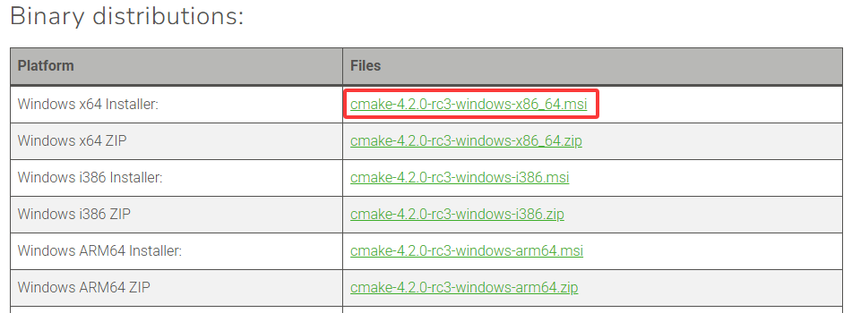
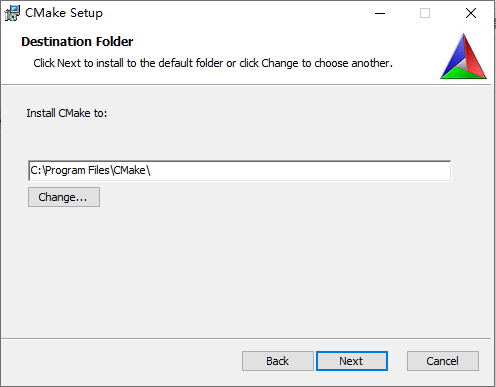
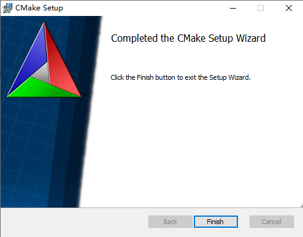

## CMake安装

### windows

#### 二进制安装

+ 进入[CMake官网](https://cmake.org/download/)


+ 下载安装包



+ 双击安装


+ 安装一直下一步即可，可以选择一下安装位置。



+ 安装完成点击finish即可！



+ 最后打开终端，输入`cmake --version`，能输出cmake版本则表示cmake安装成功！

  ```bash
  cmake --version
  ```

  输出：

  ```bash
  cmake version 4.2.0-rc3
  
  CMake suite maintained and supported by Kitware (kitware.com/cmake).
  ```

#### MinGW

要想编译代码，还需要一个编译器，如果安装了Vs可以直接使用，没有就需要安装MinGw工具集！


### linux

### mac