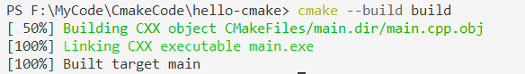

## 项目管理

### hello-cmake

对于简单的项目，只需要一个三行`CMakeLists.txt`文件即可。

#### 文件树

```txt
|——CMakeLists.txt
|——main.cpp
```

#### CMakeLists.txt

```cmake
cmake_minimum_required(VERSION  3.23)
```

要求cmake的最小版本，低于指定版本的cmake构建，会报错：

> CMake 4.0 or higher is required.  You are running version 3.23.0

```cmake
porject(hello_cmake)
```

project命令用于指定cmake工程的名称。

```cmake
add_executable(hello_cmake main.cpp)
```

使用指定的源文件来生成目标可执行文件。

#### main.cpp

```cpp
#include <iostream>

int main(int argc, char *argv[])
{
   std::cout << "Hello CMake!" << std::endl;
   return 0;
}
```

### 构建与生成

**构建**出指定构建系统的文件(如.sln、makefile)

```shell
cmake -G "NMake Makefiles" -B build
```

+ -G 指定构建系统生成器()
+ -B 指定生成目录(中间文件、可执行文件等)


**生成**可执行程序

```shell
cmake --build build
cmake --build . --target INSTALL	#安装
```

+ --build  指定要构建的项目二进制目录



### 自动收集源文件

如果项目中源文件比较多，手动添将变得复杂，那么可以使用`aux_source_directory`命令自动收集。

**aux_source_directory**是CMake中的一个命令，用于自动收集指定目录下的所有源文件，并将文件名列表存储在给定的变量中。

> 尽管**aux_source_directory**命令可以自动收集源文件，但是它不会感知新的源文件何时被加入。因此，如果在不修改CMakeLists.txt的情况下添加了新的源文件，你需要手动重新运行CMake。此外，使用**aux_source_directory**命令可能会导致CMakeLists.txt文件不再是构建系统的准确表示，因为它不包含所有的源文件列表。

#### 文件树

```txt
|——CMakeLists.txt
|——main.cpp
|——Geometry.cpp
|——Geometry.h
```

#### CMakeLists.txt

```cmake
cmake_minimum_required(VERSION 3.20)

project(message)

# 查找指定目录下的所有源文件.c .cpp
aux_source_directory(. SRC_FILES)

# 打印源文件
message(${SRC_FILES})

# 根据指定的源文件生成可执行程序
add_executable(${PROJECT_NAME} ${SRC_FILES})
```

#### Geometry.h

```c
#pragma once

class Vector2{
public:
    float x;
    float y;

    Vector2();
    
    Vector2(float x,float y);

    float distance(const Vector2& other)const;
};
```

#### Geometry.cpp

```cpp
#include "Geometry.h"
#include <math.h>

Vector2::Vector2()
    :x(),y()
{
}

Vector2::Vector2(float x, float y)
    :x(x),y(y)
{
}

float Vector2::distance(const Vector2 &other) const
{
    return sqrt((x - other.x) * (x - other.x) + (y - other.y) * (y - other.y));
}
```

### 模块化管理

`add_subdirectory` 是 CMake 中用于将子目录添加到构建过程中的命令。它允许你在一个项目中组织多个子项目或模块，使得项目结构更加清晰和模块化。