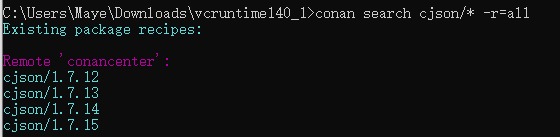

# Conan

## 1. Conan介绍

### 1.1 简单介绍

Conan是C和C ++语言的依赖项和程序包管理器。它是免费和开源的，并且可以在所有平台上使用：Windows，Linux，OSX，FreeBSD，Solaris等，并且可以用于开发所有目标，包括嵌入式，移动（iOS，Android）和裸机。它还与所有构建系统集成，例如CMake，Visual Studio（MSBuild），Makefile，SCons等，包括专有系统。

它是专门为加速C和C ++项目的开发和持续集成而设计和优化的。借助完全的二进制管理，它可以在所有平台上使用完全相同的过程为包的任意数量的不同版本创建和重用任意数量的不同二进制文件（用于不同的配置，如体系结构，编译器版本等）。由于它是分散式的，因此很容易运行您自己的服务器以私下托管您自己的软件包和二进制文件，而无需共享它们。建议使用免费的JFrog Artifactory社区版（CE），由Conan服务器在您的控制下私下托管您自己的程序包。

### 1.2 conna特点

+ Conan成熟稳定，对向前兼容性（不间断政策）有坚定的承诺，并有一个完整的团队全职致力于其改进和支持。它由一个伟大的社区支持和使用，从ConanCenter中的开源贡献者和包创建者到数千个使用它的团队和公司。

+ Conan是具有客户端-服务器体系结构的分散式软件包管理器。这意味着客户端可以从不同的服务器获取软件包，也可以将软件包上载到不同的服务器（“远程”），类似于“ git”推拉模型到/从git远程服务器。

+ 从较高的角度来看，服务器只是程序包存储。他们不构建也不创建包。这些包是由客户端创建的，并且如果二进制文件是从源代码构建的，则该编译也将由客户端应用程序完成。

  

+ Conan客户端：这是一个控制台/终端命令行应用程序，其中包含用于程序包创建和使用的繁琐逻辑。Conan客户端具有用于程序包存储的本地缓存，因此它使您可以完全创建和脱机测试程序包。您也可以脱机工作，只要不需要远程服务器上的新软件包即可。

+ 推荐使用JFrog Artifactory Community Edition（CE），由Conan服务器在您的控制下私下托管您自己的程序包。它是JFrog Artifactory for - Conan软件包的免费社区版本，包括WebUI，多个身份验证协议（LDAP），用于创建高级拓扑的虚拟和远程存储库，Rest API和用于存储任何工件的通用存储库。

+ conan_server是与Conan客户端一起分发的小型服务器。这是一个简单的开源实现，它提供基本功能，但不提供WebUI或其他高级功能。
  ConanCenter是一个中央公共存储库，社区在其中为流行的开源库（例如Boost，Zlib，OpenSSL，Poco等）提供软件包。

### 1.3 跨平台

Conan可在Windows，Linux（Ubuntu，Debian，RedHat，ArchLinux，Raspbian），OSX，FreeBSD和SunOS上运行，并且由于具有可移植性，因此它可在可运行Python的任何其他平台上运行。它可以针对任何现有平台，从裸机到桌面，移动，嵌入式，服务器，跨架构。

Conan也可以与任何构建系统一起使用。与最流行的集成有内置的集成，例如CMake，Visual Studio（MSBuild），自动工具和Makefile，SCons等。但不需要使用任何集成。甚至没有必要所有软件包都使用相同的构建系统，每个软件包都可以使用自己的构建系统，并依赖于使用不同构建系统的其他软件包。还可以与任何构建系统（包括专有系统）集成。

同样，柯南可以管理任何编译器和任何版本。有一些最流行的默认定义：gcc，cl.exe，clang，apple-clang，intel，具有不同的版本配置，运行时，C ++标准库等。该模型还可以扩展到任何自定义配置。

## 2. Conan全平台安装

无论是在什么平台，因为conan是python开发的。都可以使用python的包管理工具pip下载

```python
pip install conan
```

安装后：

- 命令

```shell
conan --version
```

+ 更新conan：

```shell
 pip install conan --upgrade  
```

## 3. 使用Conan教程

### 3.1 常用命令

+ 搜索包

  ```sh
  conan search <包名> -r=conancenter
  #eg:
  conan search cjson* -r=conancenter
  ```

   -r=conancenter 指定使用conan官方提供的仓库

  -r=all 指定查找所有仓库

+ 检查包

  ```sh
  conan inspect <包名>/<版本>
  ```

+ 自动检测并生成默认配置

  ```sh
  conan profile new default --detect
  ```

+ 修改默认配置的编译器设置

  ```sh
  conan profile update settings.compiler.libcxx=libstdc++11 default  # Sets libcxx to C++11 ABI
  ```

+ 配置仓库，指向该命令会在当前目录生成conan的工程信息

  ```sh
  conan install <conanfile.txt所在的目录>
  ```

+ 编译二进并生成制包

  ```sh
  conan install <conanfile.txt所在的目录> --build=missing
  #指定系统和编译器
  conan install <conanfile.txt所在的目录> --settings os="Linux" --settings compiler="gcc"
  #指定配置,默认profile=default
  conan install <conanfile.txt所在的目录> --profile=gcc_x64
  ```

+ 删除包

  ```cpp
  conan reme <包名>/<版本号>
  ```

+ 查看工程信息

  ```sh
  conan info <conanfile.txt所在的目录>
  ```

+ 生成工程信息图标

  ```cpp
  conan info <conanfile.txt所在的目录> --graph=file.html
  ```

### 3.2 案例

让我们从一个示例开始：我们将创建一个解析Json的应用程序，该应用程序使用最流行的C库之一：cJSON。

#### 3.2.1 先查找需要安装的包

```sh
conan search cjson/* -r=all
```



我们可以看到有很多版本的cjson库版本

#### 3.2.2 选择版本

我对版本1.7.15比较感兴趣，所以我准备查看一下关于这个版本的信息。我输入以下指令，得到反馈。

```sh
conan inspect cjson/1.7.15
```


看了描述后我决定就用它了，然后我在我的项目里面建立一个名为：`conanfile.txt`的文件。并在文件里加上如下内容:

**conanfile.txt**

```cpp
[requires]
cjson/1.7.15

[generators]
cmake
```

#### 3.2.3 编译库文件

现在开始使用conan编译我们的库文件，首先在工程目录创建build目录，并进入build文件夹，然后执行指令：

```sh
conan install .. --build=cjson
```

#### 3.2.4 使用库

现在库文件已经安装好了，我们来写一个cmake执行我们的.c文件，脚本如下：

```cmake
cmake_minimum_required (VERSION 3.8)

project (cJSONTest)

#包含conan生成的cmake文件
include("${CMAKE_CURRENT_LIST_DIR}/build/conanbuildinfo.cmake")
#conan基本设置，让conan包环境生效
conan_basic_setup()

aux_source_directory(. My_SOURCES)

add_executable (cJSONTest ${My_SOURCES})
#把conan生成的库添加到目标
target_link_libraries(cJSONTest ${CONAN_LIBS})
```

