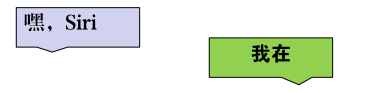
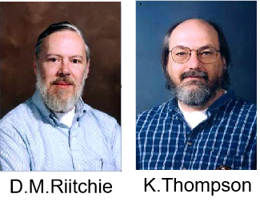
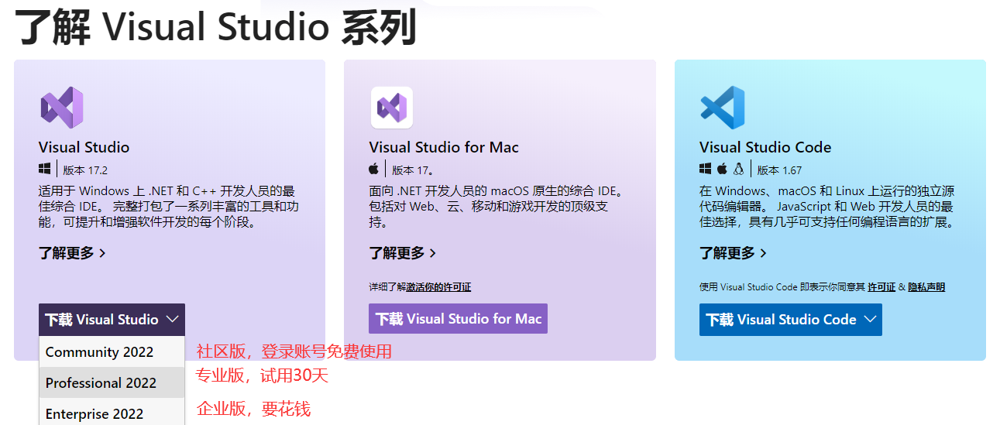

# C语言从入门到入土

讲师：顿开教育-顽石老师（江湖人称：顽石哥）

---

## 1. 上课安排

**上课时间：**每周1、3、5 晚上20:00—22:00


**作业布置：**

		1. 每节课下课都有作业，在下节课上课之前提交哦~
  		2. 作业提交到顽石老师QQ邮箱<823861087@qq.com>

**录播、课件、代码：**下课30分钟之内上传到`QQ群文件`和`百度网盘`

**答疑时间：**

		1. 周一至周六：13:00-23:00 （正常上班时间，回复一般较快）
  		2. 周日和法定节假日，另行通知！有问题可以先发给老师，看到就会回复滴~

>PS：上课出Bug很正常，请不要报警！QAQ


### 课程内容

**咱们的课程学哪些东西呢？**

直播课：C语言、C++、数据结构与算法、Qt、Windows、Linux

录播课：MySQL、设计模式、C++多线程


## 2. 编程介绍

### 2.1 什么是程序？

"程序"一词来源于生活，通常指完成某些事务的既定方式和过程(行事的先后次序；工作步骤)。

比如要把大象放进冰箱：步骤就是，打开冰箱门->放入冰箱->关闭冰箱门

**计算机中的程序：**是为了让计算机执行某些操作或解决某个问题，而编写的一系列按照特定顺序组织的计算机数据和指令的集合。


### 2.2 程序分类

计算机中的程序分为很多种：

+ 系统应用程序
+ 桌面应用程序
+ 驱动应用程序
+ 网络应用程序
+ 手机应用程序
+ 物联网应用程序
+ ...


### 2.3 人与程序的交互方式

程序是为了解决问题而出现的，我们需要传递数据给程序，让程序去解决，那么怎么样才能控制或者说和程序交互呢？

+ **自然交互：**语音控制、动作控制



+ **图形化界面：**这种方式简单直观，使用者易于接受，容易上手操作。


+ **命令行方式：**需要有一个控制台，输入特定的指令，让计算机完成一些操作。较为麻烦，需要记录住一些命令。


### 2.4 什么是编程语言？

在了解编程语言之前，我们先来了解一下咱们人类的语言。语言是人类进行沟通交流的表达方式，语言是生物同类之间由于沟通需要而制定的具有统一编码解码标准的声音(图像)指令。

是不是很好理解？

那么编程语言（programming language）可以简单的理解为一种计算机和人都能识别的语言，能够实现人与机器之间的交流和沟通，而计算机编程语言主要包括**机器语言**，**汇编语言**以及**高级语言**。

+ 机器语言：机器语言是机器能直接识别的程序语言或指令代码(即，用二进制表示的指令集合)，无需经过翻译，每一操作码在计算机内部都有相应的电路来完成它，或指不经翻译即可为机器直接理解和接受的程序语言或指令代码。
+ 汇编语言：即第二代计算机语言，用一些容易理解和记忆的缩写单词来代替一些特定的机器语言指令。
+ 高级语言：计算机语言具有高级语言和低级语言之分。而高级语言又主要是相对于汇编语言而言的，它是较接近自然语言和数学公式的编程，基本脱离了机器的硬件系统，用人们更易理解的方式编写程序。**编写的程序称之为源程序**

## 3. C语言

### 3.1 C语言发展史

1970，美国AT&T公司贝尔实验室（AT&T Bell Laboratory）的研究员Ken Thompson闲来无事，手痒难耐，想玩一个他自己编的，模拟在太阳系航行的电子游戏——Space Travel。他背着老板，找到了台空闲的机器——PDP-7。但这台机器没有操作系统，而游戏必须使用操作系统的一些功能，于是他着手为PDP-7开发操作系统。后来，这个操作系统被命名为——UNIX(汇编语言编写)。

1971年，同样酷爱Space Travel的丹尼斯·里奇为了能早点儿玩上游戏，加入了汤普森的开发项目，合作开发UNIX。他的主要工作是改造B语言，使其更成熟。

1972年，美国贝尔实验室的丹尼斯·里奇在B语言的基础上最终设计出了一种新的语言，他取了BCPL的第二个字母作为这种语言的名字，这就是C语言。

1973年初，C语言的主体完成。汤普森和里奇迫不及待地开始用它完全重写了UNIX。此时，编程的乐趣使他们已经完全忘记了那个“Space Travel”，一门心思地投入到了UNIX和C语言的开发中。随着UNIX的发展，C语言自身也在不断地完善。直到2022年，各种版本的UNIX内核和周边工具仍然使用C语言作为最主要的开发语言，其中还有不少继承Thompson和里奇之手的代码。



### 3.2 C语言标准的变迁


### 3.2 C语言编译过程

C语言编写的程序叫做源程序，是不能直接运行的，需要通过一系列的步骤，讲源代码转换为可执行程序。

步骤分别为：

+ 预处理：

  + 处理所有的注释，以空格替代
  + 展开所有宏定义，并删除#define
  + 处理条件编译指令`#if、#ifdef、#elif、#else、#endif`
  + 处理#include，展开被包含的文件
  + 保留编译器需要使用的#pragma指令

  ```sh
  gcc -E file.c - o file.i
  ```

+ 编译：对预处理后的文件进行词法分析，语法分析和语义分析

  + 词法分析：分析关键字，标示符，立即数等是否合法
  + 语法分析：分析表达式是否遵循语法规则
  + 语义分析：在语法分析的基础上进一步分析表达式是否合法

  ```sh
  gcc -S file.i -o file.s
  ```

+ 汇编：

  + 汇编器将汇编代码转变为机器的可以执行指令
  + 每条汇编语句几乎都对应一条机器指令

  ```sh
  gcc -c file.s -o file.o
  ```

+ 链接：将不同部分的代码和数据合并成为一个单一文件，这个文件可以被执行

  ```sh
  gcc file.o
  ```

### 3.3 学习常见疑惑


[微软官网](https://www.microsoft.com/zh-cn/)

## 4. 工具安装


### 4.1 Visual Studio

#### 4.1.1 Microsoft Visual Studio IDE是什么?

Microsoft Visual Studio是VS的全称。 是微软公司的开发工具包系列产品。

+ **Q：Vs能写C/C++吗？**
  A：不仅能写C/C++，还能写python、C sharp等

+ **Q：为什么要用Vs，没有别的写代码的软件了吗？**
  A：Vs是高度集成的编程环境，使用简单，无需复杂的配置和调试，别的软件不太推荐，有需要可自己摸索

+ **Q：缺点是啥？**
  A：唯一不好的，就是软件有点大，3~5G左右，需要电脑有一定的配置，才能运行无压力。

#### 4.1.2 VS下载与安装

+ 进入[VS官网](https://visualstudio.microsoft.com/zh-hans/)下载VS2022。



> Visual Studio 2022 Professional：TD244-P4NB7-YQ6XK-Y8MMM-YWV2J

+ 下载之后双击exe进入安装。
+ 如果弹出提示框，说.net framework版本过低，请进入[官网](https://dotnet.microsoft.com/zh-cn/download/dotnet-framework)下载最新版本，之后再重新安装Vs。


#### 4.1.2 上号

安装完成之后，可能桌面没有快捷方式，那么请打开开始菜单栏，进行寻找。


### 4.2 向日葵

在学习的过程中，难免会遇到文字难以描述清楚的问题，那么咱们可以给你远程解答，so 先装上小菊花！

+ 进入向日葵[官网](https://sunlogin.oray.com/download?categ=personal)，下载Windows版本。


### 4.3 英语那点事

学习基础知识的时候，英语并不重要，但是偶尔报错是英语就尴尬了，所以，我们要使用工具干掉它！！

进入有道翻译[官网](https://www.youdao.com/)，下载客户端。


## 5. 最后
<p style="font-size:20pt;text-align:center;">冬夜读书示子聿/陆游</p>

<p style="font-size:20pt;text-align:center;">古人学问无遗力，少壮工夫老始成。</p>
<p style="font-size:20pt;text-align:center;">纸上得来终觉浅，绝知此事要躬行。</p>

