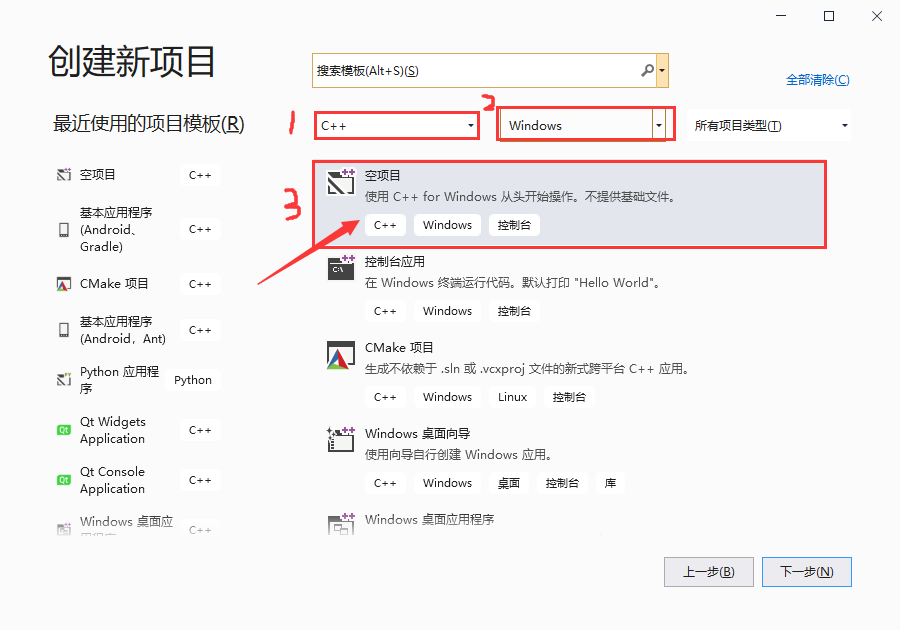
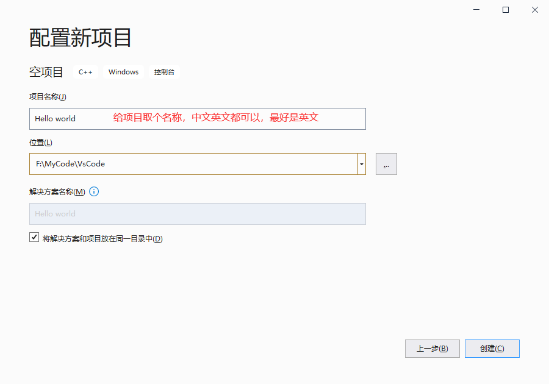
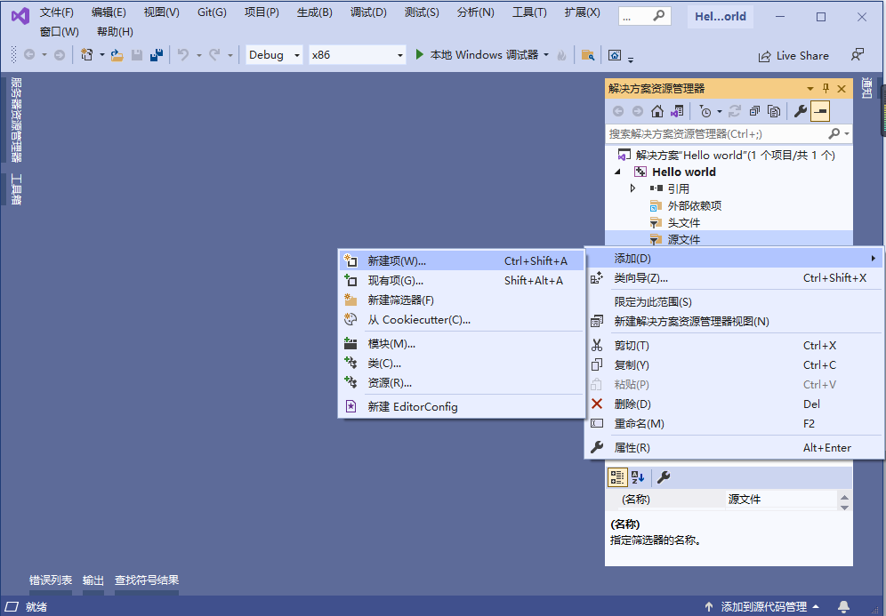
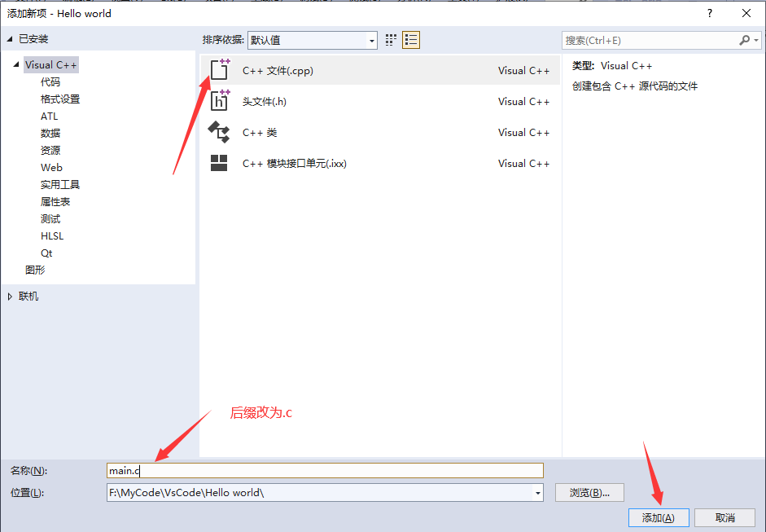
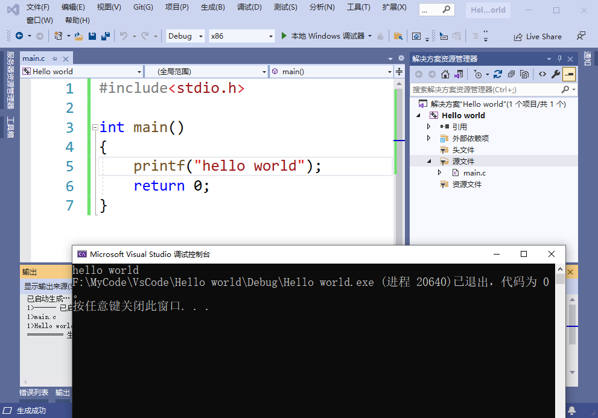
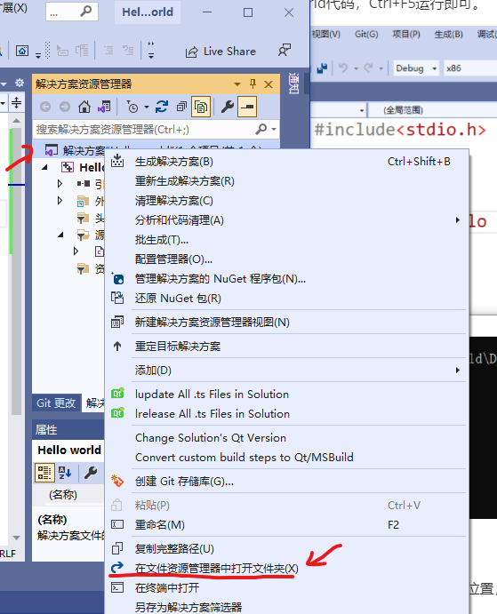
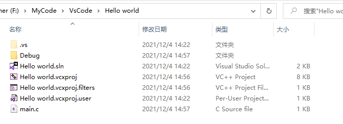
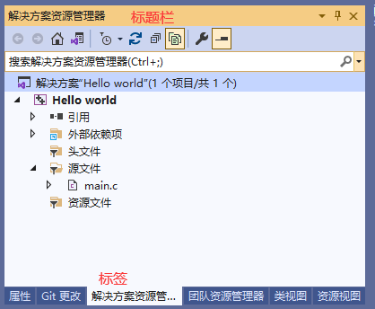

# Visual Studio 使用

### 创建项目

选择创建新项目。

选择空项目

给项目取个名字并选择项目存储位置

OK，进来了，然后右击源文件->添加->新建项

选择C++文件，然后修改文件名称，把文件后缀改为.c

写上hello world代码，Ctrl+F5运行即可。

### Vs快捷键

[Vs快捷键大全](assets/Vs快捷键大全.pdf)

### 项目目录解析

在创建项目时，我们选择了项目的存放位置，那么项目目录中有哪些文件呢？

在解决方案管理器中右击：解决方案或项目名称，然后再选择在文件资源管理器中打开文件夹

以下就是项目目录中的所有文件了~QAQ

**详细介绍：**

+ `.vs` 目录是用来存储当前用户在解决方案中的工作配置，具体包括VS关闭前最后的窗口布局、最后打开的选项卡/操作记录/文件文档、某些自定义配置/开发环境、调试断点等这类设置信息和状态。这样每当用户关闭解决方案后再重新打开，就能继续之前的工作状态。
+ `Debug` 是生成目录，里面包含了调试信息和可执行程序。
+ `.sln` 是解决方案文件，一个解决方案可以包含多个项目
+ `.vcxporj` 是项目文件，将项目设置保存到了该文件中，重新打开项目时会自动加载

+ `.vcxporj.filters` 是过滤文件(用于项目下文件的虚拟目录)

### 视图相关窗口

+ 解决方案管理器
+ 错误列表
+ 输出
+ 终端

**窗口拖动：**

有时候窗口所在的位置不对，想要让指定的窗口移动到指定的位置怎么办呢？

如下图：

+ 1，拖动标题栏可以移动合并在一起的所有窗口

+ 2，拖动标签可以单独移动某一个窗口

### Hello World程序解析

+ 头文件
+ 主函数 几种不同的写法
+ 返回值
+ 注释
+ 程序一闪而过怎么办？
+ 中文英文标点符号要注意！
+ 如何把写好的程序发给别人运行？
+ 程序被删掉怎么办？(一般是杀毒软件干的)
+ system函数