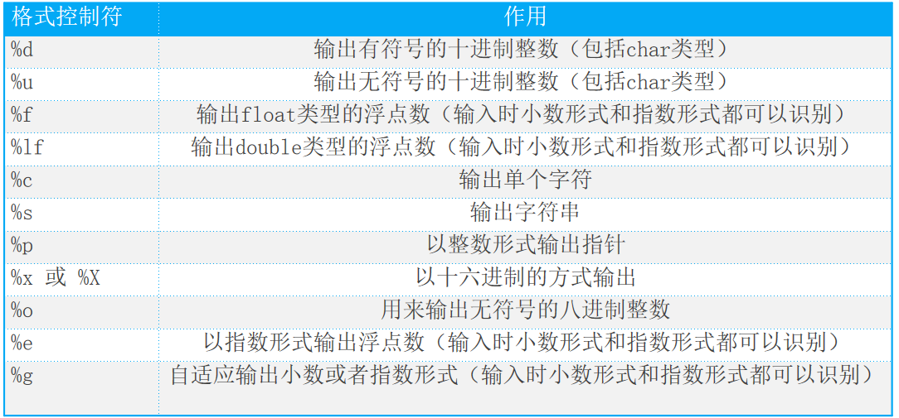

# 基本输入输出

若需要使用输入输出函数，则需要包含<stdio.h>头文件。

## 输出

#### printf

printf是最常用的输出函数，可以格式化输出任意的基本数据类型的变量。

```c
int printf(const char*format,...)
```

+ format："格式控制符"是用双引号括起来的字符串（格式控制符，也叫占位符）
+ ...："输出列表"中的数据可以是合法的常量、变量和表达式，要与“格式控制字符串”中的格式一一对应。

**格式控制符表：**



**格式控制符可选格式：**

> %\[\-\]\[0\]\[m\]\[l\]*

```c
%d 		按整型数据的实际长度输出
%[0]md	以m指定的字段宽度输出，若数据的位数小于m，则左端补空格;若m前面有“0”，则左端补以0。 
%-md	以m指定的字段宽度输出，左对齐
%ld		输出long int
```

**示例：**

```c
printf("hello world");
printf("圆周率为:%lf", 3.1415);
printf("一周有%d天", 7);
```


**注意事项：**

*很多同学在输出的时候，会遇到很多啊问题，大概就是以下几点：*

+ 格式字符中，除了X、E、G外，其他均用小写字母，如“%d”不能写成“%D”。
+ 不同类型的数据应使用相应类型的格式字符说明其输出形式。
+ 如需输出双引号，应在“格式控制”中表示为转义字符的形式并用单引号引起来，即“\””。
+ 如需输出字符“％”，在“格式控制”中用连续两个“％”即可。
  	如：printf(“%d%%”,s);
+ 当“格式控制”中格式符个数少于输出表中的输出项时，多余的输出项不予输出。
+ 当“格式符”多于输出项时，结果为不定值。


#### putchar

有些时候，仅仅为了打印一个字符在显示器屏幕上，此时动用功能强大的printf函数，则颇有高射炮打蚊子之嫌，C提供了一个库函数putchar来完成这个简单的任务。

```c
int putchar(int ch);
putchar('A');
puchar(65);
```


#### puts

而有些时候仅仅是为了输出一个字符串，使用printf函数也稍显麻烦，可以使用C提供的一个库函数puts，而且puts函数会在输出字符串之后，自动进行换行。

```c
int puts(const char*str);
puts("hello world");	
```


## 输入

#### scanf

scanf是最常用的输入函数，可以格式化输入任意基本数据类型的变量。

```c
int scanf(const char* format,...);
```

+ format："格式控制符"是用双引号括起来的字符串
+ ...："输入列表"中的数据必须是合法变量的地址表(即变量前面加&符)，要与“格式控制字符串”中的格式一一对应。
+ 如果输入的输入不止一个，在format格式控制字符串中，必须以空格间隔。

**示例：**

```c
const double PI = 3.1415;
int  radius = 0;
printf("请输入半径:\n");
scanf("%d", &radius);
printf("圆的面积为:%lf", PI * radius * radius);
```


 **scanf函数注意事项**

*scanf函数的格式字符串由以下三类字符组成：*

+ 1>格式符(也叫占位符)
  和printf函数类似，scanf函数的格式字符串以%开始，以一个格式字符结束，中间可以插入附加的字符。格式符告诉了scanf函数该读取什么样的数据。

+ 2>空白符
  空白符可以是空格(用空格键输入)、制表符(用Tab键输入)和新行符(用回车键输入)。

+ 3>非空白符
  除去格式说明符合空白符之外，就是非空白符。非空白符在用户输入的时候，也必须一并输入。


  ​                    

#### getchar

可以非常方便的输入一个字符。

```c
int getchar();
```


#### gets_s

可以非常方便的输入一个字符串。

```c
char* gets_s(char*  _Buffer,size_t _Size);
```

