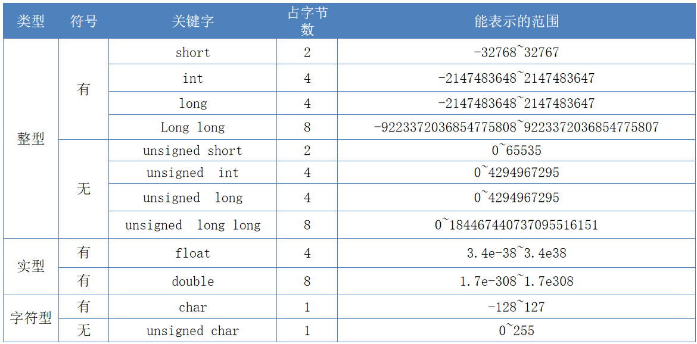

## 标识符

标识符是编程时使用的名字，用于给变量、常量、函数、语句块等命名，以建立起名称与使用之间的关系。

C语言中把标识符分为三类：关键字，预定义标识符，用户自定义标识符 ,对于自定义标识符有如下规则和规范

**命名基本规则**

+ 标识符由字母（A-Z，a-z）、数字（0-9）、下划线“_”组成，并且首字符不能是数字，但可以是字母或者下划线。例如，正确的标识符：abc，a1，prog_to。
+ 不能把C语言关键字作为用户标识符，例如if，for，while等。
+ 标识符对大小写敏感，即严格区分大小写。
+ 标识符命名应做到**“**见名知意**”**，例如，长度（length），求和、总计（sum），圆周率（pi）……


**常用命名规范**

+ 小驼峰
  + 第一个单词首字母小写，后面其他单词首字母大写
  + 如：myName  youAge
+ 大驼峰
  + 所有单词的首字母都大写
  + 如MyName YouAge
+ 匈牙利
  + 在标识符前面加上小写字母作为前缀，标识出变量的作用域，类型等等
  + g_   全局变量
  + c_   常量
  + s_   静态成员变量

>提示：大家写项目的时候，保持一种标准，建议使用小驼峰（工作了看企业需求）


## 常量与变量

### **常量**

常量是固定值，在程序执行期间不会改变。这些固定的值，又叫做**字面量**。

常量可以是任何的基本数据类型，比如整数常量、浮点常量、字符常量，或字符串字面值，也有枚举常量。

#### 整数常量

整数常量可以是十进制、八进制或十六进制的常量。前缀指定基数：0x 或 0X 表示十六进制，0 表示八进制，不带前缀则默认表示十进制(VS2019支持二进制常量表示：0b或0B表示二进制)。

整数常量也可以带一个后缀，后缀是 U 和 L 的组合，U 表示无符号整数（unsigned），L 表示长整数（long）。后缀可以是大写，也可以是小写，U 和 L 的顺序任意。

```c
80			//十进制
0120		//八进制
0X50		//十六进制
0B1010000	//二进制
```


#### 浮点常量

浮点常量由整数部分、小数点、小数部分和指数部分组成。可以使用小数形式或者指数形式来表示浮点常量。

当使用小数形式表示时，必须包含整数部分、小数部分，或同时包含两者。当使用指数形式表示时， 必须包含小数点、指数，或同时包含两者。带符号的指数是用 e 或 E 引入的。

```c
0.25;		//合法
.25;		//合法 	相当于0.25
5.;			//合法 	相当于5.0

314159E-5;	//合法	3.14159;
314159E;	//非法	应输入指数值而非“;”
.E-5;		//非法	缺少整数或者分数
```


#### 字符常量

字符常量是括在单引号中，例如，'x' 。

字符常量可以是一个普通的字符（例如 'x'）、一个转义序列（例如 '\t')，或一个通用的字符（例如 '\u02C0'）。

**ASCII字符代码表：**


**转义字符:**一种特殊的字符常量

+ 以反斜线"\"开头，后跟一个或几个字符。
+ 转义字符具有特定的含义，不同于字符原有的意义，故称“转义”字符。
+ 转义字符中只能使用小写字母，每个转义字符只能看作一个字符。
+ ‘\v’垂直制表和‘\f’换页符对屏幕没有任何影响，但会影响打印机执行响应操作。

下表列出了一些这样的转义序列码：

| 转义序列 | 含义                | ASCII码值(十进制) |
| :------- | :------------------ | ----------------- |
| \\\      | \ 字符              | 092               |
| \\'      | ' 字符              | 039               |
| \\"      | " 字符              | 034               |
| \a       | 警报铃声            | 007               |
| \b       | 退格键              | 008               |
| \f       | 换页符              | 012               |
| \n       | 换行符              | 010               |
| \r       | 回车                | 013               |
| \t       | 水平制表符          | 009               |
| \v       | 垂直制表符          | 011               |
| \0       | 空字符(NULL)        | 000               |
| \ddd     | 一到3位的八进制数   | -                 |
| \xhh     | 一到2位的十六进制数 | -                 |


#### 字符串常量

字符串字面值或常量是括在双引号 "" 中的。一个字符串包含类似于字符常量的字符：普通的字符、转义序列和通用的字符。

可以使用空格做分隔符，把一个很长的字符串常量进行分行。

下面的实例显示了一些字符串常量。下面这三种形式所显示的字符串是相同的。

```c
"hello,world";

"hello,\
world";

"hello,""w""orld";
```


#### 定义常量

在 C 中，有两种简单的定义常量的方式：

1. 使用 **#define** 预处理器。
2. 使用 **const** 关键字。

**#define 预处理器**

>#define identifier value	/\*#define 标识符  常量值\*/

*示例：*

```c
#include<stdio.h>

#define PI 3.1415

int main()
{
	printf("圆的面积为:%lf",PI*3*3);   
    return 0;
}
//output:圆的面积为:28.273500
```

**const关键字**

使用 **const** 前缀声明指定类型的常量，如下所示：

> const type variable = value;


const 声明常量要在一个语句内完成：


具体请看下面的实例：

*示例：*

```c
#include<stdio.h>

int main()
{
    const float PI = 3.1415f;
	printf("圆的面积为:%f",PI*3*3);   
    return 0;
}
//output:圆的面积为:28.273500
```

请注意，把常量定义为大写字母形式，是一个很好的编程习惯。


## 变量

变量来源于数学，是计算机语言中能储存计算结果或能表示值的抽象概念。

每种变量都有对应的数据类型，有不同大小的存储空间*(为了适应不同的数据类型，也为了节省内存)*，在C语言中主要有如下**基础数据类型**。



+ 实型默认都是double型
+ 整型默认都是int型
+ 所有类型默认都是有符号(signed)型

#### 变量的定义

定义变量就是告诉编译器在何处创建变量的存储，以及如何创建变量的存储。

不过，我们必须给变量取一个合适的名字，就好像每个人都有自己的名字一样，否则就难以区分了。

> type variable_list

在这里，**type** 必须是一个有效的 C 数据类型，可以是 char、int、float、double 或任何用户自定义的对象，**variable_list** 可以由一个或多个标识符名称组成，多个标识符之间用逗号分隔。下面列出几个有效的声明：

```cpp
int age,money;
char sex;
float PI;
```

变量可以在定义的时候被赋值，这种在定义是指定一个初始值的方式叫做变量的初始化。

```c
int age = 18;	//初始化
age = 19;		//赋值
```

>不带初始化的定义：变量的初始值是未定义的。


### 左值（Lvalues）和右值（Rvalues）

C 中有两种类型的表达式：

1. **左值（lvalue）：**指向内存位置的表达式被称为左值（lvalue）表达式。左值可以出现在赋值号的左边或右边。
2. **右值（rvalue）：**右值（rvalue）指的是存储在内存中某些地址的数值。右值是不能对其进行赋值的表达式，也就是说，右值可以出现在赋值号的右边，但不能出现在赋值号的左边。

变量是左值，因此可以出现在赋值号的左边。数值型的字面值是右值，因此不能被赋值，不能出现在赋值号的左边。下面是一个有效的语句：

```c
int g = 20;		//g是左值
```

但是下面这个就不是一个有效的语句，会生成编译时错误：

```c
10 = 20;		//10是右值
```


## 数据类型转换

数据类型转换就是将数据（变量、数值、表达式的结果等）从一种类型转换为另一种类型。

**自动类型转换**

自动类型转换就是编译器默默地、隐式地、偷偷地进行的数据类型转换，这种转换不需要程序员干预，会自动发生。

1) 将一种类型的数据赋值给另外一种类型的变量时就会发生自动类型转换，例如：

```cpp
float f = 100;
```

100 是 int 类型的数据，需要先转换为 float 类型才能赋值给变量 f。再如：

```cpp
int n = f;
```

f 是 float 类型的数据，需要先转换为 int 类型才能赋值给变量 n。

在赋值运算中，赋值号两边的数据类型不同时，需要把右边表达式的类型转换为左边变量的类型，这可能会导致数据失真(数据输入和输出不一致)，或者精度降低；所以说，自动类型转换并不一定是安全的。对于不安全的类型转换，编译器一般会给出警告。

2) 在不同类型的混合运算中，编译器也会自动地转换数据类型，将参与运算的所有数据先转换为同一种类型，然后再进行计算。转换的规则如下：

- 转换按数据长度增加的方向进行，以保证数值不失真，或者精度不降低。例如，int 和 long 参与运算时，先把 int 类型的数据转成 long 类型后再进行运算。
- 所有的浮点运算都是以双精度进行的，即使运算中只有 float 类型，也要先转换为 double 类型，才能进行运算。
- char 和 short 参与运算时，必须先转换成 int 类型。


自动类型转换示例：

```c
#include<stdio.h>
int main()
{    
    float PI = 3.14159;    
    int s1, r = 5;    
    double s2;    
    s1 = r * r * PI;    
    s2 = r * r * PI;    
    printf("s1=%d, s2=%f\n", s1, s2);    
    return 0;
}
```

运行结果：
s1=78, s2=78.539749

在计算表达式`r*r*PI`时，r 和 PI 都被转换成 double 类型，表达式的结果也是 double 类型。但由于 s1 为整型，所以赋值运算的结果仍为整型，舍去了小数部分，导致数据精度丢失。


## 强制类型转换

自动类型转换是编译器根据代码的上下文环境自行判断的结果，有时候并不是那么“智能”，不能满足所有的需求。如果需要，程序员也可以自己在代码中明确地提出要进行类型转换，这称为强制类型转换。

强制类型转换的格式为：

```c
(type) expression
```

`type`为目标类型名称，`expression`为表达式。例如：

```c
(float) a;  //将变量 a 转换为 float 类型
(int)(x+y);  //把表达式 x+y 的结果转换为 int 整型
(float) 100;  //将数值 100（默认为int类型）转换为 float 类型
```

下面是一个需要强制类型转换的经典例子：

```c
#include <stdio.h>
int main()
{    
    int sum = 315;  //总数    
    int count = 7;  //数目    
    double average;  //平均数    
    average = (double) sum / count;    
    printf("Average is %lf!\n", average);    
    return 0;
}
output:Average is 44.714286!
```

sum 和 count 都是 int 类型，如果不进行干预，那么`sum / count`的运算结果也是 int 类型，小数部分将被丢弃；虽然是 average 是 double 类型，可以接收小数部分，但是心有余力不足，小数部分提前就被“阉割”了，它只能接收到整数部分，这就导致除法运算的结果严重失真。

既然 average 是 double 类型，为何不充分利用，尽量提高运算结果的精度呢？为了达到这个目标，我们只要将 sum 或者 count 其中之一转换为 double 类型即可。上面的代码中，我们将 sum 强制转换为 double 类型，这样`sum / count`的结果也将变成 double 类型，就可以保留小数部分了，average 接收到的值也会更加精确。

> 注意不要写作`(double) (sum / count)`，这样写运算结果将是 44.000000，仍然不能保留小数部分。

