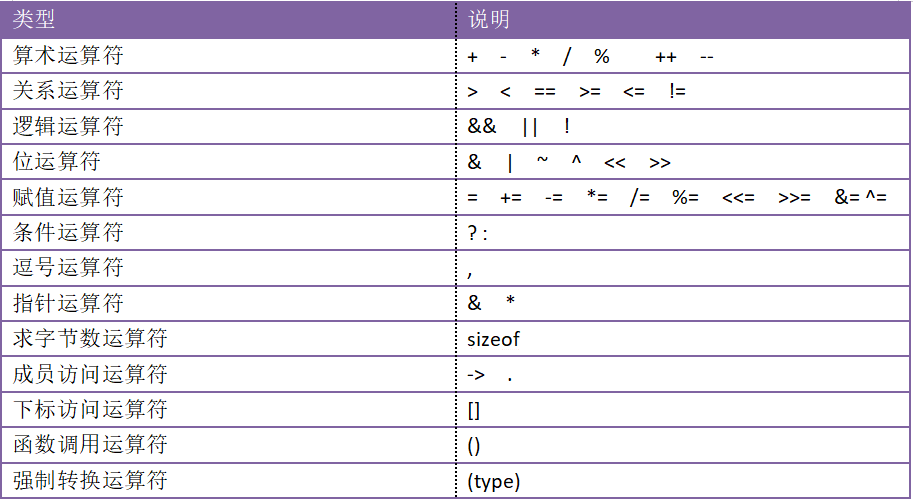

# 运算符和表达式

**运算符**：运算符用于执行程序代码运算，会针对一个以上操作数来进行运算。例如：2+3，其操作数是2和3，而运算符则是“+”

**操作数**：是运算符作用于的实体，操作数指出指令执行的操作所需要数据的来源。

**表达式**：是由数字、运算符、数字分组符号（括号）、自由变量等以能<font color = red>求得数值的</font>有意义排列方法所得的组合。

**表达式书写规则**

+ 1，运算符不能相邻。例a+-b是错误的
+ 2，乘号不能省略。列x乘以y，应写成x*y，而不是xy
+ 3，可用多层括号表示运算次序，括号必须成对出现，均使用小括号。


**运算符优先级和结合性**

所谓优先级就是当一个表达式中有多个运算符时，先计算谁，后计算谁。这个其实我们在小学学算术的时候就学过，如`1+4÷2`

那么“结合性”是什么呢？优先级都是关于优先级不同的运算符参与运算时先计算谁后计算谁。但是如果运算符的优先级相同，那么先计算谁后计算谁呢？这个就是由“结合性”决定的。

比如`1+2×3÷4`，乘和除的优先级相同，但是计算的时候是从左往右，即先计算乘再计算除，所以乘和除的结合性就是从左往右。就是这么简单！

## 运算符分类

**按所需操作数分类：**

+ 单目运算符
+ 双目运算符
+ 三目运算符

**按作用分类：**




## 算术运算符

| **符号** | **功能** |
| -------- | -------- |
| +        | 单目正   |
| -        | 单目负   |
| +        | 加       |
| -        | 减       |
| *        | 乘       |
| /        | 除       |
| %        | 取模     |

+ 单目正负不会改变操作数的值。

  ```CPP
  int num = 10;
  -num;	//表达式的值为-10  num还是为10
  ```

+ 整数相除会向下取整。

  ```cpp
  5/2   == 2
  5/2.0 == 2.5
  ```

+ 取模运算只针对整数。

  ```cpp
  5%2 == 1
  5.2%2		//语法错误
  ```


## 赋值运算符

| **符号** | **功能** |
| -------- | -------- |
| =        | 赋值     |
| +=       | 赋值     |
| -=       | 赋值     |
| *=       | 赋值     |
| /=       | 赋值     |
| %=       | 赋值     |
| <<=      | 赋值     |
| >>=      | 赋值     |

+ 将一个数据(常量或表达式)赋值给一个变量。

  ```cpp
  int age =18;
  age +=2;		//age = age +2;
  age +=5-3;		//age = age+(5-3);
  ```


## 关系运算符

| **符号** | **功能** |
| -------- | -------- |
| >        | 大于     |
| <        | 小于     |
| ==       | 等于     |
| >=       | 大于等于 |
| <=       | 小于等于 |
| !=       | 不等于   |

+ 关系表达式的值只有2种，为真(true)返回1，为假(false)返回0。
+ 所谓关系运算，就是做比较，日常生活中经常遇到一些真假判断，比如说，“张三比李四高”、“济南到北京比济南到上海近”，“5大于2”这些问题的答案是真或假。程序设计是对实际问题解决过程的模拟，常常需要做判断，像“如果这样，我就执行动作A，如果那样，我就执行动作B”，那怎么判断这样那样呢，就需要关系运算符和关系表达式。


## 逻辑运算符

| **符号** | **功能**   |
| -------- | ---------- |
| &&       | 逻辑与     |
| \|\|     | 逻辑或     |
| !        | 单目逻辑非 |

+ 逻辑表达式的值只有2种，为真(true)返回1，为假(false)返回0。
+ 一般用来连接关系表达式。


### 短路现象

在由&&和||运算符组成的逻辑表达式中，C语言有个“节省计算”原则，当计算出一个子表达式的值后便可确定整个逻辑表达式的值时，后面的子表达式就不需要再计算了，这种表达式也称为短路表达式。

**举个栗子：**

```cpp
false  && printf("1\n");
true   && printf("2\n");

false  || printf("3\n");
true   || printf("4\n");
//output :2
//		  3	
```

对于&&符号，如果左边表达式为false，则右边表达式不会执行，即不会执行printf(“1”)，如果左边表达式为true,则右边表达式会执行，即会执行printf(“2”)，输出2

对于||符号,如果左边为true,则右边表达式不会执行，即不会执行printf("4")，如果左边表达式为false,则右边表达式会执行，即执行printf("3"),输出3。


## 特殊运算符

### 特殊算术运算符

| **符号** | **功能** |
| -------- | -------- |
| ++       | 自增     |
| --       | 自减     |

+ 对变量进行+1和-1的操作。

+ 只能对变量使用，不能用于常量和表达式
+ 前置时是先运算、后使用
+ 后置时是先使用、后运算
+ 注意：不要嵌套使用  

```cpp
int a = 1;
printf("%d", (a++ + ++a));  //1 + 3
```


### 逗号运算符

用逗号将多个表达式连接起来，又称为“顺序求值运算符”。整个表达式的值是最后那个逗号之后表达式的值。

**逗号表达式两种作用：**

+ 分割：

  ```cpp
  int a,b,c,d;
  ```

+ 求值：

  ```cpp
  int a = (1,3,5,7,9);
  int b = 1,3,5,7,9;
  ```

  

### 条件表达式

条件表达式可以对指定的条件进行判断，true和false分别执行不同的代码。

>条件 ？表达式1 ： 表达式2

```cpp
printf(5 > 0 ?  "正数" : "负数");
printf((5 > 0) ?  ("正数") : ("负数"));		//为了避免眼花缭乱，可以把每个表达式都加上圆括号
```


## 位运算符

| **符号** | **功能** | **记忆技巧**     |
| -------- | -------- | ---------------- |
| &        | 按位与   | 有0则0           |
| \|       | 按位或   | 有1则1           |
| ^        | 按位异或 | 相同为0，不同为1 |
| ~        | 单目取反 | 0变1,1变0        |
| <<       | 左移     | 移位右边补0      |
| >>       | 右移     | 右移左边补0      |

+ 位运算只针对整型和字符型，而且是直接对二进制进行操作


### 按位与&

这个符号其实和逻辑与运算 && 意思一样，只不过作用在每一位上。

**有0则0：**对于每一位来说，两个数都是真，则为真，否则为假。

```cpp
3-> 0b 0000 0011
2-> 0b 0000 0010
3&2 ->0b 0000 0010
```


### 按位或|

同理，和逻辑或运算 || 意思一样，只不过作用在每一位上。

**有1则1：**对于每一位来说，但凡有个真的就是真，否则为假。

```cpp
3-> 0b 0000 0011
2-> 0b 0000 0010
3|2 ->0b 0000 0011
```


### 按位异或^

**相同为0，不同为1：**对于每一位来说，只要相同就为0，不同就为1。

```cpp
3-> 0b 0000 0011
2-> 0b 0000 0010
3^2 ->0b 0000 0001
```


### 按位取反

取反是一个单目运算符，对每一位进行取反，**即0变1，1变0**

```cpp
6-> 0b 0000 0110
~6-> 0b 1111 1001    //补码:最高位变成了符号位，所以结果肯定是一个负数
     0b 1000 0110	 //反码
     0b 1000 0111	 //原码
  result: -7
```


### 左移

左移操作就是把这些0啊1啊的整体往左移动 n 位，右边缺的就补充 0。

```cpp
3-> 0b 0000 0011
3<<1 -> 0b 0000 0110 ==6
2-> 0b 0000 0010
2<<2 0b 0000 1000 == 8
```

诶，大家发现没有，左移 1 位之后这个数相当于乘2。

但是这只适用于左边溢出的高位中不包含 1 时。

如果把 1 扔了，那就肯定不是 2 倍了嘛。


### 右移

右移操作就是整体往右移动 n 位，左边缺的补充符号位。

```cpp
3-> 0b 0000 0011
3>>1 -> 0b 0000 0001 ==1
2-> 0b 0000 0010
2<<2 0b 0000 0001 == 1
```

同理，正数右移操作的效果是这个数除以 2。


