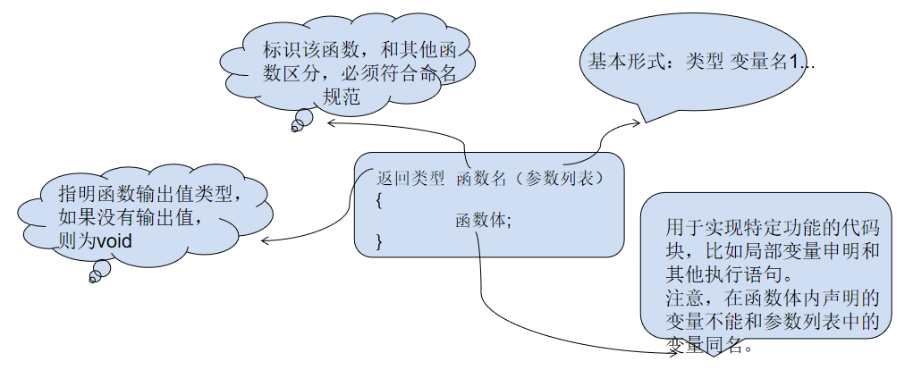

# 函数

## 什么是函数？

+ 是完成特定任务的独立程序代码
+ 是构成程序的基本模块

**为什么要使用函数？**

+ 可以省去编写重复代码的苦闷
+ 可以让程序模块化，提高代码可读性
+ 方便后期修改、完善
+ 隐藏了实现的细节

>函数还有很多叫法，比如方法、子例程或程序，等等。


## 函数分类

**从用户角度**

+ 标准函数，即库函数
  + C语言封装好的函数，非常丰富
  + 例如：
    + —输入/输出：scanf(),printf(),rand()...
    + —数学计算：sqrt(),abs(),sin()...
+ 自定义函数
  + 自己编写的用来完成特定任务的代码块

**从函数形式**

+ 无参函数：getchar()
+ 有参函数：putchar('a')


## 函数的定义

和变量一样，要想使用一个函数，定义是不可缺少的，函数定义有4个要素：<font color=red>返回类型，函数名和函数体</font>，参数列表和返回类型对应着输入输出，函数名是函数的标识，而函数体是一段可执行的代码块，实现特定的算法或功能。



如果我们要写一个功能，用来获取两个数中的最大值，我们可能这样写。

```cpp
a>b?a:b;
```

这样写，是很好的，但是当我们需要多次使用的时候，代码将变得不清晰，此时我们可以用一个函数对这个功能进行封装，把结果进行返回。

```cpp
int max(int a,int b)
{
    return a>b?a:b;
}
```

然后使用函数名加上实参即可调用该函数，然后可以使用一个变量接受函数的返回值。

```cpp
int res = max(2,5);
```

在这个过程中，我们提到了参数这个概念：

+ 函数定义时参数列表中的叫做<font color=red>形参</font> `形参可以接受实参传过来的值`

+ 函数调用时参数列表中的叫做<font color=red>实参</font> `实参会赋值给形参，让函数内部进行操作`

+ **注意：**
  + 函数的传参过程，只是单纯的值传递
  + 所以在函数内部改变形参的值，不会影响到实参
  + 以下代码，在函数内部改变了形参，但是实参确没有变化 ↓

```cpp
void foo(int num)
{
    num++;
    printf(num);
}
int main()
{
    int a =3;
	foo(a);
	printf(a);
    return 0;
}
output:num:4  a:3 
```


>打个形象的比方，这是角色和演员的关系。
>
> 函数定义时列表中的参数称为形参，是“剧本角色”，而函数调用时传递进来的参数称为实参，是“演员”，函数执行的过程就是演戏的过程。
>
>程序刚开始执行的时候，编译器并不为形参分配存储空间，因为它只是个角色，不是实体，一直要到函数调用时，编译器为形参分配存储空间，并将实参的值复制给形参结合。可知，在foo(a)语句调用前，num不是真正的程序变量，一直到foo函数被调用，num才被创建，并用a为其赋值，找这种情况下，在函数内对num的处理并不影响a，这类似于“某个演员扮演的角色在戏中受伤，并不是说演员真的受伤了”，而且，在函数执行结束返回时，创建的形参被撤销，这类似于“戏演完了，剧中角色自然也就停止了”。


## 函数的调用

函数调用的一般形式为：函数名(实参列表)

+ 实参可以是常数、变量、表达式等，多个实参用逗号,分隔

  **函数的调用姿势有多种:**

  

  

  

  **注意：**

  + 调用函数时不要忘记括号，尤其是无参函数
  + 调用函数时，实参与形参个数必须一致，类型尽量保持一致
  + 调用库函数时，应在程序头部用#incldue包含相关头文件
  + 函数调用不能作为左值


## 函数声明/多文件编程

+ 函数**声明**会告诉编译器函数名称及如何调用函数。函数的实际主体可以单独定义。

**函数声明包括以下几个部分**

> 返回类型  函数名(参数列表);

针对前面自定义的max函数，应该这样声明

```cpp
int max(int a,int b);
```

在函数声明中，参数的名称并不重要，只有参数的类型是必需的，因此下面也是有效的声明：

```cpp
int max(int,int);
```

+ 函数声明必须和定义时的函数前面一致

+ 函数原型的作用是告诉编译器与该函数有关的信息，让编译器知道函数的存在，以及存在的形式，即使函数暂时没有定义，也不会出错。


## **函数与数组**

**数组做函数参数**

+ 一维数组

  当我们写了一个数组之后，可能要多次输出所有元素，每输出一次都要写一个循环，非常的麻烦，这时就需要把数组传到函数里面去，当要输出数组的时候，调用该函数即可！

  ```cpp
  void foo(int arr[],int len)
  {
      for(int i=0;i<len;i++)
      {
          printf("%d ",arr[i]);
      }
      printf("\n");
  }
  //参数中int arr[] 中括号中可以写数组大小也可以不写，一般不写
  ```

+ 二维数组

  ```cpp
  void foo1(int arr[][5], int row)
  {
  	for (int i = 0; i < row; i++)
  	{
  		for (int k = 0; k < 5; k++)
  		{
  			printf("%d ", arr[i][k]);
  		}		
  	}
      printf("\n");
  }
  //二维数组稍加麻烦一点，需要指定列数
  ```

  注意：在函数里面使用sizeof不能得到数组的实际大小，求得的只是指针的大小

# 变量的作用域和生命周期

**根据变量的作用域不同，可分为局部变量和全局变量两种**

+ 变量的作用域
  + 变量起作用的范围
  + 就近原则
+ 局部变量
  + 在函数内部或者某个控制块的内部定义的变量
  + 作用域：函数内部或控制块内部
  + 生命周期：从定义开始，到函数结束或者控制块结束

+ 全局变量
  + 在函数外部定义的变量
  + 作用域：在同一文件中，所有函数都可以引用全局变量
  + 生命周期：从程序运行开始，到程序结束

**根据变量的生命周期不同，可分为静态变量和动态变量**


**自动(动态)变量**

+ 指的是局部变量，具体来说即是在控制流进入变量作用域时系统自动为其分配存储空间，并在离开作用域时释放空间的一类变量。

**静态变量**

+ 1，在程序执行的整个过程中，都不释放内存
+ 2，静态变量在编译时初始化，仅初始化一次`如果没有初始值，将自动初始化为0`
+ 3，作用域：定义的函数内部

**寄存器变量**

> 建议编译器将变量存储到CPU寄存器中

+ 1，编译器有自己的处理方式，不一定会接受你的建议
+ 2，一旦接受建议，把变量存到了寄存器里面，那么则不能对变量取地址(&)
+ 3，只有局部变量和形参可以作为register变量，全局变量不行,静态变量也不行。


**static和extern改变函数和变量的作用域**

+ 全局变量默认就是extern类型的，而且作用范围是整个项目；如果手动加上static，则表示让全局变量只能在当前文件中使用。（与static对应的就是extren，全局变量默认是extren）

  ```cpp
  /*test.c*/
  int number = 520;
  
  /*main.c*/
  #include<stdio.h>
  extern int number;		//声明使用外部变量
  int main() 
  {	
  	printf("%d ", number);
  }
  ```

  如果在test.c中的变量定义前面加上static，则会产生如下错误

  ```cpp
  1>main.obj : error LNK2001: 无法解析的外部符号 _number
  1>F:\MyCode\2048\Debug\2048.exe : fatal error LNK1120: 1 个无法解析的外部命令
  ```

+ 对于函数来说也是如此

  ```cpp
  /*test.c*/
  int get()
  {
  	return 566;
  }
  
  /*main.c*/
  extern int get();
  int main() 
  {	
  	printf("%d", get());
  }
  ```


# 函数递归

递归也是一种函数调用，只不过是函数自己调用自己，是一种特殊的函数调用，调用自己同调用别人是一模一样的。

+ 使用递归必须要满足的两个条件
  + 要有递归公式。
  + 要有终止条件。
+ 递归和循环的关系
  + 递归和循环存在很多关系。理论上讲，所有的循环都可以转化成递归
  + 循环又称迭代。递归算法与迭代算法设计思路的主要区别在于：函数或算法是否具备收敛性！当且仅当一个算法存在预期的收敛效果时，采用递归算法才是可行的。否则就不能使用递归算法。所谓收敛性就是指要有终止条件，不能无休止地递归下去。
+ 递归的优缺点
  + 递归的优点是简化程序设计，结构简洁清晰，容易编程，可读性强，容易理解。在很多情况下使用递归是必要的，它往往能把复杂问题分解为更简单的步骤，而且能够反映问题的本质。我们一开始可能发现递归理解起来也不容易，这是因为我们的“见识”太少了！等将来学习树和图的时候你才能真正领会到递归是多么的“好理解”！
  + 递归的缺点也很明显：速度慢，运行效率低，对存储空间的占用比循环多。严格讲，循环几乎不浪费任何存储空间，而递归浪费的空间实在是太大了，而且速度慢。因为递归是用栈机制实现的，每深入一层都要占用一块栈数据区域。

**通过一个简单的程序了解递归**

```cpp
int foo(int n)
{
    if(n == 0)
    {
        return 0;
	}
    printf("I love you\n");
    foo(n-1);
}
```

**递归求斐波拉契数列**

前面我们已经学习了，用循环求斐波拉契数列，现在我们要用递归来实现。

```cpp
int fibonacci(int n)
{
    if(n==0||n==1)
    {
        return 1;
    }else
    {
        return fibonacci(n - 1) + fibonacci(n-2);
    }
}
```


