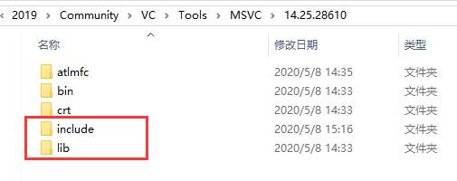
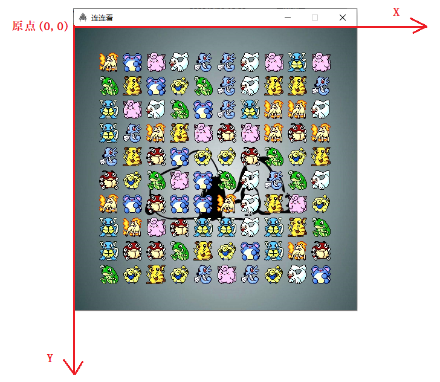
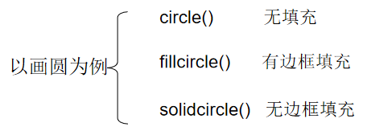
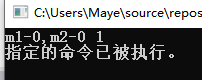

# Easyx图形编程

## 基本说明

EasyX 是针对 C++ 的图形库，可以帮助 C/C++ 初学者快速上手图形和游戏编程。

比如，可以基于 EasyX 图形库很快的用几何图形画一个房子，或者一辆移动的小车，可以编写俄罗斯方块、贪吃蛇、黑白棋等小游戏。
许多人学编程都是从 C 语言入门的，而目前的现状是：

+ 学校只交基础语法，一直都在黑窗口上练习，同学们都学习很乏味。
+ 即使有的学校教图形编程也是，使用一些难度较高的，比如win32，OpenGL门槛依然很高，初学者会受严重打击的。
+ 于是就有了这个 EasyX 库，ok，搞起


## 下载与安装

[easyx下载安装教程](https://mp.weixin.qq.com/s/PRmCno9b82B28fIeRulnNA)                   [官方帮助文档](https://docs.easyx.cn/zh-cn/intro)

EasyX图形库支持Vs各种版本，下载解压后，直接执行安装程序即可。

本质是，查找Vs的安装目录，并将相关文件分别拷贝至lib目录和include目录


安装成功后，包含头文件graphics.h即可开始快乐学习了

## Easyx库原理

基于Windows图形编程，将Windows下的复杂程序过程进行封装,将Windows下的编程过程隐藏，给用户提供一个简单熟悉的接口。用户对于图形库中函数的调用，最终都会由Windows的底层API实现。

具体的大家将在windows阶段学到。

## EasyX API

### 绘图设备

+ 初始化图形窗口

```cpp
HWND initgraph(int width,int height,int flag = 0);
```

+ 关闭图形窗口

```cpp
void closegraph();
```

+ 清空绘图设备

```cpp
void cleardevice();
```


**EasyX坐标体系**

+ 坐标默认的原点在窗口的左上角，X 轴向右为正，Y 轴向下为正，度量单位是像素点。



### 图形绘制

绘图函数从填充样式分类可分为<font color=red>无填充，有边框填充，无边框</font>三种。



从形状来分，常用的大概有以下几种:

| circle 画圆      | ellipse 画椭圆       | pie 画扇形 | polygon 画多边形 |
| ---------------- | -------------------- | ---------- | ---------------- |
| rectangle 画矩形 | roundrect 画圆角矩形 | line 画线  | putpixel 画点    |

+ 设置填充颜色，当绘制图形为填充时，设置颜色才有效果。

  ```cpp
  void setfillcolor(COLORREF color);
  ```

+ 设置线条颜色，当绘制图形有边框时，设置线条颜色才会有效果。

  ```cpp
  void setlinecolor(COLORREF color);
  ```

  

### 文字输出

+ 在指定位置输出文字，两个同名的函数，会自动根据参数调用。

  ```cpp
  void outtextxy(int x,int y,LPCTSTR str);
  void outtextxy(int x,int y,char c);
  ```

+ 设置文字颜色

  ```cpp
  void settextcolor(COLORREF color);
  ```

+ 设置背景模式

  + TRANSPARENT 背景透明

  ```cpp
  void setbkmode(int mode);
  ```

+ 设置文字样式(大小、字体)

  + height 文字的高度，width字符的宽度(如果为0则表示自适应)，face字体

  ```cpp
  void settextstyle(int height,int width,LPCTSTR face);
  ```

+ 获取文字占用的像素高度和宽度

  ```cpp
  int textheight(LPCTSTR str);
  int textwidth(LPCTSTR str);
  ```

+ 文字居中显示在某一个区域

  ```cpp
  int rectx,recty,rectw,recth;	//矩形区域左上角坐标和大小
  int x = rectx + (rectw - textwidth(str))/2;
  int y = recty + (recth - textheight(str))/2;
  //x y 即最终文字所在的位置
  ```

  

### 图像输出

在使用图像之前，需要定义一个变量(对象)，然后把图片加载进变量才能进行使用。

+ 平时定义变量都是使用的基础数据类型，比如：int  temp；
+ 在使用图像的时候需要使用easyx提供给我们的类型：IMAGE，如：IMAGE img;


+ 加载图像

  + pImg		保存图像的IMAGE对象指针
  + imgFile    图像文件名
  + w              图片的拉伸宽度，默认为0，表示使用原图像的宽度
  + h               图片的拉伸高度，默认为0，表示使用原图像的高度

  ```cpp
  void loadimage(IMAGE* pImg,LPCTSTR imgFile,int w = 0,int h = 0);
  ```

+ 输出图片(贴图)

  + x				绘制位置的x坐标
  + y                绘制位置的y坐标
  + w               绘制的宽度
  + h                绘制的高度
  + srcImg      要绘制的IMAGE
  + srcx           绘制内容在 IMAGE 对象中的左上角 x 坐标
  + srcy           绘制内容在 IMAGE 对象中的左上角 y 坐标
  + dwRop      三元光栅操作码

  ```cpp
  void putimage(int x,int y,IMAGE* srcImg,DWORD dwRop = SRCCOPY);
  void putimage(int x,int y,int w,int h,IMAGE*srcImg,int srcx,int srcy,DWORD dwRop = SRCCOPY);
  ```

  

### 鼠标消息

鼠标消息需要使用**MOUSEMSG**类型，比如：MOUSEMSG msg，然后用**MoustHit**()判断是否有鼠标消息。

如果有鼠标消息就可以进行接收鼠标消息了msg = GetMouseMsg();

MOUSEMSG是一个结构体，成员如下：

```cpp
struct MOUSEMSG
{
	UINT uMsg;				// 当前鼠标消息
	bool mkCtrl;			// Ctrl 键是否按下
	bool mkShift;			// Shift 键是否按下
	bool mkLButton;			// 鼠标左键是否按下
	bool mkMButton;			// 鼠标中键是否按下
	bool mkRButton;			// 鼠标右键是否按下
	short x;				// 当前鼠标 x 坐标
	short y;				// 当前鼠标 y 坐标
	short wheel;			// 鼠标滚轮滚动值 (120 的倍数)
};
```

主要使用uMsg 和 x、y成员，uMsg用来判断当前鼠标消息是什么消息：

```cpp
// 支持如下消息：
//		WM_MOUSEMOVE		鼠标移动
//		WM_MOUSEWHEEL		鼠标滚轮拨动
//		WM_LBUTTONDOWN		左键按下
//		WM_LBUTTONUP		左键弹起
//		WM_LBUTTONDBLCLK	左键双击
//		WM_MBUTTONDOWN		中键按下
//		WM_MBUTTONUP		中键弹起
//		WM_MBUTTONDBLCLK	中键双击
//		WM_RBUTTONDOWN		右键按下
//		WM_RBUTTONUP		右键弹起
//		WM_RBUTTONDBLCLK	右键双击
```

**示例：**

```cpp
while(true)
{
    if(MoustHit())
    {
        MOUSEMSG msg = GetMouseMsg();
        switch(msg.uMsg)
        {
            case WM_LBUTTONDOWN:	//左键按下处理
                printf("左键按下,鼠标坐标为(%d,%d)\n",msg.x,msg.y);
                break;
            case WM_RBUTTONDOWN:	//右键按下处理
                printf("右键按下,鼠标坐标为(%d,%d)\n",msg.x,msg.y);
                break;
        }
    }
}
```


### 双缓冲绘图

在设备上不断进行绘图操作时，会产生闪屏现象，此时眼睛就受不了了，针对这个想象，我们需要使用两个函数去处理。

```cpp
void BeginBatchDraw();	//开始批量绘图
void FlushBatchDraw();	//刷新(把当前缓冲区里的，立刻在屏幕上进行绘制)
void EndBatchDraw();	//结束批量绘图，同时会进行刷新
```

+ 绘图代码需要放到绘图函数中间


## !EasyX API

### 键盘消息

用于获取鼠标消息的函数有两个

+ _getch();									需要头文件conio.h
+ GetAsyncKeyState(int key);    需要头文件windows.h,但是EasyX包含了，所以不需要自己加


#### _getch

+ 与getchar()十分相似，但是按下键之后，不需要按回车即可自动继续。
+ 如果按下的是字母键或者数字键，则可以直接比较结果
+ 如果按下的是其他键，比如上键，则需要使用虚拟键值比较

```cpp
char key = _getch();
switch(key)
{
    case 'W':
    case 'w':
    case 72:
        printf("UP\n");
    case 'S':
    case 's':
    case 80:
        printf("DOWN\n");    
    case 'A':
    case 'a':
    case 75:
        printf("LEFT\n");    
    case 'D':
    case 'd':
    case 77:
        printf("RIGHT\n");
    case ' ':	//空格
        break;
    case '\r':	//回车
        break;
}
```


#### GetAsyncKeyState

+ 这个函数需要传入一个键值，如果按下则返回真。

+ **键值：**

  ```sh
  上：VK_UP
  下：VK_DOWN
  左：VK_LEFT
  右：VK_RIGHT
  _其他键值可以通过上面的宏转到定义查看
```
  

  
  ```cpp
  if(GetAsyncKeyState(VK_UP))
  {
      puts("上键按下");
  }
  if(GetAsyncKeyState(VK_DOWN))
  {
      puts("下键按下");
  }
  if(GetAsyncKeyState(VK_LEFT))
  {
      puts("左键按下");
  }
  if(GetAsyncKeyState(VK_RIGHT))
  {
      puts("右键按下");
  }
```
  

  
  **注意：**_getch()会阻塞程序，但是GetAsyncKeyState()是异步的，不阻塞程序，所以会非常流畅。根据自己的项目需要选择合适的函数进行使用。

### 播放音乐

为了实现用C语言播放音乐，我们需要用到windows的一个API，mciSendString。

#### 函数原型

```cpp
MCIERROR mciSendStringA(		//MCIERROR类型就是uint，执行成功返回0，出错返回非0值
  LPCSTR lpstrCommand,			//指向以null结尾的命令字符串：”命令 设备[参数]”
  LPSTR lpstrReturnString,		//指向接收返回信息的缓冲区，为NULL时不返回信息
  UINT uReturnLength,			//上述缓冲区的大小
  HWND hwndCallback				//在命令串中含notify时，它指定一个回调窗口的句柄，一般为NULL
);
```

#### 使用方法

具体的播放代码是这样子滴：

```cpp
mciSendString("open ThatGirl.mp3 alias a", NULL, 0, NULL);	//打开音乐
mciSendString("play a", NULL, 0, NULL);						//播放音乐
```

open指令打开需要播放的音乐，alias后面制定了前面文件路径的别名，以后想要操作这个文件直接使用这个别名就行了，后面的三个参记着写作NULL，0，NULL即可。

第二条语句play指令后面接上面定义的别名，repeat表示歌曲循环播放。如果想要在音乐播放时停止播放，有以下代码:

```cpp
mciSendString("stop a", NULL, 0, NULL);     //停止播放音乐
mciSendString("close a", NULL, 0, NULL);    //关闭音乐
```

总而言之：play a开始播放，stop a停止播放，close a关闭文件，如果需要同时播放多个音乐的话应该为每个音乐设置不同的别名，这样就可以了

**注意：**某些地方下载的音乐是播放不了的，如:<font color=red>网易云音乐</font>

#### 错误检查

有时候播放音乐会没有声音，这时候就需要对返回值进行检查了，在返回错误码的同时，还会有对应的错误信息，那么怎么查看信息呢？

这里需要用到另外一个函数mciGetErrorString。

函数原型：

```cpp
BOOL mciGetErrorStringA(		//返回值，没有错误返回非零值，错误返回0
    MCIERROR mcierr,   			//mcierr，mciSendString返回的错误代码。
    LPSTR pszText,   			//pszText，指向缓冲区的指针，该缓冲区接收错误描述，接受之后输出即可看到信息
    UINT cchText				//cchText，pszText缓冲区的长度（以字符为单位）
);
```

**具体代码如下：**

```cpp
char buf[100] = "";
char buf1[100] = "";
DWORD m1= mciSendString("open ThatGirl.mp3 alias a", NULL, 0, NULL);
int temp=mciGetErrorString(m1, buf, 100);
DWORD m2 = mciSendString("play a", NULL, 0, NULL);
mciGetErrorString(m2, buf, 100);

printf("m1-%u,m2-%u temp：%d\n",m1,m2,temp);
printf("%s\n%s\n", buf,buf1);
```

**运行结果如下：**



我这里是能正常播放的，所以一切OK！


### 修改窗口标题

在修改之前先获取当前窗口的句柄

```cpp
HWND hWnd = GetHWnd();
SetWindowText(hWnd,"love");		//设置窗口标题
```

### 弹出对话框

在某些时候，可能需要弹出一个小窗口提示用户，windows给我们提供了一个**MessageBox**函数。

```cpp
int MessageBox(			//返回按下的键的值
    HWND hWnd,			//窗口句柄
    LPCSTR text,		//显示的文字
    LPCSTR caption,		//对话框标题
    UINT uType			//对话框按钮类型
);
```

下面是一个简单的示例，弹出对话框之后，可以根据点击的按钮进一步进行处理。

```cpp
int ret = MessageBox(GetHWnd(), "我是一个对话框", "maye", MB_OKCANCEL);
if (ret == IDOK)
{
	printf("IDOK\n");
}
else if(ret == IDCANCEL)
{
	printf("IDCANEL\n");
}
```

