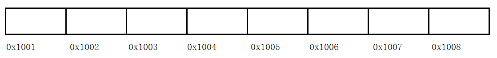
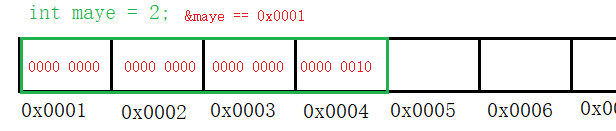
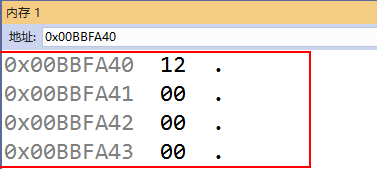
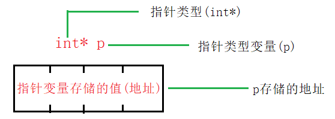
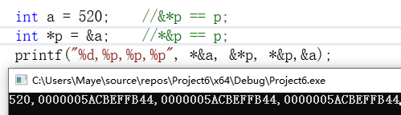

# 初识指针

## 地址

+ 什么是地址：内存是由很多得内存单元(字节)组成的,每个字节都有唯一的编号，这个编号就叫做地址。



+ 我们原先学过的变量、数组、函数等都是放在内存中的，我们可以通过名字去使用变量、数组、函数等，但实际运行时，系统使用得是内存地址，而不是变量名，变量名只是方便我们程序员使用的。

**怎么获得变量的地址呢？**

+ 前面我们学习过scanf函数，在输入数据时用到了&符号，这个符号就是获取变量的地址的符号。

  ```c
  int age = 18;
  //输出age变量的地址
  printf("addr:%p\n",&age);
  ```

**注意：**

+ 地址是连续的
+ 在同一台机器上地址编号是唯一的
+ 每次运行程序，变量的地址不一定都一样，这是由操作系统随机分配的

## 首地址

+ 以一个整型来说，需要四个字节来存储，那么每个字节都有一个地址，但是我们取地址得到的只有一个地址，这个地址叫做首地址。（大家理解这个概念就好，一般不会这么叫，就直接叫变量的地址了）

+ 为了便于访问，一个变量所占用的这几个内存单元通常都是连续存放，地址连续的几个单元通常就叫做一个“存储区域”。

  



## 指针

指针实际上是一种特殊的数据类型，我们可以用来申明指针变量，用来存储地址。

**指针就是地址这句话正确吗？**

+ 不完全正确，但是大众已经习惯了这种说法，在这里不去做纠正，但是我们需要了解一下其本质的区别
  + 指针是类型，一般我们习惯把指针变量也叫做指针，可以用来存储地址
  + 地址就是一串整数代表一个内存单元，没有任何的其他作用
  + 指针和地址本质不一样，可以说指针能够代表地址，但是不能说指针就是地址



**使用指针的好处：**

+ 1、直接访问硬件
+ 2、快速传递数据（指针表示地址）
+ 3、返回一个以上的值，返回一个（数组或者结构体的指针）
+ 4、方便处理字符串


### 指针变量的定义和使用

定义：`数据类型* 标识符 = 地址`

```c
int *p;
int *p1,*p2,*p3;	
```

同时定义多个指针变量时，每个标识符前面都要加*号，否则后面的会被定义成int型变量。

**取地址我们已经学习过了，那么怎么根据指针获取对应的内存的数据呢？**

取地址符：&变量

间接运算符(取值)：*指针变量

*、&是运算符，他们的优先级一样，结合起来使用也非常简单




## 野指针，空指针，万能指针

### 野指针

未被初始化的指针，写代码的时候不允许出现野指针，后果很严重。

### 空指针

被赋值为NULL的指针，它不指向任何的对象或者函数。（坚决不能使用空指针，否则程序就会崩）

+ 野指针要变成空指针，但是空指针也不能直接用，那改怎么办呢？其实赋值为NULL，是为了后面进行判断，然后再操作。(判断指针是否为空，if(p==NULL){puts(“指针为空”);})

### 万能指针

void* 类型的指针又叫万能指针，他可以指向任意的内存空间地址

+ 可以指向任何地址

  ```c
  int maye = 20;
  void* p = &maye;
  ```

+ 可以隐式自动转换为其他类型指针

  ```c
  int* pi = p;
  ```

+ 不能对void*取值操作，因为它没有类型，或者说不能判断存储的是什么类型，需要强转指定一个确定的类型才能使用

  ```c
  printf("%d\n",*p);		//error
  printf("%d\n",*(int*)p);//right
  ```

## const 与 指针

const是constant的简写，只要一个变量前面用const来修饰，就意味着该变量里的数据可以被访问，不能被修改。也就是说const意味着“只读”。任何修改该变量的尝试都会导致编译错误。const是通过编译器在编译的时候执行检查来确保实现的（也就是说const类型的变量不能改是编译错误，不是运行时错误。）所以我们只要想办法骗过编译器，就可以修改const定义的常量，而运行时不会报错。

const与指针可以搭配出三种不同的含义：

+ 指针指向的内存不可修改，但指针的指向可以修改

  ```c
  int age = 18;
  const int* ptr = &age;		//常量指针
  int const* ptr = &age;		//和上面一句是等价的
  
  *ptr = 20;					//err,不能修改
  ptr = NULL;					//ok,可以修改指向
  ```

+ 指针的指向不可以修改，但指向的内存可以修改

  ```c
  int* const ptr = &age;
  *ptr = 20;	//ok
  ptr = NULL;	//err
  ```

+ 指针的指向不可以修改，指向的内存也不可以修改

  ```c
  const int* const ptr = &age;
  *ptr = 20;	//err
  ptr = NULL;	//err
  ```

**常量指针**(`指向常量的指针`)是指指向常量的指针，顾名思义，就是指针指向的是常量，即，它不能指向变量，它指向的内容不能被改变，不能通过指针来修改它指向的内容，但是指针自身不是常量，它自身的值可以改变，从而指向另一个常量。

**指针常量**(`指针是常量`)是指指针本身是常量。它指向的地址是不可改变的，但地址里的内容可以通过指针改变。有一点需要注意的是，指针常量在定义时必须同时赋初值。

## 指针的运算

**算数运算：**

+ 指针是存储的地址，地址本质就是一个整数，因此，我们可以对指针执行四种算术运算：++、--、+、-(其他运算没有意义)。

  ```c
  char* pc = NULL;
  printf("%p %p\n",pc,pc+1);	//0 1
  int* pi = NULL;
  printf("%p %p\n",pi,pi+1);	//0 4
  double* pd = NULL;
  printf("%p %p\n",pd,pd+1);	//0 8
  ```

+ 总结:
  + 指针的每一次递增，它其实会指向下一个元素的存储单元。
  + 指针的每一次递减，它都会指向前一个元素的存储单元。
  + 指针在递增和递减时跳跃的字节数(步长)取决于指针所指向变量数据类型长度，比如 int 就是 4 个字节
  + 不同类型的指针**所占内存大小都是一样**的(32位计算机4个字节，64位8个字节)

**关系运算：**

+ 指针可以用关系运算符进行比较，如 ==、< 和 >。如果 p1 和 p2 指向两个相关的变量，比如同一个数组中的不同元素，则可对 p1 和 p2 进行大小比较。

+ 总结：
  + 对相关变量的指针进行比较，才有意义
  + 大于小于常用在数组中，全等一般是判断指针是否为NULL

## 大、小端模式

+ 大端（Big-endian）和小端（Little-endian）是什么？
  + 在计算机业界，Endian表示数据在存储器中的存放顺序
+ **大端模式**：数据的高字节保存在内存的低地址中，而数据的低字节保存在内存的高地址中
  + 这样的存储模式有点儿类似于把数据当作字符串顺序处理：地址由小向大增加，而数据从高位往低位放；这种存放方式符合人类的正常思维

+ **小端模式**：数据的高字节保存在内存的高地址中，而数据的低字节保存在内存的低地址中
  + 这种存储模式将地址的高低和数据位权有效地结合起来，高地址部分权值高，低地址部分权值低，和我们的逻辑方法一致。


+ **总结**：采用大小模式对数据进行存放的主要区别在于在存放的字节顺序，大端方式将高位存放在低地址，小端方式将高位存放在高地址。采用大端方式进行数据存放符合人类的正常思维，而采用小端方式进行数据存放利于计算机处理。到目前为止，采用大端或者小端进行数据存放，其孰优孰劣也没有定论。