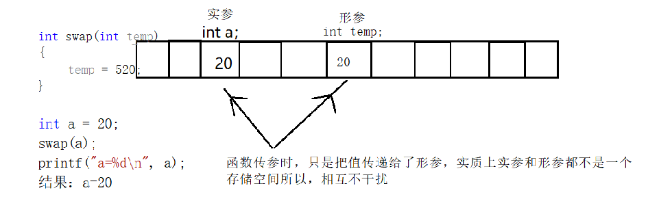
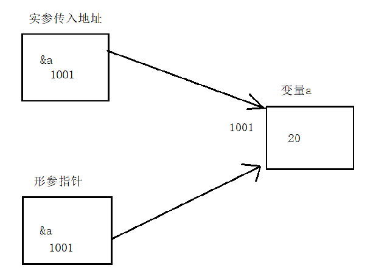

# 指针高级

## 指针做函数参数

学习函数的时候，讲了函数的参数都是值拷贝，在函数里面改变形参的值，实参并不会发生改变。



如果想要通过形参改变实参的值，就需要传入指针了。


注意：虽然指针能在函数里面改变实参的值，但是函数传参还是值拷贝。不过指针虽然是值拷贝，但是却指向的同一片内存空间。



## 指针做函数返回值

返回指针的函数，也叫作指针函数。

和普通函数一样，只是返回值类型不同而已，先看一下下面这个函数，非常熟悉对不！

```cpp
int fun(int x,int y);
```

接下来看另外一个函数声明

```cpp
int* fun(int x,int y);
```

这样一对比，发现所谓的指针函数也没什么特别的。

**注意：**

+ 不要返回临时变量的地址
+ 可以返回动态申请的空间的地址
+ 可以返回静态变量的地址

## 函数指针

如果在程序中定义了一个函数，那么在运行时系统就会为这个函数代码分配一段存储空间，这段存储空间的首地址称为这个函数的地址。而且函数名表示的就是这个地址。既然是地址我们就可以定义一个指针变量来存放，这个指针变量就叫作函数指针变量，简称函数指针。

### 函数指针定义

`函数返回值类型  (* 指针变量名) (函数参数列表);`

+ “函数返回值类型”表示该指针变量所指向函数的 返回值类型；

+ “函数参数列表”表示该指针变量所指向函数的参数列表。

**那么怎么判断一个指针变量是指向变量的指针，还是指向函数的指针变量呢？**

+ 看变量名的后面有没有带有形参类型的圆括号，如果有就是指向函数的指针变量，即函数指针，如果没有就是指向变量的指针变量。

+ 函数指针没有++和 --运算

### 函数指针使用

定义一个实现两个数相加的函数。

```cpp
int add(int a,int b)
{
    return a+b;
}
int main()
{
    int (*pfun)(int,int) = add;
    int res = pfun(5,3);
    printf("res:%d\n",res);
    
    return 0;
}
```

在给函数指针pfun赋值时，可以直接用add赋值，也可以用&add赋值，效果是一样的。

在使用函数指针时，同样也有两种方式，1，pfun(5,3);  2，(*pfun)(5,3)

**用函数指针实现一个简单的计算器，支持+、-、*、/、%**

```cpp
plus sub multi divide mod		//加 减 乘 除 取余
```

## 回调函数

首先要明确的一点是，函数也可以作为函数的参数来传递。

当做函数参数传入的函数，称之为 回调函数（至于为什么要叫“回调函数”，不能叫别的呢？其实这只是人为规定的一个名字。你也可以叫“maye专属函数”，但是到时候你又会问为什么要叫“maye专属函数”，它特么的总的有个名字吧！所以叫“回调函数”就是王八的屁股：规定！）。

