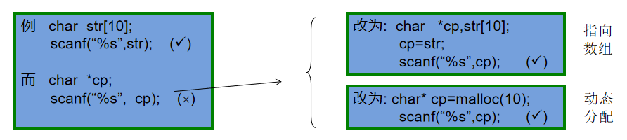
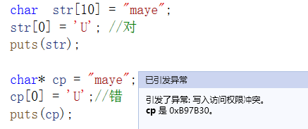

# 字符串与指针

在各种编程语言中，字符串的地位都十分重要，C语言中并没有提供“字符串”这个特定类型，而是以特殊字符数组的形式来存储和处理字符串，这种字符数组必须以空字符’\0’结尾，因此，也将这种特定字符数组称为C风格字符串， 如何声明创建一个C风格字符串时，如何使用C风格字符串，这是本节课要学习的内容。

**存储字符串有两种形式：**

+ 字符数组形式：char str[20];
+ 字符指针形式：char* pc;

**区别：**

+ str是一个字符数组，字符串中的每个字符逐个存放，且可以随意修改
+ pc是一个字符指针，指向的是常量区的字符串，不能修改，只能访问

```cpp
char  str[20];     str=“I love China!”;    //(X) str是常量不能改变指向
char   *pc;        pc=“I love China!”;     //(√) pc是变量，可以改变指向
```

## 字符串输入

+ pc接受输入字符串时，必须先开辟内存空间





## 多个字符串输入

需要存储多个字符串时可以用二维数组或指针数组。

+ 二维数组：每个元素为一维数组的数组，叫二维数组。可以用个一维数组存储一个字符串。

  ```cpp
  char str[5][10];
  for (int i = 0; i < 5; i++)
  {
  	gets_s(str[i], 10);
  }
  for (int i = 0; i < 5; i++)
  {
  	puts(str[i]);
  }
  ```

+ 指针数组

  ```cpp
  char* str1[5];
  for (int i = 0; i < 5; i++)
  {
  	str1[i] = malloc(10);
  	gets_s(str1[i],10);
  }
  for (int i = 0; i < 5; i++)
  {
  	puts(str1[i]);
  	free(str1[i]);
  	str1[0] = NULL;
  }
  
  ```

  

## 字符串操作函数

C语言提供了丰富的字符串处理函数，大致可分为字符串的输入、输出、合并、修改、比较、转换、复制、搜索几类。 使用这些函数可大大减轻编程的负担。用于输入输出的字符串函数，在使用前应包含头文件"stdio.h"，使用其它字符串函数则应包含头文件"string.h"。

+ strlen 求字符串字面量长度
+ strcpy 字符串拷贝
+ strcat 字符串连接
+ strcmp 字符串比较

**自己用指针实现这些函数：**


# typedef

C语言允许用户使用 typedef 关键字来定义自己习惯的数据类型名称，来替代系统默认的基本类型名称、数组类型名称、指针类型名称与用户自定义的结构型名称、共用型名称、枚举型名称等

在使用复杂指针类型时，比如函数指针，可以用typedef取别名，不需要每次都写很长的指针定义。

**定义：typedef 类型 别名；**

+ typedef int INT；INT就是我们定义的新类型，此时可以用INT 代替int来定义整型变量
+ typedef void (*PFUNA)(int a); ———— 在语句开头加上typedef关键字，PFUNA就是我们定义的新类型


**一，typedef的一个重要用途是定义机器无关的类型。**

例如，定义一个叫REAL的浮点类型，该浮点类型在目标机器上可以获得最高的精度：

```c
typedef long double Real;
```

如果在不支持 long double 的机器上运行相关代码，只需要对对应的typedef语句进行修改，例如：

```c
typedef double Real;
```

或者：

```c
typedef float Real
```

**二，使用typedef为现有类型创建别名，给变量定义一个易于记忆且意义明确的新名字。**

+ 类型过长，用typedef可以简化一下

```c
typedef unsigned int UInt32
```

+ 还可以定义数组类型

```c
typedef int IntArray[10];
IntArray arr;				//相当于int arr[10]
```


**三、使用typedef简化一些比较复杂的类型声明。**

例如：

```c
typedef int (*CompareCallBack)(int,int);
```

上述声明引入了PFUN类型作为函数指针的同义字，该函数有两个类型分别为int、int、char参数，以及一个类型为int的返回值。通常，当某个函数的参数是一个回调函数时，可能会用到typedef简化声明。
例如，承接上面的示例，我们再列举下列示例：

```c
int callBackTest(int a,int b,CompareCallBack cmp);
```

callBackTest函数的参数有一个CompareCallBack类型的回调函数。在这个示例中，如果不用typedef，callBackTest函数声明如下：

```c
int callBackTest(int a,int b,int (*cmp)(int,int));
```


从上面两条函数声明可以看出，不使用typedef的情况下，callBackTest函数的声明复杂得多，不利于代码的理解，并且增加的出错风险。

所以，在某些复杂的类型声明中，使用typedef进行声明的简化是很有必要的。


## 小心陷阱

示例：

```c
typedef int* IntPtr;
cont IntPtr p;
```

**`const IntPtr` 相当于 `const char`” 呢？还是`char* const`呢？**

+ 答案是相当于`char* const`，原因很简单，typedef 是用来定义一种类型的新别名的，它不同于宏，不是简单的字符串替换。
+ 因此，`const IntPtr`中的 const 给予了整个指针本身常量性，也就是形成了常量指针`char* const`（一个指向char的常量指针），而不是`const char*`（指向常量 char 的指针）。
+ 当然，要想让 const IntPtr相当于 const char* 也很容易。如下面的代码所示：

```c
typedef const int* const_IntPtr;
const_IntPtr p;
```


还值得注意的是，虽然 typedef 并不真正影响对象的存储特性，但在语法上它还是一个存储类的关键字，就像 auto、extern、static 和 register 等关键字一样。因此，像下面这种声明方式是不可行的：

```c
typedef static int Static_Int;	//错误
```

不可行的原因是不能声明多个存储类关键字，由于 typedef 已经占据了存储类关键字的位置，因此，在 typedef 声明中就不能够再使用 static 或任何其他存储类关键字了。
