# Git基础教程

> 本文参考：https://liaoxuefeng.com/

## Git是什么？

Git 是一个开源的分布式版本控制系统，用于敏捷高效地处理任何或小或大的项目。

Git 是 Linus Torvalds 为了帮助管理 Linux 内核开发而开发的一个开放源码的版本控制软件。

**那什么是版本控制系统？**

如果你用Microsoft Word写过长篇大论，那你一定有这样的经历：

想删除一个段落，又怕将来想恢复找不回来怎么办？有办法，先把当前文件“另存为……”一个新的Word文件，再接着改，改到一定程度，再“另存为……”一个新文件，这样一直改下去，最后你的Word文档变成了这样：


过了一周，你想找回被删除的文字，但是已经记不清删除前保存在哪个文件里了，只好一个一个文件去找，真麻烦。

看着一堆乱七八糟的文件，想保留最新的一个，然后把其他的删掉，又怕哪天会用上，还不敢删，真郁闷。

更要命的是，有些部分需要你的财务同事帮助填写，于是你把文件Copy到U盘里给她（也可能通过Email发送一份给她），然后，你继续修改Word文件。一天后，同事再把Word文件传给你，此时，你必须想想，发给她之后到你收到她的文件期间，你作了哪些改动，得把你的改动和她的部分合并，真困难。

于是你想，如果有一个软件，不但能自动帮我记录每次文件的改动，还可以让同事协作编辑，这样就不用自己管理一堆类似的文件了，也不需要把文件传来传去。如果想查看某次改动，只需要在软件里瞄一眼就可以，岂不是很方便？

这个软件用起来就应该像这个样子，能记录每次文件的改动：

| 版本 | 文件名      | 用户 | 说明                   | 日期       |
| ---- | ----------- | ---- | ---------------------- | ---------- |
| 1    | service.doc | 张三 | 删除了软件服务条款5    | 7/12 10:38 |
| 2    | service.doc | 张三 | 增加了License人数限制  | 7/12 18:09 |
| 3    | service.doc | 李四 | 财务部门调整了合同金额 | 7/13 9:51  |
| 4    | service.doc | 张三 | 延长了免费升级周期     | 7/14 15:17 |

这样，你就结束了手动管理多个“版本”的史前时代，进入到版本控制的20世纪。

## Git的诞生

很多人都知道，Linus在1991年创建了开源的Linux，从此，Linux系统不断发展，已经成为最大的服务器系统软件了。

Linus虽然创建了Linux，但Linux的壮大是靠全世界热心的志愿者参与的，这么多人在世界各地为Linux编写代码，那Linux的代码是如何管理的呢？

事实是，在2002年以前，世界各地的志愿者把源代码文件通过diff的方式发给Linus，然后由Linus本人通过手工方式合并代码！

你也许会想，为什么Linus不把Linux代码放到版本控制系统里呢？不是有CVS、SVN这些免费的版本控制系统吗？因为Linus坚定地反对CVS和SVN，这些集中式的版本控制系统不但速度慢，而且必须联网才能使用。有一些商用的版本控制系统，虽然比CVS、SVN好用，但那是付费的，和Linux的开源精神不符。

不过，到了2002年，Linux系统已经发展了十年了，代码库之大让Linus很难继续通过手工方式管理了，社区的弟兄们也对这种方式表达了强烈不满，于是Linus选择了一个商业的版本控制系统BitKeeper，BitKeeper的东家BitMover公司出于人道主义精神，授权Linux社区免费使用这个版本控制系统。

安定团结的大好局面在2005年就被打破了，原因是Linux社区牛人聚集，不免沾染了一些梁山好汉的江湖习气。开发Samba的Andrew试图破解BitKeeper的协议（这么干的其实也不只他一个），被BitMover公司发现了（监控工作做得不错！），于是BitMover公司怒了，要收回Linux社区的免费使用权。

Linus可以向BitMover公司道个歉，保证以后严格管教弟兄们，嗯，这是不可能的。实际情况是这样的：

Linus花了两周时间自己用C写了一个分布式版本控制系统，这就是Git！一个月之内，Linux系统的源码已经由Git管理了！牛是怎么定义的呢？大家可以体会一下。

Git迅速成为最流行的分布式版本控制系统，尤其是2008年，GitHub网站上线了，它为开源项目免费提供Git存储，无数开源项目开始迁移至GitHub，包括C语言、C++、java等等。

历史就是这么偶然，如果不是当年BitMover公司威胁Linux社区，可能现在我们就没有免费而超级好用的Git了。

## 集中式vs分布式

Linus一直痛恨的CVS及SVN都是集中式的版本控制系统，而Git是分布式版本控制系统，集中式和分布式版本控制系统有什么区别呢？

先说集中式版本控制系统，版本库是集中存放在中央服务器的，而干活的时候，用的都是自己的电脑，所以要先从中央服务器取得最新的版本，然后开始干活，干完活了，再把自己的活推送给中央服务器。中央服务器就好比是一个图书馆，你要改一本书，必须先从图书馆借出来，然后回到家自己改，改完了，再放回图书馆。


集中式版本控制系统最大的毛病就是必须联网才能工作，如果在局域网内还好，带宽够大，速度够快，可如果在互联网上，遇到网速慢的话，可能提交一个10M的文件就需要5分钟，这还不得把人给憋死啊。

那分布式版本控制系统与集中式版本控制系统有何不同呢？首先，分布式版本控制系统根本没有“中央服务器”，每个人的电脑上都是一个完整的版本库，这样，你工作的时候，就不需要联网了，因为版本库就在你自己的电脑上。既然每个人电脑上都有一个完整的版本库，那多个人如何协作呢？比方说你在自己电脑上改了文件A，你的同事也在他的电脑上改了文件A，这时，你们俩之间只需把各自的修改推送给对方，就可以互相看到对方的修改了。

和集中式版本控制系统相比，分布式版本控制系统的安全性要高很多，因为每个人电脑里都有完整的版本库，某一个人的电脑坏掉了不要紧，随便从其他人那里复制一个就可以了。而集中式版本控制系统的中央服务器要是出了问题，所有人都没法干活了。

在实际使用分布式版本控制系统的时候，其实很少在两人之间的电脑上推送版本库的修改，因为可能你们俩不在一个局域网内，两台电脑互相访问不了，也可能今天你的同事病了，他的电脑压根没有开机。因此，分布式版本控制系统通常也有一台充当“中央服务器”的电脑，但这个服务器的作用仅仅是用来方便“交换”大家的修改，没有它大家也一样干活，只是交换修改不方便而已。


当然，Git的优势不单是不必联网这么简单，后面我们还会看到Git极其强大的分支管理，把SVN等远远抛在了后面。

CVS作为最早的开源而且免费的集中式版本控制系统，直到现在还有不少人在用。由于CVS自身设计的问题，会造成提交文件不完整，版本库莫名其妙损坏的情况。同样是开源而且免费的SVN修正了CVS的一些稳定性问题，是目前用得最多的集中式版本库控制系统。

除了免费的外，还有收费的集中式版本控制系统，比如IBM的ClearCase（以前是Rational公司的，被IBM收购了），特点是安装比Windows还大，运行比蜗牛还慢，能用ClearCase的一般是世界500强，他们有个共同的特点是财大气粗，或者人傻钱多。

微软自己也有一个集中式版本控制系统叫VSS，集成在Visual Studio中。由于其反人类的设计，连微软自己都不好意思用了。

分布式版本控制系统除了Git以及促使Git诞生的BitKeeper外，还有类似Git的Mercurial和Bazaar等。这些分布式版本控制系统各有特点，但最快、最简单也最流行的依然是Git！

## 安装Git

最早Git是在Linux上开发的，很长一段时间内，Git也只能在Linux和Unix系统上跑。不过，现在Git可以在Linux、Unix、Mac和Windows这几大平台上正常运行了。

要使用Git，第一步当然是安装Git了。

### Windows安装Git

+ 从git官网下载[安装程序](https://git-scm.com/)。

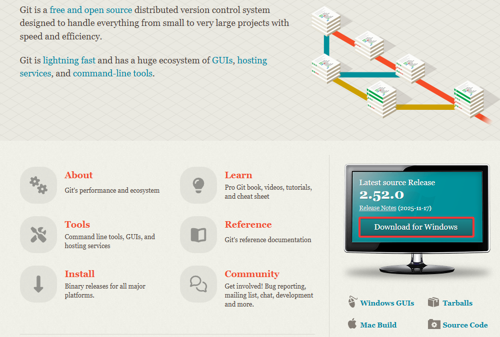

+ 选择x64安装器


+ 然后按默认选项安装即可。安装完成后，在开始菜单里找到“Git”->“Git Bash”，蹦出一个类似命令行窗口的东西，就说明Git安装成功。

### Linux安装Git

+ 首先，试试输入`git --version`查看是否安装了git：

```bash
$ git --version
-bash: /usr/bin/git: 没有那个文件或目录
```

+ 如果没有安装，就执行如下命令安装：

```bash
sudo apt install git
```

> 此命令仅用于`Debian或Ubuntu`，其他Linux系统，请自行搜索。

+ 安装完成即可查看版本

```bash
$ git --version
git version 2.43.0
```

### MacOs安装Git

+ 首先，试试输入`git --version`查看是否安装了git：

```bash
$ git --version
zsh: command not found:git
```

+ 如果系统提示需要安装「命令行开发者工具」，表示尚未安装 Git。现在，点击「安装」并同意条款，即可安装 Git 及必要的开发工具。

```bash
xcode-select --install	#或者通过这个命令安装命令行工具
```

+ 安装完成后，再次执行`git --version`命令，验证 Git 安装。

```bash
$ git --version
git version 2.37.1 (Apple Git-137.1)
```

### 配置Git

安装好Git后，还需要最后一步设置，在命令行输入：

```bash
$ git config --global user.name "Your Name"
$ git config --global user.email "email@example.com"
```

因为Git是分布式版本控制系统，所以，每个机器都必须自报家门：你的名字和Email地址。你也许会担心，如果有人故意冒充别人怎么办？这个不必担心，首先我们相信大家都是善良无知的群众，其次，真的有冒充的也是有办法可查的。

注意`git config`命令的`--global`参数，用了这个参数，表示你这台机器上所有的Git仓库都会使用这个配置，当然也可以对某个仓库指定不同的用户名和Email地址。

可以使用`git config --list`查看所有配置，也可以使用`git config user.name`查看指定的配置项。

## Git四个工作区

### 四个区

Git有四个工作区域：工作目录（Working Directory）、暂存区(Stage/Index)、资源库(Repository或Git Directory)、git仓库(Remote Directory)。文件在这四个区域之间的转换关系如下：

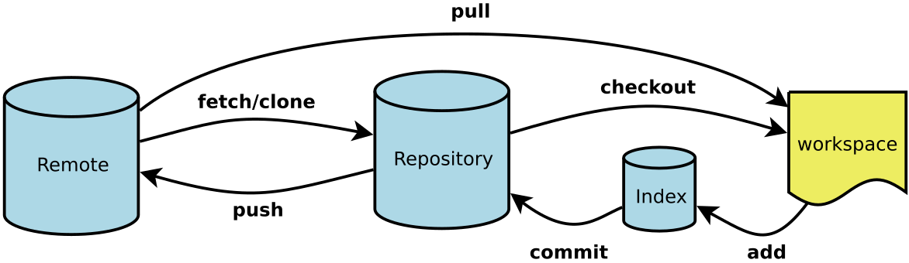

**Workspace**： 工作区，就是你平时存放项目代码的地方

**Index / Stage**： 暂存区，用于临时存放你的改动，事实上它只是一个文件，保存即将提交到文件列表信息

**Repository**： 仓库区（或版本库），就是安全存放数据的位置，这里面有你提交到所有版本的数据。其中HEAD指向最新放入仓库的版本 

**Remote**： 远程仓库，托管代码的服务器，可以简单的认为是你项目组中的一台电脑用于远程数据交换

### 工作流程

git的工作流程一般是这样的：

１、在工作目录中添加、修改文件；

２、将需要进行版本管理的文件放入暂存区域；

３、将暂存区域的文件提交到git仓库。

因此，git管理的文件有三种状态：已修改（modified）,已暂存（staged）,已提交(committed)

### 文件的四种状态

版本控制就是对文件的版本控制，要对文件进行修改、提交等操作，首先要知道文件当前在什么状态，不然可能会提交了现在还不想提交的文件，或者要提交的文件没提交上。

GIT不关心文件两个版本之间的具体差别，而是关心文件的整体是否有改变，若文件被改变，在添加提交时就生成文件新版本的快照，而判断文件整体是否改变的方法就是用SHA-1算法计算文件的校验和。


**Untracked:**  未跟踪, 此文件在文件夹中, 但并没有加入到git库, 不参与版本控制. 通过git add 状态变为Staged.

**Unmodify:**  文件已经入库, 未修改, 即版本库中的文件快照内容与文件夹中完全一致. 这种类型的文件有两种去处, 如果它被修改, 而变为Modified。如果使用git rm移出版本库, 则成为Untracked文件

**Modified:** 文件已修改, 仅仅是修改, 并没有进行其他的操作. 这个文件也有两个去处, 通过git add可进入暂存staged状态, 使用git checkout 则丢弃修改过，返回到unmodify状态, 这个git checkout即从库中取出文件, 覆盖当前修改

**Staged:** 暂存状态. 执行git commit则将修改同步到库中, 这时库中的文件和本地文件又变为一致, 文件为Unmodify状态. 执行git reset HEAD filename取消暂存，文件状态为Modified。

 下面的图很好的解释了这四种状态的转变：

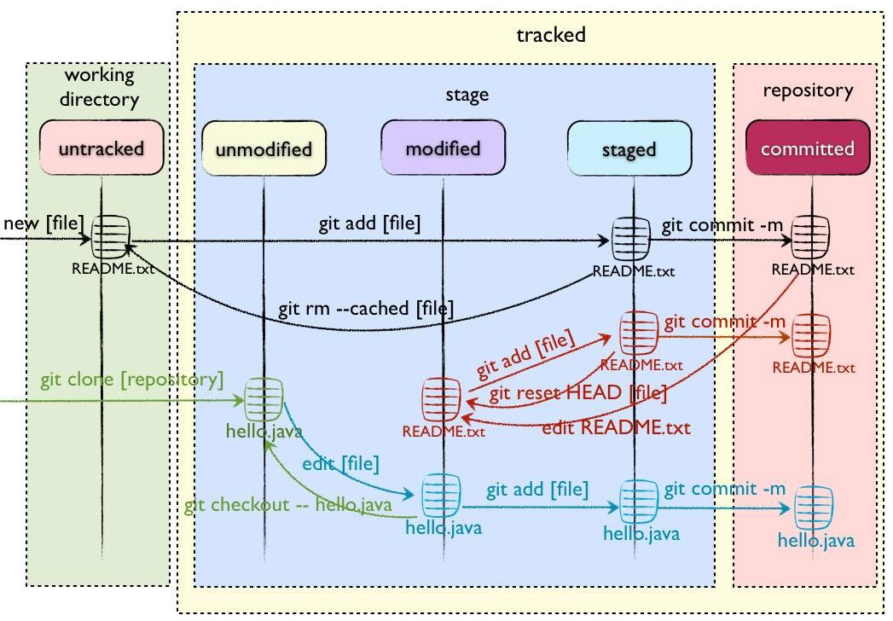

+ 新建文件--->Untracked

+ 使用add命令将新建的文件加入到暂存区--->Staged

+ 使用commit命令将暂存区的文件提交到本地仓库--->Unmodified

+ 如果对Unmodified状态的文件进行修改---> modified

+ 如果对Unmodified状态的文件进行remove操作--->Untracked

## 版本库(仓库)管理

### 创建版本库(仓库)

什么是版本库呢？版本库又名仓库（Repository），你可以简单理解成一个目录，这个目录里面的所有文件都可以被Git管理起来，每个文件的修改、删除，Git都能跟踪，以便任何时刻都可以追踪历史，或者在将来某个时刻可以“还原”。

所以，创建一个版本库非常简单。

+ 第一步，选择一个合适的地方(比如：C://MyData/learn_git)，创建一个空目录：

```bash
mkdir learngit
cd learngit
```

> 如果你使用Windows系统，为了避免遇到各种莫名其妙的问题，请确保目录名（包括父目录）不包含中文。

+ 通过`git init`命令把这个目录变成Git可以管理的仓库：

```bash
$ git init
Initialized empty Git repository in C:/MyData/learn_git/learngit/.git/
```

瞬间Git就把仓库建好了，而且告诉你是一个空的仓库（empty Git repository），细心的你应该发现当前目录下多了一个`.git`的目录，这个目录是Git来跟踪管理版本库的，没事千万不要手动修改这个目录里面的文件，不然改乱了，就把Git仓库给破坏了。

> 如果你没有看到`.git`目录，那是因为这个目录默认是隐藏的，用`ls -ah`命令就可以看见。

+ 可以通过`git status`命令查看仓库状态：

```bash
$ git status
On branch master
No commits yet
nothing to commit (create/copy files and use "git add" to track)
```

`No commits yet`表示当前分支（如 master）尚未包含任何提交记录。Git 的设计原则要求：任何分支的推送操作必须基于至少一次有效的提交。

### 将文件添加到版本库

我们先来创建一个`readme.txt`文件，内容如下：

```css
Git is a version control system.
Git is free software.
```

一定要放到`learngit`目录下（子目录也行），因为这是一个Git仓库，放到其他地方Git再厉害也找不到这个文件。

然后再查看一下仓库状态：

```bash
$ git status
On branch master
No commits yet

Untracked files:
  (use "git add <file>..." to include in what will be committed)
        readme.txt	#此处应该是红色

nothing added to commit but untracked files present (use "git add" to track)
```

从状态可以看出，有一个未追踪的文件`readme.txt`，安装下面的步骤可以添加追踪和提交到仓库中。

第一步，用命令`git add`命令告诉Git，把文件添加到暂存区：

```bash
$ git add readme.txt
```

执行上面的命令，没有任何显示，这就对了，Unix的哲学是“没有消息就是好消息”，说明添加成功。

再次查看状态，发现readme.txt已经被添加到暂存区中了：

```bash
$ git status
On branch master

No commits yet

Changes to be committed:
  (use "git rm --cached <file>..." to unstage)
        new file:   readme.txt	#此处应该是绿色
```


第二步，用命令`git commit`告诉Git，把文件提交到仓库：

```bash
$ git commit -m "wrote a readme file"
[master (root-commit) 014a891] wrote a readme file
 1 file changed, 2 insertions(+)
 create mode 100644 readme.txt
```

简单解释一下`git commit`命令，`-m`后面输入的是本次提交的说明，可以输入任意内容，当然最好是有意义的，这样你就能从历史记录里方便地找到改动记录。

嫌麻烦不想输入`-m "xxx"`行不行？确实有办法可以这么干，但是强烈不建议你这么干，因为输入说明对自己对别人阅读都很重要。实在不想输入说明的童鞋请自行搜索，我不告诉你这个参数。

`git commit`命令执行成功后会告诉你，`1 file changed`：1个文件被改动（我们新添加的readme.txt文件）；`2 insertions`：插入了两行内容（readme.txt有两行内容）。

提交之后，再次查看状态：

```bash
$ git status
On branch master
nothing to commit, working tree clean
```

`nothing to commit, working tree clean`意味着你的工作区没有任何更改，所有更改都已经提交到当前分支。

## 时光穿梭机

### 修改并提交

们已经成功地添加并提交了一个readme.txt文件，现在，是时候继续工作了，于是，我们继续修改readme.txt文件，改成如下内容：

```css
Git is a distributed version control system.
Git is free software.
```

然后，查看一下状态：

```bash
$ git status
On branch master
Changes not staged for commit:
  (use "git add <file>..." to update what will be committed)
  (use "git restore <file>..." to discard changes in working directory)
        modified:   readme.txt

no changes added to commit (use "git add" and/or "git commit -a")
```

上面的命令输出告诉我们，`readme.txt`被修改过了，但还没有将修改添加到暂存区。

虽然Git告诉我们`readme.txt`被修改了，但如果能看看具体修改了什么内容，自然是很好的。比如你休假两周从国外回来，第一天上班时，已经记不清上次怎么修改的`readme.txt`，所以，需要用`git diff`这个命令看看：

```bash
$ git diff readme.txt
diff --git a/readme.txt b/readme.txt
index 46d49bf..9247db6 100644
--- a/readme.txt
+++ b/readme.txt
@@ -1,2 +1,2 @@
-Git is a version control system.
+Git is a distributed version control system.
 Git is free software.
```

`git diff`顾名思义就是查看difference，显示的格式正是Unix通用的diff格式，可以从上面的命令输出看到，我们在第一行添加了一个`distributed`单词。

知道了对`readme.txt`作了什么修改后，再把它提交到仓库就放心多了，提交修改和提交新文件是一样的两步，第一步是`git add`：

```bash
$ git add readme.txt
```

同样没有任何输出。在执行第二步`git commit`之前，我们再运行`git status`看看当前仓库的状态：

```bash
$ git status
On branch master
Changes to be committed:
  (use "git restore --staged <file>..." to unstage)
        modified:   readme.txt
```

`git status`告诉我们，将要被提交的修改包括`readme.txt`，下一步，就可以放心地提交了：

```bash
$ git commit -m "add distributed"
[master a6fb976] add distributed
 1 file changed, 1 insertion(+), 1 deletion(-)
```

提交后，我们再用`git status`命令看看仓库的当前状态：

```bash
$ git status
On branch master
nothing to commit, working tree clean
```

Git告诉我们当前没有需要提交的修改，而且，工作目录是干净（working tree clean）的。

### 版本回退

现在，我们已经学会了修改文件，然后把修改提交到Git版本库，现在，再练习一次，修改readme.txt文件如下：

```css
Git is a distributed version control system.
Git is free software distributed under the GPL.
```

然后尝试提交：

```bash
$ git add readme.txt
$ git commit -m "append GPL"
[master 7dd3634] append GPL
 1 file changed, 1 insertion(+), 1 deletion(-)
```

像这样，你不断对文件进行修改，然后不断提交修改到版本库里，就好比玩RPG游戏时，每通过一关就会自动把游戏状态存盘，如果某一关没过去，你还可以选择读取前一关的状态。有些时候，在打Boss之前，你会手动存盘，以便万一打Boss失败了，可以从最近的地方重新开始。Git也是一样，每当你觉得文件修改到一定程度的时候，就可以“保存一个快照”，这个快照在Git中被称为`commit`。一旦你把文件改乱了，或者误删了文件，还可以从最近的一个`commit`恢复，然后继续工作，而不是把几个月的工作成果全部丢失。

现在，我们回顾一下`readme.txt`文件一共有几个版本被提交到Git仓库里了

**版本1：**wrote a readme file

```css
Git is a version control system.
Git is free software.
```

**版本2：**add distributed

```css
Git is a distributed version control system.
Git is free software.
```

**版本3：**append GPL

```css
Git is a distributed version control system.
Git is free software distributed under the GPL.
```

当然了，在实际工作中，我们脑子里怎么可能记得一个几千行的文件每次都改了什么内容，不然要版本控制系统干什么。版本控制系统肯定有某个命令可以告诉我们历史记录，在Git中，我们用`git log`命令查看：

```bash
$ git log
commit 7dd3634fb3d164428032353b0b8f1a72b73dcceb (HEAD -> master)
Author: maye <zcmaye@gmail.com>
Date:   Thu Nov 20 15:06:02 2025 +0800

    append GPL

commit a6fb9762fda3043f98ed8b09bb29366c59a0a83a
Author: maye <zcmaye@gmail.com>
Date:   Thu Nov 20 15:00:07 2025 +0800

    add distributed

commit 014a891b92b80fd1da7bea62723ae13901722699
Author: maye <zcmaye@gmail.com>
Date:   Wed Nov 19 20:13:34 2025 +0800

    wrote a readme file
```

`git log`命令显示从最近到最远的提交日志，我们可以看到3次提交，最近的一次是`append GPL`，上一次是`add distributed`，最早的一次是`wrote a readme file`。

如果嫌输出信息太多，看得眼花缭乱的，可以试试加上`--pretty=oneline`参数：

```bash
$ git log --pretty=oneline
7dd3634fb3d164428032353b0b8f1a72b73dcceb (HEAD -> master) append GPL
a6fb9762fda3043f98ed8b09bb29366c59a0a83a add distributed
014a891b92b80fd1da7bea62723ae13901722699 wrote a readme file
```

需要友情提示的是，你看到的一大串类似`7dd3634f...`的是`commit id`（版本号），`commit id`是一个SHA1计算出来的一个非常大的数字，用十六进制表示，而且你看到的`commit id`和我的肯定不一样，以你自己的为准。为什么`commit id`需要用这么一大串数字表示呢？因为Git是分布式的版本控制系统，后面我们还要研究多人在同一个版本库里工作。


好了，现在我们启动时光穿梭机，准备把`readme.txt`回退到上一个版本，也就是`add distributed`的那个版本，怎么做呢？

首先，Git必须知道当前版本是哪个版本，在Git中，用`HEAD`表示当前版本，也就是最新的提交`7dd3634f...`（注意我的提交ID和你的肯定不一样），上一个版本就是`HEAD^`，上上个版本就是`HEAD^^`，当然往上100个版本写100个`^`比较容易数不过来，所以写成`HEAD~100`。

现在，我们要把当前版本`append GPL`回退到上一个版本`add distributed`，就可以使用`git reset`命令：

```bash
$ git reset --hard HEAD^
HEAD is now at a6fb976 add distributed
```

`--hard`参数有啥意义？`--hard`会回退到上个版本的已提交状态，而`--soft`会回退到上个版本的未提交状态，`--mixed`会回退到上个版本已添加但未提交的状态。现在，先放心使用`--hard`。

看看`readme.txt`的内容是不是版本`add distributed`：

```bash
$ cat readme.txt
Git is a distributed version control system.
Git is free software.
```

果然被还原了。

还可以继续回退到上一个版本`wrote a readme file`，不过且慢，让我们用`git log`再看看现在版本库的状态：

```bash
$ git log
commit a6fb9762fda3043f98ed8b09bb29366c59a0a83a (HEAD -> master)
Author: maye <zcmaye@gmail.com>
Date:   Thu Nov 20 15:00:07 2025 +0800

    add distributed

commit 014a891b92b80fd1da7bea62723ae13901722699
Author: maye <zcmaye@gmail.com>
Date:   Wed Nov 19 20:13:34 2025 +0800

    wrote a readme file
```

最新的那个版本`append GPL`已经看不到了！好比你从21世纪坐时光穿梭机来到了19世纪，想再回去已经回不去了，肿么办？

办法其实还是有的，只要上面的命令行窗口还没有被关掉，你就可以顺着往上找啊找啊，找到那个`append GPL`的`commit id`是`1094adb...`，于是就可以指定回到未来的某个版本：

```bash
$ git reset --hard 7dd3634f
HEAD is now at 7dd3634 append GPL
```

再小心翼翼地看看`readme.txt`的内容：

```css
$ cat readme.txt
Git is a distributed version control system.
Git is free software distributed under the GPL.
```

果然，我胡汉三又回来了。

Git的版本回退速度非常快，因为Git在内部有个指向当前版本的`HEAD`指针，当你回退版本的时候，Git仅仅是把HEAD从指向`append GPL`：

```
┌────┐
│HEAD│
└────┘
   │
   └──▶ ○ append GPL
        │
        ○ add distributed
        │
        ○ wrote a readme file
```

改为指向`add distributed`：

```
┌────┐
│HEAD│
└────┘
   │
   │    ○ append GPL
   │    │
   └──▶ ○ add distributed
        │
        ○ wrote a readme file
```

然后顺便把工作区的文件更新了。所以你让`HEAD`指向哪个版本号，你就把当前版本定位在哪。

现在，你回退到了某个版本，关掉了电脑，第二天早上就后悔了，想恢复到新版本怎么办？找不到新版本的`commit id`怎么办？

在Git中，总是有后悔药可以吃的。当你用`$ git reset --hard HEAD^`回退到`add distributed`版本时，再想恢复到`append GPL`，就必须找到`append GPL`的commit id。Git提供了一个命令`git reflog`用来记录你的每一次命令：

```bash
$ git reflog
a6fb976 HEAD@{1}: reset: moving to HEAD^
7dd3634 (HEAD -> master) HEAD@{2}: commit: append GPL
a6fb976 HEAD@{3}: commit: add distributed
014a891 HEAD@{4}: commit (initial): wrote a readme file
```

终于舒了口气，从输出可知，`append GPL`的commit id是`7dd3634`，现在，你又可以乘坐时光机回到未来了。

**小结**

现在总结一下：

- `HEAD`指向的版本就是当前版本，因此，Git允许我们在版本的历史之间穿梭，使用命令`git reset --hard commit_id`。
- 穿梭前，用`git log`可以查看提交历史，以便确定要回退到哪个版本。
- 要重返未来，用`git reflog`查看命令历史，以便确定要回到未来的哪个版本。

### 工作区和暂存区

暂存区是Git中很重要的一个概念，一定要搞明白！先来看名词解释。

#### 工作区（Working Directory）

就是你在电脑里能看到的目录，比如我的`learngit`文件夹就是一个工作区：

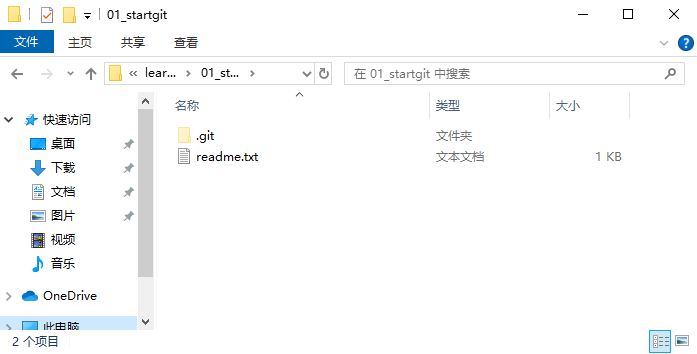

#### 版本库（Repository）

工作区有一个隐藏目录`.git`，这个不算工作区，而是Git的版本库。

Git的版本库里存了很多东西，其中最重要的就是称为stage（或者叫index）的暂存区，还有Git为我们自动创建的第一个分支`master`，以及指向`master`的一个指针叫`HEAD`。


分支和`HEAD`的概念我们以后再讲。

前面讲了我们把文件往Git版本库里添加的时候，是分两步执行的：

第一步是用`git add`把文件添加进去，实际上就是把文件修改添加到暂存区；

第二步是用`git commit`提交更改，实际上就是把暂存区的所有内容提交到当前分支。

因为我们创建Git版本库时，Git自动为我们创建了唯一一个`master`分支，所以，现在，`git commit`就是往`master`分支上提交更改。

你可以简单理解为，需要提交的文件修改通通放到暂存区，然后，一次性提交暂存区的所有修改。

俗话说，实践出真知。现在，我们再练习一遍，先对`readme.txt`做个修改，比如加上一行内容：

```css
Git is a distributed version control system.
Git is free software distributed under the GPL.
Git has a mutable index called stage.
```

然后，在工作区新增一个`LICENSE`文本文件（内容随便写）。

```bash
$ git status
On branch master
Changes not staged for commit:
  (use "git add <file>..." to update what will be committed)
  (use "git restore <file>..." to discard changes in working directory)
        modified:   readme.txt

Untracked files:
  (use "git add <file>..." to include in what will be committed)
        LICENSE

no changes added to commit (use "git add" and/or "git commit -a")
```

Git非常清楚地告诉我们，`readme.txt`被修改了，而`LICENSE`还从来没有被添加过，所以它的状态是`Untracked`。

现在，使用两次命令`git add`（也可以直接`git add .`将所有文件添加到暂存区），把`readme.txt`和`LICENSE`都添加后，用`git status`再查看一下：

```bash
$ git status
On branch master
Changes to be committed:
  (use "git restore --staged <file>..." to unstage)
        new file:   LICENSE
        modified:   readme.txt
```

现在，暂存区的状态就变成这样了：


所以，`git add`命令实际上就是把要提交的所有修改放到暂存区（Stage），然后，执行`git commit`就可以一次性把暂存区的所有修改提交到分支。

```bash
$ git commit -m "understand how stage works"
[master 40521de] understand how stage works
 2 files changed, 2 insertions(+)
 create mode 100644 LICENSE
```

一旦提交后，如果你又没有对工作区做任何修改，那么工作区就是“干净”的：

```bash
$ git status
On branch master
nothing to commit, working tree clean
```

现在版本库变成了这样，暂存区就没有任何内容了：


### 撤销修改

#### 未添加到暂存区

自然，你是不会犯错的。不过现在是凌晨两点，你正在赶一份工作报告，你在`readme.txt`中添加了一行：

```bash
$ cat readme.txt
Git is a distributed version control system.
Git is free software distributed under the GPL.
Git has a mutable index called stage.
My stupid boss hasn't given me a raise yet.
```

在你准备提交前，一杯咖啡起了作用，你猛然发现了`stupid boss`可能会让你丢掉这个月的奖金！

既然错误发现得很及时，就可以很容易地纠正它。你可以删掉最后一行，手动把文件恢复到上一个版本的状态。如果用`git status`查看一下

```bash
$ git status
On branch master
Changes not staged for commit:
  (use "git add <file>..." to update what will be committed)
  (use "git restore <file>..." to discard changes in working directory)
        modified:   readme.txt

no changes added to commit (use "git add" and/or "git commit -a")
```

你可以发现，Git会告诉你，`git restore <file>...`可以丢弃工作区的修改：

```bash
$ git restore readme.txt
```

命令`git restore readme.txt`意思就是，把`readme.txt`文件在工作区的修改全部撤销，这里有两种情况：

+ 一种是`readme.txt`自修改后还没有被放到暂存区，现在，撤销修改就回到和版本库一模一样的状态；

+ 一种是`readme.txt`已经添加到暂存区后，又作了修改，现在，撤销修改就回到添加到暂存区后的状态。

总之，就是让这个文件回到最近一次`git commit`或`git add`时的状态。

现在，看看`readme.txt`的文件内容：

```bash
$ cat readme.txt
Git is a distributed version control system.
Git is free software distribute under the GPL.
Git has a mutable index called stage.
```

文件内容果然复原了。

#### 已添加到暂存区

现在假定是凌晨3点，你不但写了一些胡话，还`git add`到暂存区了：

```bash
$ cat readme.txt
Git is a distributed version control system.
Git is free software distribute under the GPL.
Git has a mutable index called stage.
My stupid boss hasn't given me a raise yet.

$ git add readme.txt
```

庆幸的是，在`commit`之前，你发现了这个问题。用`git status`查看一下，修改只是添加到了暂存区，还没有提交：

```bash
$ git status
On branch master
Changes to be committed:
  (use "git restore --staged <file>..." to unstage)
        modified:   readme.txt
```

Git同样告诉我们，用命令`ggit restore --staged <file>...`可以把暂存区的修改撤销掉（unstage），重新放回工作区：

```bash
$ git restore --staged readme.txt
```

再用`git status`查看一下，现在暂存区是干净的，工作区有修改：

```bash
$ git status
On branch master
Changes not staged for commit:
  (use "git add <file>..." to update what will be committed)
  (use "git restore <file>..." to discard changes in working directory)
        modified:   readme.txt

no changes added to commit (use "git add" and/or "git commit -a")
```

还记得如何丢弃工作区的修改吗？

```bash
$ git restore readme.txt

$ git status
On branch master
nothing to commit, working tree clean
```

整个世界终于清静了！

#### 已提交到分支

现在，假设你不但改错了东西，还从暂存区提交到了版本库，怎么办呢？还记得[版本回退](#版本回退)一节吗？可以回退到上一个版本。不过，这是有条件的，就是你还没有把自己的本地版本库推送到远程。还记得Git是分布式版本控制系统吗？我们后面会讲到远程版本库，一旦你把`stupid boss`提交推送到远程版本库，你就真的惨了……

#### 小结

又到了小结时间。

场景1：当你改乱了工作区某个文件的内容，想直接丢弃工作区的修改时，用命令`git restore <file>`。

场景2：当你不但改乱了工作区某个文件的内容，还添加到了暂存区时，想丢弃修改，分两步，第一步用命令`git restore --staged <file>`，就回到了场景1，第二步按场景1操作。

场景3：已经提交了不合适的修改到本地版本库时，想要撤销本次提交，参考[版本回退](#版本回退)一节，不过前提是没有推送到远程库。

### 删除文件

在Git中，删除也是一个修改操作，我们实战一下，先添加一个新文件`test.txt`到Git并且提交：

```bash
$ git add test.txt

$ git commit -m "add test.txt"
[master 76dd540] add test.txt
 1 file changed, 0 insertions(+), 0 deletions(-)
 create mode 100644 test.txt
```

一般情况下，你通常直接在文件管理器中把没用的文件删了，或者用`rm`命令删了：

```bash
$ rm test.txt
```

> 后悔删除了，可以使用`git restore test.txt`恢复。

这个时候，Git知道你删除了文件，因此，工作区和版本库就不一致了，`git status`命令会立刻告诉你哪些文件被删除了：

```bash
$ git status
On branch master
Changes not staged for commit:
  (use "git add/rm <file>..." to update what will be committed)
  (use "git restore <file>..." to discard changes in working directory)
        deleted:    test.txt

no changes added to commit (use "git add" and/or "git commit -a")
```

现在你有两个选择，一是确实要从版本库中删除该文件，那就用命令`git rm`删掉，并且`git commit`：

```bash
$ git add test.txt

$ git commit -m "remove test.txt"
[master e5bcf3f] remove test.txt
 1 file changed, 0 insertions(+), 0 deletions(-)
 delete mode 100644 test.txt
```

现在，文件就从版本库中被删除了。

 **提示**

+ 你也可以不手动删除文件，直接使用`git rm`命令来删除本地文件并暂存删除操作，然后直接使用`git commit`提交即可。

+ 另一种情况是删错了，因为版本库里还有呢，所以可以很轻松地把误删的文件恢复到最新版本：

```bash
$ git restore test.txt
```

> `git restore `其实是用版本库里的版本替换工作区的版本，无论工作区是修改还是删除，都可以“一键还原”。
>
> **注意：**从来没有被添加到版本库就被删除的文件，是无法恢复的！

命令`git rm`用于删除一个文件。如果一个文件已经被提交到版本库，那么你永远不用担心误删，但是要小心，你只能恢复文件到最新版本，你会丢失**最近一次提交后你修改的内容**。

## 远程仓库

到目前为止，我们已经掌握了如何在Git仓库里对一个文件进行时光穿梭，你再也不用担心文件备份或者丢失的问题了。

Git是分布式版本控制系统，同一个Git仓库，可以分布到不同的机器上。怎么分布呢？最早，肯定只有一台机器有一个原始版本库，此后，别的机器可以“克隆”这个原始版本库，而且每台机器的版本库其实都是一样的，并没有主次之分。

你肯定会想，至少需要两台机器才能玩远程库不是？但是我只有一台电脑，怎么玩？

实际情况是这样，找一台电脑充当服务器的角色，每天24小时开机，其他每个人都从这个“服务器”仓库克隆一份到自己的电脑上，并且各自把各自的提交推送到服务器仓库里，也从服务器仓库中拉取别人的提交。

有个叫[Gitee](https://gitee.com/)和[GitHub](https://github.com/)的神奇的网站，从名字就可以看出，这个网站就是提供Git仓库托管服务的，所以，只要注册一个Gitee或GitHub账号，就可以免费获得Git远程仓库。

### 添加远程仓库

现在的情景是，你已经在本地创建了一个Git仓库后，又想在Gitee或GitHub创建一个Git仓库，并且让这两个仓库进行远程同步，这样，Gitee或GitHub上的仓库既可以作为备份，又可以让其他人通过该仓库来协作，真是一举多得。

#### Gitee

首先，登陆Gitee，然后，在右上角找到“+”按钮，创建一个新的仓库：

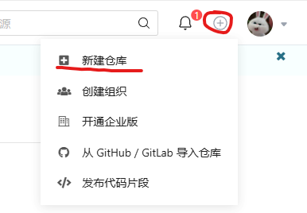

在仓库名称填入`learngit`，其他保持默认设置，点击“创建”按钮，就成功地创建了一个新的Git仓库：

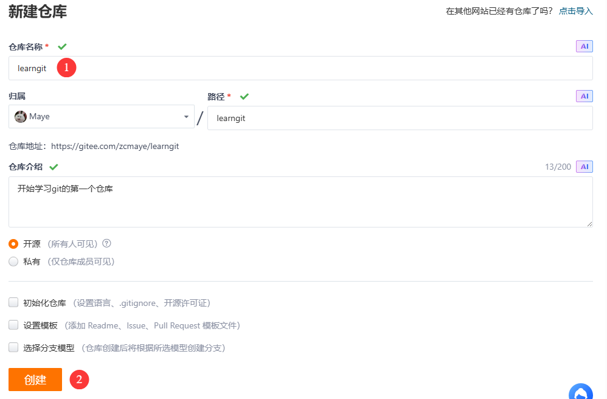

目前，在GitHub上的这个`learngit`仓库还是空的，GitHub告诉我们，可以从这个仓库克隆出新的仓库，也可以把一个已有的本地仓库与之关联，然后，把本地仓库的内容推送到GitHub仓库。

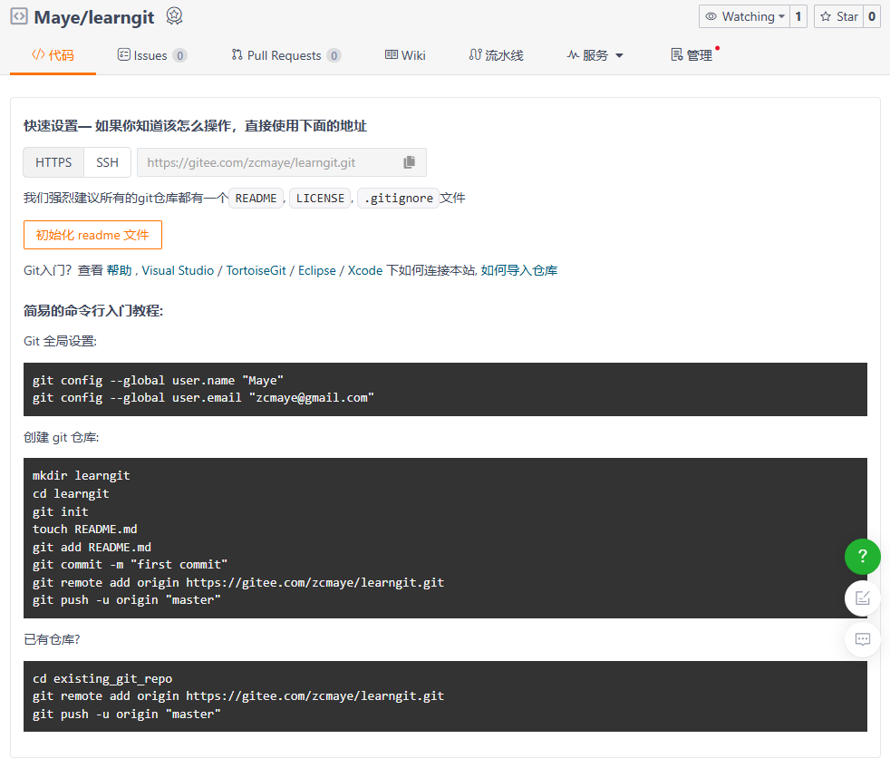

现在，我们根据GitHub的提示，在本地的`learngit`仓库下运行命令：

```bash
git remote add origin https://gitee.com/zcmaye/learngit.git
```

请千万注意，把上面的`zcmaye`替换成你自己的Gitee账户名，否则，你在本地关联的就是我的远程库，关联没有问题，但是你以后推送是推不上去的，因为你的SSH Key公钥不在我的账户列表中。

添加后，远程库的名字就是`origin`，这是Git默认的叫法，也可以改成别的，但是`origin`这个名字一看就知道是远程库。

下一步，就可以把本地库的所有内容推送到远程库上：

```bash
git push -u origin "master"
```

如果是第一次推送，则需要输入Gitee的账号和密码：

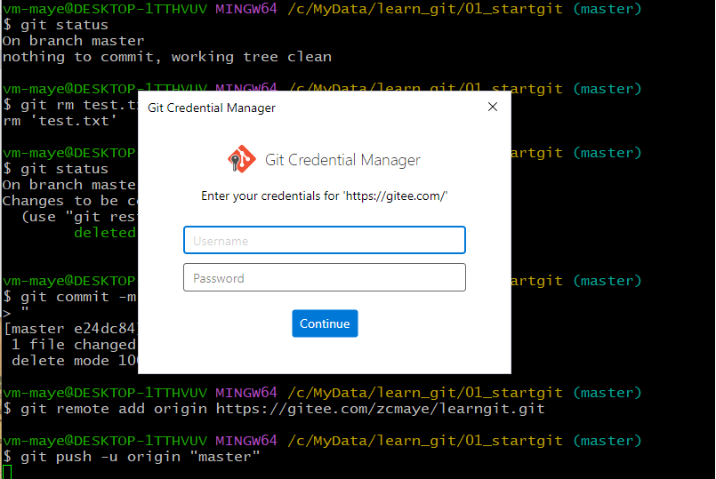

登录成功，显示如下：

```bash
$ git push -u origin "master"
Enumerating objects: 17, done.
Counting objects: 100% (17/17), done.
Delta compression using up to 4 threads
Compressing objects: 100% (12/12), done.
Writing objects: 100% (17/17), 1.39 KiB | 474.00 KiB/s, done.
Total 17 (delta 3), reused 0 (delta 0), pack-reused 0 (from 0)
remote: Powered by GITEE.COM [1.1.23]
remote: Set trace flag 09400492
To https://gitee.com/zcmaye/learngit.git
 * [new branch]      master -> master
branch 'master' set up to track 'origin/master'.
```

把本地库的内容推送到远程，用`git push`命令，实际上是把当前分支`master`推送到远程。

由于远程库是空的，我们第一次推送`master`分支时，加上了`-u`参数，Git不但会把本地的`master`分支内容推送的远程新的`master`分支，还会把本地的`master`分支和远程的`master`分支关联起来，在以后的推送或者拉取时就可以简化命令。

推送成功后，可以立刻在GitHub页面中看到远程库的内容已经和本地一模一样：

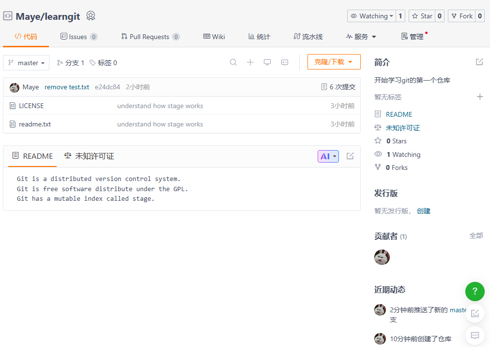

从现在起，只要本地作了提交，就可以通过命令：

```bash
$ git push origin master
```

把本地`master`分支的最新修改推送至Gitee，现在，你就拥有了真正的分布式版本库！

#### Github

进入[GitHub](https://github.com/)，点击注册。

##### 轻松访问Github

由于国际网络路由和域名解析的技术限制，国内访问GitHub时常出现： - 网页加载缓慢或空白 - Git克隆/推送失败 - 图片和资源无法显示 - 甚至完全无法连接。

介绍两种解决方法：

###### 修改Host文件

+ 通过ping命令查看`github.com`的IP地址：

  ```bash
  C:\Users\Maye>ping github.com
  
  正在 Ping github.com [20.205.243.166] 具有 32 字节的数据:
  来自 20.205.243.166 的回复: 字节=32 时间=112ms TTL=111
  来自 20.205.243.166 的回复: 字节=32 时间=88ms TTL=111
  来自 20.205.243.166 的回复: 字节=32 时间=88ms TTL=111
  来自 20.205.243.166 的回复: 字节=32 时间=88ms TTL=111
  ```

+ 打开Hosts文件：

  + Windows的Hosts文件：`C:\Windows\System32\drivers\etc\hosts`
  + mac/Linux的Hosts文件：`/etc/hosts`

+ 把上面的IP地址和域名配置到hosts文件中：

  ```bash
  20.205.243.166 github.com
  ```

  > ⚠️注意：IP地址可能变化，建议每月更新一次

+ 最后要刷新一下DNS缓存

  + Windows：`ipconfig`
  + mac：`sudo killall -HUP mDNSResponder`
  + Linux：`sudo systemctl restart NetworkManager`

### 修改远程仓库

使用`git remote -v`可以查看远程仓库信息：

```bash
$ git remote -v
origin  https://gitee.com/zcmaye/learngit.git (fetch)
origin  https://gitee.com/zcmaye/learngit.git (push)
```

如果添加的时候地址写错了，或者就是想删除远程库，可以用`git remote rm <name>`命令。

```bash
$ git remote rm origin
```

此处的“删除”其实是解除了本地和远程的绑定关系，并不是物理上删除了远程库。远程库本身并没有任何改动。要真正删除远程库，需要登录到GitHub，在后台页面找到删除按钮再删除。

可以删除之后重新添加，也可以直接修改远程仓库：

```bash
$ git remote set-url origin https://gitee.com/zcmaye/learngit.git
```

### 从远程仓库克隆

上次我们讲了先有本地库，后有远程库的时候，如何关联远程库。现在，假设我们从零开发，那么最好的方式是先创建远程库，然后，从远程库克隆。

首先，登陆Gitee，创建一个新的仓库，名字叫`hdy_git`：

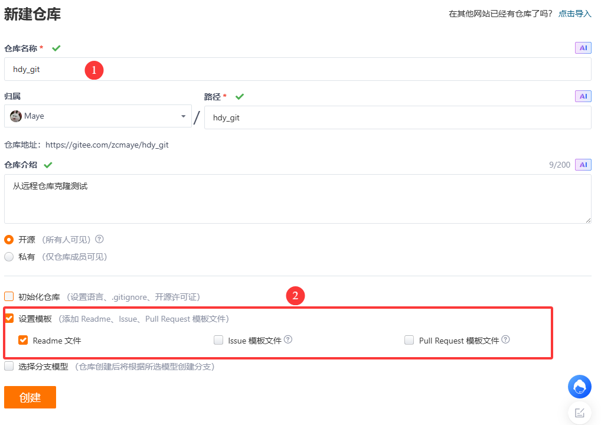

我们勾选设置模板（勾选Readme文件），这样GitHub会自动为我们创建一个`README.md`文件。创建完毕后，可以看到`README.md`文件：

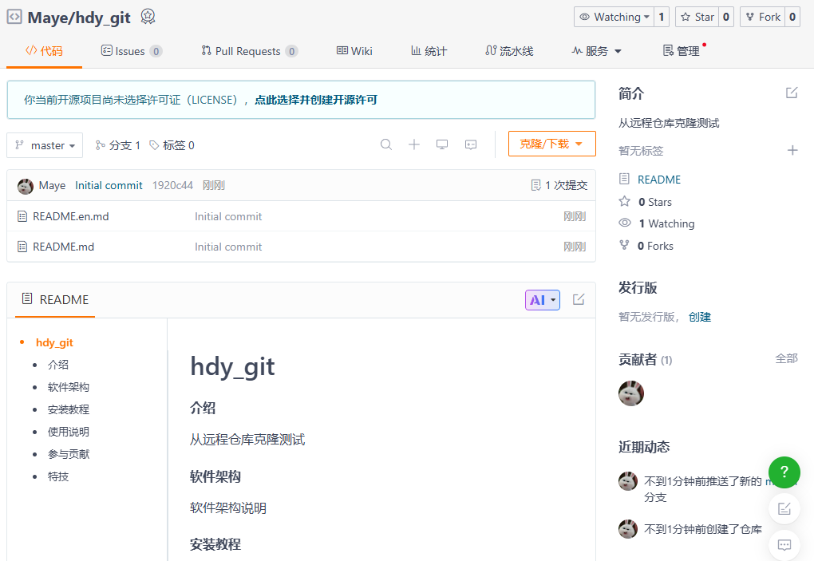

现在，远程库已经准备好了，下一步是用命令`git clone`克隆一个本地库：

```bash
$ git clone https://gitee.com/zcmaye/hdy_git.git
Cloning into 'hdy_git'...
remote: Enumerating objects: 4, done.
remote: Counting objects: 100% (4/4), done.
remote: Compressing objects: 100% (4/4), done.
remote: Total 4 (delta 0), reused 0 (delta 0), pack-reused 0 (from 0)
Receiving objects: 100% (4/4), done.
```

注意把Git库的地址换成你自己的，然后进入`hdy_git`目录看看，已经有`README.md`文件了：

```bash
$ cd hdy_git/

$ ls
README.en.md  README.md
```

如果有多个人协作开发，那么每个人各自从远程克隆一份就可以了。

你也许还注意到，Gitee给出的地址不止一个，还可以用`git@gitee.com:zcmaye/hdy_git.git`这样的地址。实际上，Git支持多种协议，默认的`https://`使用`https`协议，但也可以使用`ssh`等其他协议。

### 配置SSH秘钥

我们先把原来拉取的`hdy_git`本地仓库删掉，然后使用`ssh`协议拉取：

```bash
$ git clone git@gitee.com:zcmaye/hdy_git.git

Cloning into 'hdy_git'...
The authenticity of host 'gitee.com (180.76.198.77)' can't be established.
ED25519 key fingerprint is: SHA256:+ULzij2u99B9eWYFTw1Q4ErYG/aepHLbu96PAUCoV88
This key is not known by any other names.
Are you sure you want to continue connecting (yes/no/[fingerprint])? yes
Warning: Permanently added 'gitee.com' (ED25519) to the list of known hosts.
** WARNING: connection is not using a post-quantum key exchange algorithm.
** This session may be vulnerable to "store now, decrypt later" attacks.
** The server may need to be upgraded. See https://openssh.com/pq.html
git@gitee.com: Permission denied (publickey).
fatal: Could not read from remote repository.

Please make sure you have the correct access rights
and the repository exists.
```

上面结果告诉我们，要想使用ssh拉取，必须先配置ssh秘钥！

首先，通过`ssh-keygen`生成秘钥对(公钥和私钥)：

```bash
$ ssh-keygen -t ed25519 -C "vm-windows"
```

- `-t` key 类型
- `-C` 注释

输出，如下(中间通过三次**回车键**确定)：

```bash
Generating public/private ed25519 key pair.
Enter file in which to save the key (/c/Users/vm-maye/.ssh/id_ed25519):
Enter passphrase for "/c/Users/vm-maye/.ssh/id_ed25519" (empty for no passphrase):
Enter same passphrase again:
Your identification has been saved in /c/Users/vm-maye/.ssh/id_ed25519
Your public key has been saved in /c/Users/vm-maye/.ssh/id_ed25519.pub
The key fingerprint is:
SHA256:F2FjAds8omD092gRx8MuQAvInScG+FVXYARTYPYHxJM vm-windows
The key's randomart image is:
+--[ED25519 256]--+
| o.+o+OB@BO.     |
|. o.*=o*EX+o     |
| . oooo.*o*.     |
|  .. . o.*.o     |
|      . S.o      |
|       . .       |
|                 |
|                 |
|                 |
+----[SHA256]-----+
```

查看生成的公钥和私钥：

> 秘钥生成在`/c/Users/vm-maye/.ssh`目录中。

```bash
$ ls ~/.ssh/
id_ed25519  id_ed25519.pub  known_hosts
```

然后，获取公钥内容，并配置到SSH公钥中。

```bash
$ cat ~/.ssh/id_ed25519.pub
ssh-ed25519 AAAAC3NzaC1lZDI1NTE5AAAAIBNYAeI0Hl7kudRKV7uEsnhpHei7KQLplzxo90rWp5/A vm-windows
```

复制之后点击确定：

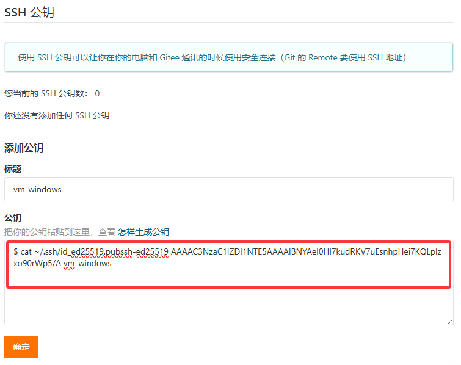

然后再次输入密码即可：


添加成功显示如下：

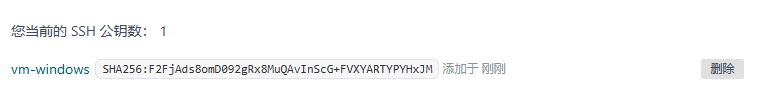

最后再次尝试使用`ssh`协议拉取仓库：

```bash
$ git clone git@gitee.com:zcmaye/hdy_git.git
Cloning into 'hdy_git'...
** WARNING: connection is not using a post-quantum key exchange algorithm.
** This session may be vulnerable to "store now, decrypt later" attacks.
** The server may need to be upgraded. See https://openssh.com/pq.html
remote: Enumerating objects: 4, done.
remote: Counting objects: 100% (4/4), done.
remote: Compressing objects: 100% (4/4), done.
remote: Total 4 (delta 0), reused 0 (delta 0), pack-reused 0 (from 0)
Receiving objects: 100% (4/4), done.
```

