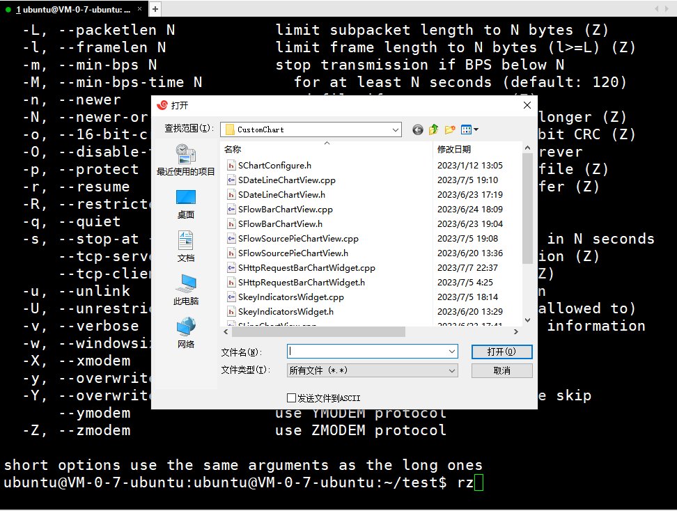
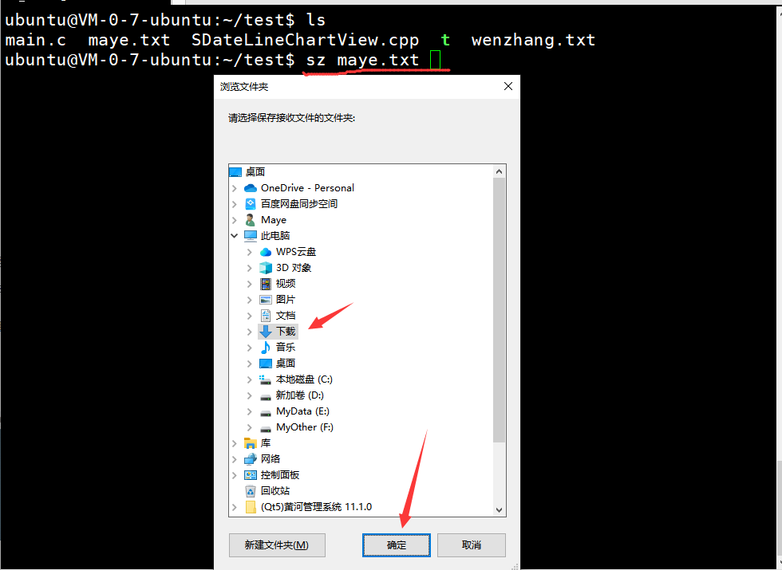
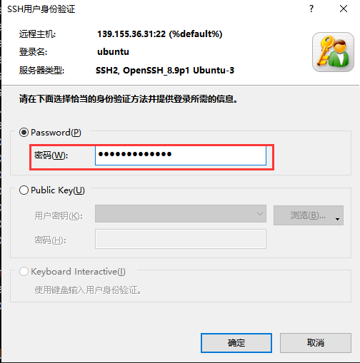
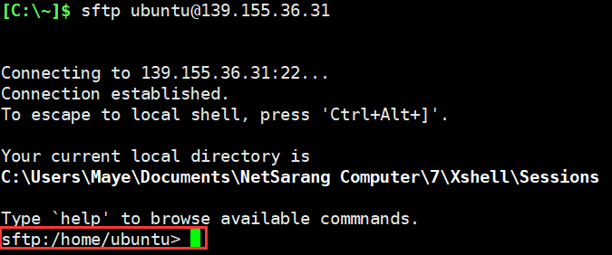

## xshell终端

Xshell是一个强大的安全终端模拟软件，Xshell可以在Windows界面下用来访问远端不同系统下的服务器，从而比较好的达到远程控制终端的目的。

## 文件传输

我们可能会经常在本地客户端和Linux服务器之间进行文件传输，根据需求的不同可以选择不同的方式进行。

### xftp文件传输

> xftp就是实现sftp协议的客户端，可以很方便的传输文件。


### rz、sz命令

rz，sz是Linux/Unix同Windows进行ZModem文件传输的命令行工具，但是windows端需要支持ZModem的telnet/ssh客户端，比如xshell或者SecureCRT才可以使用。

这两个命令也很好区分。

**sz**：将选定的文件发送（send）到本地机器，s作为send的简写；

**rz**：运行该命令会弹出一个文件选择窗口，从本地选择文件上传到服务器(receive)，r作为receive的简写。

在大多数Linux发行版中，rz命令已经预装了。如果你的系统没有预装rz命令，你可以通过以下命令安装：`sudo apt-get install lrzsz`

#### rz上传

使用rz命令上传文件非常简单。打开终端并进入要上传文件的目录。然后，在终端中输入rz命令，按下回车键。

接下来，rz命令会弹出一个文件选择对话框，你可以在对话框中选择要上传的文件。选择完文件后，点击"确定"按钮。



##### 常用选项

+ --f：强制覆盖已存在的文件
+ --q：静默模式，不显示传输进度
+ --v：显示rz命令的版本信息

##### 注意事项

1. 确保远程服务器上的目标文件夹有写权限，否则无法上传文件。
2. 如果上传的文件名与远程服务器上已存在的文件名相同，rz命令默认会询问是否覆盖已存在的文件。如果你想自动覆盖已存在的文件，可以使用-f参数。
3. 如果要上传**文件夹**，请先把文件夹打包成压缩包，然后进行上传。

#### sz下载

使用sz命令下载文件非常简单。打开终端并进入要下载文件的目录。然后，在终端中输入`sz file`命令，按下回车键。

接下来，sz命令会弹出一个文件选择对话框，你可以在对话框中选择下载文件的保存位置。选择完文件后，点击"确定"按钮。



##### 常用选项

-a       ：  以文本方式传输（ascii）。
		-b       ：  以二进制方式传输（binary）。
		-e       ：  对控制字符转义（escape），这可以保证文件传输正确。

+ 如果能够确定所传输的文件是文本格式的，使用 sz -a files

+ 如果是二进制文件，使用 sz -be files

### sftp命令

SFTP（Secure File Transfer Protocol，安全文件传输协议）是一种可以安全传输文件的协议，它是一种基于 SSH（Secure Shell）的文件传输协议，它允许用户将文件以加密的形式传输到远程服务器上，以保护文件的安全性。

#### 登陆

+ 首先登陆SFTP服务器(linux都会默认安装)

```sh
#语法
sftp [user@]host [port=22]
#样例
sftp ubuntu@139.155.36.31
```

+ 然后输入密码



+ 登陆成功



#### 帮助

使用help命令查看所有sftp命令。

```sh
sftp:/home/ubuntu> help
```

sftp所有命令如下：

```sh
help    提供帮助

get     将文件从服务器下载到本地计算机
put     将文件从本地计算机上传到服务器
clear   清屏

cd      改变远程工作目录
ls      列出远程目录的内容
pwd     打印远程工作目录

explore 查看本地目录
lcd     更改和/或打印本地工作目录
lls     列出本地目录的内容
lpwd    打印本地工作目录

mkdir   在远程服务器上创建目录
mv      移动或重命名远程服务器上的文件
rename  移动或重命名远程服务器上的文件
rm      删除文件
rmdir   删除远程服务器上的目录

bye     完成会话，退出sftp
exit    同bye
quit    同bye
```

如果对于某个命令不熟悉，可以使用`help 命令`来查看，比如：

```sh
#get用法
sftp:/home/ubuntu> help get
get - download a file from the server to your local machine
Usage: get file1 [file2] [file3] ...
#put用法
sftp:/home/ubuntu> help put
put - upload a file from your local machine to the server
Usage: put [file1] [file2] [file3] ...
```

