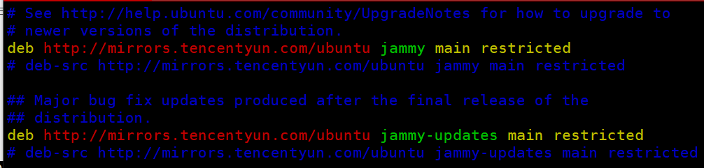

## xshell终端

Xshell是一个强大的安全终端模拟软件，Xshell可以在Windows界面下用来访问远端不同系统下的服务器，从而比较好的达到远程控制终端的目的。

### 快捷键

> 在 工具/选项/键盘和鼠标/编辑 里可以看到所有的快捷键

+ Ctrl+Tab 切换选项卡
+ Ctrl+Alt+n 新建选项卡
+ Ctrl+Alt+t 新建选项卡(复制当前会话，重新打开窗口)

### 用户名高亮

通过xshell连接服务器，默认情况下用户名是没有高亮显示的，如下所示：


在界面显示过多命令时，会难以区分，对此可以设置用户名高亮显示。

+ 找到bash shell的配置文件`.bashrc`，可以使用命令查找`sudo find / -name ".bashrc"`


​	可以看到找到了多个，其中root可以作为全局配置，/home/ubuntu则只针对ubuntu用户配置，随便哪个都行。

+ 打开`.bashrc`文件，找到`#force_color_prompt=yes`所在的行，将#号删掉(取消注释)

  

+ 修改之后保存，并重启终端即可！


## 文件传输

我们可能会经常在本地客户端和Linux服务器之间进行文件传输，根据需求的不同可以选择不同的方式进行。

### xftp文件传输

> xftp就是实现sftp协议的客户端，可以很方便的传输文件。


### rz、sz命令

rz，sz是Linux/Unix同Windows进行ZModem文件传输的命令行工具，但是windows端需要支持ZModem的telnet/ssh客户端，比如xshell或者SecureCRT才可以使用。

这两个命令也很好区分。

**sz**：将选定的文件发送（send）到本地机器，s作为send的简写；

**rz**：运行该命令会弹出一个文件选择窗口，从本地选择文件上传到服务器(receive)，r作为receive的简写。

在大多数Linux发行版中，rz命令已经预装了。如果你的系统没有预装rz命令，你可以通过以下命令安装：`sudo apt-get install lrzsz`

#### rz上传

使用rz命令上传文件非常简单。打开终端并进入要上传文件的目录。然后，在终端中输入rz命令，按下回车键。

接下来，rz命令会弹出一个文件选择对话框，你可以在对话框中选择要上传的文件。选择完文件后，点击"确定"按钮。


##### 常用选项

+ --f：强制覆盖已存在的文件
+ --q：静默模式，不显示传输进度
+ --v：显示rz命令的版本信息

##### 注意事项

1. 确保远程服务器上的目标文件夹有写权限，否则无法上传文件。
2. 如果上传的文件名与远程服务器上已存在的文件名相同，rz命令默认会询问是否覆盖已存在的文件。如果你想自动覆盖已存在的文件，可以使用-f参数。
3. 如果要上传**文件夹**，请先把文件夹打包成压缩包，然后进行上传。

#### sz下载

使用sz命令下载文件非常简单。打开终端并进入要下载文件的目录。然后，在终端中输入`sz file`命令，按下回车键。

接下来，sz命令会弹出一个文件选择对话框，你可以在对话框中选择下载文件的保存位置。选择完文件后，点击"确定"按钮。


##### 常用选项

-a       ：  以文本方式传输（ascii）。
		-b       ：  以二进制方式传输（binary）。
		-e       ：  对控制字符转义（escape），这可以保证文件传输正确。

+ 如果能够确定所传输的文件是文本格式的，使用 sz -a files

+ 如果是二进制文件，使用 sz -be files

### sftp命令

SFTP（Secure File Transfer Protocol，安全文件传输协议）是一种可以安全传输文件的协议，它是一种基于 SSH（Secure Shell）的文件传输协议，它允许用户将文件以加密的形式传输到远程服务器上，以保护文件的安全性。

#### 登陆

+ 首先登陆SFTP服务器(linux都会默认安装)

```sh
#语法
sftp [user@]host [port=22]
#样例
sftp ubuntu@139.155.36.31
```

+ 然后输入密码


+ 登陆成功


#### 帮助

使用help命令查看所有sftp命令。

```sh
sftp:/home/ubuntu> help
```

sftp所有命令如下：

```sh
help    提供帮助

get     将文件从服务器下载到本地计算机
put     将文件从本地计算机上传到服务器
clear   清屏

cd      改变远程工作目录
ls      列出远程目录的内容
pwd     打印远程工作目录

explore 查看本地目录
lcd     更改和/或打印本地工作目录
lls     列出本地目录的内容
lpwd    打印本地工作目录

mkdir   在远程服务器上创建目录
mv      移动或重命名远程服务器上的文件
rename  移动或重命名远程服务器上的文件
rm      删除文件
rmdir   删除远程服务器上的目录

bye     完成会话，退出sftp
exit    同bye
quit    同bye
```

如果对于某个命令不熟悉，可以使用`help 命令`来查看，比如：

```sh
#get用法
sftp:/home/ubuntu> help get
get - download a file from the server to your local machine
Usage: get file1 [file2] [file3] ...
#put用法
sftp:/home/ubuntu> help put
put - upload a file from your local machine to the server
Usage: put [file1] [file2] [file3] ...
```

## 文件下载

**Linux [wget](https://www.coonote.com/linux/wget-file-download.html)命令**用来从指定的URL下载文件。wget非常稳定，它在带宽很窄的情况下和不稳定网络中有很强的适应性，如果是由于网络的原因下载失败，wget会不断的尝试，直到整个文件下载完毕。如果是服务器打断下载过程，它会再次联到服务器上从停止的地方继续下载。这对从那些限定了链接时间的服务器上下载大文件非常有用。

+ 使用wget下载单个文件

  ```bash
  wget https://easyx.cn/download/EasyX_2023%E5%A4%A7%E6%9A%91%E7%89%88.exe
  ```

  以下的例子是从网络下载Easyx并保存在当前目录，在下载的过程中会显示进度条，包含（下载完成百分比，已经下载的字节，当前下载速度，剩余下载时间）

+ 下载并以不同的文件名保存

  ```bash
  wget -O easyx.exe Url
  ```

+ 断点续传

  ```bash
  wget -c Url
  ```

  使用`wget -c`重新启动下载中断的文件，对于我们下载大文件时突然由于网络等原因中断非常有帮助，我们可以继续接着下载而不是重新下载一个文件。需要继续中断的下载时可以使用`-c`参数。

+ 限速下载

  ```bash
  wget --limit-rate=300k Url
  ```

  当你执行wget的时候，它默认会占用全部可能的宽带下载。但是当你准备下载一个大文件，而你还需要下载其它文件时就有必要限速了。

+ 后台下载

  ```bash
  wget -b Url
  ```

  对于下载非常大的文件的时候，我们可以使用参数`-b`进行后台下载，你可以使用以下命令来察看下载进度：

  ```bash
  tail -f wget-log
  ```

+ 伪装代理名称下载

  ```bash
  wget --user-agent="Mozilla/5.0 (Windows; U; Windows NT 6.1; en-US) AppleWebKit/534.16 (KHTML, like Gecko) Chrome/10.0.648.204 Safari/534.16" Url
  ```

  有些网站能通过根据判断代理名称不是浏览器而拒绝你的下载请求。不过你可以通过`--user-agent`参数伪装。

## 包管理

apt（Advanced Packaging Tool）是一个在 Debian 和 Ubuntu 中的 Shell 前端软件包管理器。

apt 命令提供了查找、安装、升级、删除某一个、一组甚至全部软件包的命令，而且命令简洁而又好记。

apt 命令执行需要超级管理员权限(root)。

### apt 格式

```
 apt [options] command [package ...]
```

- **options：**可选，选项包括 -h（帮助），-y（当安装过程提示选择全部为"yes"），-q（不显示安装的过程）等等。
- **command：**要进行的操作。
- **package**：安装的包名

### apt 常用命令

+ list - 列出包

  + 列出指定包 ：`sudo apt list <package_name>`
  + 列出所有已安装的包：`sudo apt list --installed`
  + 列出所有已安装的包的版本信息：`sudo apt list --all-version`
  + 列出可更新的软件包：`apt list --upgradeable`

+ search - 搜索包(模糊搜索)

  + `sudo apt search <package_name>`
  + `sudo apt search zip`

+ show - 显示包详细信息

  + `sudo apt show <package_name>`
  + `sudo apt show gcc`

+ install - 安装包

  + `sudo apt install <package_name> <...>`

+ reinstall - 重新安装包

+ remove - 移除包

+ autoremove - 自动删除所有未使用的包

+ update - 更新可用包的列表

+ upgrade - 将软件包升级到最新版本,并在需要它们作为依赖项时安装新软件包。它不会删除任何包，如果指定要删除任何包，它会跳过它们

+ full-upgrade - 同上，需要删除时删除

+ edit-sources - 编辑源信息文件

  + 先执行命令`sudo apt edit-sources`

  + 然后选择编辑器

  + 

  + 可以看到所有源信息

  + 

  + 源存储在sources.list中，可以执行命令查找`sudo find / -name "sources.list"`

    ```bash
    /etc/apt/sources.list
    /usr/share/doc/apt/examples/sources.list
    ```

  + 先把sources.list备份一下，以免等下出错`sudo cp /etc/apt/source.list /etc/apt/source.list.backup`

  + 然后把文件中所有的tencentyun改为指定的源名(如：aliyun，tencentyun)

  + 最后执行命令更新软件包列表`sudo apt update`

## 用户管理

https://blog.csdn.net/qq_38803651/article/details/128821602

https://www.runoob.com/linux/linux-user-manage.html

http://www.rply.cn/news/141749.html

## msys2

https://www.python100.com/html/108536.html

[右键菜单](https://www.cnblogs.com/Banner13/p/16709944.html)

[MSYS2 介绍与使用 (ngui.cc)](https://www.ngui.cc/el/2771820.html?action=onClick)

### 包管理

+ pacman -Ss  <package>   搜索包

+ pacman -S <package>      安装包


安装mingw64

```bash
 pacman -S ucrt64/mingw-w64-ucrt-x86_64-gcc
```

安装make

```bash
pacman -S make
```


### 设置环境变量

打开用户目录下面的`.bashrc`文件。

```bash
vim ~/.bashrc
```

添加如下行，即可把指定的路径设置到环境变量。

```bash
export PATH=/e/MySoftware/Qt/Tools/mingw1120_64/bin:$PATH
```

保存退出之后，执行命令`source ~/.bashrc`或者重启终端即可应用成功！

执行命令` echo $PATH`可以查看环境变量。