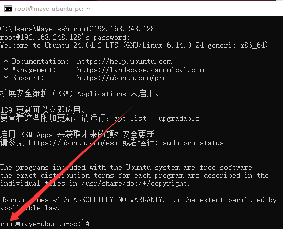

## 远程连接Linux

每次使用Linux都得进入虚拟机然后登录，再打开终端，这样比较麻烦；再者一般的Linux服务器是没有图形界面的，必须使用远程的方式进行登录！

接下来我们使用SSH工具进行远程登录！

### SSH

远程连接Linux需要使用SSH，也就是 Secure Shell（安全外壳协议），是一种加密的网络传输协议，可在不安全的网络中为网络服务提供安全的传输环境，通过在网络中创建安全隧道来实现 SSH 客户端和服务器端之间的连接。

先检查Linux是否安装并开启了SSH服务！

1. 打开Linux终端，输入如下命令

```sh
sudo service ssh status
```

> Unit ssh.service could not be found.

如果输出如上所示，表示openssh服务没有安装，则需要先安装一下。

2. ubuntu先安装openssh服务

```shell
sudo apt install openssh-server
```

3. 安装完再次执行`sudo service ssh status`，如果提示如下所示，则表示安装完毕。

```sh
ssh.service - OpenBSD Secure Sheel server
	Loaded: loaded(/usr/lib/systemd/system/ssh.service;disable;preset..)
	Active: inactive (dead)
```

4. 然后启动ssh服务

```sh
sudo service ssh start		#启动服务
```

### 登录

在windows中打开cmd终端！并输入如下命令：

```shell
ssh <username>@<address>
```

+ username是用户名(可以是root也可以是你安装Linux系统时的用户名)
+ address是Linux系统的IP地址，[如何查看Linux地址](#Linux IP地址)

#### 非root用户登录

这里我们先使用安装linux系统时创建的用户登录！(也就是非root用户，root用户默认禁止远程登录，稍后再说~)

1. 输入命令

```shell
ssh maye@192.168.248.128
```

2. 按回车之后，需要你输入密码(就是安装系统创建的那个)


3. 当密码输入正确后，就应该能连接成功


4. 连接成功后就可以远程使用Linux系统啦~QAQ
5. 可以使用`exit`命令退出登录

#### root用户登录

接下来我们使用root用户进行登录~

1. 把用户名换成root

```sh
ssh root@192.168.1.46
```

> 登录的时候需要输入root密码，所以还必须先使用`sudo passwd root`[设置密码](#设置root用户密码)。

2. 如果输入密码正确，但是总是提示验证失败，则需要检查`/etc/ssh/sshd_config`配置文件，确保以下正确设置。

```sh
PermitRootLogin yes				#允许远程登录
PasswordAuthentication yes		#允许使用密码验证
```

3. 记得重启ssh服务哟

```sh
sudo service ssh restart	#重启服务
```

4. 然后再次登录即可成功！



### Linux IP地址

进入ubuntu的终端。

1. 先安装一个网络工具！

```shell
sudo apt istall net-tools
```

2. 然后执行如下命令。

```shell
ifconfig
```

下图框出来的就是ubutnu的地址，然后填入到Tabby中即可！


### 设置root用户密码

1. 进入Linux终端

2. 输入命令，回车之后需要先输入你的登录密码，然后接着开始输入新的root用户密码！

   ```shell
   sudo passwd root
   ```

3. 密码有要求：

   + 不能包含root用户名
   + 密码不能少于8个字符
   + 密码不能是连续的数字，比如123456
   + 我这里直接设置**ubuntu1228.**

   

## 远程文件传输

### SFTP命令

SFTP（Secure File Transfer Protocol，安全文件传输协议）是一种可以安全传输文件的协议，它是一种基于 SSH（Secure Shell）的文件传输协议，它允许用户将文件以加密的形式传输到远程服务器上，以保护文件的安全性。

#### 登陆

+ 首先登陆SFTP服务器(linux都会默认安装)

```sh
#语法
sftp [user@]host [port=22]
#样例
sftp maye@192.168.1.46
```

+ 然后输入密码


#### 帮助

使用help命令查看所有sftp命令。

```sh
sftp:/home/ubuntu> help
```

sftp所有命令如下：

```sh
help    提供帮助

get     将文件从服务器下载到本地计算机
put     将文件从本地计算机上传到服务器
clear   清屏

cd      改变远程工作目录
ls      列出远程目录的内容
pwd     打印远程工作目录

explore 查看本地目录
lcd     更改和/或打印本地工作目录
lls     列出本地目录的内容
lpwd    打印本地工作目录

mkdir   在远程服务器上创建目录
mv      移动或重命名远程服务器上的文件
rename  移动或重命名远程服务器上的文件
rm      删除文件
rmdir   删除远程服务器上的目录

bye     完成会话，退出sftp
exit    同bye
quit    同bye
```

如果对于某个命令不熟悉，可以使用`help 命令`来查看，比如：

```sh
#get用法
sftp:/home/ubuntu> help get
get - download a file from the server to your local machine
Usage: get file1 [file2] [file3] ...
#put用法
sftp:/home/ubuntu> help put
put - upload a file from your local machine to the server
Usage: put [file1] [file2] [file3] ...
```

## Tabby终端

 Tabby 是一个高度可定制化的跨平台的终端工具，支持 Windows、macOS 和 Linux，自带 SFTP 功能，能与 Linux 服务器轻松传输文件，支持多种主题，界面炫酷。

### 下载与安装

1. 进入Tabby官网[Tabby - a terminal for a more modern age](https://tabby.sh/)，点击右上角`Download`按钮。
2. 点击`Download`按钮之后，会进入github，下载如下图所示exe

> 如果访问不了，可以在百度网盘下载: https://pan.baidu.com/s/1YL-Q_Z9eToXf4px-iifnWQ?pwd=ntxq 


3. 下载下来之后直接双击安装！

   直接点击下一步。


​	然后自己选择安装位置。


​	然后点击安装，等待安装完成即可！

### 切换语言

安装完成后，默认是英文，点击右上角设置按钮。


点击如下图所示`Automatic`，会出现语言选择框，选择中文(简体)即可！（修改完记得重启一下Tabby）


### 本地终端

Tabby支持本地shell，无需再单独打开本地终端了~


可以执行本地终端命令~


### 远程终端

接下来我们就使用 Tabby 来与服务器建立一个 SSH 连接吧。

直接点击最上面的配置和连接按钮，如下图所示：


也可以点击 进入设置 -> 配置和连接 -> 新建 进行连接。


然后在弹出的窗口中选择**SSH连接**。


最后输入一系列数据，点击保存即可！


然后点击如下图所示开始按钮，进行连接！


然后在弹出的窗口中点击**接受并记住秘钥**。


然后就可以愉快的进行远程操作啦！


### SFTP传输文件

我们可能经常需要再本机和Linux之间进行文件传输，通过共享文件夹也不是很方便，通过点击右上角的SFTP传输文件，就很好！


然后在文件窗口找切换到想要上传的目录，然后直接拖进来就好！也可以点击右上角的上传文件或上传目录，注意只能下载单个文件不能下载目录！


## 文件下载

**Linux [wget](https://www.coonote.com/linux/wget-file-download.html)命令**用来从指定的URL下载文件。wget非常稳定，它在带宽很窄的情况下和不稳定网络中有很强的适应性，如果是由于网络的原因下载失败，wget会不断的尝试，直到整个文件下载完毕。如果是服务器打断下载过程，它会再次联到服务器上从停止的地方继续下载。这对从那些限定了链接时间的服务器上下载大文件非常有用。

+ 使用wget下载单个文件

  ```bash
  wget https://easyx.cn/download/EasyX_2023%E5%A4%A7%E6%9A%91%E7%89%88.exe
  ```

  以下的例子是从网络下载Easyx并保存在当前目录，在下载的过程中会显示进度条，包含（下载完成百分比，已经下载的字节，当前下载速度，剩余下载时间）

+ 下载并以不同的文件名保存

  ```bash
  wget -O easyx.exe Url
  ```

+ 断点续传

  ```bash
  wget -c Url
  ```

  使用`wget -c`重新启动下载中断的文件，对于我们下载大文件时突然由于网络等原因中断非常有帮助，我们可以继续接着下载而不是重新下载一个文件。需要继续中断的下载时可以使用`-c`参数。

+ 限速下载

  ```bash
  wget --limit-rate=300k Url
  ```

  当你执行wget的时候，它默认会占用全部可能的宽带下载。但是当你准备下载一个大文件，而你还需要下载其它文件时就有必要限速了。

+ 后台下载

  ```bash
  wget -b Url
  ```

  对于下载非常大的文件的时候，我们可以使用参数`-b`进行后台下载，你可以使用以下命令来察看下载进度：

  ```bash
  tail -f wget-log
  ```

+ 伪装代理名称下载

  ```bash
  wget --user-agent="Mozilla/5.0 (Windows; U; Windows NT 6.1; en-US) AppleWebKit/534.16 (KHTML, like Gecko) Chrome/10.0.648.204 Safari/534.16" Url
  ```

  有些网站能通过根据判断代理名称不是浏览器而拒绝你的下载请求。不过你可以通过`--user-agent`参数伪装。

## 包管理

apt（Advanced Packaging Tool）是一个在 Debian 和 Ubuntu 中的 Shell 前端软件包管理器。

apt 命令提供了查找、安装、升级、删除某一个、一组甚至全部软件包的命令，而且命令简洁而又好记。

apt 命令执行需要超级管理员权限(root)。

### apt 格式

```
 apt [options] command [package ...]
```

- **options：**可选，选项包括 -h（帮助），-y（当安装过程提示选择全部为"yes"），-q（不显示安装的过程）等等。
- **command：**要进行的操作。
- **package**：安装的包名

### apt 常用命令

+ list - 列出包

  + 列出指定包 ：`sudo apt list <package_name>`
  + 列出所有已安装的包：`sudo apt list --installed`
  + 列出所有已安装的包的版本信息：`sudo apt list --all-version`
  + 列出可更新的软件包：`apt list --upgradeable`

+ search - 搜索包(模糊搜索)

  + `sudo apt search <package_name>`
  + `sudo apt search zip`

+ show - 显示包详细信息

  + `sudo apt show <package_name>`
  + `sudo apt show gcc`

+ install - 安装包

  + `sudo apt install <package_name> <...>`

+ reinstall - 重新安装包

+ remove - 移除包

+ autoremove - 自动删除所有未使用的包

+ update - 更新可用包的列表

+ upgrade - 将软件包升级到最新版本,并在需要它们作为依赖项时安装新软件包。它不会删除任何包，如果指定要删除任何包，它会跳过它们

+ full-upgrade - 同上，需要删除时删除

+ edit-sources - 编辑源信息文件

  + 先执行命令`sudo apt edit-sources`

  + 然后选择编辑器

  + 

  + 可以看到所有源信息

  + 

  + 源存储在sources.list中，可以执行命令查找`sudo find / -name "sources.list"`

    ```bash
    /etc/apt/sources.list
    /usr/share/doc/apt/examples/sources.list
    ```

  + 先把sources.list备份一下，以免等下出错`sudo cp /etc/apt/source.list /etc/apt/source.list.backup`

  + 然后把文件中所有的tencentyun改为指定的源名(如：aliyun，tencentyun)

  + 最后执行命令更新软件包列表`sudo apt update`

  > 可以按照清华大学镜像站来配置`https://mirrors.tuna.tsinghua.edu.cn/help/ubuntu/`

