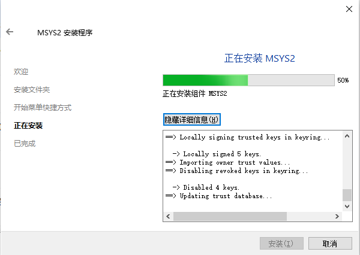

## msys2

msys2是一个为WindowsQ平台提供软件包管理工具和Linux命令行环境的工具集。通过msys2，用户可以在Windows 系统上方便地运行大量的开源软件，并使用类似于Linux终端的命令行界面进行操作。

https://www.python100.com/html/108536.html

[右键菜单](https://www.cnblogs.com/Banner13/p/16709944.html)

[MSYS2 介绍与使用 (ngui.cc)](https://www.ngui.cc/el/2771820.html?action=onClick)

### 下载与安装

进入[msys2](https://www.msys2.org/)官网，按照官网教程进行安装(很简单的~)

也可以百度网盘[下载](https://pan.baidu.com/s/1ax8yHgk9WGBJm8rultR6kA?pwd=zr64 )

值得注意的是，如果安装时，卡在了`updating trust database...`这里，只需要点击取消然后重新安装即可！！！(安装位置不能修改，必须和原来的一样才行)



OK，安装完成了~


### 安装软件

您可能需要安装一些工具，如mingw-w64 GCC来开始编译项目。执行如下命令:

```bash
pacman -S mingw-w64-ucrt-x86_64-gcc
```

为了方便构建，再安装一下make工具：

```bash
pacman -S make
```

为了方便查看文件层次，安装一下tree工具：

```bash
pacman -S tree 
```


### 包管理

+ pacman -Syu: 升级系统及所有已经安装的软件。
+ pacman -S <package>: 安装软件。也可以同时安装多个包，只需以空格分隔包名即可。
+ pacman -Rs <package>: 删除软件，同时删除本机上只有该软件依赖的软件。
+ pacman -Ru <package>: 删除软件，同时删除不再被任何软件所需要的依赖。
+ pacman -Ssq <package_key>: 在仓库中搜索含关键字的软件包，并用简洁方式显示。
+ pacman -Qs <package_key>: 搜索已安装的软件包。
+ pacman -Qi <package>: 查看某个软件包信息，显示软件简介,构架,依赖,大小等详细信息。
+ pacman -Sg: 列出软件仓库上所有的软件包组。
+ pacman -Sg 软件包组: 查看某软件包组所包含的所有软件包。
+ pacman -Sc：清理未安装的包文件，包文件位于 /var/cache/pacman/pkg/ 目录。
+ pacman -Scc：清理所有的缓存文件。

### 设置环境变量

打开用户目录下面的`.bashrc`文件。

```bash
vim ~/.bashrc
```

添加如下行，即可把指定的路径设置到环境变量。

```bash
export PATH=/e/MySoftware/Qt/Tools/mingw1120_64/bin:$PATH
```

保存退出之后，执行命令`source ~/.bashrc`或者重启终端即可应用成功！

执行命令` echo $PATH`可以查看环境变量。