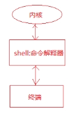
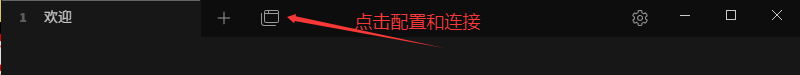

## Linux发展史

要说Linux，还得从UNIX说起。

### Unix发展史

UNIX 操作系统由肯•汤普森（Ken Thompson）和丹尼斯•里奇（Dennis Ritchie）发明。它的部分技术来源可追溯到从 1965 年开始的 Multics 工程计划，该计划由贝尔实验室、美国麻省理工学院和通用电气公司联合发起，目标是开发一种交互式的、具有多道程序处理能力的分时操作系统，以取代当时广泛使用的批处理操作系统。

可惜，由于 Multics 工程计划所追求的目标太庞大、太复杂，以至于它的开发人员都不知道要做成什么样子，最终以失败收场。

以肯•汤普森为首的贝尔实验室研究人员吸取了 Multics 工程计划失败的经验教训，于 1969 年实现了一种分时操作系统的雏形，1970 年该系统正式取名为 UNIX。

想一下英文中的前缀 Multi 和 Uni，就明白了 UNIX 的隐意。Multi 是大的意思，大而且繁；而 Uni 是小的意思，小而且巧。这是 UNIX 开发者的设计初衷，这个理念一直影响至今。

###### C语言对UNIX的影响

自 1970 年后，UNIX 系统在贝尔实验室内部的程序员之间逐渐流行起来。1971-1972 年，肯•汤普森的同事丹尼斯•里奇发明了传说中的**C语言**，这是一种适合编写系统软件的高级语言，它的诞生是 UNIX 系统发展过程中的一个重要里程碑，它宣告了在操作系统的开发中，汇编语言不再是主宰。

到了 1973 年，UNIX 系统的绝大部分源代码都用C语言进行了重写，这为提高 UNIX 系统的可移植性打下了基础（之前操作系统多采用汇编语言，对硬件依赖性强），也为提高系统软件的开发效率创造了条件。可以说，UNIX 系统与C语言是一对孪生兄弟，具有密不可分的关系。

20 世纪 70 年代初，计算机界还有一项伟大的发明——TCP/IP 协议，这是当年美国国防部接手 ARPAnet 后所开发的网络协议。美国国防部把 TCP/IP 协议与 UNIX 系统、C语言捆绑在一起，由 AT&T 发行给美国各个大学非商业的许可证，这为 UNIX 系统、C语言、TCP/IP 协议的发展拉开了序幕，它们分别在操作系统、编程语言、网络协议这三个领域影响至今。肯•汤普森和丹尼斯•里奇因在计算机领域做出的杰出贡献，于 1983 年获得了计算机科学的最高奖——图灵奖。


<center>肯•汤普森与丹尼斯•里奇的合影，天才都是不修边幅的……</center>

随后出现了各种版本的 UNIX 系统，目前常见的有MacOs、 Sun Solaris、FreeBSD、IBM AIX、HP-UX 等。

### Linux 的诞生

Linux 内核最初是由林纳斯•托瓦兹（Linus Torvalds）在赫尔辛基大学读书时出于个人爱好而编写的，当时他只是觉得教学用的迷你版 UNIX 操作系统 Minix 太难用了，也可能是出于英雄主义。于是决定自己开发一个操作系统。第 1 版本于 1991 年 9 月发布，当时仅有 10 000 行代码。


### Linux吉祥物

1994年发表Linux正式核心1.0的时候，大家要Linus Torvalds想一只吉祥物，他想起曾经在澳大利亚的一个动物园里被企鹅咬过，干脆就以企鹅来当吉祥物了！

更容易接受的说法是：企鹅代表南极，而南极又是全世界共有个一块陆地，不属于任何国家。也就是说Linux不属于任何商业公司，是全人类每个人都可以分享的一项技术成果。

### Linux内核和发行版

在Linux世界中，内核版本和发行版之间的区别是理解Linux操作系统生态体系的关键点。

#### Linux内核：

**内核**是Linux操作系统的核心组件，它是操作系统中最基础的部分，负责管理和调度计算机硬件资源，如处理器、内存、硬盘驱动器和其他外设。它的主要职责包括：

- **硬件抽象**：为上层软件提供统一的接口来访问硬件资源，隐藏了硬件的具体实现细节。
- **进程管理**：负责进程的创建、调度、同步和通信。
- **内存管理**：管理系统的物理和虚拟内存资源。
- **文件系统**：支持多种文件系统并处理文件I/O操作。
- **网络功能**：提供网络协议栈支持，实现网络通信。

内核版本通常按照主版本号、次版本号、修订号的形式发布，如5.10.x。每次内核更新可能会带来新的硬件支持、性能优化、安全补丁或者功能增强等。

#### Linux发行版：

**发行版**（也称Linux发行版或Linux Distribution）则是基于Linux内核之上构建的完整操作系统产品，包含了内核、系统库、工具、应用程序以及一套用于安装、配置和管理整个系统的机制。每个发行版都有自己的打包格式（如DEB、RPM）、软件仓库、更新策略、安装程序和默认配置等。

**发行版的特点**：

1. **完整性**：除了内核之外，还包括了大量的自由和开源软件，如桌面环境（GNOME、KDE）、窗口管理器、办公套件、浏览器、开发工具、服务器软件等。
2. **易用性**：针对不同的用户群体提供友好的图形界面、预配置的系统服务和应用程序。
3. **定制化**：不同的发行版可以根据目标市场或用户需求选择不同内核版本，并进行不同程度的定制和优化。
4. **维护和支持**：发行版背后通常有一个团队或社区负责定期更新软件包、解决兼容性问题和提供技术支持。
5. **更新周期**：发行版有自己的更新周期，有的采用滚动更新模式（如Arch Linux），有的遵循固定周期的大版本更新（如Ubuntu每半年一次的LTS版本）。

综上所述，Linux内核是操作系统的基石，而发行版是在这个基石上构建起的一座大厦，包含了让计算机成为可用操作系统所需的所有必要组件和服务。用户实际上接触和使用的大多是某个特定的Linux发行版，而不是单独的内核。

- **严格来讲，Linux这个词本身只表示Linux内核，但在实际上人们已经习惯了用Linux来形容整个基于Linux内核，并且使用GNU 工程各种工具和应用程序的操作系统（也被称为GNU/Linux）。基于这些组件的Linux软件被称为Linux发行版。**
- **一般来讲，一个Linux发行套件包含大量的软件，比如软件开发工具，数据库，Web服务器（例如Apache），X Window，桌面环境（比如GNOME和KDE），办公套件（比如OpenOffice.org），等等。**
- 常用知名的Linux发行版如下！


> 所有发行版之中，ubuntu的知名度是最高的，没有之一！！！

### Ubuntu

所以咱们学习也是用ubuntu系统， ubuntu 用户众多，有ubuntu[Ubuntu中文论坛 - 首页](https://forum.ubuntu.com.cn/)，发生问题容易解决。

## linux下的目录结构

Linux系统的目录结构是一个倒立的树状结构, 根目录用**/**表示，对比windows目录结构理解linux的目录结构。


 

#### linux下主要目录介绍

##### /bin

binary，二进制文件，可执行程序，shell命令

如: ls , rm , mv, cp等常用命令

##### /sbin

s是Super User的意思，这里存放的是系统管理员使用的系统管理程序。

如ifconfig, halt, shutdown, reboot等系统命令

##### /dev

 device，在linux下一切皆文件：

+ 硬盘, 显卡, 显示器
+ 字符设备文件、块设备文件

+ 如: 在input目录下执行: sudo cat mouse0, 移动鼠标会显示有输入.

##### /lib

linux运行的时候需要加载的一些动态库，: libc.so、libpthread.so等

##### /mnt

手动的挂载目录, 如U盘等

##### /media

外设的自动挂载目录, 如光驱等。

##### /root

linux的超级用户root的家目录

##### /usr

unix system resource--类似于WINDOWS的programe files目录

+ include目录里存放头文件, 如: stdio.h、stdlib.h、string.h、pthread.h
+ games目录下的小游戏-如: sl小火车游戏

##### /etc

存放配置文件

+ /etc/passwd
  + man 5 passwd可以查看passwd文件的格式信息
+ /etc/group
  + man 5 group可以查看group文件的格式信息
+ /etc/profile
  + 系统的配置文件, 修改该文件会影响这个系统下面的所有的用户

##### /opt

安装第三方应用程序

比如安装oracle数据库可以在这个目录下

##### /home

linux操作系统所有用户的家目录

+ 用户家目录：(宿主目录或者主目录）
  + /home/itcast

##### /tmp

+ /tmp: 存放临时文件
  + 新建在这个目录下的文件会在系统重启后自动清除

#### 相对路径和绝对路径

##### 绝对路径

从根目录开始表示的路径，也就是从/开始，例如：/home/itcast

##### 相对路径

+ 从当前所处的目录开始表示的路径。

+ **.**表示当前目录

+ **..** 表示当前目录的上一级目录

##### 命令提示符


+ ubuntu：当前登录的用户

+ @：英文at, 在的意思

+ VM-0-7-ubuntu: 主机名
  + 主机名在/etc/hosts这个文件中

+ ~/code：当前工作目录, ~表示宿主目录（家目录或者主目录）
  + 可通过：`echo ~`或者`echo $HOME`查看当前用户的宿主目录

+ $：表示当前用户为普通用户, #表示当前用户为root用户


## 命令解析器

### 概述

+ 很多人可能在电视或电影中看到过类似的场景，黑客面对一个黑色的屏幕，上面飘着密密麻麻的字符，梆梆一顿敲，就完成了窃取资料的任务。
+ Linux刚出世时没有什么图形界面，所有的操作全靠命令完成，就如同电视里的黑客那样，充满了神秘与晦涩。
+ 近几年来，尽管Linux发展得非常迅速，图形界面越来越友好，但是在真正的开发过程中，Linux命令行的应用还是占有非常重要的席位，而且许多Linux功能在命令行界面要比图形化界面下运行的快。可以说不会命令行，就不算会Linux。
+ Linux提供了大量的命令，利用它可以有效地完成大量的工作，如磁盘操作、文件存取、目录操作、进程管理、文件权限设定等。Linux发行版本最少的命令也有200多个，这里只介绍比较重要和使用频率最多的命令。

### Shell命令解析器

Shell是系统的用户界面，提供了用户与内核进行交互操作的一种接口。它接收用户输入的命令并把它送入内核去执行。

实际上Shell是一个命令解释器，它解释由用户输入的命令并且把它们送到内核。



用户在终端输入命令, 由shell命令解释器对命令进行解析(按照$PATH环境变量搜索命令)，解析成内核能够识别的指令, 然后由内核执行命令, 最后由终端显示命令执行的结果给用户。

 shell在寻找命令的时候是按照PATH环境变量去查找的，如果找到了就执行对应的命令，若找不到就报错, 执行echo PATH可以查看PATH环境变量的值。


+ 常用的命令解析器
  + Bash (Bourne Again Shell): Bash是最常用的Shell解释器，也是默认的Linux命令行解释器。它继承了Bourne Shell的特性，并添加了许多功能和改进，包括命令历史、自动补全、作业控制等。
  + sh (Bourne Shell): Bourne Shell是Unix系统中最早的Shell解释器之一，它是其他Shell的基础，语法相对简单，常用于编写脚本。
  + csh (C Shell): C Shell使用C语言风格的语法，提供了一些便于程序员使用的功能，如命令行编辑和作业控制。它在某些Unix系统中是默认的Shell解释器。
  + ksh (Korn Shell): Korn Shell是由Bourne Shell和C Shell发展而来的Shell解释器，它继承了两者的特性，并添加了一些新的功能和语法，如命令历史、命令别名等。
  + tcsh (Enhanced C Shell): tcsh是C Shell的扩展版本，提供了更多的功能和命令补全等增强特性。

+ 当前系统所使用的shell

```sh
echo $SHELL
```

+ 当前系统下有哪些shell

```sh
cat /etc/shells
```

### Bash解析器常用快捷键

#### tab键的作用

+ **补齐命令**

  如：在终端输入his然后按tab键, 会补齐history命令;

  如：输入 i 然后按tab键(一次不行连按两次)，会显示所有以 i 开头的命令。

+ **补齐文件**(包括目录和文件)

  例如： 如果在执行ls, 然后按tab键, 会显示当前目录下所有的文件

  使用tab键的优点：减少用户输入, 加快输入速度, 减少出错的机会.

#### 主键盘快捷键

+ 清屏

  + Ctrl + l (小写L)
  + 或者使用clear命令

+ 中断进程

  + Ctrl + c

    > sleep 3000 #这个命令会让shell程序休眠3000秒，按Ctrl+c可以中止！

+ 遍历输入的历史命令

  + 从当前位置向上遍历：ctrl + p（↑）
  + 从当前位置向下遍历：ctrl + n（**↓**）

  注意：使用history命令可以显示用户输入的所有命令；使用!+**历史命令序号**可以快速执行历史命令。

+ 光标位置移动

  + 光标左移： ctrl + b （**←**）
  + 坐标右移： ctrl + f （**→**）
  + 移动到头部： ctrl + a（home）
  + 移动到尾部： ctlr + e（end）

+ 字符删除

  + 删除光标前边的字符：ctrl + h（Backspace）
  + 删除光标后边的字符：ctrl + d
    + 光标后边的字符即光标覆盖的字符
    + ，执行该命令，删除的是字符W
  + 删除光标前所有内容：ctrl + u
  + 删除光标后所有内容：ctrl + k

## 远程连接Linux

每次使用Linux都得进入虚拟机然后登录，再打开终端，这样比较麻烦；再者一般的Linux服务器是没有图形界面的，必须使用远程的方式进行登录！

接下来我们使用SSH工具进行远程登录！

### SSH

远程连接Linux需要使用SSH，也就是 Secure Shell（安全外壳协议），是一种加密的网络传输协议，可在不安全的网络中为网络服务提供安全的传输环境，通过在网络中创建安全隧道来实现 SSH 客户端和服务器端之间的连接。

先检查Linux是否安装并开启了SSH服务！

1. 打开Linux终端，输入如下命令

```sh
sudo service ssh status
```

> Unit ssh.service could not be found.

如果输出如上所示，表示openssh服务没有安装，则需要先安装一下。

2. ubuntu先安装openssh服务

```shell
sudo apt install openssh-server
```

3. 安装完再次执行`sudo service ssh status`，如果提示如下所示，则表示安装完毕。

```sh
ssh.service - OpenBSD Secure Sheel server
	Loaded: loaded(/usr/lib/systemd/system/ssh.service;disable;preset..)
	Active: inactive (dead)
```

4. 然后启动ssh服务

```sh
sudo service ssh start		#启动服务
```

### 登录

在windows中打开cmd终端！并输入如下命令：

```shell
ssh <username>@<address>
```

+ username是用户名(可以是root也可以是你安装Linux系统时的用户名)
+ address是Linux系统的IP地址，[如何查看Linux地址](#Linux IP地址)

#### 非root用户登录

这里我们先使用安装linux系统时创建的用户登录！(也就是非root用户，root用户默认禁止远程登录，稍后再说~)

1. 输入命令

```shell
ssh maye@192.168.248.128
```

2. 按回车之后，需要你输入密码(就是安装系统创建的那个)


3. 当密码输入正确后，就应该能连接成功


4. 连接成功后就可以远程使用Linux系统啦~QAQ
5. 可以使用`exit`命令退出登录

#### root用户登录

接下来我们使用root用户进行登录~

1. 把用户名换成root

```sh
ssh root@192.168.1.46
```

> 登录的时候需要输入root密码，所以还必须先使用`sudo passwd root`[设置密码](#设置root用户密码)。

2. 如果输入密码正确，但是总是提示验证失败，则需要检查`/etc/ssh/sshd_config`配置文件，确保以下正确设置。

```sh
PermitRootLogin yes				#允许远程登录
PasswordAuthentication yes		#允许使用密码验证
```

3. 记得重启ssh服务哟

```sh
sudo service ssh restart	#重启服务
```

4. 然后再次登录即可成功！


### Linux IP地址

进入ubuntu的终端。

1. 先安装一个网络工具！

```shell
sudo apt istall net-tools
```

2. 然后执行如下命令。

```shell
ifconfig
```

下图框出来的就是ubutnu的地址，然后填入到Tabby中即可！


### 设置root用户密码

1. 进入Linux终端

2. 输入命令，回车之后需要先输入你的登录密码，然后接着开始输入新的root用户密码！

   ```shell
   sudo passwd root
   ```

3. 密码有要求：

   + 不能包含root用户名
   + 密码不能少于8个字符
   + 密码不能是连续的数字，比如123456
   + 我这里直接设置**ubuntu1228.**

   

## 远程文件传输

### SFTP命令

SFTP（Secure File Transfer Protocol，安全文件传输协议）是一种可以安全传输文件的协议，它是一种基于 SSH（Secure Shell）的文件传输协议，它允许用户将文件以加密的形式传输到远程服务器上，以保护文件的安全性。

#### 登陆

+ 首先登陆SFTP服务器(linux都会默认安装)

```sh
#语法
sftp [user@]host [port=22]
#样例
sftp maye@192.168.1.46
```

+ 然后输入密码


#### 帮助

使用help命令查看所有sftp命令。

```sh
sftp:/home/ubuntu> help
```

sftp所有命令如下：

```sh
help    提供帮助

get     将文件从服务器下载到本地计算机
put     将文件从本地计算机上传到服务器
clear   清屏

cd      改变远程工作目录
ls      列出远程目录的内容
pwd     打印远程工作目录

explore 查看本地目录
lcd     更改和/或打印本地工作目录
lls     列出本地目录的内容
lpwd    打印本地工作目录

mkdir   在远程服务器上创建目录
mv      移动或重命名远程服务器上的文件
rename  移动或重命名远程服务器上的文件
rm      删除文件
rmdir   删除远程服务器上的目录

bye     完成会话，退出sftp
exit    同bye
quit    同bye
```

如果对于某个命令不熟悉，可以使用`help 命令`来查看，比如：

```sh
#get用法
sftp:/home/ubuntu> help get
get - download a file from the server to your local machine
Usage: get file1 [file2] [file3] ...
#put用法
sftp:/home/ubuntu> help put
put - upload a file from your local machine to the server
Usage: put [file1] [file2] [file3] ...
```

## Tabby终端

 Tabby 是一个高度可定制化的跨平台的终端工具，支持 Windows、macOS 和 Linux，自带 SFTP 功能，能与 Linux 服务器轻松传输文件，支持多种主题，界面炫酷。

### 下载与安装

1. 进入Tabby官网[Tabby - a terminal for a more modern age](https://tabby.sh/)，点击右上角`Download`按钮。
2. 点击`Download`按钮之后，会进入github，下载如下图所示exe

> 如果访问不了，可以在百度网盘下载: https://pan.baidu.com/s/1YL-Q_Z9eToXf4px-iifnWQ?pwd=ntxq 


3. 下载下来之后直接双击安装！

   直接点击下一步。


​	然后自己选择安装位置。


​	然后点击安装，等待安装完成即可！

### 切换语言

安装完成后，默认是英文，点击右上角设置按钮。


点击如下图所示`Automatic`，会出现语言选择框，选择中文(简体)即可！（修改完记得重启一下Tabby）


### 本地终端

Tabby支持本地shell，无需再单独打开本地终端了~


可以执行本地终端命令~


### 远程终端

接下来我们就使用 Tabby 来与服务器建立一个 SSH 连接吧。

直接点击最上面的配置和连接按钮，如下图所示：



也可以点击 进入设置 -> 配置和连接 -> 新建 进行连接。


然后在弹出的窗口中选择**SSH连接**。


最后输入一系列数据，点击保存即可！


然后点击如下图所示开始按钮，进行连接！


然后在弹出的窗口中点击**接受并记住秘钥**。


然后就可以愉快的进行远程操作啦！


### SFTP传输文件

我们可能经常需要再本机和Linux之间进行文件传输，通过共享文件夹也不是很方便，通过点击右上角的SFTP传输文件，就很好！


然后在文件窗口找切换到想要上传的目录，然后直接拖进来就好！也可以点击右上角的上传文件或上传目录，注意只能下载单个文件不能下载目录！


## 文件下载

**Linux [wget](https://www.coonote.com/linux/wget-file-download.html)命令**用来从指定的URL下载文件。wget非常稳定，它在带宽很窄的情况下和不稳定网络中有很强的适应性，如果是由于网络的原因下载失败，wget会不断的尝试，直到整个文件下载完毕。如果是服务器打断下载过程，它会再次联到服务器上从停止的地方继续下载。这对从那些限定了链接时间的服务器上下载大文件非常有用。

+ 使用wget下载单个文件

  ```bash
  wget https://easyx.cn/download/EasyX_2023%E5%A4%A7%E6%9A%91%E7%89%88.exe
  ```

  以下的例子是从网络下载Easyx并保存在当前目录，在下载的过程中会显示进度条，包含（下载完成百分比，已经下载的字节，当前下载速度，剩余下载时间）

+ 下载并以不同的文件名保存

  ```bash
  wget -O easyx.exe Url
  ```

+ 断点续传

  ```bash
  wget -c Url
  ```

  使用`wget -c`重新启动下载中断的文件，对于我们下载大文件时突然由于网络等原因中断非常有帮助，我们可以继续接着下载而不是重新下载一个文件。需要继续中断的下载时可以使用`-c`参数。

+ 限速下载

  ```bash
  wget --limit-rate=300k Url
  ```

  当你执行wget的时候，它默认会占用全部可能的宽带下载。但是当你准备下载一个大文件，而你还需要下载其它文件时就有必要限速了。

+ 后台下载

  ```bash
  wget -b Url
  ```

  对于下载非常大的文件的时候，我们可以使用参数`-b`进行后台下载，你可以使用以下命令来察看下载进度：

  ```bash
  tail -f wget-log
  ```

+ 伪装代理名称下载

  ```bash
  wget --user-agent="Mozilla/5.0 (Windows; U; Windows NT 6.1; en-US) AppleWebKit/534.16 (KHTML, like Gecko) Chrome/10.0.648.204 Safari/534.16" Url
  ```

  有些网站能通过根据判断代理名称不是浏览器而拒绝你的下载请求。不过你可以通过`--user-agent`参数伪装。

## 包管理

apt（Advanced Packaging Tool）是一个在 Debian 和 Ubuntu 中的 Shell 前端软件包管理器。

apt 命令提供了查找、安装、升级、删除某一个、一组甚至全部软件包的命令，而且命令简洁而又好记。

apt 命令执行需要超级管理员权限(root)。

### apt 格式

```
 apt [options] command [package ...]
```

- **options：**可选，选项包括 -h（帮助），-y（当安装过程提示选择全部为"yes"），-q（不显示安装的过程）等等。
- **command：**要进行的操作。
- **package**：安装的包名

### apt 常用命令

+ list - 列出包

  + 列出指定包 ：`sudo apt list <package_name>`
  + 列出所有已安装的包：`sudo apt list --installed`
  + 列出所有已安装的包的版本信息：`sudo apt list --all-version`
  + 列出可更新的软件包：`apt list --upgradeable`

+ search - 搜索包(模糊搜索)

  + `sudo apt search <package_name>`
  + `sudo apt search zip`

+ show - 显示包详细信息

  + `sudo apt show <package_name>`
  + `sudo apt show gcc`

+ install - 安装包

  + `sudo apt install <package_name> <...>`

+ reinstall - 重新安装包

+ remove - 移除包

+ autoremove - 自动删除所有未使用的包

+ update - 更新可用包的列表

+ upgrade - 将软件包升级到最新版本,并在需要它们作为依赖项时安装新软件包。它不会删除任何包，如果指定要删除任何包，它会跳过它们

+ full-upgrade - 同上，需要删除时删除

+ edit-sources - 编辑源信息文件

  + 先执行命令`sudo apt edit-sources`

  + 然后选择编辑器

  + 

  + 可以看到所有源信息

  + 

  + 源存储在sources.list中，可以执行命令查找`sudo find / -name "sources.list"`

    ```bash
    /etc/apt/sources.list
    /usr/share/doc/apt/examples/sources.list
    ```

  + 先把sources.list备份一下，以免等下出错`sudo cp /etc/apt/source.list /etc/apt/source.list.backup`

  + 然后把文件中所有的tencentyun改为指定的源名(如：aliyun，tencentyun)

  + 最后执行命令更新软件包列表`sudo apt update`

  > 可以按照清华大学镜像站来配置`https://mirrors.tuna.tsinghua.edu.cn/help/ubuntu/`

