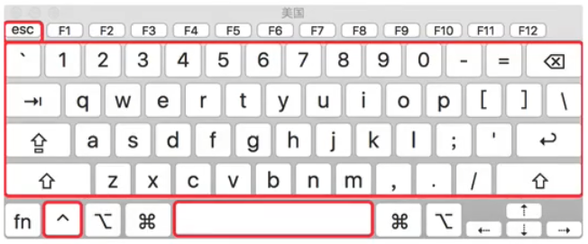
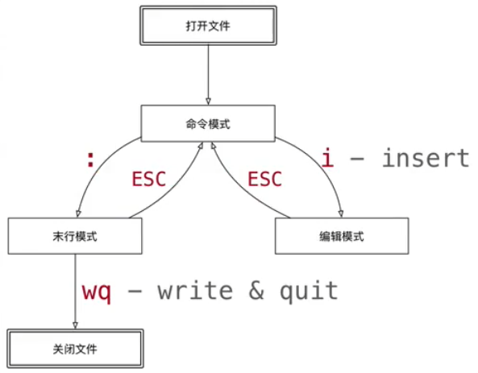

# vi/vim

## 简介

**Vim** 是 **Vi IMproved** 的缩写，意为“改进版的 Vi”。它是基于经典文本编辑器 Vi 的增强版本，由 Bram Moolenaar 于 1991 年首次发布。Vim 提供了更强大的功能和更丰富的扩展性，成为许多程序员和系统管理员的首选编辑器。

Vim 的设计目标是提高文本编辑效率，支持多种模式（如普通模式、插入模式、命令模式等），并提供强大的脚本功能、插件支持和自定义能力。

> 程序员的手指始终保持在键盘的核心区域，就能完成所有的编辑操作



**vim特点：**

+ 不支持鼠标操作
+ 没有菜单
+ 只有命令

vim安装

## 基本使用

众多 Linux 发行版系统，通常都已经默认安装好了 vi 文本编辑器，Ubuntu也不例外，该系统就默认安装有 vi 文本编辑器，但建议大家使用 Vim。

1. 输入命令进行安装。

```shell
sudo apt install vim
```

2. 安装完毕后可以使用`vim`打开文件。

```sh
vim main.c
vim main.c +3   #打开main.c并定位到第三行
```

### 三种模式

#### 命令、编辑、末行模式

使用 Vim 编辑文件时，存在 3 种工作模式，分别是命令模式、编辑模式和末行模式，这 3 种工作模式可随意切换，



+ 命令模式：此模式下，可使用方向键（上、下、左、右键）或 k、j、h、i 移动光标的位置，还可以对文件内容进行复制、粘贴、替换、删除等操作。

+ 编辑模式：在编辑模式下，Vim 可以对文件执行写操作，类似于在 Windows 系统的文档中输入内容。

+ 末行模式：末行模式用于对文件中的指定内容执行保存、查找或替换等操作。


#### 保存与退出

> 末行模式下可以执行一些命令、保存、退出等~

| 命令 | 功能描述                                                 |
| ---- | -------------------------------------------------------- |
| :q   | quit：退出（当打开的文件没有修改时有效，修改了不能退出） |
| :q!  | 强制放弃修改并退出                                       |
| ZQ   | 等同于:q!，但无需输入冒号和命令，因此操作更高效。        |
| :wq  | write quit：保存并退出（修改之后，可以保存退出）         |
| ZZ   | 等同于:wq，但无需输入冒号和命令，因此操作更高效。        |
| :x   | 保存修改并退出,相当于:wq（仅在文件修改时保存）           |

### 常用命令

> vim的命令较多，不要期望一下子全部记住，个别命令忘记了，只是会影响笔记速度而已！

### 编辑模式

使用 Vim 编辑文件时，默认处于命令模式。此时按空格、数字键都没有效果！要想编辑必须进入编辑模式！

按i键可以进入插入模式，然后就可以进行编辑了！当编辑完成可以**按ESC键返回命令模式**。

> 如果vim处于编辑模式，则左下角会显示 -- 插入 -- 字样标志

当然，进入编辑模式的方法还有很多，如下表所示，不同命令有不同的效果！

| 命令 | 功能描述                                                     |
| :--- | ------------------------------------------------------------ |
| i    | 在当前光标**前面**插入文本                                   |
| I    | 在光标所在行的**行首**插入文本，行首是该行的第一个非空白字符 |
| o    | 在光标所在行的**下面插入新的一行**。光标停在空行首，等待输入文本 |
| O    | 在光标所在行的**上面插入新的一行**。光标停在空行的行首，等待输入文本 |
| a    | 在当前光标**后面**插入文本                                   |
| A    | 在光标所在行的**行尾**插入文本                               |
| s    | 删除光标后面的一个字符，然后进入插入模式                     |
| S    | 删除光标所在行，然后进入插入模式                             |

### 命令模式

> 在命令模式下可以进行光标移动，复制、粘贴、替换、删除等操作。

#### 光标移动(motion)

除了使用方向键（上、下、左、右键）或 k、j、h、i 移动光标的位置外，还可以使用其他快捷键让光标快速移动！

> k、j、h、i前面可以加数字，表示要让光标移动n个字符

| 命令             | 功能描述                                                     |
| :--------------- | :----------------------------------------------------------- |
| 0                | 将光标移动到当前行的行首，不管前面有没有空白字符，直接移动到第一列的位置 |
| $ (Shift+4)      | 通过Shift+4组合键输入$，将光标移动到行尾                     |
| gg               | 将光标移动到文件第一行                                       |
| G (Shift+g)      | 将光标移动到文件最后一行                                     |
| nG （n+Shift+G） | n是一个表示行号的数字，然后跟着大写G，即将光标移动到n行(光标所在列不变) |
| Ctrl+ i          | 跳转到历史位置的教新记录（前进）                             |
| Ctrl+ o          | 跳转到历史位置的教旧记录（后退）                             |
| H                | 移动光标到**屏幕顶部行**（Head）的第一个非空白字符           |
| M                | 移动光标到**屏幕中间行**（Middle）的第一个非空白字符         |
| L                | 移动光标到**屏幕底部行**（Last）的第一个非空白字符           |

##### 段落移动

> vim中使用空行来区分段落

| 命令          | 功能描述                   |
| ------------- | -------------------------- |
| { （Shift+[） | 上一段（光标会定位在空行） |
| } （Shift+]） | 下一段                     |

##### 句子移动

> Vim 中对 "句子" 的定义通常是：
>
> + 以 `.`、`?`、`!` 等标点符号结尾，且后面跟有空格或换行的文本片段
> + 空行也会被视为句子的分隔符

| 命令          | 功能描述                   |
| ------------- | -------------------------- |
| (（Shift+9）  | 移动到句子开头             |
| )（Shift+0）  | 移动到句子结尾             |

##### 括号切换

> 在程序世界中，`()`、`{}`、`{}`使用频率很高，而且都是承兑出现的。

| 命令         | 功能描述       |
| ------------ | -------------- |
| %（Shift+5） | 括号匹配和切换 |

##### 标记切换

| 命令   | 功能描述                                                     |
| ------ | ------------------------------------------------------------ |
| m\<x>  | m是mark的意思，x是一个标记，可以是a-z或A-Z之间的任意一个字母 |
| '\<x>  | 单引号加标记字母，即可跳转到标记处(跳转之后，可以按一个单引号跳转到之前的位置) |
| :marks | 末行模式命令:marks能查看所有标记                             |

**1. 标记的作用域差异**：

- 小写字母标记（如 `a`-`z`）：仅在当前文件内有效，切换文件后会失效，`:marks` 中只会显示当前文件的小写标记。
- 大写字母标记（如 `A`-`Z`）：是**全局跨文件标记**，会关联到创建时的文件路径，即使切换到其他文件，`:marks` 仍会显示这些标记及其对应的文件。

**2. Vim 的持久化存储**：

+ 所有标记（包括跨文件标记）会被 Vim 保存在配置目录的 `viminfo` 文件中（如 `~/.viminfo`），下次启动 Vim 时会自动加载，因此即使重启 Vim，之前创建的跨文件标记依然可见。

**3. 特殊标记的跨文件性**：

+ 部分特殊标记（如 `0`-`9`）会记录最近访问过的文件位置，因此也可能显示其他文件的信息。

如果只想查看当前文件的标记，可以在 `:marks` 后加过滤条件：

```sh
:marks a-z  " 只显示当前文件的小写字母标记
```

如果要清除其他文件的标记，可针对性删除：

```sh
:delmarks A  " 删除跨文件标记 A
:delmarks!   " 清除所有标记（包括其他文件的）貌似不生效~QAQ！！！
```


#### 快速翻页

| 命令     | 功能描述                 |
| -------- | ------------------------ |
| ctrl + u | 向上翻半页 u->up         |
| Ctrl + d | 向下翻半页 d->down       |
| ctrl + f | 向上翻一页    f->forward |
| ctrl + b | 向上翻一页   b->backward |

#### 删除命令

| 命令        | 功能描述                                                     |
| ----------- | ------------------------------------------------------------ |
| x           | 删除光标后面的一个字符(即光标覆盖的字符)                     |
| X (Shift+x) | 删除光标前面的一个字符                                       |
| dd          | 删除光标所在行(会将删除的文本复制到粘贴板，本质是剪切)       |
| dw          | w是跳转到下一个单词开头，dw就是从光标处删除到下一个单词开头(包含单词后面所有空白字符) |
| de          | e是跳转到当前单词结尾，de就是从光标处删除到单词结尾(不包含任何空白字符) |
| d$          | $是跳转到行尾，d\$就是从光标处删除到行尾                     |
| d0          | 0是跳转到首，d\0就是从光标处删除到行首                       |
| dgg/dG      | 从当前行删除到第一行或最后一行                               |

> 所有命令前面都可以加数字

#### 撤销和反撤销命令

当你删除之后后悔了怎么办？撤销和反撤销就派上用场了！

| 命令     | 功能描述                 |
| -------- | ------------------------ |
| u        | 撤销一步操作             |
| Ctrl + r | 反撤销，取消上一次的撤销 |

#### 复制和粘贴命令

| 命令        | 功能描述                         |
| ----------- | -------------------------------- |
| yy          | 复制光标所在行                   |
| p           | 在当前行下方粘贴复制或剪切的内容 |
| P (Shift+p) | 在当前行下方粘贴复制或剪切的内容 |

> 所有命令前面都可以加数字

#### 查找

| 命令                | 功能描述                                                     |
| ------------------- | ------------------------------------------------------------ |
| /                   | /xxx，搜索xxx，按n向下搜索，按N向上搜索                      |
| ?                   | ?xxx，搜索xxx，按n向上搜索，按N向下搜索                      |
| #                   | 将光标移动到待搜索的文本上按#号进行搜索，按n向上搜索，按N向下搜索 |
| K (Shift+k)         | 将光标移动到待搜索的文本上按大写K，可以搜索man文档           |
| :noh \| :nohlsearch | 取消搜索高亮                                                 |

#### 替换

| 命令 | 功能描述                               |
| ---- | -------------------------------------- |
| r    | 替换光标后面的一个字符                 |
| R    | 从光标后面的一个字符开始逐字符进行替换 |

#### 可视模式

**可视模式（Visual Mode）** 允许你通过光标选择文本块，然后对选中内容执行操作（如删除、复制、替换等）。

可视模式有三种：

+ 字符可视：使用`v`命令进入字符可视模式，进入后可以移动光标进行逐个字符选择；
+ 行可视：使用`V`命令进入行可视模式，进入后可以上下移动光标选择多行
+ 块可视：使用`Ctrl+v`命令进入块可视模式，进入后可以自由选择某块内容

当在可视模式下选中文本后，可以使用`y`命令来复制，或者`p`命令进行粘贴(剪切旧内容并粘贴复制的文本)。

如果在可视模式复制文本后，回到正常命令模式后，使用`p`命令会将文本粘贴在光标之后，使用`P`会将文本粘贴在光标之前。

**批量插入一列**

进入块可视模式后，通过移动光标选择一列，然后按`I(Shift+i)`命令进行插入，最后按两次ESC键

#### 文本对象

在Vim中，**文本对象**是一个强大的概念，用于高效地操作特定范围的文本。文本对象分为两类：**非块文本对象**和**块文本对象**，它们可以结合操作符（如*d*删除、*y*复制、*c*修改等）使用，从而提升编辑效率。

##### word跳转

> + 全部由字母、数字、下划线组成的一串字符构成一个word(如：foo、i18n、hello_world)
> + 全部由字母、数字、下划线以外的非空字符构成的一串字符也构成一个word
>   + ./,;:属于一个word
>   + maye.name属于三个word
>   + 一串中文属于一个word
>
> 记不住没关系，用多了自然就熟悉了~

| 命令 | 功能描述                     |
| ---- | ---------------------------- |
| w    | 将光标移动到下一个单词开头   |
| e    | 将光标移动到当前单词的结尾   |
| b    | 将光标移动到上一个单词的开头 |

> w、e、b前面可以加数字，表示要让贯标移动n个单词

##### WORD跳转

> 注意这是大写的WORD，和小写的有什么区别呢?
>
> 假设我们有这样一段代码：maye.age + 123，光标位于m字符处，如何把光标移动到1字符的位置？
>
> 我们可以使用4w命令，让光标跳过(maye . age +)这四个word，但是这样需要跳过的单词个数，比较麻烦，如果可以把maye.age看做一个word，计数就会简单很多
>
> 这种把一串非空字符组成的字符串叫做WORD。

WORD跳转命令和word类似，把所有命令变为大写即可！

| 命令        | 功能描述                     |
| ----------- | ---------------------------- |
| W (Shift+w) | 将光标移动到下一个单词开头   |
| E (Shift+e) | 将光标移动到当前单词的结尾   |
| B (Shift+b) | 将光标移动到上一个单词的开头 |

> W、E、B前面可以加数字，表示要让贯标移动n个单词


##### 其他

如果一个光标位于单词中间，如何删除这个单词？

一个单词、一对括号内、衣柜引号内、一对标签内...这些都可以被称为**text object**。

在vim中，我们可以使用\<verb>\<prep>\<text object>来对整个text object操作：

+ verb 动词：y / d
+ perp 介词：i / a （i只对text object 内部进行操作，a会把外面的引号、括号等包括进来）

| 命令 | 功能描述                                     | 示例                              |
| ---- | -------------------------------------------- | --------------------------------- |
| yw   | 复制从光标到单词末尾的所有字符，包含后续空格 | 文本 `he|llo world` → 复制 `llo ` |
| yiw  | 复制整个单词，不包含后续空格                 | 文本 `he|llo world` → 复制 `llo`  |
| yaw  | 复制整个单词，包含后续空格                   | 文本 `he|llo world` → 复制 `llo ` |
| dw   | 删除从光标到单词末尾的所有字符，包含后续空格 |                                   |
| diw  | 删除整个单词，不包含后续空格                 |                                   |
| daw  | 删除整个单词，包含后续空格                   |                                   |

删除括号内的内容，di<各种括号、引号>。

删除括号内的内容，包含括号，da<各种括号、引号>。

删除html标签的内容，dit

删除html标签和内容，包含括号，dat

> y命令也可以和d命令一样搭配介词使用！

#### 缩排和重复执行

| 命令           | 功能描述     |
| -------------- | ------------ |
| >>（Shift+..） | 向右增加缩进 |
| <<（Shift+,,） | 向左减少缩进 |
| .              | 重复上次命令 |

+ 缩排命令在开发程序时，统一增加代码的缩进比较有用！
  + 一次性在选中代码前增加4个空格，就叫做增加缩进
  + 一次性在选中代码前删除4个空格，就叫做减少缩进
+ 在可视模式下，缩排命令只需要使用一个`>`或者`<`

> 在程序中，缩进通常用来表示代码的归属关系
>
> + 前面空格越少，代码的级别越高
> + 前面空格越多，代码的级别越低

### 末行模式

#### 查找与替换

+ 在中查找和替换命令需要在末行模式下执行

+ 记忆命令格式：`:%s///g`

##### 全局替换

+ 一次性替换文件中所有出现的旧文本
+ 命令格式如下:`:%s/旧文本/新文本/g`

##### 可视区域替换

+ 先选要替换的范围
+ 命令格式如下：`:s/旧文本/新文本/g`

##### 确认替换

+ 如果把末尾的改成g在替换的时候，会有提示！**推荐使用**
+ 命令格式如下：`:%s/旧文本/新文本/gc`
  + y-yes 替换
  + n-no 不替换
  + a-all 替换所有
  + q-quit 退出替换
  + l-last 替换最后一个
  + ^E (Ctrl+e)向下滚屏
  + ^Y (Ctrl+y)向上滚屏

#### 执行shell命令

:!\<shell命令>

或者直接输入`:shell`进入shell！然后按exit退出shell

#### 分屏操作

##### **在文件打开之后分屏**

| 命令                           | 功能描述                                    |
| ------------------------------ | ------------------------------------------- |
| :sp                            | 当前文件水平分屏                            |
| :vsp                           | 当前文件垂直分屏                            |
| :sp \<filename>                | 当前文件和指定文件水平分屏                  |
| :vsp \<filename>               | 当前文件和指定文件垂直分屏                  |
| Ctrl+w+\<w\| k \| j \| h \| l> | 在多个窗口切换光标(w按顺序切换，kj上下切换) |
| :n \<filename>                 | 跳转到指定的文件，或新建文件                |
| :ex                            | 回到刚才编辑的文件                          |

| 命令           | 功能描述                                     |
| -------------- | -------------------------------------------- |
| :e.            | 打开内置文件浏览器，浏览当前目录下的文件     |
| :w \<filename> | 另存为，但是任然编辑当前文件，并不会切换文件 |


##### **关闭分屏**

| 命令   | 功能描述                                             |
| ------ | ---------------------------------------------------- |
| :wall  | 保存**所有已修改的缓冲区**（buffer），无论是否可见。 |
| :xall  | 保存**所有已修改的缓冲区**，并退出 Vim。             |
| :qall  | Quit All：关闭所有窗口并退出vim                      |
| :qall! | 强制关闭所有窗口并退出vim                            |
| :only  | 只保留当前窗口，退出其他窗口                         |
| :close | 关闭当前窗口                                         |

**在打开文件之前分屏**

水平分屏: vim -o file1 file2 …  

垂直分屏: vim -O file1 file2…  

### 折叠

[Ch 17 - 折叠 · VIM 操作手册](https://docs.kilvn.com/vim_zh_cn/ch17_fold.html)

[(84 封私信 / 87 条消息) vim中折叠代码 - 知乎](https://zhuanlan.zhihu.com/p/305555574)

## vim配置

### 基础知识

Vim 的全局配置一般在`/etc/vim/vimrc`或者`/etc/vimrc`，对所有用户生效。用户个人的配置在`~/.vimrc`。

如果只对单次编辑启用某个配置项，可以在命令模式下，先输入一个冒号，再输入配置。举例来说，`set number`这个配置可以写在`.vimrc`里面，也可以在命令模式输入。

 ```bash
 :set number
 ```

配置项一般都有"打开"和"关闭"两个设置。"关闭"就是在"打开"前面加上前缀"no"。

 ```bash
 " 打开
 set number
 
 " 关闭
 set nonumber
 ```

上面代码中，双引号开始的行表示注释。

查询某个配置项是打开还是关闭，可以在命令模式下，输入该配置，并在后面加上问号。

 ```bash
 :set number?
 ```

上面的命令会返回`number`或者`nonumber`。

### 基本配置

（1）不与 Vi 兼容（采用 Vim 自己的操作命令）。

```bash
set nocompatible
```


（2）打开语法高亮。自动识别代码，使用多种颜色显示。

```bash
syntax on
```


（3）在底部显示，当前处于命令模式还是插入模式。

```bash
set showmode
```


（4）命令模式下，在底部显示，当前键入的指令。比如，键入的指令是`2y3d`，那么底部就会显示`2y3`，当键入`d`的时候，操作完成，显示消失。

```bash
set showcmd
```


（5）支持使用鼠标。

```bash
set mouse=a
```


（6）使用 utf-8 编码。

```bash
set encoding=utf-8  
```


（7）启用256色。

```bash
set t_Co=256
```


（8）开启文件类型检查，并且载入与该类型对应的缩进规则。比如，如果编辑的是`.py`文件，Vim 就是会找 Python 的缩进规则`~/.vim/indent/python.vim`。

```bash
filetype indent on
```


### 缩进

（9）按下回车键后，下一行的缩进会自动跟上一行的缩进保持一致。

```bash
set autoindent
```


（10）按下 Tab 键时，Vim 显示的空格数。

```bash
set tabstop=2
```


（11）在文本上按下`>>`（增加一级缩进）、`<<`（取消一级缩进）或者`==`（取消全部缩进）时，每一级的字符数。

```bash
set shiftwidth=4
```


（12）由于 Tab 键在不同的编辑器缩进不一致，该设置自动将 Tab 转为空格。

```bash
set expandtab
```


（13）Tab 转为多少个空格。

```bash
set softtabstop=2
```


### 外观

（14）显示行号

```bash
set number
```

（15）显示光标所在的当前行的行号，其他行都为相对于该行的相对行号。

```bash
set relativenumber
```

（16）光标所在的当前行高亮。

```bash
set cursorline
```

（17）设置行宽，即一行显示多少个字符。

```bash
set textwidth=80
```

（18）自动折行，即太长的行分成几行显示。

```bash
set wrap
```

关闭自动折行

```bash
set nowrap
```

（19）只有遇到指定的符号（比如空格、连词号和其他标点符号），才发生折行。也就是说，不会在单词内部折行。

```bash
set linebreak
```

（20）指定折行处与编辑窗口的右边缘之间空出的字符数。

```bash
set wrapmargin=2
```

（21）垂直滚动时，光标距离顶部/底部的位置（单位：行）。

```bash
set scrolloff=5
```

（22）水平滚动时，光标距离行首或行尾的位置（单位：字符）。该配置在不折行时比较有用。

```bash
set sidescrolloff=15
```

（23）是否显示状态栏。0 表示不显示，1 表示只在多窗口时显示，2 表示显示。

```bash
set laststatus=2
```

（24）在状态栏显示光标的当前位置（位于哪一行哪一列）。

```bash
set  ruler
```

### 搜索

（25）光标遇到圆括号、方括号、大括号时，自动高亮对应的另一个圆括号、方括号和大括号。

```bash
set showmatch
```

（26）搜索时，高亮显示匹配结果。

```bash
set hlsearch
```

（27）输入搜索模式时，每输入一个字符，就自动跳到第一个匹配的结果。

```bash
set incsearch
```

（28）搜索时忽略大小写。

```bash
set ignorecase
```

（29）如果同时打开了`ignorecase`，那么对于只有一个大写字母的搜索词，将大小写敏感；其他情况都是大小写不敏感。比如，搜索`Test`时，将不匹配`test`；搜索`test`时，将匹配`Test`。

```bash
set smartcase
```

### 编辑

（30）打开英语单词的拼写检查。

```bash
set spell spelllang=en_us
```

（31）不创建备份文件。默认情况下，文件保存时，会额外创建一个备份文件，它的文件名是在原文件名的末尾，再添加一个波浪号（〜）。

```bash
set nobackup
```

（32）不创建交换文件。交换文件主要用于系统崩溃时恢复文件，文件名的开头是`.`、结尾是`.swp`。

```bash
set noswapfile
```

（33）保留撤销历史。

```bash
set undofile
```

Vim 会在编辑时保存操作历史，用来供用户撤消更改。默认情况下，操作记录只在本次编辑时有效，一旦编辑结束、文件关闭，操作历史就消失了。

打开这个设置，可以在文件关闭后，操作记录保留在一个文件里面，继续存在。这意味着，重新打开一个文件，可以撤销上一次编辑时的操作。撤消文件是跟原文件保存在一起的隐藏文件，文件名以`.un~`开头。

（34）设置备份文件、交换文件、操作历史文件的保存位置。

结尾的`//`表示生成的文件名带有绝对路径，路径中用`%`替换目录分隔符，这样可以防止文件重名。

```bash
set backupdir=~/.vim/.backup//  
set directory=~/.vim/.swp//
set undodir=~/.vim/.undo// 
```

（35）自动切换工作目录。这主要用在一个 Vim 会话之中打开多个文件的情况，默认的工作目录是打开的第一个文件的目录。该配置可以将工作目录自动切换到，正在编辑的文件的目录。

```bash
set autochdir
```

（36）出错时，不要发出响声。

```bash
set noerrorbells
```

（37）出错时，发出视觉提示，通常是屏幕闪烁。

 ```bash
 set visualbell
 ```

（38）Vim 需要记住多少次历史操作。

```bash
set history=1000
```

（39）打开文件监视。如果在编辑过程中文件发生外部改变（比如被别的编辑器编辑了），就会发出提示。

```bash
set autoread
```

（40）如果行尾有多余的空格（包括 Tab 键），该配置将让这些空格显示成可见的小方块。

 ```bash
 set listchars=tab:»■,trail:■
 set list
 ```

（41）命令模式下，底部操作指令按下 Tab 键自动补全。第一次按下 Tab，会显示所有匹配的操作指令的清单；第二次按下 Tab，会依次选择各个指令。

```bash
set wildmenu
set wildmode=longest:list,full
```

### 其他

（1）让光标在插入模式下变成竖线而不是块状。

```shell
if has("autocmd")
  au VimEnter,InsertLeave * silent execute '!echo -ne "\e[2 q"' | redraw!
  au InsertEnter,InsertChange *
    \ if v:insertmode == 'i' | 
    \   silent execute '!echo -ne "\e[6 q"' | redraw! |
    \ elseif v:insertmode == 'r' |
    \   silent execute '!echo -ne "\e[4 q"' | redraw! |
    \ endif
  au VimLeave * silent execute '!echo -ne "\e[ q"' | redraw!
endif
```

## 文件差异对比

[(83 封私信 / 87 条消息) Vim文件差异比较工具vimdiff和vim -d命令详细 - 知乎](https://zhuanlan.zhihu.com/p/86027381)
