## gcc/g++编译器

> sudo apt update
>
> sudo apt install build-essential #安装构建必备

### 编译流程

gcc编译器将c源文件到生成一个可执行程序，中间一共经历了四个步骤：


四个步骤并不是gcc独立完成的，而是在内部调用了其他工具，从而完成了整个工作流程, 其中编译最耗时, 因为要逐行检查语法.


四个步骤，对应的gcc命令为(以test.c为例)

+ `gcc -E test.c -o test.i`
+ `gcc -S test.i -o test.s`
+ `gcc -c test.s -o test.o`
+ `gcc test.o -o test`

当然也可以一步到位(四合一)

+ `gcc test.c -o test`

> vim 末行模式 :%!xxd可以以十六进制方式查看二进制文件

### 常用选项

+ -v,--version 查看gcc版本
+ `-E`                       进行预处理；不要编译、汇编或链接。
+ `-S    `               进行编译，不汇编或链接。
+ <font color='red'>`-c`</font>                       编译和汇编，但不要链接，生成.o文件。
+ <font color='red'>`-I`</font>                        指定头文件路径
+ <font color='red'>`-L`</font>                        指定库文件所在路径
+ <font color='red'>`-l`</font>                        指定库名
+ <font color='red'>`-o <file>`</font>         指定输出文件名
+ <font color='red'>`-g`</font>                        生成的目标包含调试信息，使用gdb调试必须添加-g参数
+ `-O<n>`                  n=0~3 编译优化，n越大优化越多
+ `-Wall`                  提示更多警告
+ `-D`                        编译时定义宏
+ `-std=c++<17>`    g++专用，用来指定c++标准

**举例**

+ `-O`优化等级

  + **-O0** 是默认的优化等级，不进行任何优化。此时，编译器尽量缩短编译时间和空间，适用于调试阶段。

  + **-O1** 进行基本的优化，主要目的是在不显著增加编译时间的情况下，减少代码大小和提高执行速度。启用的优化选项包括 *-fauto-inc-dec*、*-fbranch-count-reg* 等。

  + **-O2** 在 **-O1** 的基础上，进行更多的优化，牺牲部分编译速度以提高代码运行速度。启用的优化选项包括 *-fthread-jumps*、*-falign-functions* 等。

  + **-O3** 在 **-O2** 的基础上，进一步优化，采用更多的向量化算法，提高代码的并行执行程度。启用的优化选项包括 *-finline-functions*、*-funswitch-loops* 等

  ```c
  //test.c
  #include<stdio.h>
  int main()
  {   
      int a = 10;
      int b = 11;
      int c = 33;
      printf("c=%d\n",c);
      return 0;
  }
  //可能会被优化成:
  #include<stdio.h>
  int main()
  {   
      int c = 33;
      printf("c=%d\n",c);
      return 0;
  }
  ```

+ `-Wall`提示更多警告，还是使用上面的代码，加上`-Wall`选项测试一下

  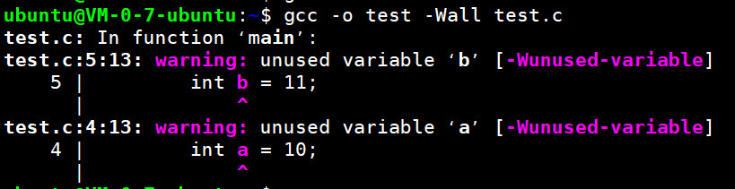

可以看到未使用的变量都已经产生警告了。

+ g++指定标准`-std=c++<>`

  ```cpp
  #include<iostream>
  class Girl
  {
  public:
      inline static int money = 45;
  };
  int main()
  {   
      std::cout<<"money is " << Girl::money <<std::endl;
      return 0;
  }
  ```

  `g++ -o test test.cpp`直接编译也没毛病，如果有问题可以加上选项`g++ -o test test.cpp -std=c++17`

  如果改为c++11，则会发生警告。

  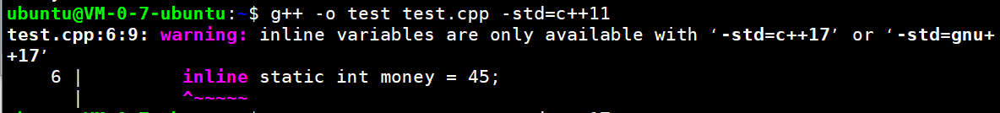


> 编译CPP文件必须使用g++，如果要使用gcc必须加上额外的`-lstdc++`选项。
>
> ```sh
> gcc main.cpp -o out -std=c++20 -lstdc++
> ```

+ `-D`编译时定义宏

  ```C
  #include<stdio.h>
  int main()
  {
      printf("age is %d\n",AGE);
      printf("name is %s\n",NAME);
      return 0;
  }
  ```

  编译：

  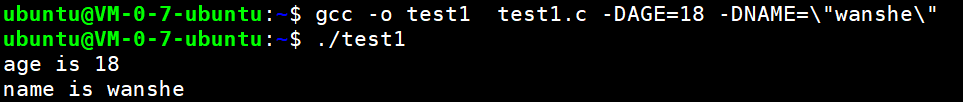

  字符串需要用双引号包裹，而且双引号还要用`\`转义。

+ `-I`头文件目录

  有`add.h`、`add.c`、`main.c`三个文件，它们的组织形式如下：

  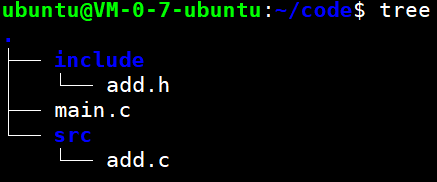

  三个文件的内容如下：

  ```cpp
  //add.h
  #ifndef ADD_H_
  #define ADD_H_
  int add(int a,int b);
  #endif
  
  //add.c
  #include"add.h"
  int add(int a,int b)
  {
  	return a+b;
  }
  
  //main.c
  #include"add.h"
  #include<stdio.h>
  int main()
  {
  	printf("sum is %d\n",add(2,5));
  	return 0;
  }
  ```

  使用gcc编译，输出如下：

  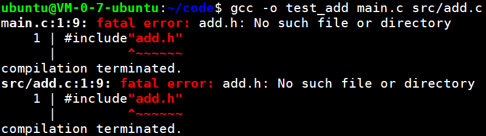

有错误，add.h头文件找不到，为啥呢？因为在add.c、main.c中包含头文件没有指定完整的路径，所以找不到，那么我们就需要在编译时，把头文件所在目录告诉编译器。

```bash
gcc -o test_add main.c src/add.c -I./include
```

ok，没问题了~


## 静态库和动态(共享)库

### 什么是库？

库是二进制文件，是源代码文件的另一种表现形式。

为什么要使用库呢？使用库可以**加密源代码**或者**方便使用**和**发布**。

库制作完毕后，只需要头文件和库文件，别人就可以方便使用了(<font color=gray>库不能单独使用, 只能作为其他执行程序的一部分完成某些功能, 也就是说只能被其他程序调用才能使用</font>)

库有两种：静态库（.a、.lib）和动态库（.so、.dll）。所谓静态、动态是指链接方式。

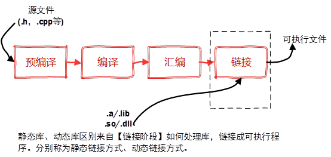

### 静态库

#### 简介

在链接阶段，将汇编生成的目标文件.o与引用的库一起打包到可执行文件中，此种链接方式称为静态链接。按照习惯，一般以`.a`作为文件后缀(windows一般是.lib)。

静态库命名一般分为三个部分：

+ 前缀：`lib`表示是库
+ 库名：由制作者指定名称，如test
+ 后缀：`.a`

所以最终的静态库名应该为：`libtest.a`

#### 制作

就以上面测试的`add.h`、`add.c`为例，代码不需要任何改动。我们来制作一个实现整数加法的库，库就只提供一个`add`函数。

+ 首先，将.c源文件编译成目标.o文件

  ```bash
  #gcc -c add.c -o add.o
  gcc -c src/add.c -o add.o -Iinclude
  ```

+ 然后，通过`ar`工具将准备好的.o文件打包为.a文件

  ```bash
  ar -crv libadd.a add.o
  ```

  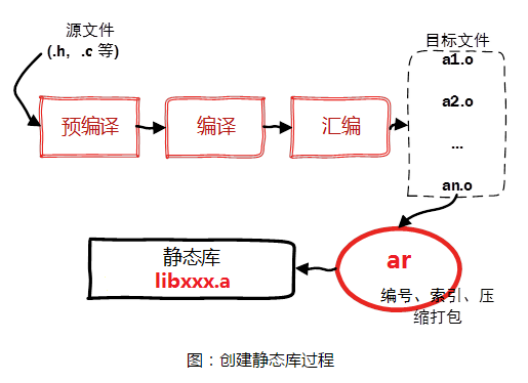

#### 使用

静态库制作完成之后，需要将.a文件和头文件一起发布给用户。

假设测试文件为main.c, 静态库文件为libadd.a, 头文件为add.h

gcc用到的参数：

+ `-L`：指定要连接的库的所在目录

+ `-l`(小写的L)：指定链接时需要的静态库, 去掉前缀和后缀

+ `-I`: 指定main.c文件用到的头文件add.h所在的路径

```bash
gcc -o test_add main.c -L./ -ladd -I./include
```

Ok，成功生成test_add可执行程序，没毛病了~

#### 优劣

##### 优点

+ 函数库最终被打包到应用程序中，实现是函数本地化，寻址方便、速度快。

  （库函数调用效率==自定义函数使用效率）

+  程序在运行时与函数库再无瓜葛，移植方便。

#####  缺点

+ 消耗系统资源较大, 每个进程使用静态库都要复制一份, 无端浪费内存。

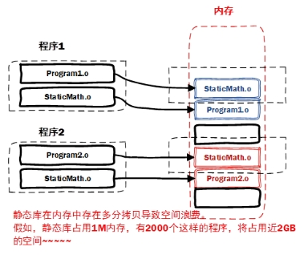 

+ 静态库会给程序的更新、部署和发布带来麻烦。如果静态库libxxx.a更新了，所有使用它的应用程序都需要重新编译、发布给用户（对于玩家来说，可能是一个很小的改动，却导致整个程序重新下载）。

### 动态库

#### 简介

动态库在程序编译时并不会被连接到目标代码中，而是在程序运行是才被载入，不同的应用程序如果调用相同的库，那么在内存里只需要有一份该共享库的实例；规避了空间浪费问题。

动态库在程序运行时才被载入, 也解决了静态库对程序的更新、部署和发布会带来麻烦. 用户只需要更新动态库即可, 增量更新。为什么需要动态库, 其实也是静态库的特点导致的。

按照习惯, 一般以”.so”做为文件后缀名(windows一般是.dll)。

 共享库的命名一般分为三个部分：

+ 前缀：lib

+ 库名称：自己定义即可, 如test

+ 后缀：.so

所以最终的静态库的名字应该为：libtest.so

#### 制作

+ 首先，生成.o文件，注意，需要加上编译选项`-fpic`

  ```bash
  gcc -fpic -c src/add.c -Iinclude
  ```

  > -fpic创建与地址无关的编译程序(pic, position independent code), 目的就是为了能够在多个应用程序间共享.

+ 然后，生成共享库，注意，需要加上编译选项`-shared`

  ```bash
  gcc -shared  add.o -o libadd.so
  ```

  Ok，生成动态库成功了！

#### 使用

引用动态库编译成可执行文件（跟静态库方式一样）：

gcc用到的参数：

+ `-L`：指定要连接的库的所在目录

+ `-l`(小写的L)：指定链接时需要的静态库, 去掉前缀和后缀

+ `-I`: 指定main.c文件用到的头文件add.h所在的路径

```bash
gcc -o test_add_so main.c -L./ -ladd -Iinclude
```

啪叽，竟然报错了！！

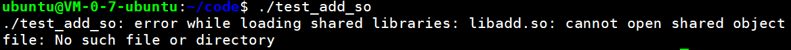

##### 为啥在执行时找不到libadd.so库

不能打开共享库，没有找到这样的文件或目录。啊。。这，为啥没有找到呢？

+ 当系统加载可执行代码时候, 能够知道其所依赖的库的名字, 但是还需要知道所依赖的库的绝对路径。此时就需要系统动态载入器(dynamic linker/loader)。

  > **ldd**命令可以查看可执行文件依赖的库文件, 执行ldd **main**2,**可以发现libtest2.so找不到.**

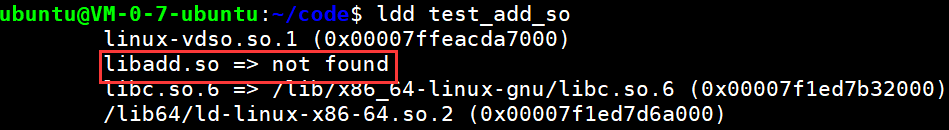

+ **对于elf格式的可执行程序，是由ld-linux.so来完成的**，它先后搜索elf文件的 DT_RPATH段 — 环境变量LD_LIBRARY_PATH — /etc/ld.so.cache文件列表 — /lib, /usr/lib目录找到库文件后将其载入内存。

  使用file命令可以查看文件的类型: file main2

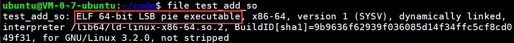


##### 如何让系统找到共享库

+ 拷贝自己制作的共享库到/lib或者/usr/lib
  
  + `sudo cp libadd.so usr/lib`
  
+ 临时设置LD_LIBRARY_PATH:

  + 输入`export LD_LIBRARY_PATH=$LD_LIBRARY_PATH:./ `命令

+ 永久设置, 把`export LD_LIBRARY_PATH=$LD_LIBRARY_PATH:库路径`, 设置到∼/.bashrc文件中。

  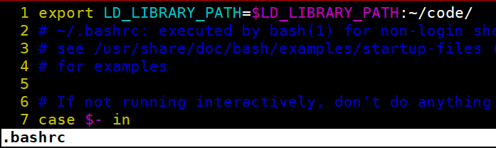

  然后在执行下列三种办法之一:
  + 执行`. ~/.bashrc`使配置文件生效(第一个.后面有一个空格)
  + 执行`source ~/.bashrc`配置文件生效
  + 退出当前终端，然后再次登陆也可以使配置文件生效

+ 永久设置,把export LD_LIBRARY_PATH=$LD_LIBRARY_PATH:库路径，设置到/etc/profile文件中

+ 将其添加到 /etc/ld.so.cache文件中
  + 编辑/etc/ld.so.conf文件, 加入库文件所在目录的路径
  + 运行sudo ldconfig -v, 该命令会重建/etc/ld.so.cache文件

**解决了库的路径问题之后, 再次ldd命令可以查看可执行文件依赖的库文件**

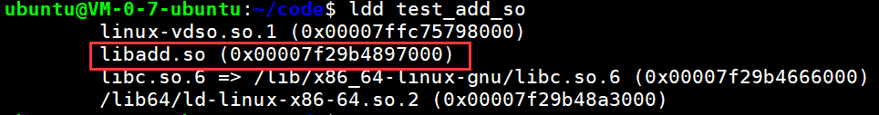

#### 优劣

##### 优点

+ 动态库把对一些库函数的链接载入推迟到程序运行的时期，可以让可执行程序的体积更小。

  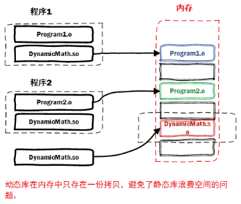

+ 将一些程序升级变得简单，只需要替换共享库即可，可执行程序不需要改变。
+ Ø 甚至可以真正做到链接载入完全由程序员在程序代码中控制（显示调用）

#####  缺点

+ 由于是在程序运行时加载的动态库，加载效率会比静态库低一些

+ 由于动态库和可执行程序是独立，有可能会丢失动态库导致程序不能执行


作业:

1 复习当天内容, 重点是gcc和库的制作和使用

2 编写4个.c文件, 加, 减, 乘, 除

 add.c --加法

 sub.c --减法

 mul.c --乘法

 dive.c --除法

 main.c ---主函数所在文件, 内部调用上述函数

 head.h ---函数声明

 libsmath.a  --静态库文件

 libdmath.so  --动态库文件

 main1---静态库可执行程序

 main2--动态库可执行程序

