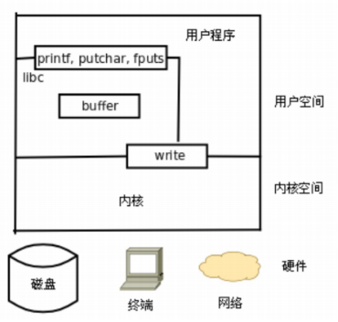
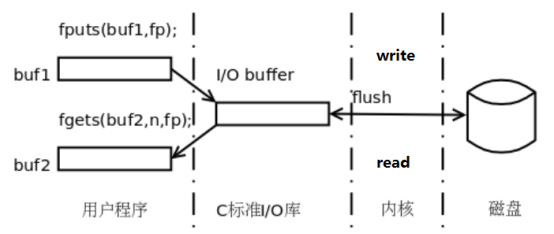

## 文件IO

从本章开始学习各种Linux系统函数，这些函数的用法必须结合Linux内核的工作原理来理解,，因为系统函数正是内核提供给应用程序的接口，而要理解内核的工作原理，必须熟练掌握C语言，因为内核也是用C语言写的，我们在描述内核工作原理时必然要用“指针”、“结构体”、“链表”这些名词来组织语言，就像只有掌握了英语才能看懂英文书一样，只有学好了C语言才能看懂内核工作原理。

### C标准函数与系统函数的区别

#### 系统调用

由操作系统实现并提供给外部应用程序的编程接口。(Application Programming Interface，API)。是应用程序同系统之间数据交互的桥梁。

一个helloworld如何打印到屏幕。



每一个FILE文件流（标准C库函数）都有一个缓冲区buffer，默认大小8192Byte。Linux系统的IO函数默认是没有缓冲区。




### 文件描述符

Linux 中一切皆文件，比如 C++源文件、视频文件、Shell脚本、可执行文件、socket等，就连键盘、显示器、鼠标等硬件设备也都是文件。

一个 Linux 进程可以打开成百上千个文件，为了表示和区分已经打开的文件，Linux 会给每个文件分配一个编号（一个 ID），这个编号就是一个整数，被称为**文件描述符**（File Descriptor）。

这只是一个形象的比喻，为了让大家容易理解我才这么说。如果你也仅仅理解到这个层面，那不过是浅尝辄止而已，并没有看到文件描述符的本质。

接下来让从底层实现的角度来给大家剖析一下文件描述符，看看文件描述如到底是如何表示一个文件的。

> 文件描述符的概念：在Linux中，**文件描述符是内核为了高效的管理已经被打开的文件所创建的索引** ，它是一个非负整数，用于指代被打开的文件，所有执行I/O操作的系统调用都是通过文件描述符完成的。文件描述符是一个简单的非负整数，用来表明每一个被进程打开的文件。

一个 Linux 进程启动后，会在内核空间中创建一个 PCB 控制块，PCB 内部有一个文件描述符表（File descriptor table），记录着当前进程所有可用的文件描述符，也即当前进程所有打开的文件。

> PCB（Process Control Block）中记录了操作系统所需的，用于描述进程的当前情况以及控制进程运行的全部信息

除了文件描述符表，系统还需要维护另外两张表：

- 打开文件表（Open file table）
- i-node 表（i-node table）


文件描述符表每个进程都有一个，打开文件表和 i-node 表整个系统只有一个，它们三者之间的关系如下图所示。


从本质上讲，这三种表都是结构体数组，0、1、2、73、1976 等都是数组下标。表头只是我自己添加的注释，数组本身是没有的。实线箭头表示指针的指向，虚线箭头是我自己添加的注释。

> 一个进程最多打开1024个文件！
>
> 使用ulimit -a命令可以查看进程可使用的系统资源。


**你看，文件描述符只不过是一个数组下标嘛！**

一个进程启动之后，默认打开三个文件描述符：

```c
#define  STDIN_FILENO     		0	//标准输入
#define  STDOUT_FILENO    	    1	//标准输出
#define  STDERR_FILENO    	    2	//标准错误
```

### open/close

#### open

open函数用于打开或创建指定的文件，函数原型如下：

```c
#include<unistd.h>
#include<fcntl.h>
int open(const char *pathname, int flags);
int open(const char *pathname, int flags, mode_t mode);
```

看到有两个名字一样的函数原型，这样的函数原型有些违背了我们的直觉。因为C语言是不支持函数重载的，难道是Linux系统做了支持？

肯定不是，毕竟这还是C语言范畴，open函数实际上是一个可变参函数，他的签名是：

```c
int open(const char *path, int oflag, ... );
```

这样就可以传递不同的参数了，而之所以直接规定了两个原型，就是告诉我们只能有这两种使用方式。

**函数参数：**

+ pathname 要打开或创建的文件名，几个意思相对路径也可以是绝对路径。

+ flags 参数有一系列常数值可供选择，可以同时选择多个常数用按位或运算符连接起来, 所有这些常数的宏定义都以O_开头，表示open。

  + 必选项：以下三个常数中必须指定且只能指定一个

    + O_RDONLY  只读打开
    + O_WRONLY      只写打开
    + O_RDWR      可读可写打开

  + 以下选项可以指定0个或多个，和必选项组合起来作为flags参数。可选项有很多, 这里只介绍几个常用选项：

    + O_APPEND  追加写入

    + O_CREAT      若文件不存在则创建，使用此选项时需要提供第三个参数mode, 表示该文件的访问权限。<font color=red>文件最终权限：mode&~umask(022)</font>

      ```text
      r:4 w:2 x:1
      指定权限(mode)  : 666
      权限掩码(umask) : 022	//man umask可以查看umask文档
      ~ 0    2    2 	//先对掩码每个数取反
      ---------------
       -1   -3   -3
      & 6    6    6	//然后与指定的权限每个数进行按位与运算
      --------------	
        6    4	4	//得到最终的权限
      ```
    
      > 权限掩码的作用是根据用户的需求屏蔽掉不希望给别人的权限，比如普通文件的权限是“-rw-rw-rw-”，所有用户对文件都享有读写权限，而这带来的问题就是文件可以被任何人修改从而导致文件数据被篡改导致数据丢失。这个时候用户可以通过设置文件掩码来屏蔽到本需要赋予其他用户的特定权限。
    
    + O_EXCL  如果同时指定了O_CREAT，并且文件已存在，则出错。
    
    + O_TRUNC  如果文件已存在，则将其长度截断为0。
    
    + O_NONBLOCK 对于设备文件，可以做非阻塞I/O

**返回值：**

+ 成功：返回最小且未被占用的文件描述符
+ 失败：返回-1，并设置errno

打开文件，文件不存在则创建。

```c
#include <stdio.h>
#include <fcntl.h>
#include <unistd.h>
#include <string.h>
#include <sys/stat.h>

void test_1()
{
        //设置权限掩码
        umask(0022);
        //打开文件
        int fd = open("test.log",O_RDWR | O_CREAT,0666);
        if(fd < 0) {
                perror("open error");
                return;
        }

        //写文件
        //ssize_t write(int fd, const void *buf, size_t count);
        const char* str = "hello wrold!\n";
        ssize_t len =  write(fd,str,strlen(str));
        printf("total write %ld bytes!\n",len);

        //移动文件位置指针
        lseek(fd,0,SEEK_SET);


        //读文件 
        //ssize_t read(int fd, void *buf, size_t count);
        char buf[BUFSIZ]={0};
        len = read(fd,buf,BUFSIZ);
        printf("total read %ld bytes!\n",len);
        printf("content is %s\n",buf);

        //关闭文件
        close(fd);
}
```

#### close

close用于关闭打开的文件。

```c
int close(int fd);
```

成功返回0，失败返回-1，并设置errno。

>  需要说明的是，当一个进程终止时，内核对该进程所有尚未关闭的文件描述符调用close关闭，所以即使用户程序不调用close, 在终止时内核也会自动关闭它打开的所有文件。但是对于一个长年累月运行的程序(比如网络服务器)，打开的文件描述符一定要记得关闭, 否则随着打开的文件越来越多，会占用大量文件描述符和系统资源。

### read/write

#### read

read()函数尝试从描述符fd读取count字节的数据到缓冲区buf中。

```c
ssize_t read(int fd, void *buf, size_t count);
```

**返回值：**

+ \> 0：读取到的字节数
+ ==0：文件读取完毕
+ -1：读取失败，并设置errno

#### write

write()函数从缓冲区buf开始写入count字节数据到文件描述符fd引用的文件中。

```c
ssize_t write(int fd, const void *buf, size_t count);
```

**返回值：**

+ 成功：返回写入的字节数
+ 错误：返回-1并设置errno

### lseek

所有打开的文件都有一个当前文件偏移量(current file offset)，以下简称为cfo。cfo通常是一个非负整数，用于表明文件开始处到文件当前位置的字节数. 读写操作通常开始于 cfo，并且使 cfo 增大，增量为读写的字节数。文件被打开时，cfo 会被初始化为 0， 除非使用了 O_APPEND。

lseek()函数用于修改cfo

```c
#include <sys/types.h>
#include <unistd.h>

off_t lseek(int fd, off_t offset, int whence);
```

**参数：**

+ fd：文件描述符
+ offset：相对于起始位置的偏移量，正数负数都可以
+ whence：偏移开始位置
  + SEEK_SET   文件开头
  + SEEK_CUR  文件当前位置
  + SEEK_END   文件结尾

## 目录操作

在 Linux C 编程中，可以使用一系列系统调用和库函数来进行目录操作。

### 创建和删除目录

#### mkdir()

根据指定的权限创建目录。

```c
#include <sys/stat.h>
#include <sys/types.h>

int mkdir(const char *pathname, mode_t mode);
```

- 创建名为 `pathname` 的目录
- `mode` 指定目录权限（通常与 umask 共同决定最终权限）
- 成功返回 0，失败返回 -1

#### rmdir() 

删除目录。

```
#include <unistd.h>

int rmdir(const char *pathname);
```

- 删除名为 `pathname` 的空目录
- 成功返回 0，失败返回 -1

### 当前工作目录

#### getcwd()

此函数用来获取当前工作目录，在程序中创建的文件会存放在当前工作目录中。

```
#include <unistd.h>

char *getcwd(char *buf, size_t size);
```

- 将当前工作目录的绝对路径存入 `buf` 中
- `size` 是缓冲区大小
- 成功返回 `buf`，失败返回 NULL

#### chdir() 

改变工作目录。

```
#include <unistd.h>

int chdir(const char *path);
```

- 将当前工作目录改为 `path`
- 成功返回 0，失败返回 -1

#### 示例

```c
#include <unistd.h>
#include <stdio.h>
#include <sys/stat.h>

int main()
{
        //获取当前工作目录
        char buf[128]={0};
        getcwd(buf,128);
        printf("current work dir is %s\n",buf);

        //改变工作目录
        mkdir("tmp",0664);
        if(0!=chdir("./tmp")) {
             perror("chdir error");
        }


        //也可以不用传递缓冲区，直接传递NULL，会使用内部缓冲区然后返回
        printf("current work dir is %s\n",getcwd(NULL,0));

        return 0;
}
```

### 目录操作

#### opendir() 

 打开目录

```c
#include <sys/types.h>
#include <dirent.h>

DIR *opendir(const char *name);
```

- 打开名为 `name` 的目录
- 成功返回指向目录流的指针，失败返回 NULL

#### readdir() 

读取目录项

```c
#include <dirent.h>

struct dirent *readdir(DIR *dirp);
```

- 读取目录流 `dirp` 中的下一个目录项

- 返回指向 `dirent` 结构的指针，到达目录尾或出错时返回 NULL

- `dirent` 结构至少包含以下成员：

  ```c
  struct dirent {
       ino_t          d_ino;       /* 文件的 inode 编号（索引节点号） */
       off_t          d_off;       /* 应用程序一般不需要关心这个值 */
       unsigned short d_reclen;    /* 当前目录项记录的长度（字节数），不同文件系统的目录项可能有不同的长度 */
       unsigned char  d_type;      /* 文件类型 */
       char           d_name[256]; /* 文件名 */
   };
  ```

  + d_type （定义在 `<dirent.h>`）
    + DT_BLK      // 块设备
    + DT_CHR      // 字符设备
    + DT_DIR      // 目录
    + DT_FIFO     // 命名管道(FIFO)
    + DT_LNK      // 符号链接
    + DT_REG      // 普通文件
    + DT_SOCK     // Unix域套接字
    + DT_UNKNOWN  // 未知类型

#### closedir() 

关闭目录

```c
#include <sys/types.h>
#include <dirent.h>

int closedir(DIR *dirp);
```

- 关闭目录流 `dirp`
- 成功返回 0，失败返回 -1

#### 示例

```c
#include <sys/types.h>
#include <dirent.h>
#include <stdio.h>

const char* typeString(int type) {
        switch(type)
        {
                case DT_DIR: return "目录";
                case DT_FIFO: return "命名管道";
                case DT_REG: return "普通文件";
                case DT_UNKNOWN: return "未知文件";
        }

}

void test_1()
{
        //打开目录
        DIR* dir = opendir(".");
        if(dir == NULL) {
                perror("opendir error");
                return;
        }

        //读取目录项
        struct dirent* ent =  readdir(dir);
        //if(ent) {
        //      printf("%ld %ld %hu %d %s\n",ent->d_ino,ent->d_off,ent->d_reclen,ent->d_type,ent->d_name);
        //}

        //遍历目录
        while(ent) {
                printf("%ld %ld %hu %s %s\n",ent->d_ino,ent->d_off,ent->d_reclen,typeString(ent->d_type),ent->d_name);
                ent = readdir(dir);
        }


        //关闭目录
        closedir(dir);
}

int main()
{
        test_1();
        return 0;
}
```

### 高级目录操作

### scandir()

扫描目录

c

```
#include <dirent.h>

int scandir(const char *dirp, 
            struct dirent ***namelist,
            int (*filter)(const struct dirent *),
            int (*compar)(const struct dirent **, const struct dirent **));
```

- 扫描目录 `dirp`，返回匹配 `filter` 的目录项数组 `namelist`
- `compar` 用于排序
- 成功返回匹配的目录项数量，失败返回 -1

### ftw()

文件树遍历

```
#include <ftw.h>

int ftw(const char *dirpath,
        int (*fn) (const char *fpath, const struct stat *sb, int typeflag),
        int nopenfd);
```

- 递归遍历目录树 `dirpath`
- 对每个文件调用回调函数 `fn`
  - *fpath指向当时所在的目录路径*
  - *第二个参数是*sb, 为stat结构指针
  - 第三个参数为flag，有下面几种可能值
    - FTW_F 一般文件
    - FTW_D 目录
    - FTW_DNR 不可读取的目录，此目录以下将不被遍历
    - FTW_SL 符号连接
    - FTW_NS 无法取得stat结构数据，有可能是权限问题
- `nopenfd` 指定同时打开的文件描述符数量

### 示例

#### scandir

```c
#include <stdio.h>
#include <dirent.h>
#include <malloc.h>

int main()
{
        struct dirent **entry_list  = NULL;
        int count = 0;

        //扫描目录
        count = scandir(".",&entry_list,0,alphasort);
        if(count < 0) {
                perror("scandir error");
                return -1;
        }

        //遍历目录
        for(int i = 0;i < count; i++) {
                struct dirent* entry =  entry_list[i];
                printf("%s\n",entry->d_name);
                free(entry);
        }

        free(entry_list);

        return 0;
}
```

#### ftw

```c
#include <stdio.h>
#include <dirent.h>
#include <malloc.h>
#include <ftw.h>

int fn(const char* fpath,const struct stat* sb,int typeflag)
{
        printf("path:%s size:%d\n",fpath,sb->st_size);
        return 0;
}

int main()
{

        if(ftw("aa",fn,100)<0) {
                perror("ftw error");
        }


        return 0;
}
```

## 文件描述符操作

在 Linux C 编程中，`dup`、`dup2` 和 `fcntl` 是用于操作文件描述符的重要系统调用

### dup

复制文件描述符。

```c
int dup(int oldfd);
```

**功能**：

- 复制一个已有的文件描述符，返回新的文件描述符（系统自动分配最小的可用描述符）
- 新旧描述符指向同一个文件表项

### dup2

复制文件描述符。

```c
 int dup2(int oldfd, int newfd);
```

**功能**：

- 明确指定新描述符的值，如果 `newfd` 已打开，会先关闭它(使 `newfd` 成为 `oldfd` 的副本)
- 成功，将oldfd复制给newfd，两个文件秒速付指向同一个文件；失败返回-1，并设置errno值。

### fcntl

改变已经打开的文件的属性。

```c
int fcntl(int fd, int op, ... /* arg */ );
```

**参数：**

+ op是选项，可以是如下值之一：
  + F_DUPFD：复制文件描述符，与dup相同
  + F_GETFL：获取文件描述符的flag属性值
  + F_SETFL：设置文件描述符的flag属性值

**返回值：**

+ 成功：

  + 若op为F_DUPFD，返回一个新的文件描述符

  + 若op为F_GETFL，返回文件描述符的flags值

  + 若op为F_SETFL，返回0

+ 失败：返回-1，并设置errno值。

#### 主要命令（cmd）

1. **F_DUPFD** - 复制文件描述符

   ```c
   int newfd = fcntl(oldfd, F_DUPFD, minfd);
   ```

   - 类似于 `dup`，但可以指定最小可用的描述符

2. **F_GETFL/F_SETFL** - 获取/设置文件状态标志

   ```c
   int flags = fcntl(fd, F_GETFL);
   fcntl(fd, F_SETFL, flags | O_APPEND);
   ```

   常用属性标志：

   + O_APPEND：追加
   + O_NONBLOCK：非阻塞

3. **文件锁操作**

   ```c
   struct flock fl;
   // 设置fl结构体
   fcntl(fd, F_SETLK, &fl);  // 非阻塞
   fcntl(fd, F_SETLKW, &fl); // 阻塞
   ```

#### 示例：设置非阻塞I/O

```c
int flags = fcntl(sockfd, F_GETFL, 0);
fcntl(sockfd, F_SETFL, flags | O_NONBLOCK);
```

### 示例

#### dup

```c
//测试dup函数复制文件描述符
#include <stdio.h>
#include <stdlib.h>
#include <string.h>
#include <sys/types.h>
#include <unistd.h>
#include <sys/types.h>
#include <sys/stat.h>
#include <fcntl.h>

int main(int argc, char *argv[])
{
	//打开文件
	int fd = open(argv[1], O_RDWR);
	if(fd<0)
	{
		perror("open error");
		return -1;
	}

	//调用dup函数复制fd
	int newfd = dup(fd);
	printf("newfd:[%d], fd:[%d]\n", newfd, fd);

	//使用fd对文件进行写操作
	write(fd, "hello world", strlen("hello world"));

	//调用lseek函数移动文件指针到开始处
	lseek(fd, 0, SEEK_SET);

	//使用newfd读文件
	char buf[64];
	memset(buf, 0x00, sizeof(buf));
	int n = read(newfd, buf, sizeof(buf));
	printf("read over: n==[%d], buf==[%s]\n", n, buf);

	//关闭文件
	close(fd);
	close(newfd);

	return 0;
}
```


