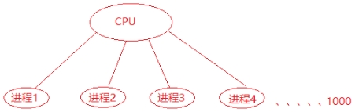
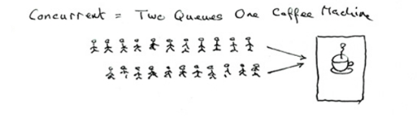
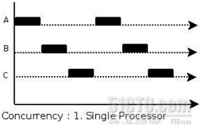
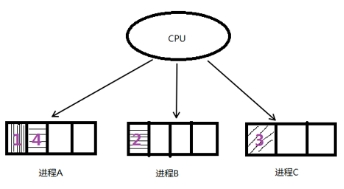
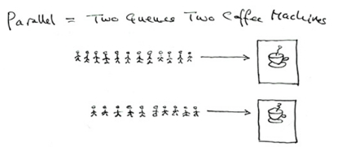
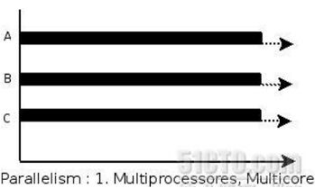
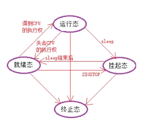
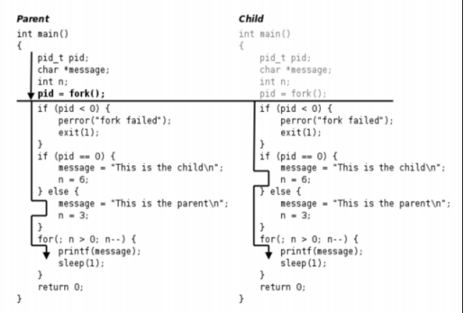
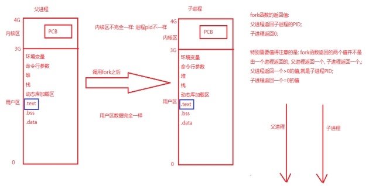
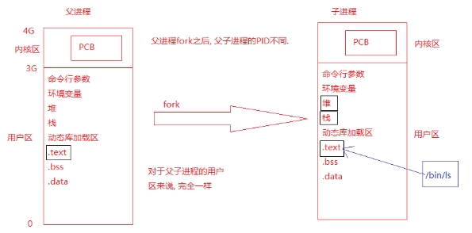

# 进程管理

## 相关概念

### 程序和进程

+ 程序，是指编译好的二进制文件，在磁盘上，占用磁盘空间, 是一个静态的概念.
+ 进程，一个启动的程序， 进程占用的是系统资源，如：物理内存，CPU，终端等，是一个动态的概念
+ 程序 → 剧本(纸)  
+ 进程 → 戏(舞台、演员、灯光、道具...)

同一个剧本可以在多个舞台同时上演。同样，同一个程序也可以加载为不同的进程(彼此之间互不影响)

### 并行和并发

+ 并发，在一个时间段内, 是在同一个cpu上, 同时运行多个程序。

如：若将CPU的1S的时间分成1000个时间片，每个进程执行完一个时间片必须无条件让出CPU的使用权，这样1S中就可以执行1000个进程。

 


 

 

 

+ 并行性指两个或两个以上的程序在同一时刻发生(需要有多颗)。

 

 

### PCB-进程控制块

每个进程在内核中都有一个进程控制块（PCB）来维护进程相关的信息，Linux内核的进程控制块是task_struct结构体。

/usr/src/linux-headers-4.4.0-96/include/linux/sched.h文件的1390行处可以查看struct task_struct 结构体定义。其内部成员有很多，我们重点掌握以下部分即可：

+ 进程id。系统中每个进程有唯一的id，在C语言中用pid_t类型表示，其实就是一个非负整数。
+ 进程的状态，有就绪、运行、挂起、停止等状态。
+ 进程切换时需要保存和恢复的一些CPU寄存器。
+ 描述虚拟地址空间的信息。
+ 描述控制终端的信息。
+ 当前工作目录（Current Working Directory）。
  + getcwd --pwd

+ umask掩码。

+ 文件描述符表，包含很多指向file结构体的指针。

+ 和信号相关的信息。
+ 用户id和组id。
+ 会话（Session）和进程组。
+ 进程可以使用的资源上限（Resource Limit）。
  + ulimit -a

### 进程状态(面试考)

+ 进程基本的状态有5种。分别为**初始态，就绪态，运行态，挂起态与终止态**。其中初始态为进程准备阶段，常与就绪态结合来看。

 

## 进程相关命令

在Linux系统中，进程管理是非常重要的任务。通过有效地管理进程，可以控制系统资源的分配和优化系统性能。以下是一些常用的Linux进程管理命令：

### 查看进程

#### ps

ps (Process Status) 命令是 Linux 中用于查看当前进程状态的常用工具，它可以显示系统中正在运行的进程信息。

+ 不带任何选项时，`ps` 只显示当前用户在当前终端下运行的进程。

+ `ps -e`：显示所有进程

+ `ps -f`：完整格式显示；`ps -ef`完整格式显示所有进程

+ `ps aux | grep "xxx"`

+ `ps ajx | grep "xxx"`

  + -a：（all）当前系统所有用户的进程

  + -u：查看进程所有者及其他一些信息

  + -x：显示没有控制终端的进程 -- 不能与用户进行交互的进程【输入、输出】

  + -j: 列出与作业控制相关的信息

  

**以下是常见参数的含义解析**

**USER**: 进程的属主，即运行该进程的用户。

**PID**: 进程的唯一标识符（进程 ID）。

**%CPU**: 进程占用的 CPU 百分比。

**%MEM**: 进程占用的物理内存百分比。

**VSZ**: 虚拟内存大小（以 KB 为单位），包括进程使用的库、代码和数据。

**RSS**: 常驻内存大小（以 KB 为单位），表示进程实际使用的物理内存，不包括交换分区。

**TTY**: 进程运行的终端。如果与终端无关，则显示为 *?*。

**STAT**: 进程状态，常见状态包括：

- **R**: 正在运行或可运行的进程。
- **S**: 休眠状态。
- **D**: 不可中断的睡眠状态（通常是 I/O 进程）。
- **T**: 停止或被追踪。
- **Z**: 僵尸进程。

**START**: 进程启动的时间。

**TIME**: 进程累计使用的 CPU 时间。

**COMMAND**: 启动进程的命令及其参数。


### 管理进程

#### kill

+ kill -l 查看系统有哪些信号

+ kill -9 pid 杀死某个线程

#### getpid/getppid

+ getpid - 得到当前进程的PID

​	pid_t getpid(void);

+ getppid - 得到当前进程的父进程的PID

​	pid_t getppid(void);

## 创建进程

fork子进程之后，操作系统会复制一个与父进程完全相同的子进程，虽说是父子关系，但是在操作系统看来，他们更像兄弟关系，这2个进程共享代码空间，但是数据空间是互相独立的，子进程数据空间中的内容是父进程的完整拷贝，指令指针也完全相同，子进程拥有父进程当前运行到的位置（两进程的程序计数器pc值相同，也就是说，子进程是从fork返回处开始执行的），但有一点不同，如果fork成功，子进程中fork的返回值是0，父进程中fork的返回值是子进程的进程号，如果fork不成功，父进程会返回错误。

可以这样想象，2个进程一直同时运行，而且步调一致，在fork之后，他们分别作不同的工作，也就是分岔了。这也是fork为什么叫fork的原因。

### fork函数

+ 函数作用：创建子进程
+ 原型: pid_t fork(void);
  + 函数参数：无
  + 返回值：调用成功:父进程返回子进程的PID，子进程返回0；
  + 调用失败:返回-1，设置errno值。
+ fork函数代码片段实例

 

l 调用fork函数的内核实现原理:

 

● fork函数总结

​	► fork函数的返回值？

 		父进程返回子进程的PID，是一个大于0数;

 		子进程返回0；

​		特别需要注意的是：不是fork函数在一个进程中返回2个值，而是在父子进程各自返回一个值。

​	►子进程创建成功后，代码的执行位置？

  		父进程执行到什么位置，子进程就从哪里执行

​	►如何区分父子进程

 		通过fork函数的返回值

​	►父子进程的执行顺序

​	 不一定，哪个进程先抢到CPU，哪个进程就先执行

#### 示例

+ fork函数测试

```cpp
#include <stdio.h>
#include <stdlib.h>
#include <string.h>
#include <sys/types.h>
#include <unistd.h>

int main()
{
	printf("before fork, pid:[%d]\n", getpid());
	//创建子进程
	//pid_t fork(void);
	pid_t pid = fork();
	if(pid<0) //fork失败的情况
	{
		perror("fork error");
		return -1;
	}
	else if(pid>0)//父进程
	{
		printf("father: [%d], pid==[%d], fpid==[%d]\n", pid, getpid(),getppid());
		//sleep(1);
	}
	else if(pid==0) //子进程
	{
		printf("child: pid==[%d], fpid==[%d]\n", getpid(), getppid());
	}
	
	printf("after fork, pid:[%d]\n", getpid());

	return 0;
}
```


### 练习题

+ 编写程序，循环创建多个子进程，要求如下：

1. 多个子进程是兄弟关系。
2. 判断子进程是第几个子进程

​	画图讲解创建多个子进程遇到的问题

​	注意：若让多个子进程都是兄弟进程，必须不能让子进程再去创建新的子进程。

+ 编写程序，测试父子进程是否能够共享全局变量

​	重点通过这个案例讲解读时共享，写时复制

#### 示例

+ 循环创建字进程

```c
#include <stdio.h>
#include <stdlib.h>
#include <string.h>
#include <sys/types.h>
#include <unistd.h>

int main()
{
	int i = 0;
	for(i=0; i<3; i++)
	{
		//创建子进程
		pid_t pid = fork();
		if(pid<0) //fork失败的情况
		{
			perror("fork error");
			return -1;
		}
		else if(pid>0)//父进程
		{
			printf("father: pid==[%d], fpid==[%d]\n", getpid(),getppid());
			//sleep(1);
		}
		else if(pid==0) //子进程
		{
			printf("child: pid==[%d], fpid==[%d]\n", getpid(), getppid());
			break;
		}
	}

	//第1个子进程
	if(i==0)
	{
		printf("[%d]--[%d]: child\n", i, getpid());	
	}

	//第2个子进程
	if(i==1)
	{
		printf("[%d]--[%d]: child\n", i, getpid());	
	}
	//第3个子进程
	if(i==2)
	{
		printf("[%d]--[%d]: child\n", i, getpid());	
	}
	//父进程
	if(i==3)
	{
		printf("[%d]--[%d]: child\n", i, getpid());	
	}
	sleep(10);

	return 0;
}
```


## exec函数族

### 函数作用和函数介绍 

有的时候需要在一个进程里面执行其他的命令或者是用户自定义的应用程序，此时就用到了exec函数族当中的函数。

使用方法一般都是在父进程里面调用fork创建处子进程，然后在子进程里面调用exec函数。

#### execl函数

函数原型: int execl(const char *path, const char *arg, ... /* (char  *) NULL */);

参数介绍：

+ path: 要执行的程序的绝对路径

+ 变参arg: 要执行的程序的需要的参数

+ arg:占位，通常写应用程序的名字

+ arg后面的: 命令的参数

+ 参数写完之后: NULL

返回值：若是成功，则不返回，不会再执行exec函数后面的代码；若是失败，会执行execl后面的代码，可以用perror打印错误原因。

execl函数一般执行自己写的程序。

 

#### execlp函数

函数原型: int execlp(const char *file, const char *arg, .../* (char  *) NULL */);

参数介绍：

+ file: 执行命令的名字, 根据PATH环境变量来搜索该命令

+ arg:占位

+ arg后面的: 命令的参数

+ 参数写完之后: NULL

返回值：若是成功，则不返回，不会再执行exec函数后面的代码；若是失败，会执行exec后面的代码，可以用perror打印错误原因。

execlp函数一般是执行系统自带的程序或者是命令.

### exec函数族原理介绍  

exec族函数的实现原理图：

 如：execlp(“ls”, “ls”, “-l”, NULL);

 

总结：

exec函数是用一个新程序替换了当前进程的代码段、数据段、堆和栈；原有的进程空间没有发生变化，并没有创建新的进程，进程PID没有发生变化。

### exec函数练习 

+ 使用execl函数执行一个用户自定义的应用程序

+ 使用execlp函数执行一个linux系统命令 

注意：当execl和execlp函数执行成功后，不返回，并且不会执行execl后面的代码逻辑，原因是调用execl函数成功以后，exec函数指定的代码段已经将原有的代码段替换了。

```c
//fork函数测试
#include <stdio.h>
#include <stdlib.h>
#include <string.h>
#include <sys/types.h>
#include <unistd.h>

int main()
{
	//创建子进程
	pid_t pid = fork();
	if(pid<0) //fork失败的情况
	{
		perror("fork error");
		return -1;
	}
	else if(pid>0)//父进程
	{
		printf("father: [%d], pid==[%d], fpid==[%d]\n", pid, getpid(),getppid());
		//sleep(1);
	}
	else if(pid==0) //子进程
	{
		printf("child: pid==[%d], fpid==[%d]\n", getpid(), getppid());
		//execl("/bin/ls", "ls", "-l", NULL);
		//execl("./test", "test", "hello", "world", "ni", "hao", NULL);
		//execlp("ls", "ls", "-l", NULL);
		execlp("./test", "TESTING", "hello", "world", "ni", "hao", NULL);
		//execlp("./iitest", "test", "hello", "world", "ni", "hao", NULL);
		perror("execl error");
	}
	
	return 0;
}
```

## 进程回收

### 为什么要进行进程资源的回收

  当一个进程退出之后，进程能够回收自己的用户区的资源，但是不能回收内核空间的PCB资源，必须由它的父进程调用wait或者waitpid函数完成对子进程的回收，避免造成系统资源的浪费。

### 孤儿进程

+ 孤儿进程的概念：若子进程的父进程已经死掉，而子进程还存活着，这个进程就成了孤儿进程。

+ 为了保证每个进程都有一个父进程，孤儿进程会被init进程领养，init进程成为了孤儿进程的养父进程，当孤儿进程退出之后，由init进程完成对孤儿进程的回收。

+ 模拟孤儿进程的案例：编写模拟孤儿进程的代码讲解孤儿进程，验证孤儿进程的父进程是否由原来的父进程变成了init进程。

```c
//孤儿进程
#include <stdio.h>
#include <stdlib.h>
#include <string.h>
#include <sys/types.h>
#include <unistd.h>

int main()
{
	//创建子进程
	pid_t pid = fork();
	if(pid<0) //fork失败的情况
	{
		perror("fork error");
		return -1;
	}
	else if(pid>0)//父进程
	{
		sleep(5);
		printf("father: [%d], pid==[%d], fpid==[%d]\n", pid, getpid(),getppid());
	}
	else if(pid==0) //子进程
	{
		
		printf("child: pid==[%d], fpid==[%d]\n", getpid(), getppid());
		sleep(20);
		printf("child: pid==[%d], fpid==[%d]\n", getpid(), getppid());
	}
	

	return 0;
}
```


### 僵尸进程

+ 僵尸进程的概念：若子进程死了，父进程还活着， 但是父进程没有调用wait或waitpid函数完成对子进程的回收，则该子进程就成了僵尸进程。

+ 如何解决僵尸进程

  +  由于僵尸进程是一个已经死亡的进程，所以不能使用kill命令将其杀死

  + 通过杀死其父进程的方法可以消除僵尸进程。

杀死其父进程后，这个僵尸进程会被init进程领养，由init进程完成对僵尸进程的回收。

+ 模拟僵尸进程的案例

>  编写模拟僵尸进程的代码讲解僵尸进程, 验证若子进程先于父进程退出, 而父进程没有调用wait或者waitpid函数进行回收, 从而使子进程成为了僵尸进程.

```c
//僵尸进程
#include <stdio.h>
#include <stdlib.h>
#include <string.h>
#include <sys/types.h>
#include <unistd.h>

int main()
{
	//创建子进程
	pid_t pid = fork();
	if(pid<0) //fork失败的情况
	{
		perror("fork error");
		return -1;
	}
	else if(pid>0)//父进程
	{
		sleep(100);
		printf("father: [%d], pid==[%d], fpid==[%d]\n", pid, getpid(),getppid());
	}
	else if(pid==0) //子进程
	{
		
		printf("child: pid==[%d], fpid==[%d]\n", getpid(), getppid());
	}
	

	return 0;
}
```


### 进程回收函数

+ wait函数

  + 函数原型：pid_t wait(int *status);

  + 函数作用：

    + 阻塞并等待子进程退出 

    + 回收子进程残留资源 

    + 获取子进程结束状态(退出原因)。

  +  返回值：

    + 成功：清理掉的子进程ID；

    + 失败：-1 (没有子进程)

  +  status参数：子进程的退出状态 -- 传出参数

    + WIFEXITED(status)：为非0    → 进程正常结束
    + WEXITSTATUS(status)：获取进程退出状态 

    +  WIFSIGNALED(status)：为非0 → 进程异常终止

    + WTERMSIG(status)：取得进程终止的信号编号。

+  wait函数练习

```c
//父进程调用wait函数完成对子进程的回收
#include <stdio.h>
#include <stdlib.h>
#include <string.h>
#include <sys/types.h>
#include <unistd.h>
#include <sys/wait.h>

int main()
{
	//创建子进程
	pid_t pid = fork();
	if(pid<0) //fork失败的情况
	{
		perror("fork error");
		return -1;
	}
	else if(pid>0)//父进程
	{
		printf("father: [%d], pid==[%d], fpid==[%d]\n", pid, getpid(),getppid());
		int status;
		pid_t wpid = wait(&status);
		printf("wpid==[%d]\n", wpid);
		if(WIFEXITED(status)) //正常退出
		{
			printf("child normal exit, status==[%d]\n", WEXITSTATUS(status));
		}
		else if(WIFSIGNALED(status)) //被信号杀死
		{
			printf("child killed by signal, signo==[%d]\n", WTERMSIG(status));
		}
		
	}
	else if(pid==0) //子进程
	{
		
		printf("child: pid==[%d], fpid==[%d]\n", getpid(), getppid());
		sleep(20);
		return 9;
	}

	return 0;
}
```


使用wait函数完成父进程对子进程的回收

+  waitpid函数

  + 函数原型：pid_t waitpid(pid_t pid, int *status, in options);

  + 函数作用：同wait函数

  + 函数参数：

    + pid：

      + pid = -1 等待任一子进程。与wait等效。

      + pid > 0 等待其进程ID与pid相等的子进程。

      + pid = 0 等待进程组ID与目前进程相同的任何子进程，也就是说任何和调用waitpid()函数的进程在同一个进程组的进程。

      + pid < -1 等待其组ID等于pid的绝对值的任一子进程。(适用于子进程在其他组的情况)

    + status: 子进程的退出状态，用法同wait函数。

    + options：设置为WNOHANG，函数非阻塞，设置为0，函数阻塞。

  + 函数返回值

    + \>0：返回回收掉的子进程ID；

    + -1：无子进程

    + =0：参3为WNOHANG，且子进程正在运行。

+ waitpid函数练习

​	使用waitpid函数完成对子进程的回收

## 作业

### 作业1

测试父子进程之间是否共享文件

#### 作业2

父进程fork三个子进程: 

其中一个调用ps命令;

一个调用自定义应用程序;

一个调用会出现段错误的程序。

父进程回收三个子进程(waitpid)，并且打印三个子进程的退出状态。