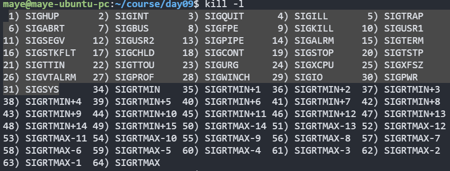
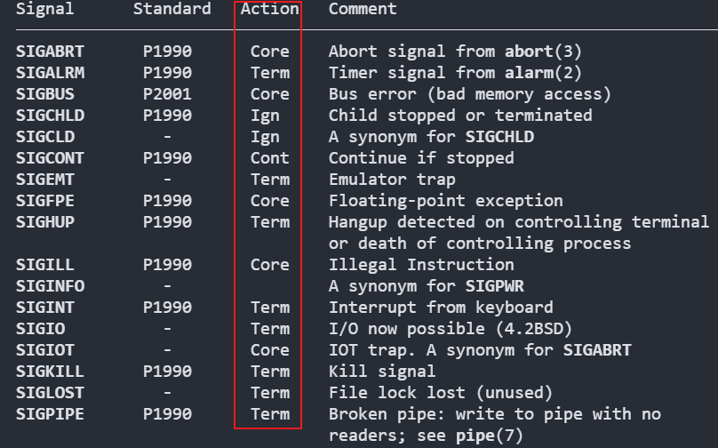
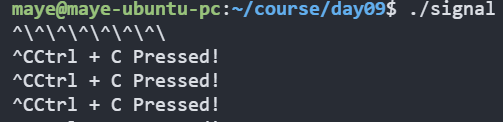
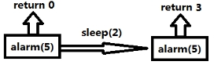
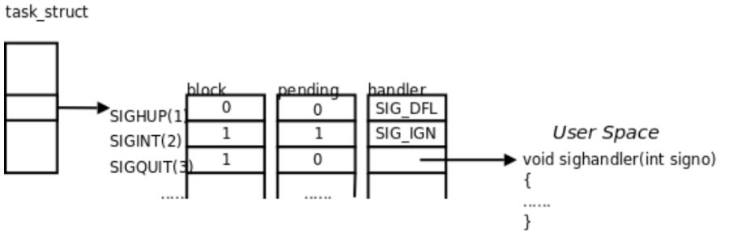
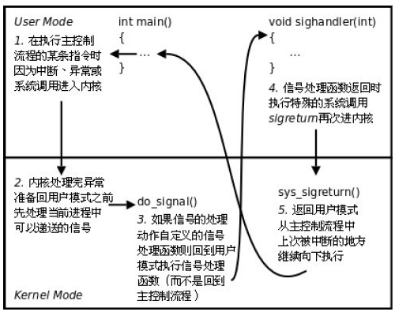

# 信号

## 基本概念

Linux 信号(又称为软中断)是进程间通信的一种基本机制，用于通知进程发生了某种事件。信号是异步的，可以由内核、其他进程或进程自身发送。

进程收到信号后，不管执行到程序的什么位置，都要暂停运行，去处理信号，处理完毕后再继续执行。

> 每个进程收到的所有信号，都是由内核负责发送的。

信号的实现手段导致信号有很强的延时性，但对于用户来说，时间非常短，不易察觉。

Linux内核的进程控制块PCB是一个结构体，task_struct, 除了包含进程id，状态，工作目录，用户id，组id，文件描述符表，还包含了信号相关的信息，主要指**阻塞信号集和未决信号集**。

注：表示PCB的task_struct结构体定义在：`/usr/src/linux-headers-4.4.0-97/include/linux/sched.h:1390`

### 常用信号

 使用`kill -l`命令就可以看到所有的信号 ，我们把前三十一个称为**普通信号**（也称为不可靠信号），都是大写的宏，前面的数字就是宏对应的值。



常用信号以及信号描述表：

| 信号            | 描述                                                         |
| --------------- | ------------------------------------------------------------ |
| SIGINT          | 程序终止(interrupt)信号, 在用户键入INTR字符(通常是Ctrl+C)时发出，用于通知**前台**进程组终止进程。 |
| SIGQUIT         | 和SIGINT类似, 但由QUIT字符(通常是Ctrl+\\)来控制. 进程在因收到SIGQUIT退出时会**产生core文件**, 在这个意义上类似于一个程序错误信号。 |
| SIGKILL         | 用来立即结束程序的运行. 本信号**不能被阻塞、处理和忽略**。如果管理员发现某个进程终止不了，可尝试发送这个信号，终极大招。 |
| SIGSEGV         | 试图访问**未分配**给自己的内存, 或试图往没有写**权限**的内存地址写数据. |
| SIGUSR1/SIGUSR2 | 留给用户使用                                                 |
| SIGPIPE         | 管道破裂。这个信号通常在进程间通信产生，比如采用FIFO(管道)通信的两个进程，**读管道没打开**或者**意外终止**就往管道写，写进程会收到SIGPIPE信号。此外用Socket通信的两个进程，写进程在写Socket的时候，读进程已经终止。 |
| SIGALRM         | 时钟定时信号, 计算的是实际的时间或时钟时间. alarm函数使用该信号. |
| SIGTERM         | 程序结束(terminate)信号, 与SIGKILL不同的是该信号**可以被阻塞和处理**。通常用来要求程序自己正常退出，shell命令kill缺省产生这个信号。如果进程终止不了，我们才会尝试SIGKILL。 |
| SIGCHLD         | 子进程（child）结束时, 父进程会收到这个信号。如果父进程没有处理这个信号，也没有等待(wait)子进程，子进程虽然终止，但是还会在内核进程表中占有表项，这 时的子进程称为僵尸进程。这种情 况我们应该避免(父进程或者忽略SIGCHILD信号，或者捕捉它，或者wait它派生的子进程，或者父进程先终止，这时子进程的终止自动由init进程 来接管)。 |
| SIGSTOP         | **暂停**(stopped)进程的执行. 注意它和terminate以及interrupt的区别:该进程还未结束, **只是暂停执行. 本信号不能被阻塞, 处理或忽略**. |
| SIGCONT         | 让一个停止(stopped)的进程继续执行. 本信号**不能被阻塞**. 可以用一个[handler](https://so.csdn.net/so/search?q=handler&spm=1001.2101.3001.7020)来让程序在由stopped状态变为继续执行时完成特定的工作. 例如, 重新显示提示符 |

### 信号三种阶段

#### 生成(阶段一)

信号的产生主要有下面几种方式：

1. **内核**（如 `SIGSEGV` 段错误、`SIGPIPE` 管道破裂）

2. **其他进程**（如 `kill` 命令发送 `SIGTERM`）

3. **终端输入**（如`Ctrl+C`产生SIGINT信号、`Ctrl+\`产生SIGQUIT信号）

4. **进程自身**（通过系统调用`kill`或`raise`函数发送信号）

此时，信号被 **标记** 在进程的 **待处理信号集（pending signals）** 中，但尚未被处理。

#### 传递(阶段二)

信号从 **待处理状态** 真正发送到目标进程，但可能被 **阻塞（Blocked）**：

- 如果信号未被阻塞（`sigprocmask` 未屏蔽），则立即传递。
- 如果信号被阻塞（如 `SIG_BLOCK`），则保持 **pending** 状态，直到解除阻塞。

**特殊情况**：

- `SIGKILL`（9）和 `SIGSTOP`（19）**不能被阻塞**，会立即传递并执行默认动作。
- 多个相同信号可能被合并（如连续多个 `SIGINT` 可能只触发一次）。

#### 处理(阶段三)

##### 信号处理方式

当进程接收到信号时，可以采取以下处理方式：

+ **忽略信号**：进程可以选择忽略某些信号，即不对该信号进行任何处理。
+ **捕捉信号（自定义处理）**：进程可以注册一个信号处理函数来捕捉特定的信号，并在接收到该信号时执行相应的处理逻辑。
+ **默认处理**：如果进程没有注册信号处理函数且没有选择忽略信号，则系统会按照默认的处理方式来处理该信号。通常情况下，默认处理方式会导致进程**终止或停止**。

##### 默认处理动作

使用`man 7 signal`查看信号文档，往下翻就可以看到一张表，包含了我们的大多数信号所对应的默认动作，大多数都是终止。



Action(默认处理动作)分类：

+ Core（core dump）终止并生成核心转储文件
+ Term（Terminate）终止进程
+ Ign（ignore）忽略信号
+ Cont（continue）如果程序已经暂停，则继续运行
+ Stop 暂停进程的执行

##### 注意事项

+ `SIGKILL` (9) 和 `SIGSTOP` (19) 不能被捕获、阻塞或忽略。
+ Core 动作需要系统允许生成 core 文件（`ulimit -c` 设置）
+ 某些信号在不同体系结构可能有不同编号（但名称相同），也就是说不要使用数字，要使用名称！

## 信号产生

### kill函数

kill函数或命令用户给指定进程发送指定信号，函数原型如下：

```c
int kill(pid_t pid, int sig); 
//kill -SIGKILL 进程PID			//命令用法
```

+ 函数返回值：

  + 成功：0；

  + 失败：-1，设置errno

+ 函数参数：

  + sig信号参数：不推荐直接使用数字，应使用宏名，因为不同操作系统信号编号可能不同，但名称一致。

  + pid参数：

    + pid > 0: 发送信号给指定的进程。

    + pid = 0: 发送信号给与调用kill函数进程属于同一进程组的所有进程。

    + pid < -1:  取|pid|发给对应进程组。

    + pid = -1：发送给进程有权限发送的系统中所有进程。

进程组：每个进程都属于一个进程组，进程组是一个或多个进程集合，他们相互关联，共同完成一个实体任务，每个进程组都有一个进程组长，默认进程组ID与进程组长ID相同。

**模拟实现kill命令：**

```c
#include <signal.h>
#include <stdio.h>
#include <stdlib.h>

int main(int argc,char*argv[]){
        if(argc !=3)    {
                printf("Usage:hdy_kill isgnum pid\n");
                return -1;
        }

        pid_t pid = atoi(argv[1]);
        int signum = atoi(argv[2]);

        if(kill(pid,signum) == -1) {
                perror("kill error");
        }

        return 0;
}
```

使用自定义命令：`./hdy_kill 4355 9 `

也可以在程序中使用`getpid`获取当前进程的pid，然后给自己发送信号！

### raise函数

如果是给当前进程发送信号，没有必要使用kill，可以使用更加方便的`raise`函数。函数原型如下：

```c
int raise(int sig);
```

+  返回值：成功：0，失败-1

> raise(signo) 相当于 kill(getpid(), signo)

### abort函数

给自己发送异常终止信号 **6) SIGABRT**，并产生core文件。函数原型如下：

```c
void abort(void);  
```

> abort() == kill(getpid(), **SIGABRT**) == raise(**SIGABRT**)

## 信号处理

### signal函数

signal函数用于设置信号处理程序，`signal` 函数允许程序定义当某些信号（如 `SIGINT`，由按下 Ctrl+C 产生）到达时要执行的处理程序，通过这种方式，程序可以对信号进行自定义处理，或者忽略某些信号。

函数原型如下：

```c
typedef void (*sighandler_t)(int);
sighandler_t signal(int signum, sighandler_t handler);
```

+ 参数：
  + signum：要注册处理程序的信号
  + handler：信号处理程序(一个函数指针)，有两个内置的信号处理函数，如下：
    + SIG_IGN：忽略信号
    + SIG_DFL：恢复默认动作
+ 返回值：
  + 成功，返回信号的上一个处理程序。
  + 失败，返回SIG_ERR(信号编号无效会失败)

> `signal()` 的行为在不同 Linux系统中可能不同。推荐使用更现代的 `sigaction()` 替代。

**处理SIGINT信号，忽略SIGQUIT信号**

```c
#include <signal.h>
#include <stdio.h>
#include <stdbool.h>
#include <unistd.h>

void handler(int signum)
{
        if(signum == SIGINT) {
                printf("Ctrl + C Pressed!\n");
        }
        else if(signum == SIGSTOP) {
                printf("Ctrl + Z Pressed!\n");
        }
}
int main()
{
        signal(SIGINT,handler);
        signal(SIGQUIT,SIG_IGN);
    	//此信号不能被处理、忽略、阻塞（也就是说设置无效）
        signal(SIGSTOP,handler);

        while(true){
                sleep(1);
        };

        return 0;
}
```

按下`Ctrl+\`没有任何反应，按下`Ctrl+C`会打印日志。



### alarm函数

alarm函数用于设置闹钟。在指定seconds后，内核会给当前进程发送**14）SIGALRM**信号。进程收到该信号，**默认动作终止**。**每个进程都有且只有唯一的一个闹钟！**

+ 函数原型如下：

```c
unsigned int alarm(unsigned int seconds); 
```

+  **返回值：**返回0或剩余的秒数，无失败。例如：

 

+ **常用操作：**取消定时器alarm(0)，返回旧闹钟余下秒数。

alarm使用的是自然定时法，与进程状态无关，就绪、运行、挂起(阻塞、暂停)、终止、僵尸...无论进程处于何种状态，alarm都计时。

**编写一个程序测试alarm函数**

```c
#include <unistd.h>
#include <signal.h>
#include <stdio.h>

void handler(int signum)
{
        printf("time out\n");
}

int main()
{
        signal(SIGALRM,handler);

        //设置闹钟
        int ret = alarm(5);
        printf("remaining seconds %d\n",ret);

        //重新设置闹钟
        sleep(2);
        ret = alarm(2);
        printf("remaining seconds %d\n",ret);

        //取消闹钟
        ret = alarm(0);
        printf("remaining seconds %d\n",ret);

        sleep(10);
        return 0;
}
```

**编写程序，测试你的电脑1秒种能数多个数字。**

```c
#include <unistd.h>
#include <signal.h>
#include <stdio.h>

int main()
{
    //不需要设置处理程序，因为定时器信号，默认就是终止程序！
     alarm(1);
    //开始计数
     int counter = 0;
     while(1) {
             printf("%d\n",counter++);
     }
     return 0;
}
```

+ 使用time命令查看程序执行的时间。程序运行的瓶颈在于IO，优化程序，首选优化IO。

```sh
time ./alarm_counter
```

输出如下：

```css
354252	//大概数了这么多

real    0m1.002s
user    0m0.144s
sys     0m0.478s
```

time命令的输出包含了几个关键的时间指标：

- **real**：从命令开始到结束的总时间，包括CPU执行时间、进程阻塞时间以及其他进程的执行时间。
- **user**：进程在用户态执行所消耗的CPU时间。
- **sys**：进程在内核态执行所消耗的CPU时间。

>  通常，*real*时间等于*user*加上*sys*时间，但在多核CPU系统中，由于并行处理，*real*时间可能会小于*user*和*sys*时间之和。
>
> 如果*user*和*sys*时间远小于*real*时间，可能表明程序有大量的I/O等待

上面的测试，I/O消耗时间为`1.002-(0.144 + 0.478) = 0.38` ,I/O消耗的时间比较长，如何优化一下呢?

将结果重定向到文件中。

```sh
time ./alarm_counter > test.log
```

输出如下：

```css
real    0m1.002s
user    0m0.426s
sys     0m0.573s
```

本次测试，I/O消耗时间为`1.002-(0.426 + 0.573) = 0.003` ,I/O消耗的时间一下子就降下来了，为什么呢?

使用`wc -l test.log`或者`tail 1 test.log`命令，查看一下数了多少数！结果为`16873094`。数的数也比没有重定向到文件中多多了！(400多倍，说明I/O是非常消耗时间的)！

而使用了重定向，文件操作是带缓冲区的，printf输出是先写入到缓冲区，然后缓冲区满了才一次写入到文件中，减少了I/O次数，效率自然就上来了！

### setitimer函数

setitiemr设置定时器，可代替alarm函数，精度微秒us，可以实现周期定时。 函数原型如下：

```c
int setitimer(int which, const struct itimerval* new_value,struct itimerval* old_value);
```

+ **返回值**
  + 成功：0；
  + 失败：-1，设置errno值

+ **参数：** + 
  +  which：指定定时方式
     +  自然定时：ITIMER_REAL → **14）SIGALRM**计算自然时间

     +  虚拟空间计时(用户空间)：ITIMER_VIRTUAL → **26）SIGVTALRM** 只计算进程占用cpu的时间

     +  运行时计时(用户+内核)：ITIMER_PROF → **27）SIGPROF**计算占用cpu及执行系统调用的时间

  +  new_value：struct itimerval, 负责设定timeout时间。

  +  old_value： 存放旧的timeout值，一般指定为NULL


```c
struct itimerval { 
  struct timerval it_interval; 	//闹钟触发周期（设定以后每几秒执行function）
  struct timerval it_value; 	//闹钟触发时间（设定第一次执行function所延迟的秒数 ）
 }; 

struct timeval { 
  long tv_sec;    	//秒
  long tv_usec;    	//微秒
}       
```

**使用setitimer实现每隔一秒打印一次hello, world。**

```c
#include <unistd.h>
#include <signal.h>
#include <stdio.h>
#include <sys/time.h>

void handler(int signum)
{
        printf("hello world\n");
}

int main()
{
        signal(SIGALRM,handler);

        //定时器参数
        struct itimerval value;
        //周期性执行间隔
        value.it_interval.tv_sec = 1;
        value.it_interval.tv_usec = 0;
        //第一次执行时间
        value.it_value.tv_sec = 3;
        value.it_value.tv_usec = 0;

        //设置定时器
        if(setitimer(ITIMER_REAL,&value,NULL)==-1) {
                perror("setitimer error");
                return -1;
        }

        while(1)
                sleep(1);
        return 0;
}
```

## 信号传递

信号在产生之后，会在进程的内核区(PCB)处保存，等待进程进行处理！



### 信号未决和阻塞

**在这个阶段有以下几种情况:**

+ **信号未决：**信号产生后，在未被处理之前，处于未决状态。这意味着信号已经被发送，但目标进程尚未对其作出响应。操作系统会检查目标进程的Pending表，确定哪些信号处于未决状态。（每个进程都有一个Pending位图，用于记录哪些信号处于未决状态。这个位图由64个比特位组成，分别代表64个不同的信号，如果对应的比特位为1，表示该信号已经产生但尚未处理。）
+ **信号阻塞：**如果目标进程阻塞了某些信号，那么这些信号会保持在未决状态，直到进程解除对这些信号的阻塞。（与Pending位图类似，Block位图用于记录哪些信号被进程阻塞。当信号被阻塞时，对应的比特位会被设置为1。）
+ **handler表：**是一个函数指针数组，每个下标都是一个信号的执行方式（有31个普通信号，信号的编号就是数组的下标，可以采用信号编号，索引信号处理方法！）**如signal函数在进行信号捕捉的时候，其第二个参数就是，提供给handler的**

  如果进程选择阻塞某个信号，操作系统会在block表中设置对应信号的比特位为1。此时，即使信号已经产生（pending表中对应比特位为1），进程也不会立即处理该信号。

被阻塞的信号将保持在pending表中，直到进程解除对该信号的阻塞（即block表中对应比特位被重置为0）。

> 注意,阻塞和忽略是不同的,只要信号被阻塞就不会递达,而忽略是在递达之后可选的一种处理动作。

### 信号阻塞和未决的区别

**信号阻塞（Blocking）**：是一个开关动作，指的是阻止信号被处理，但不是阻止信号产生。它使得系统暂时保留信号留待以后发送。阻塞只是暂时的，通常用于防止信号打断敏感的操作。

**信号未决（Pending）**：是一种状态，指的是从信号的产生到信号被处理前的这一段时间。信号产生后，如果未被处理且没有被阻塞，则处于未决状态，等待被处理。

### 信号集

#### 介绍

由于信号集属于内核的一块区域，用户不能直接操作内核空间，为此，内核提供了一些信号集相关的接口函数，使用这些函数用户就可以完成对信号集的相关操作。

信号集是一个能表示多个信号的数据类型，sigset_t set，set即一个信号集。既然是一个集合，就需要对集进行添加、删除等操作。

sigset_t类型的定义在signal.h文件中的第49行处:

```c
typedef __sigset_t sigset_t;
```

__sigset_t的定义在sigset.h文件中的26，27行处: 

```c
#define _SIGSET_NWORDS (1024 / (8 * sizeof (unsigned long int)))

 typedef struct
 {
  unsigned long int __val[_SIGSET_NWORDS];
 } __sigset_t;
```

上述变量类型的定义的查找有个小窍门： 可以执行gcc的预处理命令：

`gcc -E test.c -o test.i `这样头文件就会展开，可以直接到test.i文件中看到相关变量类型的定义。

#### 函数

+ int sigemptyset(sigset_t *set);

  + 函数说明：将某个信号集清0   

  + 函数返回值：成功：0；失败：-1，设置errno

+ int sigfillset(sigset_t *set);

  + 函数说明：将某个信号集置1     

  + 函数返回值：成功：0；失败：-1，设置errno

+ int sigaddset(sigset_t *set, int signum); 

  + 函数说明：将某个信号加入信号集合中

  + 函数返回值：成功：0；失败：-1，设置errno

+ int sigdelset(sigset_t *set, int signum);  

  + 函数说明：将某信号从信号清出信号集   

  + 函数返回值：成功：0；失败：-1，设置errno

+ int sigismember(const sigset_t *set, int signum);

  + 函数说明：判断某个信号是否在信号集中

  + 函数返回值：在：1；不在：0；出错：-1，设置errno

+ sigprocmask函数

  + 函数说明：用来屏蔽信号、解除屏蔽也使用该函数。其本质，读取或修改进程控制块中的信号屏蔽字（阻塞信号集）。

  + 特别注意，屏蔽信号只是将信号处理延后执行(延至解除屏蔽)；而忽略表示将信号丢弃处理。

  + 函数原型：int sigprocmask(int how, const sigset_t *set, sigset_t *oldset);

  + 函数返回值：成功：0；失败：-1，设置errno

  + 函数参数：

    + how参数取值：假设当前的信号屏蔽字为mask

      + SIG_BLOCK: 当how设置为此值，set表示需要屏蔽的信号。**相当于** mask = mask|set

      + SIG_UNBLOCK: 当how设置为此，set表示需要解除屏蔽的信号。相当于 mask = mask & ~set

      +  SIG_SETMASK: 当how设置为此，set表示用于替代原始屏蔽及的新屏蔽集。相当于mask = set若，调用sigprocmask解除了对当前若干个信号的阻塞，则在sigprocmask返回前，至少将其中一个信号递达。

    + set：传入参数，是一个自定义信号集合。由参数how来指示如何修改当前信号屏蔽字。

    + oldset：传出参数，保存旧的信号屏蔽字。

+ sigpending函数

  + 函数原型：int sigpending(sigset_t *set);   

  + 函数说明：读取当前进程的未决信号集

  + 函数参数：set传出参数
  + 函数返回值：成功：0；失败：-1，设置errno

#### 练习

编写程序，设置阻塞信号集并把所有常规信号的未决状态打印至屏幕。

```c
#include <signal.h>
#include <stdio.h>
#include <unistd.h>

//信号集基本操作
void test_1(){
        sigset_t sigset;
        //清空信号集(全部置为0)
        sigemptyset(&sigset);
        //将SIGINT添加到信号集中
        sigaddset(&sigset,SIGINT);
        //判断信号是否在信号集中
        if(sigismember(&sigset,SIGINT)) {
                printf("SIGINT in set!\n");
        }

        //从信号集中删除信号
        sigdelset(&sigset,SIGINT);
        if(sigismember(&sigset,SIGINT)) {
                printf("SIGINT in set!\n");
        }
        else{
                printf("SIGINT not in set!\n");
        }
}

//信号阻塞测试
void test(){
        sigset_t sigset;
        //清空信号集(全部置为0)
        sigemptyset(&sigset);
        //将SIGINT、SIGQUIT添加到信号集中
        sigaddset(&sigset,SIGINT);
        sigaddset(&sigset,SIGQUIT);
        //设置阻塞信号集
        sigprocmask(SIG_BLOCK,&sigset,NULL);

        sigset_t pend;
        int counter =0;

        while(1) {
                //获取未决信号集
                sigemptyset(&pend);
                sigpending(&pend);

                //打印每个信号是否阻塞
                for(int i =1;i < 32;i++){
                        if(sigismember(&pend,i)){
                                printf("1");
                        }
                        else{
                                printf("0");
                        }
                }
                printf("\n");
                fflush(stdout);

                //每循环十次解除对SIGINT的阻塞
                if(counter ++%10 == 0) {
                        sigprocmask(SIG_UNBLOCK,&sigset,NULL);
                }
                else{
                        sigprocmask(SIG_BLOCK,&sigset,NULL);
                }

                sleep(1);
        }
}

void handler(int signum)
{
        printf("signum is[%d]\n",signum);
}

int main()
{
        signal(SIGINT,handler);
        signal(SIGQUIT,handler);

        test();
        return 0;
}
```

## 信号捕捉函数

### signal

[signal函数](#signal函数)使用，前面已经介绍过了

### sigaction

+ sigaction函数，用于注册一个信号处理函数，函数原型如下：

```c
int sigaction(int signum, const struct sigaction *act, struct sigaction *oldact);
```

+  函数参数：

  + signum：捕捉的信号

  + act：  传入参数，新的处理方式。

  + oldact： 传出参数，旧的处理方式

sigaction结构体定义如下：

 ```c
 struct sigaction {
     void  (*sa_handler)(int); 	// 信号处理函数
     void  (*sa_sigaction)(int, siginfo_t *, void *); //信号处理函数，一般传NULL
     sigset_t  sa_mask; 			//信号处理函数执行期间需要阻塞的信号
     int    sa_flags; 			//通常为0，表示使用默认标识
     void   (*sa_restorer)(void);//废弃成员，传NULL
 };
 ```

+  结构体成员解释：

  +  sa_handler：指定信号捕捉后的处理函数名(即注册函数)。也可赋值为SIG_IGN表忽略 或 SIG_DFL表执行默认动作

  + sa_mask: 用来指定在信号处理函数执行期间需要被屏蔽的信号，特别是当某个信号被处理时，它自身会被自动放入进程的信号掩码，因此在信号处理函数执行期间这个信号不会再度发生。注意：仅在处理函数被调用期间屏蔽生效，是临时性设置。

  +  sa_flags：通常设置为0，使用默认属性。

  + sa_restorer：已不再使用 
+  练习：编写程序，使用sigaction函数注册信号捕捉函数。

```c
#include <signal.h>
#include <unistd.h>
#include <stdio.h>

void handler(int signum)
{
        printf("signum is [%d]\n",signum);
        sleep(5);
}


int main(){

        //信号捕捉参数
        struct sigaction act = {0};
        act.sa_handler = handler;
        //不设置阻塞信号集
        sigemptyset(&act.sa_mask);
        //设置阻塞信号集
        //sigaddset(&act.sa_mask,SIGQUIT);
        act.sa_flags = 0;

        sigaction(SIGINT,&act,NULL);

        signal(SIGQUIT,handler);

        while(1){
                sleep(1);
        }

        return 0;
}
```

如果信号的处理动作是用户自定义函数，在信号递达时就调用这个函数，这称为捕捉信号。由于信号处理函数的代码是在用户空间的，处理过程比较复杂，举例如下：

1. 用户程序注册了SIGQUIT信号的处理函数sighandler。
2. 当前正在执行main函数，这时发生中断或异常切换到内核态。
3. 在中断处理完毕后要返回用户态的main函数之前检查到有信号SIGQUIT递达。
4. 内核决定返回用户态后不是恢复main函数的上下文继续执行，而是执行sighandler函数，sighandler和main函数使用不同的堆栈空间，它们之间不存在调用和被调用的关系，是两个独立的控制流程。
5. sighandler函数返回后自动执行特殊的系统调用sigreturn再次进入内核态。
6. 如果没有新的信号要递达，这次再返回用户态就是恢复main函数的上下文继续执行了。

 

 

 

## SIGCHLD信号

### 产生SIGCHLD信号的条件

+ 子进程结束的时候

+ 子进程收到SIGSTOP信号

+ 当子进程停止时，收到SIGCONT信号


### SIGCHLD信号的作用

 子进程退出后，内核会给它的父进程发送SIGCHLD信号，父进程收到这个信号后可以对子进程进行回收。

 使用SIGCHLD信号完成对子进程的回收可以避免父进程阻塞等待而不能执行其他操作，只有当父进程收到SIGCHLD信号之后才去调用信号捕捉函数完成对子进程的回收，未收到SIGCHLD信号之前可以处理其他操作。

### 使用SIGCHLD信号完成对子进程的回收

+ 练习：父进程创建三个子进程，然后让父进程捕获SIGCHLD信号完成对子进程的回收。

```c
//父进程使用SICCHLD信号完成对子进程的回收
#include <stdio.h>
#include <stdlib.h>
#include <string.h>
#include <sys/types.h>
#include <unistd.h>
#include <signal.h>
#include <sys/wait.h>

void waitchild(int signo)
{
	pid_t wpid;

	//回收子进程
	while(1)
	{
		wpid = waitpid(-1, NULL, WNOHANG);
		if(wpid>0)
		{
			printf("child is quit, wpid==[%d]\n", wpid);
		}
		else if(wpid==0)
		{
			printf("child is living, wpid==[%d]\n", wpid);
			break;
		}
		else if(wpid==-1)
		{
			printf("no child is living, wpid==[%d]\n", wpid);
			break;
		}
	}
}

int main()
{
	int i = 0;
	int n = 3;

	//将SIGCHLD信号阻塞
	sigset_t mask;
	sigemptyset(&mask);
	sigaddset(&mask, SIGCHLD);
	sigprocmask(SIG_BLOCK, &mask, NULL);

	for(i=0; i<n; i++)	
	{
		//fork子进程
		pid_t pid = fork();
		if(pid<0) //fork失败的情况
		{
			perror("fork error");
			return -1;
		}
		else if(pid>0) //父进程
		{
			printf("father: fpid==[%d], cpid==[%d]\n", getpid(), pid);
			sleep(1);
		}
		else if(pid==0) //子进程
		{
			printf("child: fpid==[%d], cpid==[%d]\n", getppid(), getpid());
			break;
		}
	}

	//父进程
	if(i==3)
	{
		printf("[%d]:father: fpid==[%d]\n", i, getpid());
		//signal(SIGCHLD, waitchild);
		//注册信号处理函数
		struct sigaction act;
		act.sa_handler = waitchild;
		sigemptyset(&act.sa_mask);
		act.sa_flags = 0;
		sleep(5);
		sigaction(SIGCHLD, &act, NULL);

		//解除对SIGCHLD信号的阻塞
		sigprocmask(SIG_UNBLOCK, &mask, NULL);

		while(1)
		{
			sleep(1);
		}
	}

	//第1个子进程
	if(i==0)
	{
		printf("[%d]:child: cpid==[%d]\n", i, getpid());
		//sleep(1);
	}

	//第2个子进程
	if(i==1)
	{
		printf("[%d]:child: cpid==[%d]\n", i, getpid());
		sleep(1);
	}

	//第3个子进程
	if(i==2)
	{
		printf("[%d]:child: cpid==[%d]\n", i, getpid());
		sleep(1);
	}

	return 0;
}

```

+ 注意点：

  + 有可能还未完成信号处理函数的注册三个子进程都退出了。
    + 解决办法：可以在fork之前先将SIGCHLD信号阻塞，当完成信号处理函数的注册后在解除阻塞。

  +  当SIGCHLD信号函数处理期间, SIGCHLD信号若再次产生是被阻塞的,而且若产生了多次, 则该信号只会被处理一次, 这样可能会产生僵尸进程。
    + 解决办法: 可以在信号处理函数里面使用while(1)循环回收, 这样就有可能出现捕获一次SIGCHLD信号但是回收了多个子进程的情况，从而可以避免产生僵尸进程。

## 父子进程交替数数

```c
#include <stdio.h>
#include <unistd.h>
#include <signal.h>

int num = 0;
int flag;

void func1(int signo)
{
	printf("F:[%d]\n", num);
	num += 2;
	flag = 0;
	sleep(1);
}

void func2(int signo)
{
	printf("C:[%d]\n", num);
	num += 2;
	flag = 0;
	sleep(1);
}

int main(int argc, char *argv[])
{
	int ret;
	pid_t pid;
	
	pid = fork();
	if(pid<0)
	{
		perror("fork error");
		return -1;
	}
	else if(pid>0)
	{
		num=0;
		flag  = 1;
		signal(SIGUSR1, func1);	

		while(1)
		{
			if(flag==0)
			{
				kill(pid, SIGUSR2);
				flag = 1;
			}
		}
	}
	else if(pid==0)
	{
		num=1;
		flag = 0;
		signal(SIGUSR2, func2);

		while(1)
		{
			if(flag==0)
			{
				kill(getppid(), SIGUSR1);
				flag = 1;
			}
		}
	}
}
```

