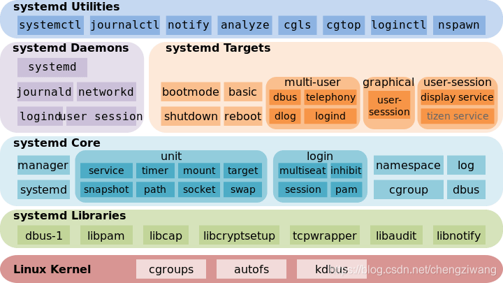

[linux下Systemd 入门教程：命令篇_linux systemd-CSDN博客](https://blog.csdn.net/chengziwang/article/details/112470603)

[10分钟学会linux自定义服务（systemctl）_linux systemctl enable-CSDN博客](https://blog.csdn.net/arv002/article/details/121779213)

[systemctl添加自定义系统服务 - 菜鸟++ - 博客园](https://www.cnblogs.com/keystone/p/13158117.html)

[Linux上systemctl 和 service 两个命令的区别和联系_linux service systemctl-CSDN博客](https://blog.csdn.net/happyblreay/article/details/140145686)

[高效日志管理：通过 Systemd Journal 收集日志的终极指南 - 我和你并没有不同 - 博客园](https://www.cnblogs.com/testzcy/p/18222623)

# 守护进程

守护进程（Daemon Process）是在操作系统后台运行的特殊进程，通常独立于控制终端并且周期性地执行某种任务或等待处理某些发生的事件。

## 主要特点

1. **长期运行**：通常在系统启动时运行，直到系统关闭
2. **无控制终端**：不与任何用户交互
3. **独立于用户会话**：即使用户注销也继续运行
4. **通常以root权限运行**：执行系统级任务

## 常见守护进程

- **系统服务**：sshd(SSH服务)、httpd(Web服务)、crond(定时任务)
- **系统管理**：syslogd(系统日志)、cupsd(打印服务)
- **网络服务**：mysqld(数据库)、ntpd(时间同步)


# 服务管理

在Linux中，**Systemd** 是一个系统和服务管理器，它为现代Linux操作系统提供了一种统一的方式来管理和启动守护进程。

Systemd 的优点是功能强大，使用方便，缺点是体系庞大，非常复杂。事实上，现在还有很多人反对使用 Systemd，理由就是它过于复杂，与操作系统的其他部分强耦合，违反"keep simple, keep stupid"的Unix 哲学。



## 文件结构

Systemd 服务，通常以 *.service* 文件存在，是Systemd的核心概念之一。这些服务文件定义了如何启动和管理服务，包括它们的启动顺序、依赖关系和执行的命令。

一个Systemd服务文件通常包含三个主要部分：*[Unit]*、*[Service]*和*[Install]*。

- **[Unit] 部分**：定义了服务的描述、文档链接以及与其他服务的启动顺序和依赖关系。例如，*After*字段指定了服务应该在哪些服务之后启动，而*Before*字段则指定了服务应该在哪些服务之前启动。*Wants*和*Requires*字段分别定义了服务之间的“弱依赖”和“强依赖”关系。
- **[Service] 部分**：指定了服务的启动行为，包括启动、停止、重启和重载服务时执行的命令。*ExecStart*字段是最重要的，它定义了启动服务时执行的命令。*Type*字段定义了服务的启动类型，如*simple*、*forking*、*oneshot*等。*Restart*字段定义了服务在退出后的重启策略，例如*on-failure*表示在服务意外失败时重启。
- **[Install] 部分**：定义了如何安装这个服务，即如何设置服务的开机启动。*WantedBy*字段指定了服务所属的目标（Target），这决定了服务在哪个运行级别下启动。

## 文件的位置

Systemd服务文件通常位于`/etc/systemd/system/`目录下，这是系统管理员手动创建的单元文件的推荐存放位置。系统服务文件则位于`/usr/lib/systemd/system/`目录下。

## 管理命令

Systemd 并不是一个命令，而是一组命令，涉及到系统管理的方方面面。

我们来安装一个nginx，来学习服务的管理。

### nginx

Nginx 是一个高性能的 HTTP 和反向代理服务器。

1. 更新软件包列表

```sh
sudo apt update
```

2. 安装nginx

```sh
sudo apt install nginx
```

现在已经安装好了nginx，接下来就要使用一些命令来启动和管理*nginx.service*的服务。

> - 主配置文件：`/etc/nginx/nginx.conf`
> - 默认服务器块配置：`/etc/nginx/conf.d/default.conf`
> - 站点配置目录：`/etc/nginx/sites-available/` 和 `/etc/nginx/sites-enabled/`
> - 默认网页根目录：`/usr/share/nginx/html`
> - 日志文件：`/var/log/nginx/access.log` 和 `/var/log/nginx/error.log`

### 启动

#### 启动

要想使用nginx服务，必须先开启。

```sh
sudo systemctl start nginx
```

#### 开机自启

```sh
sudo systemctl <enable | disable> nginx
```

#### 重启

```sh
sudo systemctl restart nginx
```

### 状态

查看服务状态

```sh
sudo systemctl status nginx
```

下面是状态详情：

```sh
 nginx.service - A high performance web server and a reverse proxy server
     Loaded: loaded (/usr/lib/systemd/system/nginx.service; enabled; preset: enabled)
     Active: active (running) since Mon 2025-08-18 16:26:29 CST; 2min 26s ago
       Docs: man:nginx(8)
    Process: 10493 ExecStartPre=/usr/sbin/nginx -t -q -g daemon on; master_process on; (code=exited, status=0/SUCCESS)
    Process: 10500 ExecStart=/usr/sbin/nginx -g daemon on; master_process on; (code=exited, status=0/SUCCESS)
   Main PID: 10532 (nginx)
      Tasks: 3 (limit: 4545)
     Memory: 2.4M (peak: 5.3M)
        CPU: 20ms
     CGroup: /system.slice/nginx.service
             ├─10532 "nginx: master process /usr/sbin/nginx -g daemon on; master_process on;"
             ├─10534 "nginx: worker process"
             └─10535 "nginx: worker process"
```

各部分代表的具体含义请参见[附录-服务状态详情](#服务状态详情)。

### 停止

```sh
sudo systemctl stop nginx
```

服务停止之后，运行状态就变成了`inactive（dead）`。

> Active: inactive (dead) since Mon 2025-08-18 16:50:19 CST; 4s ago 

### 日志

- **日志存储位置**：
  Systemd 日志默认由 `journald` 管理，二进制文件存储在 `/var/log/journal/`。
- **传统日志文件**：
  Nginx 仍会输出日志到 `/var/log/nginx/error.log` 和 `access.log`（与 `journalctl` 互补）。

#### 1. 查看完整日志（基础命令）

```bash
sudo journalctl -u nginx.service
```

- **功能**：显示 Nginx 服务的所有日志记录（从最早到最新）。
- **附加参数**：
  - `-b`：仅显示本次启动后的日志。
  - `--no-pager`：直接输出（不进入分页模式）。

------

#### 2. 实时跟踪最新日志

```bash
sudo journalctl -u nginx.service -f
```

- **功能**：实时监控日志更新（类似 `tail -f`），按 `Ctrl+C` 退出。

#### **3. 按时间筛选日志**

```bash
# 查看最近1小时的日志
sudo journalctl -u nginx.service --since "1 hour ago"

# 查看指定时间段的日志
sudo journalctl -u nginx.service --since "2025-08-18 09:00:00" --until "2025-08-18 10:00:00"
```

#### 4. 按日志级别过滤

```bash
# 仅显示错误日志（优先级为3及以下，包括ERROR、CRITICAL等）
sudo journalctl -u nginx.service -p 3
```

- **常用优先级**：
  - `0`: EMERG（紧急）
  - `3`: ERR（错误）
  - `4`: WARNING（警告）
  - `6`: INFO（信息）

#### 5. 结合其他工具分析

```bash
# 统计错误出现次数
sudo journalctl -u nginx.service -p 3 | grep -o "error.*" | sort | uniq -c

# 导出日志到文件
sudo journalctl -u nginx.service > nginx_logs.txt
```

#### 6. 高级技巧

##### **查看内核与服务的混合日志**

```bash
sudo journalctl -k -u nginx.service  # -k 表示内核日志
```

##### **显示日志的详细字段（如进程ID）**

```bash
sudo journalctl -u nginx.service -o verbose
```

##### **清理旧日志**

```bash
sudo journalctl --vacuum-size=200M  # 保留最近200MB日志
```

#### 示例场景

##### 排查Nginx启动失败

```bash
# 1. 查看最近10条日志
sudo journalctl -u nginx.service -n 10

# 2. 如果发现错误，进一步过滤
sudo journalctl -u nginx.service --since "10 min ago" | grep -i "fail\|error"
```

通过以上方法，你可以高效定位服务问题，无需手动翻阅日志文件。


systemctl start foo.service

要使服务在启动时自动运行，可以使用*enable*命令：

systemctl enable foo.service

示例：创建一个简单的Systemd服务

以下是一个简单的Systemd服务文件示例，它定义了一个名为*example.service*的服务：

[Unit]

Description=Example Service

After=network.target

[Service]

Type=simple

ExecStart=/usr/bin/example

[Install]

WantedBy=multi-user.target


在这个例子中，服务将在网络服务启动后启动，并且在*/usr/bin/example*路径下执行一个程序。

参考资料

- CSDN博客提供了关于Systemd服务文件的详细说明，包括服务文件的结构和字段含义[1](https://blog.csdn.net/qq_16268979/article/details/114771854)。
- 腾讯云开发者社区提供了一个全面易懂的Systemd服务管理教程，强烈建议收藏[2](https://cloud.tencent.com/developer/article/1516125)。
- 另一篇CSDN博客文章详细解析了Systemd的*system.service*参数，包括*RemainAfterExit*等重要选项[3](https://blog.csdn.net/stone_fall/article/details/108630115)。

通过这些资源，用户可以更深入地了解Systemd服务的管理和配置。


# 附录

## 服务状态详情

### 1. 服务基本信息

```css
 nginx.service - A high performance web server and a reverse proxy server
```

服务单元名称（`nginx.service`）和简短描述。

### 2. 服务加载状态

```css
Loaded: loaded (/usr/lib/systemd/system/nginx.service; enabled; preset: enabled)
```

- **`loaded`**：服务配置文件已加载。
- **路径**：`/usr/lib/systemd/system/nginx.service`（Systemd 单元文件位置）。
- **`enabled`**：服务已设置为开机自启。
- **`preset: enabled`**：默认策略为启用（可能由发行版预设）。

### 3. 服务运行状态

```css
Active: active (running) since Mon 2025-08-18 16:26:29 CST; 2min 26s ago
```

- **`active (running)`**：服务正在运行。
- **启动时间**：`2025-08-18 16:26:29 CST`（时间可能因时区不同）。
- **运行时长**：`2min 26s`（服务已持续运行的时间）。

### 4. 文档信息

```css
Docs: man:nginx(8)
```

可通过 `man 8 nginx` 命令查看 Nginx 的手册文档。

### 5. 启动进程记录

```css
Process: 10493 ExecStartPre=/usr/sbin/nginx -t -q -g daemon on; master_process on; (code=exited, status=0/SUCCESS)
Process: 10500 ExecStart=/usr/sbin/nginx -g daemon on; master_process on; (code=exited, status=0/SUCCESS)
```

- **`ExecStartPre`**：服务启动前执行的命令（此处是 `nginx -t -q` 测试配置文件语法）。
  - **`code=exited, status=0/SUCCESS`**：命令成功执行（状态码 0）。
- **`ExecStart`**：实际启动 Nginx 的命令。
  - **参数说明**：
    - `-g daemon on`：以守护进程模式运行。
    - `-g master_process on`：启用主进程管理模式。

### 6. 主进程信息

```css
   Main PID: 10532 (nginx)
```

- **`Main PID`**：Nginx 主进程的 PID（进程 ID）为 `10532`。
- **括号内容**：进程对应的命令名称（`nginx`）。

### 7. 资源使用情况

```css
      Tasks: 3 (limit: 4545)
     Memory: 2.4M (peak: 5.3M)
        CPU: 20ms
```

- **`Tasks`**：当前服务共运行 3 个子进程（1 个 master + 2 个 worker），系统限制为 4545 个进程。
- **`Memory`**：当前内存占用 2.4MB，峰值占用 5.3MB。
- **`CPU`**：累计占用 CPU 时间 20 毫秒。

### 8. CGroup 进程树

```css
 CGroup: /system.slice/nginx.service
         ├─10532 "nginx: master process /usr/sbin/nginx -g daemon on; master_process on;"
         ├─10534 "nginx: worker process"
         └─10535 "nginx: worker process"
```

- **`CGroup`**：Linux 控制组（用于资源隔离）。

- **进程树结构**：

  - **`10532`**：Nginx 主进程（Master Process），负责管理 worker 进程。
  - **`10534` 和 `10535`**：两个工作进程（Worker Process），实际处理请求。

  

# 守护进程编程

守护进程(Daemon)是在后台运行的特殊进程，它不依赖于终端控制，通常用于提供系统服务。下面介绍如何在Linux下用C语言编写守护进程。

## 守护进程的基本特征

1. 在后台运行
2. 与启动它的进程脱离关系
3. 不受终端控制
4. 通常以root权限运行
5. 处理系统信号

## 创建守护进程的步骤

### 1. 创建子进程，父进程退出

```c
pid_t pid = fork();
if (pid < 0) {
    exit(EXIT_FAILURE);
}
if (pid > 0) {  // 父进程退出
    exit(EXIT_SUCCESS);
}
```

### 2. 在子进程中创建新会话

```c
if (setsid() < 0) {
    exit(EXIT_FAILURE);
}
```

### 3. 改变工作目录

```c
chdir("/");
```

### 4. 重设文件权限掩码

```c
umask(0);
```

### 5. 关闭文件描述符

```c
for (int x = sysconf(_SC_OPEN_MAX); x >= 0; x--) {
    close(x);
}
```

## 完整的守护进程示例代码

```c
#include <stdio.h>
#include <stdlib.h>
#include <unistd.h>
#include <sys/types.h>
#include <sys/stat.h>
#include <string.h>
#include <signal.h>

void daemonize() {
    pid_t pid;
    
    // 1. 创建子进程，父进程退出
    pid = fork();
    if (pid < 0) {
        exit(EXIT_FAILURE);
    }
    if (pid > 0) {
        exit(EXIT_SUCCESS);
    }
    
    // 2. 在子进程中创建新会话
    if (setsid() < 0) {
        exit(EXIT_FAILURE);
    }
    
    // 3. 改变工作目录
    chdir("/");
    
    // 4. 重设文件权限掩码
    umask(0);
    
    // 5. 关闭文件描述符
    for (int x = sysconf(_SC_OPEN_MAX); x >= 0; x--) {
        close(x);
    }
}

void signal_handler(int sig) {
    switch(sig) {
        case SIGHUP:
            // 重新加载配置
            break;
        case SIGTERM:
            // 安全退出
            exit(EXIT_SUCCESS);
            break;
        default:
            // 其他信号处理
            break;
    }
}

void setup_signal_handlers() {
    signal(SIGHUP, signal_handler);
    signal(SIGTERM, signal_handler);
}

int main(int argc, char* argv[]) {
    daemonize();
    setup_signal_handlers();
    
    // 守护进程主循环
    while (1) {
        // 在这里实现守护进程的功能
        sleep(30);
    }
    
    return EXIT_SUCCESS;
}
```

## 守护进程管理

### 启动守护进程

```bash
$ ./daemon_program &
```

### 查看守护进程

```bash
$ ps -ef | grep daemon_program
```

### 停止守护进程

```bash
$ kill <pid>
```

## 高级主题

1. **日志记录**：守护进程应该将信息记录到系统日志中，可以使用`syslog`函数族。
2. **配置文件**：通常守护进程会从配置文件中读取配置。
3. **PID文件**：许多守护进程会创建一个PID文件来记录自己的进程ID。
4. **单实例**：确保同一时间只有一个实例运行。

## 使用系统日志的示例

```c
#include <syslog.h>

int main() {
    // 打开系统日志
    openlog("mydaemon", LOG_PID, LOG_DAEMON);
    
    // 记录日志
    syslog(LOG_NOTICE, "Daemon started");
    
    // 守护进程工作...
    
    syslog(LOG_NOTICE, "Daemon exiting");
    
    // 关闭系统日志
    closelog();
    
    return 0;
}
```

以上是Linux下用C语言编写守护进程的基本方法。根据实际需求，你可能需要添加更多的功能和安全措施。

# nohup运行进程与守护进程的区别

`nohup`运行进程和守护进程(daemon)都是在后台运行的进程，但它们在工作机制、使用场景和特性上有重要区别。

## 1. 基本概念对比

| 特性        | nohup进程              | 守护进程                     |
| ----------- | ---------------------- | ---------------------------- |
| 创建方式    | 使用`nohup`命令启动    | 通过编程方式实现双fork等步骤 |
| 终端关联    | 仍与启动终端有微弱关联 | 完全脱离任何终端             |
| 会话领导    | 可能仍是原会话成员     | 自己成为新会话领导者         |
| 标准I/O处理 | 默认重定向到nohup.out  | 通常关闭或重定向到/dev/null  |
| 用途        | 临时性后台任务         | 长期系统服务                 |

## 2. 详细区别分析

### (1) 终端和会话关系

**nohup进程**:
- 只是忽略SIGHUP信号，防止终端断开时被终止
- 仍然属于原来的会话组
- 如果启动它的终端关闭，它仍会保留但不再有控制终端

**守护进程**:
- 通过`setsid()`创建新会话
- 完全脱离任何终端控制
- 自己成为会话组长和进程组长

### (2) 生命周期

**nohup进程**:
- 通常随用户任务完成而结束
- 可能被用户手动终止
- 生命周期与用户会话有一定关联

**守护进程**:
- 设计为长期运行
- 通常从系统启动到关机一直运行
- 生命周期独立于任何用户会话

### (3) 输入输出处理

**nohup进程**:
- 默认将stdout/stderr重定向到nohup.out文件
- 仍可能继承父进程的文件描述符
- 可以手动指定其他输出文件

**守护进程**:
- 通常关闭所有文件描述符(0,1,2)
- 或将它们重定向到/dev/null
- 使用syslog等专门日志系统记录信息

### (4) 使用场景

**nohup适合**:
- 临时需要长时间运行的任务
- 不希望终端断开影响的任务
- 简单的后台执行需求

**守护进程适合**:
- 系统服务(如sshd、nginx等)
- 需要长期稳定运行的服务
- 需要精细控制进程环境的服务

## 3. 技术实现对比

### nohup的实现原理

nohup本质上做了三件事：
1. 忽略SIGHUP信号
2. 重定向标准I/O到nohup.out
3. 在后台执行命令(相当于加了&)

```bash
# nohup的等效实现
trap '' HUP      # 忽略SIGHUP
exec > nohup.out # 重定向输出
exec 2>&1        # 合并错误输出
your_command &   # 后台执行
```

### 守护进程的实现原理

真正的守护进程需要：
1. fork()并让父进程退出
2. setsid()创建新会话
3. 再次fork()(可选，防止获取终端)
4. 改变工作目录
5. 重设umask
6. 关闭/重定向文件描述符

## 4. 实际应用示例

### nohup使用示例

```bash
# 运行一个后台进程，终端断开不受影响
nohup ./long_script.sh &
```

### 守护进程示例(C语言)

```c
#include <unistd.h>
#include <stdlib.h>
#include <sys/stat.h>

void daemonize() {
    pid_t pid = fork();
    if (pid < 0) exit(EXIT_FAILURE);
    if (pid > 0) exit(EXIT_SUCCESS); // 父进程退出
    
    setsid(); // 创建新会话
    
    chdir("/"); // 改变工作目录
    umask(0);   // 重设文件权限掩码
    
    // 关闭标准文件描述符
    close(STDIN_FILENO);
    close(STDOUT_FILENO);
    close(STDERR_FILENO);
    
    // 守护进程主逻辑
    while (1) {
        // 服务代码...
        sleep(1);
    }
}

int main() {
    daemonize();
    return 0;
}
```

## 5. 如何选择

- **使用nohup**当您需要：
  - 临时保持一个长时间运行的命令
  - 简单的后台执行需求
  - 不需要精细控制进程环境

- **使用守护进程**当您需要：
  - 开发系统服务
  - 长期稳定运行的程序
  - 完全脱离终端控制
  - 更精细的资源和控制管理

## 6. 现代替代方案

对于简单的后台执行需求，现代Linux系统还提供了其他选择：

1. **tmux/screen**：终端多路复用器，比nohup更强大
2. **systemd**：可以将普通进程作为系统服务运行
3. **disown**：bash内置命令，将作业从shell作业表中移除

```bash
# 使用disown的示例
./long_task.sh &
disown %1
```

# 如何将C++编写的Web服务器后台运行

对于C++编写的Web服务器程序，选择后台运行方式取决于您的具体需求和场景。以下是详细的解决方案分析：

## 1. 选择方案比较

| 方案                | 适用场景                       | 是否需要修改代码 | 管理便利性 |
| ------------------- | ------------------------------ | ---------------- | ---------- |
| nohup               | 临时测试/简单部署              | 不需要           | 低         |
| 系统服务(如systemd) | 生产环境长期服务               | 通常不需要       | 高         |
| 代码实现守护进程    | 需要完全控制进程行为的专业应用 | 需要             | 中         |
| screen/tmux         | 开发测试阶段需要观察日志的情况 | 不需要           | 中         |

## 2. 推荐方案及具体实现

### 方案一：使用nohup（最简单）

**适用场景**：快速测试或简单部署

```bash
nohup ./your_web_server > server.log 2>&1 &
```

**优点**：
- 无需修改代码
- 简单快捷

**缺点**：
- 不适合生产环境
- 缺乏完善的进程管理

### 方案二：系统服务（推荐生产环境使用）

**使用systemd创建服务**：

1. 创建服务文件 `/etc/systemd/system/web-server.service`：
```ini
[Unit]
Description=My C++ Web Server
After=network.target

[Service]
Type=simple
ExecStart=/path/to/your_web_server
WorkingDirectory=/path/to/working_dir
Restart=always
User=www-data
Group=www-data

[Install]
WantedBy=multi-user.target
```

2. 启用并启动服务：
```bash
sudo systemctl daemon-reload
sudo systemctl enable web-server
sudo systemctl start web-server
```

**优点**：
- 专业的生产级解决方案
- 自动重启、日志管理完善
- 无需修改原有代码

### 方案三：修改代码实现守护进程

**适用场景**：需要精细控制进程行为的专业应用

在您的Web服务器代码中添加守护进程化逻辑：

```cpp
#include <unistd.h>
#include <sys/stat.h>
#include <fstream>

void daemonize() {
    // 第一次fork
    pid_t pid = fork();
    if (pid < 0) exit(EXIT_FAILURE);
    if (pid > 0) exit(EXIT_SUCCESS); // 父进程退出
    
    // 创建新会话
    if (setsid() < 0) exit(EXIT_FAILURE);
    
    // 第二次fork（可选，防止获取终端控制）
    pid = fork();
    if (pid < 0) exit(EXIT_FAILURE);
    if (pid > 0) exit(EXIT_SUCCESS);
    
    // 设置工作目录
    chdir("/");
    
    // 重设文件权限掩码
    umask(0);
    
    // 关闭标准文件描述符
    close(STDIN_FILENO);
    close(STDOUT_FILENO);
    close(STDERR_FILENO);
    
    // 重定向到日志文件（可选）
    std::freopen("/var/log/web_server.log", "a", stdout);
    std::freopen("/var/log/web_server.err", "a", stderr);
}

int main() {
    daemonize();
    
    // 您的Web服务器主逻辑
    start_web_server();
    
    return 0;
}
```

**优点**：
- 完全控制进程行为
- 不依赖外部工具

**缺点**：
- 需要修改代码
- 需要自行处理日志轮转等系统管理功能

### 方案四：使用包装脚本

如果不希望修改代码，可以创建一个包装脚本实现守护进程化：

```bash
#!/bin/bash

# 守护进程化
function daemonize() {
    umask 0
    cd /
    setsid "$@" &
    disown %1
}

# 启动Web服务器
daemonize /path/to/your_web_server
```

然后运行：
```bash
chmod +x wrapper.sh
./wrapper.sh
```

## 3. 生产环境最佳实践建议

1. **推荐组合方案**：
   - 保持Web服务器代码不变（作为普通前台程序）
   - 使用systemd管理进程
   - 在程序中实现良好的日志系统

2. **日志处理建议**：
   - 使用syslog或专业的日志库
   - 避免直接写文件，除非实现日志轮转
   - 示例代码：
     ```cpp
     #include <syslog.h>
     
     int main() {
         openlog("web_server", LOG_PID, LOG_DAEMON);
         syslog(LOG_INFO, "Server started");
         // ...
         closelog();
     }
     ```

3. **安全建议**：
   - 不要以root身份运行
   - 使用chroot等沙盒技术（如需要）
   - 实现适当的资源限制

## 4. 各方案选择指南

- **开发测试阶段**：使用`nohup`或`screen/tmux`方便调试
- **生产环境**：使用systemd服务
- **需要特殊控制**：修改代码实现守护进程
- **快速部署**：使用包装脚本

选择哪种方案主要取决于您的运维需求和程序的使用场景。对于大多数Web服务器应用，使用systemd管理是最专业和可靠的方式。

[#服务状态详情]: 