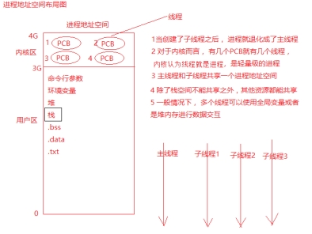
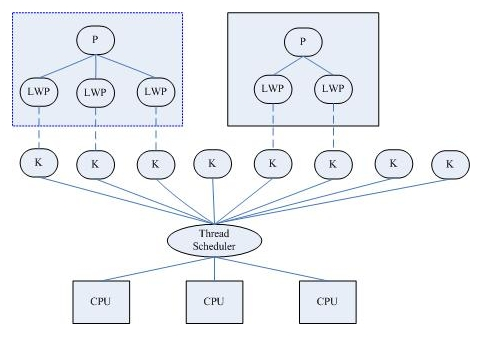
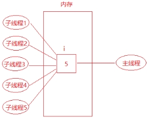
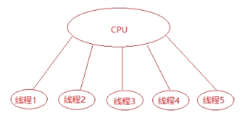
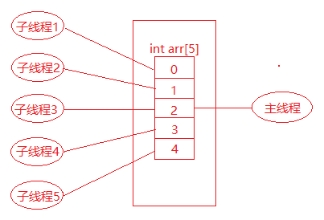

# 线程

[6.2.3线程编程 — — 线程创建-1_哔哩哔哩_bilibili](https://www.bilibili.com/video/BV1Xt411976t?spm_id_from=333.788.videopod.episodes&vd_source=d798f4dc7fdb9ca6a80baf9f4d394acb&p=4)

## 什么是线程

+ 轻量级的进程（LWP：light-weight process），在Linux环境下线程的本质仍是进程。

+ 进程：拥有独立的地址空间，拥有PCB，相当于独居。

+ 线程：有PCB，但没有独立的地址空间，多个线程共享进程空间，相当于合租。

 

+ 在Linux操作系统下： 

  + 线程：最小的执行单位

  + 进程：最小分配资源单位，可看成是只有一个线程的进程。

+ 线程的特点

  + 类Unix系统中，早期是没有“线程”概念的，80年代才引入，借助进程机制实现出了线程的概念。因此在这类系统中，进程和线程关系密切。

  + 线程是轻量级进程(light-weight process)，也有PCB，创建线程使用的底层函数和进程一样，都是clone

  + 从内核里看进程和线程是一样的，都有各自不同的PCB.

  + 进程可以蜕变成线程

  +  在linux下，线程最是小的执行单位；进程是最小的分配资源单位
  
  
  
   

  + 察看指定线程的LWP号：ps –Lf pid

实际上，无论是创建进程的fork，还是创建线程的pthread_create，底层实现都是调用同一个内核函数 clone。

+  如果复制对方的地址空间，那么就产出一个“进程”；

+ 如果共享对方的地址空间，就产生一个“线程”。

> **Linux内核是不区分进程和线程的, 只在用户层面上进行区分**。

所以，线程所有操作函数 pthread_* 是库函数，而非系统调用。

## 线程资源

### 线程共享资源

+ 文件描述符表

+ 每种信号的处理方式

+ 当前工作目录

+ 用户ID和组ID

+ 内存地址空间 (.text/.data/.bss/heap/共享库) 

### 线程非共享资源

+ 线程id

+ 处理器现场和栈指针(内核栈)

+ 独立的栈空间(用户空间栈)

+ errno变量

+ 信号屏蔽字

+ 调度优先级

## 线程优、缺点

+ 优点： 

  + 提高程序并发性 

  + 开销小 

  + 数据通信、共享数据方便

+ 缺点： 

  + 库函数，不稳定 

  + gdb调试、编写困难 

  + 对信号支持不好

优点相对突出，缺点均不是硬伤。Linux下由于实现方法导致进程、线程差别不是很大。

## 线程函数

> [sourceware.org/pthreads-win32/manual/index.html](https://www.sourceware.org/pthreads-win32/manual/index.html)

### pthread_create函数

pthread_create函数用于创建一个新线程，函数原型如下：

```c
int pthread_create(pthread_t *thread, 
                   const pthread_attr_t *attr,
                   void *(*start_routine) (void *),
                   void *arg);
```

+ 返回值

  + 成功，返回0

  + 失败，返回错误号

+ 函数参数：

  +  pthread_t：传出参数，保存系统为我们分配好的线程ID
    + 当前Linux中可理解为：typedef unsigned long int pthread_t。

  + attr：通常传NULL，表示使用线程默认属性。若想使用具体属性也可以修改该参数。

  + start_routine：函数指针，指向线程主函数(线程体)，该函数运行结束，则线程结束。

  + arg：线程主函数执行期间所使用的参数。

+ 注意点

  + 由于pthread_create的错误码不保存在errno中，因此不能直接用perror()打印错误信息，可以先用strerror()把错误码转换成错误信息再打印。

  + 如果任意一个线程调用了exit或_exit，则整个进程的所有线程都终止，由于从main函数return也相当于调用exit，为了防止新创建的线程还没有得到执行就终止，我们在main函数return之前延时1秒，这只是一种权宜之计，即使主线程等待1秒，内核也不一定会调度新创建的线程执行，下一节我们会看到更好的办法。

+ 练习题：

  1. 编写程序创建一个线程。

  2. 编写程序创建一个线程，并给线程传递一个int参数

  3. 编写程序创建一个线程，并给线程传递一个结构体参数。

  4. 编写程序，主线程循环创建5个子线程，并让子线程判断自己是第几个子线程。

     + 练习4分析：最后每个子线程打印出来的值并不是想象中的值，比如都是5，分析其原因：
     + 在创建子线程的时候使用循环因子作为参数传递给子线程，这样主线程和多个子线程就会共享变量i（变量i在main函数中定义，在整个进程都一直有效）所以在子线程看来变量i是合法的栈内存空间。
     + 那么为什么最后每个子线程打印出来的值都是5呢?

     + 是由于主线程可能会在一个cpu时间片内连续创建了5个子线程，此时变量i的值变成了5，当主线程失去cpu的时间片后，子线程得到cpu的时间片，子线程访问的是变量i的内存空间的值，所以打印出来值为5.

 

主线程和子线程共享同一块内存空间

 

主线程和子线程分时使用cpu资源

解决办法：不能使多个子线程都共享同一块内存空间，应该使每个子线程访问不同的内存空间，可以在主线程定义一个数组：int arr[5];，然后创建线程的时候分别传递不同的数组元素，这样每个子线程访问的就是互不相同的内存空间，这样就可以打印正确的值。

如下图：

 

多个子线程各自访问不同的内存空间

+ 根据测试程序还可以得出结论：

  + 如果主线程早于子线程退出，则子线程可能得不到执行，因为主线程退出，整个进程空间都会被回收，子线程没有了生存空间，所以也就得不到执行。

  + 线程之间（包含主线程和子线程）可以共享同一变量，包含全局变量或者非全局变量（但是非全局变量必须在其有效的生存期内）

### pthread_exit函数

在线程中禁止调用exit函数，否则会导致整个进程退出，取而代之的是调用pthread_exit函数，这个函数是使一个线程退出，如果主线程调用pthread_exit函数也不会使整个进程退出，不影响其他线程的执行。

pthread_exit函数作用是将单个线程退出，函数原型如下：

```c
void pthread_exit(void *retval); 
```

+ 函数参数

  + retval表示线程退出状态，通常传NULL

  + **另注意**，pthread_exit或者return返回的指针所指向的内存单元必须是全局的或者是用malloc分配的，不能在线程函数的栈上分配，因为当其它线程得到这个返回指针时线程函数已经退出了，栈空间就会被回收。

练习：编写程序测试pthread_exit函数使一个线程退出。

通过程序测试得知，pthread_exit函数只是使一个线程退出，假如子线程里面调用了exit函数，会使整个进程终止；如果主线程调用了pthread_exit函数，并不影响子线程，只是使主线程自己退出。

### pthread_join函数

pthread_join用于阻塞等待指定线程退出，获取线程退出状态。其作用，对应进程中的waitpid() 函数。函数原型如下：

```c
int pthread_join(pthread_t thread, void **retval); 
```

+ 函数返回值：

  + 成功：0；

  + 失败：错误号

+ 函数参数： 

  + thread：线程ID

  + retval：存储线程结束状态，整个指针和pthread_exit的参数是同一块内存地址。

练习：编写程序，使主线程获取子线程的退出状态。

一般先定义void *ptr; 然后pthread_join(threadid, &ptr);

###  pthread_detach函数

线程分离状态：指定该状态，线程主动与主控线程断开关系。线程结束后，其退出状态不由其他线程获取，而直接自己自动释放。网络、多线程服务器常用。

进程若有该机制，将不会产生僵尸进程。僵尸进程的产生主要由于进程死后，大部分资源被释放，一点残留资源仍存于系统中，导致内核认为该进程仍存在。

也可使用 pthread_create函数参2(线程属性)来设置线程分离。pthread_detach函数是在创建线程之后调用的。

pthread_create函数用于分析线程，函数原型如下：

```c
 int pthread_detach(pthread_t thread); 
```

+ 函数返回值

  + 成功：0；

  + 失败：错误号

一般情况下，线程终止后，其终止状态一直保留到其它线程调用pthread_join获取它的状态为止。但是线程也可以被置为detach状态，**这**样的线程一旦终止就立刻回收它占用的所有资源，而不保留终止状态。不能对一个已经处于detach状态的线程调用pthread_join，这样的调用将返回EINVAL错误。也就是说，如果已经对一个线程调用了pthread_detach就不能再调用pthread_join了。

练习：编写程序，在创建线程之后设置线程的分离状态。

说明：如果线程已经设置了分离状态，则再调用pthread_join就会失败，可用这个方法验证是否已成功设置分离状态。

### pthread_cancel函数

pthread_cancel函数用于杀死(取消)线程。其作用，对应进程中 kill() 函数。函数原型如下：

```c
 int pthread_cancel(pthread_t thread); 
```

+ 函数返回值

  + 成功：0；

  + 失败：错误号

【注意】：线程的取消并不是实时的，而有一定的延时。需要等待线程到达某个取消点(检查点)。

类似于玩游戏存档，必须到达指定的场所(存档点，如：客栈、仓库、城里等)才能存储进度。杀死线程也不是立刻就能完成，必须要到达取消点。

取消点：是线程检查是否被取消，并按请求进行动作的一个位置。通常是一些系统调用creat，open，pause，close，read，write..... 执行命令man 7 pthreads可以查看具备这些取消点的系统调用列表。可粗略认为一个系统调用(进入内核)即为一个取消点。还以通过调用pthread_testcancel函数设置一个取消点。

### pthread_testcancel

pthread_cancel函数用于设置一个取消点。函数原型如下：

```c
void pthread_testcancel(void);
```

练习：编写程序，让主线程取消子线程的执行。

先测试一下没有取消点看看能否使线程取消；然后调用pthread_testcancel设置一个取消点，看看能够使线程取消。

### pthread_equal函数

pthread_equal函数用于比较两个线程ID是否相等。函数原型如下：

```c
int pthread_equal(pthread_t t1, pthread_t t2);
```

注意：这个函数是为了以能够扩展使用的， 有可能Linux在未来线程ID pthread_t 类型被修改为结构体实现。

### 进程函数和线程函数比较

| 进程             | 线程           |
| ---------------- | -------------- |
| **fork**         | pthread_create |
| **exit**         | pthread_exit   |
| **wait/waitpid** | pthread_join   |
| **kill**         | pthread_cancel |
| **getpid**       | pthread_self   |

# 线程管理

## 创建线程

使用`pthread_create`创建线程，函数原型如下：

```C
int pthread_create(pthread_t *restrict thread,
                          const pthread_attr_t *restrict attr,
                          void *(*start_routine)(void *),
                          void *restrict arg);
```

+ 返回值：成功，返回0；失败，返回错误号


+ 函数参数：

  +  pthread_t：传出参数，保存系统为我们分配好的线程ID
     + 当前Linux中可理解为：typedef unsigned long int pthread_t。

  +  attr：通常传NULL，表示使用线程默认属性。若想使用具体属性也可以修改该参数。

  +  start_routine：函数指针，指向线程主函数(线程体)，该函数运行结束，则线程结束。

  +  arg：线程主函数执行期间所使用的参数。


> + 由于pthread_create的错误码不保存在errno中，因此不能直接用perror()打印错误信息，可以先用strerror()把错误码转换成错误信息再打印。
>
> + 如果任意一个线程调用了exit或_exit，则整个进程的所有线程都终止，由于从main函数return也相当于调用exit，为了防止新创建的线程还没有得到执行就终止，我们在main函数return之前延时1秒，这只是一种权宜之计，即使主线程等待1秒，内核也不一定会调度新创建的线程执行，后面我们会看到更好的办法。

### 线程基本使用

```c
#include <pthread.h>
#include <unistd.h>
#include <stdio.h>
#include <string.h>

//线程处理函数
void* th_fn(void*arg)
{
        printf("sub thread,pid is %d,thId is %ld\n",getpid(),pthread_self());
        return NULL;
}

int main()
{
        pthread_t thr;
        int ret = pthread_create(&thr,NULL,th_fn,NULL);
        if(ret !=0) {
                printf("pthread_create error:%s\n",strerror(ret));
                return 1;
        }

        printf("main thread,pid is %d,thId is %ld\n",getpid(),pthread_self());
        sleep(1);
        return 0;
}
```

输出如下：

```bash
main thread,pid is 3704,thId is 137368175114048
sub thread,pid is 3704,thId is 137368172492480
```

从输出结果可知道，两个线程的pid相同，也就是会说进程空间是一样的，但线程ID不同。

### 线程传参

有时候，我们想要给线程函数传递参数，以达到和其他线程共享数据的目的，`pthread_create`最后一个参数就提供了这个功能！

```c
//线程处理函数
void* th_fn(void*arg)
{
        int* p = arg;
        printf("arg is %d\n",*p);
        *p = 100;
		//...
}

int main()
{
        int number = 99;
        pthread_t thr;
        int ret = pthread_create(&thr,NULL,th_fn,&number);
		//...
        sleep(1);
        printf("number is %d\n",number);
        return 0;
}
```

我们定义了一个number变量，初始值为`99`，然后将number的地址传入到了线程处理函数中！

当我们在线程处理函数中修改了传递进来的变量之后，在主线程中打印，也会同步进行修改，因为传递的是指针，能间接修改~

如果想要传递更多参数，可以使用结构体包装之后传递结构体指针~

```c
typedef struct Student{
        int id;
        char name[32];
}Student;

//线程处理函数
void* th_fn(void*arg)
{
        Student* p = arg;
        printf("id is %d,name is %s\n",p->id,p->name);
        p->id = 999;
        return NULL;
}

int main()
{
        Student stu={1001,"maye"};

        pthread_t thr;
        int ret = pthread_create(&thr,NULL,th_fn,&stu);
        if(ret !=0) {
                printf("pthread_create error:%s\n",strerror(ret));
                return 1;
        }

        sleep(1);
        printf("id is %d,name is %s\n",stu.id,stu.name);
        stu.id = 999;
        return 0;
}
```

## 线程终止

### 案例代码

有如下代码，创建线程之后，主线程就直接结束了，那么子线程也会销毁，也就是说子线程得不到执行！

```c
#include <pthread.h>
#include <unistd.h>
#include <stdio.h>
#include <string.h>

//线程处理函数
void* th_fn(void*arg)
{
        int* p = arg;
        for(int i =0;i < 10;i++) {
                printf("arg is %d\n",*p);
                usleep(200*1000);
        }
        return NULL;
}

int main()
{
        int number = 99;

        pthread_t thr;
        int ret = pthread_create(&thr,NULL,th_fn,&number);
        if(ret !=0) {
                printf("pthread_create error:%s\n",strerror(ret));
                return 1;
        }
   
        return 0;
}
```

那么如何解决这个问题呢？要想让子线程执行完毕，主线程再退出，必须让主线程等待子线程执行完毕在退出~

### 等待线程退出

pthread_join用于阻塞等待指定线程退出，获取线程退出状态。其作用，对应进程中的waitpid() 函数。函数原型如下：

```c
int pthread_join(pthread_t thread, void **retval); 
```

+ 函数返回值：

  + 成功：0；

  + 失败：错误号

+ 函数参数： 

  + thread：线程ID

  + retval：存储线程结束状态，整个指针和pthread_exit的参数是同一块内存地址。

```c
int main()
{
		//...
    
        //等待子线程退出
        pthread_join(thr,NULL);
        return 0;
}
```

### 退出线程

在线程中禁止调用exit函数，否则会导致整个进程退出，取而代之的是调用pthread_exit函数，这个函数是使一个线程退出，如果主线程调用pthread_exit函数也不会使整个进程退出，不影响其他线程的执行。

pthread_exit函数作用是将单个线程退出，函数原型如下：

```c
void pthread_exit(void *retval); 
```

+ 函数参数

  + retval表示线程退出状态，通常传NULL

  + **另注意**，pthread_exit或者return返回的指针所指向的内存单元必须是全局的或者是用malloc分配的，不能在线程函数的栈上分配，因为当其它线程得到这个返回指针时线程函数已经退出了，栈空间就会被回收。


#### 案例一

编写程序测试pthread_exit函数使一个线程退出。

```c
//线程处理函数
void* th_fn(void*arg)
{
        int* p = arg;
        for(int i =0;i < 10;i++) {
            	//循环5次之后退出
                if(i == 5) {
                        pthread_exit(NULL);
                }
                printf("arg is %d\n",*p);
                usleep(200*1000);
        }
        return NULL;
}
```

通过程序测试得知，pthread_exit函数只是使一个线程退出，假如子线程里面调用了exit函数，会使整个进程终止；如果主线程调用了pthread_exit函数，并不影响子线程，只是使主线程自己退出。

#### 案例二

编写程序测试pthread_exit函数使一个线程退出，并返回一个指针！

```c
//线程处理函数
void* th_fn(void*arg)
{
        int* p = arg;
        for(int i =0;i < 10;i++) {
            //循环五次之后退出，并返回一个动态内存
              if(i == 5) {
                    int* ret = calloc(1,sizeof(int));
                    *ret = i;
                    pthread_exit(ret);
              }
              printf("arg is %d\n",*p);
              usleep(200*1000);
        }
        return NULL;	//这里也是返回给主线程的join函数
}

int main()
{
        int number = 99;

        pthread_t thr;
        int ret = pthread_create(&thr,NULL,th_fn,&number);
        if(ret !=0) {
                printf("pthread_create error:%s\n",strerror(ret));
                return 1;
        }

        //等待子线程退出，并获取线程的返回值
        int* p = NULL;
        pthread_join(thr,(void**)&p);
        if(p) {
                printf("ret is %d\n",*p);
                free(p);
        }
        return 0;
}
```

### 关闭线程

#### pthread_cancel

pthread_cancel函数用于杀死(取消)线程。其作用，对应进程中 kill() 函数。函数原型如下：

```c
 int pthread_cancel(pthread_t thread); 
```

+ 函数返回值

  + 成功：0；

  + 失败：错误号

【注意】：线程的取消并不是实时的，而有一定的延时。需要等待线程到达某个取消点(检查点)。

类似于玩游戏存档，必须到达指定的场所(存档点，如：客栈、仓库、城里等)才能存储进度。杀死线程也不是立刻就能完成，必须要到达取消点。

取消点：是线程检查是否被取消，并按请求进行动作的一个位置。通常是一些系统调用creat，open，pause，close，read，write..... 执行命令man 7 pthreads可以查看具备这些取消点的系统调用列表。可粗略认为一个系统调用(进入内核)即为一个取消点。还以通过调用pthread_testcancel函数设置一个取消点。

#### pthread_testcancel

pthread_cancel函数用于设置一个取消点。函数原型如下：

```c
void pthread_testcancel(void);
```

练习：编写程序，让主线程取消子线程的执行。

先测试一下没有取消点看看能否使线程取消；然后调用pthread_testcancel设置一个取消点，看看能够使线程取消。

#### 案例

以下代码使用`pthread_cancel`在主线程中关闭子线程，但是关闭失败！

```c
//线程处理函数
void* th_fn(void*arg)
{
        while(1) {
                int a = 0;
        }
        return NULL;
}

int main()
{

        pthread_t thr;
        int ret = pthread_create(&thr,NULL,th_fn,NULL);
        if(ret !=0) {
                printf("pthread_create error:%s\n",strerror(ret));
                return 1;
        }
		//关闭线程
        pthread_cancel(thr);

        //等待子线程退出
        pthread_join(thr,NULL);
        return 0;
}
```

为什么没有关闭掉子线程呢？线程的取消并不是实时的，而有一定的延时。需要等待线程到达某个取消点(检查点)。

> 使用ps -Lf <进程号>能查看指定进程的信息，会显示进程中的所有线程~

在线程处理函数中加入能作为取消点的函数即可取消！

> 或者通过man 7 pthreads查看更多能作为取消点的函数~

```c
//线程处理函数
void* th_fn(void*arg)
{
        while(1) {
            int a = 0;
            pthread_testcancel();
        }
        return NULL;
}
```

## 线程清理和控制

### pthread_cleanup_push

pthread_cleanup_push函数用于注册线程清理函数！

```c
void pthread_cleanup_push(void (*routine)(void *), void *arg);      
```

+ 函数参数： 

  + routine：线程清理函数

  + arg：给线程清理函数传递的参数

### pthread_cleanup_pop

pthread_cleanup_pop函数用于控制是否执行线程清理函数！

```c
void pthread_cleanup_pop(int execute);                                                                
```
+ 函数参数：execute：值为1时执行线程清理函数，值为0时不执行线程清理函数。


### 案例

```c
#include <stdio.h>
#include <pthread.h>
#include <stdio.h>
#include <string.h>
#include <stdlib.h>

void clean_fun(void* arg)
{
        const char* s = arg;
        printf("clean_fun : %s\n",s);
}

void * th_fn(void * arg)
{
        int excute = (int)arg;
        pthread_cleanup_push(clean_fun,"first clean func");
        pthread_cleanup_push(clean_fun,"second clean func");

        printf("thread running %ld\n",pthread_self());
        pthread_cleanup_pop(excute);
        pthread_cleanup_pop(excute);
        return NULL;
}

int main()
{
        pthread_t thr;
        int err = pthread_create(&thr,NULL,th_fn,NULL);
        if(err !=0){
                printf("pthread_create error : %s\n",strerror(err));
                exit(1);
        }

        pthread_join(thr,NULL);
        printf("thr(%ld) finished\n",thr);

        return 0;
}
```

## 线程分离

**线程分离**的主要作用是**告诉操作系统：“当这个线程结束时，自动清理并回收其资源，主线程（或创建者线程）不需要也不应该等待它（join）。”**

### 核心目的：资源管理的自动化

想象一下线程的生命周期：创建 -> 运行 -> 终止。

当一个线程终止后，系统不会立即清除它的“尸体”（例如，它的线程ID和退出状态等信息）。这就像吃完饭的碗筷堆在桌上。必须有人（另一个线程）来调用 `pthread_join()` 来“洗这个碗”，即获取线程的返回值并回收其资源。

**线程分离**就像是说：“这个线程用完的碗筷直接扔进洗碗机（操作系统），你（主线程）不用管了，洗碗机会自动处理。”

### 为什么需要这个机制？

主要为了解决两种问题：

1. **资源泄漏**：
   - 如果一个线程结束时没有被 `join`，也没有被 `detach`，那么它就会变成一个 **“僵尸线程”**。
   - 虽然它不像僵尸进程那样消耗大量资源，但它仍然会占用内核中的一些数据结构（如线程描述符）。如果大量线程以这种方式结束，最终可能会耗尽系统资源，导致无法创建新线程。
2. **阻塞等待**：
   - `pthread_join()` 是一个**阻塞调用**。调用它的线程会一直等待，直到目标线程结束。
   - 对于很多“发射后不管”的后台任务（比如记录日志、处理一个网络请求、定时任务），主线程根本不需要关心它的结果，也不应该被阻塞在那里等待它结束。让主线程去 `join` 每一个这样的线程会成为程序设计的负担和性能瓶颈。

### 主要应用场景

1. **网络服务器**
   - 主线程监听端口，每接到一个新连接，就创建一个新线程去处理（“一个连接一个线程”模型）。
   - 处理线程完成后直接结束，主线程完全不需要知道它是成功还是失败，也不需要它的任何返回结果。这种线程在创建后应立即被分离。
2. **后台任务/守护线程**
   - 日志记录、心跳检测、定时器、监控等任务。
   - 这些线程通常是无限循环的，但即使它们意外终止，主线程也不应该被阻塞去等待它们。将它们分离是更安全的选择。
3. **何时必须使用 `join`？**
   - 当你**需要获取线程的执行结果**时。
   - 当你**必须确保某个线程已经完成工作**后，当前线程才能继续执行时。例如，主线程需要等待所有数据加载线程完成后，才能开始渲染界面。

### pthread_detach

pthread_create函数用于分离线程，函数原型如下：

```c
 int pthread_detach(pthread_t thread); 
```

一般情况下，线程终止后，其终止状态一直保留到其它线程调用pthread_join获取它的状态为止。但是线程也可以被置为detach状态，**这**样的线程一旦终止就立刻回收它占用的所有资源，而不保留终止状态。不能对一个已经处于detach状态的线程调用pthread_join，这样的调用将返回EINVAL错误。也就是说，如果已经对一个线程调用了pthread_detach就不能再调用pthread_join了。

>  如果线程已经设置了分离状态，则再调用pthread_join就会失败，可用这个方法验证是否已成功设置分离状态。

### 案例

```c
#include <pthread.h>
#include <unistd.h>
#include <stdio.h>
#include <string.h>
#include <malloc.h>

//线程处理函数
void* th_fn(void*arg)
{
        for(int i = 0 ;i <100;i++) {
                printf("running %d\n",i);
                sleep(1);
        }
        return NULL;
}

int main()
{
        pthread_t thr;
        int ret = pthread_create(&thr,NULL,th_fn,NULL);
        if(ret !=0) {
                printf("pthread_create error:%s\n",strerror(ret));
                return 1;
        }

        //分离线程
        pthread_detach(thr);

        //等待子线程退出
        if((ret = pthread_join(thr,NULL)) !=0) {
                printf("pthread_join error:%s\n",strerror(ret));
        }

        //主线程任务
        while(1) {
                printf("main thr\n");
                sleep(1);
        }
        return 0;
}
```


# 线程属性

linux下线程的属性是可以根据实际项目需要，进行设置，之前讨论的线程都是采用线程的默认属性，默认属性已经可以解决绝大多数开发时遇到的问题，如果对程序的性能提出更高的要求，则需要设置线程属性，本节以设置线程的分离属性为例讲解设置线程属性。

+ 线程的分离状态决定一个线程以什么样的方式来终止自己，有两种状态：
  + 非分离状态：线程的默认属性是非分离状态，这种情况下，原有的线程等待创建的线程结束。只有当pthread_join()函数返回时，创建的线程才算终止，才能释放自己占用的系统资源。

+  分离状态：分离线程没有被其他的线程所等待，自己运行结束了，线程也就终止了，马上释放系统资源。应该根据自己的需要，选择适当的分离状态。

+ 设置线程属性分为以下步骤

1. 定义线程属性类型类型的变量
   + pthread_attr_t  attr; 

2. 对线程属性变量进行初始化
   + int pthread_attr_init (pthread_attr_t* attr);

3. 设置线程为分离属性

   + int pthread_attr_setdetachstate(pthread_attr_t *attr, int detachstate);

   + 参数:

     + attr: 线程属性

     + detachstate:

       + PTHREAD_CREATE_DETACHED(分离)

       + PTHREAD_CREATE_JOINABLE（非分离)

  注意：这一步完成之后调用pthread_create函数创建线程，则创建出来的线程就是分离线程；其实上述三步就是pthread_create的第二个参数做准备工作。

4. 释放线程属性资源

   + int pthread_attr_destroy(pthread_attr_t *attr);

   + 参数：线程属性

 

练习：编写程序，创建一个分离属性的线程。

```c
int main()
{
        pthread_attr_t attr;
        pthread_attr_init(&attr);
        pthread_attr_setdetachstate(&attr,PTHREAD_CREATE_DETACHED);

        pthread_t thr;
        int ret = pthread_create(&thr,&attr,th_fn,NULL);
        if(ret !=0) {
                printf("pthread_create error:%s\n",strerror(ret));
                return 1;
        }

        //等待子线程退出
        if((ret = pthread_join(thr,NULL)) !=0) {
                printf("pthread_join error:%s\n",strerror(ret));
        }

        pthread_attr_destroy(&attr);

        //主线程任务
        while(1){
                printf("main~\n");
                sleep(1);
        }
        return 0;
}
```

# 其他

## pthread_once

在多线程编程中，有些操作只需要执行一次。*pthread_once*函数可以确保某个初始化操作只执行一次，无论有多少线程尝试执行该操作。

**函数原型**

```c
int pthread_once(pthread_once_t *once_control, void (*init_routine)(void));
```

- 参数：
  - *once_control*：控制变量，必须初始化为*PTHREAD_ONCE_INIT*。
  - *init_routine*：初始化函数，只会被执行一次。

**使用示例**

以下是一个使用*pthread_once*的示例代码：

```c
#include <pthread.h>
#include <stdio.h>
#include <unistd.h>

pthread_once_t once = PTHREAD_ONCE_INIT;

void init_routine() {
	printf("Initialization routine executed in thread %lu\n", pthread_self());
}

void* thread_func(void* arg) {
	printf("Thread %lu started\n", pthread_self());
	pthread_once(&once, init_routine);
	printf("Thread %lu finished\n", pthread_self());
	return NULL;
}

int main() {
	pthread_t tid1, tid2;

	pthread_create(&tid1, NULL, thread_func, NULL);
	pthread_create(&tid2, NULL, thread_func, NULL);

	pthread_join(tid1, NULL);
	pthread_join(tid2, NULL);

	return 0;
}
```

在这个示例中，两个线程分别调用了*pthread_once*函数，但*init_routine*函数只会被执行一次。输出结果类似于：

> Thread 123456 started
>
> Initialization routine executed in thread 123456
>
> Thread 123456 finished
>
> Thread 654321 started
>
> Thread 654321 finished


重要注意事项

- *pthread_once*函数使用互斥锁和条件变量来保证*init_routine*函数只执行一次。
- 如果*once_control*的初值不是*PTHREAD_ONCE_INIT*，*pthread_once*的行为将不正常
- *pthread_once*函数不是一个取消点，但如果*init_routine*是一个取消点并被取消，其效果就像*pthread_once*从未被调用过一样

通过使用*pthread_once*，可以确保在多线程环境中某些初始化操作只执行一次，从而避免了重复初始化的问题。
