# 线程同步

## 线程同步的概念

线程同步，指一个线程发出某一功能调用时，在没有得到结果之前，该调用不返回。同时其它线程为保证数据一致性，不能调用该功能。

## 线程同步的例子

创建两个线程，让两个线程共享一个全局变量int number， 然后让每个线程数5000次数，看最后打印出这个number值是多少？

线程A代码片段：

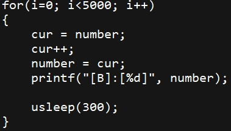 

线程B代码片段：

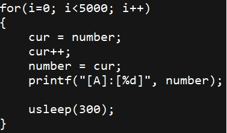 

+ 代码片段说明

  + 代码中使用调用usleep是为了让两个子线程能够轮流使用CPU，避免一个子线程在一个时间片内完成5000次数数。

  + 对number执行++操作，使用了中间变量cur是为了尽可能的模拟cpu时间片用完而让出cpu的情况。

+ 测试结果：经过多次测试最后的结果显示，有可能会出现number值少于5000*2=10000的情况。

+ 分析原因
  +  假如子线程A执行完了cur++操作，还没有将cur的值赋值给number失去了cpu的执行权，子线程B得到了cpu执行权，而子线程B最后执行完了number=cur，而后失去了cpu的执行权；此时子线程A又重新得到cpu的执行权，并执行number=cur操作，这样会把线程B刚刚写回number的值被覆盖了，造成number值不符合预期的值。

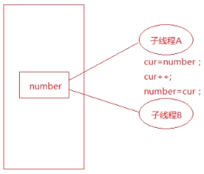 

 

+  数据混乱的原因

   + 资源共享（独享资源则不会） 

   + 调度随机（线程操作共享资源的先后顺序不确定） 

   + 线程间缺乏必要的同步机制。

以上3点中，前两点不能改变，欲提高效率，传递数据，资源必须共享。只要共享资源，就一定会出现竞争。只要存在竞争关系，数据就很容易出现混乱。所以只能从第三点着手解决。使多个线程在访问共享资源的时候，出现互斥。

+ 如何解决问题

+ 原子操作的概念：原子操作指的是该操作要么不做，要么就完成。

+ 使用互斥锁解决同步问题：使用互斥锁其实是模拟原子操作，互斥锁示意图：

> Linux中提供一把互斥锁mutex（也称之为互斥量）。每个线程在对资源操作前都尝试先加锁，成功加锁才能操作，操作结束解锁。

资源还是共享的，线程间也还是竞争的，但通过“锁”就将资源的访问变成互斥操作，而后与时间有关的错误也不会再产生了。

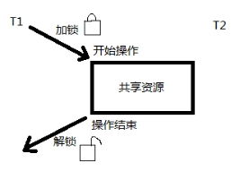 

线程1访问共享资源的时候要先判断锁是否锁着，如果锁着就阻塞等待；若锁是解开的就将这把锁加锁，此时可以访问共享资源，访问完成后释放锁，这样其他线程就有机会获得锁。

应该注意：图中同一时刻，只能有一个线程持有该锁，只要该线程未完成操作就不释放锁。

 使用互斥锁之后，两个线程由并行操作变成了串行操作，效率降低了，但是数据不一致的问题得到解决了。

## 互斥锁

pthread_mutex_t 类型

+  其本质是一个结构体，为简化理解，应用时可忽略其实现细节，简单当成整数看待。

+  pthread_mutex_t mutex; 变量mutex只有两种取值1、0。

### pthread_mutex_init

pthread_mutex_init函数用于初始化一个互斥锁(互斥量) 。函数原型如下：

```c
int pthread_mutex_init(pthread_mutex_t *restrict mutex, 
                       const pthread_mutexattr_t *restrict attr);
```

+ 函数参数

  + mutex：传出参数，调用时应传 &mutex 

  + attr：互斥锁属性。是一个传入参数，通常传NULL，选用默认属性(线程间共享)。

>  **restrict关键字**：只用于限制指针，告诉编译器，所有修改该指针指向内存中内容的操作，只能通过本指针完成。不能通过除本指针以外的其他变量或指针修改互斥量mutex的两种初始化方式：

+ **静态初始化：**如果互斥锁 mutex 是静态分配的（定义在全局，或加了static关键字修饰），可以直接使用宏进行初始化。
  + pthead_mutex_t **muetx** = **PTHREAD_MUTEX_INITIALIZER**;

+ **动态初始化：**局部变量应采用动态初始化。
  + **pthread_mutex_init**(&mutex, NULL)

### pthread_mutex_destroy

pthread_mutex_destroy函数用于销毁一个互斥锁。函数原型如下：

```c
int pthread_mutex_destroy(pthread_mutex_t *mutex);
```

### pthread_mutex_lock

pthread_mutex_lock函数用于对互斥所加锁。函数原型如下：

```c
int pthread_mutex_lock(pthread_mutex_t *mutex);
```

### pthread_mutex_unlock

pthread_mutex_unlock函数用于对互斥所解锁。函数原型如下：

```c
int pthread_mutex_unlock(pthread_mutex_t *mutex);
```

### pthread_mutex_trylock

pthread_mutex_trylock函数尝试加锁。函数原型如下：

```c
 int pthread_mutex_trylock(pthread_mutex_t *mutex);
```

### 加锁和解锁

+ lock尝试加锁，如果加锁不成功，线程阻塞，阻塞到持有该互斥量的其他线程解锁为止。

+ unlock主动解锁函数，同时将阻塞在该锁上的所有线程全部唤醒，至于哪个线程先被唤醒，取决于优先级、调度。默认：先阻塞、先唤醒。

练习：使用互斥锁解决两个线程数数不一致的问题。

代码片段：在访问共享资源前加锁，访问结束后立即解锁。锁的“粒度”应越小越好。

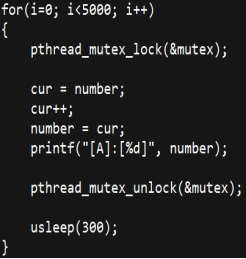 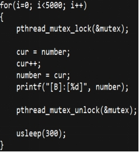

总结：使用互斥锁之后，两个线程由并行变为了串行，效率降低了，但是可以使两个线程同步操作共享资源，从而解决了数据不一致的问题。


### 死锁

死锁并不是linux提供给用户的一种使用方法，而是由于用户使用互斥锁不当引起的一种现象。

+ 常见的死锁有两种：
  + 第一种：自己锁自己，如下图代码片段

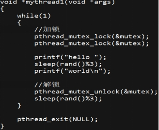 

+ 第二种 线程A拥有A锁，请求获得B锁；线程B拥有B锁，请求获得A锁，这样造成线程A和线程B都不释放自己的锁，而且还想得到对方的锁，从而产生死锁，如下图所示：

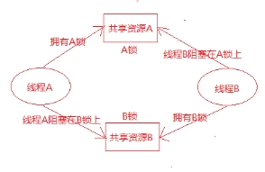 

+ 如何解决死锁：

  + 让线程按照一定的顺序去访问共享资源

  + 在访问其他锁的时候，需要先将自己的锁解开

  + 调用pthread_mutex_trylock，如果加锁不成功会立刻返回

## 读写锁

### 什么是读写锁

读写锁也叫共享-独占锁。当读写锁以读模式锁住时，它是以共享模式锁住的；当它以写模式锁住时，它是以独占模式锁住的。**写独占、读共享。**

+ 读写锁使用场合
  + 读写锁非常适合于对数据结构读的次数远大于写的情况。

+ 读写锁特性 

  + 读写锁是“写模式加锁”时，解锁前，所有对该锁加锁的线程都会被阻塞。

  + 读写锁是“读模式加锁”时，如果线程以读模式对其加锁会成功；如果线程以写模式加锁会阻塞。

  + 读写锁是“读模式加锁”时， 既有试图以写模式加锁的线程，也有试图以读模式加锁的线程。那么读写锁会阻塞随后的读模式锁请求。优先满足写模式锁。读锁、写锁并行阻塞，写锁优先级高

+ 读写锁场景练习：

  + 线程A加写锁成功, 线程B请求读锁
    + 线程B阻塞

  + 线程A持有读锁, 线程B请求写锁
    + 线程B阻塞

  + 线程A拥有读锁, 线程B请求读锁
    + 线程B加锁成功

  + 线程A持有读锁, 然后线程B请求写锁, 然后线程C请求读锁

    + B阻塞，c阻塞 - 写的优先级高

    + A解锁，B线程加写锁成功，C继续阻塞

    + B解锁，C加读锁成功

+ 线程A持有写锁, 然后线程B请求读锁, 然后线程C请求写锁

  + BC阻塞

  + A解锁，C加写锁成功，B继续阻塞

  + C解锁，B加读锁成功

+ 读写锁总结：读并行，写独占，当读写同时等待锁的时候写的优先级高

### 主要操作函数

#### pthread_rwlock_init

pthread_rwlock_init函数用于初始化读写锁，函数原型如下：

```c
int pthread_rwlock_init(pthread_rwlock_t *restrict rwlock, 
                        const pthread_rwlockattr_t *restrict attr);
```

+ 函数参数

  + rwlock：读写锁

  + attr：读写锁属性，传NULL为默认属性

#### pthread_rwlock_destroy

pthread_rwlock_init函数用于销毁读写锁，函数原型如下：

```c
int pthread_rwlock_destroy(pthread_rwlock_t *rwlock);    
```

#### pthread_rwlock_rdlock

pthread_rwlock_init函数用于加读锁，函数原型如下：

```c
int pthread_rwlock_rdlock(pthread_rwlock_t *rwlock);    
```

#### pthread_rwlock_tryrdlock    

pthread_rwlock_tryrdlock函数用于尝试加读锁，函数原型如下：

```c
int pthread_rwlock_tryrdlock(pthread_rwlock_t *rwlock);
```

#### pthread_rwlock_wrlock

pthread_rwlock_wrlock函数用于加写锁，函数原型如下：

```c
int pthread_rwlock_wrlock(pthread_rwlock_t *rwlock);
```

#### pthread_rwlock_trywrlock

pthread_rwlock_trywrlock函数用于尝试加写锁，函数原型如下：

```c
int pthread_rwlock_trywrlock(pthread_rwlock_t *rwlock);
```

#### pthread_rwlock_unlock

pthread_rwlock_unlock函数用于解锁，函数原型如下：

```c
int pthread_rwlock_unlock(&pthread_rwlock_t *rwlock);
```

练习：3个线程不定时写同一全局资源，5个线程不定时读同一全局资源。

 

## 条件变量

+ 条件本身不是锁！但它也可以造成线程阻塞。通常与互斥锁配合使用。给多线程提供一个会合的场所。

  + 使用互斥量保护共享数据;

  + 使用条件变量可以使线程阻塞, 等待某个条件的发生, 当条件满足的时候解除阻塞.

+ 条件变量的两个动作:

  + 条件不满足, 阻塞线程

  + 条件满足, 通知阻塞的线程解除阻塞, 开始工作.

### 相关函数

l pthread_cond_t  cond;

Ø 定义一个条件变量

#### pthread_cond_init

pthread_cond_init函数用于初始化条件变量。函数原型如下：

```c
int pthread_cond_init(pthread_cond_t *restrict cond,
                      const pthread_condattr_t *restrict attr);
```

+ 函数参数

  + cond：条件变量

  + attr：条件属性，传NULL为默认属性

#### pthread_cond_destroy

pthread_cond_destroy函数用于销毁条件变量。函数原型如下：

```c
int pthread_cond_destroy(pthread_cond_t *cond);
```

#### pthread_cond_wait

pthread_cond_wait函数用于等待条件变量。函数原型如下：

```c
int pthread_cond_wait(pthread_cond_t *restrict cond,
                      pthread_mutex_t *restrict mutex);
```

+ 函数描述:

  +  条件不满足, 引起线程阻塞并解锁;

  +  条件满足, 解除线程阻塞, 并加锁

+ 函数参数:

  + cond: 条件变量

  + mutex: 互斥锁变量

#### pthread_cond_signal

pthread_cond_wait函数用于唤醒至少一个阻塞在该条件变量上的线程。函数原型如下：

```c
int pthread_cond_signal(pthread_cond_t *cond);
```

**使用条件变量的代码片段**

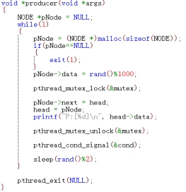  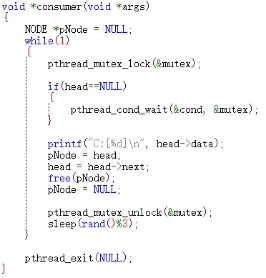

上述代码中，生产者线程调用pthread_cond_signal函数会使消费者线程在pthread_cond_wait处解除阻塞。

## 信号量

 信号量相当于多把锁, 可以理解为是加强版的互斥锁。

### 相关函数

#### sem_init

sem_init函数用于初始化信号量。函数原型如下：

```c
int sem_init(sem_t *sem, int pshared, unsigned int value); 
```

+ 函数参数:

  + sem: 信号量变量

  + pshared: 0表示线程同步, 1表示进程同步

  + value: 最多有几个线程操作共享数据

#### sem_wait

sem_wait函数用于等待信号量(调用该函数一次, 相当于sem--, 当sem为0的时候, 引起阻塞)。函数原型如下：

```c
int sem_wait(sem_t *sem);
```

#### sem_post

sem_post函数用于投递信号（调用一次, 相当于sem++）。函数原型如下：

```c
int sem_post(sem_t *sem);
```

#### sem_trywait

sem_trywait函数用于尝试等待信号量，若失败直接返回, 不阻塞。函数原型如下：

```c
int sem_trywait(sem_t *sem);
```

#### sem_destroy

sem_destroy函数用于销毁信号量。函数原型如下：

```c
int sem_destroy(sem_t *sem);
```

**信号量代码片段:**

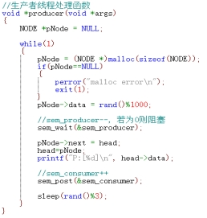 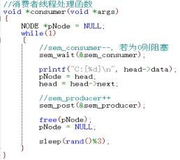