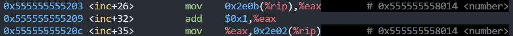
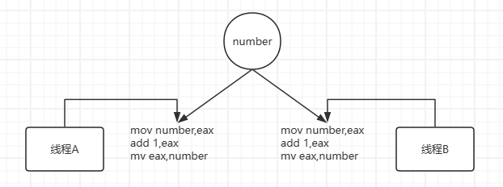
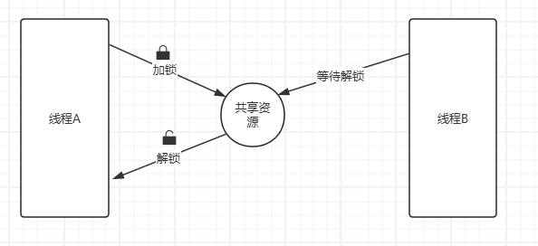
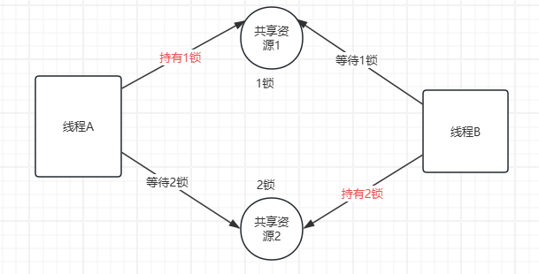

# 线程同步

## 线程同步的概念

线程同步，指一个线程发出某一功能调用时，在没有得到结果之前，该调用不返回。同时其它线程为保证数据一致性，不能调用该功能。

## 线程同步的例子

创建两个线程，让两个线程共享一个全局变量int number， 然后让每个线程对number循环加10次，看最后打印出这个number值是多少？

```c
#include <pthread.h>
#include <unistd.h>
#include <stdio.h>

int number = 0;

void* inc(void* arg)
{
        for(int i = 0 ;i < 100 ;i++) {
             number++;
             printf("[%ld] %d\n",pthread_self(),number);
             usleep(1*1000);
        }
        return NULL;
}

int main()
{

        pthread_t thr1,thr2;

        pthread_create(&thr1,NULL,inc,NULL);
        pthread_create(&thr2,NULL,inc,NULL);

        pthread_join(thr1,NULL);
        pthread_join(thr2,NULL);
        return 0;
}
```

**线程处理函数：**让两个线程执行同样的操作，循环十次，在循环中对number进行++操作，然后进行打印！代码中使用调用usleep是为了让两个子线程能够轮流使用CPU，避免一个子线程在一个时间片内完成100次循环。

**测试结果：**经过多次测试最后的结果显示，有可能会出现number值少于100*2=200的情况。

**分析原因：**

+ `number++`在汇编层面需要三条指令才能完成！
  + **mov 0x2e0b(%rip),%eax**：将number的值加载到eax寄存器中。
  + **add $0x1,%eax**：将eax寄存器的值加1
  + **move %eax,0x2e02(%rip)**：将eax寄存器的值写入到number变量中



> **请注意**：`0x2e0b` 和 `0x2e02` 是链接时计算出的偏移量，它们最终会指向**同一个内存地址**（变量 `n` 的位置）。编译器生成代码时，先用一个偏移量计算读取地址，再用另一个偏移量计算写入地址，但在程序加载后，这两个偏移量会解析为同一个地址。

+  假如子线程A刚执行完第二条指令，就失去了cpu的执行权，子线程B得到了cpu执行权，而线程B把这三条指令都执行完，然后失去了cpu的执行权；此时子线程A又重新得到cpu的执行权，并将eax中的值写入到number变量中，这样会把线程B刚刚写回number的值被覆盖了，造成number值不符合预期的值。



+  数据混乱的原因

   + 资源共享（独享资源则不会） 

   + 调度随机（线程操作共享资源的先后顺序不确定） 

   + 线程间缺乏必要的同步机制。

以上3点中，前两点不能改变，欲提高效率，传递数据，资源必须共享。只要共享资源，就一定会出现竞争。只要存在竞争关系，数据就很容易出现混乱。所以只能从第三点着手解决。使多个线程在访问共享资源的时候，出现互斥。

+ 如何解决问题

+ 原子操作的概念：原子操作指的是该操作要么不做，要么就完成。

+ 使用互斥锁解决同步问题：使用互斥锁其实是模拟原子操作，互斥锁示意图：




线程A访问共享资源的时候要先判断锁是否锁着，如果锁着就阻塞等待；若锁是解开的就将这把锁加锁，此时可以访问共享资源，访问完成后释放锁，这样其他线程就有机会获得锁。

> Linux中提供一把互斥锁mutex（也称之为互斥量）。每个线程在对资源操作前都尝试先加锁，成功加锁才能操作，操作结束解锁。

资源还是共享的，线程间也还是竞争的，但通过“锁”就将资源的访问变成互斥操作，而后与时间有关的错误也不会再产生了。

应该注意：图中同一时刻，只能有一个线程持有该锁，只要该线程未完成操作就不释放锁。

使用互斥锁之后，两个线程由并行操作变成了串行操作，效率降低了，但是数据不一致的问题得到解决了。

## 互斥锁

pthread_mutex_t 类型

+  其本质是一个结构体，为简化理解，应用时可忽略其实现细节，简单当成整数看待。

+  pthread_mutex_t mutex; 变量mutex只有两种取值1、0。

### pthread_mutex_init

pthread_mutex_init函数用于初始化一个互斥锁(互斥量) 。函数原型如下：

```c
int pthread_mutex_init(pthread_mutex_t *restrict mutex, 
                       const pthread_mutexattr_t *restrict attr);
```

+ 函数参数

  + mutex：传出参数，调用时应传 &mutex 

  + attr：互斥锁属性。是一个传入参数，通常传NULL，选用默认属性(线程间共享)。

>  **restrict关键字**：只用于限制指针，告诉编译器，所有修改该指针指向内存中内容的操作，只能通过本指针完成。不能通过除本指针以外的其他变量或指针修改互斥量mutex的两种初始化方式：

+ **静态初始化：**如果互斥锁 mutex 是静态分配的（定义在全局，或加了static关键字修饰），可以直接使用宏进行初始化。
  + pthead_mutex_t **muetx** = **PTHREAD_MUTEX_INITIALIZER**;

+ **动态初始化：**局部变量应采用动态初始化。
  + **pthread_mutex_init**(&mutex, NULL)

### pthread_mutex_destroy

pthread_mutex_destroy函数用于销毁一个互斥锁。函数原型如下：

```c
int pthread_mutex_destroy(pthread_mutex_t *mutex);
```

### pthread_mutex_lock

pthread_mutex_lock函数用于对互斥所加锁。函数原型如下：

```c
int pthread_mutex_lock(pthread_mutex_t *mutex);
```

### pthread_mutex_unlock

pthread_mutex_unlock函数用于对互斥所解锁。函数原型如下：

```c
int pthread_mutex_unlock(pthread_mutex_t *mutex);
```

### pthread_mutex_trylock

pthread_mutex_trylock函数尝试加锁。函数原型如下：

```c
 int pthread_mutex_trylock(pthread_mutex_t *mutex);
```

### 加锁和解锁

+ lock尝试加锁，如果加锁不成功，线程阻塞，阻塞到持有该互斥量的其他线程解锁为止。

+ unlock主动解锁函数，同时将阻塞在该锁上的所有线程全部唤醒，至于哪个线程先被唤醒，取决于优先级、调度。默认：先阻塞、先唤醒。

练习：使用互斥锁解决两个线程数数不一致的问题。

```c
#include <pthread.h>
#include <unistd.h>
#include <stdio.h>

int number = 0;

//全局互斥量可以直接使用宏来初始化
//pthread_mutex_t mutex = PTHREAD_MUTEX_INITIALIZER;
pthread_mutex_t mutex;

void* inc(void* arg)
{
        for(int i = 0 ;i < 100 ;i++) {
                pthread_mutex_lock(&mutex);
                number++;
                printf("[%ld] %d\n",pthread_self(),number);
                //if(number == 10) {
                //      pthread_exit(NULL);
                //}
                pthread_mutex_unlock(&mutex);
                usleep(1*1000);
        }
        return NULL;
}

int main()
{
        //使用函数初始化互斥量
        pthread_mutex_init(&mutex,NULL);

        pthread_t thr1,thr2;

        pthread_create(&thr1,NULL,inc,NULL);
        pthread_create(&thr2,NULL,inc,NULL);

        pthread_join(thr1,NULL);
        pthread_join(thr2,NULL);

        //销毁互斥量
        pthread_mutex_destroy(&mutex);
        return 0;
}
```


代码片段：在访问共享资源前加锁，访问结束后立即解锁。锁的“粒度”应越小越好。

```c
void* inc(void* arg)
{
        for(int i = 0 ;i < 100 ;i++) {
                pthread_mutex_lock(&mutex);
                number++;
                printf("[%ld] %d\n",pthread_self(),number);
                //if(number == 10) {
                //      pthread_exit(NULL);
                //}
                pthread_mutex_unlock(&mutex);
                usleep(1*1000);
        }
        return NULL;
}
```

总结：使用互斥锁之后，两个线程由并行变为了串行，效率降低了，但是可以使两个线程同步操作共享资源，从而解决了数据不一致的问题。

### 死锁

死锁并不是linux提供给用户的一种使用方法，而是由于用户使用互斥锁不当引起的一种现象。

#### 自己锁自己

加锁两次会导致第二次加锁等待，导致死锁！

```c
void* inc(void* arg)
{
        for(int i = 0 ;i < 100 ;i++) {
                pthread_mutex_lock(&mutex);
                pthread_mutex_lock(&mutex);
                number++;
                printf("[%ld] %d\n",pthread_self(),number);
                pthread_mutex_unlock(&mutex);
                usleep(1*1000);
        }
        return NULL;
}
```

#### 忘记解锁

当线程还没有解锁时，线程退出了，这样也会导致死锁！

```c
void* inc(void* arg)
{
        for(int i = 0 ;i < 100 ;i++) {
                pthread_mutex_lock(&mutex);
                number++;
                printf("[%ld] %d\n",pthread_self(),number);
            	//解锁之前退出
                if(number == 10) {
                      pthread_exit(NULL);
                }
                pthread_mutex_unlock(&mutex);
                usleep(1*1000);
        }
        return NULL;
}
```

#### 多个共享资源

当两个或多个线程，需要同时访问两个或以上的共享资源时，需要分别获得两把锁。如果线程A拥有A锁，请求获得B锁；线程B拥有B锁，请求获得A锁，这样造成线程A和线程B都不释放自己的锁，而且还想得到对方的锁，从而产生死锁，如下图所示：



#### 如何解决死锁

+ 让线程按照一定的顺序去访问共享资源

+ 在访问其他锁的时候，需要先将自己的锁解开

+ 调用pthread_mutex_trylock，如果加锁不成功会立刻返回

## 读写锁

### 什么是读写锁

读写锁也叫共享-独占锁。当读写锁以读模式锁住时，它是以共享模式锁住的；当它以写模式锁住时，它是以独占模式锁住的。**写独占、读共享。**

+ 读写锁使用场合
  + 读写锁非常适合于对数据结构读的次数远大于写的情况。

+ 读写锁特性 

  + 读写锁是“写模式加锁”时，解锁前，所有对该锁加锁的线程都会被阻塞。

  + 读写锁是“读模式加锁”时，如果线程以读模式对其加锁会成功；如果线程以写模式加锁会阻塞。

  + 读写锁是“读模式加锁”时， 既有试图以写模式加锁的线程，也有试图以读模式加锁的线程。那么读写锁会阻塞随后的读模式锁请求。优先满足写模式锁。读锁、写锁并行阻塞，写锁优先级高

+ 读写锁场景练习：

  + 线程A加写锁成功, 线程B请求读锁
    + 线程B阻塞

  + 线程A持有读锁, 线程B请求写锁
    + 线程B阻塞

  + 线程A拥有读锁, 线程B请求读锁
    + 线程B加锁成功

  + 线程A持有读锁, 然后线程B请求写锁, 然后线程C请求读锁

    + B阻塞，c阻塞 - 写的优先级高

    + A解锁，B线程加写锁成功，C继续阻塞

    + B解锁，C加读锁成功

+ 线程A持有写锁, 然后线程B请求读锁, 然后线程C请求写锁

  + BC阻塞

  + A解锁，C加写锁成功，B继续阻塞

  + C解锁，B加读锁成功

+ 读写锁总结：读并行，写独占，当读写同时等待锁的时候写的优先级高

### 主要操作函数

#### pthread_rwlock_init

pthread_rwlock_init函数用于初始化读写锁，函数原型如下：

```c
int pthread_rwlock_init(pthread_rwlock_t *restrict rwlock, 
                        const pthread_rwlockattr_t *restrict attr);
```

+ 函数参数

  + rwlock：读写锁

  + attr：读写锁属性，传NULL为默认属性

#### pthread_rwlock_destroy

pthread_rwlock_init函数用于销毁读写锁，函数原型如下：

```c
int pthread_rwlock_destroy(pthread_rwlock_t *rwlock);    
```

#### pthread_rwlock_rdlock

pthread_rwlock_init函数用于加读锁，函数原型如下：

```c
int pthread_rwlock_rdlock(pthread_rwlock_t *rwlock);    
```

#### pthread_rwlock_tryrdlock    

pthread_rwlock_tryrdlock函数用于尝试加读锁，函数原型如下：

```c
int pthread_rwlock_tryrdlock(pthread_rwlock_t *rwlock);
```

#### pthread_rwlock_wrlock

pthread_rwlock_wrlock函数用于加写锁，函数原型如下：

```c
int pthread_rwlock_wrlock(pthread_rwlock_t *rwlock);
```

#### pthread_rwlock_trywrlock

pthread_rwlock_trywrlock函数用于尝试加写锁，函数原型如下：

```c
int pthread_rwlock_trywrlock(pthread_rwlock_t *rwlock);
```

#### pthread_rwlock_unlock

pthread_rwlock_unlock函数用于解锁，函数原型如下：

```c
int pthread_rwlock_unlock(&pthread_rwlock_t *rwlock);
```

### 练习

3个线程不定时写同一全局资源，5个线程不定时读同一全局资源。

 ```c
 #include <stdio.h>
 #include <pthread.h>
 #include <unistd.h>
 #include <stdlib.h>
 #include <time.h>
 
 int number = 0;
 
 //读写锁
 pthread_rwlock_t rwlock;
 
 void* th_write(void* arg)
 {
         int id = (int)arg;
         while(1)
         {
                 //加写锁
                 pthread_rwlock_wrlock(&rwlock);
                 int t = ++number;
                 printf("write [%d]:%d\n",id,t);
                 //解锁
                 pthread_rwlock_unlock(&rwlock);
                 usleep(rand() % 1000 + 1000);
         }
 }
 
 void* th_read(void* arg)
 {
         int id = (int)arg;
         while(1)
         {
                 pthread_rwlock_rdlock(&rwlock);
                 printf("read [%d]:%d\n",id,number);
                 pthread_rwlock_unlock(&rwlock);
                 usleep(rand() % 1000 + 1000);
         }
 }
 
 int main()
 {
         srand(time(NULL));
         //初始化读写锁
         pthread_rwlock_init(&rwlock,NULL);
 
         pthread_t thr[8];
 
         //创建写线程
         for(int i =0;i<3;i++) {
                 pthread_create(thr+i,NULL,th_write,(void*)i);
         }
         //创建读线程
         for(int i =3;i<8;i++) {
                 pthread_create(thr+i,NULL,th_read,(void*)i);
         }
 
         //等待线程结束
         for(int i = 0 ;i< 8;i++) {
                 pthread_join(thr[i],NULL);
         }
 
         //销毁读写锁
         pthread_rwlock_destroy(&rwlock);
         return 0;
 } 
 ```


## 条件变量

+ 条件本身不是锁！但它也可以造成线程阻塞。通常与互斥锁配合使用。给多线程提供一个会合的场所。

  + 使用互斥量保护共享数据;

  + 使用条件变量可以使线程阻塞, 等待某个条件的发生, 当条件满足的时候解除阻塞.

+ 条件变量的两个动作:

  + 条件不满足, 阻塞线程

  + 条件满足, 通知阻塞的线程解除阻塞, 开始工作.

### 相关函数

l pthread_cond_t  cond;

Ø 定义一个条件变量

#### pthread_cond_init

pthread_cond_init函数用于初始化条件变量。函数原型如下：

```c
int pthread_cond_init(pthread_cond_t *restrict cond,
                      const pthread_condattr_t *restrict attr);
```

+ 函数参数

  + cond：条件变量

  + attr：条件属性，传NULL为默认属性

#### pthread_cond_destroy

pthread_cond_destroy函数用于销毁条件变量。函数原型如下：

```c
int pthread_cond_destroy(pthread_cond_t *cond);
```

#### pthread_cond_wait

pthread_cond_wait函数用于等待条件变量。函数原型如下：

```c
int pthread_cond_wait(pthread_cond_t *restrict cond,
                      pthread_mutex_t *restrict mutex);
```

+ 函数描述:

  +  条件不满足, 引起线程阻塞并解锁;

  +  条件满足, 解除线程阻塞, 并加锁

+ 函数参数:

  + cond: 条件变量

  + mutex: 互斥锁变量

#### pthread_cond_signal

pthread_cond_wait函数用于唤醒至少一个阻塞在该条件变量上的线程。函数原型如下：

```c
int pthread_cond_signal(pthread_cond_t *cond);
```

### 案例

#### 手写队列

先来写一个队列，为后面生产者和消费者提供容器支持！

```c
#include <stdio.h>
#include <stdbool.h>
#include <assert.h>
#include <malloc.h>

/*队列*/
typedef struct Node{
        int data;
        struct Node* next;
}Node;

typedef struct Que{
        Node* front;
        Node* tail;
        size_t size;
}Que;


//队列初始化
bool que_init(Que* que) {
        if(!que) return false;
        que->front = que->tail = NULL;
        que->size = 0;
        return true;
}

//队列销毁
void que_destroy(Que* que){
        if(!que) return;
        Node* curNode = que->front;
        Node* delNode = curNode;
        while(curNode)
        {
                curNode = curNode->next;
                free(delNode);
                delNode = curNode;
        }
        que->front = que->tail = NULL;
        que->size = 0;
}

//插入数据
void que_push(Que* que,int v)
{
        if(!que) return ;
        Node* newNode = calloc(1,sizeof(Node));
        newNode->data = v;
        if(que->size == 0) {
                que->front = que->tail = newNode;
        }
        else{
                que->tail->next = newNode;
                que->tail = newNode;
        }
        que->size++;
}

//获取头部元素
int que_front(Que* que)
{
        assert(que && que->size != 0);
        return que->front->data;
}

//删除头部元素
void que_pop(Que* que)
{
        assert(que && que->size != 0);
        Node* delNode = que->front;
        que->front = delNode->next;
        free(delNode);
        que->size--;
}

bool que_empty(Que*que)
{
        if(!que) return true;
        return que->size == 0;
}

int main()
{
        Que que;
        que_init(&que);

        que_push(&que,2);
        que_push(&que,3);
        que_push(&que,5);
        que_push(&que,7);
        printf("size is %lu\n",que.size);

        while(!que_empty(&que))
        {
                int v = que_front(&que);
                printf("v is %d\n",v);
                que_pop(&que);
        }

        printf("size is %lu\n",que.size);

        que_destroy(&que);
        return 0;
}
```

#### 生产者和消费者线程

在下面的代码中，创建两个线程，分别是生产者线程和消费者线程。

+ 生产者线程负责产生数据，并添加到队列中。

+ 消费者线程负责消费数据，并从队列中移除。

> 因为数据竞争问题，必须在两个线程中使用同一个互斥量，进行加锁解锁操作！

```c
Que que;
pthread_mutex_t mutex = PTHREAD_MUTEX_INITIALIZER;

void* th_producer(void* arg)
{
        int v = 0;
        while(1){
                pthread_mutex_lock(&mutex);
                que_push(&que,v++);
                //printf("producer size is %lu\n",que.size);
                pthread_mutex_unlock(&mutex);
                usleep(2000);
        }
        return NULL;
}
void* th_consumer(void* arg)
{
        while(1)
        {
                pthread_mutex_lock(&mutex);
                if(!que_empty(&que)) {
                        int v = que_front(&que);
                        printf("v is %d\n",v);
                        que_pop(&que);
                        //printf("consumer size is %lu\n",que.size);
                }
                else{
                        printf("no data!\n");
                }
                pthread_mutex_unlock(&mutex);
                usleep(1000);
        }
        return NULL;
}

int main()
{
        srand(time(NULL));
        que_init(&que);

        pthread_t th_pro,th_con;
        //创建线程
        pthread_create(&th_pro,NULL,th_producer,NULL);
        pthread_create(&th_con,NULL,th_consumer,NULL);

        //等待线程
        pthread_join(th_pro,NULL);
        pthread_join(th_con,NULL);

        que_destroy(&que);
        return 0;
}
```

#### 条件变量(单消费者)

在上面的代码中，虽然通过互斥量解决了数据竞争问题，但是消费者线程中，如果队列为空，则会继续循环！

现在我们想要实现的效果是，当队列为空的时候，能阻塞等待生产者线程，产生数据，然后消费者线程再继续往下执行！

```c
Que que;
//互斥量
pthread_mutex_t mutex = PTHREAD_MUTEX_INITIALIZER;
//条件变量
pthread_cond_t cond;

void* th_producer(void* arg)
{
        int v = 0;
        while(1){
              pthread_mutex_lock(&mutex);
              que_push(&que,v++);
              //printf("producer size is %lu\n",que.size);
              pthread_mutex_unlock(&mutex);
              //唤醒正在等待的条件
              pthread_cond_signal(&cond);
              //usleep(2000);
              sleep(1);
        }
        return NULL;
}
void* th_consumer(void* arg)
{
        while(1)
        {
               pthread_mutex_lock(&mutex);
               //如果队列为空，则等待(会将互斥量解锁)
               if(que_empty(&que)){
                       pthread_cond_wait(&cond,&mutex);
               }
               //if(!que_empty(&que)) {
                       int v = que_front(&que);
                       printf("v is %d\n",v);
                       que_pop(&que);
                       //printf("consumer size is %lu\n",que.size);
               //}
               //else{
                     //  printf("no data!\n");
               //}
               pthread_mutex_unlock(&mutex);
               usleep(1000);
        }
        return NULL;
}

int main()
{
        srand(time(NULL));
        que_init(&que);

        //初始化条件变量
        pthread_cond_init(&cond,NULL);

        pthread_t th_pro,th_con;
        //创建线程
        pthread_create(&th_pro,NULL,th_producer,NULL);
        pthread_create(&th_con,NULL,th_consumer,NULL);

        //等待线程
        pthread_join(th_pro,NULL);
        pthread_join(th_con,NULL);

        pthread_cond_destroy(&cond);
        que_destroy(&que);
        return 0;
}
```

#### 多消费者问题

如果有多个消费者线程，则会出现问题！

```c
void* th_consumer(void* arg)
{
        while(1)
        {
               pthread_mutex_lock(&mutex);
               //如果队列为空，则等待(会将互斥量解锁)
               if(que_empty(&que)){
                       pthread_cond_wait(&cond,&mutex);
               }
            
               int v = que_front(&que);
               printf("v is %d\n",v);
               que_pop(&que);
               //printf("consumer size is %lu\n",que.size);
            
               pthread_mutex_unlock(&mutex);
               usleep(1000);
        }
        return NULL;
}
```

当多个消费者正在`pthread_cond_wait`等待时，如果生产者调用了`pthread_cond_signal`则会可能唤醒多个消费者线程！

> **pthread_cond_signal不能保证每次只唤醒1个等待线程，可能会唤醒多个**，所以会导致惊群现象，为了解决惊群现象，我们可以在pthread_cond_wait前面 通过while 判断 条件变量标识的队列或变量的状态是否可用，只有可用才去消费，如果不可用，则继续返回等待。

所以我们需要再判断队列是否为空时，使用循环，也就是说消费者线程被唤醒之后，还要继续判断一下队列是否为空，判断是否已经被其他消费者消费掉了！

```c
Que que;
//互斥量
pthread_mutex_t mutex = PTHREAD_MUTEX_INITIALIZER;
//条件变量
pthread_cond_t cond;


int v = 0;

void* th_producer(void* arg)
{
        while(1){
                pthread_mutex_lock(&mutex);
                que_push(&que,v++);
                printf("producer size is %lu\n",que.size);
                pthread_mutex_unlock(&mutex);
                //唤醒正在等待的条件
                pthread_cond_signal(&cond);
                usleep(100);
                //sleep(1);
        }
        return NULL;
}
void* th_consumer(void* arg)
{
        while(1)
        {
                pthread_mutex_lock(&mutex);
                //如果队列为空，则等待(会将互斥量解锁)
                while(que_empty(&que)){
                        pthread_cond_wait(&cond,&mutex);
                }
                if(!que_empty(&que)) {
                        int v = que_front(&que);
                        printf("v is %d\n",v);
                        que_pop(&que);
                        //printf("consumer size is %lu\n",que.size);
                }
                else{
                        printf("no data!\n");
                        exit(0);
                }
                pthread_mutex_unlock(&mutex);
                //usleep(1000);
                usleep(100);
        }
        return NULL;
}

int main()
{
        srand(time(NULL));
        que_init(&que);

        //初始化条件变量
        pthread_cond_init(&cond,NULL);

        //创建线程
        pthread_t thr[8];
        for(int i = 0;i<3;i++)
                pthread_create(thr+i,NULL,th_producer,NULL);
        for(int i = 3;i<8;i++)
                pthread_create(thr+i,NULL,th_consumer,NULL);

        //等待线程
        for(int i = 0;i<8;i++)
                pthread_join(thr[i],NULL);

        pthread_cond_destroy(&cond);
        que_destroy(&que);
        return 0;
}
```


## 信号量

 信号量相当于多把锁, 可以理解为是加强版的互斥锁。

### 相关函数

> 信号量定义在semaphore.h头文件中

#### sem_init

sem_init函数用于初始化信号量。函数原型如下：

```c
int sem_init(sem_t *sem, int pshared, unsigned int value); 
```

+ 函数参数:

  + sem: 信号量变量

  + pshared: 0表示线程同步, 1表示进程同步

  + value: 最多有几个线程操作共享数据

#### sem_wait

sem_wait函数用于等待信号量(调用该函数一次, 相当于sem--, 当sem为0的时候, 引起阻塞)。函数原型如下：

```c
int sem_wait(sem_t *sem);
```

#### sem_post

sem_post函数用于投递信号（调用一次, 相当于sem++）。函数原型如下：

```c
int sem_post(sem_t *sem);
```

#### sem_trywait

sem_trywait函数用于尝试等待信号量，若失败直接返回, 不阻塞。函数原型如下：

```c
int sem_trywait(sem_t *sem);
```

#### sem_destroy

sem_destroy函数用于销毁信号量。函数原型如下：

```c
int sem_destroy(sem_t *sem);
```

### 案例

#### 单消费者

```c
Que que;
//信号量
sem_t proSem;
sem_t conSem;
pthread_mutex_t mutex = PTHREAD_MUTEX_INITIALIZER;


int v = 0;

void* th_producer(void* arg)
{
        while(1){
                //等待信号量
                sem_wait(&proSem);
                pthread_mutex_lock(&mutex);

                que_push(&que,v++);
                printf("producer size is %lu\n",que.size);

                pthread_mutex_unlock(&mutex);
                //递增信号量(让消费者进行消费)
                sem_post(&conSem);

                usleep(100);
                //sleep(1);
        }
        return NULL;
}
void* th_consumer(void* arg)
{
        while(1)
        {
                sem_wait(&conSem);
                pthread_mutex_lock(&mutex);
                //如果队列为空，则等待(会将互斥量解锁)
                if(!que_empty(&que)) {
                        int v = que_front(&que);
                        printf("v is %d\n",v);
                        que_pop(&que);
                        if(v == 10000) {
                                exit(0);
                        }
                        //printf("consumer size is %lu\n",que.size);
                }
                pthread_mutex_unlock(&mutex);
                //递增信号量(让生产者继续生产)
                sem_post(&proSem);
                //usleep(1000);
                usleep(100);
        }
        return NULL;
}

int main()
{
        srand(time(NULL));
        que_init(&que);

        pthread_mutex_init(&mutex,NULL);
        //初始化信号量
        sem_init(&proSem,0,5);
        sem_init(&conSem,0,0);

        //创建线程
        pthread_t thr[8];
        for(int i = 0;i<3;i++)
                pthread_create(thr+i,NULL,th_producer,NULL);
        for(int i = 3;i<8;i++)
                pthread_create(thr+i,NULL,th_consumer,NULL);

        //等待线程
        for(int i = 0;i<8;i++)
                pthread_join(thr[i],NULL);

        pthread_mutex_destroy(&mutex);
        //销毁信号量
        sem_destroy(&proSem);
        sem_destroy(&conSem);
        que_destroy(&que);
        return 0;
}
```

