# Linux常用基础命令

## 5. 文件和目录操作相关的命令

#### 5.1 tree命令

以树状形式查看指定目录内容，使用该命令需要安装软件tree

```sh
sudo apt-get update  			#从服务器获取软件列表，并在本地保存为文件。
sudo apt-get install tree		#从软件仓库中检索并拉取我们想要的软件。
```

+ 命令使用方法
  + tree  --  树形结构显示当前目录下的文件信息
  + tree 目录  -- 树形结构显示指定目录下的文件信息	

> 说明: 使用tree命令查看目录内容层次清晰, 一目了然.
>
>  tree命令只能查看目录内容, 不能查看普通文件内容.  

#### 5.2 ls命令

查看指定目录下的文件信息

##### 5.2.1 使用

+ ls 显示当前目录下所有文件
+ ls 目录或文件名`显示指定目录下文件信息`

##### 5.2.2 常用选项

+ 相关选项 使用`ls --help`命令查看ls命令的所有选项
  + -a：列出当前目录下的所有文件
  + 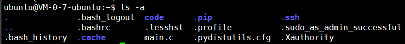
  + . 当前目录
  + .. 上级目录
  + 隐藏目录、隐藏文件 .pip .bashrc
  + 普通文件 main.c

+ -R：递归方式列出所有目录中的内容
+ -r：倒序输出所有文件

+ -l：列出文件的详细信息, 7部分内容

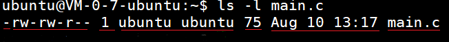

> + 文件类型 （第1个字符）
>   +  \- ： 普通文件
>   + d ： 目录
>   + l ：  符号链接，相当于windows中的快捷方式
>   + s ： 套接字
>   + p ： 管道
>   + b ： 块设备
>   + c ： 字符设备
>
> + 用户的操作权限 （2 – 10个字符）
>   + 文件所有者对文件的操作权限 （2,3,4个字符）
>   + 文件所属组用户对文件的操作权限（5,6,7个字符）
>   + 其他人对文件的操作权限（8,9,10个字符）
>
> + 硬链接计数:
>   + 对于目录来说, 链接计数等于该目录下所有的目录总数(含. 和 ..), 但是不包含该目录的子目录下的目录文件数量, 执行ls -la命令可以进行查看.
>   + 对于文件来说, 指的是该文件所有的硬链接文件数量
>
> + 文件所有者： itcast
>
> + 文件所属组： itcast
>
> + 文件大小： 75Byte
>   + 如果是目录: 只表示目录大小, 不包含目录中的内容, 目录大小为4k
>   + 如果是文件：表示文件大小
>
> + 文件的创建日期或最后修改时间：Aug 10 13:17 （8月10日 13:17）
>
> + 文件名：main.c

+ -h：以人类能读懂的方式显示(主要是文件大小可以显示单位)

  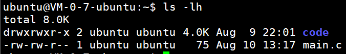

+ 参数之间可以结合使用：

  + ls -la : 列出当前目录下所有文件的相信信息, 包括隐藏文件 
  + ls -ltr: 列出当前目录下的文件, 按照时间逆向排序

+ 文件所有者, 所属组, 其他人的概念

 

+ 下图是ls -l命令截图

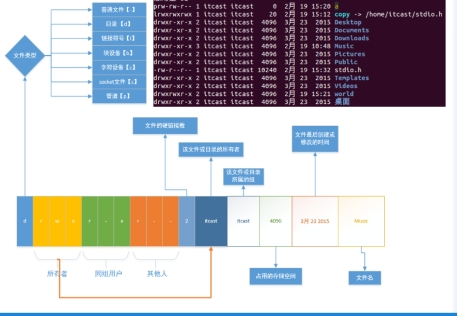 

#### 5.3 cd 命令

切换目录(change directory)，命令使用方式：cd + 路径(路径可以使用相对路径或者绝对路径)

```sh
cd  /home/ubuntu  绝对路径(从根目录开始)
cd  ./ubuntu/code  相对路径(从当前工作目录开始)
```

+ 切换到家目录（例如: /home/itcast）
  + cd
  + cd ~
  + cd /home/ubuntu
  + cd $HOME

+ 临近两个目录直接切换：`cd -`

  如当前在 /home/ubuntu目录下, 执行了cd命令切换到code, 然后在执行cd -又回到了/home/ubuntu下

  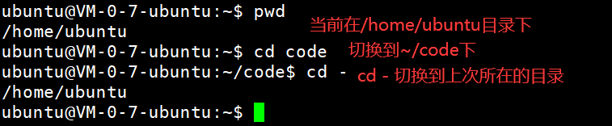

#### 5.4 pwd命令

查看用户当前所处的工作目录, printf working directory

#### 5.5 which命令

显示命令所在的目录

```sh
ubuntu@VM-0-7-ubuntu:~$ which ls which cp
/usr/bin/ls
/usr/bin/which
/usr/bin/cp
```

#### 5.6 touch命令

如果文件不存在, 创建新文件, 如果文件存在, 更新文件的最后修改时间。

命令使用方式：touch 文件名

#### 5.7 mkdir命令

创建新目录, make directory

创建方式：mkdir目录名

如果创建多级目录需要添加参数 -p

```sh
#在当前目录创建hello目录;也可以同时创建多个，指定多个，用空格隔开即可！
mkdir hello 
#在当前目录创建多级目录
mkdir -p  aa/bb/cc
```

#### 5.8 rmdir命令

删除空目录，只能删除空目录，使用方式：rmdir 目录名

#### 5.9 rm命令

+ 删除文件： rm 文件名

+ 删除目录： rm  -r 目录名

**选项**：

+ -r：递归删除目录，删除目录必须添加此参数

+ -i：提示用户是否删除文件或目录(删除时最好指定，以免误触，有反悔的机会)

+ -f：强制删除

**注意事项：**

使用rm命令删除的文件或目录不会放入回收站中，数据不易恢复。

**举例：**

使用通配符，删除满足条件的文件。

+ `rm *.c`    删除后缀名为.c的文件
+ `rm *`     删除所有(非目录)文件
+ `rm -rf *` 强制删除所有文件**慎用**
+ `rm -rfi /*`  **不要执行此命令**，此命令会将根目录`/`下所有文件都删除，系统就崩溃了。


#### 5.10 cp 命令

命令使用方式：cp 源目录或文件 目标目录或文件

若有目录的拷贝需要使用-r参数

+ cp 要拷贝的文件（file1） file（不存在）
  
+ 创建file，将file1中的内容拷贝到file
  
+ cp file1 file（存在）
  
+ file1覆盖file
  
+ cp file dir（存在）
  
+ 拷贝file到dir目录
  
+ cp -r dir（存在） dir1（存在）  
  + 将dir目录拷贝到dir1目录中
  + 包括dir目录

+ cp -r dir（存在） dir1（不存在） 
  + 创建dir1
  + 将dir中的内容拷贝到dir1中, 不包括dir目录

+ cp 拷贝目录也可以用-a参数, 这样可以保留被拷贝的文件的一些属性信息

  > 使用`cp -a`相当于将原数据原封不动的拷贝过来，不改变里面的任何信息
  >
  > 使用`cp -r`拷贝数据，拷贝的结果是生成新的时间戳等信息

#### **5.11** mv命令

+ 改名或者移动文件 mv file1 file2
  + 改名
    + mv file（存在） file1（不存在） 
    + mv dir（存在） dir1（不存在）
    + mv file（存在） file2（存在）
      + 删除file2文件，并把file改名为file2
  + 移动(第二个参数一定是目录文件)
    + mv file（文件） dir（存在目录）
      + 将file文件移动到dir中
    + mv dir（目录存在） dir1（目录存在）
      + 将dir移动到dir1中, dir就会作为dir1的子目录而存在

#### **5.12** cat命令

将文件内容一次性输出到终端。

格式：`cat [OPTION]... [FILE]...`

选项：

+ **-n,--number**：从1开始对所有输出的行编号(输出行号)
+ **-b 或 --number-nonblank**：和 -n 相似，对空白行不编号。
+ **-s 或 --squeeze-blank**：当遇到有连续两行以上的空白行，就代换为一行的空白行。
+ **-E 或 --show-ends** : 在每行结束处显示 $。
+ **-T 或 --show-tabs**: 将 TAB 字符显示为 ^I。

举例：

```bash	
cat main.c -nbs
```

缺点：终端显示的内容有限，如果文件太长无法全部显示。

可用于文件重定向: cat file1>file2, 相当于cp file1 file2

#### **5.13** more命令

文件内容分页显示到终端，但是只能一直向下浏览，不能回退。

使用方式：more + 文件名

**相关操作：**

+ 显示下一行：回车

+ 显示下一页：空格

+ 退出：q（ctrl + c）

#### **5.14** less命令

文件内容分页显示到终端，可以自由上下浏览。

使用方式：less 文件名

**相关操作：**

+ 显示下一行：回车、ctrl + p、键盘向下键

+ 显示上一行：ctrl + n、键盘向上键

+ 显示下一页：空格、PageDown

+ 显示上一页：PageUp

+ 退出：q

#### **5.15** head命令

从文件头部开始查看前n行的内容

使用方式：head -n[行数] 文件名

```sh
head -20 hello.txt
```

如果没有指定行数，默认显示前10行内容

#### **5.16** tail命令

从文件尾部向上查看最后n行的内容

使用方式：tail -n[行数] 文件名

如果没有指定行数，默认显示最后10行内容

-f：随着文件的增长输出附加数据;

> 一个比较重要的应用：显示日志 : tail -f test.log
>
> 终端1执行命令：tail -f test.log 
>
> 终端2执行命令： echo “hello world”  >> test.log
>
> 当终端2执行之后，终端1会自动显示终端2插入的数据

#### 5.17 stat命令

stat命令用于显示文件的状态信息。stat命令的输出信息比ls命令的输出信息要更详细。stat命令可以查看的信息包括：

```sh
ubuntu@VM-0-7-ubuntu:~/test$ stat main.c
  File: main.c
  Size: 284       	Blocks: 8          IO Block: 4096   regular file
Device: fc02h/64514d	Inode: 525034      Links: 1
Access: (0664/-rw-rw-r--)  Uid: ( 1000/  ubuntu)   Gid: ( 1000/  ubuntu)
Access: 2023-08-10 15:55:03.307844050 +0800
Modify: 2023-08-10 15:55:03.179844028 +0800
Change: 2023-08-10 15:55:03.187844028 +0800
 Birth: 2023-08-10 15:55:03.179844028 +0800
```

+ File：显示文件名
+ Size：显示文件大小
+ Blocks：文件使用的数据块总数
+ IO Block：IO块大小
+ regular file：文件类型（常规文件）
+ Device：设备编号
+ Inode：Inode号
+ Links：硬链接数
+ Access：文件的权限
+ Gid、Uid：文件所有权的Gid和Uid
+ access time：表示我们最后一次访问（仅仅是访问，没有改动）文件的时间
+ modify time：表示我们最后一次修改文件的时间
+ change time：表示我们最后一次对文件属性改变的时间，包括权限，大小，属性等等
+ Birth time : 文件创建时间，crtime，不过据查此属性linux已废弃，目前状态显示结果均为-

如果想要只显示某个信息，可以使用格式进行打印：

```sh
ubuntu@VM-0-7-ubuntu:~/test$ stat -c %i main.c
525034
```

有效格式如下表所示：
|格式符|	格式符说明|
|:----:|:---:|
|%a	|八进制中的访问权限|
|%A	|人类可读形式的访问权|
|%b	|分配的块数（请参阅%B）|
|%B	|%b报告的每个块的大小（字节）|
|%C	|SELinux安全上下文字符串|
|%d	|十进制设备编号|
|%D	|十六进制的设备编号|
|%f	|十六进制原始模式|
|%F	|文件类型|
|%g	|所有者的组ID|
|%G	|所有者的组名称|
|%h	|硬链接数|
|%i	|inode数|
|%m	|挂载点|
|%n	|文件名|
|%N	|带取消引用（如果是符号链接）的带引号的文件名|
|%o	|最佳I/O传输大小提示|
|%s	|总大小，以字节为单位|
|%t	|主要设备类型（十六进制），用于字符/块设备特殊文件|
|%T	|次要设备类型（十六进制），用于字符/块设备特殊文件|
|%u	|所有者的用户ID|
|%U	|所有者的用户名|
|%w	|文件出生时间，人类可读；-如果未知|
|%W	|文件生成时间，自纪元起的秒数；如果未知，则为0|
|%x	|最后一次访问的时间，人类可读|
|%X	|上次访问的时间，自纪元起的秒数|
|%y	|上次修改的时间，人类可读|
|%Y	|上次修改的时间，自纪元起的秒数|
|%z	|最后更改的时间，人类可读|
|%Z	|上次更改的时间，自新纪元起的秒数|

#### 5.18 创建链接

##### **5.18.1** 软链接

软连接类似于windows下的快捷方式

**如何创建软连接**

+ ln -s 文件名 快捷方式的名字

  例如：ln -s maye.txt maye.txt.lnk

  ```sh
  ubuntu@VM-0-7-ubuntu:~/test$ ls -lh maye.txt.lnk
  lrwxrwxrwx 1 ubuntu ubuntu 8 Aug 10 21:11 maye.txt.lnk -> maye.txt
  ```

+ 目录也可以创建软连接

  例如：ln -s hello hello.lnk

**创建软链接应注意事项**

+ ln创建软连接要用绝对路径，因为如果不使用绝对路径，一旦这个连接文件发生位置变动，就不能找到那个文件了。

+ 软连接文件的大小是: 路径+文件名的总字节数

##### **5.18.2** 硬链接

+ ln 文件名 硬链接的名字(不需要指定-s选项)
  + ln test.log test.log.hard

+ 使用硬链接应注意事项
  + 硬链接不能建在目录上
  + 硬连接对绝对路径没有要求
  + 硬连接不能跨文件系统

> 硬链接文件和源文件的inode是相同的，文件系统的inode要求唯一，跨文件系统可能会使inode不同, 所以硬链接不能跨文件系统

+ 硬链接的本质

> 硬连接的本质是不同的文件名所在的inode节点是相同的，相同的inode节点指向了相同的数据块，所以他们的文件内容是一样的，文件内容会同步。

+ ls -i 文件名 ------可以查看文件的i节点

+ 如下图, file.hard是file的硬链接, 这个两个文件指向了同一个inode, 同一个inode指向了相同的数据块(文件内容).
+ 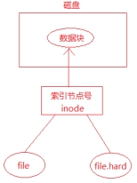
  + 当新创建了一个文件, 硬链接计数为1
  + 给文件创建了一个硬链接后, 硬链接计数加1
  + 删除一个硬链接后, 硬链接计数减1
  + 如果删除硬链接后, 硬链接计数为0, 则该文件会删除

+ 硬链接应用场合
  + 可以起到同步文件的作用，修改file的内容, 会在其余三个硬链接文件上同步.

+ 可以起到保护文件的作用

删除文件的时候, 只要硬链接计数不为0, 不会真正删除, 起到保护文件的作用.

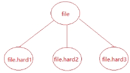 

#### 5.19 wc 

打印文件的行数、 单词、数字节数，可以指定选项仅获取某个信息。

+ wc file [file1...]

+ wc -l file显示文件的总行数

+ wc -c file显示文件的总字节数

+ wc -w file显示文件的总单词数

#### 5.120 whoami

显示当前登陆的用户名

## 6. 用户权限、用户、用户组

### 6.1 修改文件权限chmod

linux是通过权限对文件进行控制的, 通过使用chmod命令可以修改文件相关的权限.

#### 文字设定法

命令：chmod [who] [+|-|=] [mode] 文件名

+ [who] 操作对象
  + u -- 用户（user）
  + g -- 同组用户（group）
  + o -- 其他用户（other）
  + a -- 所用用户（all）【默认】

+ [+|-|=] 操作符
  + \+ -- 添加权限
  + \- -- 取消权限
  + = -- 赋予给定权限并取消其他权限

+ [mode] 权限
  + r -- 读
  + w -- 写
  + x -- 执行

**示例：**给文件file.txt的所有者和所属组添加读写权限

```sh
 chmod ug+wr file.txt
```

#### 数字设定法

命令：chmod \[+|-|=]\[mode] 文件名

+ \[+|-|=]操作符
  + \+ -- 添加权限
  + \- -- 取消权限
  + = -- 赋予给定权限并取消其他权限 (默认为=)

+ [mode] 权限数字，数字表示的含义如下：
  + 0 -- 没有权限(-)
  + 1 -- 执行权限（x）
  + 2 -- 写权限（w）
  + 4 -- 读权限（r)

**举例**：给file.txt文件设置 rw-rw-r--

```sh
chmod 664 file.txt
```

一定要写上三个数字，否则会按照组、其他、用户的顺序来设置权限，没有指定的会取消所有权限。

```sh
ubuntu@VM-0-7-ubuntu:~/code$ ls -l test1.c
-rw-rw-r-- 1 ubuntu ubuntu 69 Aug 11 13:05 test1.c
ubuntu@VM-0-7-ubuntu:~/code$ chmod 6 test1.c 
ubuntu@VM-0-7-ubuntu:~/code$ ls -l test1.c
-------rw- 1 ubuntu ubuntu 69 Aug 11 13:05 test1.c
```


### 6.2 修改文件所有者和所属组

#### 修改文件所有者chown

用法：chown 文件所有者 文件名

```sh
sudo chown mytest file.txt
```

#### 修改文件所有者和所属组chown

用法：chown 文件所有者:文件所属组 文件名

```sh
sudo chown mytest:mytest file.txt
sudo chown mytest.mytest file.txt
```

**注意:**

+ 普通用户需要使用管理员用户权限执行该命令

+ 若系统没有其他用户, 可以使用sudo useradd 用户名 创建一个新用户.

### 6.3 修改文件所属组

chgrp命令

使用方法：chgrp 用户组 文件或目录名

**示例：**修改文件所属组为mytest

```sh
sudo chgrp mytest file.txt
```

普通用户需要使用管理员权限执行该命令。

## 7 find命令

### 按文件名查询

使用`-name`参数指定文件名查找。

命令：find  [路径(默认当前)]  -name  "文件名"

**示例：**

```bash
find /home -name "*.c"	#查找/home目录下所有以.c结尾的文件
find -name m*.c			#查找当前目录下所有以m开头，以.c结尾的文件
```

### 按文件类型查询

使用` -type`参数指定文件类型

命令：find 路径 -type 类型

+ 类型	
  + 普通文件类型用f表示而不是 -
  + d -> 目录
  + l -> 符号链接

  + b -> 块设备文件
  + c -> 字符设备文件
  + s -> socket文件
  + p -> 管道文件

+ 查找指定目录下的普通文件： find 路径 -type f

###  按文件大小查询

使用`-size`参数按文件大小查询。

命令：find  路径  -size  范围

+ 范围
  + 大于：+表示 --  +100k
  + 小于：-表示  --  -100k

  + 等于: 不需要添加符号 --  100k

+ 大小

  + M 必须大写（10M）

  + k 必须小写（20k）
  + c 表示字节数

**举例**: 查询目录为家目录

+ 等于100k的文件:  find ~/ -size 100k

+ 大于100k的文件:  find ~/ -size +100k

+ 大于50k, 小于100k的文件:  find ~/ -size +50k -size -100k

### 按文件日期

+ 创建日期：-ctime [-|+]n
  + -n: n天以内
  + +n: n天以外

+ 修改日期：-mtime -n/+n

+ 访问日期：-atime -n/+n

### 按深度

+ -maxdepth n(层数）
  + 搜索n层以下的目录, 搜索的层数不超过n层

+ -mindepth n（层数）
  + 搜搜n层以上的目录，搜索的层数不能小于n层

> 以上所有选项可以结合使用如：`find -mindepth 3 -type f -name "*.txt"`，查找深度大于等于n，类型为普通文件，后缀为.txt的文件

## pipe(管道)命令

### 管道符

管道符`|`，管道是一种通信机制，通常用于进程间的通信。它表现出来的形式将**前面每一个进程的输出（stdout）直接作为下一个进程的输入（stdin）**。

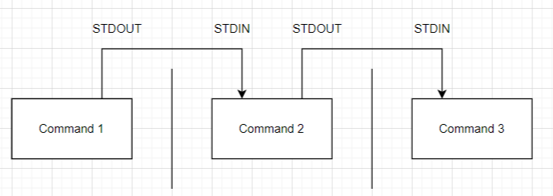

在每个管道后面接的第一个数据必定是命令，而且这个命令必须要是能够接受标准输入的数据才行，这样的命令才可为管道命令。

管道命令主要有两个比较需要注意的地方：

- 管道命令仅会处理标准输出，对于标准错误输出会予以忽略
- 管道命令必须要能够接受来自前一个命令的数据成为标准输入继续处理才行

### 入门

+ 比如，当使用find命令查找时，可能查找的文件太多，翻阅起来比较麻烦，要是能对查找到的结果运用more命令，翻页阅读就很方便了。

```bash
sudo find /home *
```

查找到的文件比较多，难以翻阅。

```bash
sudo find /home * | more
```

加上管道命令，让查找的结果作为more命令的输入，这样就可以方便翻阅了。

+ 请使用学过的命令，来统计某个目录下的文档的总个数？

```bash
ls / | wc -l
```

+ 统计某个目录下.c文件的数量

```bash
find ./ -name "*.c" | wc -l
```

+ 使用ls命令输出find查找的所有文件的信息

```bash
find ./ -name "*.c" | ls -lah
```


### xargs命令

#### 引入

首先考虑一下，使用rm命令删除find查找的所有文件，可能会这样写

```bash	
find ./ -name "*.lnk" | rm
```

但是会提示错误：

```sh
rm: missing operand
Try 'rm --help' for more information.
```

使用`xargs`命令，来给rm传递参数即可！

```sh
find ./ -name "*.lnk" | xargs rm
```

#### 介绍

xargs 是一个强有力的命令，它能够捕获一个命令的输出，然后传递给另外一个命令。

之所以能用到这个命令，关键是由于很多命令不支持|管道来传递参数，而日常工作中有有这个必要，所以就有了 xargs 命令。

xargs 用作替换工具，读取输入数据重新格式化后输出。

定义一个测试文件test.txt，内容如下：

```cpp
abcdefg
hijklmn
opq
rst
uvwxyz
```

使用cat命令查看：

```bash
$ cat test.txt 
abcdefg
hijklmn
opq
rst
uvwxyz
```

使用xargs把换行转成空格之后输出：

```bash	
$ cat test.txt | xargs
abcdefg hijklmn opq rst uvwxyz
```

`-n`选项多行输出

```bash
$ cat test.txt | xargs -n2
abcdefg hijklmn
opq rst
uvwxyz
```

上面的处理都是默认以空格进行分隔的，如果以其他字符分隔，可以使用`-d`选项进行指定。

```bash
$ echo "maye,moyin,qiangseng,liqi,baiyu" | xargs -d, -n2
maye moyin
qiangseng liqi
baiyu
```

还可以使用`-I`选项将管道数据存储起来，用来另外的命令中；比如，把./下所有jpg文件拷贝到指定目录中。

```cpp
sudo ls *.jpg | xargs -n1 -I {} cp {} ./code
```

`-i` 或者是`-I`，这得看linux支持了，将xargs的每项一行一行赋值给 {}，{}可以看做是变量名({}中间不能有空格)。

## 8 grep命令

grep全称Global search REgular expression and Print out the line.

**作用：**文本搜索工具，根据用户指定的“模式（过滤条件)”对目标文本逐行进行匹配检查，打印匹配到的行。

**模式：**由正则表达式的元字符及文本字符所编写出的过滤条件。

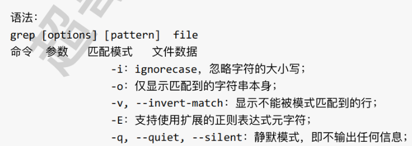

**语法：**

```sh
grep [options] [pattern] file
命令   选项       模式      文件
       -i:ignorecase 忽略大小写;
       -o:仅显示匹配到的字符串本身;
       -v,--invert-match:显示不能被模式匹配到的行;
       -E:支持使用拓展的正则表达式元字符;
       -q,--quiet,--silent:静默模式，即不输出任何信息;
       -n:显示匹配行与行号；
       -w:只匹配过滤的单词
       -c:只打印每个文件选定行的计数
```

### 正则实战

首先准备测试文件`foo.txt`

```
i am teacher
I am student
I'm chinese

hello wrold!
你好世界！

123321
1234567

maye is nice
maye good

moying hello
#sdjsj
#$%^&^
```

+ 输出以i开头的行(不区分大小写)，并输出行号

  ```bash
  $ grep "^i" foo.txt -i -n
  1:i am teacher.
  2:I am student.
  3:I'm chinese.
  ```

  `-i`表示忽略大小写，`-n`表示输出行号

+ 输出以e结尾的行

  ```bash	
  $ grep "e$" foo.txt -i -n
  3:I'm chinese
  11:maye is nice
  ```

+ 输出所有空行

  ```bash
  $ grep "^$" foo.txt -i -n
  4:
  7:
  10:
  13:
  ```

  ^$在正则中表示空。

+ 输出不包括空行的所有行

  ```bash
  $ grep "." foo.txt 
  i am teacher
  I am student
  I'm chinese
  hello wrold!
  你好世界！
  123321
  1234567
  maye is nice
  maye good
  moying hello
  #sdjsj
  #$%^&^
  ```

  **"."点表示任意一个字符, 有且只有一个, 不包含空行**

+ 输出包含指定字符0次或多次的行

  ```bash
  $ grep "l*" foo.txt -i -n
  1:i am teacher
  2:I am student
  3:I'm chinese
  4:
  5:hello wrold!
  6:你好世界！
  7:
  8:123321
  9:1234567
  10:
  11:maye is nice
  12:maye good
  13:
  14:moying hello
  15:#sdjsj
  16:#$%^&^
  ```

  如果写`l`而不是`l*`则只显示包含l的行(因为\*表示找出前一个字符0次或一次以上)

+ `.*`组合

  ```bash	
  $ grep ".*" foo.txt  -n
  1:i am teacher
  2:I am student
  3:I'm chinese
  4:
  5:hello wrold!
  6:你好世界！
  7:
  8:123321
  9:1234567
  10:
  11:maye is nice
  12:maye good
  13:
  14:moying hello
  15:#sdjsj
  16:#$%^&^
  ```

+ `^.*t` 以任意字符开头，直到遇到t结束

  ```cpp
  $ grep "^.*t" foo.txt  -n
  1:i am teacher
  2:I am student
  ```

+ `[abc]`中括号

  中括号表达式,[abc]表示匹配中括号中任意一个字符, a或b或c,常见的形式如下;

  + [a-z]匹配所有小写单个字母[A-Z]匹配所有单个大写字母
  + [a-zA-Z]匹配所有的单个大小写字母
  + [0-9]匹配所有单个数字
  + [a-zA-ZO-9]匹配所有数字和字母
  + 匹配abc字符中的任意一个,得到它的行数和行号 

  匹配abc字符中的任意一个,得到它的行数和行号。

  ```bash
  $ grep "[abc]" foo.txt -n
  1:i am teacher
  2:I am student
  3:I'm chinese
  11:maye is nice
  12:maye good
  ```

+ `-o`参数

  使用"-o"选项, 可以值显示被匹配到的关键字, 而不是将整行的内容都输出.

  ```bash	
  $ grep "[abc]" foo.txt -n -o
  1:a
  1:a
  1:c
  2:a
  3:c
  11:a
  11:c
  12:a
  ```

+ `-c`统计匹配的行数

  ```cpp
  $ grep "[abc]" foo.txt -n -c
  5
  ```

### 拓展正则

使用`-E`选项可以把拓展正则作为模式。

#### +

`+`号表示匹配前一个字符1一次或多次,必须使用grep-E扩展正则

```bash	
$ grep -E "i+" foo.txt  -n
1:i am teacher
3:I'm chinese
11:maye is nice
14:moying hello
```

#### ?

匹配前一个字符0次或1次

```bash
$ grep -E "go?d" foo.txt -n
13:gdb
15:godong!!
```

#### |

`|`表示或者，找出opt目录中txt结尾的文件, 其名字中包含m或者a, 不区分大小写(-i)

```bash	
$ sudo find /usr -name "*.txt" | grep -E "m|a" -n -i
```

#### ()

将一个或多个字符捆绑在一起, 当作一个整体进行处理

```bash
$ grep -E "gd|god|gdb" foo.txt -n
13:gdb
15:godong!!
```

#### {}

**{n,m}:匹配前一个字符至少n次, 最多m次**

**{n,}: 匹配前一个字符至少n次, 没有上限**

**{,m}: 匹配前一个字符最多m次,可以没有**


## man

https://blog.csdn.net/weixin_52270223/article/details/115710222

## 10 Linux常用的压缩工具

### 屌丝版

#### gzip

格式：gzip [OPTION]... [FILE]...

选项：

+ -k：保留输入文件(默认情况下，被压缩的文件会被删除)
+ -l：列出压缩文件内容
+ -r：对目录进行递归(子目录里面的内容也压缩)
+ -f：强制覆盖输出文件和压缩硬链接
+ -d：解压

##### 压缩

```bash	
gzip -k test.txt
```

`-k`选项表示压缩之后把test.txt保留下来，如果不加`-k`则会删除test.txt。

```bash	
gzip -k *.txt
```

压缩当前目录所有.txt文件，**注意**：不会压缩成一个包，会分开压缩。

```bash
gzip -fk *
```

如果目录中有两个硬链接，则必须使用`-f`选项，强制压缩

##### 解压

```bash
gzip -k -d test.txt.gz
```

`-d`选项表示解压

#### bzip

格式：bzip2 [OPTION]... [FILE]...

选项：

+ -k：保留输入文件(默认情况下，被压缩的文件会被删除)
+ -f：强制覆盖输出文件和压缩硬链接
+ -d：解压

bzip2相对gzip来说更简单，少了些许参数，基本操作一致；最大的区别是区别是:gzip压缩的速度快一些,而bzip2要压得狠一些(压缩之后包更小)。

### 高富帅

无论是gzip还是bzip2，都不能压缩目录，只能一个一个文件进行压缩，非常不方便。

所以有了更强大的工具：

#### tar

格式：tar [OPTION...] [FILE]...

选项：

+ -c  压缩
+ \-x  解压

+ -v 显示提示信息(可以省略)
+ -f 指定压缩文件名称
+ -t 列出包内容
+ -k 提取时不要替换现有文件，将其视为错误
+ -z 使用gzip的方式压缩文件 .gz
+ -j 使用bzip的方式压缩文件 .bz2

##### 压缩

+ tar cvf   生成的压缩包名.tar 要打包的文件
  + 如果没有指定压缩方式，则不会压缩，只会对文件进行打包

+ tar zcvf 生成的压缩包名.tar.gz 要打包压缩的文件

+ tar jcvf  生成的压缩包名.tar.bz2 要打包压缩的文件

##### 解压缩

+ tar  xvf  已有的压缩包（test.tar）

+ tar  zxvf  已有的压缩包（test.tar.gz）

+ tar  jxvf  已有的压缩包（test.tar.bz2）


如果要解压到指定的目录，可以使用`-C`选项。

```bash
tar zxvf test.tar.gz -C 解压目录(./mytest)
```

查看压缩包中有哪些文件

```bash
tar -tvf test.tar
```

#### rar

使用前需要安装 rar 工具`sudo apt-get install rar`

##### 压缩

格式： rar a -r 要压缩的文件(含文件或者目录)

```bash
rar a -r my aa bb dir  ----将aa bb dir压缩到my.rar文件中
```

打包的生成的新文件不需要指定后缀

##### 解压缩

格式：rar x xxx.rar 压缩目录

+ 解压到当前目录

  ```bash
  rar x my.rar  --将my.rar解压到当前目录
  ```

+ 解压到指定目录

  ```bash
  rar x my.rar animal --将my.rar解压到animal目录下
  ```

#### zip

使用前需要安装 rar 工具`sudo apt-get install zip`

##### 压缩

格式：zip -r 压缩包包名 要压缩的文件

```bash
zip -r xxx file dir ---生成xxx.zip文件
```

##### 解压缩

格式：unzip 压缩包名

+ 解压到当前目录

  ```bash
  unzip dir.zip
  ```

+ 解压到指定目录

  ```bash
  unzip dir.zip -d animal 
  ```

注意：解压目录若不存在则会创建．

## 12作业练习:

说出Linux下的目录结构

写出下列目录的作用:

/dev

/etc: 

/home

/usr

/bin

/lib

/mnt

itcast@itcast:~/SoftWare/QQ$, 从该字符串中提炼出你所知道的信息。

通过ls -l 命令得到以下文件的详细信息，请写出各个部分代表的意思？

 

创建test目录，在里面创建aa bb cc三个目录，在aa里创建hello文件，在bb里创建world目录，在cc里创建itcast.c,然后执行tree和ls -R,最后删除test。

要求所有的操作都在同一级目录中完成。

如图：

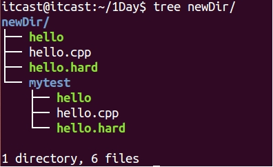 

使用rm命令删除newDir中所有的内容, 使其成为一个空目录.

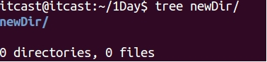 

在指定目录下内容如图所示:

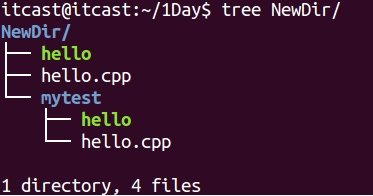 

将NewDir目录中的内容拷贝到另一个已经存在的空目录(file)中, 效果如图:

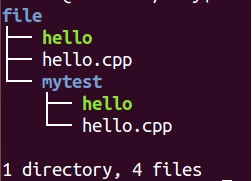 

如何给文件创建软连接(举例), 有什么注意事项?

现有一个文件hello.txt, 文件访问权限为 rwxrw-rw-

使用文字设定法将文件所属组和其他人添加执行权限 x

使用数字设定法去掉文件所有者的读写权限

写出命令查找宿主目录下文件大于100k小于10M的文件，

并将查到文件的详细信息保存到另一个文件file中。

写出命令查找宿主目录下文件中含有"hello, world"字符串的文件，并显示行号。

写出命令卸载Linux中的tree软件(两种方式)

当前目录下有 a, b, c 三个文件和一个目录Dir

分别使用 tar, rar, zip命令将三个文件和目录压缩为一个文件.

将压缩好的文件解压缩到/home/itheima目录中