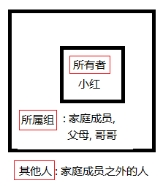

# Linux常用基础命令

## 1. 学习目标

+ 说出Linux下的目录结构和常见目录的作用
+ 熟练使用Linux下的相对路径和绝对路径
+ 熟练使用Linux下常用文件和目录操作相关的命令
+ 熟练使用修改用户权限、用户和用户组相关的命令
+ 熟练使用文件的查找和检索相关的命令
+ 熟练掌握Ubuntu下的软件安装和卸载
+ 熟练使用压缩工具完成文件或目录的压缩解压缩

## 2. 命令解析器

Shell是系统的用户界面，提供了用户与内核进行交互操作的一种接口。它接收用户输入的命令并把它送入内核去执行。

实际上Shell是一个命令解释器，它解释由用户输入的命令并且把它们送到内核。


用户在终端输入命令, 由shell命令解释器对命令进行解析(按照$PATH环境变量搜索命令)，解析成内核能够识别的指令, 然后由内核执行命令, 最后由终端显示命令执行的结果给用户。

$ shell在寻找命令的时候是按照PATH环境变量去查找的，如果找到了就执行对应的命令，若找不到就报错, 执行echo PATH可以查看PATH环境变量的值。$


 

+ 常用的命令解析器
  + Bash (Bourne Again Shell): Bash是最常用的Shell解释器，也是默认的Linux命令行解释器。它继承了Bourne Shell的特性，并添加了许多功能和改进，包括命令历史、自动补全、作业控制等。
  + sh (Bourne Shell): Bourne Shell是Unix系统中最早的Shell解释器之一，它是其他Shell的基础，语法相对简单，常用于编写脚本。
  + csh (C Shell): C Shell使用C语言风格的语法，提供了一些便于程序员使用的功能，如命令行编辑和作业控制。它在某些Unix系统中是默认的Shell解释器。
  + ksh (Korn Shell): Korn Shell是由Bourne Shell和C Shell发展而来的Shell解释器，它继承了两者的特性，并添加了一些新的功能和语法，如命令历史、命令别名等。
  + tcsh (Enhanced C Shell): tcsh是C Shell的扩展版本，提供了更多的功能和命令补全等增强特性。

+ 当前系统所使用的shell

```sh
echo $SHELL
```

+ 当前系统下有哪些shell

```sh
cat /etc/shells
```

## 3. Linux下常用快捷键

### 3.1 tab键的作用

+ **补齐命令**

  如：在终端输入his然后按tab键, 会补齐history命令;

  如：输入 i 然后按tab键(一次不行连按两次)，会显示所有以 i 开头的命令。

+ **补齐文件**(包括目录和文件)

  例如： 如果在执行ls, 然后按tab键, 会显示当前目录下所有的文件

  使用tab键的优点：减少用户输入, 加快输入速度, 减少出错的机会.

### 3.2 主键盘快捷键

+ 遍历输入的历史命令

  + 从当前位置向上遍历：ctrl + p（↑）
  + 从当前位置向下遍历：ctrl + n（**↓**）

  注意：使用history命令可以显示用户输入的所有命令；使用!+**历史命令序号**可以快速执行历史命令。

+ 光标位置移动
  + 光标左移： ctrl + b （**←**）
  + 坐标右移： ctrl + f （**→**）
  + 移动到头部： ctrl + a（home）
  + 移动到尾部： ctlr + e（end）

+ 字符删除
  + 删除光标前边的字符：ctrl + h（Backspace）
  + 删除光标后边的字符：ctrl + d
    + 光标后边的字符即光标覆盖的字符
    +  ，执行该命令，删除的是字符W
  + 删除光标前所有内容：ctrl + u
  + 删除光标后所有内容：ctrl + k

## 4. linux下的目录结构

### 4.1 linux系统的目录结构

Linux系统的目录结构是一个倒立的树状结构, 根目录用**/**表示，对比windows目录结构理解linux的目录结构。


 

### 4.2 linux下主要目录介绍

#### /bin

binary，二进制文件，可执行程序，shell命令

如: ls , rm , mv, cp等常用命令

#### /sbin

s是Super User的意思，这里存放的是系统管理员使用的系统管理程序。

如ifconfig, halt, shutdown, reboot等系统命令

#### /dev

 device，在linux下一切皆文件：

+ 硬盘, 显卡, 显示器
+ 字符设备文件、块设备文件

+ 如: 在input目录下执行: sudo cat mouse0, 移动鼠标会显示有输入.

#### /lib

linux运行的时候需要加载的一些动态库，: libc.so、libpthread.so等

#### /mnt

手动的挂载目录, 如U盘等

#### /media

外设的自动挂载目录, 如光驱等。

#### /root

linux的超级用户root的家目录

#### /usr

unix system resource--类似于WINDOWS的programe files目录

+ include目录里存放头文件, 如: stdio.h、stdlib.h、string.h、pthread.h
+ games目录下的小游戏-如: sl小火车游戏

#### /etc

存放配置文件

+ /etc/passwd
  + man 5 passwd可以查看passwd文件的格式信息
+ /etc/group
  + man 5 group可以查看group文件的格式信息
+ /etc/profile
  + 系统的配置文件, 修改该文件会影响这个系统下面的所有的用户

#### /opt

安装第三方应用程序

比如安装oracle数据库可以在这个目录下

#### /home

linux操作系统所有用户的家目录

+ 用户家目录：(宿主目录或者主目录）
  + /home/itcast

#### /tmp

+ /tmp: 存放临时文件
  + 新建在这个目录下的文件会在系统重启后自动清除

### 4.3 相对路径和绝对路径

#### 绝对路径

从根目录开始表示的路径，也就是从/开始，例如：/home/itcast

#### 相对路径

+ 从当前所处的目录开始表示的路径。

+ **.**表示当前目录

+ **..** 表示当前目录的上一级目录

#### 命令提示符


+ ubuntu：当前登录的用户

+ @：英文at, 在的意思

+ VM-0-7-ubuntu: 主机名
  + 主机名在/etc/hosts这个文件中

+  ~/code：当前工作目录, ~表示宿主目录（家目录或者主目录）
  + 可通过：`echo ~`或者`echo $HOME`查看当前用户的宿主目录

+ $：表示当前用户为普通用户, #表示当前用户为root用户


## 5. 文件和目录操作相关的命令

#### 5.1 tree命令

+ 以树状形式查看指定目录内容，使用该命令需要安装软件tree

```sh
sudo apt-get update  			#从服务器获取软件列表，并在本地保存为文件。
sudo apt-get install tree		#从软件仓库中检索并拉取我们想要的软件。
```

+ 命令使用方法
  + tree  --  树形结构显示当前目录下的文件信息
  + tree 目录  -- 树形结构显示指定目录下的文件信息	

> 说明: 使用tree命令查看目录内容层次清晰, 一目了然.
>
>  tree命令只能查看目录内容, 不能查看普通文件内容.  

#### 5.2 ls命令

查看指定目录下的文件信息

+ 使用方法：
  + ls 显示当前目录下所有文件
  + ls 目录或文件名`显示指定目录下文件信息`

+ 相关选项 使用`ls --help`命令查看ls命令的所有选项
  + -a：列出当前目录下的所有文件
  + 
  + . 当前目录
  + .. 上级目录
  + 隐藏目录、隐藏文件 .pip .bashrc
  + 普通文件 main.c

+ -R：递归方式列出所有目录中的内容
+ -r：倒序输出

+ -l：列出文件的详细信息, 7部分内容


u 文件类型 （第1个字符）

Ø - ： 普通文件

Ø d ： 目录

Ø l ：  符号链接，相当于windows中的快捷方式

Ø s ： 套接字

Ø p ： 管道

Ø b ： 块设备

Ø c ： 字符设备

u 用户的操作权限 （2 – 10个字符）

Ø 文件所有者对文件的操作权限 （2,3,4个字符）

Ø 文件所属组用户对文件的操作权限（5,6,7个字符）

Ø 其他人对文件的操作权限（8,9,10个字符）

u 硬链接计数:

Ø 对于目录来说, 链接计数等于该目录下所有的目录总数(含. 和 ..), 但是不包含该目录的子目录下的目录文件数量, 执行ls -la命令可以进行查看.

Ø 对于文件来说, 指的是该文件所有的硬链接文件数量

u 文件所有者： itcast

u 文件所属组： itcast

u 文件大小： 36

Ø 如果是目录: 只表示目录大小, 不包含目录中的内容, 目录大小为4k

Ø 如果是文件：表示文件大小

u 文件的创建日期或最后修改时间：10月 13 11:41

u 文件名：test.log

n 参数之间可以结合使用：

u ls -la : 列出当前目录下所有文件的相信信息, 包括隐藏文件 

u ls -ltr: 列出当前目录下的文件, 按照时间逆向排序

n 文件所有者, 所属组, 其他人的概念

 

n 下图是ls -l命令截图

 

5.3 cd 命令

切换目录(change directory), 命令使用方式：cd + 路径

路径可以使用相对路径或者绝对路径

cd  /home/itcast  绝对路径(从根目录开始)

cd  ./itcast/test  相对路径(从当前工作目录开始)

n 切换到家目录（例如: /home/itcast）

n cd

n cd ~

n cd /home/itcast

n cd $HOME

n 临近两个目录直接切换

n cd -

如开始在: /home/itcast/test/course/day1/test目录下, 执行了cd命令切换到家目录下, 然后在执行cd -又回到了/home/itcast/test/course/day1/test下.

#### 5.4 pwd命令

查看用户当前所处的工作目录, printf working directory

#### 5.5 which命令

显示命令所在的目录, 如which ls  which cp 

#### 5.6 touch命令

如果文件不存在, 创建新文件, 如果文件存在, 更新文件的最后修改时间。

命令使用方式：touch 文件名

#### 5.7 mkdir命令

创建新目录, make directory

创建方式：mkdir目录名

如果创建多级目录需要添加参数 -p

例  在当前目录下创建目录:  mkdir mydir

在宿主目录下创建多级目录:  mkdir -p ~/test/hello/world/aa

#### 5.8 rmdir命令

删除空目录，只能删除空目录，使用方式：rmdir 目录名

#### 5.9 rm命令

l 删除文件： rm 文件名

l 删除目录： rm  -r 目录名

l 参数：

u -r：递归删除目录，删除目录必须添加此参数

u -i：提示用户是否删除文件或目录

u -f：强制删除

l 注意事项：

使用rm命令删除的文件或目录不会放入回收站中，数据不易恢复。

#### 5.10 cp 命令

命令使用方式：cp 源目录或文件 目标目录或文件

若有目录的拷贝需要使用-r参数

l cp 要拷贝的文件（file1） file（不存在）

n 创建file，将file1中的内容拷贝到file

l cp file1 file（存在）

n file1覆盖file

l cp file dir（存在）

n 拷贝file到dir目录

l cp -r dir（存在） dir1（存在）  

n 将dir目录拷贝到dir1目录中

n 包括dir目录

l cp -r dir（存在） dir1（不存在） 

n 创建dir1

n 将dir中的内容拷贝到dir1中, 不包括dir目录

l cp 拷贝目录也可以用-a参数, 这样可以保留被拷贝的文件的一些属性信息

#### **5.11** ***\*mv命令\****

l 改名或者移动文件 mv file1 file2

n 改名

u mv file（存在） file1（不存在） 

u mv dir（存在） dir1（不存在）

u mv file（存在） file2（存在）

u file文件覆盖file2文件,file改名为file2

n 移动(第二个参数一定是目录文件)

u mv file（文件） dir（存在目录）

Ø 将file文件移动到dir中

u mv dir（目录存在） dir1（目录存在）

Ø 将dir移动到dir1中, dir就会作为dir1的子目录而存在

#### **5.12** ***\*cat\*******\*命令\****

l 将文件内容一次性输出到终端。

l 使用方式： cat 文件名

l 缺点：终端显示的内容有限，如果文件太长无法全部显示。

l 可用于文件重定向: cat file1>file2, 相当于cp file1 file2

#### **5.13** ***\*more命令\****

l 文件内容分页显示到终端，但是只能一直向下浏览，不能回退。

l 使用方式：more + 文件名

l 相关操作：

n 显示下一行：回车

n 显示下一页：空格

n 退出：q（ctrl + c）

#### **5.14** ***\*less命令\****

l 文件内容分页显示到终端，可以自由上下浏览。

l 使用方式：less 文件名

l 相关操作：

n 显示下一行：回车、ctrl + p、键盘向下键

n 显示上一行：ctrl + n、键盘向上键

n 显示下一页：空格、PageDown

n 显示上一页：PageUp

n 退出：q

#### **5.15** ***\*head命令\****

l 从文件头部开始查看前n行的内容

l 使用方式：head -n[行数] 文件名

n head -20 hello.txt

l 如果没有指定行数，默认显示前10行内容

#### **5.16** ***\*tail命令\****

l 从文件尾部向上查看最后n行的内容

l 使用方式：tail -n[行数] 文件名

l 如果没有指定行数，默认显示最后10行内容

l 一个比较重要的应用：显示日志 : tail -f test.log

一个终端tail -f test.log , 另一个终端: echo “hello world” >>test.log

#### **5.17** ***\*软\*******\*链接\****

l 软连接类似于windows下的快捷方式

l 如何创建软连接

n ln -s 文件名 快捷方式的名字

例如：ln -s aa aa.soft

n 目录也可以创建软连接

例如：ln -s tmp tmp.link

l 创建软链接应注意事项

n ln创建软连接要用绝对路径，因为如果不使用绝对路径，一旦这个连接文件发生位置变动，就不能找到那个文件了。

n 软连接文件的大小是: 路径+文件名的总字节数

#### **5.18** ***\*硬链接\****

l ln 文件名 硬链接的名字

n ln test.log test.log.hard

l 使用硬链接应注意事项

n 硬链接不能建在目录上

n 硬连接对绝对路径没有要求

n 硬连接不能跨文件系统

硬链接文件和源文件的inode是相同的，文件系统的inode要求唯一，跨文件系统可能会使inode不同, 所以硬链接不能跨文件系统

l 硬链接的本质

n 硬连接的本质是不同的文件名所在的inode节点是相同的，相同的inode节点指向了相同的数据块，所以他们的文件内容是一样的，文件内容会同步。

u ls -i 文件名 ------à可以查看文件的i节点

u stat 文件名 ---à可以查看i节点信息

u 如下图, file.hard是file的硬链接, 这个两个文件指向了同一个inode, 同一个inode指向了相同的数据块(文件内容).

 

² 当新创建了一个文件, 硬链接计数为1

² 给文件创建了一个硬链接后, 硬链接计数加1

² 删除一个硬链接后, 硬链接计数减1

² 如果删除硬链接后, 硬链接计数为0, 则该文件会删除

l 硬链接应用场合

n 可以起到同步文件的作用

修改file的内容, 会在其余三个硬链接文件上同步.

n 可以起到保护文件的作用

删除文件的时候, 只要硬链接计数不为0, 不会真正删除, 起到保护文件的作用.

 

#### 5.19 wc 

l 显示文件行数, 字节数, 单词数

n wc -l file显示文件的总行数

n wc -c file显示文件的总字节数

n wc -w file显示文件的总单词数

n wc file 显示文件的总行数, 单词数和总字节数

#### 5.20 whoami

l 显示当前登陆的用户名

## 6 用户权限、用户、用户组

#### 6.1 修改文件权限chmod

linux是通过权限对文件进行控制的, 通过使用chmod命令可以修改文件相关的权限.

l 文字设定法

n 命令：chmod [who] [+|-|=] [mode] 文件名

u 操作对象【who】

Ø u -- 用户（user）

Ø g -- 同组用户（group）

Ø o -- 其他用户（other）

Ø a -- 所用用户（all）【默认】

u 操作符【+-=】

Ø + -- 添加权限

Ø - -- 取消权限

Ø = -- 赋予给定权限并取消其他权限

u 权限【mode】

Ø r -- 读

Ø w -- 写

Ø x -- 执行

n 示例：给文件file.txt的所有者和所属组添加读写权限

u chmod ug+wr file.txt

l **数字****设定法**

n 命令：chmod [+|-|=][mode] 文件名

u 操作符【+-=】

Ø + -- 添加权限

Ø - -- 取消权限

Ø = -- 赋予给定权限并取消其他权限 (默认为=)

u 数字表示的含义

Ø 0 -- 没有权限(-)

Ø 1 -- 执行权限（x）

Ø 2 -- 写权限（w）

Ø 4 -- 读权限（r)

n 例：给file.txt文件设置 rw-rw-r--

u chmod 664 file.txt

  注意点: 使用数字设定法, 一定要使用3位的8进制数: 如:066

#### 6.2 修改文件所有者和所属组

l 修改文件所有者chown

n 用法：chown 文件所有者 文件名

u sudo chown mytest file.txt

l 修改文件所有者和所属组chown

n 用法：chown 文件所有者:文件所属组 文件名

u sudo chown mytest:mytest file.txt

u sudo chown mytest.mytest file.txt

l 注意:普通用户需要使用管理员用户权限执行该命令

l 注意: 若系统没有其他用户, 可以使用sudo adduser 用户名 创建一个新用户.

#### 6.3 修改文件所属组

l chgrp命令

n 使用方法：chgrp 用户组 文件或目录名

u 示例：修改文件所属组为mytest

sudo chgrp mytest file.txt

l 普通用户需要使用管理员权限执行该命令。

## 7 find命令

l 按文件名查询：使用参数 -name

n 命令：find  路径  -name  "文件名"

n 示例：find /home -name "*.c"

l 按文件类型查询：使用参数 -type

n 命令：find 路径 -type 类型

u 类型	

Ø 普通文件类型用f表示而不是 -

Ø d -> 目录

Ø l -> 符号链接

Ø b -> 块设备文件

Ø c -> 字符设备文件

Ø s -> socket文件

Ø p -> 管道文件

n 查找指定目录下的普通文件： find 路径 -type f

l 按文件大小查询：使用参数 -size

n 命令：find  路径  -size  范围

u 范围

Ø 大于：+表示 --  +100k

Ø 小于：-表示  --  -100k

Ø 等于: 不需要添加符号 --  100k

u 大小

Ø M 必须大写（10M）

Ø k 必须小写（20k）

Ø c 表示字节数

n 例子: 查询目录为家目录

u 等于100k的文件:  find ~/ -size 100k

u 大于100k的文件:  find ~/ -size +100k

u 大于50k, 小于100k的文件:  find ~/ -size +50k -size -100k

l 按文件日期

n 创建日期：-ctime -n/+ n

Ø -n: n天以内

Ø +n: n天以外

n 修改日期：-mtime -n/+n

n 访问日期：-atime -n/+n

l 按深度

n -maxdepth n(层数）

u 搜索n层以下的目录, 搜索的层数不超过n层

n -mindepth n（层数）

u 搜搜n层以上的目录,搜索的层数不能小于n层

l 高级查找

n 例：查找指定目录下所有目录，并列出目录中文件详细信息

u find ./ -type d -exec shell命令 {} \;

find ./ -type d -exec ls -l {} \;

u find ./ -type d -ok shell命令 {} \;

find ./ -type d -ok ls -l {} \;

n 注意: {}中间不能有空格

n ok比较安全, 特别是在执行rm删除文件的时候.

u find ./ -type d | xargs shell命令

find ./ -type d | xargs ls -l

## 8 grep命令

l grep -r（有目录） “查找的内容” 搜索的路径

n -r参数, 若是目录, 则可以递归搜索

n -n参数可以显示该查找内容所在的行号

n -i参数可以忽略大小写进行查找

n -v参数不显示含有某字符串

l 搜索当前目录下包含hello world字符串的文件

n grep -r -n "hello world" ./   ------显示行号

n grep -r -i -n "HELLO world" ./  -------忽略大小小查找

## 9 find和grep命令结合使用

l 先使用find命令查找文件, 然后使用grep命令查找哪些文件包含某个字符串

n find . -name "*.c" | xargs grep -n "main"

## 10 Linux中常用的压缩工具

l gzip和bzip2

n 不能压缩目录，只能一个一个文件进行压缩，压缩之后会使原文件消失

u gzip *   压缩当前目录下所有的文件, 但是目录不能压缩

u gunzip *  解压当前目录下所有的.gz文件

u bzip2 *  压缩当前目录下所有的文件, 但是目录不能压缩

u bunzip2 * 解压当前目录下所有的. bz2文件

l tar工具

n 相关参数说明

u z：用gzip来压缩/解压缩文件

u j：用bzip2来压缩/解压缩文件

u c：create, 创建新的压缩文件, 与x互斥使用

u x：从压缩文件中释放文件, 与c互斥使用

u v：详细报告tar处理的文件信息

u f：指定压缩文件的名字

u t:  查看压缩包中有哪些文件

n 压缩：

u tar cvf 压缩包名字.tar 原材料[要打包压缩的文件或目录]

u tar zcvf 压缩包名字.tar.gz 原材料[要打包压缩的文件或目录]

u tar jcvf 压缩包名字.tar.bz2 原材料[要打包压缩的文件或目录]

n 解压缩：

u tar  xvf  已有的压缩包（test.tar.gz）

u tar  zxvf  已有的压缩包（test.tar.gz）

u tar  jxvf  已有的压缩包（test.tar.bz2）

u 解压到指定目录：添加参数 -C（大写）

Ø tar zxvf test.tar.gz -C 解压目录（./mytest）

n 查看压缩包中有哪些文件

u tar -tvf test.tar

l rar工具

n 使用前需要安装 rar 工具

u sudo apt-get install rar

n 压缩：

u 命令： rar a -r 要压缩的文件(含文件或者目录)

Ø 压缩目录需要使用参数：-r

rar a -r my aa bb dir  ----将aa bb dir压缩到my.rar文件中

u 打包的生成的新文件不需要指定后缀

n 解压缩：

u 命令：rar x xxx.rar 压缩目录

rar x my.rar  ----将my.rar解压到当前目录

u 解压到指定目录, 直接指定解压目录即可

Ø rar x xxx.rar目录

rar x my.rar TAR  -----将my.rar解压到TAR目录下

​				注意：若解压目录不存在则会报错

l zip工具

n 压缩：zip -r 压缩包名 要压缩的文件(含文件或目录)

u 压缩目录需要使用参数-r

u 使用该命令不需要指定压缩包后缀

zip -r xxx file dir ---生成xxx.zip文件

n 解压缩：unzip压缩包名

u 解压缩到指定目录：添加参数 –d 解压目录

Ø unzip xxx.zip -d /home/itcast/test/day1

注意：解压目录若不存在则会创建．

## 11 软件的安装和卸载

#### 11.1 在线安装

l 软件安装：sudo apt-get install 软件名

l 软件卸载：sudo apt-get remove 软件名

l 更新软件列表：sudo apt-get update

l 清理安装包：sudo apt-get clean

n 清理的是缓存路径：/var/cache/apt/archives

#### 11.2 软件包安装

l 在Ubuntu系统下必须有deb格式的安装包

l 软件安装

n sudo dpkg -i xxx.deb

l 软件卸载

n sudo dpkg -r 软件名

 

## 12作业练习:

说出Linux下的目录结构

写出下列目录的作用:

/dev

/etc: 

/home

/usr

/bin

/lib

/mnt

itcast@itcast:~/SoftWare/QQ$, 从该字符串中提炼出你所知道的信息。

通过ls -l 命令得到以下文件的详细信息，请写出各个部分代表的意思？

 

创建test目录，在里面创建aa bb cc三个目录，在aa里创建hello文件，在bb里创建world目录，在cc里创建itcast.c,然后执行tree和ls -R,最后删除test。

要求所有的操作都在同一级目录中完成。

如图：

 

使用rm命令删除newDir中所有的内容, 使其成为一个空目录.

 

在指定目录下内容如图所示:

 

将NewDir目录中的内容拷贝到另一个已经存在的空目录(file)中, 效果如图:

 

如何给文件创建软连接(举例), 有什么注意事项?

现有一个文件hello.txt, 文件访问权限为 rwxrw-rw-

使用文字设定法将文件所属组和其他人添加执行权限 x

使用数字设定法去掉文件所有者的读写权限

写出命令查找宿主目录下文件大于100k小于10M的文件，

并将查到文件的详细信息保存到另一个文件file中。

写出命令查找宿主目录下文件中含有"hello, world"字符串的文件，并显示行号。

写出命令卸载Linux中的tree软件(两种方式)

当前目录下有 a, b, c 三个文件和一个目录Dir

分别使用 tar, rar, zip命令将三个文件和目录压缩为一个文件.

将压缩好的文件解压缩到/home/itheima目录中