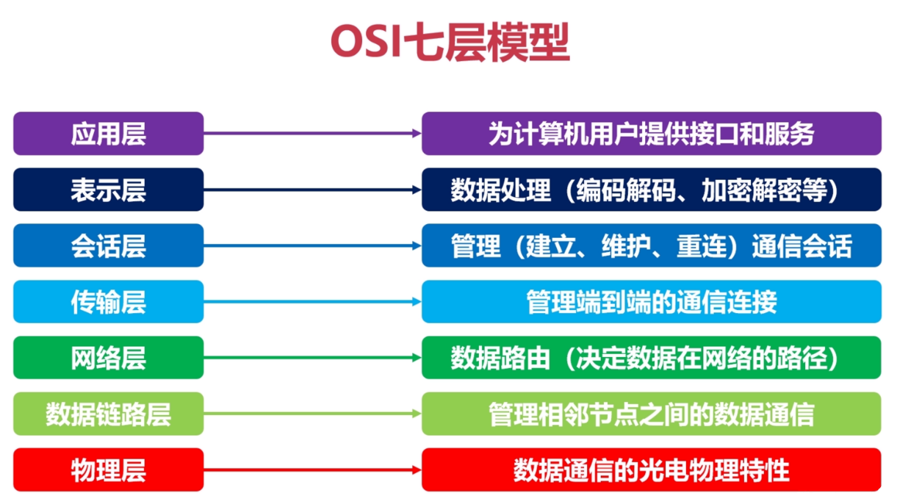

## 计算机之间是如何通信的

### 原始时代

两台计算机之间如何通信呢？只需要给两台电脑连上一根网线就好了！

那么多台计算机如何通信呢？是不是把每台计算机用网线连接起来？

这样是可以的，但是这样成本太高，操作也不方便。于是我们把所有计算的的线拧在一起，这样也可以海鲜多台计算机值得相互通信！

### 集线器

这个拧在一起的线团就是集线器。

> 每台设备会有一张网卡，网卡会带着mac地址，这个就是该设备的标识。咱们再找一台计算机，给他多设计几个网口，我们每个人都连到这台计算机的网口上，不也实现咱们哥几个之间的互连了吗。
>
> 这个本身具备多个网口，专门实现多台计算机的互联作用的微型计算机就是集线器（HUB）。

顾名思义，集线器起到了一个将网线集结起来的作用，实现最初级的网络互通。集线器是通过网线直接传送数据的，我们说他工作在物理层。

集线器仅仅是将每台计算机的消息转发(广播)给所有人，不做其他任何处理。

由于转发到了所有出口，那 BCDE 四台机器怎么知道数据包是不是发给自己的呢？

**首先，**你要给所有的连接到集线器的设备，都起个名字。怎么取名呢？总不能叫ABCD吧！其实每台计算机都有一个网卡设备，而这个网卡设备在生产时，就已经在网卡(Network lnterface Card)的EPROM(一种闪存芯片，通常可以通过程序擦写)上烧录一个MAC地址！

> MAC地址也叫物理地址、硬件地址。

MAC地址由48位二进制数（6个字节）组成，通常表示为12位十六进制数 [9]，格式为XX-XX-XX-XX-XX-XX 。如：00-16-EA-AE-3C-40就是一个MAC地址，其中前3个字节，16进制数00-16-EA代表网络硬件制造商的编号，它由[IEEE](https://baike.baidu.com/item/IEEE/150905?fromModule=lemma_inlink)(电气与电子工程师协会)分配，而后3个字节，16进制数AE-3C-40代表该制造商所制造的某个网络产品(如网卡)的系列号。只要不更改自己的MAC地址，MAC地址在世界是唯一的。形象地说，MAC地址就如同身份证上的身份证号码，具有唯一性 。

**这样，**A 在发送数据包给 B 时，只要在头部拼接一个这样结构的数据，就可以了。

B 在收到数据包后，根据头部的目标 MAC 地址信息，判断这个数据包的确是发给自己的，于是便**收下**，不是发给自己的，于是便**丢弃**。

### 交换机

由于集线器广播的特点，在网络上数据量很大的情况下，会形成**广播风暴**。

> 网络上的广播帧由于被转发，数量急剧增加而出现无法正常网络通信的反常现象。广播风暴会占用相当可观的网络带宽，导致正常数据包无法正常运行。当广播数据充斥网络无法处理并占用大量网络带宽，导致正常业务不能运行，这就发生了广播风暴，造成局域网局部或整个网络瘫痪。

所以我们需要交换，来为接入交换机的任意两个网络节点提供独享的电信号通路。

> 网络节点是指一台电脑或其他设备与一个有独立地址和具有传送或接收数据功能的网络相连。比如：交换机、计算机、手机、平板、路由器等

**那么交换机是如何工作的呢？**

交换机内部维护一张 **MAC 地址表**，记录着每一个 MAC 地址的设备，连接在其哪一个端口上。

| MAC地址  | 端口  |
| -------- | ----- |
| BL:AC:K0 | 端口1 |
| GR:EE:NO | 端口3 |
| PU:RP:LE | 端口2 |
| OR:AN:GE | 端口4 |

此时当，**黑色**计算机想要给**橙色**计算机发送消息，需要在数据包中带上**源MAC地址**和**目标MAC地址**，并发送给交换机。

当交换机收到消息后，根据MAC地址表能直接找到目标MAC地址对应的端口，所以就直接把消息发送给**端口4**也就是橙色计算机。

随着机器数量越多，交换机的端口也不够了，但聪明的你发现，只要将多个交换机连接起来，这个问题就轻而易举搞定~

你完全不需要设计额外的东西，只需要按照之前的设计和规矩来，按照上述的接线方式即可完成所有电脑的互联，所以交换机设计的这种规则，真的很巧妙。

但是你要注意，上面那根蓝色的线，最终在 MAC 地址表中可不是一条记录呀，而是要把右边这三台机器与该端口的映射全部记录在表中。

最终，**两个交换机将分别记录这6台计算机和另外一个交换机的所有MAC映射记录**。

这在只有 6 台电脑的时候还好，甚至在只有几百台电脑的时候，都还好，所以这种交换机的设计方式，已经足足支撑一阵子了。

但很遗憾，人是贪婪的动物，很快，电脑的数量就发展到几千、几万、几十万。

### 路由器

交换机已经无法记录如此庞大的映射关系了。

此时你动了歪脑筋，你发现了问题的根本在于，连出去的那根红色的网线，后面不知道有多少个设备不断地连接进来，从而使得地址表越来越大。

那我可不可以让那根红色的网线，接入一个**新的设备**，这个设备就跟电脑一样有自己独立的 MAC 地址，而且同时还能帮我把数据包做一次**转发**呢？

这个设备就是路由器，**它的功能就是，作为一台独立的拥有 MAC 地址的设备，并且可以帮我把数据包做一次转发，你把它定在了网络层**

注意，路由器的每一个端口，都有独立的 MAC 地址

好了，现在交换机的 MAC 地址表中，只需要多出一条 路由器的MAC地址与其端口的映射关系，就可以成功把数据包转交给路由器了，这条搞定。

那现在如果**左边的黑色计算机**想要发送消息给**右边的黑色计算机**，如何实现的呢？

你会发现实现不了了，为啥？因为左边交换机中没有存储右边黑色电脑的MAC地址，从而当左边交换机收到黑色电脑发出的消息后，在MAC地址表中找不到对应的记录，所以将消息丢弃了！

那为什么交换机不把消息发送给路由器，然后让路由器继续转发，从而找到对方的MAC地址呢？

### IP地址

因为路由器是属于网络层的设备，他不能查找MAC地址，而是要使用另一种地址，**IP地址！**

> IP地址是互联网协议（Internet Protocol）为每台联网设备分配的唯一标识符，由一串数字（IPv4）或字母与数字组合（IPv6）构成。
>
> **IPv4（主流）：**32位二进制，通常写成四组十进制数，如 192.168.1.1。
>
> ​	示例：11000000.10101000.00000001.00000001 → 192.168.1.1
>
> **IPv6（下一代）：**128位，写成八组十六进制数，如 2001:0db8:85a3::8a2e:0370:7334。
>
> ​	特点：地址空间近乎无限，可满足物联网（IoT）的海量需求。

现在每一台电脑，同时有自己的 MAC 地址，又有自己的 IP 地址，只不过 IP 地址是**软件层面**上的，可以随时修改，MAC 地址一般是无法修改的。

**那么使用IP地址是如何通信的呢？**

现在两个设备之间传输，除了加上数据链路层的头部之外，还要再增加一个网络层的头部。

假如左边的黑色计算机要给左边的橙色计算机发消息，则发送的整个消息结构为:

假如左边的黑色计算机要给右边的橙色计算机发消息，则发送的整个消息结构为:

好了，上面说的两种情况，相信细心的读者应该会有不少疑问，下面我们一个个来展开。

### 子网掩码

对于计算机、服务器、手机、路由器等需要IP地址的设备，子网掩码是**至关重要**的。它的核心作用只有一个：**判断目标设备是否和自己在同一个局域网（子网）内。**

这个过程如下：

#### 获取目标IP：

当你的计算机（IP地址为192.168.0.1）想要将消息发送给另一台设备（192.168.0.2）时，它首先会拿出自己的子网掩码（225.225.225.0）和两个IP地址进行与运算。

192.168.0.1 & 225.225.225.0 = **192.168.0.0**

192.168.0.2 & 225.225.225.0 = **192.168.0.0**

这个通过与运算得出的结果就是网络号，网络号就是ip地址中的网络地址，用ip地址和子网掩码的二进制数进行“与”运算即可得出网络号。

#### 做出决策

+ 如果两个网络号（上面两个就是相同的），计算机就认为目标设备和自己在同一个子网。它会直接发送ARP广播请求，询问目标IP的MAC地址，然后封装数据帧，直接发送给目标设备。
+ 如果两个网络号不同，计算机就认为目标设备在另一个网络（比如互联网上的一个服务器）。它会将数据包发送给预先配置好的网关（通常就是路由器），由路由器来决定如何将数据包送达目的地。

**所以，对于计算机和路由器来说，子网掩码是定义网络边界、做出路由决策的根本依据。**

### 端口

现在两台计算机能相互之间通信了，那么计算机中有很多程序，那么怎么知道是哪个程序和哪个程序通信呢？

**端口（Port）** 就是为了解决这个问题而诞生的。它在IP地址的基础上，为电脑内部的每一个需要进行网络通信的**应用程序（或服务）** 分配一个唯一的数字标识。

> 因此，端口的“产生”是网络协议设计者为了实现**一台主机上的多个应用程序可以同时并行网络通信**而发明的机制。

端口号是一个16位的数字，范围是[0~65535]，这些端口又分为三种端口：

| 端口范围 | 类型 | 说明 |
| -------- | ---- | ---- |
|0~1023	|知名端口（Well-Known）|	分配给系统或核心服务（如HTTP:80、HTTPS:443、SSH:22），需管理员权限使用。|
|1024~49151	|注册端口（Registered）| 分配给用户级应用（如MySQL:3306、Redis:6379） |
|49152~65535|	动态/私有端口（Dynamic）|	临时分配给客户端程序（如浏览器访问网站时随机生成）。|

> [在线常用端口大全](https://www.bchrt.com/tools/common-ports/)

当消息到达操作系统后，会根据端口号把消息发给指定的进程！

## 协议

### OSI模型

 开放式系统互联通信参考模型（英语：Open System Interconnection Reference Model，缩写：OSI；简称为OSI模型）是一种概念模型，由国际标准化组织提出，一个试图使各种计算机在世界范围内互连为网络的标准框架。

**（1） 应用层**

​	针对特定应用协议，为应用程序或用户请求提供各种请求服务，**规定应用程序的相关通信细节**。

​	OSI参考模型最高层，也是最靠近用户的一层，为计算机用户、各种应用程序以及网络提供接口，也为用户直接提供各种网络服务。

**（2）表示层**

​	**数据编码、格式转换、数据加密。**

​	该层可提供一种标准表示形式，用于将计算机内部的多种数据格式转换成通信中采用的标准表示形式，确保一个系统的应用层发送的数据能被另一个系统的应用层识别。

​	数据压缩和加密也属于表示层可提供的转换功能。

**（3）会话层**

​	**通信管理**：负责建立、管理和终止表示层实体之间的通信会话，支持它们之间的数据交换。

​	该层的通信由不同设备中的应用程序之间的服务请求和响应组成。

**（4）传输层**

​	**管理两个节点之间的数据传输**：建立主机端到端的链接，为会话层和网络层提供端到端**可靠的**和**透明的**数据传输服务，确保数据能完整的传输到网络层。

**（5）网络层**

​	**地址管理及路由选择**：通过路由选择算法，为报文或通信子网选择最适当的路径。控制数据链路层与传输层之间的信息转发，建立、维持和终止网络的连接。数据链路层的数据在这一层被转换为数据包，然后通过路径选择、分段组合、顺序、进/出路由等控制，将信息从一个网络设备传送到另一个网络设备。

**（6）数据链路层**

​	**互联设备的数据帧传送和链路管理**：接收来自物理层的位流形式的数据，封装成帧，传送到网络层；将网络层的数据帧，拆装为位流形式的数据转发到物理层；负责建立和管理节点间的链路，通过各种控制协议，将有差错的物理信道变为无差错的、能可靠传输数据帧的数据链路。

**（7）物理层**

​	管理通信设备和网络媒体之间的互联互通。传输介质为数据链路层提供物理连接，实现比特流的透明传输。实现相邻计算机节点之间比特流的透明传送，屏蔽具体传输介质和物理设备的差异。

### TCP/IP四层模型

TCP/IP四层模型和ISO七层模型有许多相同点和不同点，首先是分层上，可以明显看出，TCP/IP四层模型是OSI七层模型的简化版，但是大致的核心内容是很类似的。虽然OSI跟容易开发和排除故障，但是相较于简洁的TCP/IP，显得庞大而笨拙。十分有趣的是，OSI虽然是官方提出的，但是由于一些原因，在它被完善之前，由民间开发的TCP/IP早已投入实际使用了，所以它几乎是只存在与教科书中，并没有大范围地投入使用。

### 协议格式

#### 数据包解封包

通信过程中，每层协议都要加上一个数据首部（header），称为封装（Encapsulation），如下图所示。

> 不同的协议层对数据包有不同的称谓，在传输层叫做段（segment），在网络层叫做数据包（datagram）,在链路层叫做帧（frame）。数据封装称帧后发到传输介质上，到达目的主机后每层协议再剥掉相应的首部，最后将应用层数据交给应用程序处理。

#### TCP数据报

TCP（传输控制协议）是一种面向连接的、可靠的、基于字节流的传输层通信协议。它的数据报格式包含多个字段，每个字段都有其特定的功能和意义。

TCP数据报由首部和数据两部分组成。首部一般由20-60字节构成，长度可变。其中前20字节格式固定，后40字节为可选。TCP数据报的首部包含以下字段：

- **源端口号（Source Port）**：16位，指明发送数据的进程。
- **目的端口号（Destination Port）**：16位，指明目的主机接收数据的进程。
- **序列号（Sequence Number）**：32位，用来标识从TCP发送端向接收端发送的字节流，它表示在这个报文段中的第一个数据字节。
- **确认号（Acknowledgment Number）**：32位，TCP使用确认号字段标识期望收到的下一个段的第一个字节，并声明此前的所有数据已经正确无误地收到。
- **数据偏移（Data Offset）**：4位，表示TCP报文首部的长度。
- **保留（Reserved）**：6位，必须是0，为将来定义新用途保留的。
- **标志位（Flags）**：6位，包括URG、ACK、PSH、RST、SYN、FIN等标志，用于控制TCP的状态和行为。
- **窗口大小（Window Size）**：16位，TCP流量控制由连接的每一端通过声明的窗口大小来提供。
- **校验和（Checksum）**：16位，覆盖整个TCP报文端，用于检验报文的完整性。
- **紧急指针（Urgent Pointer）**：16位，指向数据中优先部分的最后一个字节，通知接收方紧急数据的长度。
- **选项（Options）**：长度可变，提供了一些额外的功能或对TCP协议进行扩展。

#### UDP数据报

UDP（用户数据报协议）是一种无连接的网络协议，它在IP协议的基础上提供了端口和简单的差错检测功能，以实现进程间的数据传输。UDP数据报的格式简洁，由两部分组成：UDP报头和数据区。

UDP报头由四个字段组成，每个字段占16位（2字节），总共8字节。这四个字段分别是：

- **源端口**：这是发送方使用的端口号，用于接收方回发消息时的目的端口。如果发送方不需要回复，则该字段可以设置为0。
- **目的端口**：这是接收方使用的端口号，用于确定数据报的最终接收进程。
- **长度**：表示UDP数据报的总长度，包括报头和数据区。最小值为8字节，因为UDP报头本身就是8字节。
- **校验和**：用于检测数据在传输过程中是否出现错误。校验和的计算包括UDP报头、数据区和一个伪首部，伪首部包含了一些来自IP层的信息，如源地址、目的地址、协议类型和UDP长度。

#### IP段

IP数据报是TCP/IP协议中用于传输数据的基本单元，由**首部**和**数据部分**组成。首部的前20字节是固定部分，包含关键信息，而后续部分为可选字段，长度可变。

**版本**：占4位，表示IP协议版本，如IPv4或IPv6。当前广泛使用的是IPv4。

**首部长度**：占4位，单位为4字节，表示首部的总长度。最常见的长度为20字节。

**区分服务**：占8位，用于服务质量（QoS）控制，但实际应用中较少使用。

**总长度**：占16位，表示整个数据报（首部+数据）的长度，最大值为65535字节。

**标识**：占16位，用于标识数据报。当数据报被分片时，所有分片共享相同的标识值。

**标志**：占3位，包含以下信息：

- DF（Don't Fragment）：是否允许分片。
- MF（More Fragment）：是否还有后续分片。

**片偏移**：占13位，表示分片在原数据报中的相对位置，单位为8字节。

**生存时间（TTL）**：占8位，表示数据报在网络中的最大跳数，防止数据报在网络中无限循环。

**协议**：占8位，指示数据部分使用的协议类型，如TCP（6）、UDP（17）、ICMP（1）。

**首部校验和**：占16位，仅校验首部部分，用于检测传输中的错误。

**源地址和目的地址**：各占32位，分别表示数据报的发送方和接收方IP地址。

**可选字段**：用于支持测试、调试或安全功能，如时间戳、路由记录等。

#### MAC帧

网络接口层中，会对MAC帧加上MAC头和检测帧尾(FCS)。

其中，MAC头占用14字节、FCS（Frame Check Sequece）(帧校验码)长4个字节，用于检验数据在传输过程中数据是否出现了错误，为CRC32校验码。

| 字段名称 | 长度（byte） | 含义                                                         |
| -------- | ------------ | ------------------------------------------------------------ |
| D.MAC    | 6            | 接收方MAC地址，网络包接收方的MAC地址，在局域网中使用这一地址来传输网络包 |
| S.MAC    | 6            | 网络包发送方MAC地址，接收方通过它来判断是谁发送了这个包      |
| Type     | 2            | 使用的协议类型 TCP通信中IP协议与ARP协议较常见 0000-05DC：IEEE802.3 0800：IP协议 0806：ARP协议 86DD：IPv6 |

## B/S与C/S架构模式

B/S（Browser/Server，浏览器/服务器）和 C/S（Client/Server，客户端/服务器）是两种常见的软件架构模式，它们描述了客户端和服务器之间如何交互和分配任务。两者主要区别在于客户端的实现方式以及软件更新和维护的方式。

### B/S架构

#### B/S架构的定义

**B/S 架构**，全称 **Browser/Server 架构**（浏览器/服务器架构），是一种**分布式**的软件系统架构模式。它将应用程序的核心功能和数据处理逻辑放在**服务器端**，而用户则通过**客户端**的**Web浏览器**来访问和使用这些功能。

1. **服务器端：** 这是整个系统的“大脑”和“数据中心”。
   1. 它运行着Web服务器（如 Apache, Nginx, IIS）来接收和处理来自浏览器的请求。
   2. 它运行着应用程序服务器（如 Tomcat, JBoss, WebLogic, .NET Core, Node.js 环境）来执行业务逻辑（处理数据、进行计算、做出决策）。
   3. 它连接并管理着数据库服务器（如 MySQL, PostgreSQL, SQL Server, Oracle）来存储和检索数据。
   4. 它可能还包含其他后端服务（如文件存储、消息队列、缓存等）。
   5. 核心任务：处理业务逻辑、数据访问、安全性、并发控制等。
2. **客户端：** 用户使用的设备（电脑、手机、平板）上的 **Web 浏览器**（如 Chrome, Firefox, Safari, Edge）。
   1. 浏览器的主要职责是**呈现用户界面**和**与用户交互**。
   2. 它通过 **HTTP/HTTPS 协议**向服务器发送请求（例如，点击一个链接、提交一个表单）。
   3. 它接收服务器返回的响应，通常是 **HTML、CSS、JavaScript 文件**，以及数据（如 JSON, XML）。
   4. 浏览器解析 HTML/CSS 来渲染页面，执行 JavaScript 来实现动态交互效果。
   5. 核心任务：展示信息、收集用户输入、向服务器发送请求、处理服务器响应并更新界面。

#### B/S架构的特点

1. **客户端零安装/瘦客户端：** 用户只需要一个标准的 Web 浏览器，无需在本地安装特定的客户端软件（除了浏览器本身）。所有的应用程序逻辑都在服务器上。
2. **跨平台性：** 由于客户端是浏览器，而浏览器在各种操作系统（Windows, macOS, Linux, iOS, Android）上都有，因此 B/S 应用天然具有跨平台特性。用户使用不同设备上的不同浏览器，只要能访问网络，就能使用应用。
3. **集中部署与维护：**应用程序的主要代码和数据都集中在服务器端。这使得：
   1. **部署和升级非常方便：** 只需要在服务器端更新一次，所有用户下次访问时就能自动使用新版本。
   2. **维护成本低：** 管理员只需要维护服务器环境，无需到每个用户机器上去维护客户端软件。
   3. **数据安全更有保障：** 核心业务数据存储在服务器端，相对不易因客户端问题（如电脑损坏、病毒）而丢失或泄露（当然服务器本身的安全至关重要）。
4. **易于扩展：** 当用户量增加时，可以通过增加服务器硬件（纵向扩展）或增加服务器数量（横向扩展，负载均衡）来提升系统性能。
5. **基于标准协议：** 主要使用 HTTP/HTTPS 协议进行通信，这是互联网的基础协议，兼容性好。
6. **用户界面：** 用户界面由 HTML、CSS 和 JavaScript 构建，可以实现非常丰富和动态的交互体验（现代 Web 应用）。

#### B/S 架构的优势

- **部署和维护成本低：** 这是最大的优势之一。
- **易于访问和使用：** 用户门槛低，随时随地可用。
- **良好的跨平台兼容性。**
- **易于扩展。**
- **数据集中管理，安全性相对可控。**

#### B/S 架构的劣势

- **用户体验：** 虽然现代 Web 技术（如 React, Vue, Angular）大大提升了体验，但在响应速度、图形处理、复杂交互等方面，有时仍不如优秀的原生 C/S 应用。
- **高度依赖网络：** 网络中断或速度慢会严重影响使用。
- **服务器压力大：** 所有计算和数据处理都在服务器端，对服务器性能和带宽要求高。
- **功能限制：** 浏览器环境出于安全考虑，对本地硬件（如特定外设、高性能 GPU）和系统资源的访问能力有限制。
- **安全性挑战：** 暴露在公网上，面临各种 Web 攻击（如 XSS, CSRF, SQL 注入）的风险。

#### 总结

B/S 架构是一种利用 Web 浏览器作为统一客户端，通过网络访问部署在远程服务器上的应用程序和数据的架构模式。它的核心优势在于**部署维护简单、跨平台性好、易于访问**，使其成为现代互联网应用（如电商网站、社交平台、在线办公系统、企业管理系统 ERP/CRM）的主流架构。虽然它在用户体验和功能深度上可能面临一些挑战，但随着 Web 技术的飞速发展（HTML5, WebAssembly, PWA 等），这些差距正在不断缩小。理解 B/S 架构是理解当今互联网应用如何运作的基础。

### C/S架构

#### C/S架构的定义

**C/S 架构**，全称 **Client/Server 架构**（客户端/服务器架构），是一种经典的**分布式计算模型**。它将应用程序的功能划分为两个主要部分：

1. **客户端：**
   1. 运行在**用户本地设备**（如个人电脑、工作站、智能手机）上的应用程序。
   2. 负责**提供用户界面**（UI），**处理用户交互**（输入、点击等），**向服务器发送请求**，以及**接收并呈现服务器返回的结果**。
   3. 通常被称为 **"胖客户端"**，因为它可能包含相当一部分的业务逻辑、数据处理或本地计算能力。
   4. 需要**在用户设备上安装特定的客户端软件**。
2. **服务器：**
   1. 运行在**网络上的高性能计算机**（服务器）上的应用程序或服务。
   2. 负责**接收来自客户端的请求**，**执行核心的业务逻辑**，**访问和管理共享资源**（如数据库、文件系统），**处理数据**，以及**将处理结果返回给客户端**。
   3. 通常设计为**高性能、高可靠性、高并发**，能够同时处理多个客户端的请求。
   4. 集中存储和管理关键数据。

**核心思想：** 客户端负责“问问题”和“展示答案”，服务器负责“思考问题”和“找答案”。它们通过网络（通常是局域网或互联网）进行通信，遵循特定的协议（如 TCP/IP, HTTP, FTP, 自定义协议等）。

#### C/S架构的特点

1. 明确的角色划分：
   1. **客户端：** 请求发起者、用户交互界面。
   2. **服务器：** 请求处理者、资源提供者、数据管理者。
2. **需要安装客户端软件：** 用户必须在自己的设备上安装特定的客户端程序才能使用服务。这是与 B/S 架构最显著的区别。
3. **网络通信：** 客户端和服务器通过网络连接进行数据交换。通信可以是持续的（如在线游戏）或按需的（如查询数据库）。
4. **可扩展性：** 可以通过增加服务器数量（横向扩展）或提升服务器性能（纵向扩展）来应对更多的客户端请求。
5. **数据集中管理：** 关键数据通常存储在服务器端的数据库中，便于统一管理、备份和安全控制。
6. 功能分布：
   业务逻辑可以在客户端和服务器之间灵活分配：
   1. **胖客户端：** 客户端承担较多的计算和业务逻辑处理，减轻服务器负担，响应更快（本地操作），但对客户端硬件要求较高，部署更新麻烦。
   2. **瘦客户端：** 客户端主要负责界面展示和简单交互，核心逻辑都在服务器端（更接近 B/S 模式）。对客户端要求低，但服务器压力大，网络依赖性强。

#### C/S 架构的优势

- **丰富的用户体验：** 客户端可以利用本地操作系统和硬件的全部能力，提供高度交互性、图形化、响应迅速的用户界面（如复杂的图形渲染、实时数据处理）。
- **强大的本地处理能力：** “胖客户端”可以在本地执行复杂计算，减轻服务器负担，并在网络中断时提供一定的离线操作能力（取决于应用设计）。
- **更高的安全性（潜在）：** 专用的客户端程序和通信协议可以设计得更安全（但并非绝对，取决于实现）。客户端不直接暴露数据库连接细节（尤其在多层架构中）。
- **高效的网络通信：** 可以使用高效的自定义通信协议，减少网络传输的数据量，优化性能（尤其对实时性要求高的应用）。
- **充分利用硬件资源：** 客户端的计算能力被充分利用。

#### C/S 架构的劣势

- **部署和维护成本高：** 最大的劣势。需要在每个用户设备上安装、配置和更新客户端软件。当用户数量庞大或分布广泛时，更新和故障排查非常耗时费力。
- **跨平台性差：** 客户端软件通常是为特定操作系统（如 Windows, macOS）编译的。要为不同平台（如再加一个 Linux 或移动平台）提供支持，需要开发、测试和维护多个版本的客户端，成本高昂。
- **客户端依赖性强：** 用户必须安装特定的客户端才能使用服务。客户端的硬件配置、操作系统版本等也可能影响软件运行。
- **升级困难：** 发布新版本客户端时，需要所有用户手动或通过复杂机制进行更新，难以保证所有用户及时升级到最新版本。
- **对网络仍有依赖：** 虽然部分功能可离线，但需要访问服务器数据或功能时，必须联网。

#### 总结

C/S 架构是一种将应用程序功能明确划分为客户端和服务器两部分的经典架构模式。其核心在于需要在用户设备上安装特定的客户端软件。它的优势在于能提供**强大的用户体验、高效的本地计算和丰富的功能**，尤其适合对性能、交互性、离线能力或特定硬件访问有高要求的场景。然而，其**高昂的部署、维护成本和较差的跨平台性**是其主要的劣势，这也是 B/S 架构得以广泛应用的重要原因。理解 C/S 架构是理解传统软件开发和现代应用架构演变的基础，它在特定领域仍然具有强大的生命力。

### 对比

| 特性     | C/S 架构 (Client/Server)                                     | B/S 架构 (Browser/Server)                      |
| -------- | ------------------------------------------------------------ | ---------------------------------------------- |
| 客户端   | 胖客户端：需要安装特定的客户端软件                           | 瘦客户端：仅需标准 Web 浏览器                  |
| 部署维护 | 分散：需在每个客户端安装/更新软件                            | 集中：服务器端更新，所有用户立即生效           |
| 跨平台性 | 弱：客户端软件通常针对特定操作系统开发                       | 强：只要有浏览器即可访问                       |
| 网络依赖 | 可低：部分功能可在客户端本地运行，离线可用                   | 高：必须联网才能使用核心功能                   |
| 用户界面 | 可充分利用操作系统特性，界面更丰富、响应更快                 | 基于 Web 技术 (HTML/CSS/JS)，风格相对统一      |
| 开发技术 | 依赖于客户端操作系统（如 C++, Java, C#/.NET）                | HTML, CSS, JavaScript, 各种 Web 框架           |
| 典型应用 | 传统桌面软件（如 Photoshop, QQ 桌面版, 大型游戏）、企业级内部系统（ERP/CRM）、高性能计算应用 | 网站、Web 应用（如 Gmail, 淘宝, 在线文档编辑） |
| 安全性   | 数据可能在客户端，有泄露风险；需保护客户端软件               | 数据在服务器端，相对安全；需防范 Web 攻击      |

## TCP连接关闭与拥塞控制

在网络通信的复杂架构里，“**三次握手**”与“**四次挥手**”仿若一座无形的桥梁，它们是连接客户端与服务器的关键纽带。这座“桥梁”不仅确保了连接的稳固建立，还保障了连接的有序结束，使得网络世界中的信息能够顺畅、准确地流动。

### 三次握手

三次握手（Three-way Handshake）是 TCP 协议中用于建立连接的一个重要环节。在这一过程中，客户端和服务器需要互相发送三个数据包，以确保双方的接收和发送能力均正常，并为后续的数据传输指定初始化序列号，从而确保数据传输的可靠性。

如图所示，双方之间的三个蓝色箭头就表示了三次握手过程中所发生的数据交换：

**第一次握手：**客户端向服务器发送报文段1，其中的 SYN 标志位的值为 1，表示这是一个用于请求发起连接的报文段，其中的序号字段 (Sequence Number，图中简写为seq)被设置为初始序号x (Initial Sequence Number，ISN)，TCP 连接双方均可随机选择初始序号。发送完报文段1之后，客户端进入 SYN-SENT 状态，等待服务器的确认。

> TCP 协议规定：`SYN=1` 的报文段是用于建立连接的请求，它不携带任何数据，但会消耗一个序号。这是 TCP 协议确保连接建立过程中的有序性和可靠性的一种方式。
>
> `SYN_SENT` 状态解释：当客户端发送连接请求后，它进入 `SYN_SENT` 状态，等待服务端的响应。在这个状态下，客户端准备好了接受服务端的连接确认。

**第二次握手：**服务器在收到客户端的连接请求后，向客户端发送报文段2作为应答，其中 ACK 标志位设置为 1，表示对客户端做出应答，其确认序号字段 (Acknowledgment Number，图中简写为小写 ack) 生效，该字段值为 x + 1，也就是从客户端收到的报文段的序号加一，代表服务器期望下次收到客户端的数据的序号。此外，报文段2的 SYN 标志位也设置为1，代表这同时也是一个用于发起连接的报文段，序号 seq 设置为服务器初始序号y。发送完报文段2后，服务器进入 SYN-RECEIVED 状态。

> TCP 协议规定：SYN=1 且 ACK=1 的报文段是用于确认连接的应答，它同样不携带任何数据，但通过确认号的使用，确保了连接建立过程中的有序性和可靠性。
>
> **SYN-RCVD 状态解析：**当服务器在收到并发送连接请求后，会进入 `SYN-RCVD` 状态，此时它正在等待对初始连接请求的确认。在这个状态下，服务器已经准备好接受来自客户端的进一步通信。

**第三次握手：**客户端在收到报文段2后，向服务器发送报文段3，其 ACK 标志位为1，代表对服务器做出应答，确认序号字段 ack 为 y + 1，序号字段 seq 为 x + 1。此报文段发送完毕后，双方都进入 ESTABLISHED 状态，表示连接已建立。

> **ESTABLISHED 状态解释：**当一个 TCP 连接进入 ESTABLISHED 状态时，它意味着连接已经打开，数据可以开始在双方之间传送。

### 四次挥手

建立一个连接需要三次握手，而终止一个连接要经过 4次握手。这由 TCP 的半关闭( half-close) 造成的。既然一个 TCP 连接是全双工 (即数据在两个方向上能同时传递)， 因此每个方向必须单独地进行关闭。这原则就是当一方完成它的数据发送任务后就能发送一个 FIN 来终止这个方向连接。当一端收到一个 FIN，它必须通知应用层另一端已经终止了数据传送。理论上客户端和服务器都可以发起主动关闭，但是更多的情况下是客户端主动发起。

四次挥手详细过程如下：

**第一次挥手：**客户端发送关闭连接的报文段，FIN 标志位1，请求关闭连接，并停止发送数据。序号字段 seq = x (等于之前发送的所有数据的最后一个字节的序号加一)，然后客户端会进入 FIN-WAIT-1 状态，等待来自服务器的确认报文。

> **FIN_WAIT_1 状态解析：**该状态表示客户端正在等待远程 TCP 的连接中断请求，或者等待先前连接中断请求的确认。FIN=1 标志着该报文段是一个连接释放请求。而 seq=x 则代表客户端向服务器发送的最后一个字节的序号。

**第二次挥手：**服务器收到 FIN 报文后，发回确认报文，ACK = 1， ack = x + 1，并带上自己的序号 seq = y，然后服务器就进入 CLOSE-WAIT 状态。服务器还会通知上层的应用程序对方已经释放连接，此时 TCP 处于半关闭状态，也就是说客户端已经没有数据要发送了，但是服务器还可以发送数据，客户端也还能够接收。

> **CLOSE_WAIT 状态解析**：在此状态下，服务端等待来自本地用户的连接释放请求。ACK 报文中的 ACK=1 表示应答，而 seq=y 则指明了服务端释放应答报文段的首字节序号。同时，ack=x+1 表明服务端希望从第 x+1 个字节开始接收报文段，并已成功接收了前 x 个字节。

**第三次挥手：**

+ 客户端收到服务器的 ACK 报文段后随即进入 FIN-WAIT-2 状态，此时还能收到来自服务器的数据，直到收到 FIN 报文段。

+ 服务器发送完所有数据后，会向客户端发送 FIN 报文段，各字段值如图所示，随后服务器进入 LAST-ACK 状态，等待来自客户端的确认报文段。

**第四次挥手：**

+ 客户端收到来自服务器的 FIN 报文段后，向服务器发送 ACK 报文，随后进入 TIME-WAIT 状态，等待 2MSL(2 * Maximum Segment Lifetime，两倍的报文段最大存活时间) ，这是任何报文段在被丢弃前能在网络中存在的最长时间，常用值有30秒、1分钟和2分钟。如无特殊情况，客户端会进入 CLOSED 状态。

+ 服务器在接收到客户端的 ACK 报文后会随即进入 CLOSED 状态，由于没有等待时间，一般而言，服务器比客户端更早进入 CLOSED 状态。

> **TIME_WAIT：**确保远程 TCP 收到连接中断请求的确认状态会持续 2MSL（最长报文段寿命）的时间。在此期间， TCP 连接并未完全释放。若在这段时间内未收到服务端的重发请求，客户端将进入 CLOSED 状态，并撤销 TCB。

### 滑动窗口

**滑动窗口**是计算机网络中用于流量控制的一种机制，它允许发送方在接收方确认之前发送多个数据帧。这种机制通过动态调整窗口的大小来适应网络的当前状态，从而提高数据传输的效率和网络的吞吐量。

#### 引入

IP 层协议属于**不可靠**的协议，IP 层并不关系数据是否发送到了对端，在复杂的网络中，由于各种各样的原因，接收到数据包的顺序不一定和发送的顺序相同，这就是**乱序问题**。这种情况下，有必要为每个包定义一个序号seq，每个包用一个校验和确保数据完整性。

然后**发送方不能不管接收方的承受能力，只顾着发**。举个栗子，一个高速公路如果没有收费站，那么车辆就会一拥而入，此时不凑巧，发生了追尾事故，导致公路拥塞，如果不控制公路的进入车辆，那么整个高速公路都会变成“露天停车场”。说到这里你可能就明白了，TCP需要这样的“收费站”，而这个收费站就是“**滑动窗口**”。

然后，平时在高速上的时候，细心的你注意到了：除了入口有个收费站，出口也有个收费站。TCP也是一样的，除了入口有发送方滑动窗口，出口处也设立有接收方滑动窗口。

对于**发送方滑动窗口（入口收费站）**，我们把数据包看成车辆，枚举它们的状态：

1. 还未进入入口收费站车辆。对应的是下图Not Sent，Recipient Not Ready to Receive。这些数据属于**发送端未发送**，同时**接收端也未准备接收的**。
2. 进入收费站，但未进入高速路。对应的是图中的Not Sent，Recipient Ready to Receive。这部分数据是**发送端未发送**，**但已经告知接收方的，这部分其实已经在窗口中（发送端缓存）**了，等待发送。
3. 在高速公路上行驶的车辆。对应的是Send But Not Yet Acknowledged。这部分数据称为**发送但没有被确认**，数据被发送出去，没有收到接收端的 ACK，认为并没有完成发送，这个属于**窗口内的数据**。
4. 到达出口收费站的车辆。对应的是Sent and Acknowledged。这些数据表示**已经发送成功并已经被确认的数据**，这些数据已经离开窗口了。

对于**接收方滑动窗口（出口收费站）**，类似发送端，接收端的数据有 4 个分类，因为接收端并不需要等待 ACK 所以它没有类似的接收并确认了的分类，情况如下

1. 车辆还未到达出口收费站。对应Not Received：有空位，还没有被接收的数据
2. 车辆到达出口收费站，但未完成缴费。对应Received Not ACK: 已经接收并，但是还没有回复 ACK，这些包可能输属于 Delay ACK 的范畴了。
3. 车辆完成缴费，但不知道走哪条路。对应Received and ACK Not Send to Process：这部分数据属于接收了数据但是还没有被上层的应用程序接收，也是被缓存在窗口内。
4. 车辆离开出口收费站。对应Received and ACK Send to Process。离开了窗口缓存。

这样讲是不是就很明白了，下面给出滑动窗口的正式定义。

1. Left edge和Right edge分别表示滑动窗口的左边界和右边界。
2. Usable Window：表示窗口的缓冲区。
3. Send Window ：发送窗口， 这部分值是有接收方在三次握手的时候进行设置的，同时在接收过程中也不断的通告可以发送的窗口大小，来进行适应。
4. Window Already Sent: 已经发送的数据，但是并没有收到 ACK。

滑动窗口所谓的“滑动”，并不是说窗口在动，而是因为数据在不断进入和离开窗口，也就是说真正“动”的是数据，下面一幅图就表示了这点：

#### 分类

滑动窗口机制有三种类型：**停止等待**、**后退N帧**和**选择重传**。这三种类型的主要区别在于发送窗口和接收窗口大小的不同。

- **停止等待协议**：发送窗口和接收窗口的大小都是1，即发送方每发送一个帧就必须等待确认。
- **后退N帧协议**：发送窗口的大小大于1，接收窗口的大小为1，即发送方可以连续发送多个帧，但接收方只按顺序接收帧。
- **选择重传协议**：发送窗口和接收窗口的大小都大于1，即发送方可以连续发送多个帧，接收方可以接收非顺序的帧，并要求发送方重传出错的帧。

#### 操作

滑动窗口的操作包括窗口的初始化、移动和调整大小。发送方在发送数据时，会根据接收方的窗口大小和自己的窗口状态来决定发送哪些帧。接收方在接收数据时，会根据自己的窗口状态来决定接收哪些帧，并通过确认帧来通知发送方哪些帧已成功接收。

当发送方收到确认帧时，它会移动窗口，释放已确认的帧的空间，并发送新的帧。当接收方处理完数据帧并准备好接收新的帧时，它也会移动窗口，并通过确认帧来通知发送方。

滑动窗口机制的优点是可以根据网络条件和接收方的处理能力动态调整窗口大小，从而提高数据传输的效率。它是TCP协议中流量控制的重要组成部分，有助于避免网络拥塞和数据丢失。

### MTU

MTU（Maximum Transmission Unit）最大传输单元，MTU 就是`IP包{TCP或UDP包{Data}`的大小的上限，所以我们的data 一旦达到一定的值使得IP包包大小超过MTU ，发送端就需要分包。接收端就需要组包。

可以通过增加MTU值来增加数据的传输效率。

1、MTU(Maximum Transmission Unit) 大小指的是一个以太帧(Ethernet Frame)能携带的最大数据部分(payload)的大小, 当MTU值设置为9000 Bytes的时候也叫做巨型帧(Jumbo Frame)

2、一般情况下网卡的MTU大小是1500(最大可配置到9000)，可以通过增加MTU值来增加数据的传输效率，MTU的增加即每帧(Frame)传输的数据量就会更大。

3、网络中的所有节点必须同时增大MTU，网络中小MTU的节点遇到上家发来的大于MTU的Frame（且没有切分标记），则直接丢弃

### MASS

最大报文段长度（MSS: Maximum Segment Size）表示TCP传往另一端的最大块数据的长度。当一个连接建立时，连接的双方都要通告各自的MSS。

通常TCP通信的双方协商这个值，以避免TCP分片。一般说来，如果没有分段发生， MSS还是越大越好。报文段越大允许每个报文段传送的数据就越多，相对IP和TCP首部/有效载荷payload的比率就越低，就有更高的网络利用率。避免分片还能减少IP报文数量（每个TCP 分片都会对应一个IP报文），则减少了路由查询，IP/TCP头开销等等网络资源。MSS值通常设置为外出接口上的MTU长度减去固定的IP首部和TCP首部长度。对于一个以太网， MSS值可达1460字节（1500-20-20）。

## 面试题

### 1. 为何 TCP 建立连接时采用三次握手而非两次或四次？

- **两次不够**：无法确认客户端的接收能力（若服务端的`SYN-ACK`丢失，客户端不知服务端已就绪）。
- **四次冗余**：三次已能确保双向通信能力，无需额外交互。

具体原因如下：

1. **确保双方都能发送和接收**：三次握手可以确保双方都具备发送和接收数据的能力。在第一次握手时，客户端发起请求，第二次握手时，服务器确认收到了请求并表示自己也可以通信，第三次握手时，客户端确认收到了服务器的响应。这保证了通信的可靠性。
2. **防止重复连接初始化问题**：假设没有三次握手，而是两次握手，那么可能会出现一种情况：客户端发送了一个连接请求（SYN），但由于网络问题，服务器没有及时收到或者延迟了。客户端在等待了一段时间后认为请求失败，重新发送了一个新的 SYN，而此时第一个 SYN 报文延迟到达服务器，服务器误认为客户端又发起了一次新的连接请求，从而产生混乱。通过三次握手，能够有效避免这种问题，确保连接的一致性。
3. **同步初始序列号**：三次握手过程中，客户端和服务器会相互交换各自的初始序列号，以保证接下来的数据传输能够按顺序接收和处理。这是实现TCP可靠传输的关键步骤之一。

三次握手的设计主要是为了确保在不可靠的网络环境中，TCP连接的建立过程能够具有可靠性和一致性，并能够防止潜在的错误连接。

### 2. 为何 TCP 关闭连接时需要四次挥手？

1. **保证双方数据完整性**：在关闭连接之前，双方需要确认所有数据已经被成功接收。第一次挥手时，客户端发送 FIN 报文，表示自己不再发送数据，但仍然可以接收数据。第二次挥手时，服务器确认收到这个 FIN，并且可以继续发送数据。第三次挥手时，服务器发送自己的 FIN 报文，表示自己也不再发送数据。最后，客户端确认服务器的 FIN，确保双方都完成了数据传输。
2. **分半关闭（Half-Close）**：TCP 连接是全双工的，这意味着数据可以双向流动。四次挥手允许连接的一方关闭数据发送通道，但仍然可以接收数据，直到另一方也关闭发送通道。因此，四次挥手过程允许双向关闭连接，确保双方都能完成数据传输。
3. **确保完整关闭**：客户端在进入`TIME-WAIT`状态后，会等待一段时间以确保服务器收到了最后的 ACK 报文。这段时间可以避免因网络延迟等问题导致的重复数据问题，确保连接完全关闭后再释放资源。

### 3. 为何 TIME_WAIT 状态需持续 2MSL 后才能转为 CLOSE 状态？

当 TCP 连接的一方完成连接释放后，会进入 TIME_WAIT 状态。这个状态需要持续 2 倍的最大段寿命（Maximum Segment Lifetime，MSL）的时间，这是为了确保在传输过程中可能存在的延迟数据包能够被对方完全接收。只有当 2MSL 时间过去后，确认对方已收到所有数据，该 TCP 连接才能完全关闭，进 入CLOSE 状态。

1、**确保服务端能够接收到客户端的确认应答。**

如果客户端在发送完确认应答后立即进入 CLOSED 状态，而该应答不幸丢失，服务端在等待超时后将尝试重新发送连接释放请求。但此时，由于客户端已经关闭，无法再作出响应，这会导致服务端无法正常关闭 TCP 连接。因此，TIME_WAIT 状态的持续存在，是为了保证服务端能够接收到并处理客户端的确认应答，从而确保连接的平滑关闭。

2、**防止“三次握手”中提及的“已失效的连接请求报文段”干扰当前连接。**

当客户端发送完最后一个确认报文后，经过 2MSL 的时间间隔，可以确保在本连接持续时间内产生的所有报文段都已从网络中清除。这样，新建立的连接就不会受到旧连接请求报文的影响。

3、**为什么是 2MSL？**

2MSL 的时间是从客户端收到 FIN 报文段后发送给服务器 ACK 开始计时的，考虑到重传的因素，那么就需要服务器再次给客户端传 FIN+ACK 报文段。

保证在两个传输方向上的尚未被接收或迟到的报文段都消失，理论上保证最后一个报文可靠到达，就需要 2MSL，一个方向一个 1MSL。

### 4. CLOSE_WAIT 状态有什么影响？

当服务器收到客户端的 FIN，并回复了 ACK 后，会进入 CLOSE_WAIT 状态，此时 TCP 链接处于半关闭状态。CLOSE_WAIT 状态一直存在就说明服务器没有调用 close 并没有发送 FIN 报文段。而服务期长期保持这个状态，就会一直占用这大量的 socket 文件描述符，大量的 CLOSE_WAIT 状态存在就会导致文件描述符被占用，一些客户端无法连接。

### 5. TIME_WAIT和CLOSE_WAIT的区别？

CLOSE_WAIT 状态是被动关闭的一端在接收到另一端关闭请求过后并将 ACK 发送出去后所处的状态。这种状态表示：收到了对端关闭的情况，但是本端还没有完成工作，未关闭。

TIME_WAIT 状态是主动关闭一端在本端已经关闭的前提下，收到对端的关闭请求并且将 ACK 发送出去所处的状态。这种状态表示：双方都已经完成工作，只是为了确保迟来的数据报能被识别丢弃，可靠的终止 TCP 连接。

### 6. 为什么连接的时候是三次握手，关闭的时候却是四次挥手？

因为当服务端收到客户端的 SYN 连接请求报文后，可以直接发送 SYN+ACK 报文。其中 ACK 报文是用来应答的，SYN 报文是用来同步的。

但是关闭连接时，当服务端收到 FIN 报文时，很可能并不会立即关闭 SOCKET，所以只能先回复一个 ACK 报文，告诉客户端，“你发的 FIN 报文我收到了”。只有等到我服务端所有的报文都发送完了，我才能发送 FIN 报文，因此不能一起发送。故需要四步握手。

### 7. 如果已经建立了连接，但是客户端突然出现故障了怎么办？

TCP 设有一个保活计时器，显然，客户端如果出现故障，服务器不能一直等下去，白白浪费资源。服务器每收到一次客户端的请求后都会重新复位这个计时器，时间通常是设置为 2 小时，若 2 小时还没有收到客户端的任何数据，服务器就会发送一个探测报文段，以后每隔 75 分钟发送一次。若一连发送 10 个探测报文仍然没反应，服务器就认为客户端出了故障，接着就关闭连接。

### 8. 在三次握手中，SYN 和 ACK 的作用是什么？

在 TCP 的三次握手中，SYN 和 ACK 确保了连接的建立和通信的同步。

- SYN（Synchronize）是 TCP 协议中的一个标志位，用于在建立连接时进行通信的同步。在三次握手的第一次交互中，客户端发送一个 SYN=1，ACK=0 标志的数据包给服务端，请求建立连接。这个 SYN 包的作用是向服务端发起连接请求，并附带一个序列号（Sequence Number），用于标识后续发送的数据包。SYN 标志位的设置表示客户端希望建立一个新的连接或确认一个连接请求；
- ACK（Acknowledgement）是确认标志，用于确认接收到的数据包。在第二次握手中，服务端收到客户端的 SYN 包后，会发送一个 SYN=1，ACK=1 标志的数据包给客户端。这个 SYN+[ACK 包](https://zhida.zhihu.com/search?content_id=257963807&content_type=Article&match_order=1&q=ACK+包&zhida_source=entity)的作用是告诉客户端，服务端已经收到了连接请求，并允许建立连接。同时，ACK=1 表示服务端对客户端发送的 SYN 包进行了确认。此外，服务端也会发送自己的序列号给客户端，用于后续的数据传输。
- 在第三次握手中，客户端收到服务端的 SYN+ACK 包后，会发送一个 SYN=0，ACK=1 的数据包给服务端。这个 ACK 包的作用是告诉服务端，客户端已经收到了 SYN+ACK 包，并对服务端的 SYN 包进行了确认。
- 至此，三次握手完成，TCP 连接建立成功，双方可以开始进行数据传输。

在整个过程中，SYN 和 ACK 标志位确保了连接的建立和通信的同步。SYN 用于发起连接请求和标识序列号，而ACK 用于确认接收到的数据包。这种机制可以有效地确保数据的可靠传输和连接的稳定性。

### 9. 三次握手过程中可以携带数据吗？

在 TCP 的三次握手过程中，SYN 和 SYN+ACK 报文段是不携带数据的，它们仅仅用于建立连接时的同步和确认。但是，最后一次的 ACK 报文段是可以携带数据的。这是因为当发送方收到对方的 SYN+ACK 报文段后，连接就已经建立了，此时发送方就可以立即发送数据，而这个数据就可以和 ACK 报文段一起发送，从而提高了效率。

虽然第三次握手可以携带数据，但在实际网络编程中，并不推荐这样做。因为这样做可能会带来一些问题，比如接收方可能无法及时准备好接收数据，导致数据丢失或乱序。

因此，通常建议将数据的发送放在三次握手完成之后进行，以确保数据的可靠传输。

### 10. TCP 连接中的半连接队列和全连接队列是什么？

TCP 连接中的半连接队列（也称为 SYN 队列）用于存储处于 TCP 三次握手过程中第一步的连接请求。

当服务端收到客户端发起的 SYN 请求后，内核会把该连接存储到半连接队列中，等待完成三次握手的过程。此时，连接请求还没有完成握手，因此被认为是“半连接”。如果半连接队列满了，新来的连接请求可能会被丢弃或者根据系统配置发送 RST 报文。

全连接队列就是已经完成三次握手，建立起连接的就会放在全连接队列中。

半连接队列的主要作用是管理并跟踪那些尚未完全建立的连接，确保在三次握手完成之前，这些连接请求能够得到妥善的处理。它是 TCP 协议保证连接可靠性和性能的重要机制之一。

需要注意的是，当服务端并发处理大量请求时，如果 TCP 半连接队列过小，就容易出现溢出的情况，导致后续的请求被丢弃，从而影响服务端的请求处理能力。因此，合理设置和调整半连接队列的大小对于优化网络性能和提升系统稳定性具有重要意义。

### 11. TCP 连接中 ISN(Initial Sequence Number)是什么？

在 TCP 连接中，ISN（Initial Sequence Number，初始序列号）是每个 TCP 连接在建立时由 TCP 协议为每一个数据包所赋予的序列号。它是 TCP 可靠传输的一个重要组成部分，用于确保数据的顺序性和完整性。

- 当 TCP 连接建立时，客户端和服务器都会选择一个初始序列号（ISN）作为它们发送的第一个数据包的序列号。这个序列号是一个随机值，通常不会重复，用于标识该连接中的每一个数据包的顺序。
- 在数据传输过程中，TCP 协议会根据数据包的发送顺序为每个数据包分配一个递增的序列号。ISN 可以看作是一个 32 比特的计数器，每 4ms 加 1 。
- 通过序列号，接收方可以准确地按照发送方的发送顺序来重组数据，从而确保数据的顺序性。
- 此外，序列号还可以用于检测丢失或重复的数据包。当接收方发现数据包的序列号不连续时，它会向发送方发送一个 ACK（确认）消息，请求发送方重传丢失的数据包。同样地，如果接收方接收到一个重复的数据包（即具有相同序列号的数据包），它可以通过序列号来识别并丢弃这个重复的数据包。

因此，ISN 在 TCP 连接确保了数据的顺序性和完整性，为 TCP 的可靠传输提供了基础。

### 12. 为什么 TCP 连接建立需要发送序列号？

TCP 连接建立需要发送序列号的原因主要有以下几点：

- **确保数据的顺序性：** TCP 是一个面向连接的、可靠的、基于字节流的传输层通信协议。在 TCP 通信中，发送方和接收方都需要按照数据的发送顺序来接收和处理数据。序列号用于标识每一个发送的数据包，确保接收方能够按照正确的顺序重组数据。
- **实现可靠传输：** TCP 通过序列号来实现数据的可靠传输。当接收方收到数据包后，会向发送方发送一个确认（ACK）消息，告知已经成功接收到的数据包的序列号。如果发送方在某个时间点内没有收到某个数据包的 ACK，它会认为该数据包丢失，并重新发送该数据包。序列号使得发送方能够准确地知道哪些数据包已经成功发送并被接收，哪些数据包需要重传。
- **处理网络中的数据包乱序：** 在网络传输过程中，由于网络拥塞、路由变化等原因，数据包可能会乱序到达接收方。通过序列号，接收方能够识别并重新排序这些乱序的数据包，确保数据的完整性和正确性。
- **流量控制和拥塞控制：** TCP 还利用序列号来实现流量控制和拥塞控制。发送方会根据接收方的确认消息和当前的网络状况来调整发送速率，以避免网络拥塞和数据丢失。序列号在这个过程中起到了关键作用，帮助发送方和接收方协调数据的发送和接收。

TCP 连接建立需要发送序列号是为了确保数据的顺序性、实现可靠传输、处理网络中的数据包乱序以及实现流量控制和拥塞控制。这些功能共同保证了 TCP 能够提供高效、可靠的数据传输服务。

### 13. 在 TCP 通信中，如果一方突然崩溃，另一方如何知道？

在 TCP 通信中，如果一方突然崩溃（例如，由于硬件故障、操作系统崩溃或应用程序异常终止），另一方通常通过以下几种机制来检测这种情况：

- **心跳机制（Keep-Alive）：** TCP 本身并没有一个显式的“心跳”机制，但许多操作系统和应用程序层协议实现了这种机制。通过定期发送小的数据包（通常称为“探测包”或“心跳包”），接收方可以通知发送方它仍然存活并且连接仍然有效。如果发送方在一段时间内没有收到响应，它可能会认为接收方已经崩溃，并关闭连接。
- **超时重传和重试：** TCP 使用超时重传机制来处理丢失的数据包。当发送方发送一个数据包后，它会等待一个确认（ACK）。如果在一定的超时时间内没有收到 ACK，发送方会重传该数据包。如果经过多次重传仍然未收到确认，发送方会认为连接已经中断，并关闭连接。同样，接收方在收到乱序的数据包或数据包丢失时，也会通过发送重复 ACK 或通知发送方进行快速重传来处理。
- **应用层协议**： 除了 TCP 本身的机制外，应用层协议（如 HTTP、FTP 等）通常也会实现自己的连接管理和错误处理机制。这些协议可能会定义特定的消息或命令来通知对方连接已经中断，或者通过超时和重试策略来处理突然的崩溃。
- **操作系统和网络栈的通知：** 在某些情况下，当一方崩溃时，操作系统或网络栈可能会向另一方发送一个特殊的信号或错误消息。例如，当 TCP 连接的一方异常终止时，操作系统可能会向另一方发送一个 RST（重置）数据包来关闭连接。

由于网络的复杂性和不确定性，有时候即使一方崩溃，另一方也可能无法立即检测到。这取决于网络状况、操作系统的实现以及应用层协议的设计。因此，在设计和实现基于 TCP 的应用程序时，应该考虑到这种可能性，并采取相应的错误处理和恢复策略。

[一文搞懂OSI参考模型与TCP/IP-阿里云开发者社区](https://developer.aliyun.com/article/1459877)

[(85 封私信 / 87 条消息) 有了 IP 地址，为什么还要用 MAC 地址？ - 知乎](https://www.zhihu.com/question/21546408)