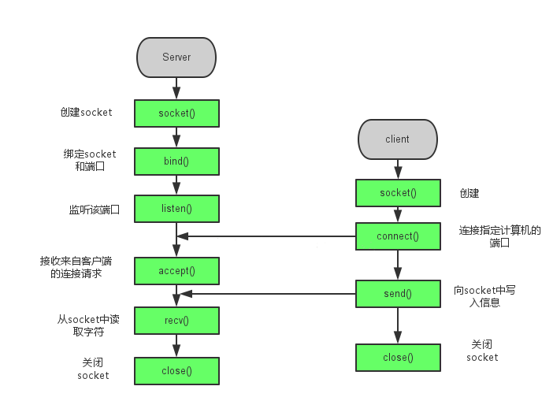

# socket

## 简介

套接字(Socket)，就是对网络中不同主机上的应用进程之间进行双向通信的端点的抽象。一个套接字就是网络上进程通信的一端，提供了应用层进程利用网络协议交换数据的机制。

Socket API 是网络编程中用于在应用层和传输层之间进行通信的接口。它将复杂的 TCP/IP 操作抽象为几个简单的接口，供应用层调用，实现进程在网络中的通信。

## 通信流程

### 流程图



### 服务端(server)

服务端的核心角色是**被动等待并处理来自客户端的连接请求**。它就像一个公司的总机接线员，守候在固定的电话号码上，等待任何客户来电并将其转接到正确的部门。

> #include <sys/socket.h>

#### 创建 Socket

使用 *socket()* 函数创建一个通信端点，并返回一个指向该端点的文件描述符。其定义如下：

```c
int socket(int domain, int type, int protocol);
```

**参数：**

- *domain* 参数指定通信域，如 *AF_INET*（IPv4 网络协议）。
- *type* 参数指定 socket 类型，如 *SOCK_STREAM*（TCP）或 *SOCK_DGRAM*（UDP）。
- *protocol* 参数通常为 0，由系统自动选择。

**返回值：**成功返回新的套接字文件描述符，失败返回-1。

#### 绑定地址

使用 *bind()* 函数将创建的 socket 绑定到指定的 IP 地址和端口上：

```c
int bind(int sockfd, const struct sockaddr *addr,socklen_t addrlen);
```

**参数：**

- *sockfd* 是 *socket()* 返回的描述符。
- *addr* 指定要绑定的本地 IP 和端口。
- *addrlen* 指定addr结构体的大小，使用sizeof计算！

**返回值：**成功返回0，失败返回-1。

**注意：**虽然第二个参数需要`struct sockaddr`类型的指针，但是实际使用时要使用`struct sockaddr_in`类型。

> 使用man 3 sockaddr可以查看结构体手册。
>
> `struct sockaddr`是通用套接字地址结构，但是它的操作非常麻烦，因为需要你手动填充数组来设置IP地址和端口号！
>
> `struct sockaddr_in`    "in" 代表 “Internet”，即 IPv4 地址家族。这个结构体是专门为 IPv4 设计的，它清晰地将地址的各个部分分开，便于程序员操作。

**使用实例：**

```c
struct sockaddr_in addr;
addr.sin_family = AF_INET;		//这里必须和socket第一个参数一致
addr.sin_port = htons(8080);	//设置端口，htons本地字节序转网络字节序
addr.sin_addr.s_addr = INADDR_ANY;	//绑定本地所有IP

// 我们将指向 sockaddr_in 的指针 强制转换为 指向 sockaddr 的指针
bind(server_socket, (struct sockaddr*)&addr, sizeof(addr));
```

#### 监听连接

使用 *listen()* 函数开启监听模式，等待客户端连接：

```c
int listen(int sockfd, int backlog);
```

**参数：**

- *sockfd* 是 *socket()* 返回的描述符。
- *backlog* 指定内核为此 socket 排队的最大连接个数。

**返回值：**成功返回0，失败返回-1。

#### 接受连接

使用 *accept()* 函数从已完成连接队列返回下一个建立成功的连接：

```c
int accept(int sockfd, struct sockaddr *_Nullable restrict addr,
           socklen_t *_Nullable restrict addrlen);
```

- *sockfd* 是 *socket()* 返回的描述符。
- *addr* 用于存放发起连接请求的客户端的协议地址，如果不需要可以传NULL。

#### 收发数据

使用 *send()* 和 *recv()* 函数进行数据传输：

```c
int send(int sockfd, const void *msg, int len, int flags);
int recv(int sockfd, void *buf, int len, unsigned int flags);
```

**参数：**

- *sockfd* 是 客户端 socket 描述符。
- *msg* 和 *buf* 分别是发送和接收数据的缓冲区。
- flags 填0即可。

**返回值：**

+ send：成功返回已发送的字节数，出错返回-1，对端关闭返回0
+ recv：成功返回接收到的字节数，出错返回-1，对端关闭返回0

除了`send`和`recv`函数之外，`write`和`read`函数也可以用于发送和接受数据。

```c
ssize_t write(int fd, const void buf[.count], size_t count);
ssize_t read(int fd, void buf[.count], size_t count);
```

#### 关闭 Socket

使用 *close()* 函数关闭 socket：

```c
int close(int fd);
```

Socket API 提供了一套完整的接口，用于在网络中进行可靠的通信。通过这些接口，开发者可以轻松地实现客户端和服务器之间的通信。

### 客户端(client)

客户端的核心角色是**主动向服务器发起连接请求**。它就像一位客户，知道了公司的总机号码，主动拨打过去。

#### 创建 Socket

使用 *socket()* 函数创建一个通信端点，并返回一个指向该端点的文件描述符。其定义如下：

```c
int socket(int domain, int type, int protocol);
```

**参数：**

- *domain* 参数指定通信域，如 *AF_INET*（IPv4 网络协议）。
- *type* 参数指定 socket 类型，如 *SOCK_STREAM*（TCP）或 *SOCK_DGRAM*（UDP）。
- *protocol* 参数通常为 0，由系统自动选择。

**返回值：**成功返回新的套接字文件描述符，失败返回-1。

#### 连接服务器

使用 *connect()* 函数指定服务器的IP地址和端口号，并连接服务器：

```c
int connect(int sockfd, const struct sockaddr *addr,socklen_t addrlen);
```

**参数：**

- *sockfd* 是 *socket()* 返回的描述符。
- *addr* 指定要连接的服务器 IP 和端口。
- *addrlen* 指定addr结构体的大小，使用sizeof计算！

**返回值：**连接成功返回0，失败返回-1。

#### 收发数据

使用 *send()* 和 *recv()* 函数进行数据传输：

```c
int send(int sockfd, const void *msg, int len, int flags);
int recv(int sockfd, void *buf, int len, unsigned int flags);
```

**参数：**

- *sockfd* 是 客户端 socket 描述符。
- *msg* 和 *buf* 分别是发送和接收数据的缓冲区。
- flags 填0即可。

**返回值：**

+ send：成功返回已发送的字节数，出错返回-1，对端关闭返回0
+ recv：成功返回接收到的字节数，出错返回-1，对端关闭返回0

#### 关闭 Socket

使用 *close()* 函数关闭 socket：

```c
int close(int fd);
```

## 字节序

### 简介

**字节序**就是我们平常说的大端和小端模式，引用标准的Big-Endian和Little-Endian的定义如下：

+ Little-Endian就是低位字节排放在内存的低地址端，高位字节排放在内存的高地址端。

+ Big-Endian就是高位字节排放在内存的低地址端，低位字节排放在内存的高地址端。

**主机字节序（Host Endian）：**不同的CPU有不同的字节序类型，这些字节序是指整数在内存中保存的顺序，这个叫做主机序。

**网络字节序（Network Endian）：**4个字节的32 bit值以下面的次序传输：首先是0～7bit，其次8～15bit，然后16～23bit，最后是24~31bit。这种传输次序称作大端字节序。**由于TCP/IP首部中所有的二进制整数在网络中传输时都要求以这种次序，因此它又称作网络字节序**

> 在将一个地址或端口号绑定到socket的时候，请先**将主机字节序转换成为网络字节序**，而不要假定主机字节序跟网络字节序一样使用的是Big-Endian。
>
> 请谨记对主机字节序不要做任何假定，务必将其转化为网络字节序再赋给socket。

### 转换函数

> #include <arpa/inet.h>

#### htonl/htons

`htonl/htons`将一个无符号整型从**本地字节序**转换为**网络字节顺序**，函数原型如下：

```c
uint32_t htonl(uint32_t hostlong);
uint16_t htons(uint16_t hostshort);
```

#### ntohl/ntohs

`ntohl/ntohs`将一个无符号整型从**网络字节序**转换为**主机字节顺序**，函数原型如下：

```c
uint32_t ntohl(uint32_t netlong);
uint16_t ntohs(uint16_t netshort);
```

## IP地址转换

IP地址有两种表示形式，分别是**点分十进制**的字符串表示和**数字**的二进制形式。

我们需要借助两个函数来进行转换，`inet_pton`和`inet_ntop`函数是随IPv6出现的函数，对于IPv4地址和IPv6地址都适用，函数中p和n分别代表表达（presentation)和数值（numeric)。地址的表达格式通常是ASCII字符串，数值格式则是存放到套接字地址结构的二进制值。

### inet_pton

`inet_pton`用于将点分十进制的IP地址转成数字表示的二进制地址，函数原型如下：

```c
int inet_pton(int af, const char *restrict src, void *restrict dst);
```

**参数：**

+ af 指定转换的地址类型，AF_INET 或 AF_INET6。
+ src指定点分十进制的IP地址
+ dst 缓冲区，将转换后的二进制地址写入到缓冲区中。
  + 如果af为AF_INET，则缓冲区大小应该为`sizeof(struct in_addr)(4)`
  + 如果af为AF_INET6，则缓冲区大小应该为`sizeof(struct in6_addr)(16)`

**返回值：**

+ 转换成功返回1。
+ 如果 src 中未包含表示指定地址族中有效网络地址的字符串，则返回 0。
+ 如果 af 未包含有效的地址族，则返回 -1，并将 errno 设置为 EAFNOSUPPORT。


### inet_ntop

`inet_ntop`用于将数字表示的二进制地址转成点分十进制的IP地址，函数原型如下：

```c
const char *inet_ntop(int af, const void *restrict src,
                      char dst[restrict .size], socklen_t size);
```

**参数：**

+ af 指定转换的地址类型，AF_INET 或 AF_INET6。
+ src指定数值表示的二进制的IP地址
+ dst 缓冲区，将转换后的点分十进制地址写入到缓冲区中。
+ size 缓冲区长度。
  + 如果af为AF_INET，则缓冲区大小应该为`INET_ADDRSTRLEN(16)`
  + 如果af为AF_INET6，则缓冲区大小应该为`INET6_ADDRSTRLEN(46)`

**返回值：**成功返回指向dst的指针，失败返回NULL。

### 案例

```c
#include <arpa/inet.h>
#include <stdio.h>
#include <stdlib.h>
#include <string.h>

int main(int argc, char *argv[])
{

        if (argc != 3) {
                fprintf(stderr, "Usage: %s {i4|i6|<num>} string\n", argv[0]);
                exit(EXIT_FAILURE);
        }

        //获取地址族类型
        int domain = (strcmp(argv[1], "i4") == 0) ? AF_INET :
                (strcmp(argv[1], "i6") == 0) ? AF_INET6 : atoi(argv[1]);

        //将点分十进制地址转成二进制地址
        unsigned char buf[domain == AF_INET6 ? sizeof(struct in6_addr):sizeof(struct in_addr)];
        int ret = inet_pton(domain, argv[2], buf);
        if (ret <= 0) {
                if (ret == 0)
                        fprintf(stderr, "Not in presentation format");
                else
                        perror("inet_pton");
                return 1;
        }

        //将二进制地址转成点分十进制地址
        char str[domain == AF_INET6 ? INET6_ADDRSTRLEN : INET_ADDRSTRLEN];
        if (inet_ntop(domain, buf, str, domain == AF_INET6 ? INET6_ADDRSTRLEN : INET_ADDRSTRLEN) == NULL) {
                perror("inet_ntop");
                return 1;
        }

        printf("%s\n", str);
        //printf("buflen %lu\n",domain == AF_INET6 ? sizeof(struct in6_addr):sizeof(struct in_addr));
        //printf("strlen %u\n",domain == AF_INET6 ? INET6_ADDRSTRLEN : INET_ADDRSTRLEN);

        return 0;
}
```

## 获取地址信息

### getaddrinfo

#### 介绍

*getaddrinfo* 是一个用于将主机名和服务名解析为套接字地址结构的函数，支持 IPv4 和 IPv6，提供了协议无关的地址解析方式。它是 *gethostbyname* 的改进版本，适用于现代网络编程。

函数原型如下：

```c
int getaddrinfo(const char *restrict node,
                const char *restrict service,
                const struct addrinfo *restrict hints,
                struct addrinfo **restrict res);
```

**参数：**

+ node 指定服务器域名或者IP地址

+ service 指定服务名（端口号或者服务名，如：http、ftp等）

+ hints 指定地址相关信息

+ res 返回获取到的所有主机信息(链表结构)，使用完毕需要使用`void freeaddrinfo(struct addrinfo *res);`函数释放内存。

  + addrinfo 结构体字段如下：

  ```c
  struct addrinfo {
      int              ai_flags;		//标志通常写0
      int              ai_family;		//地址协议族，通常使用 AF_INET or AF_INET6
      int              ai_socktype;	//socket类型，通常使用 SOCK_STREAM or SOCK_DGRAM
      int              ai_protocol;	//协议通常写0
      socklen_t        ai_addrlen;	//地址长度写0即可，会自动填充
      struct sockaddr *ai_addr;		//地址写NULL即可，会自动填充
      char            *ai_canonname;	//可以叫的名字写NULL即可，会自动填充
      struct addrinfo *ai_next;		//指向后继节点的指针，写NULL即可，会自动填充
  }
  ```

​	在使用结构体变量之前，先吧结构体的内存全部初始化为0。

**返回值：**

+ 成功返回0。
+ 失败返回非0的错误码，不会设置errno值，需要通过`const char *gai_strerror(int errcode);`这个函数把返回的错误码转成字符串。

#### 案例

```c
#include <netdb.h>
#include <arpa/inet.h>
#include <stdio.h>

int main(int argc, char *argv[])
{
        if (argc < 3) {
                fprintf(stderr, "Usage: %s host port msg...\n", argv[0]);
                return 1;
        }

        /* 获取地址匹配主机/协议的信息 */
        struct addrinfo  hints={0};
        //hints.ai_family = AF_UNSPEC;    /* Allow IPv4 or IPv6 */
        hints.ai_family = AF_INET;    /* Allow IPv4 or IPv6 */
        hints.ai_socktype = SOCK_STREAM; 
        hints.ai_flags = 0;
        hints.ai_protocol = 0;          /* Any protocol */

        struct addrinfo  *result;
        int ret  = getaddrinfo(argv[1], argv[2], &hints, &result);
        if (ret != 0) {
                fprintf(stderr, "getaddrinfo: %s\n", gai_strerror(ret));
                return 1;
        }
        /* getaddrinfo() 返回一个链表结构地址,可以使用ai_next获取到后继节点，以遍历整个链表 */
        char str[INET6_ADDRSTRLEN]={0};
        for (struct addrinfo* rp = result; rp != NULL; rp = rp->ai_next) {
                printf("family:%d socktype:%d protocol:%d addrlen:%d canonname:%s\n",rp->ai_family,
                rp->ai_socktype,
                rp->ai_protocol,
                rp->ai_addrlen,
                rp->ai_canonname);

                struct sockaddr_in* addr = (struct sockaddr_in*)rp->ai_addr;
                if(inet_ntop(rp->ai_family,&addr->sin_addr,str,INET6_ADDRSTRLEN)) {
                        printf("ip address : %s\n",str);
                }
        }

        freeaddrinfo(result);           /* No longer needed */

        return 0;
}
```

测试：`./getaddr www.baidu.com 443`

结果：

```css
family:2 socktype:1 protocol:6 addrlen:16 canonname:(null)
ip address : 153.3.238.28
family:2 socktype:1 protocol:6 addrlen:16 canonname:(null)
ip address : 153.3.238.127
```

### getpeername

> #include <sys/socket.h>

`getpeername`用于获取一个已连接的套接字（Socket）的**对端协议地址**，即通信的另一方（Peer）的 IP 和端口。函数原型如下：

```c
int getpeername(int sockfd, struct sockaddr *addr, socklen_t *addrlen);
```

**参数：**

+ sockfd 要获取协议地址的描述符
+ addr 传出参数
+ addrlen 传出参数

**返回值：**成功返回0，失败返回-1。

### getsockname

> #include <sys/socket.h>

`getsockname`用于获取一个套接字（Socket）的**本地协议地址**，即这个套接字本身绑定的是哪个 IP 和端口。函数原型如下：

```c
  int getsockname(int sockfd, struct sockaddr * addr,socklen_t * addrlen);
```

参数和返回值都和`getpeername`一样。

# 案例

## 回显服务器

回显服务器的功能非常简单：它将从客户端收到的任何数据原封不动地发回给客户端。

> 这是一个学习 Socket 编程的经典示例，因为它涵盖了服务端和客户端的所有基本操作。

### 服务器

```c
#include <stdio.h>
#include <stdlib.h>
#include <string.h>
#include <unistd.h>
#include <sys/socket.h>
#include <netinet/in.h>
#include <arpa/inet.h>

#define PORT 8080       // 服务器监听的端口
#define BUFFER_SIZE 1024

int main() {
    int server_fd, new_socket;
    struct sockaddr_in address;
    int opt = 1;
    int addrlen = sizeof(address);
    char buffer[BUFFER_SIZE] = {0};
    int valread;

    // 1. 创建 socket 文件描述符
    if ((server_fd = socket(AF_INET, SOCK_STREAM, 0)) == 0) {
        perror("socket failed");
                return -1;
    }

    // 2. 强制附加端口，避免 "Address already in use" 错误
    if (setsockopt(server_fd, SOL_SOCKET, SO_REUSEADDR | SO_REUSEPORT, &opt, sizeof(opt))) {
        perror("setsockopt");
                return -1;
    }

    // 3. 配置服务器地址结构
    address.sin_family = AF_INET;          // IPv4
    address.sin_addr.s_addr = INADDR_ANY;  // 绑定到本机所有IP
    address.sin_port = htons(PORT);        // 端口，转换为网络字节序

    // 4. 将 socket 绑定到指定的网络地址和端口
    if (bind(server_fd, (struct sockaddr *)&address, sizeof(address)) < 0) {
        perror("bind failed");
                return -1;
    }

    // 5. 开始监听，设置最大等待连接数为 5
    if (listen(server_fd, 5) < 0) {
        perror("listen");
                return -1;
    }

    printf("Echo server is listening on port %d...\n", PORT);

    // 6. 主循环，持续接受客户端连接
    while (1) {
        // 接受一个新的客户端连接
        if ((new_socket = accept(server_fd, (struct sockaddr *)&address, (socklen_t*)&addrlen)) < 0) {
            perror("accept");
                        return 1;
        }

        // 打印客户端连接信息
        printf("Client connected: %s:%d\n",
               inet_ntoa(address.sin_addr), ntohs(address.sin_port));

        // 7. 读取-回显循环
        while ((valread = read(new_socket, buffer, BUFFER_SIZE)) > 0) {
            printf("Received from client: %s", buffer);
            
            // 关键：将收到的数据原样发回给客户端
            send(new_socket, buffer, valread, 0);
            printf("Echoed back to client.\n");
            
            // 清空缓冲区以备下次使用
            memset(buffer, 0, BUFFER_SIZE);
        }

        // 8. 客户端断开连接后的清理工作
        if (valread == 0) {
            printf("Client disconnected.\n\n");
        } else {
            perror("read error");
        }
        close(new_socket); // 关闭与这个客户端的连接
    }

    // 9. 关闭服务器监听socket（实际上永远不会执行到这里）
    close(server_fd);
    return 0;
}
```

### 客户端

```c
#include <stdio.h>
#include <stdlib.h>
#include <string.h>
#include <unistd.h>
#include <sys/socket.h>
#include <netinet/in.h>
#include <arpa/inet.h>

#define SERVER_IP "127.0.0.1"
#define PORT 8080
#define BUFFER_SIZE 1024

int main() {
    int sock = 0;
    struct sockaddr_in serv_addr;
    char buffer[BUFFER_SIZE] = {0};
    char *message = "Hello from client!\n";

    // 1. 创建socket
    if ((sock = socket(AF_INET, SOCK_STREAM, 0)) < 0) {
        printf("\n Socket creation error \n");
        return -1;
    }

    // 2. 设置服务器地址
    serv_addr.sin_family = AF_INET;
    serv_addr.sin_port = htons(PORT);
    if(inet_pton(AF_INET, SERVER_IP, &serv_addr.sin_addr) <= 0) {
        printf("\nInvalid address/ Address not supported \n");
        return -1;
    }

    // 3. 连接到服务器
    if (connect(sock, (struct sockaddr *)&serv_addr, sizeof(serv_addr)) < 0) {
        printf("\nConnection Failed \n");
        return -1;
    }

    // 4. 发送数据并接收回显
    send(sock, message, strlen(message), 0);
    printf("Message sent to server: %s", message);
    
    read(sock, buffer, BUFFER_SIZE);
    printf("Echo from server: %s", buffer);

    // 5. 关闭连接
    close(sock);
    return 0;
}
```

