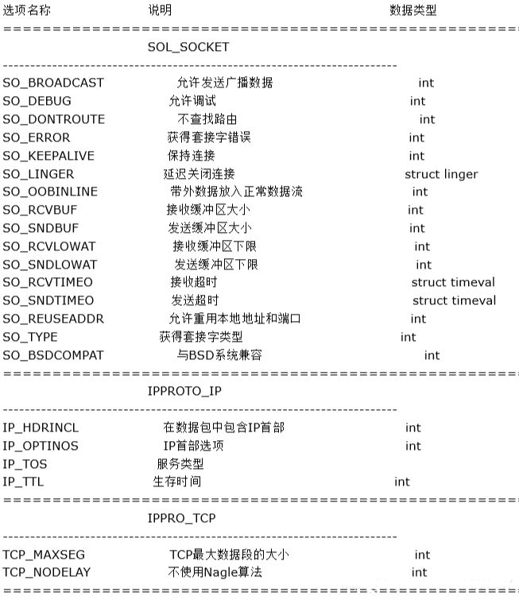
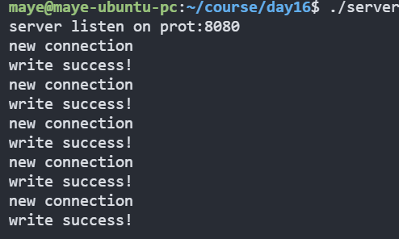
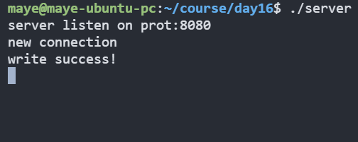
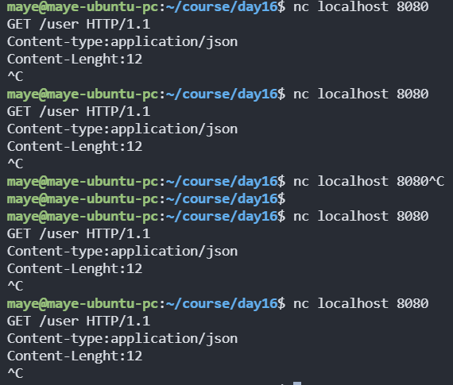
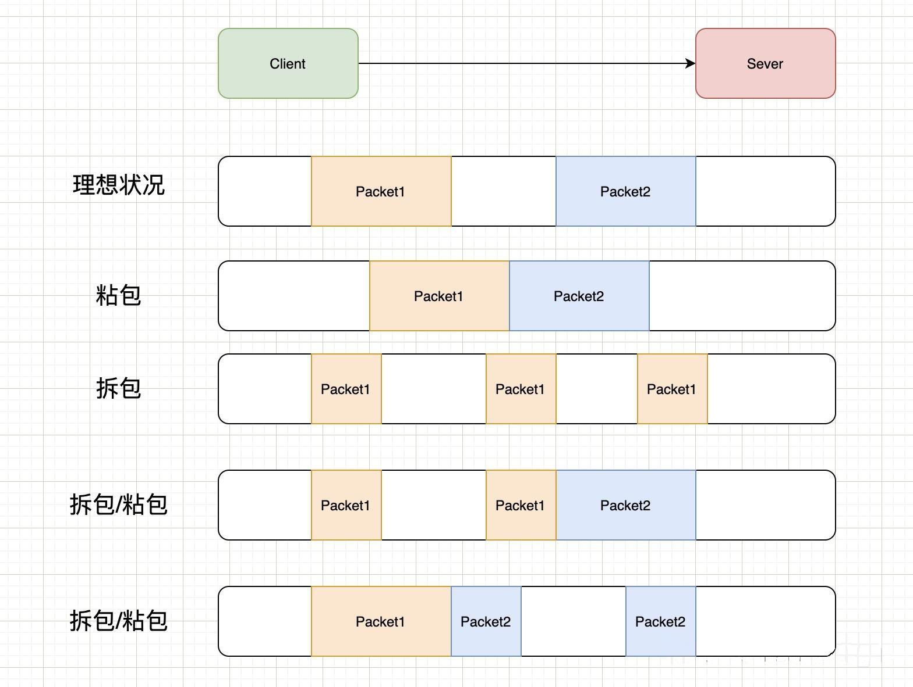

# 端口复用

## 引入

先来一段代码，思考如何同时运行两个此程序会发生什么?

```c
#include <sys/socket.h>
#include <arpa/inet.h>
#include <unistd.h>
#include <stdio.h>
#include <string.h>

#include "socket_wrap.h"

int createServer(uint16_t port)
{

        //创建socket
        int fd = hdy_socket(AF_INET,SOCK_STREAM,0);

        //绑定地址和端口号
        struct sockaddr_in addr;
        addr.sin_family = AF_INET;
        addr.sin_port = htons(port);
        addr.sin_addr.s_addr = INADDR_ANY;

        hdy_bind(fd,(struct sockaddr*)&addr,sizeof(addr));

        //监听
        hdy_listen(fd,5);

        return fd;
}


int main()
{
        int fd = createServer(8080);

        printf("server listen on prot:%d\n",8080);

        char buffer[BUFSIZ]="GET /user HTTP/1.1\r\nContent-type:application/json\r\nContent-Lenght:12\r\n";
        while(1) {
                //接受连接
                int newSocket = hdy_accept(fd,NULL,NULL);
                printf("new connection\n");

                //发送消息
                int ret = hdy_write(newSocket,buffer,strlen(buffer));
                if(ret>0) {
                        printf("write success!\n");
                }
        }

        hdy_close(fd);
        return 0;
}
```

当运行第一个时，运行正常；

当运行第二个时，出现错误：`[ERROR] socket_wrap.c:33  : bind error (Address already in use) `。

为什么会出现错误呢？这是因为第一个程序已经占用了8080端口，当第二个程序启动时，发现这个端口已经占用了，就不能再绑定了，所以报错~

> 有时候即使没有开两个服务器，当你重启服务器时，socket还没有来得及回收，从而导致重启时，检测到端口占用！所以这个问题要解决~

## 套接字选项

一般情况下端口号对应着唯一的一个进程，当操作系统检测到发送给这个端口的消息，就会转给对应的进程处理！

如果有两个或多个进程绑定同一个端口号，那么操作系统将无法区分转给哪个进程！

但是为了发挥多核CPU的性能，Linux 内核从 3.9 版本开始引入一个新的 socket 选项 SO_REUSEPORT，又称为 port sharding，允许多个套接字监听同一个IP 和端口组合。

使用`setsockopt`函数来设置socket选项。函数原型如下：

```c
int setsockopt(int sockfd, int level, int optname,
               const void optval[.optlen],
               socklen_t optlen);
```

**参数：**

+ sockfd：要设置选项的socket描述符
+ level：选项定义的层次，一般设置`SOL_SOCKET`即可，其他选项如下
  + SOL_SOCKET：通用套接字选项
  + IPPROTO_IP：IPV4套接字
  + IPPROTO_IPV6：IPV6套接字
  + IPPROTO_TCP：TCP选项

+ optname：选项名称，有下列几种数值：



+ optval：选项值指针，指向存放选项待设置的新值的缓冲区。
+ optlen：选项值(optval)内存大小

**返回值：**成功执行时，返回0。失败返回-1，errno被设为以下的某个值

+ EBADF：sockfd不是有效的文件描述词
+ EFAULT：optval指向的内存并非有效的进程空间
+ EINVAL：在调用setsockopt()时，optlen无效
+ ENOPROTOOPT：指定的协议层不能识别选项
+ ENOTSOCK：socket描述的不是套接字
  

[setsockopt()函数功能介绍 - 启云 - 博客园](https://www.cnblogs.com/eeexu123/p/5275783.html)

## 端口复用

接下来我们把开始的代码设置端口复用，再看看效果。

### 服务器

```c
int createServer(uint16_t port)
{
    //创建socket
    int fd = hdy_socket(AF_INET,SOCK_STREAM,0);
    
    //设置端口复用
    int optval = 1;
    if(setsockopt(fd,SOL_SOCKET,SO_REUSEPORT,&optval,sizeof(optval))!=0){
        perror("setsockopt error");
    }
    
    //代码已省略...
```

### 客户端

客户端我们可以自己写代码实现，但是为了方便我们这里直接使用`nc`命令。

> *nc*（Netcat）是一款功能强大的网络工具，被誉为网络安全界的“瑞士军刀”。它支持端口扫描、文件传输、简单聊天、HTTP请求模拟等多种功能，适用于网络调试和安全测试。

```c
 nc localhost 8080
```

### 测试

先启动两个服务器，然后启栋客户端，接受到数据之后，再启动客户端，多连接几次服务器做测试！效果如下：两个服务都能收到客户端的连接，但是不是同时收到的，系统会自动选择对应的socket。

服务器一：



服务器二：



客户端：



## 查看套接字

使用ss来查看套接字统计信息，功能类似于 netstat，但速度更快，提供更详细的网络连接状态信息。

> ss 是 Socket Statistics（套接字统计）的缩写，用于显示和分析系统的网络连接状态。

```css
maye@maye-ubuntu-pc:~/course/day16$ ss -tlnpe | grep -i 8080
LISTEN 0      5            0.0.0.0:8080      0.0.0.0:*    users:(("server",pid=10500,fd=3)) uid:1000 ino:263230 sk:280 cgroup:/user.slice/user-1000.slice/session-104.scope <->
LISTEN 0      5            0.0.0.0:8080      0.0.0.0:*    users:(("server",pid=10498,fd=3)) uid:1000 ino:262872 sk:281 cgroup:/user.slice/user-1000.slice/session-104.scope <->
```

注意到最后一列中的信息，可以看到监听 9090 端口的是两个不同的 socket，它们的 inode 号分别是 263230和 262872。

`ss`的选项解释如下。

```css
-t, --tcp
    显示 TCP 的 socket
-l, --listening
    只显示 listening 状态的 socket，默认情况下是不显示的。
-n, --numeric
    显示端口号而不是映射的服务名
-p, --processes
    显示进程名
-e, --extended
    显示 socket 的详细信息
```

# TCP粘包/拆包

在TCP的socket编程中，发送端和接收端都有成对的socket。发送端为了将多个发往接收端的包，更加高效的的发给接收端，于是采用了优化算法（Nagle算法），将多次间隔较小、数据量较小的数据，合并成一个数据量大的数据块，然后进行封包。那么这样一来，接收端就必须使用高效科学的拆包机制来分辨这些数据

## 粘包/拆包问题分析

**粘包问题**

粘包是指发送方发送的若干包数据到接收方接收时粘成一包，从接收缓冲区看，后一包数据的头紧接着前一包数据的尾。

**拆包问题**

拆包是指在基于TCP协议的通讯中，数据包在传输过程中被分割成多个较小的数据包的过程。具体来说，当应用程序发送一个完整的数据包到网络层时，由于TCP协议的特点，这个数据包可能会被拆分成多个更小的数据包进行传输，以便适应网络传输的限制和优化传输效率。这种行为在TCP协议中是正常且常见的，但有时会导致接收端在重组数据包时遇到困难，即所谓的“拆包问题”。



上图中演示了以下几种情况：

- 正常的理想情况，两个包恰好满足TCP缓冲区的大小或达到TCP等待时长，分别发送两个包；
- 粘包：两个包较小，间隔时间短，发生粘包，合并成一个包发送；
- 拆包：一个包过大，超过缓存区大小，拆分成两个或多个包发送；
- 拆包和粘包：Packet1过大，进行了拆包处理，而拆出去的一部分又与Packet2进行粘包处理。

## 常见的解决方案

对于粘包和拆包问题，常见的解决方案有三种：

- 发送端将每个包都封装成**固定的长度**，比如100字节大小。如果不足100字节可通过补0或空等进行填充到指定长度；
- 发送端在每个包的末尾使用固定的**分隔符**，例如\r\n。如果发生拆包需等待多个包发送过来之后再找到其中的\r\n进行合并；例如，FTP协议；
- 将消息分为**头部和消息体**，头部中保存整个消息的长度，只有读取到足够长度的消息之后才算是读到了一个完整的消息；

# 高并发服务器

由于accept和read函数都会阻塞，当read时，就不能调用accpet接受新的链接，当accept等待连接时，就不能使用read读取数据！

**高并发**（High Concurrency）是指在一定的时间内，有大量的请求需要被系统处理。它是互联网分布式系统架构设计中必须考虑的关键因素之一。高并发环境下，系统需要能够同时并行处理众多请求，这通常涉及到多个性能指标，包括响应时间、吞吐量、每秒查询率（QPS）以及并发用户数等。

在并发服务器中，多进程和多线程是两种常见的并发模型，它们都有各自的优点和适用场景。

## 多进程服务器

多进程并发服务器通过创建多个子进程来处理客户端请求。每个子进程是操作系统中独立运行的单位，拥有自己的内存空间和资源。当有新的客户端连接请求到达时，服务器创建一个新的子进程来处理该请求。子进程负责与客户端通信并提供所需的服务。

多进程并发服务器的优点是稳定性高。由于每个子进程都是相互独立的，一个子进程的崩溃或错误不会影响其他子进程的执行。这种独立性使得多进程并发服务器能够有效地隔离错误，提高服务器的可靠性。

然而，多进程并发服务器也有一些缺点。创建和管理多个进程需要消耗更多的系统资源，包括内存和CPU时间。进程间的通信也需要特殊的机制，例如管道或共享内存，以便在不同进程之间传递数据。此外，由于每个进程都有自己的内存空间，进程间的数据共享和同步可能会变得复杂。

```c
#include <sys/socket.h>
#include <arpa/inet.h>
#include <unistd.h>
#include <stdio.h>
#include <string.h>
#include <stdlib.h>
#include <sys/wait.h>
#include <signal.h>

#include "socket_wrap.h"

void waitchild(int signo)
{
        pid_t wpid;

        //回收子进程
        while(1)
        {
                wpid = waitpid(-1, NULL, WNOHANG);
                if(wpid>0)
                {
                        printf("child is quit, wpid==[%d]\n", wpid);
                }
                else if(wpid==0)
                {
                        printf("child is living, wpid==[%d]\n", wpid);
                        break;
                }
                else if(wpid==-1)
                {
                        printf("no child is living, wpid==[%d]\n", wpid);
                        break;
                }
        }
}

int createServer(uint16_t port)
{

        //创建socket
        int fd = hdy_socket(AF_INET,SOCK_STREAM,0);

        int optval = 1;
        //setsockopt(fd,SOL_SOCKET,SO_REUSEADDR,&optval,sizeof(optval));
        setsockopt(fd,SOL_SOCKET,SO_REUSEPORT,&optval,sizeof(optval));

        //绑定地址和端口号
        struct sockaddr_in addr;
        addr.sin_family = AF_INET;
        addr.sin_port = htons(port);
        addr.sin_addr.s_addr = INADDR_ANY;

        hdy_bind(fd,(struct sockaddr*)&addr,sizeof(addr));

        //监听
        hdy_listen(fd,5);

        return fd;
}


int main()
{
        signal(SIGCHLD,waitchild);

        int fd = createServer(8080);

        printf("server listen on prot:%d\n",8080);

        //char buffer[BUFSIZ]="GET /user HTTP/1.1\r\nContent-type:application/json\r\nContent-Lenght:12\r\n";
        char buffer[BUFSIZ]="hello wrold!\n";
        while(1) {
                //接受连接
                int newSocket = hdy_accept(fd,NULL,NULL);
                printf("new connection:%d\n",newSocket);

                pid_t pid = fork();
                if(pid <0) {
                        exit(-1);
                }
                //父进程
                else if(pid>0) {
                        //关闭父进程socket(交给子进程处理)
                        close(newSocket);

                }
                else if(pid == 0)
                {
                        //子进程关闭监听文件描述符
                        close(fd);

                        //发送消息
                        for(int i =0;i<10;i++){
                                int ret = hdy_write(newSocket,buffer,strlen(buffer));
                                if(ret <=0) {
                                        close(newSocket);
                                        exit(0);
                                }
                                else if(ret>0) {
                                        printf("[%d->%d] write success!\n",getpid(),newSocket);
                                }
                                sleep(1);
                        }

                        //发送完毕关闭客户端
                        close(newSocket);
                        exit(0);
                }


        }

        hdy_close(fd);
        return 0;
}
```

## 多线程服务器

多线程并发服务器通过创建多个线程来处理客户端请求。线程是在进程内部运行的独立执行流，共享同一个进程的内存空间和资源。与多进程不同，多线程服务器不需要创建新的进程来处理请求，而是在同一个进程中创建多个线程。

多线程并发服务器的优点是资源消耗较少。与进程相比，线程的创建和切换开销更小，因为它们共享进程的资源。这使得多线程并发服务器更加轻量级，能够更高效地利用系统资源。

然而，多线程并发服务器也存在一些问题。首先，线程共享进程的内存空间，因此在多线程环境中访问共享数据需要特殊的同步机制，以避免竞态条件和数据不一致。其次，由于线程共享相同的地址空间，一个线程的错误可能会影响整个进程，导致服务器崩溃或不稳定。
```c


#include <sys/socket.h>
#include <arpa/inet.h>
#include <unistd.h>
#include <stdio.h>
#include <string.h>
#include <pthread.h>
#include <ctype.h>

#include "socket_wrap.h"

int createServer(uint16_t port)
{

        //创建socket
        int fd = hdy_socket(AF_INET,SOCK_STREAM,0);

        int optval = 1;
        //setsockopt(fd,SOL_SOCKET,SO_REUSEADDR,&optval,sizeof(optval));
        setsockopt(fd,SOL_SOCKET,SO_REUSEPORT,&optval,sizeof(optval));

        //绑定地址和端口号
        struct sockaddr_in addr;
        addr.sin_family = AF_INET;
        addr.sin_port = htons(port);
        addr.sin_addr.s_addr = INADDR_ANY;

        hdy_bind(fd,(struct sockaddr*)&addr,sizeof(addr));

        //监听
        hdy_listen(fd,5);

        return fd;
}

typedef struct Context{
        int sockfd;
        pthread_t threadId;
        struct sockaddr_in peerAddr;
        socklen_t addrLen;
}Context;

Context ctxs[32];

Context* getNewContext()
{
        for(int i =0;i<32;i++) {
                if(ctxs[i].sockfd == 0) {
                        return ctxs +i;
                }
        }
        return NULL;
}

void returnContext(Context* ctx)
{
        memset(ctx,0,sizeof(Context));
}


void* worker(void* arg)
{
        Context* ctx = arg;
        char buffer[BUFSIZ];
        int rlen = -1;
        int wlen = -1;

        //接受客户端数据
        rlen = hdy_read(ctx->sockfd,buffer,BUFSIZ);
        if(rlen < 0 || rlen == 0) {
                returnContext(ctx);
                return NULL;
        }

        for(int i =0 ;i<rlen;i++) {
                buffer[i] = toupper(buffer[i]);
        }

        //发消息给客户端
        for(int i = 0 ;i<10;i++){
                wlen= hdy_write(ctx->sockfd,buffer,rlen);
                if(wlen>0) {
                        printf("write success!\n");
                }
                else{
                        break;
                }
                sleep(1);
        }

        sleep(1);
        close(ctx->sockfd);
        returnContext(ctx);
        return NULL;
}


int main()
{
        int fd = createServer(8080);

        printf("server listen on prot:%d\n",8080);

        char buffer[BUFSIZ]="GET /user HTTP/1.1\r\nContent-type:application/json\r\nContent-Lenght:12\r\n";
        while(1) {
                Context* ctx = getNewContext();
                //接受连接
                int newSocket = hdy_accept(fd,(struct sockaddr*)&ctx->peerAddr,&ctx->addrLen);
                printf("new connection : %d\n",newSocket);

                ctx->sockfd = newSocket;
                pthread_create(&ctx->threadId,NULL,worker,ctx);
                pthread_detach(ctx->threadId);
        }

        hdy_close(fd);
        return 0;
}
```


## 选择并发模型

在选择多进程还是多线程并发服务器时，需要根据具体的应用需求和性能要求进行权衡。以下是一些建议：

如果稳定性和容错性是首要考虑因素，多进程并发服务器可能是更好的选择。每个子进程的独立性可以有效地隔离错误，提高服务器的可靠性。
如果服务器需要处理大量的并发连接并需要更高的性能和资源利用率，多线程并发服务器可能更适合。线程的创建和切换开销相对较小，可以更高效地处理并发请求。
如果同时需要稳定性和性能，可以考虑使用混合模型，即在每个进程中创建多个线程，以实现更好的负载平衡和资源利用率。
无论选择多进程还是多线程并发服务器，都需要注意正确处理并发访问共享数据的问题，使用适当的同步机制（如锁、信号量）来保证数据的一致性和正确性。

总结起来，多进程和多线程并发服务器是实现高性能服务器的常见方式。它们各有优劣，选择合适的并发模型需要考虑应用需求和性能要求，并注意处理并发访问共享数据的问题
