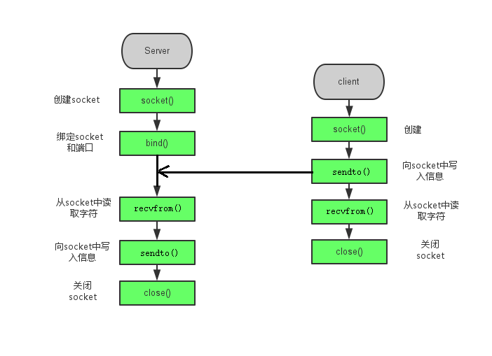

# TCP与UDP

TCP（传输控制协议）和UDP（用户数据报协议）是互联网协议套件的两种主要传输层协议。TCP是面向连接的协议，而UDP是无连接的协议。这两种协议在数据传输方式上有着根本的不同。

## TCP协议

TCP协议提供了一种可靠的服务，确保数据能够完整地从发送端传输到接收端。TCP在发送数据之前需要在两个设备之间建立连接，并在数据传输过程中维持这个连接。TCP使用三次握手方法来建立连接，确保数据的顺序和完整性。如果在传输过程中数据包丢失，TCP会请求重新发送这些数据包。

TCP的特点包括：

- **面向连接**：在数据传输前需要建立连接。
- **可靠性**：确保所有数据包都能到达接收端。
- **数据顺序**：保证数据包的顺序与发送顺序一致。
- **流量控制**：根据接收端的处理能力调整发送速度。
- **拥塞控制**：避免网络过载。

TCP广泛应用于需要确保数据完整性的场景，如网页浏览、电子邮件发送、文件传输等。

## UDP协议

与TCP不同，UDP是一种无连接的协议，它不保证数据的可靠传输。UDP在发送数据时不需要建立连接，也不会确认所有数据包都已到达。UDP适用于对数据传输速度要求高但可以容忍一定数据丢失的场景，如实时视频/音频传输和在线游戏。

UDP的特点包括：

- **无连接**：不需要建立连接即可发送数据。
- **不可靠性**：不保证数据包的完整到达。
- **速度快**：由于没有连接建立和维护的开销，UDP的传输速度通常比TCP快。
- **适用于多播和广播**：UDP支持数据包的多播和广播。

UDP常用于实时应用，如视频会议、在线游戏和域名系统（DNS）查询。

## TCP与UDP的选择

选择TCP还是UDP取决于具体的应用场景。如果需要确保数据的完整性和顺序，如文件传输或网页浏览，那么TCP是更好的选择。如果应用场景可以容忍数据丢失，且对传输速度有较高要求，如实时视频或在线游戏，那么UDP可能是更合适的选择。

总的来说，TCP提供了可靠的数据传输，而UDP提供了更快的传输速度。根据应用的需求和网络环境的特点，开发者可以选择最适合的协议来实现数据传输。

# UDP通信

## 基本通信流程



### 相关函数

#### 创建 Socket

使用 *socket()* 函数创建一个通信端点，并返回一个指向该端点的文件描述符。其定义如下：

```c
int socket(int domain, int type, int protocol);
```

**参数：**

- *domain* 参数指定通信域，如 *AF_INET*（IPv4 网络协议）。
- *type* 参数指定 socket 类型，如 *SOCK_STREAM*（TCP）或 *SOCK_DGRAM*（UDP）。
- *protocol* 参数通常为 0，由系统自动选择。

**返回值：**成功返回新的套接字文件描述符，失败返回-1。

#### 绑定地址

使用 *bind()* 函数将创建的 socket 绑定到指定的 IP 地址和端口上：

```c
int bind(int sockfd, const struct sockaddr *addr,socklen_t addrlen);
```

**参数：**

- *sockfd* 是 *socket()* 返回的描述符。
- *addr* 指定要绑定的本地 IP 和端口。
- *addrlen* 指定addr结构体的大小，使用sizeof计算！

**返回值：**成功返回0，失败返回-1。

**注意：**虽然第二个参数需要`struct sockaddr`类型的指针，但是实际使用时要使用`struct sockaddr_in`类型。

> 使用man 3 sockaddr可以查看结构体手册。
>
> `struct sockaddr`是通用套接字地址结构，但是它的操作非常麻烦，因为需要你手动填充数组来设置IP地址和端口号！
>
> `struct sockaddr_in`    "in" 代表 “Internet”，即 IPv4 地址家族。这个结构体是专门为 IPv4 设计的，它清晰地将地址的各个部分分开，便于程序员操作。

**使用实例：**

```c
struct sockaddr_in addr;
addr.sin_family = AF_INET;		//这里必须和socket第一个参数一致
addr.sin_port = htons(8080);	//设置端口，htons本地字节序转网络字节序
addr.sin_addr.s_addr = INADDR_ANY;	//绑定本地所有IP

// 我们将指向 sockaddr_in 的指针 强制转换为 指向 sockaddr 的指针
bind(server_socket, (struct sockaddr*)&addr, sizeof(addr));
```

#### 收发数据

使用 *recvfrom*函数接受数据：

```c
ssize_t recvfrom(int sockfd, void buf[restrict .len], size_t len,
                 int flags,
                 struct sockaddr *_Nullable restrict src_addr,
                 socklen_t *_Nullable restrict addrlen);
```

**参数：**

- *sockfd* 是服务器 socket 描述符。
- *buf* 是接收数据的缓冲区。
- len是接受缓冲区的最大长度
- flags 填0即可。
- src_addr是当前接受的数据来自的客户端的地址
- addrlen 传入时，需要指定地址结构大小，传出参数，可能会修改

**返回值：**成功返回接收到的字节数，出错返回-1(注意：UDP允许接受0长度的数据报，所以返回0并不能表示对方关闭)

使用*sendto*函数发送数据：

```c
ssize_t sendto(int sockfd, const void buf[.len], size_t len, int flags,
               const struct sockaddr *dest_addr, socklen_t addrlen);
```

**参数：**

- *sockfd* 是服务器 socket 描述符。
- *buf* 是发送数据的缓冲区。
- len是发送数据的长度
- flags 填0即可。
- dest_addr 是客户端的地址
- addrlen 地址结构大小

**返回值：**send：成功返回已发送的字节数，出错返回-1。

#### 关闭 Socket

使用 *close()* 函数关闭 socket：

```c
int close(int fd);
```

### 服务端

```c
#include <stdio.h>
#include <stdlib.h>
#include <unistd.h>
#include <sys/socket.h>
#include <arpa/inet.h>
#include <ctype.h>

int main()
{
        //创建socket
        int fd = socket(AF_INET,SOCK_DGRAM,0);
        if(fd < 0) {
                perror("socket error");
                return -1;
        }

        //绑定端口号
        struct sockaddr_in server_addr;
        server_addr.sin_family = AF_INET;
        server_addr.sin_port = htons(8888);
        server_addr.sin_addr.s_addr = INADDR_ANY;
        if(bind(fd,(struct sockaddr*)&server_addr,sizeof(server_addr)) < 0) {
                perror("bind error");
                return -1;
        }

        //收发消息
        struct sockaddr_in cli_addr;
        socklen_t cli_addr_len = sizeof(cli_addr);
        char buffer[BUFSIZ];
        while(1) {
                //接受数据
                int nread = recvfrom(fd,buffer,BUFSIZ,0,(struct sockaddr*)&cli_addr,&cli_addr_len);
                printf("msg is %.*s\n",nread,buffer);

                for(int i = 0;i<nread/2;i++) {
                        buffer[i] = toupper(buffer[i]);
                }

                //发送数据
                int nsend = sendto(fd,buffer,nread,0,(struct sockaddr*)&cli_addr,cli_addr_len);
                if(nsend < 0) {
                        perror("sendto error");
                        continue;
                }
                printf("send len is %d\n",nsend);
        }


        close(fd);
        return 0;
}
```

使用`nc`命令测试时，需要加上`-u`选项：

```bash
nc -u 127.1 8888
```

使用`ss`命令查看udp套接字：

```c
ss -ulpne | grep 8888
```

### 客户端

```c
#include <stdio.h>
#include <stdlib.h>
#include <string.h>
#include <unistd.h>
#include <sys/socket.h>
#include <arpa/inet.h>
#include <ctype.h>

int main()
{
        //创建socket
        int fd = socket(AF_INET,SOCK_DGRAM,0);
        if(fd < 0) {
                perror("socket error");
                return -1;
        }

        //指定服务器端口号
        struct sockaddr_in addr;
        addr.sin_family = AF_INET;
        addr.sin_port = htons(8888);
        if(inet_pton(AF_INET,"127.0.0.1",&addr.sin_addr)<0) {
                perror("socket error");
                return -1;
        }


        //收发消息
        char buffer[BUFSIZ];
        while(1) {
                printf("input>");
                fgets(buffer,BUFSIZ,stdin);
                //发送数据
                int nsend = sendto(fd,buffer,strlen(buffer),0,(struct sockaddr*)&addr,sizeof(addr));
                printf("sendto len is %d\n",nsend);

                //接受数据
                int nread = recvfrom(fd,buffer,BUFSIZ,0,NULL,NULL);
                printf("msg is %.*s\n",nread,buffer);
        }


        close(fd);
        return 0;
}
```

## 高级UDP通信流程

基本的UDP通信中，在客户端我们使用的是sendto/recvfrom进行信息的收发，目标主机的IP和端口是在调用sendto/recvfrom时确定的；

这样比较麻烦，我们还可以通过connect函数对服务器的地址进行绑定(但它仅仅用于表示确定了另一方的地址，并没有其他含义。)，然后就可以使用`read/write`或`recv/send`函数进行收发数据了。

有了以上认识后，我们可以知道UDP套接字有以下区分：

### 未连接的UDP套接字

- 对于未连接的套接字，也就是我们常用的的UDP套接字，我们使用的是sendto/recvfrom进行信息的收发，目标主机的IP和端口是在调用sendto/recvfrom时确定的；

- 在一个未连接的UDP套接字上给两个数据报调用sendto函数内核将执行以下六个步骤：
  + 连接套接字
  + 输出第一个数据报
  + 断开套接字连接
  + 连接套接字
  + 输出第二个数据报断开套接字连接

### 已连接的UDP套接字

- 对于已连接的UDP套接字，必须先经过connect来向目标服务器进行指定，然后调用read/write进行信息的收发，目标主机的IP和端口是在connect时确定的，也就是说，一旦conenct成功，我们就只能对该主机进行收发信息了。
- 已连接的UDP套接字给两个数据报调用write函数内核将执行以下三个步骤：
  - 连接套接字
  - 输出第一个数据报
  - 输出第二个数据报

> 由此可以知道，当应用进程知道给同一个目的地址的端口号发送多个数据报时，显示套接字效率更高。

### 客户端

```c
#include <stdio.h>
#include <stdlib.h>
#include <string.h>
#include <unistd.h>
#include <sys/socket.h>
#include <arpa/inet.h>
#include <ctype.h>

int main()
{
        //创建socket
        int fd = socket(AF_INET,SOCK_DGRAM,0);
        if(fd < 0) {
                perror("socket error");
                return -1;
        }

        //指定服务器端口号
        struct sockaddr_in addr;
        addr.sin_family = AF_INET;
        addr.sin_port = htons(8888);
        if(inet_pton(AF_INET,"127.0.0.1",&addr.sin_addr)<0) {
                perror("socket error");
                return -1;
        }
        //连接服务器
        if(connect(fd,(struct sockaddr*)&addr,sizeof(addr))<0) {
                perror("socket error");
                return -1;
        }


        //收发消息
        char buffer[BUFSIZ];
        while(1) {
                printf("input>");
                fgets(buffer,BUFSIZ,stdin);
                //发送数据
                int nsend = write(fd,buffer,strlen(buffer));
                printf("sendto len is %d\n",nsend);

                //接受数据
                int nread = read(fd,buffer,BUFSIZ);
                printf("msg is %.*s\n",nread,buffer);
        }


        close(fd);
        return 0;
}
```

# 本地套接字

前面在学习进程间通信时说过可以使用socket来通信，本文要介绍的 Unix 本地套接字是在 socket 的框架上发展出一种 IPC 机制，即 UNIX Domain Socket，也就是 UNIX 本地套接字，或者称为 UNIX 域套接字。相比于网络 socket 和 IPC，Unix本地套接字有其自身的特点和优势。

> 使用本地套接字数据不需要经过网卡，速度更快！
>
> Unix 域套接字所使用的 API 其实跟我们之前用的 socket API 是一样的，并且对于 TCP 和 UDP，其工作流程跟网络 socket 也完全一样。

## 相关函数以及参数

### 创建socket

照样使用 *socket()* 函数创建一个通信端点。

```c
int socket(int domain, int type, int protocol);
```

但是它的第一个参数不再是*AF_INET*或 *AF_INET6*或*PF_INET*，而是**`AF_UNIX`**(它还有一个同义词`AF_LOCAL`)，表示的就是unix域本地套接字。

第二个参数还是指定 socket 类型，如 *SOCK_STREAM*（TCP）或 *SOCK_DGRAM*（UDP）。

第三个参数通常为 0，由系统自动选择。

### 绑定地址

创建完套接字，接下来就是通过 bind() 函数绑定地址，但对于 Unix 本地套接字来说，绑定的地址就不是原来的“IP地址 + 端口号”了，而是一个有效的路径。

```c
int bind(int sockfd, const struct sockaddr *addr,socklen_t addrlen);
```

**参数：**

- *sockfd* 是 *socket()* 返回的描述符。
- *addr* 指定要绑定的socket文件和协议地族
- *addrlen* 指定addr结构体的大小，使用sizeof计算！

**返回值：**成功返回0，失败返回-1。

**注意：**虽然第二个参数需要`struct sockaddr`类型的指针，但是实际使用时要使用`struct sockaddr_un`类型。

> `struct sockaddr_un`    "un" 代表 “unix”。

结构体类型如下：

```c
#include <sys/un.h>
struct sockaddr_un {
    sa_family_t     sun_family;     /* Address family */
    char            sun_path[108];     /* Socket pathname */
};
```

Unix 本地套接字的地址结构体中包含两个成员，其中 sun_family 表示协议族，填 `AF_LOCAL` 或 `AF_UNIX` 即可；sun_path 表示一个路径名。

**使用实例：**

```c
struct sockaddr_un addr;
addr.sun_family = AF_LOCAL;				//这里必须和socket第一个参数一致
strcpy(addr.sun_path,"/tmp/unix.socket");

// 我们将指向 sockaddr_in 的指针 强制转换为 指向 sockaddr 的指针
bind(server_socket, (struct sockaddr*)&addr, sizeof(addr));
```

## TCP本地套接字

### 服务端

#### 代码

```c
#include <stdio.h>
#include <stdlib.h>
#include <string.h>
#include <ctype.h>
#include <unistd.h>
#include <sys/socket.h>
#include <sys/un.h>

#define UNIX_PATH  "/tmp/sock.str"

int main()
{
        //创建本地socket
        int fd  = socket(AF_LOCAL,SOCK_STREAM,0);
        if(fd < 0) {
                perror("socket error");
                return -1;
        }

        //绑定socket文件
        struct sockaddr_un addr;
        addr.sun_family = AF_LOCAL;
        unlink(UNIX_PATH);					//如果存在则会绑定失败，所以先删除
        strcpy(addr.sun_path,UNIX_PATH);		
        if(bind(fd,(struct sockaddr*)&addr,sizeof(addr)) < 0) {
                perror("bind error");
                return -1;
        }

        //监听
        listen(fd,5);

        //接受连接
        struct sockaddr_un cliAddr;
        socklen_t cliAddrLen = sizeof(cliAddr);
        int clifd = accept(fd,(struct sockaddr*)&cliAddr,&cliAddrLen);
        if(clifd < 0) {
                perror("bind error");
                return -1;
        }
        printf("New Connection : %s\n",cliAddr.sun_path);

        //读写数据
        char buf[BUFSIZ];
        while(1) {
                //接受
                int nread = read(clifd,buf,BUFSIZ);
                if(nread<=0) {
                        perror("read disconnected");
                        break;
                }
                printf("read msg is : %.*s\n",nread,buf);

                for(int i =0;i<nread;i++) {
                        buf[i] = toupper(buf[i]);
                }

                //发送
                int nwrite = write(clifd,buf,nread);
                if(nwrite <=0) {
                        perror("write disconnected");
                        break;
                }
        }

        close(clifd);
        close(fd);
        return 0;
}
```

#### 测试

使用`nc`命令测试时，需要指定socket文件：

```bash
nc -U /tmp/unix.socket
```

使用`ss`命令查看socket信息：

```c
ss -lnpe | grep -i /tmp/unix.socket
```

### 客户端

```c
#include <stdio.h>
#include <stdlib.h>
#include <string.h>
#include <ctype.h>
#include <unistd.h>
#include <sys/socket.h>
#include <sys/un.h>

#define UNIX_PATH "/tmp/sock.str"

int main()
{
        //创建本地socket
        int fd  = socket(AF_LOCAL,SOCK_STREAM,0);
        if(fd < 0) {
                perror("socket error");
                return -1;
        }

        //绑定socket文件
        struct sockaddr_un addr;
        addr.sun_family = AF_LOCAL;
        strcpy(addr.sun_path,UNIX_PATH);        //和服务器绑定同一个socket文件即可

        if(connect(fd,(struct sockaddr*)&addr,sizeof(addr)) < 0) {
                perror("connect error");
                return -1;
        }

        //读写数据
        char buf[BUFSIZ];
        while(1) {
                printf(">");
                fgets(buf,BUFSIZ,stdin);

                //发送
                write(fd,buf,strlen(buf));

                //接受
                int nread = read(fd,buf,BUFSIZ);
                if(nread<=0) {
                        perror("disconnected");
                        break;
                }
                printf("%.*s\n",nread,buf);
        }

        close(fd);
        return 0;
}
```


## UDP本地套接字

### 服务端

```c
#include <stdio.h>
#include <stdlib.h>
#include <string.h>
#include <unistd.h>
#include <sys/socket.h>
#include <sys/un.h>
#include <ctype.h>

#define UNIX_PATH "/tmp/udp_sock.str"

int main()
{
        //UDP本地套接字
        int fd = socket(AF_LOCAL,SOCK_DGRAM,0);
        if(fd < 0) {
                perror("socket error");
                return -1;
        }

        //绑定socket文件
        struct sockaddr_un addr;
        addr.sun_family = AF_LOCAL;
        unlink(UNIX_PATH);
        strcpy(addr.sun_path,UNIX_PATH);
        if(bind(fd,(struct sockaddr*)&addr,sizeof(addr))<0) {
                perror("bind error");
                return -1;
        }


        struct sockaddr_un cliAddr;
        socklen_t cliAddrLen = sizeof(cliAddr);
        char buf[BUFSIZ];
        while(1) {
                //接受数据
                int nread = recvfrom(fd,buf,BUFSIZ,0,(struct sockaddr*)&cliAddr,&cliAddrLen);
                if(nread < 0) {
                        perror("DisConnected");
                        break;
                }
                printf("[%s]msg is : %.*s\n",cliAddr.sun_path,nread,buf);

                for(int i =0;i<nread;i++) {
                        buf[i] = toupper(buf[i]);
                }

                //发送数据
                if(sendto(fd,buf,strlen(buf),0,(struct sockaddr*)&cliAddr,cliAddrLen)<0) {
                        perror("sendto error");
                }
        }

        close(fd);
        return 0;
}
```

### 客户端

```c
#include <stdio.h>
#include <stdlib.h>
#include <string.h>
#include <unistd.h>
#include <sys/socket.h>
#include <sys/un.h>
#include <ctype.h>

#define UNIX_PATH "/tmp/udp_sock.str"

int main()
{
        //UDP本地套接字
        int fd = socket(AF_LOCAL,SOCK_DGRAM,0);
        if(fd < 0) {
                perror("socket error");
                return -1;
        }

        //绑定socket文件
        struct sockaddr_un addr;
        addr.sun_family = AF_LOCAL;
        unlink(UNIX_PATH);
        strcpy(addr.sun_path,UNIX_PATH);

        //绑定
        if(bind(fd,(struct sockaddr*)&addr,sizeof(addr))<0) {
                perror("bind error");
                return -1;
        }

        //连接
        if(connect(fd,(struct sockaddr*)&addr,sizeof(addr))<0) {
                perror("connect error");
                return -1;
        }

        char buf[BUFSIZ];
        while(1) {
                printf(">");
                fgets(buf,BUFSIZ,stdin);

                //发送数据
                if(write(fd,buf,strlen(buf))<0) {
                        perror("write error");
                        break;
                }

                //接受数据
                int nread = read(fd,buf,BUFSIZ);
                if(nread < 0) {
                        perror("DisConnected");
                        break;
                }
                printf("msg is : %.*s\n",nread,buf);
        }

        close(fd);
        return 0;
}
```

