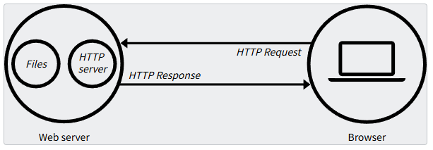
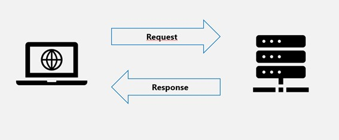
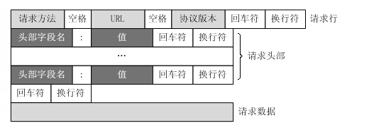
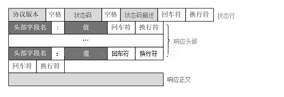

# web

web（World Wide Web）即全球广域网，也称为万维网，它是一种基于超文本和HTTP的、全球性的、动态交互的、跨平台的分布式图形信息系统。是建立在Internet上的一种网络服务，为浏览者在Internet上查找和浏览信息提供了图形化的、易于访问的直观界面，其中的文档及超级链接将Internet上的信息节点组织成一个互为关联的网状结构。

## 什么是web服务器

### 概述

*web 服务器*一词可以代指硬件或软件，或者是它们协同工作的整体。

1. **硬件部分**，web 服务器是一台存储了 web 服务器软件以及网站的组成文件（比如，HTML 文档、图片、CSS 样式表和 JavaScript 文件）的计算机。它接入到互联网并且支持与其他连接到互联网的设备进行物理数据的交互。
2. **软件部分**，web 服务器包括控制网络用户如何访问托管文件的几个部分，至少是一台 *HTTP 服务器*。一台 HTTP 服务器是一种能够理解 [URL](https://developer.mozilla.org/zh-CN/docs/Glossary/URL)（网络地址）和 [HTTP](https://developer.mozilla.org/zh-CN/docs/Glossary/HTTP)（浏览器用来查看网页的协议）的软件。一个 HTTP 服务器可以通过它所存储的网站域名进行访问，并将这些托管网站的内容传递给最终用户的设备。

基本上，当浏览器需要一个托管在网络服务器上的文件的时候，浏览器通过 HTTP 请求这个文件。当这个请求到达正确的 web 服务器（硬件）时，*HTTP 服务器*（软件）收到这个请求，找到这个被请求的文档（如果这个文档不存在，那么将返回一个 [404](https://developer.mozilla.org/zh-CN/docs/Web/HTTP/Reference/Status/404) 响应），并把这个文档通过 HTTP 发送给浏览器。



要发布一个网站，你需要一个静态或动态的服务器。

**静态 web 服务器**（static web server）由一个计算机（硬件）和一个 HTTP 服务器（软件）组成。我们称它为“静态”是因为这个服务器把它托管文件的“保持原样”地传送到你的浏览器。

**动态 web 服务器**（dynamic web server）由一个静态的网络服务器加上额外的软件组成，最普遍的是一个*应用服务器*和一个*数据库*。我们称它为“动态”是因为这个应用服务器会在通过 HTTP 服务器把托管文件传送到你的浏览器之前会对这些托管文件进行更新。

举个例子，要生成你在浏览器中看到的最终网页，应用服务器或许会用一个数据库中的内容填充一个 HTML 模板。像 MDN 或维基百科这样的网站有成千上万的网页。通常情况下，这类网站只由几个 HTML 模板和一个巨大的数据库组成，而不是成千上万的静态 HTML 文档。这种设置使得维护和提供内容更加容易。

### 深入探索

要获取一个网页，你的浏览器会向网络服务器发送一个请求，服务器会在自己的存储空间中搜索所请求的文件。找到文件后，服务器读取文件，根据需要进行处理，并将其发送给浏览器。让我们更详细地了解一下这些步骤。

#### 托管文件

一个网络服务器首先需要存储这个网站的文件，也就是说所有的 HTML 文档和它们的相关资源，包括图片、CSS 样式表、JavaScript 文件、字体以及视频。

严格来说，你可以在你自己的计算机上托管所有的这些文件，但是在一个专用的 web 服务器上存储它们会方便得多，因为它

- 专用 web 服务器可用性更强（会一直启动和运行）
- 除去停机时间和系统故障，专用 web 服务器总是连接到互联网。
- 专用 web 服务器可以一直拥有一样的 IP 地址，这也称为*专有 IP 地址*（不是所有的 [ISP](https://developer.mozilla.org/zh-CN/docs/Glossary/ISP) 都会为家庭线提供一个固定的 IP 地址）
- 专用 web 服务器往往由第三方提供者维护

因为所有的这些原因，寻找一个优秀的托管提供者是建立你的网站的一个重要部分。比较不同公司提供的服务并选择一个适合你的需求和预算的服务（服务的价格从免费到每月上万美金不等）。

一旦你设置好一个网络托管解决方案，你必须上传你的文件到你的 web 服务器。

#### 通过 HTTP 交流

web 服务器提供了 [HTTP](https://developer.mozilla.org/zh-CN/docs/Glossary/HTTP)（**H**yper**t**ext **T**ransfer **P**rotocol，超文本传输协议）支持。正如它的名字暗示，HTTP 明确提出了如何在两台计算机间传输超文本（链接的 web 文档）。

协议是一套为了在两台计算机间交流而制定的规则。HTTP 是一个文本化的（textual），无状态的（stateless）协议。

- 文本化

  所有的命令都是纯文本（plain-text）且人类可读（human-readable）的。

- 无状态

  无论是服务器还是客户都不会记住之前的交流。举个例子，仅依靠 HTTP，服务器不能记住你输入的密码或者你正处于业务中的哪一步。你需要一个应用服务器来进行这样的工作。

HTTP 为客户和服务器间的如何沟通提供清晰的规则。我们会在后面学习HTTP 本身。就目前而言，只需要知道这几点：

- 通常只有*客户端*可以发送 HTTP 请求，只会发送到*服务器*。服务器通常只能*响应客户端*的 HTTP 请求。
- 当通过 HTTP 请求一个文件时，客户端必须提供这个文件的 [URL](#什么是URL)。
- 网络服务器*必须应答*每一个 HTTP 请求，至少也要回复一个错误信息。

在 web 服务器上，HTTP 服务器负责处理和响应传入的请求。

1. 当收到一个请求时，HTTP 服务器首先要检查所请求的 URL 是否与一个存在的文件相匹配。
2. 如果是，网络服务器会传送文件内容回到浏览器。如果不是，服务器会检查是否应该动态生成请求所需的文件（参见[静态和动态内容](#静态和动态内容)）。
3. 如果两种处理都不可能，网络服务器会返回一个错误信息到浏览器，最常见的是 [`404 Not Found`](https://developer.mozilla.org/zh-CN/docs/Web/HTTP/Reference/Status/404)。404 错误太常见以至于很多网页设计者花费许多时间去设计 404 错误页面。

### 静态和动态内容

粗略地说，一个服务器可以提供静态或者动态的内容。*静态*意味着“保持原样地提供”。静态的网站是最容易建立的，所以我们建议你制作一个静态的网站作为你的第一个网站。

“动态”意味着服务器会处理内容甚至实时地从一个数据库中产生它。这个方法提供了更多的灵活性，但技术栈更加复杂，使得建立一个网站的挑战大大增加。

不可能建议一个通用的应用服务器适用于所有可能的用例。一些应用服务器设计用于托管和管理博客、知识库或电子商务解决方案，而其他一些则更通用。如果你正在构建一个动态网站，请花时间研究你的需求，并找到最适合你需求的技术。

大多数网站开发者不需要从头开始创建应用服务器，因为有很多现成的解决方案，其中许多都可以高度配置。但是，如果你确实需要创建自己的服务器，那么你可能需要使用服务器框架，利用其现有的代码和库，并仅扩展你需要的部分以满足你的用例。只有相对较少的开发者需要完全从头开始开发服务器：例如，为了满足嵌入式系统上紧张的资源限制。

## 什么是URL

### 概述

**URL**（统一资源定位符）是因特网中的唯一资源的地址。它是浏览器用于检索已发布资源（例如 HTML 页面、CSS 文档、图像等）的关键机制之一。

理论上说，每个有效的 URL 都指向一个唯一的资源。而在实际中，也有一些例外，最常见的情况就是一个 URL 指向了不存在的或是被移动过的资源。由于通过 URL 呈现的资源和 URL 本身由 Web 服务器处理，因此 Web 服务器的拥有者需要认真地维护资源以及与它关联的 URL。

### 剖析URL

下面是一些 URL 的示例：

```css
https://developer.mozilla.org
https://developer.mozilla.org/zh-CN/docs/Learn/
https://developer.mozilla.org/zh-CN/search?q=URL
```

你可以将上面的这些网址输进你的浏览器地址栏来告诉浏览器加载相关联的资源（在这三个示例中为网页）。

URL 由不同的部分组成，其中一些是必须的，而另一些是可选的。最重要的部分以在下面的 URL 上高亮（详细信息在下面的各节中提供）：


> **备注：** 你可以将 URL 视为普通的邮寄地址：*方案*（scheme）表示你想要使用的邮政服务，*域名*（domain name）就像是城市或城镇，*端口*（port）就像邮政编码；*路径*（path）表示你的邮件应该送到的建筑物；*参数*（parameter）表示额外的信息，例如建筑物中公寓的编号；最后，*锚点*（anchor）表示邮件的实际收信人。

#### Scheme(方案)


URL 的第一部分是*方案*（scheme），它表示浏览器必须使用的协议来请求资源（协议是计算机网络中交换或传输数据的一组方法）。通常对于网站，协议是 HTTPS 或 HTTP（它的非安全版本）。访问网页需要这两者之一，但浏览器还知道如何处理其他方案，比如 `mailto:`（打开邮件客户端），所以如果你看到其他协议也不要感到惊讶。

#### Authority(权威)


接下来是*权威*（authority），它与方案之间用字符模式 `://` 分隔。如果存在，权威会包括*域*（例如 `www.example.com`）和*端口*（`80`），由冒号分隔：

- 域指示被请求的 Web 服务器。通常这是一个[域名](https://developer.mozilla.org/zh-CN/docs/Learn_web_development/Howto/Web_mechanics/What_is_a_domain_name)，但也可以使用 [IP 地址](https://developer.mozilla.org/zh-CN/docs/Glossary/IP_Address)（但这很少见，因为它不太方便）。
- 端口指示用于访问 Web 服务器上资源的技术“门户”。如果 Web 服务器使用 HTTP 协议的标准端口（HTTP 为 80，HTTPS 为 443）来授予对其资源的访问权限，则通常会省略端口。否则，端口是强制的。

> **备注：** 方案和权威之间的分隔符是 `://`。冒号将方案与 URL 的下一部分分隔开，而 `//` 表示 URL 的下一部分是权威。

#### Path(资源路径)


`/path/to/myfile.html` 是 Web 服务器上资源的路径。在 Web 的早期阶段，像这样的路径表示 Web 服务器上的物理文件位置。如今，它主要是由没有任何物理现实的 Web 服务器处理的抽象。

#### Params(查询参数)


`?key1=value1&key2=value2` 是提供给 Web 服务器的额外参数。这些参数是用 `&` 符号分隔的键/值对列表。在返回资源之前，Web 服务器可以使用这些参数来执行额外的操作。每个 Web 服务器都有自己关于参数的规则，唯一可靠的方式来知道特定 Web 服务器是否处理参数是通过询问 Web 服务器所有者。

#### Anchor(锚点)


`#SomewhereInTheDocument` 是资源本身的另一部分的锚点。锚点表示资源中的一种“书签”，给浏览器显示位于该“加书签”位置的内容的方向。例如，在 HTML 文档上，浏览器将滚动到定义锚点的位置;在视频或音频文档上，浏览器将尝试转到锚代表的时间。值得注意的是，**#** 后面的部分（也称为**片段标识符**）不会随请求被发送到服务器。

# http协议

## HTTP协议简介

超文本传输协议（英文：**H**yper**T**ext **T**ransfer **P**rotocol，缩写：HTTP）是一种用于分布式、协作式和超媒体信息系统的应用层协议。HTTP是万维网的数据通信的基础。

HTTP的发展是由蒂姆·伯纳斯-李于1989年在欧洲核子研究组织（CERN）所发起。HTTP的标准制定由万维网协会（World Wide Web Consortium，W3C）和互联网工程任务组（Internet Engineering Task Force，IETF）进行协调，最终发布了一系列的RFC，其中最著名的是1999年6月公布的 RFC 2616，定义了HTTP协议中现今广泛使用的一个版本——HTTP 1.1。

2014年12月，互联网工程任务组（IETF）的Hypertext Transfer Protocol Bis（httpbis）工作小组将HTTP/2标准提议递交至IESG进行讨论，于2015年2月17日被批准。 HTTP/2标准于2015年5月以RFC 7540正式发表，取代HTTP 1.1成为HTTP的实现标准。

HTTP协议官方文档：[HTTP | MDN](https://developer.mozilla.org/zh-CN/docs/Web/HTTP)

## HTTP消息结构

HTTP协议定义Web客户端如何从Web服务器请求Web页面，以及服务器如何把Web页面传送给客户端。HTTP协议采用了请求/响应模型。

客户端向服务器发送一个请求报文，请求报文包含请求的方法、URL、协议版本、请求头部和请求数据。

服务器以一个状态行作为响应，响应的内容包括协议的版本、成功或者错误代码、服务器信息、响应头部和响应数据。3



### 请求格式

客户端发送一个HTTP请求到服务器的请求消息包括以下格式：**请求行**（request line）、**请求头**部（header）、**空行**和**请求数据**四个部分组成，下图给出了请求报文的一般格式。



- **请求行**（Request Line）：
  - **方法**：如 GET、POST、PUT、DELETE等，指定要执行的操作。
  - **请求 URL**（统一资源标识符）：请求的资源路径，通常包括主机名、端口号（如果非默认）、路径和查询字符串。
  - **HTTP 版本**：如 HTTP/1.1 或 HTTP/2。
- **请求头**（Request Headers）：
  - 包含了客户端环境信息、请求体的大小（如果有）、客户端支持的压缩类型等。
  - 常见的请求头包括`Host`、`User-Agent`、`Accept`、`Accept-Encoding`、`Content-Length`等。
- **空行**：
  - 请求头和请求体之间的分隔符，表示请求头的结束。
- **请求体**（可选）：
  - 在某些类型的HTTP请求（如 POST 和 PUT）中，请求体包含要发送给服务器的数据。


如下是一个具体的请求协议案例：

### 响应格式

HTTP 响应也由四个部分组成，分别是：**状态行**、**消息报头**、**空行**和**响应正文**。



- **状态行**（Status Line）：
  - **HTTP 版本**：与请求消息中的版本相匹配。
  - **状态码**：三位数，表示请求的处理结果，如 200 表示成功，404 表示未找到资源。
  - **状态信息**：状态码的简短描述。
- **响应头**（Response Headers）：
  - 包含了服务器环境信息、响应体的大小、服务器支持的压缩类型等。
  - 常见的响应头包括`Content-Type`、`Content-Length`、`Server`、`Set-Cookie`等。
- **空行**：
  - 响应头和响应体之间的分隔符，表示响应头的结束。
- **响应体**（可选）：
  - 包含服务器返回的数据，如请求的网页内容、图片、JSON数据等。


如下是一个具体的响应协议案例：


## HTTP请求方法

> [HTTP 请求方法 - HTTP | MDN](https://developer.mozilla.org/zh-CN/docs/Web/HTTP/Reference/Methods)

HTTP 请求方法定义了客户端和服务器之间的通信方式，根据 HTTP 标准，HTTP 请求可以使用多种请求方法。

以下是常见的 HTTP 请求方法列表：

| 序号 | 方法    | 描述                                                         |
| :--- | :------ | :----------------------------------------------------------- |
| 1    | GET     | 从服务器获取资源。用于请求数据而不对数据进行更改。例如，从服务器获取网页、图片等。 |
| 2    | POST    | 向服务器发送数据以创建新资源。常用于提交表单数据或上传文件。发送的数据包含在请求体中。 |
| 3    | PUT     | 向服务器发送数据以更新现有资源。如果资源不存在，则创建新的资源。与 POST 不同，PUT 通常是幂等的，即多次执行相同的 PUT 请求不会产生不同的结果。 |
| 4    | DELETE  | 从服务器删除指定的资源。请求中包含要删除的资源标识符。       |
| 5    | PATCH   | 对资源进行部分修改。与 PUT 类似，但 PATCH 只更改部分数据而不是替换整个资源。 |
| 6    | HEAD    | 类似于 GET，但服务器只返回响应的头部，不返回实际数据。用于检查资源的元数据（例如，检查资源是否存在，查看响应的头部信息）。 |
| 7    | OPTIONS | 返回服务器支持的 HTTP 方法。用于检查服务器支持哪些请求方法，通常用于跨域资源共享（CORS）的预检请求。 |
| 8    | TRACE   | 回显服务器收到的请求，主要用于诊断。客户端可以查看请求在服务器中的处理路径。 |
| 9    | CONNECT | 建立一个到服务器的隧道，通常用于 HTTPS 连接。客户端可以通过该隧道发送加密的数据。 |


## HTTP消息头

> [HTTP 标头 - HTTP | MDN](https://developer.mozilla.org/zh-CN/docs/Web/HTTP/Reference/Headers)

HTTP 消息头信息是服务器在和客户端通过HTTP协议通讯时发送的一系列头字段，它们提供了关于请求/响应的附加信息和服务器的指令。

以下是一些常见的 HTTP 头信息：

| 头信息（英文）   | 头信息（中文） | 描述                                                         |
| :--------------- | :------------- | :----------------------------------------------------------- |
| Date             | 日期           | 响应生成的日期和时间。例如：Wed, 18 Apr 2024 12:00:00 GMT    |
| Server           | 服务器         | 服务器软件的名称和版本。例如：Apache/2.4.1 (Unix)            |
| Content-Type     | 内容类型       | 响应体的媒体类型（MIME类型），如`text/html; charset=UTF-8`, `application/json`等。 |
| Content-Length   | 内容长度       | 响应体的大小，单位是字节。例如：3145                         |
| Content-Encoding | 内容编码       | 响应体的压缩编码，如 `gzip`, `deflate`等。                   |
| Content-Language | 内容语言       | 响应体的语言。例如：zh-CN                                    |
| Content-Location | 内容位置       | 响应体的 URI。例如：/index.html                              |
| Content-Range    | 内容范围       | 响应体的字节范围，用于分块传输。例如：bytes 0-999/8000       |
| Cache-Control    | 缓存控制       | 控制响应的缓存行为, 如 no-cache 表示必须重新请求。           |
| Connection       | 连接           | 管理连接的选项，如`keep-alive`或`close`，keep-alive 表示连接不会在传输后关闭。。 |
| Set-Cookie       | 设置 Cookie    | 设置客户端的 cookie。例如：sessionId=abc123; Path=/; Secure  |
| Expires          | 过期时间       | 响应体的过期日期和时间。例如：Thu, 18 Apr 2024 12:00:00 GMT  |
| Last-Modified    | 最后修改时间   | 资源最后被修改的日期和时间。例如：Wed, 18 Apr 2024 11:00:00 GMT |

这些响应头信息在实际的 HTTP 响应中可能会有所不同，具体值取决于服务器的配置和处理逻辑。

+ **Content-Type：**WEB服务器告诉浏览器自己响应的对象的类型和字符集

```css
Content-Type:text/html;charset=utf-8
Content-Type:text/html;charset=GB2312
Content-Type:image/jpeg
```

+ **Content-Length：**指明实体正文的长度，以字节方式存储的十进制数字来表示。

　　如：`Content-Length: 19847`

+ **Content-Encoding：**告诉浏览器，服务端发送的资源是采用某种编码(如:gzip)的，客户端看到这个信息后，应该采用gzip对资源进行解码。

  如：`Content-Encoding:gzip`

+ **Content-Language：**服务器告诉浏览器自己响应的对象的语言者

  如：`Content-Language:zh-CN`

+ **Date：**服务端发送资源时的服务器时间

  如：`Tue, 03 Apr 2020 03:52:28 GMT`

+ **Server:**告诉客户端服务器的信息

  如：`Server:tengine/1.4.6`

+ **Last-Modified：**用于指示资源的最后修改日期和时间。

  如: `Last-Modified: Wed, 21 Dec 2011 09:09:10 GMT`

## HTTP状态码

> [HTTP 响应状态码 - HTTP | MDN](https://developer.mozilla.org/zh-CN/docs/Web/HTTP/Reference/Status)

当浏览者访问一个网页时，浏览者的浏览器会向网页所在服务器发出请求。当浏览器接收并显示网页前，此网页所在的服务器会返回一个包含 HTTP 状态码的信息头（server header）用以响应浏览器的请求。

所有HTTP响应的第一行都是状态行，依次是当前HTTP版本号，3位数字组成的状态代码，以及描述状态的短语，彼此由空格分隔。

状态代码的第一个数字代表当前响应的类型：

- **1xx（信息性状态码）**：表示接收的请求正在处理。
- **2xx（成功状态码）**：表示请求正常处理完毕。
- **3xx（重定向状态码）**：需要后续操作才能完成这一请求。
- **4xx（客户端错误状态码）**：表示请求包含语法错误或无法完成。
- **5xx（服务器错误状态码）**：服务器在处理请求的过程中发生了错误。

虽然 RFC 2616 中已经推荐了描述状态的短语，例如"200 OK"，"404 Not Found"，但是WEB开发者仍然能够自行决定采用何种短语，用以显示本地化的状态描述或者自定义信息。


HTTP状态码列表:

| 状态码 | 状态码英文名称                  | 中文描述                                                     |
| :----- | :------------------------------ | :----------------------------------------------------------- |
| 100    | Continue                        | 继续。客户端应继续其请求                                     |
| 101    | Switching Protocols             | 切换协议。服务器根据客户端的请求切换协议。只能切换到更高级的协议，例如，切换到HTTP的新版本协议 |
|        |                                 |                                                              |
| 200    | OK                              | 请求成功。一般用于GET与POST请求                              |
| 201    | Created                         | 已创建。成功请求并创建了新的资源                             |
| 202    | Accepted                        | 已接受。已经接受请求，但未处理完成                           |
| 203    | Non-Authoritative Information   | 非授权信息。请求成功。但返回的meta信息不在原始的服务器，而是一个副本 |
| 204    | No Content                      | 无内容。服务器成功处理，但未返回内容。在未更新网页的情况下，可确保浏览器继续显示当前文档 |
| 205    | Reset Content                   | 重置内容。服务器处理成功，用户终端（例如：浏览器）应重置文档视图。可通过此返回码清除浏览器的表单域 |
| 206    | Partial Content                 | 部分内容。服务器成功处理了部分GET请求                        |
|        |                                 |                                                              |
| 300    | Multiple Choices                | 多种选择。请求的资源可包括多个位置，相应可返回一个资源特征与地址的列表用于用户终端（例如：浏览器）选择 |
| 301    | Moved Permanently               | 永久移动。请求的资源已被永久的移动到新URI，返回信息会包括新的URI，浏览器会自动定向到新URI。今后任何新的请求都应使用新的URI代替 |
| 302    | Found                           | 临时移动。与301类似。但资源只是临时被移动。客户端应继续使用原有URI |
| 303    | See Other                       | 查看其它地址。与301类似。使用GET和POST请求查看               |
| 304    | Not Modified                    | 未修改。所请求的资源未修改，服务器返回此状态码时，不会返回任何资源。客户端通常会缓存访问过的资源，通过提供一个头信息指出客户端希望只返回在指定日期之后修改的资源 |
| 305    | Use Proxy                       | 使用代理。所请求的资源必须通过代理访问                       |
| 306    | Unused                          | 已经被废弃的HTTP状态码                                       |
| 307    | Temporary Redirect              | 临时重定向。与302类似。使用GET请求重定向                     |
|        |                                 |                                                              |
| 400    | Bad Request                     | 客户端请求的语法错误，服务器无法理解                         |
| 401    | Unauthorized                    | 请求要求用户的身份认证                                       |
| 402    | Payment Required                | 保留，将来使用                                               |
| 403    | Forbidden                       | 服务器理解请求客户端的请求，但是拒绝执行此请求               |
| 404    | Not Found                       | 服务器无法根据客户端的请求找到资源（网页）。通过此代码，网站设计人员可设置"您所请求的资源无法找到"的个性页面 |
| 405    | Method Not Allowed              | 客户端请求中的方法被禁止                                     |
| 406    | Not Acceptable                  | 服务器无法根据客户端请求的内容特性完成请求                   |
| 407    | Proxy Authentication Required   | 请求要求代理的身份认证，与401类似，但请求者应当使用代理进行授权 |
| 408    | Request Time-out                | 服务器等待客户端发送的请求时间过长，超时                     |
| 409    | Conflict                        | 服务器完成客户端的 PUT 请求时可能返回此代码，服务器处理请求时发生了冲突 |
| 410    | Gone                            | 客户端请求的资源已经不存在。410不同于404，如果资源以前有现在被永久删除了可使用410代码，网站设计人员可通过301代码指定资源的新位置 |
| 411    | Length Required                 | 服务器无法处理客户端发送的不带Content-Length的请求信息       |
| 412    | Precondition Failed             | 客户端请求信息的先决条件错误                                 |
| 413    | Request Entity Too Large        | 由于请求的实体过大，服务器无法处理，因此拒绝请求。为防止客户端的连续请求，服务器可能会关闭连接。如果只是服务器暂时无法处理，则会包含一个Retry-After的响应信息 |
| 414    | Request-URI Too Large           | 请求的URI过长（URI通常为网址），服务器无法处理               |
| 415    | Unsupported Media Type          | 服务器无法处理请求附带的媒体格式                             |
| 416    | Requested range not satisfiable | 客户端请求的范围无效                                         |
| 417    | Expectation Failed（预期失败）  | 服务器无法满足请求头中 Expect 字段指定的预期行为。           |
| 418    | I'm a teapot                    | 状态码 418 实际上是一个愚人节玩笑。它在 RFC 2324 中定义，该 RFC 是一个关于超文本咖啡壶控制协议（HTCPCP）的笑话文件。在这个笑话中，418 状态码是作为一个玩笑加入到 HTTP 协议中的。 |
|        |                                 |                                                              |
| 500    | Internal Server Error           | 服务器内部错误，无法完成请求                                 |
| 501    | Not Implemented                 | 服务器不支持请求的功能，无法完成请求                         |
| 502    | Bad Gateway                     | 作为网关或者代理工作的服务器尝试执行请求时，从远程服务器接收到了一个无效的响应 |
| 503    | Service Unavailable             | 由于超载或系统维护，服务器暂时的无法处理客户端的请求。延时的长度可包含在服务器的Retry-After头信息中 |
| 504    | Gateway Time-out                | 充当网关或代理的服务器，未及时从远端服务器获取请求           |
| 505    | HTTP Version not supported      | 服务器不支持请求的HTTP协议的版本，无法完成处理               |

## Content-Type

Content-Type（内容类型），一般是指网页中存在的 Content-Type，用于定义网络文件的类型和网页的编码，决定浏览器将以什么形式、什么编码读取这个文件，这就是经常看到一些 PHP 网页点击的结果却是下载一个文件或一张图片的原因。

Content-Type 标头告诉客户端实际返回的内容的内容类型。

语法：

```css
Content-Type: text/html; charset=utf-8
Content-Type: multipart/form-data; boundary=something
```

常见的媒体格式类型如下：

- text/html ： HTML格式
- text/plain ：纯文本格式
- text/xml ： XML格式
- image/gif ：gif图片格式
- image/jpeg ：jpg图片格式
- image/png：png图片格式

以application开头的媒体格式类型：

- application/xhtml+xml ：XHTML格式
- application/xml： XML数据格式
- application/atom+xml ：Atom XML聚合格式
- application/json： JSON数据格式
- application/pdf：pdf格式
- application/msword ： Word文档格式
- application/octet-stream ： 二进制流数据（如常见的文件下载）
- application/x-www-form-urlencoded ： \<form encType="">中默认的encType，form表单数据被编码为key/value格式发送到服务器（表单默认的提交数据的格式）

另外一种常见的媒体格式是上传文件之时使用的：

- multipart/form-data ： 需要在表单中进行文件上传时，就需要使用该格式

# web服务器开发

基于C语言实现一个简单的Web服务器是一个富有挑战性的项目，它要求开发者对网络编程、多线程或多进程编程以及HTTP协议有深入的理解。下面我将概述一个使用C语言实现的基本Web服务器的大致步骤和关键技术点。

## 项目概述

目标是实现一个能够处理HTTP请求的Web服务器，它能够监听特定端口上的连接，解析HTTP请求，根据请求的资源（如HTML文件、图片等）返回相应的响应，或者对于动态内容生成响应。

### 技术栈

编程语言：C语言

网络库：通常使用标准的POSIX socket API进行网络编程

线程/进程库：根据需要可以使用pthread（POSIX线程库）或fork/exec进行并发处理

HTTP协议：了解HTTP请求和响应的格式

### 实现步骤

+ 3.1 初始化网络套接字

​	使用socket()函数创建一个新的套接字。

​	使用bind()函数将套接字绑定到一个特定的IP地址和端口上。

​	使用listen()函数使套接字进入监听状态，等待客户端连接。

+ 3.2 接受客户端连接

​	使用accept()函数接受客户端的连接请求，为每个连接创建一个新的套接字。

​	可以选择为每个连接创建一个新的线程或进程来处理，或者使用非阻塞I/O和select/poll/epoll等机制来管理多个连接。

+ 3.3 解析HTTP请求

​	读取客户端发送的HTTP请求数据。

​	解析请求行（请求方法、URL、HTTP版本）。

​	解析请求头（如Content-Type、User-Agent等）。

​	根据需要解析请求体（对于POST请求）。

+ 3.4 处理请求

​	根据请求的URL确定要返回的资源。

​	如果请求的是静态文件（如HTML、CSS、图片等），则读取文件内容并作为响应体返回。

​	如果请求的是动态内容，则需要执行相应的逻辑来生成响应体。

+ 3.5 构建HTTP响应

​	根据请求和响应内容构建HTTP响应报文。

​	设置响应状态码（如200 OK、404 Not Found等）。

​	设置响应头（如Content-Type、Content-Length等）。

​	将响应内容发送给客户端。

+ 3.6 关闭连接

​	在发送完响应后，关闭与客户端的连接。

### 注意事项

并发处理：由于HTTP服务器需要同时处理多个客户端的请求，因此必须使用多线程、多进程或非阻塞I/O等技术来实现并发处理。

性能优化：为了提高服务器的性能，可以考虑使用缓存、连接池、异步处理等技术。

安全性：确保服务器能够处理恶意的HTTP请求，防止缓冲区溢出、SQL注入等安全问题。

错误处理：在代码中添加适当的错误处理逻辑，确保服务器在遇到错误时能够优雅地恢复并继续运行。

### 实战挑战

实现一个能够处理多种HTTP方法的服务器（GET、POST、PUT、DELETE等）。

支持持久连接（HTTP/1.1中的Keep-Alive）。

实现简单的路由机制，根据URL的不同部分将请求分发给不同的处理函数。

添加日志记录功能，以便跟踪和调试服务器的行为。

通过这个项目，你将深入了解网络编程、并发处理和HTTP协议等关键技术，同时也将锻炼你的C语言编程能力。

## web服务器实现

### 初始化套接字

```c
int createServer(uint16_t port)
{
        int fd = hdy_socket(AF_INET,SOCK_STREAM,0);

        int optval = 1;
        setsockopt(fd,SOL_SOCKET,SO_REUSEPORT,&optval,sizeof(optval));

        struct sockaddr_in addr;
        addr.sin_family = AF_INET;
        addr.sin_port = htons(port);
        addr.sin_addr.s_addr = INADDR_ANY;
        hdy_bind(fd,(struct sockaddr*)&addr,sizeof(addr));

        hdy_listen(fd,5);

        return fd;
}
```

### 接受客户端连接

```c
/*
* 处理客户端的请求
*/
void handle_request(int client)
{

}

int main()
{
        int fd = createServer(8080);
        printf("server running on port %d\n",8080);

        while(1) {
                int client = accept(fd,NULL,NULL);
                if(client <0) {
                        continue;
                }
                handle_request(client);
        }

        close(fd);
        return 0;
}
```

### 解析HTTP请求

```c
/*
* 处理客户端请求
*/
void handle_request(int client) {
        char buf[1024]={0};
        char method[16]={0};
        char url[128]={0};
        char path[128]={0};
        char params[128]={0};
        int nread = 0;

        //请求行 GET /user/edit?is_active=true&is_delete=false HTTP/1.1
        //解析请求行，拿出方法和URL
        nread = hdy_read_line(client,buf,sizeof(buf));
        if(sscanf(buf,"%s %s",method,url) !=2) {

        }
        printf("method:[%s],url:[%s]\n",method,url);

        //如果不是GET或POST方法，告诉客户端未实现
        if(strcmp(method,"GET") !=0 && strcmp(method,"POST")!=0) {
                unimplemented(client);
                return;
        }

        //解析URL（PATH,PARAMS）
        // /user/edit?is_active=true&is_delete=false
        sscanf(url,"%[^?]?%s",path,params);
        printf("path:[%s],params:[%s]\n",path,params);

        if(strcmp(method,"GET") == 0) {

                //读取剩下的数据，并丢弃
                while((nread = hdy_read_line(client,buf,sizeof(buf)))>0 && buf[0] != '\r' && buf[1] != '\n') {
                        printf("line data : %.*s\n",nread,buf);
                }

                handle_get_request(client,path,params);
        }
        else if(strcmp(method,"POST") == 0) {
                handle_post_request(client,path,params);
        }

        printf("handle request finished!\n");
        sleep(1);
        close(client);
}

void handle_get_request(int client,const char* path,const char* params)
{
        printf("handle_get_request\n");
}

void handle_post_request(int client,const char* path,const char* params)
{
        printf("handle_post_request\n");
}
```

### GET请求处理

```c
void send_file(int client,const char* filename)
{
        FILE* resource = fopen(filename,"rb");
        if(!resource) {
                not_found(client);
        }
        else{
                //获取文件长度
                fseek(resource,0,SEEK_END);
                int length = ftell(resource);
                fseek(resource,0,SEEK_SET);

                char buf[1024];
                //写入消息头
                sprintf(buf,"HTTP/1.1 200 OK\r\n");
                hdy_write(client,buf,strlen(buf));
                sprintf(buf,SERVER_NAME);
                hdy_write(client,buf,strlen(buf));
                sprintf(buf,"Content-Type:text/html\r\n");
                hdy_write(client,buf,strlen(buf));
                sprintf(buf,"Content-Length:%d\r\n",length);
                hdy_write(client,buf,strlen(buf));
                sprintf(buf,"\r\n");
                hdy_write(client,buf,strlen(buf));

                //写入消息体
                while(!feof(resource)) {
                        int nread = fread(buf,1,1024,resource);
                        hdy_write(client,buf,nread);
                }
        }
        fclose(resource);
}

void handle_get_request(int client,const char* path,const char* params)
{
        char filename[128];
        struct stat st;

        //如果path只有一个/,也就是访问默认资源
        if(strcmp(path,"/") == 0) {
                sprintf(filename,"%s/index.html",ROOT_DIR);
        }
        else{
                sprintf(filename,"%s%s",ROOT_DIR,path);
        }
        printf("filename is : [%s]\n",filename);


        //查看文件是否存在
        if(stat(filename,&st) == -1) {
                sprintf(filename,"%s/notFound404.html",ROOT_DIR);
                if(stat(filename,&st) == -1) {
                        not_found(client);
                }
        }
        send_file(client,filename);
}
```

ROOT_DIR是网站跟目录，所有静态资源都放到此目录中。

SERVER_NAME是自定义服务器名称。

```c
#define SERVER_NAME "Server:hdy-maye/1.0\r\n"
#define ROOT_DIR "./www"
```

### POST请求处理

```c
void handle_post_request(int client,const char* path,const char* params)
{
        printf("handle post request : %s\n",path);
        char buf[1024];
        char header[128];
        char value[128];
        int nread;

        int contentLength= 0;                   //数据大小
        char contentType[64];                   //数据类型
        char* data = NULL;                              //数据缓冲区指针

        //读取所有头，并获取数据长度
        while((nread = hdy_read_line(client,buf,sizeof(buf)))>0 && buf[0] != '\r' && buf[1] != '\n') {
                //printf("%.*s\n",nread,buf);
                if(sscanf(buf,"%[^:]: %[^\r]",header,value) !=2) {
                        printf("header parse error:%s\n",header);
                }
                else{
                        //printf("header:%s, value:%s\n",header,value);
                        if(strcmp(header,"Content-Length") == 0) {
                                contentLength = atoi(value);
                        }
                        else if(strcmp(header,"Content-Type") == 0) {
                                strncpy(contentType,value,nread);
                        }
                        printf("header:%s, value:%s\n",header,value);
                }
        }

        printf("data length : %d\n",contentLength);

        //读取body
        if(contentLength > 0) {
                //动态分配内存
                data = malloc(sizeof(char) * contentLength);
                if(!data) {
                        response_json(client,"{\"code\":500,\"message\":\"error,malloc!\",\"data\":null}",500);
                        return;
                }
                printf("reading body!\n");
                nread = hdy_read_len(client,data,contentLength);
                //printf("read body success,data is : %.*s\n",nread,buf);
        }

        printf("path is : %s\n",path);
        if(strcmp(path,"/login") == 0) {
                //解析Json
                cJSON * json = cJSON_ParseWithLength(buf,contentLength);
                if(!json) {
                        response_json(client,"{\"code\":500,\"message\":\"error,json parse error\",\"data\":null}",200);
                        free(data);
                        return;
                }

                cJSON* usernameItem = cJSON_GetObjectItem(json,"username");
                cJSON* passwordItem = cJSON_GetObjectItem(json,"password");

                if(strcmp(usernameItem->valuestring,"maye") != 0 || strcmp(passwordItem->valuestring,"123456") != 0) {
                        response_json(client,"{\"code\":500,\"message\":\"账号或密码错误\",\"data\":null}",200);
                        free(data);
                        return;
                }

                response_json(client,"{\"code\":200,\"message\":\"success\",\"data\":null}",200);
        }
        else if(strcmp(path,"/upload") == 0) {
                FILE* fp = fopen("xx.gif","wb");
                if(!fp) {
                        response_json(client,"{\"code\":500,\"message\":\"文件保存失败\",\"data\":null}",200);
                        free(data);
                        return;
                }
                if(fwrite(data,1,contentLength,fp) != contentLength) {
                        response_json(client,"{\"code\":500,\"message\":\"保存文件时失败，写入数据不正确\",\"data\":null}",200);
                        free(data);
                        fclose(fp);
                        return;
                }
                fflush(fp);
                fclose(fp);
                response_json(client,"{\"code\":200,\"message\":\"success\",\"data\":null}",200);
        }
        else{
                printf("path is : %s\n",path);
                not_mapping_method(client,"POST",path);
        }
        free(data);
}
```


### 通用函数

#### 读取一行

```c
ssize_t read_line(int sockfd, char*buffer, size_t size) {
        if (buffer == NULL || size < 3) { // 至少需要容纳一个字符 + \r\n
                errno = EINVAL;
                return -1;
        }

        ssize_t total_read = 0;
        ssize_t bytes_read;
        char ch;
        int found_cr = 0; // 标记是否已经找到 \r

        while (total_read < (ssize_t)(size - 1)) { // 保留位置给null终止符
                                                                                           // 一次读取一个字符
                bytes_read = recv(sockfd, &ch, 1, 0);

                if (bytes_read < 0) {
                        if (errno == EINTR) { // 被信号中断，继续读取
                                continue;
                        }
                        HDY_ERROR("recv failed in read_line");
                        return -1;
                }

                if (bytes_read == 0) { // 对端关闭连接
                        if (total_read == 0) {
                                return 0; // 没有数据可读
                        } else {
                                break; // 有部分数据，但没有\r\n
                        }
                }

                // 将字符存入缓冲区
                buffer[total_read++] = ch;

                // 检查行结束符
                if (ch == '\n') {
                        if (found_cr) {
                                // 找到了完整的 \r\n
                                buffer[total_read] = '\0'; // 添加null终止符
                                return total_read;
                        }
                        // 只有 \n 没有 \r，继续读取（有些系统可能只使用 \n）
                } else if (ch == '\r') {
                        found_cr = 1;
                } else {
                        found_cr = 0; // 重置标记
                }
        }

        // 缓冲区已满但未找到 \r\n
        errno = EMSGSIZE;
        return -1;
}
```

#### 未实现响应

```c
void unimplemented(int client)
{
    char buf[1024];

    sprintf(buf, "HTTP/1.0 501 Method Not Implemented\r\n");
    send(client, buf, strlen(buf), 0);
    sprintf(buf, SERVER_STRING);
    send(client, buf, strlen(buf), 0);
    sprintf(buf, "Content-Type: text/html\r\n");
    send(client, buf, strlen(buf), 0);
    sprintf(buf, "\r\n");
    send(client, buf, strlen(buf), 0);
    sprintf(buf, "<HTML><HEAD><TITLE>Method Not Implemented\r\n");
    send(client, buf, strlen(buf), 0);
    sprintf(buf, "</TITLE></HEAD>\r\n");
    send(client, buf, strlen(buf), 0);
    sprintf(buf, "<BODY><P>HTTP request method not supported.\r\n");
    send(client, buf, strlen(buf), 0);
    sprintf(buf, "</BODY></HTML>\r\n");
    send(client, buf, strlen(buf), 0);
}
```

#### Not Found

```c
void not_found(int client)
{
        const char* html = "<h2>Not Found!<h2>";

        char buf[1024];
        sprintf(buf,"HTTP/1.1 404 Not Found!\r\n");
        hdy_write(client,buf,strlen(buf));
        sprintf(buf,SERVER_NAME);
        hdy_write(client,buf,strlen(buf));
        sprintf(buf,"Content-Type:text/html\r\n");
        hdy_write(client,buf,strlen(buf));
        sprintf(buf,"Content-Length:%d\r\n",strlen(html));
        hdy_write(client,buf,strlen(buf));
        sprintf(buf,"\r\n");
        hdy_write(client,buf,strlen(buf));
        sprintf(buf,"%s\r\n",html);
        hdy_write(client,buf,strlen(buf));
}
```

#### Not Mapping Method

```c
void not_mapping_method(int client,const char* method,const char* path)
{
        char html[512]={0};
        sprintf(html,"No mapping for HTTP-Method:'%s',URL '%s'",method,path);

        char buf[1024];
        sprintf(buf,"HTTP/1.1 404 Not Found!\r\n");
        hdy_write(client,buf,strlen(buf));
        sprintf(buf,SERVER_NAME);
        hdy_write(client,buf,strlen(buf));
        sprintf(buf,"Content-Type:text/html\r\n");
        hdy_write(client,buf,strlen(buf));
        sprintf(buf,"Content-Length:%d\r\n",strlen(html));
        hdy_write(client,buf,strlen(buf));
        sprintf(buf,"\r\n");
        hdy_write(client,buf,strlen(buf));
        sprintf(buf,"%s\r\n",html);
        hdy_write(client,buf,strlen(buf));
}
```

#### Response Json

```c
void response_json(int client,const char* data,int status)
{
        char buf[1024];
        sprintf(buf,"HTTP/1.1 %d Hdy!\r\n",status);
        hdy_write(client,buf,strlen(buf));
        sprintf(buf,SERVER_NAME);
        hdy_write(client,buf,strlen(buf));
        sprintf(buf,"Content-Type:application/json\r\n");
        hdy_write(client,buf,strlen(buf));
        sprintf(buf,"Content-Length:%d\r\n",strlen(data));
        hdy_write(client,buf,strlen(buf));
        sprintf(buf,"\r\n");
        hdy_write(client,buf,strlen(buf));
        sprintf(buf,"%s\r\n",data);
        hdy_write(client,buf,strlen(buf));
}
```

