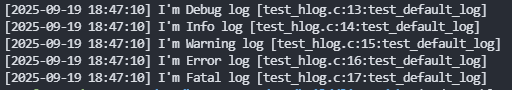
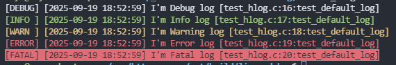

## hlog日志模块

在软件开发过程中，日志是调试和维护的关键工具。libhv 提供的 hlog 模块支持多种日志等级、格式化输出以及线程安全的日志记录，非常适合用于高性能应用。hlog 提供了一套简单而强大的日志记录机制，适用于各种应用场景。

### 日志级别

hlog模块定义了多种日志级别，用于区分日志的重要程度和详细程度。合理使用日志级别可以有效控制日志输出量，提高系统性能，并便于问题定位。

#### 日志级别宏

在[base/hlog.h](https://gitcode.com/libhv/libhv/blob/e2ba81baa2fd782a13ce4b2be7c181d8966442d4/base/hlog.h?utm_source=gitcode_repo_files)中，日志级别定义如下：

```c
typedef enum {
    LOG_LEVEL_VERBOSE = 0,
    LOG_LEVEL_DEBUG,
    LOG_LEVEL_INFO,
    LOG_LEVEL_WARN,
    LOG_LEVEL_ERROR,
    LOG_LEVEL_FATAL,
    LOG_LEVEL_SILENT
} log_level_e;
```

各日志级别的含义如下：

+ LOG_LEVEL_VERBOSE: 最详细的日志信息，通常用于开发调试
+ LOG_LEVEL_DEBUG: 调试信息，用于开发阶段
+ LOG_LEVEL_INFO: 一般信息，用于记录系统运行状态
+ LOG_LEVEL_WARN: 警告信息，表示可能存在问题但不影响系统运行
+ LOG_LEVEL_ERROR: 错误信息，表示发生了错误但系统仍可继续运行
+ LOG_LEVEL_FATAL: 致命错误，通常会导致程序终止
+ LOG_LEVEL_SILENT: 关闭所有日志输出

#### 日志级别设置

hlog模块提供了多种方式设置日志级别：

1. 使用枚举值设置

   ```c
   hlog_set_level(LOG_LEVEL_INFO);
   ```

2. 使用字符串设置

   ```c
   hlog_set_level_by_str("INFO");
   ```

#### 案例

以下是一个完整的示例，展示如何设置日志级别并输出不同级别的日志：

```c
#include "hlog.h"
 
int main() {
    // 设置日志级别为INFO
    hlog_set_level(LOG_LEVEL_INFO);

	hlogd("I'm %s log","Debug");		//不会输出，因为级别低于INFO
	hlogi("I'm %s log","Info");			//信息日志
	hlogw("I'm %s log","Warning");		//警告日志
	hloge("I'm %s log","Error");		//错误日志
	hlogf("I'm %s log","Fatal");		//致命错误日志
    return 0;
}
```


注意，其实在上面代码运行之后，并不会在控制台看到任何输出，为什么？因为日志默认是输出到文件中的，要想咋控制台中看到，需要设置日志处理器！

处理器是一个回调函数，类型为`typedef void (*logger_handler)(int loglevel, const char* buf, int len);`

```c
hlog_set_handler(stdout_logger);	
```

上述代码，将日志处理器设置为了标准输出日志处理，你还可以设置为如下处理器(处理器是一个回调函数):

+ HV_EXPORT void stdout_logger(int loglevel, const char* buf, int len);

+ HV_EXPORT void stderr_logger(int loglevel, const char* buf, int len);

+ HV_EXPORT void file_logger(int loglevel, const char* buf, int len);

### 日志格式

hlog模块允许用户自定义日志输出格式，以满足不同场景下的日志分析需求。默认的日志格式为`"%y-%m-%d %H:%M:%S.%z %L %s"`，但用户可以根据需要修改。

默认格式日志，输出如下所示：

> 2025-09-19 18:18:29.421 FATAL I'm Fatal log [test_hlog.c:14:test_default_log]

#### 格式占位符

[base/hlog.h](https://gitcode.com/libhv/libhv/blob/e2ba81baa2fd782a13ce4b2be7c181d8966442d4/base/hlog.h?utm_source=gitcode_repo_files)中定义了以下格式占位符：

| 占位符 | 含义             |
| :----- | :--------------- |
| %y     | 年份             |
| %m     | 月份             |
| %d     | 日期             |
| %H     | 小时（24小时制） |
| %M     | 分钟             |
| %S     | 秒               |
| %z     | 毫秒             |
| %Z     | 微秒             |
| %l     | 日志级别首字母   |
| %L     | 日志级别全称     |
| %s     | 日志消息内容     |
| %%     | 百分号本身       |

#### 设置日志格式

使用`hlog_set_format`函数可以自定义日志格式：

```c
//设置日志格式包含时间戳、日志级别和消息内容
hlog_set_format("[%L] %y-%m-%d %H:%M:%S.%z : %s");
```

设置之后，输出如下所示：

> [INFO ] 2025-09-24 15:36:53.627 : 999 info log [test_hv_log.c:18:test_log_file]

#### 颜色输出

控制台常规日志输出，朴朴素素平淡无奇，各level级别的日志不能直观的区分开，hlog模块支持彩色日志输出，可以通过`logger_enable_color`函数启用：

```c
logger_enable_color(hlog, 1);  // 启用彩色输出
```



让各级别的日志通过不同的色彩清晰的标注出来，看起来更直观舒服。



### 日志输出位置

hlog模块支持将日志输出到多种目标，包括控制台（stdout/stderr）和文件。用户可以根据需要灵活配置。

#### 控制台输出

hlog模块提供了两个控制台日志处理器：stdout_logger和stderr_logger，分别输出到标准输出和标准错误流。

```c
// 设置日志输出到stdout
hlog_set_handler(stdout_logger);
 
// 设置日志输出到stderr
hlog_set_handler(stderr_logger);
```

#### 文件输出

hlog模块支持将日志输出到文件，并提供了丰富的文件轮转策略。

##### 基本文件配置

```c
// 设置日志文件路径
hlog_set_file("app.log");
 
// 设置日志文件最大大小
hlog_set_max_filesize_by_str("10M");  // 10MB
 
// 设置日志文件保留天数
hlog_set_remain_days(7);  // 保留7天的日志文件
```

##### 文件轮转策略

hlog模块支持两种文件轮转策略：按大小轮转和按时间轮转。

1. 按大小轮转：当日志文件达到指定大小时，会自动创建新文件。

   ```c
   hlog_set_max_filesize_by_str("5M");  // 设置单个日志文件最大为5MB
   ```

2. 按时间轮转：每天会自动创建新的日志文件，文件名格式为"filename.YYYYMMDD.log"。

   ```c
   hlog_set_remain_days(30);  // 保留30天的日志文件
   ```

##### 文件截断策略

当日志文件达到最大大小后，hlog模块支持两种处理方式：截断和覆盖。

1. 截断模式（默认）：保留部分日志内容，删除旧内容。

   ```c
   hlog_set_truncate_percent(0.5f);  // 保留50%的内容
   ```

2. 覆盖模式：删除整个日志文件，从头开始记录。

   ```c
   hlog_set_truncate_percent(0.0f);  // 完全覆盖
   ```

#### 多目标输出

hlog模块支持同时将日志输出到多个目标，例如同时输出到控制台和文件。这需要自定义日志处理器：

```c
void multi_logger(int loglevel, const char* buf, int len) {
    stdout_logger(loglevel, buf, len);  // 输出到控制台
    file_logger(loglevel, buf, len);    // 输出到文件
}
 
// 设置多目标日志处理器
hlog_set_handler(multi_logger);
```

### 应用示例

#### 示例1：基本配置与使用

以下示例展示了hlog模块的基本配置和使用方法：

```c
#include "hlog.h"

int main() {
    // 设置日志文件
    hlog_set_file("app.log");
    // 设置日志级别
	hlog_set_level(LOG_LEVEL_INFO);
	
	// 设置日志格式
	hlog_set_format("%y-%m-%d %H:%M:%S.%z [%L] %s");
	
	// 启用彩色输出
	logger_enable_color(hlog, 1);
	
	// 输出不同级别的日志
	hlogd("Debug message");
	hlogi("Info message");
	hlogw("Warning message");
	hloge("Error message");
	hlogf("Fatal message");
	return 0;
}

```

#### 示例2：文件轮转配置

以下示例展示了如何配置日志文件轮转：

```c
#include "hlog.h"

int main() {
    // 设置日志文件
    hlog_set_file("app.log");
    // 设置日志级别
	hlog_set_level(LOG_LEVEL_INFO);
	
	// 设置日志文件最大大小为10MB
	hlog_set_max_filesize_by_str("10M");
	
	// 设置日志文件保留天数为30天
	hlog_set_remain_days(30);
	
	// 设置截断百分比为0.8（保留80%的内容）
	hlog_set_truncate_percent(0.8f);
	
	// 模拟大量日志输出
	for (int i = 0; i < 100000; i++) {
	    hlogi("Log message %d", i);
	}
	
	return 0;
}
```

#### 示例3：自定义日志处理器

以下示例展示了如何实现自定义日志处理器，将日志同时输出到控制台和文件：

```c
#include "hlog.h"

void custom_logger(int loglevel, const char* buf, int len) {
    // 输出到控制台
    stdout_logger(loglevel, buf, len);
    // 输出到文件
	file_logger(loglevel, buf, len);
}

int main() {
    // 设置自定义日志处理器
    hlog_set_handler(custom_logger);
    // 设置日志级别
	hlog_set_level(LOG_LEVEL_INFO);

	// 输出日志
	hlogi("This message will be logged to both console and file");

	return 0;
}
```

### hlog模块的线程安全性

hlog模块设计为线程安全的，内部使用互斥锁（mutex）保证多线程环境下日志的正确性。在base/hlog.c中可以看到相关实现：

```c
struct logger_s {
    // ... 其他成员 ...
    hmutex_t mutex_; // thread-safe
};

// 在logger_print函数中使用互斥锁
int logger_print(logger_t* logger, int level, const char* fmt, ...) {
    // ... 
    hmutex_lock(&logger->mutex_);
    // ... 日志处理 ...
    hmutex_unlock(&logger->mutex_);
    // ...
}
```

这种设计确保了即使在多线程环境下，日志输出也不会出现错乱或丢失。

#### 性能优化建议

虽然hlog模块本身已经做了很多性能优化，但在高并发场景下，合理使用日志系统仍然很重要。以下是一些性能优化建议：

+ 合理设置日志级别：在生产环境中，建议使用INFO或更高级别的日志级别，减少日志输出量。

+ 避免频繁输出大量日志：在循环或高频调用的函数中，应避免输出过多日志。

+ 使用异步日志：对于对性能要求极高的场景，可以考虑实现异步日志处理器，将日志写入操作放到后台线程执行。

+ 合理设置日志文件大小：过大的日志文件会影响读写性能，建议将单个日志文件大小控制在10-100MB之间。