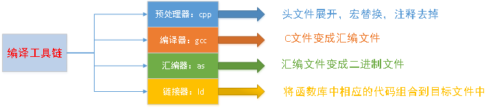
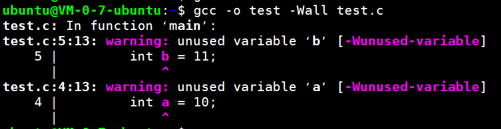
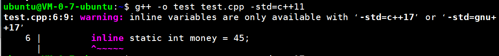
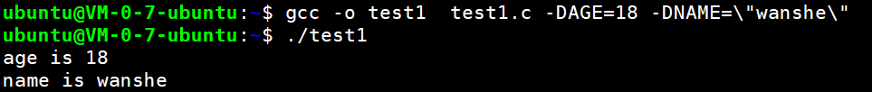

## Vim


## gcc/g++

### 编译流程

gcc编译器将c源文件到生成一个可执行程序，中间一共经历了四个步骤：


四个步骤并不是gcc独立完成的，而是在内部调用了其他工具，从而完成了整个工作流程, 其中编译最耗时, 因为要逐行检查语法.



四个步骤，对应的gcc命令为(以test.c为例)

+ `gcc -E test.c -o test.i`
+ `gcc -S test.i -o test.s`
+ `gcc -c test.s -o test.o`
+ `gcc test.o -o test`

当然也可以一步到位(四合一)

+ `gcc test.c -o test`

> vim 末行模式 :%!xxd可以以十六进制方式查看二进制文件

### 常用选项

+ -v,--version 查看gcc版本
+ `-E`                       进行预处理；不要编译、汇编或链接。
+ `-S    `                       进行编译，不汇编或链接。
+ `-c`                       编译和汇编，但不要链接。
+ `-o <file>`         指定输出文件名
+ `-I`                        指定头文件路径

+ `-l`                        指定库名
+ `-L`                        指定库文件所在路径
+ `-g`                        生成的目标包含调试信息，使用gdb调试必须添加-g参数
+ `-O<n>`                  n=0~3 编译优化，n越大优化越多
+ `-Wall`                  提示更多警告
+ `-D`                        编译时定义宏

+ `-std=c++<17>`    g++专用，用来指定c++标准

**举例**

+ `-O`优化等级

  ```c
  //test.c
  #include<stdio.h>
  int main()
  {   
      int a = 10;
      int b = 11;
      int c = 33;
      printf("c=%d\n",c);
      return 0;
  }
  //可能会被优化成:
  #include<stdio.h>
  int main()
  {   
      int c = 33;
      printf("c=%d\n",c);
      return 0;
  }
  ```

+ `-Wall`提示更多警告，还是使用上面的代码，加上`-Wall`选项测试一下

  

可以看到未使用的变量都已经产生警告了。

+ g++指定标准`-std=c++<>`

  ```cpp
  #include<iostream>
  class Girl
  {
  public:
      inline static int money = 45;
  };
  int main()
  {   
      std::cout<<"money is " << Girl::money <<std::endl;
      return 0;
  }
  ```

  `g++ -o test test.cpp`直接编译也没毛病，如果有问题可以加上选项`g++ -o test test.cpp -std=c++17`

  如果改为c++11，则会发生警告。

  

+ `-D`编译时定义宏

  ```C
  #include<stdio.h>
  int main()
  {
      printf("age is %d\n",AGE);
      printf("name is %s\n",NAME);
      return 0;
  }
  ```

  编译：

  

  字符串需要用双引号包裹，而且双引号还要用`\`转义。


https://cloud.tencent.com/developer/article/2239304?areaSource=102001.5&traceId=3Ltalgy3wXZdNwJ9mtyFI

