## makefile

**Makefile**是一种常用于编译的脚本语言，它可以更好更方便的管理你的项目的代码编译，节约编译时间（没改动的文件不编译）

makefile带来的好处就是——“自动化编译”, 一旦写好, 只需要一个make命令, 整个工程完全自动编译, 极大的提高了软件开发的效率。

**[make](https://www.gnu.org/software/make/manual/make.html)**是一个命令工具, 是一个解释makefile中指令的命令工具。

### makefile语法

makefile文件由一组**依赖关系**和**规则**构成。每个依赖关系由一个目标（即将要创建的文件）和一组该目标所依赖的源文件组成。而规则描述了如何通过这些依赖文件创建目标。一般来说，目标是一个单独的可执行文件。

### make命令选项和参数

make程序本身有许多选项，其中最常用的3个选项如下所示：

+  `-k`：它的作用是让make命令在发现错误时仍然继续执行，而不是在检测到第一个错误时就停下来。你可以利用这个选项在一次操作中发现所有未编译成功的源文件。

+  `-n`：它的作用是让make命令输出将要执行的操作步骤，而不真正执行这些操作。

+  `-f <filename>`：它的作用是告诉make命令将哪个文件作为makefile文件。

  > 如果未使用这个选项，标准版本的make命令将首先在当前目录下查找名为makefile的文件，如果该文件不存在，它就会查找名为Makefile的文件。

### 初始makefile

想要掌握makefile，首先需要了解两个概念，⼀个是**⽬标（target）**，另⼀个就是**依赖（dependency）**。⽬标就是指要⼲什么，或说运⾏ make 后⽣成什么，⽽依赖是告诉 make 如何去做以实现⽬标。在 Makefile 中，⽬标和依赖是通过规则（rule）来表达的。

#### 目标

##### 单个目标

创建名为makefile的文件，输入如下内容：

```bash
hello:
     echo "hello world"
```

+ 冒号之前的hello是目标，名字可以是由字⺟和下划线‘_’组成 。
+ echo “hello wrold”就是生成目标的命令，这些命令可以是任何你可以在你的环境中运⾏的命令。
+ 注意：命令前面必须使用tab不能使用空格，否则会报错分隔符丢失`makefile:2: *** missing separator.  Stop.`

使用`make`命令输出如下：

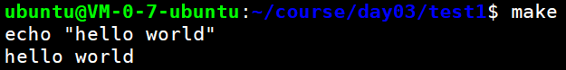

+ 第一行为执行的命令
+ 第二行为执行命令输出的结果
+ 如果不想命令也显示出来，在命令之前加上@符号即可！

##### 多个目标

创建名为makefile1的文件，输入如下内容：

```bash
hello:
	@echo "Hello world"
test:
	@echo "test game"
```

使用`make`命令输出如下：


因为makefile文件名为`makefile1`，所以我们得通过-f选项来指定它。

但是输出结果，之后hello wrold，也就是只构建了hello目标，test目标没有构建，为什么呢？

这是因为make当没有指明具体的⽬标是什么 时，那么 make 以 Makefile ⽂件中定义的第⼀个⽬标作为这次运⾏的⽬标。这“第⼀个”⽬标也称之 为默认⽬标。当 make 得到⽬标后，先找到定义⽬标的规则，然后运⾏规则中的命令来达到构建⽬标的⽬的。

如何指定目标，如下所示：

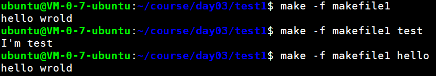

直接在make命令后面写上目标名称即可！！！

那如果不想指定目标，但是又想所有目标都构建，怎么办呢？

```makefile
all:hello test
hello:
    @echo "hello wrold"
test:
    @echo "I'm test"
```

我们知道，一个Makefile中只有一个最终目标，就是第一个目标，上面的代码中，显然就是 all，那么all的依赖有2个，分别为hello和test，而make能自动推导，make在生成all的时候，自然要自动推导hello和test，这样我们就能通过一个Makefile生成了2个目标，很巧妙的用法。

执行make命令结果为：

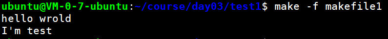

接下来，我们拿代码来试一下。

创建`test.c`文件，输入如下代码：

```c
#include<stdio.h>

int main()
{
	printf("hello wrold,I'm maye\n");
	return 0;
}
```

创建`makefile2`文件，输入如下代码：

```makefile
test:
	gcc -o test test.c
```

执行make命令结果为：

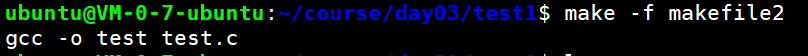

ls查看一下，可以发现test可执行程序已经生成。

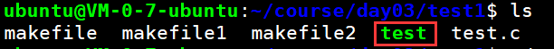

后续当你修改了test.c文件之后，直接执行make命令即可，不需要再写gcc命令了。

#### 依赖

如上面的makefile1中写的`all:hello test`，all ⽬标后⾯的 test 是告诉 make，all ⽬标依赖 hello、test ⽬标，这⼀依赖⽬标在 Makefile 中⼜被称之为先决条件。出现这种⽬标依赖关系时，make⼯具会按 从左到右的先后顺序先构建规则中所依赖的每⼀个⽬标。如果希望构建 all ⽬标，那么make 会在构建它之前得先构建 hello、test ⽬标，这就是为什么我们称之为先决条件的原因。

#### 规则

⼀个规则是由⽬标（targets）、依赖（dependency）以及命令（commands）所组成。

#### makefile原理

有如下两个.c文件：

foo.c

```c
#include<stdio.h>

void foo()
{
	printf("this is foo()\n");
}
```

main.c

```c
extern void foo();

int main()
{
	foo();
}
```

##### 不会自动更新

写一个makefile文件来进行管理。

```makefile
test2:
	gcc -o test2 foo.c main.c
```

第一次执行make时，能正确生成程序。

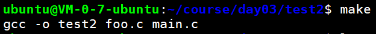

当我们随便对某个文件进行修改，再次执行make命令，发现并没有重新编译代码

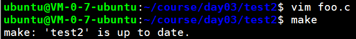

make提示的是test2已经是最新的了，不需要编译生成；但是明明已经修改了为什么还提示已经是最新的呢？

很简单，make不知道我们依赖哪些文件，所以每次都不会进行更新，当然可以先删除test2可执行程序，然后执行make命令即可。

##### 可以自动更新

要想每次make时，都自动检测文件是否发送变化，只需要在makefile文件的规则里面指定依赖即可。

```makefile
test2:foo.c main.c
	gcc -o test2 foo.c main.c
```

先删除掉test2目标，然后执行make

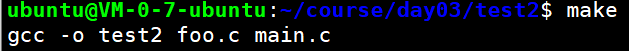

第一次make时没加依赖没有什么不同。

让我们再次修改某个文件，然后执行make试试。

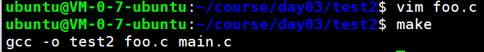

这次终于能重新编译了，无需手动删除test2目标。

这个makefile其实有个缺点，那就是效率低, 只要随便修改一个文件, 所有的文件会全部重新编译（从上面的命令就可以看出`gcc -o test2 foo.c main.c`，这里有两个源文件）。

##### 优化的自动更新

其实我们还可以换一种方式编写makefile，比如让每个.c文件都生成.o文件，然后让test2依赖.o即可，而每个.o又依赖对应的.c文件。

```makefile
test2:foo.o main.o
	gcc -o test2 foo.o main.o

foo.o:foo.c
	gcc -o foo.o -c foo.c

main.o:main.c
	gcc -o main.o -c main.c
```

第一次make：正常编译

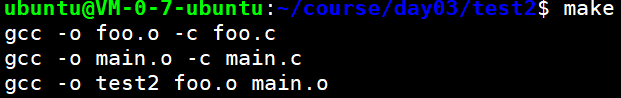

第二次make：目标已经是最新


修改`foo.c`之后，再次make

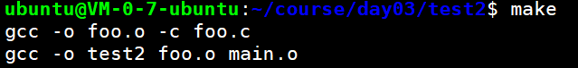

可以看到，只有foo.c重新编译了，main.c并没有重新编译，而是原来的main.o直接和新的foo.o链接生成test2。

##### 基本原则

+ 若想生成目标, 检查规则中的所有的依赖文件是否都存在:
  + 如果有的依赖文件不存在, 则向下搜索规则, 看是否有生成该依赖文件的规则:
  + 如果有规则用来生成该依赖文件, 则执行规则中的命令生成依赖文件;
  + 如果没有规则用来生成该依赖文件, 则报错.

<center>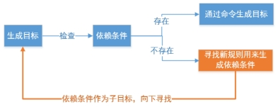</center> 

+ 如果所有依赖都存在, 检查规则中的目标是否需要更新, 必须先检查它的所有依赖,依赖中有任何一个被更新, 则目标必须更新.(检查的规则是哪个时间大哪个最新)
  + 若目标的时间 > 依赖的时间, 不更新
  + 若目标的时间 < 依赖的时间, 则更新

<center>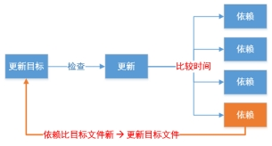</center> 

**总结：**

+ 分析各个目标和依赖之间的关系

+ 根据依赖关系自底向上执行命令

+ 根据依赖文件的时间和目标文件的时间确定是否需要更新

+ 如果目标不依赖任何条件, 则执行对应命令, 以示更新(如:伪目标)

### 伪目标

在上面的测试案例中，生成了foo.o、main.o中间文件以及test2目标，如果想要清理掉可以使用`rm`，但是当要清理的文件非常多时，直接使用`rm`就比较费劲了。我们可以将rm写入makefile文件，然后执行`make clean`进行清理。

创建test3目录，然后将test2目录中的所有文件拷贝到test3中`cp ../test2/* ./`

接着修改makefile文件如下：

```makefile
test2:foo.o main.o
	gcc -o test2 foo.o main.o

foo.o:foo.c
	gcc -o foo.o -c foo.c

main.o:main.c
	gcc -o main.o -c main.c
#新增clean目标
clean:
	rm -f foo.o main.o test2
```

最后，使用`make clean`进行清理，可以看到`foo.o`，`main.o`，`test2`都已经被删除掉了。

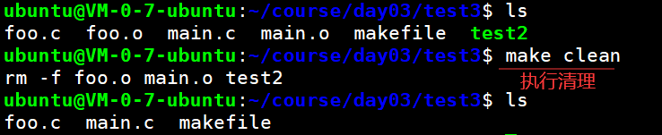

很完美，对不对，但是如果 *Makefile* 同目录下存在名为 *clean* 的文件，*clean* 目标的执行将会出现问题。

因为这个时候make 将clean当成是一个文件，并且在当前的目录下找到了这个文件，再加上clean目标没有任何依赖，这时候进行make clean时，会认为clean是最新的。

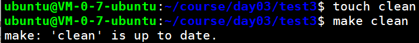

为了避免这种问题，可以显式的将其声明为伪目标，方法是让它成为特殊目标 *.PHONY* 的依赖目标，如下所示：

```makefile
.PHONY:clean
clean:
	rm *.o test2
```

修改makefile之后就可以清理成功了。

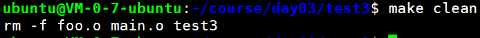


> 伪目标不是一个真实的文件名。当用 *make* 显式指定请求时，伪目标仅仅是将要执行的命令的名字。有两个理由去使用伪目标：**一是避免和相同的文件名产生冲突；二是提升性能。**
>
> 如果你写了一条规则（rule），而该规则的命令不会实际创建目标文件，那么 *make* 每次到达该目标时，其命令总会被执行。


### 变量(宏)

对于管理包含非常多源文件的大型项目来说，上述使用方法就显得过于庞大并缺乏弹性。因此，makefile文件允许你使用宏以一种更通用的格式来书写它们。

#### 自定义宏

你通过语句MACRONAME=value在makefile文件中定义宏，引用宏的方法是使用\$(MACRONAME)或\${MACRONAME}。make的某些版本还接受​\$MACRONAME的用法。如果想把一个宏的值设置为空，你可以令等号（=）后面留空。

把test3拷贝一份命名为test4，然后修改makefile：

```makefile
.PHONY:clean
EXE=test4   #生成的可执行文件名
${EXE}:foo.o main.o
    gcc -o ${EXE} foo.o main.o

foo.o:foo.c
    gcc -o foo.o -c foo.c

main.o:main.c
    gcc -o main.o -c main.c


clean:
    rm -f foo.o main.o ${EXE} 
```

执行make一样可以生成成功，而且当你需要修改可执行文件名时，只需要修改宏的值即可！

而且，宏的值还可以通过make命令进行指定：

```makefile
make "EXE=foo"
```

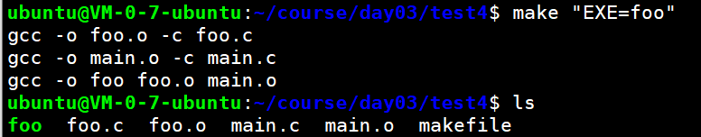

这样，都不需要修改makefile文件了，只需要给make命令传递参数即可，非常方便。

#### 自动变量

自动化变量的取值根据执行的规则来决定，取决于执行规则的目标文件和依赖文件，通过使用它们，你可以让makefile文件变得更加简洁。几个较常用的宏列在下表中，其使用方法可以在后面的示例中看到。这些宏在使用前才展开，所以它们的含义会随着makefile文件的处理进展而发生变化。

| 宏   | 定义                                                         |
| ---- | ------------------------------------------------------------ |
| $@   | 当前规则中的目标                                             |
| $<   | 当前规则中的第一个以来                                       |
| $^   | 当前规则中所有依赖，以空格分隔，会去除重复项                 |
| $?   | 当前目标所依赖的文件列表中比当前目标文件还要新的文件(就是距离上次生成之后，哪些文件修改了) |

在makefile文件中，你可能还会看到下面两个有用的特殊字符，它们出现在命令之前。

+ `-`：告诉make命令忽略所有错误。例如，如果想创建一个目录，但又想忽略任何错误（比如目录已存在），你就可以在mkdir命令的前面加上一个减号。
+ `@`：告诉make在执行某条命令前不要将该命令显示在标准输出上。如果想用echo命令给出一些说明信息，这个字符将非常有用。

把test4拷贝一份命名为test5，然后修改makefile：

```makefile
.PHONY:clean
EXE = test4	#生成的可执行文件名
${EXE}:foo.o main.o
	gcc -o $@ $^ 
	@echo  "\$$@ = $@"	#输出宏的值
	@echo  "\$$< = $<"
	@echo  "\$$^ = $^"
	@echo  "\$$? = $?"


foo.o:foo.c
	gcc -o $@ -c $^ 
	
main.o:main.c
	gcc -o $@ -c $^

clean:
	rm -f foo.o main.o ${EXE} 
```

效果一样，但是更加方便了~

### 内置规则(隐含规则)

目前为止，你在makefile文件中对每个操作步骤的执行都做了精确的说明。事实上，make命令本身带有大量的内置规则，它们可以极大地简化makefile文件的内容，尤其在拥有许多源文件时更是如此。为测试这些内置规则，下面创建文件foo.c，它是一个传统的“Hello World”程序：

```c
#include<stdio.h>
int main()
{
    printf("hello wrold\n");
    return 0;
}
```

在不使用makefile文件时，尝试使用make命令来编译它：

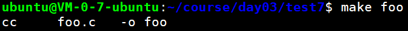

可以看到，make命令知道如何调用编译器，虽然此例中，它选择的是cc而不是gcc（在Linux系统中，这没有问题，因为cc通常是gcc的一个链接文件）。

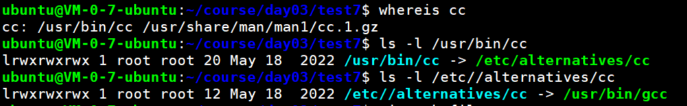

有时，这些内置规则又被称为推导规则，由于它们都会使用宏定义，因此可以通过给宏赋予新值来改变其默认行为。

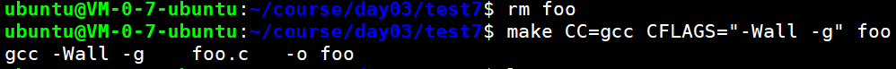

你可以通过-p选项让make命令打印出其所有内置规则。由于内置规则实在太多，不能在此一一列出，所以这里只给出了GNU版本make的make -p命令的部分输出，显示了其中一部分的规则：


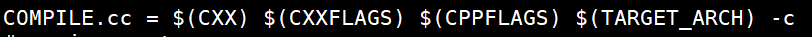

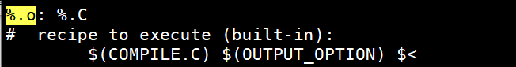

考虑到存在这些内置规则，你可以将文件makefile中用于制作目标的规则去掉，而只需指定依赖关系，从而达到简化makefile文件的目的。因此该文件中相应部分的内容将变得很简单，如下所示：

```cpp
main:main.o a.o
main.o:main.c a.h
a.o:a.c a.h
```

main.c、a.c、a.h是简单的测试文件，自己创建就好

### 模式规则

在上面的案例中，虽然我们使用了宏、内置宏来简化操作，但是在文件非常多的时候，也要手动的写从.c生成.o的规则，不方便。

因此，makefile还支持模式匹配，模式匹配规则中使用的百分号`%`与UNIX shell里面的通配符 `*`非常类似，它也可以代表任何长度的字符，并能被放在模式匹配中的任何位置，但在一个模式匹配中 **只能出现一次。**

```makefile
test6:main.o foo.o
	gcc -o $@ $<
%.o:%.c
	gcc -o $@ -c $<
```

### 函数

函数是 Makefile 中的另⼀个利器，现在我们看⼀看采⽤函数如何来简化 simple 项⽬的 Makefile。对于
simple 项⽬的 Makefile，尽管我们使⽤了模式规则，但还有⼀件⽐较恼⼈的事，我们得在这个Makefile
中指明每⼀个需要被编译的源程序。对于⼀个源程序⽂件⽐较多的项⽬，如果每增加或是删除⼀个⽂件都
得更新 Makefile，其⼯作量也不可⼩视！

#### wildcard

wildcard 是通配符函数，通过它可以查找到指定目录下指定类型的文件。其形式是：`$(wildcard pattern)`

makefile文件如下所示：

```makefile
SRC=${wildcard *.c src/*.c *.h include/*.h}
all:
	echo "SRC=${SRC}"
```

项目目录结构如下：

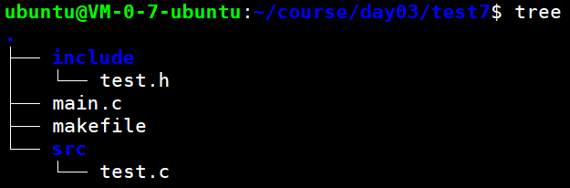

执行make命令，输出如下：

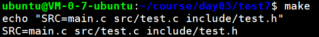

可以看到，指定的所有.c 和.h 文件都找到了。

想要正确编译程序，makefile得这样写：

```makefile
SRC=${wildcard *.c src/*.c *.h include/*.h}
INCLUDE=-Iinclude

test:${SRC}
	${CC} -o $@ $< ${INCLUDE}
```

#### patsubst

patsubst 函数是⽤来进⾏字符串替换的，其形式是：`$(patsubst pattern, replacement, text)`

如：把SRC变量里所有后缀为.c的文件替换成.o

```makefile
SRC=${wildcard *.c src/*.c *.h include/*.h}		#这里的通配符使用*号
OBJECT = ${patsubst %.c,%.o,${SRC}}				#这里的通配符使用%号
all:
	echo "SRC=${SRC}"
	echo "OBJECT=${OBJECT}"
```

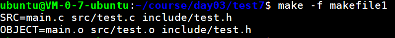

要想正确编译程序，makefile文件得这样写：

```makefile
.PHONY:clean

SRC=${wildcard *.c src/*.c *.h include/*.h}
OBJECT = ${patsubst %.c,%.o,${SRC}}
INCLUDE=-Iinclude
TARGET=main
${TARGET}:${OBJECT}
	${CC} -o $@ ${OBJECT}
%.o:%.c
	${CC} -o $@ -c $< ${INCLUDE}

clean:
	rm -rf  ${TARGET} 
	find ./ -name *.o | xargs rm
```

[makefile](https://www.cnblogs.com/paul-617/p/15501875.html)

[Makefile基础知识_七种不同的写法](https://blog.csdn.net/yueyuanhuaqing/article/details/124393402)

[makefile生成*.d依赖文件，解决“只修改.h头文件，包含了该头文件的.c文件不重新编译的问题”](https://blog.csdn.net/Sup_klz/article/details/127587264)


## gdb

### 介绍

 GDB 全称“GNU symbolic debugger”，从名称上不难看出，它诞生于 GNU 计划（同时诞生的还有 GCC、Emacs 等），是 Linux 下常用的程序调试器。发展至今，GDB 已经迭代了诸多个版本，当下的 GDB 支持调试多种编程语言编写的程序，包括 C、C++、Go、Objective-C、OpenCL、Ada 等。实际场景中，GDB 更常用来调试 C 和 C++ 程序。一般来说，GDB主要帮助我们完成以下四个方面的功能：

1. 启动你的程序，可以按照你的自定义的要求随心所欲的运行程序。
2. 在某个指定的地方或条件下暂停程序。
3. 当程序被停住时，可以检查此时你的程序中所发生的事。
4. 在程序执行过程中修改程序中的变量或条件，将一个bug产生的影响修正从而测试其他bug。

### 生成调试信息

使用GDB调试程序，有以下两点需要注意：

1. 要使用GDB调试某个程序，该程序编译时必须加上编译选项 **`-g`**，否则该程序是不包含调试信息的(相当于release模式)；`-g也是分级别的`

   + **-g1：**级别1（-g1）不包含局部变量和与行号有关的调试信息，因此只能够用于回溯跟踪和堆栈转储之用。回溯跟踪指的是监视程序在运行过程中的函数调用历史，堆栈转储则是一种以原始的十六进制格式保存程序执行环境的方法，两者都是经常用到的调试手段
   + **-g2：**这是**默认的级别**，此时产生的调试信息包括扩展的符号表、行号、局部或外部变量信息
   + **-g3：**包含级别2中的所有调试信息，以及源代码中定义的宏

2. GCC编译器支持 **`-O`** 和 **`-g`** 一起参与编译。GCC编译过程对进行优化的程度可分为5个等级，分别为 ：
   + **-O/-O0**： 不做任何优化，这是默认的编译选项 ；
   + **-O1**：使用能减少目标文件大小以及执行时间并且不会使编译时间明显增加的优化。 该模式在编译大型程序的时候会花费更多的时间和内存。在 -O1下：编译会尝试减少代 码体积和代码运行时间，但是并不执行会花费大量时间的优化操作。
   + **-O2**：包含 -O1的优化并增加了不需要在目标文件大小和执行速度上进行折衷的优化。 GCC执行几乎所有支持的操作但不包括空间和速度之间权衡的优化，编译器不执行循环 展开以及函数内联。这是推荐的优化等级，除非你有特殊的需求。 -O2会比 -O1启用多 一些标记。与 -O1比较该优化 -O2将会花费更多的编译时间当然也会生成性能更好的代 码。
   + **-O3**：打开所有 -O2的优化选项并且增加 -finline-functions, -funswitch-loops,-fpredictive-commoning, -fgcse-after-reload and -ftree-vectorize优化选项。这是最高最危险 的优化等级。用这个选项会延长编译代码的时间，并且在使用 gcc4.x的系统里不应全局 启用。自从 3.x版本以来 gcc的行为已经有了极大地改变。在 3.x，，-O3生成的代码也只 是比 -O2快一点点而已，而 gcc4.x中还未必更快。用 -O3来编译所有的 软件包将产生更 大体积更耗内存的二进制文件，大大增加编译失败的机会或不可预知的程序行为（包括 错误）。这样做将得不偿失，记住过犹不及。在 gcc 4.x.中使用 -O3是不推荐的。
   + **-Os**：专门优化目标文件大小 ,执行所有的不增加目标文件大小的 -O2优化选项。同时 -Os还会执行更加优化程序空间的选项。这对于磁盘空间极其紧张或者 CPU缓存较小的 机器非常有用。但也可能产生些许问题，因此软件树中的大部分 ebuild都过滤掉这个等 级的优化。使用 -Os是不推荐的。

   如：有mian.c文件，有如下两种编译方式：

   ```bash
   make main CFLAGS="-O0 -g"
   
   gcc -O -g -o main main.c
   ```

   

### 启动gdb

gdb调试主要有三种方式：

1. 直接调试目标程序：
   + `gdb ./filename` 
   + 也可以先启动gdb，然后使用`file ./filename`
2. 附加进程id：`gdb attach pid`
3. 调试core文件：`gdb filename corname`

### 退出gdb

- 可以用命令：**q（quit的缩写）或者 Ctrl + d** 退出GDB。
- 如果GDB attach某个进程，退出GDB之前要用命令 **detach** 解除附加进程。

### 常用命令

| 命令名称    | 命令缩写  | 命令说明                                         |
| ----------- | --------- | ------------------------------------------------ |
| run         | r         | 运行一个待调试的程序                             |
| continue    | c         | 让暂停的程序继续运行                             |
| next        | n         | 运行到下一行                                     |
| step        | s         | 单步执行，遇到函数会进入                         |
| until       | u         | 运行到指定行停下来                               |
| finish      | fi        | 结束当前调用函数，回到上一层调用函数处           |
| return      | return    | 结束当前调用函数并返回指定值，到上一层函数调用处 |
| jump        | j         | 将当前程序执行流跳转到指定行或地址               |
| print       | p         | 打印变量或寄存器值                               |
| backtrace   | bt        | 查看当前线程的调用堆栈                           |
| frame       | f         | 切换到当前调用线程的指定堆栈                     |
| thread      | thread    | 切换到指定线程                                   |
| break       | b         | 添加断点                                         |
| tbreak      | tb        | 添加临时断点                                     |
| delete      | d         | 删除断点                                         |
| enable      | enable    | 启用某个断点                                     |
| disable     | disable   | 禁用某个断点                                     |
| watch       | watch     | 监视某一个变量或内存地址的值是否发生变化         |
| list        | l         | 显示源码                                         |
| info        | i         | 查看断点 / 线程等信息                            |
| ptype       | ptype     | 查看变量类型                                     |
| disassemble | dis       | 查看汇编代码                                     |
| set args    | set args  | 设置程序启动命令行参数                           |
| show args   | show args | 查看设置的命令行参数                             |

### 常用命令示例

#### run

默认情况下，以 `gdb ./filename` 方式启用GDB调试只是附加了一个调试文件，并没有启动这个程序，需要输入run命令（简写为r）启动这个程序：

```css
ubuntu@VM-0-7-ubuntu:~/course/day03/test8$ gdb ./main
GNU gdb (Ubuntu 12.1-0ubuntu1~22.04) 12.1
...此处省略N行...
Reading symbols from ./main...
(gdb) run
Starting program: /home/ubuntu/course/day03/test8/main 
...此处省略N行...
hello wrold
input number:
```

 以上是以main程序为例，输入 run 后运行了mian程序，在gdb界面按 Ctrl + C 让gdb中断下来，再次输入 r 命令，gdb会询问是否重启程序，输入 y（或yes）：

```css
input number:^C
Program received signal SIGINT, Interrupt.
0x00007ffff7e9e992 in __GI___libc_read (fd=0, buf=0x5555555596b0, nbytes=1024) at ../sysdeps/unix/sysv/linux/read.c:26
26	../sysdeps/unix/sysv/linux/read.c: No such file or directory.
(gdb) run
The program being debugged has been started already.
Start it from the beginning? (y or n) y
Starting program: /home/ubuntu/course/day03/test8/main 
```

 退出gdb，会提示用户要关闭当前调试进程，是否继续退出：

```css
input number:^C
Program received signal SIGINT, Interrupt.
0x00007ffff7e9e992 in __GI___libc_read (fd=0, buf=0x5555555596b0, nbytes=1024) at ../sysdeps/unix/sysv/linux/read.c:26
26	../sysdeps/unix/sysv/linux/read.c: No such file or directory.
(gdb) q
A debugging session is active.

	Inferior 1 [process 1843311] will be killed.

Quit anyway? (y or n) 
```

#### break

break命令（简写为b）用于添加断点，可以使用以下几种方式添加断点：

- **break FunctionName**，在函数的入口处添加一个断点；
- **break LineNo**，在**当前文件**行号为**LineNo**处添加断点；
- **break FileName:LineNo**，在**FileName**文件行号为**LineNo**处添加一个断点；
- **break FileName:FunctionName**，在**FileName**文件的**FunctionName**函数的入口处添加断点；
- **break -/+offset**，在当前程序暂停位置的前/后 offset 行处下断点；
- **break ... if cond**，下条件断点；

> tbreak命令时添加一个临时断点，断点一旦被触发就自动删除，使用方法同 break

##### 在函数入口下断点

比如给main函数下个断点，让程序一运行就断在main处，方便调试。

```css
(gdb) b main		/*在main入口下断点*/
Breakpoint 1 at 0x555555555225: file main.c, line 10.
(gdb) r				/*运行程序*/
Starting program: /home/ubuntu/course/day03/test8/main 
[Thread debugging using libthread_db enabled]
Using host libthread_db library "/lib/x86_64-linux-gnu/libthread_db.so.1".
/*程序断在了main函数开始的位置*/
Breakpoint 1, main (argc=1, argv=0x7fffffffe3f8) at main.c:10/
/*这里提示了行号 和 中断行的代码*/
10	int main(int argc,char*argv[]) {
(gdb)
```

##### 在当前文件的指定行下断点

比如在15行下断点。

```css
(gdb) b 15
Breakpoint 2 at 0x127d: file main.c, line 16.
(gdb) info b		/*查看所有断点信息*/
Num     Type           Disp Enb Address            What
1       breakpoint     keep y   0x0000000000001225 in main at main.c:10
2       breakpoint     keep y   0x000000000000127d in main at main.c:16
(gdb) 
```

##### 在指定文件的指定行、函数下断点

```css
b hello.c:show
b hello.c:16
```

#### 执行

##### next/step

`next`和`step`都是单步执行，区别是：

+ `next`是单步步过（step over），简写为`n`，即遇到函数直接跳过，不进入函数内部。
+ `step`是单步步入（step into），简写为`s`，即遇到函数会进入函数内部。

##### continue

 当gdb触发断点或者使用 Ctrl + C 命令中断下来后，想让程序继续运行，只要输入 continue（简写为c）命令即可。

> ctrl+c中断之后，可以进行设置断点等操作，操作完成之后继续运行即可

```css
input number:^C		/*在输入时ctrl + c中断*/
Program received signal SIGINT, Interrupt.
0x00007ffff7e9e992 in __GI___libc_read (fd=0, buf=0x5555555596b0, nbytes=1024) at ../sysdeps/unix/sysv/linux/read.c:26
26	../sysdeps/unix/sysv/linux/read.c: No such file or directory.
(gdb) continue		/*输入continue命令继续运行程序*/
Continuing.
12345
54321
finished~~~~
[Inferior 1 (process 1847573) exited normally]
```

##### return/finish

`return`和`finish`都是退出函数，区别是：

+ `return` 命令会立即退出当前函数，剩下的代码不会执行了；return 可以指定返回值
+ `finish` 命令是会继续执行完该函数剩余代码再正常退出。

#### 维护断点

##### info 

查看断点信息

+ `info break、info b、i b`显示当前所有断点信息。

+ `info break 2` 显示编号为2的断点信息

##### disable

禁用断点，使断点失效，简写命令是dis。

+ disable 禁用所有断点
+ disable num1 num2 ... 禁用指定编号的断点
+ disable [m-n] 禁用(编号)m-n之间的所有断点

```css
(gdb) i b
Num     Type           Disp Enb Address            What
1       breakpoint     keep y   0x0000000000001225 in main at main.c:10
2       breakpoint     keep y   0x000000000000127d in main at main.c:16
3       breakpoint     keep y   0x0000000000001249 in main at main.c:12
(gdb) disable 1-2		/*让1到2断点失效*/
(gdb) i b
Num     Type           Disp Enb Address            What
1       breakpoint     keep n   0x0000000000001225 in main at main.c:10
2       breakpoint     keep n   0x000000000000127d in main at main.c:16
3       breakpoint     keep y   0x0000000000001249 in main at main.c:12
(gdb) 
```

断点信息中第四列 ***Enb***，当断点启动时是 y，断点被禁用后是 n。

##### enable

使失效断点生效, 简写命令是ena。

+ enable 启用所有断点
+ enable num1 num2 ... 启用指定编号的断点
+ enable [m-n] 启用m-n之间的断点

##### delete

删除断点

+ delete 删除所有断点
+ delete num1 num2... 删除指定编号的断点
+ delete [m-n] 删除m-n之间的所有断点

> 如果只是暂时不需要断点，更好的方法是disable禁用断点, disable了的断点, gdb不会删除, 当你还需要时, enable即可, 就好像回收站一样。

#### backtrace/frame

+ `backtrace` 可简写为bt，用于查找当前调用堆栈。
+ `frame num`可简写为`f num` ，用于查看指定的堆栈调用。

```css
(gdb) backtrace
#0  splitNumber (num=<optimized out>) at main.c:6		/*#0 当前所在函数*/
#1  0x0000555555555275 in test_splitNumber () at main.c:16	/*#1 调用#0的函数*/
#2  0x00005555555552ad in main (argc=<optimized out>, argv=<optimized out>)
    at main.c:20 /*#2 调用#1的函数*/
(gdb) f 1		/*查看#1 处的堆栈信息*/
#1  0x0000555555555275 in test_splitNumber () at main.c:16
16		splitNumber(number);
(gdb) f 2
#2  0x00005555555552ad in main (argc=<optimized out>, argv=<optimized out>)
    at main.c:20
20		test_splitNumber();
(gdb) f 0
#0  splitNumber (num=<optimized out>) at main.c:6
6			num/=10;
(gdb) 
```

#### list

显示代码。

- **list** 输出上一次list命令显示的代码后面的代码，如果是第一次执行list命令，则会显示当前正在执行代码位置附近的代码；
- **list -** 带一个减号，显示上一次list命令显示的代码前面的代码；
- **list LineNo**显示当前代码文件第 **LineNo** 行附近的代码；
- **list FileName:LineNo**，显示 **FileName** 文件第 **LineNo** 行附近的代码；
- **list FunctionName**，显示当前文件的 **FunctionName** 函数附近的代码；
- **list FileName:FunctionName**，显示 **FileName** 文件的 **FunctionName** 函数附件的代码；
- **list [from,to]**，其中**from**和**to**是具体的代码位置，显示这之间的代码；

**list**命令默认只会输出 **10** 行源代码，也可以使用如下命令修改：

- **show listsize**，查看 **list** 命令显示的代码行数；
- **set listsize [count]**，设置 **list** 命令显示的代码行数为 **count**;

#### print/ptype

print用来查看/修改变量的值，ptype用来查看变量的类型。

+ `print param` 查看指定的变量；
+ `print param=value` 在调试过程中修改变量的值；
+ `print a+b+c` 可以进行一定的表达式计算，这里是计算a、b、c之和；
+ `print func()` 输出func函数执行的结果，常见的用途是打印系统函数执行失败的原因：`print strerror(errno)`
+ `print *this` 在c++对象中，可以输出当前对象的各个成员变量的值

#### thread命令

 命令格式及作用：

- **info thread**，查看当前进程的所有线程运行情况；
- **thread 线程编号**，切换到具体编号的线程上去；

#### watch

 **watch** 命令用来监视一个变量或者一段内存，当这个变量或者内存的值发生变化时，GDB就会中断下来。被监视的某个变量或内存地址会产生一个 **watch point（观察点）**。

 命令格式：

- **watch 整型变量**；
- **watch 指针变量**，监视的是指针变量本身；
- **watch \*指针变量**，监视的是指针所指的内容；
- **watch 数组变量或内存区间**；

```css
(gdb) watch num				/*监视变量*/
Hardware watchpoint 3: num
(gdb) n
6			num/=10;		/*当变量发生改变时，会输出旧值和新值*/
(gdb) n
Hardware watchpoint 3: num

Old value = 1234
New value = 123
```


### layout

[gdb调试的layout使用_gdb layout_zhangjs0322的博客-CSDN博客](https://blog.csdn.net/zhangjs0322/article/details/10152279)


[gdb](https://blog.csdn.net/gatieme/article/details/51671430)

[你可能不知道的GDB命令 - 知乎 (zhihu.com)](https://zhuanlan.zhihu.com/p/363973508)

[GDB使用详解 - 知乎 (zhihu.com)](https://zhuanlan.zhihu.com/p/297925056#概述)