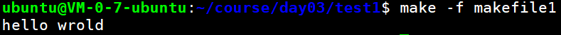

## makefile

**Makefile**是一种常用于编译的脚本语言，它可以更好更方便的管理你的项目的代码编译，节约编译时间（没改动的文件不编译）

makefile带来的好处就是——“自动化编译”, 一旦写好, 只需要一个make命令, 整个工程完全自动编译, 极大的提高了软件开发的效率。

**make**是一个命令工具, 是一个解释makefile中指令的命令工具。

### makefile语法

makefile文件由一组**依赖关系**和**规则**构成。每个依赖关系由一个目标（即将要创建的文件）和一组该目标所依赖的源文件组成。而规则描述了如何通过这些依赖文件创建目标。一般来说，目标是一个单独的可执行文件。

### make命令选项和参数

make程序本身有许多选项，其中最常用的3个选项如下所示：

+  `-k`：它的作用是让make命令在发现错误时仍然继续执行，而不是在检测到第一个错误时就停下来。你可以利用这个选项在一次操作中发现所有未编译成功的源文件。

+  `-n`：它的作用是让make命令输出将要执行的操作步骤，而不真正执行这些操作。

+  `-f <filename>`：它的作用是告诉make命令将哪个文件作为makefile文件。

  > 如果未使用这个选项，标准版本的make命令将首先在当前目录下查找名为makefile的文件，如果该文件不存在，它就会查找名为Makefile的文件。

### 初始makefile

想要掌握makefile，首先需要了解两个概念，⼀个是**⽬标（target）**，另⼀个就是**依赖（dependency）**。⽬标就是指要⼲什么，或说运⾏ make 后⽣成什么，⽽依赖是告诉 make 如何去做以实现⽬标。在 Makefile 中，⽬标和依赖是通过规则（rule）来表达的。

#### 目标

##### 单个目标

创建名为makefile的文件，输入如下内容：

```bash
hello:
     echo "hello world"
```

+ 冒号之前的hello是目标，名字可以是由字⺟和下划线‘_’组成 。
+ echo “hello wrold”就是生成目标的命令，这些命令可以是任何你可以在你的环境中运⾏的命令。
+ 注意：命令前面必须使用tab不能使用空格，否则会报错分隔符丢失`makefile:2: *** missing separator.  Stop.`

使用`make`命令输出如下：


+ 第一行为执行的命令
+ 第二行为执行命令输出的结果
+ 如果不想命令也显示出来，在命令之前加上@符号即可！

##### 多个目标

创建名为makefile1的文件，输入如下内容：

```bash
hello:
	@echo "Hello world"
test:
	@echo "test game"
```

使用`make`命令输出如下：



因为makefile文件名为`makefile1`，所以我们得通过-f选项来指定它。

但是输出结果，之后hello wrold，也就是只构建了hello目标，test目标没有构建，为什么呢？

这是因为make当没有指明具体的⽬标是什么 时，那么 make 以 Makefile ⽂件中定义的第⼀个⽬标作为这次运⾏的⽬标。这“第⼀个”⽬标也称之 为默认⽬标。当 make 得到⽬标后，先找到定义⽬标的规则，然后运⾏规则中的命令来达到构建⽬标的⽬的。

如何指定目标，如下所示：


直接在make命令后面写上目标名称即可！！！

那如果不想指定目标，但是又想所有目标都构建，怎么办呢？

```makefile
all:hello test
hello:
    @echo "hello wrold"
test:
    @echo "I'm test"
```

我们知道，一个Makefile中只有一个最终目标，就是第一个目标，上面的代码中，显然就是 all，那么all的依赖有2个，分别为hello和test，而make能自动推导，make在生成all的时候，自然要自动推导hello和test，这样我们就能通过一个Makefile生成了2个目标，很巧妙的用法。

执行make命令结果为：


接下来，我们拿代码来试一下。

创建`test.c`文件，输入如下代码：

```c
#include<stdio.h>

int main()
{
	printf("hello wrold,I'm maye\n");
	return 0;
}
```

创建`makefile2`文件，输入如下代码：

```makefile
test:
	gcc -o test test.c
```

执行make命令结果为：


ls查看一下，可以发现test可执行程序已经生成。


后续当你修改了test.c文件之后，直接执行make命令即可，不需要再写gcc命令了。

#### 依赖

如上面的makefile1中写的`all:hello test`，all ⽬标后⾯的 test 是告诉 make，all ⽬标依赖 hello、test ⽬标，这⼀依赖⽬标在 Makefile 中⼜被称之为先决条件。出现这种⽬标依赖关系时，make⼯具会按 从左到右的先后顺序先构建规则中所依赖的每⼀个⽬标。如果希望构建 all ⽬标，那么make 会在构建它之前得先构建 hello、test ⽬标，这就是为什么我们称之为先决条件的原因。

#### 规则

⼀个规则是由⽬标（targets）、先决条件（prerequisites）以及命令（commands）所组成。

[makefile](https://www.cnblogs.com/paul-617/p/15501875.html)